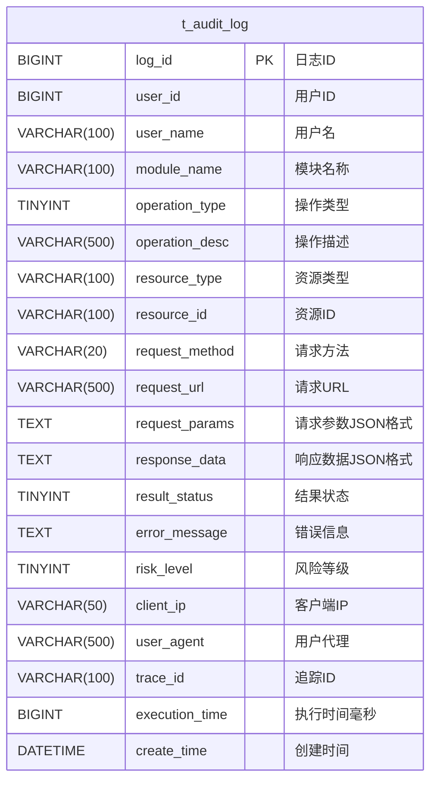
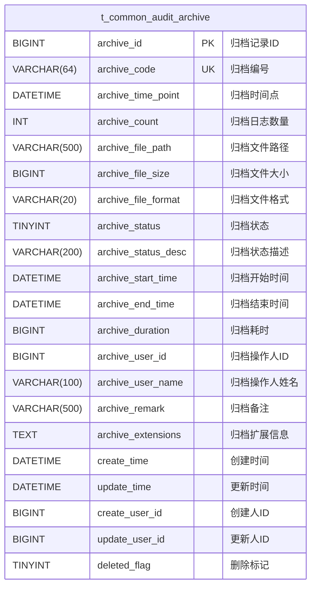
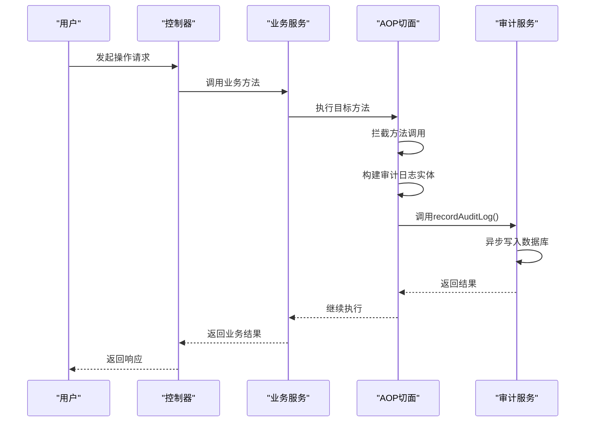
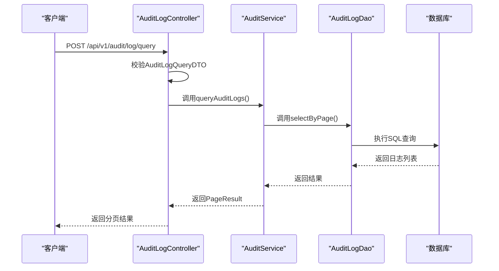
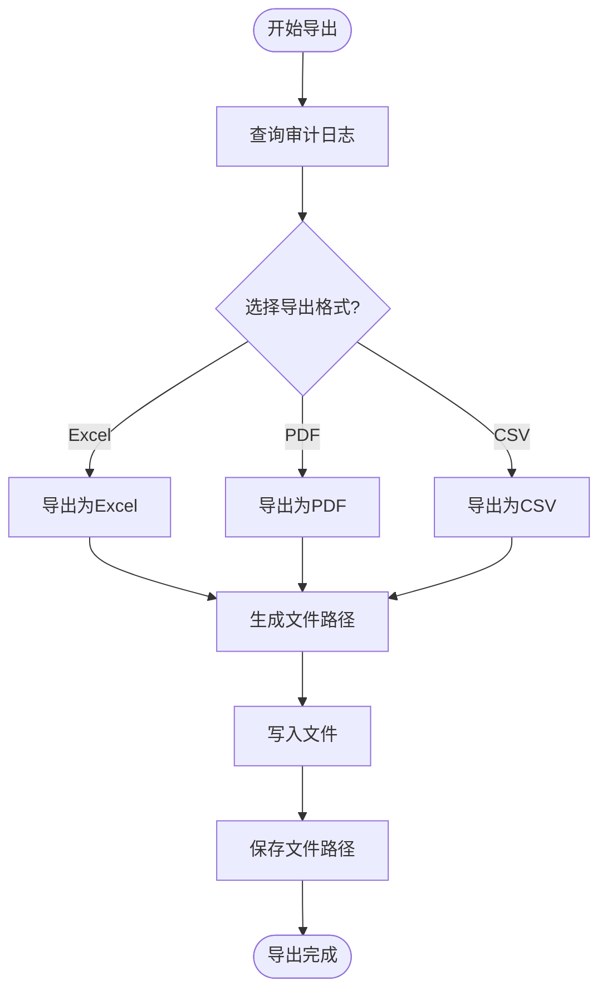
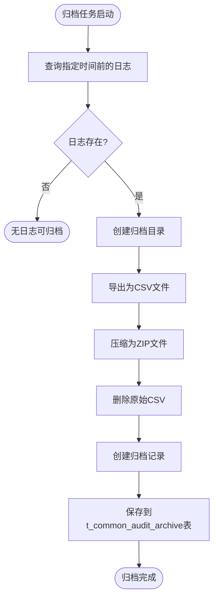

# 审计日志管理

<cite>
**本文档引用文件**   
- [10-t_audit_log.sql](file://database-scripts/common-service/10-t_audit_log.sql)
- [11-t_common_audit_archive.sql](file://database-scripts/common-service/11-t_common_audit_archive.sql)
- [AuditLogEntity.java](file://microservices/microservices-common/src/main/java/net/lab1024/sa/common/audit/entity/AuditLogEntity.java)
- [AuditArchiveEntity.java](file://microservices/microservices-common/src/main/java/net/lab1024/sa/common/audit/entity/AuditArchiveEntity.java)
- [AuditLogDao.java](file://microservices/microservices-common/src/main/java/net/lab1024/sa/common/audit/dao/AuditLogDao.java)
- [AuditArchiveDao.java](file://microservices/microservices-common/src/main/java/net/lab1024/sa/common/audit/dao/AuditArchiveDao.java)
- [AuditService.java](file://microservices/ioedream-common-service/src/main/java/net/lab1024/sa/common/audit/service/AuditService.java)
- [AuditServiceImpl.java](file://microservices/ioedream-common-service/src/main/java/net/lab1024/sa/common/audit/service/impl/AuditServiceImpl.java)
- [AuditLogController.java](file://microservices/ioedream-common-service/src/main/java/net/lab1024/sa/common/audit/controller/AuditLogController.java)
- [AuditManager.java](file://microservices/microservices-common/src/main/java/net/lab1024/sa/common/audit/manager/AuditManager.java)
- [AuditLogQueryDTO.java](file://microservices/microservices-common/src/main/java/net/lab1024/sa/common/audit/domain/dto/AuditLogQueryDTO.java)
- [performance_optimization.sql](file://database/performance_optimization.sql)
</cite>

## 目录
1. [引言](#引言)
2. [数据结构设计](#数据结构设计)
3. [日志采集机制](#日志采集机制)
4. [日志查询接口](#日志查询接口)
5. [日志导出与归档](#日志导出与归档)
6. [审计分析与第三方集成](#审计分析与第三方集成)
7. [性能优化建议](#性能优化建议)
8. [结论](#结论)

## 引言
审计日志管理是IOE-DREAM系统安全与合规性的核心组成部分。本系统通过完善的审计日志机制，全面记录用户操作、系统事件和安全活动，为系统安全、故障排查和合规审计提供可靠的数据支持。系统实现了操作日志、登录日志和数据变更日志的统一管理，具备自动采集、多维查询、安全导出和智能分析等企业级功能。

## 数据结构设计

### 审计日志表结构
审计日志表 `t_audit_log` 是系统操作记录的核心存储，其设计遵循高可用性和可扩展性原则，支持对各类操作的精细化追踪。



**字段定义说明**：
- **log_id**: 主键，自增的唯一日志标识。
- **user_id & user_name**: 记录操作用户的ID和姓名，用于身份追溯。
- **module_name**: 操作所属的业务模块，如"ACCESS"（门禁）、"CONSUME"（消费）等。
- **operation_type**: 操作类型枚举，1-查询、2-新增、3-修改、4-删除、5-导出、6-导入、7-登录、8-登出。
- **result_status**: 执行结果，1-成功、2-失败、3-异常。
- **risk_level**: 风险等级，1-低、2-中、3-高，用于安全事件分级。
- **request_params & response_data**: 以JSON格式存储请求和响应的完整数据，便于问题复现。
- **trace_id**: 分布式追踪ID，关联同一请求链路上的所有日志。

**索引策略**：
为确保查询性能，表上建立了多个关键字段的索引：
- `idx_user_id`：按用户ID查询，用于分析特定用户行为。
- `idx_module_name`：按模块名称查询，用于分析特定模块的活动。
- `idx_operation_type`：按操作类型查询，用于统计各类操作频率。
- `idx_result_status`：按结果状态查询，用于快速定位失败或异常操作。
- `idx_risk_level`：按风险等级查询，用于安全监控和告警。
- `idx_trace_id`：按追踪ID查询，用于分布式系统的问题排查。
- `idx_create_time`：按创建时间查询，这是最常用的查询条件，支持时间范围检索。

**存储周期**：
审计日志采用分级存储策略。热数据（最近3个月）存储在主数据库中，保证查询性能。历史数据通过归档机制迁移到归档存储，保留周期为2年，满足合规性要求。

**表来源**
- [10-t_audit_log.sql](file://database-scripts/common-service/10-t_audit_log.sql#L8-L37)

### 审计归档记录表结构
审计归档记录表 `t_common_audit_archive` 用于管理历史日志的归档信息，确保归档操作的可追溯性。



该表记录了每次归档任务的详细信息，包括归档时间点、文件路径、状态和操作人，为审计合规提供了完整的证据链。

**表来源**
- [11-t_common_audit_archive.sql](file://database-scripts/common-service/11-t_common_audit_archive.sql#L8-L37)

## 日志采集机制

### 基于AOP的自动日志记录
系统采用面向切面编程（AOP）技术，实现关键操作的自动化日志记录。通过定义切面，系统能够在不侵入业务代码的情况下，拦截指定的业务方法，自动捕获操作上下文并生成审计日志。



**实现流程**：
1. **拦截**: AOP切面拦截带有`@Audit`注解的业务方法。
2. **构建**: 切面从方法参数、用户会话和HTTP请求中提取用户ID、操作类型、模块名称等信息，构建`AuditLogEntity`对象。
3. **脱敏**: 在记录前，对敏感信息（如密码、身份证号）进行脱敏处理，确保日志安全。
4. **异步记录**: 调用`AuditService.recordAuditLog()`方法，该方法采用异步非阻塞方式将日志写入数据库，避免影响主业务流程性能。

**组件来源**
- [AuditServiceImpl.java](file://microservices/ioedream-common-service/src/main/java/net/lab1024/sa/common/audit/service/impl/AuditServiceImpl.java#L75-L104)
- [AuditLogEntity.java](file://microservices/microservices-common/src/main/java/net/lab1024/sa/common/audit/entity/AuditLogEntity.java#L32-L141)

## 日志查询接口

### 查询接口实现
系统提供了RESTful API来支持审计日志的多维度检索。查询接口设计灵活，支持分页和多种过滤条件。



**查询条件**：
- **时间范围**: 通过`startTime`和`endTime`精确查询特定时间段的日志。
- **用户过滤**: 通过`userId`查询特定用户的所有操作。
- **操作类型**: 通过`operationType`筛选特定类型的操作（如所有删除操作）。
- **模块过滤**: 通过`moduleName`查询特定模块（如门禁模块）的日志。
- **关键词搜索**: 通过`keyword`在用户名、操作描述或请求URL中进行模糊搜索。
- **IP地址**: 通过`clientIp`查询来自特定IP地址的操作。

**接口来源**
- [AuditLogController.java](file://microservices/ioedream-common-service/src/main/java/net/lab1024/sa/common/audit/controller/AuditLogController.java#L39-L102)
- [AuditService.java](file://microservices/ioedream-common-service/src/main/java/net/lab1024/sa/common/audit/service/AuditService.java#L44-L50)
- [AuditLogQueryDTO.java](file://microservices/microservices-common/src/main/java/net/lab1024/sa/common/audit/domain/dto/AuditLogQueryDTO.java#L14-L28)

## 日志导出与归档

### 日志导出功能
系统支持将审计日志导出为多种格式，满足不同场景的需求。



**导出流程**：
1. **查询数据**: 根据查询条件从数据库获取日志数据。
2. **格式选择**: 支持Excel、PDF和CSV三种格式，用户可按需选择。
3. **文件生成**: 使用EasyExcel生成Excel，使用iText生成PDF，直接拼接生成CSV。
4. **文件存储**: 文件存储在服务器指定目录，返回文件路径供用户下载。

**组件来源**
- [AuditManager.java](file://microservices/microservices-common/src/main/java/net/lab1024/sa/common/audit/manager/AuditManager.java#L122-L464)

### 日志归档机制
为管理海量历史日志，系统实现了自动归档策略。



**归档流程**：
1. **数据筛选**: 查询指定时间点之前的所有日志。
2. **文件导出**: 将日志数据导出为CSV格式文件。
3. **文件压缩**: 将CSV文件压缩为ZIP格式，节省存储空间。
4. **记录归档**: 创建`AuditArchiveEntity`实体，记录归档的详细信息（数量、文件路径、耗时等），并存入归档记录表。
5. **数据保留**: 原始日志数据在数据库中保留，但可通过配置策略进行物理删除。

**组件来源**
- [AuditManager.java](file://microservices/microservices-common/src/main/java/net/lab1024/sa/common/audit/manager/AuditManager.java#L497-L645)
- [AuditArchiveEntity.java](file://microservices/microservices-common/src/main/java/net/lab1024/sa/common/audit/entity/AuditArchiveEntity.java#L34-L129)

## 审计分析与第三方集成

### 审计分析功能
系统内置了丰富的审计分析功能，帮助管理员洞察系统运行状况。

- **统计分析**: 提供操作类型分布、成功率、风险等级分布等统计图表。
- **异常检测**: 分析失败操作和高风险操作，生成告警。
- **趋势分析**: 展示操作频率随时间的变化趋势，识别异常模式。

**组件来源**
- [AuditServiceImpl.java](file://microservices/ioedream-common-service/src/main/java/net/lab1024/sa/common/audit/service/impl/AuditServiceImpl.java#L230-L283)

### 第三方SIEM系统集成
系统设计了与第三方安全信息与事件管理（SIEM）系统的集成能力。

- **API接口**: 提供标准化的REST API，供SIEM系统定时拉取日志。
- **消息队列**: 可配置将日志实时推送到Kafka等消息队列，供SIEM系统消费。
- **数据格式**: 支持JSON格式的日志输出，符合通用日志标准。

## 性能优化建议

### 分表策略
对于日志量巨大的场景，建议采用分表策略。

- **按时间分表**: 将`audit_log`表按月或按季度进行水平拆分，例如`t_audit_log_202501`、`t_audit_log_202502`。
- **按模块分表**: 对于核心模块，可单独建立日志表，如`t_access_audit_log`。

```sql
-- 示例：按月分表
CREATE TABLE `t_audit_log_202501` LIKE `t_audit_log`;
CREATE TABLE `t_audit_log_202502` LIKE `t_audit_log`;
```

**SQL来源**
- [performance_optimization.sql](file://database/performance_optimization.sql)

### 异步写入
日志写入必须采用异步非阻塞方式，避免影响主业务。

- **消息队列**: 将日志写入请求放入RabbitMQ或Kafka队列，由后台消费者线程处理。
- **线程池**: 使用独立的线程池执行数据库插入操作，与业务线程隔离。

**代码来源**
- [AuditServiceImpl.java](file://microservices/ioedream-common-service/src/main/java/net/lab1024/sa/common/audit/service/impl/AuditServiceImpl.java#L75-L104)

### 索引优化
定期审查和优化索引，避免索引过多影响写入性能。

- **复合索引**: 对于经常组合查询的字段（如`user_id`和`create_time`），创建复合索引。
- **索引监控**: 使用数据库性能监控工具，识别慢查询并优化。

## 结论
IOE-DREAM系统的审计日志管理机制设计完善，从数据结构、采集、查询到归档和分析，形成了一个完整的闭环。系统通过AOP实现了无侵入的日志采集，通过分页查询和多维检索提供了强大的查询能力，并通过自动归档和导出功能满足了长期存储和合规性要求。结合异步写入和分表等性能优化策略，系统能够在保证高性能的同时，提供可靠、安全的审计日志服务。