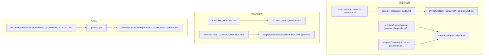
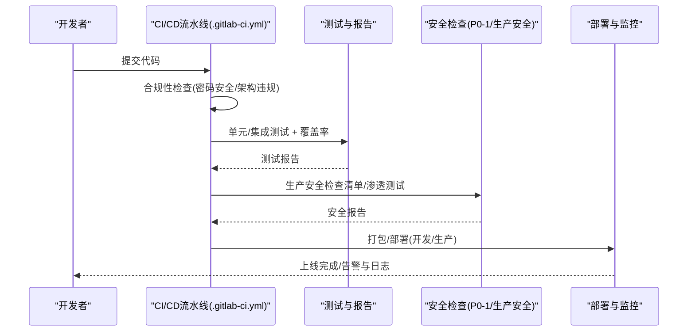
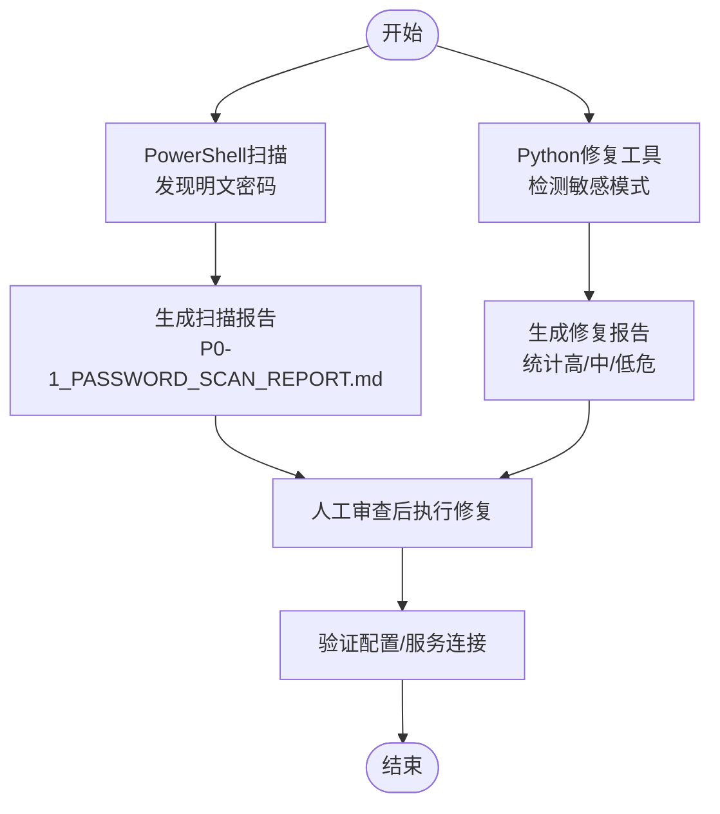
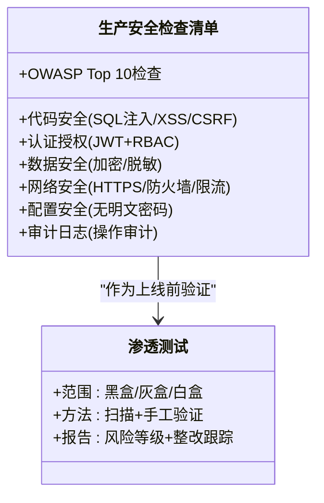
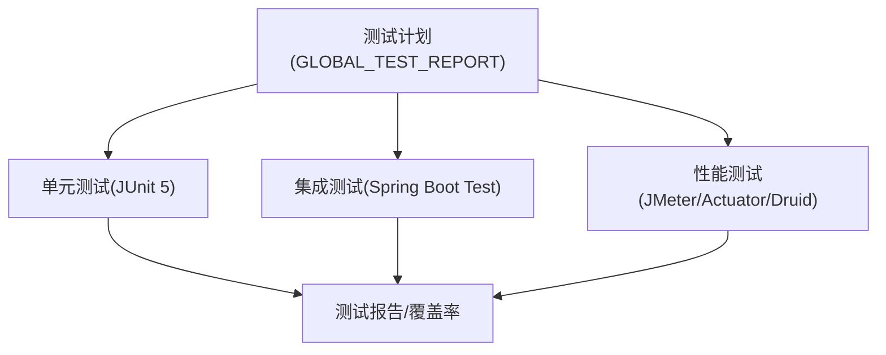
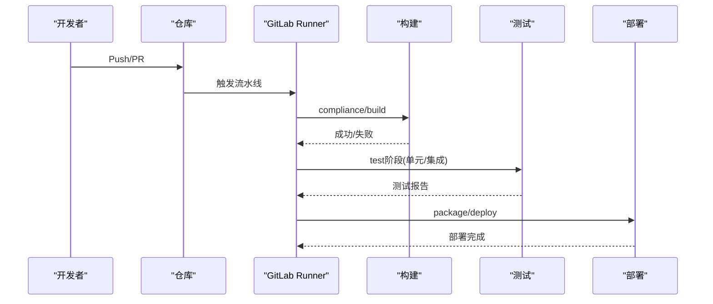
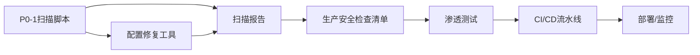

# 渗透测试与安全评估

<cite>
**本文引用的文件**
- [security_hardening_guide.md](file://security/security_hardening_guide.md)
- [PRODUCTION_SECURITY_CHECKLIST.md](file://PRODUCTION_SECURITY_CHECKLIST.md)
- [scan-passwords-simple.ps1](file://scripts/p0-security/scan-passwords-simple.ps1)
- [01-scan-passwords.ps1](file://scripts/p0-security/01-scan-passwords.ps1)
- [config-security-fix.py](file://scripts/config-security-fix.py)
- [check-plaintext-passwords.sh](file://scripts/check-plaintext-passwords.sh)
- [README_TESTING.md](file://README_TESTING.md)
- [GLOBAL_TEST_REPORT.md](file://GLOBAL_TEST_REPORT.md)
- [MERGE_TEST_CASES_CHECKLIST.md](file://MERGE_TEST_CASES_CHECKLIST.md)
- [performance_test_guide.md](file://scripts/performance/performance_test_guide.md)
- [.gitlab-ci.yml](file://.gitlab-ci.yml)
- [CICD_TRAINING_GUIDE.md](file://documentation/development/CICD_TRAINING_GUIDE.md)
- [FINAL_SUMMARY_20251202.md](file://documentation/archive/reports-2025-12-04/FINAL_SUMMARY_20251202.md)
- [PHASE0_BASELINE_SCAN_COMPLETE.md](file://documentation/archive/reports-2025-12-04/PHASE0_BASELINE_SCAN_COMPLETE.md)
- [P0-1_SCAN_SUMMARY.md](file://documentation/archive/reports-2025-12-04/P0-1_SCAN_SUMMARY.md)
- [README.md](file://README.md)
</cite>

## 目录
1. [简介](#简介)
2. [项目结构](#项目结构)
3. [核心组件](#核心组件)
4. [架构总览](#架构总览)
5. [详细组件分析](#详细组件分析)
6. [依赖关系分析](#依赖关系分析)
7. [性能考虑](#性能考虑)
8. [故障排查指南](#故障排查指南)
9. [结论](#结论)
10. [附录](#附录)

## 简介
本文件面向渗透测试与安全评估，结合仓库内现有的安全加固、配置扫描、测试与CI/CD实践，系统化阐述：
- 渗透测试流程、测试范围与方法（黑盒/灰盒/白盒）
- 常用工具与测试用例设计思路
- 测试报告生成、风险等级划分与整改跟踪
- 安全评估结果纳入持续集成，实现“安全左移”
- 典型漏洞（SQL注入、XSS、CSRF）的识别、复现要点与修复建议

## 项目结构
围绕安全与测试的关键目录与文件如下：
- 安全加固与检查：security、scripts/p0-security、scripts/config-security-fix.py、scripts/check-plaintext-passwords.sh
- 生产安全检查清单：PRODUCTION_SECURITY_CHECKLIST.md
- 测试与报告：README_TESTING.md、GLOBAL_TEST_REPORT.md、MERGE_TEST_CASES_CHECKLIST.md、scripts/performance/performance_test_guide.md
- CI/CD与流水线：.gitlab-ci.yml、documentation/development/CICD_TRAINING_GUIDE.md、documentation/development/FINAL_SUMMARY_20251202.md
- 历史扫描与基线：documentation/archive/…/PHASE0_BASELINE_SCAN_COMPLETE.md、documentation/archive/…/P0-1_SCAN_SUMMARY.md

图表来源
- [security_hardening_guide.md](file://security/security_hardening_guide.md#L1-L485)
- [PRODUCTION_SECURITY_CHECKLIST.md](file://PRODUCTION_SECURITY_CHECKLIST.md#L1-L562)
- [scan-passwords-simple.ps1](file://scripts/p0-security/scan-passwords-simple.ps1#L1-L234)
- [01-scan-passwords.ps1](file://scripts/p0-security/01-scan-passwords.ps1#L1-L326)
- [config-security-fix.py](file://scripts/config-security-fix.py#L51-L360)
- [check-plaintext-passwords.sh](file://scripts/check-plaintext-passwords.sh#L135-L171)
- [README_TESTING.md](file://README_TESTING.md#L1-L97)
- [GLOBAL_TEST_REPORT.md](file://GLOBAL_TEST_REPORT.md#L1-L316)
- [MERGE_TEST_CASES_CHECKLIST.md](file://MERGE_TEST_CASES_CHECKLIST.md#L538-L625)
- [performance_test_guide.md](file://scripts/performance/performance_test_guide.md#L1-L179)
- [.gitlab-ci.yml](file://.gitlab-ci.yml#L1-L305)
- [CICD_TRAINING_GUIDE.md](file://documentation/development/CICD_TRAINING_GUIDE.md#L223-L282)
- [FINAL_SUMMARY_20251202.md](file://documentation/development/FINAL_SUMMARY_20251202.md#L176-L212)

章节来源
- [security_hardening_guide.md](file://security/security_hardening_guide.md#L1-L485)
- [PRODUCTION_SECURITY_CHECKLIST.md](file://PRODUCTION_SECURITY_CHECKLIST.md#L1-L562)

## 核心组件
- 配置安全扫描与修复：PowerShell脚本与Python工具，用于发现明文密码、弱密码、默认账户等风险，并生成报告与修复建议。
- 生产安全检查清单：覆盖代码安全（SQL注入/XSS/CSRF）、认证授权、数据安全、网络安全、配置安全、审计日志、OWASP Top 10检查与加固建议。
- 测试与性能：测试计划、测试报告、性能测试指南，支撑安全测试与回归验证。
- CI/CD流水线：GitLab流水线与GitHub Actions工作流，将合规检查、测试与打包部署串联，形成“安全左移”的闭环。

章节来源
- [scan-passwords-simple.ps1](file://scripts/p0-security/scan-passwords-simple.ps1#L1-L234)
- [01-scan-passwords.ps1](file://scripts/p0-security/01-scan-passwords.ps1#L1-L326)
- [config-security-fix.py](file://scripts/config-security-fix.py#L51-L360)
- [check-plaintext-passwords.sh](file://scripts/check-plaintext-passwords.sh#L135-L171)
- [PRODUCTION_SECURITY_CHECKLIST.md](file://PRODUCTION_SECURITY_CHECKLIST.md#L1-L562)
- [README_TESTING.md](file://README_TESTING.md#L1-L97)
- [GLOBAL_TEST_REPORT.md](file://GLOBAL_TEST_REPORT.md#L1-L316)
- [performance_test_guide.md](file://scripts/performance/performance_test_guide.md#L1-L179)
- [.gitlab-ci.yml](file://.gitlab-ci.yml#L1-L305)
- [CICD_TRAINING_GUIDE.md](file://documentation/development/CICD_TRAINING_GUIDE.md#L223-L282)
- [FINAL_SUMMARY_20251202.md](file://documentation/development/FINAL_SUMMARY_20251202.md#L176-L212)

## 架构总览
安全左移的端到端流程（基于仓库现有能力）：
- 开发阶段：提交前合规检查（密码安全、架构规范），单元/集成测试，覆盖率报告
- 构建阶段：Maven编译、Docker镜像构建
- 部署阶段：开发/生产环境部署，健康检查
- 安全阶段：生产安全检查清单、渗透测试、漏洞扫描、性能测试、审计日志

图表来源
- [.gitlab-ci.yml](file://.gitlab-ci.yml#L1-L305)
- [CICD_TRAINING_GUIDE.md](file://documentation/development/CICD_TRAINING_GUIDE.md#L223-L282)
- [README_TESTING.md](file://README_TESTING.md#L1-L97)
- [GLOBAL_TEST_REPORT.md](file://GLOBAL_TEST_REPORT.md#L1-L316)
- [PRODUCTION_SECURITY_CHECKLIST.md](file://PRODUCTION_SECURITY_CHECKLIST.md#L1-L562)

## 详细组件分析

### 组件A：配置安全扫描与修复（P0-1）
- 目标：发现明文密码、弱密码、默认账户等高风险配置
- 工具链：
  - PowerShell扫描脚本：扫描YAML配置文件，定位数据库/Redis/Nacos密码字段，生成报告与环境变量模板
  - Python修复工具：检测敏感模式（弱密码、空密码、JDBC明文、默认账户），支持自动生成修复报告与批量修复
  - Shell脚本：明文密码检查与后续整改建议
- 输出：扫描报告、修复建议、环境变量模板、修复统计

图表来源
- [scan-passwords-simple.ps1](file://scripts/p0-security/scan-passwords-simple.ps1#L1-L234)
- [01-scan-passwords.ps1](file://scripts/p0-security/01-scan-passwords.ps1#L1-L326)
- [config-security-fix.py](file://scripts/config-security-fix.py#L51-L360)
- [check-plaintext-passwords.sh](file://scripts/check-plaintext-passwords.sh#L135-L171)

章节来源
- [scan-passwords-simple.ps1](file://scripts/p0-security/scan-passwords-simple.ps1#L1-L234)
- [01-scan-passwords.ps1](file://scripts/p0-security/01-scan-passwords.ps1#L1-L326)
- [config-security-fix.py](file://scripts/config-security-fix.py#L51-L360)
- [check-plaintext-passwords.sh](file://scripts/check-plaintext-passwords.sh#L135-L171)
- [P0-1_SCAN_SUMMARY.md](file://documentation/archive/reports-2025-12-04/P0-1_SCAN_SUMMARY.md#L237-L313)
- [PHASE0_BASELINE_SCAN_COMPLETE.md](file://documentation/archive/reports-2025-12-04/PHASE0_BASELINE_SCAN_COMPLETE.md#L105-L173)

### 组件B：生产安全检查清单与渗透测试
- 生产安全检查清单覆盖：
  - 代码安全：SQL注入/XSS/CSRF防护完善
  - 认证授权：JWT+RBAC实现完整
  - 数据安全：敏感数据加密与脱敏
  - 网络安全：HTTPS/TLS/HSTS/防火墙/限流
  - 配置安全：无明文密码
  - 审计日志：操作审计与日志归档
  - OWASP Top 10检查与加固建议
- 渗透测试：作为上线前验证环节，结合OWASP Top 10与生产检查清单进行验证

图表来源
- [PRODUCTION_SECURITY_CHECKLIST.md](file://PRODUCTION_SECURITY_CHECKLIST.md#L1-L562)

章节来源
- [PRODUCTION_SECURITY_CHECKLIST.md](file://PRODUCTION_SECURITY_CHECKLIST.md#L1-L562)

### 组件C：测试与性能（支撑安全测试）
- 测试计划与工具：单元测试（JUnit 5/Mockito）、集成测试（Spring Boot Test）、覆盖率（JaCoCo）、E2E（uni-app）
- 性能测试：JMeter、Actuator、Druid监控、指标断言
- 测试报告：覆盖范围、类型、规范与质量评估

图表来源
- [README_TESTING.md](file://README_TESTING.md#L1-L97)
- [GLOBAL_TEST_REPORT.md](file://GLOBAL_TEST_REPORT.md#L1-L316)
- [MERGE_TEST_CASES_CHECKLIST.md](file://MERGE_TEST_CASES_CHECKLIST.md#L538-L625)
- [performance_test_guide.md](file://scripts/performance/performance_test_guide.md#L1-L179)

章节来源
- [README_TESTING.md](file://README_TESTING.md#L1-L97)
- [GLOBAL_TEST_REPORT.md](file://GLOBAL_TEST_REPORT.md#L1-L316)
- [MERGE_TEST_CASES_CHECKLIST.md](file://MERGE_TEST_CASES_CHECKLIST.md#L538-L625)
- [performance_test_guide.md](file://scripts/performance/performance_test_guide.md#L1-L179)

### 组件D：CI/CD与安全左移
- GitLab流水线：合规检查、编译、测试、打包、部署
- GitHub Actions工作流：触发条件与任务
- 培训与文档：CI/CD培训材料、流水线阶段说明

图表来源
- [.gitlab-ci.yml](file://.gitlab-ci.yml#L1-L305)
- [CICD_TRAINING_GUIDE.md](file://documentation/development/CICD_TRAINING_GUIDE.md#L223-L282)
- [FINAL_SUMMARY_20251202.md](file://documentation/development/FINAL_SUMMARY_20251202.md#L176-L212)

章节来源
- [.gitlab-ci.yml](file://.gitlab-ci.yml#L1-L305)
- [CICD_TRAINING_GUIDE.md](file://documentation/development/CICD_TRAINING_GUIDE.md#L223-L282)
- [FINAL_SUMMARY_20251202.md](file://documentation/development/FINAL_SUMMARY_20251202.md#L176-L212)

## 依赖关系分析
- 配置安全扫描依赖于微服务配置文件（YAML），扫描结果驱动修复工具与报告生成
- 生产安全检查清单与渗透测试相互印证，前者用于上线前验证，后者用于专项评估
- 测试与性能工具为安全测试提供基础数据与回归验证
- CI/CD流水线将安全检查与测试串联，形成“安全左移”的闭环

图表来源
- [scan-passwords-simple.ps1](file://scripts/p0-security/scan-passwords-simple.ps1#L1-L234)
- [config-security-fix.py](file://scripts/config-security-fix.py#L51-L360)
- [PRODUCTION_SECURITY_CHECKLIST.md](file://PRODUCTION_SECURITY_CHECKLIST.md#L1-L562)
- [.gitlab-ci.yml](file://.gitlab-ci.yml#L1-L305)

章节来源
- [scan-passwords-simple.ps1](file://scripts/p0-security/scan-passwords-simple.ps1#L1-L234)
- [config-security-fix.py](file://scripts/config-security-fix.py#L51-L360)
- [PRODUCTION_SECURITY_CHECKLIST.md](file://PRODUCTION_SECURITY_CHECKLIST.md#L1-L562)
- [.gitlab-ci.yml](file://.gitlab-ci.yml#L1-L305)

## 性能考虑
- 性能测试工具与指标：JMeter、Actuator、Druid监控、Micrometer指标
- 性能测试场景：缓存命中率、查询响应时间、连接池利用率、系统TPS
- 性能报告模板与注意事项，确保测试环境隔离与资源监控

章节来源
- [performance_test_guide.md](file://scripts/performance/performance_test_guide.md#L1-L179)

## 故障排查指南
- 配置安全扫描常见问题：
  - 执行策略错误：使用Bypass参数或临时设置执行策略
  - 路径不正确：确保项目根目录与微服务目录路径一致
  - 报告目录不存在：脚本会自动创建reports目录
- 渗透测试与安全评估：
  - 依据生产安全检查清单逐项核对
  - 结合OWASP Top 10进行针对性验证
  - 利用测试与性能报告进行回归验证

章节来源
- [scan-passwords-simple.ps1](file://scripts/p0-security/scan-passwords-simple.ps1#L1-L234)
- [01-scan-passwords.ps1](file://scripts/p0-security/01-scan-passwords.ps1#L1-L326)
- [PRODUCTION_SECURITY_CHECKLIST.md](file://PRODUCTION_SECURITY_CHECKLIST.md#L1-L562)

## 结论
本仓库已具备较为完善的“安全左移”基础：配置安全扫描与修复、生产安全检查清单、测试与性能工具、以及CI/CD流水线。建议在现有基础上：
- 将渗透测试纳入CI/CD流水线（如在测试阶段增加安全扫描与手工验证）
- 建立标准化的测试报告与风险等级划分机制
- 将整改跟踪与修复验证纳入流水线，形成闭环

[本节不直接分析具体文件，故无章节来源]

## 附录

### A. 渗透测试流程与方法
- 流程建议：
  - 前期准备：确定范围（目标系统、接口、数据）、制定计划、准备工具
  - 信息收集：黑盒（公开信息、网络拓扑、域名/子域名、端口/服务）
  - 漏洞发现：灰盒（结合源代码与接口）、白盒（深入源码与数据库）
  - 验证与复现：针对SQL注入、XSS、CSRF等典型漏洞进行验证
  - 报告与整改：风险等级划分、整改建议、跟踪验证
- 方法选择：
  - 黑盒：适合边界测试与业务流程验证
  - 灰盒：适合接口与源码交叉验证
  - 白盒：适合深入代码与数据库层面的漏洞挖掘

[本节为概念性说明，不直接分析具体文件，故无章节来源]

### B. 常用工具与测试用例设计
- 工具参考：
  - Burp Suite：代理抓包、接口测试、漏洞扫描
  - Nmap：端口扫描、服务识别
  - SQLMap：SQL注入自动化验证
  - JMeter：性能与压测
- 测试用例设计：
  - 输入验证：边界值、特殊字符、超长字符串
  - 权限验证：越权访问、权限绕过
  - 会话与CSRF：Token有效性、SameSite、Referer校验
  - 数据库：参数化查询、存储过程、动态SQL

[本节为概念性说明，不直接分析具体文件，故无章节来源]

### C. 典型漏洞复现与修复建议（基于仓库安全实践）
- SQL注入
  - 识别：参数化查询（MyBatis #{}/LambdaQueryWrapper）
  - 防护：禁止字符串拼接（${}）、动态SQL参数化
  - 证据：生产安全检查清单中SQL注入防护通过
- XSS
  - 识别：前端输入验证、后端参数校验、HTML转义、CSP
  - 防护：Spring自动转义、CSP策略配置
  - 证据：生产安全检查清单中XSS防护通过
- CSRF
  - 识别：POST/PUT/DELETE接口是否验证CSRF Token
  - 防护：SameSite Cookie、Referer验证
  - 证据：生产安全检查清单中CSRF已启用

章节来源
- [PRODUCTION_SECURITY_CHECKLIST.md](file://PRODUCTION_SECURITY_CHECKLIST.md#L1-L562)

### D. 安全评估结果纳入CI/CD（安全左移）
- 在CI/CD中集成安全检查：
  - 合规检查：密码安全检查、架构违规检查
  - 安全扫描：依赖包安全扫描（OWASP Dependency-Check）
  - 测试验证：单元/集成/性能测试
- 流水线阶段映射：
  - compliance：合规性检查（含密码安全）
  - build：编译构建
  - test：单元/集成测试
  - package：打包与Docker镜像构建
  - deploy：部署到开发/生产环境

章节来源
- [.gitlab-ci.yml](file://.gitlab-ci.yml#L1-L305)
- [CICD_TRAINING_GUIDE.md](file://documentation/development/CICD_TRAINING_GUIDE.md#L223-L282)
- [FINAL_SUMMARY_20251202.md](file://documentation/development/FINAL_SUMMARY_20251202.md#L176-L212)