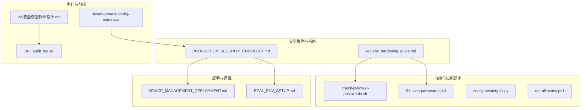
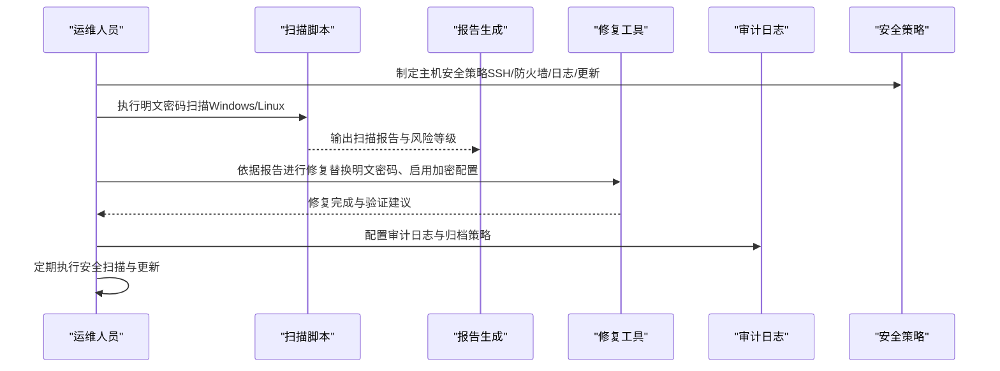
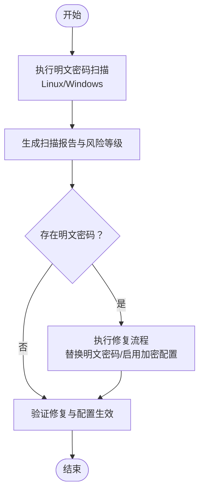
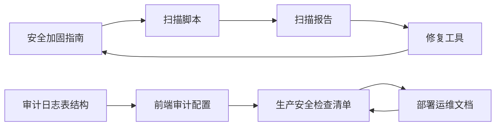

# 主机安全

<cite>
**本文引用的文件**
- [security_hardening_guide.md](file://security/security_hardening_guide.md)
- [PRODUCTION_SECURITY_CHECKLIST.md](file://PRODUCTION_SECURITY_CHECKLIST.md)
- [check-plaintext-passwords.sh](file://scripts/check-plaintext-passwords.sh)
- [01-scan-passwords.ps1](file://scripts/p0-security/01-scan-passwords.ps1)
- [config-security-fix.py](file://scripts/config-security-fix.py)
- [run-all-scans.ps1](file://scripts/compliance-scan/run-all-scans.ps1)
- [DEVICE_MANAGEMENT_DEPLOYMENT.md](file://documentation/04-部署运维/DEVICE_MANAGEMENT_DEPLOYMENT.md)
- [REAL_ENV_SETUP.md](file://documentation/04-部署运维/REAL_ENV_SETUP.md)
- [02-安全级别详细设计.md](file://documentation/03-业务模块/各业务模块文档/智能视频/02-安全级别详细设计.md)
- [10-t_audit_log.sql](file://database-scripts/common-service/10-t_audit_log.sql)
- [level3-protect-config-index.vue](file://smart-admin-web-javascript/src/views/support/level3protect/level3-protect-config-index.vue)
</cite>

## 目录
1. [简介](#简介)
2. [项目结构](#项目结构)
3. [核心组件](#核心组件)
4. [架构总览](#架构总览)
5. [详细组件分析](#详细组件分析)
6. [依赖分析](#依赖分析)
7. [性能考虑](#性能考虑)
8. [故障排查指南](#故障排查指南)
9. [结论](#结论)
10. [附录](#附录)

## 简介
本文件面向服务器操作系统层面的主机安全加固，结合仓库中现有的安全策略、扫描脚本与检查清单，系统化阐述以下主题：
- SSH安全配置（禁用root登录、使用密钥认证、修改默认端口）
- 防火墙规则配置（使用iptables或ufw限制端口访问）
- 系统用户权限管理（最小权限原则）
- 关键服务的运行账户隔离
- 系统日志审计配置（审计日志与归档）
- 定期安全更新策略
- 通过自动化脚本检测系统中的安全漏洞与配置偏差，并提供实际加固操作步骤与验证方法

## 项目结构
围绕主机安全，仓库中与之直接相关的文件主要分布在以下位置：
- security：安全加固指南与策略
- scripts：安全扫描与合规性扫描脚本
- documentation：部署运维与安全检查清单
- database-scripts：审计日志表结构
- smart-admin-web-javascript：安全策略配置前端界面

图表来源
- [security_hardening_guide.md](file://security/security_hardening_guide.md#L1-L485)
- [PRODUCTION_SECURITY_CHECKLIST.md](file://PRODUCTION_SECURITY_CHECKLIST.md#L1-L562)
- [check-plaintext-passwords.sh](file://scripts/check-plaintext-passwords.sh#L1-L171)
- [01-scan-passwords.ps1](file://scripts/p0-security/01-scan-passwords.ps1#L1-L326)
- [config-security-fix.py](file://scripts/config-security-fix.py#L229-L360)
- [run-all-scans.ps1](file://scripts/compliance-scan/run-all-scans.ps1#L1-L157)
- [DEVICE_MANAGEMENT_DEPLOYMENT.md](file://documentation/04-部署运维/DEVICE_MANAGEMENT_DEPLOYMENT.md#L548-L556)
- [REAL_ENV_SETUP.md](file://documentation/04-部署运维/REAL_ENV_SETUP.md#L1-L144)
- [02-安全级别详细设计.md](file://documentation/03-业务模块/各业务模块文档/智能视频/02-安全级别详细设计.md#L805-L901)
- [10-t_audit_log.sql](file://database-scripts/common-service/10-t_audit_log.sql#L24-L38)
- [level3-protect-config-index.vue](file://smart-admin-web-javascript/src/views/support/level3protect/level3-protect-config-index.vue#L82-L165)

章节来源
- [security_hardening_guide.md](file://security/security_hardening_guide.md#L1-L485)
- [PRODUCTION_SECURITY_CHECKLIST.md](file://PRODUCTION_SECURITY_CHECKLIST.md#L1-L562)

## 核心组件
- 安全加固指南：定义了HTTPS、会话安全、密码策略、Nacos加密配置等企业级安全标准。
- 生产安全检查清单：涵盖代码安全、认证授权、数据安全、网络安全、配置安全、审计日志等维度，并提供防火墙端口开放策略与HTTPS/TLS/HSTS配置示例。
- 配置安全扫描脚本：提供明文密码扫描与报告生成能力，支持Windows与Linux双端脚本。
- 审计日志表结构：定义了统一的审计日志表字段与索引，支撑操作审计与合规归档。
- 三级等保前端配置：提供登录失败锁定、会话超时、密码复杂度、双因子登录等策略开关与默认值。

章节来源
- [security_hardening_guide.md](file://security/security_hardening_guide.md#L270-L404)
- [PRODUCTION_SECURITY_CHECKLIST.md](file://PRODUCTION_SECURITY_CHECKLIST.md#L207-L260)
- [check-plaintext-passwords.sh](file://scripts/check-plaintext-passwords.sh#L1-L171)
- [01-scan-passwords.ps1](file://scripts/p0-security/01-scan-passwords.ps1#L1-L326)
- [10-t_audit_log.sql](file://database-scripts/common-service/10-t_audit_log.sql#L24-L38)
- [level3-protect-config-index.vue](file://smart-admin-web-javascript/src/views/support/level3protect/level3-protect-config-index.vue#L82-L165)

## 架构总览
主机安全加固的整体流程由“策略制定—扫描检测—修复整改—持续监控”构成，结合仓库中的脚本与清单，形成闭环。

图表来源
- [check-plaintext-passwords.sh](file://scripts/check-plaintext-passwords.sh#L1-L171)
- [01-scan-passwords.ps1](file://scripts/p0-security/01-scan-passwords.ps1#L1-L326)
- [config-security-fix.py](file://scripts/config-security-fix.py#L229-L360)
- [PRODUCTION_SECURITY_CHECKLIST.md](file://PRODUCTION_SECURITY_CHECKLIST.md#L207-L260)
- [10-t_audit_log.sql](file://database-scripts/common-service/10-t_audit_log.sql#L24-L38)

## 详细组件分析

### SSH安全配置
- 禁用root登录：生产环境应禁止root直接登录，使用普通用户+sudo提权。
- 使用密钥认证：禁用密码登录，强制使用SSH公私钥认证。
- 修改默认端口：将SSH默认端口22改为非标准端口，降低自动化扫描命中率。
- 限制来源与白名单：仅允许内网或特定IP访问SSH端口。
- 会话与超时：合理设置客户端保持与空闲超时，减少长期占用。

加固步骤（基于仓库中的生产检查清单与部署文档）：
1. 修改SSH配置，禁用root登录与密码认证，启用密钥认证。
2. 将SSH端口从22改为非标准端口（如2222），并在防火墙放行该端口。
3. 限制SSH访问来源，仅允许内网或白名单IP。
4. 配置会话超时与客户端保持。
5. 验证：使用密钥登录并确认无法使用密码登录。

验证方法：
- 通过密钥登录测试连通性。
- 使用防火墙规则验证仅白名单IP可访问SSH端口。
- 检查SSH配置生效状态与日志。

章节来源
- [PRODUCTION_SECURITY_CHECKLIST.md](file://PRODUCTION_SECURITY_CHECKLIST.md#L239-L260)
- [DEVICE_MANAGEMENT_DEPLOYMENT.md](file://documentation/04-部署运维/DEVICE_MANAGEMENT_DEPLOYMENT.md#L548-L556)

### 防火墙规则配置（iptables/ufw）
- 开放端口清单：HTTPS（443）公网开放；SSH（22/自定义端口）仅内网+白名单；数据库（3306）、缓存（6379）、配置中心（8848）仅内网。
- iptables规则示例：允许HTTPS访问；限制数据库端口仅内网网段放行；其他端口默认DROP。
- ufw策略：若使用ufw，建议与iptables策略一致，仅放行必要端口并限制来源。

加固步骤：
1. 在服务器上配置iptables/ufw，按清单放行端口并限制来源。
2. 对数据库、缓存、配置中心等内网only端口，仅允许内网网段访问。
3. 默认策略设置为DROP，确保未显式放行的流量被阻断。
4. 验证：使用不同来源IP测试端口可达性，确认策略生效。

验证方法：
- 从公网尝试访问SSH/数据库端口，应被拒绝。
- 从内网白名单IP访问SSH/数据库端口，应放行。
- 使用防火墙命令查看规则链与计数器。

章节来源
- [PRODUCTION_SECURITY_CHECKLIST.md](file://PRODUCTION_SECURITY_CHECKLIST.md#L239-L260)

### 系统用户权限管理（最小权限原则）
- 用户账户：仅保留必要管理员账户，禁用root直连，使用普通用户+sudo。
- 权限最小化：为每个服务创建独立系统用户，限制其文件与网络访问范围。
- 密钥与配置：敏感配置通过环境变量或加密配置中心注入，避免明文存储在文件系统。

加固步骤：
1. 创建服务专用系统用户，限制shell与home目录权限。
2. 将服务运行账户与系统用户绑定，确保最小权限。
3. 使用加密配置中心或环境变量注入敏感信息，避免明文密码。
4. 验证：以服务账户启动服务，确认无多余权限。

章节来源
- [PRODUCTION_SECURITY_CHECKLIST.md](file://PRODUCTION_SECURITY_CHECKLIST.md#L437-L473)
- [security_hardening_guide.md](file://security/security_hardening_guide.md#L270-L325)

### 关键服务的运行账户隔离
- 网关、微服务、数据库、缓存、配置中心等均应使用独立系统用户运行。
- 使用systemd或容器编排工具限定用户与资源限制。
- 服务间通信通过内网only端口与TLS加密。

加固步骤：
1. 为每个服务创建独立系统用户与组。
2. 在systemd或容器中指定User=与Group=。
3. 限制服务监听端口仅内网访问。
4. 验证：以独立用户身份启动服务，确认进程与文件权限符合最小权限。

章节来源
- [REAL_ENV_SETUP.md](file://documentation/04-部署运维/REAL_ENV_SETUP.md#L1-L144)
- [PRODUCTION_SECURITY_CHECKLIST.md](file://PRODUCTION_SECURITY_CHECKLIST.md#L239-L260)

### 系统日志审计配置（auditd）
- 审计日志表结构：统一审计日志表字段与索引，便于检索与归档。
- 审计范围：登录登出、权限变更、敏感数据访问、配置变更等。
- 归档与保留：按策略定期归档与清理，满足合规要求。

加固步骤：
1. 在系统中启用审计守护进程（auditd），配置规则集。
2. 将审计日志写入统一位置，并与数据库审计表对接。
3. 设置日志轮转与压缩归档，配置保留周期。
4. 验证：触发审计事件，确认日志落盘与查询可用。

章节来源
- [02-安全级别详细设计.md](file://documentation/03-业务模块/各业务模块文档/智能视频/02-安全级别详细设计.md#L805-L901)
- [10-t_audit_log.sql](file://database-scripts/common-service/10-t_audit_log.sql#L24-L38)

### 定期安全更新策略
- 系统与依赖：定期更新操作系统与依赖库，修复已知漏洞。
- 安全扫描：定期执行依赖包扫描与架构/合规扫描，及时发现风险。
- 回滚与演练：建立回滚方案与演练计划，确保更新安全可控。

加固步骤：
1. 制定系统与依赖更新计划，纳入CI/CD流水线。
2. 使用扫描脚本定期执行安全扫描与合规检查。
3. 对高危漏洞制定修复优先级与时间表。
4. 验证：更新后进行功能回归与安全验证。

章节来源
- [DEVICE_MANAGEMENT_DEPLOYMENT.md](file://documentation/04-部署运维/DEVICE_MANAGEMENT_DEPLOYMENT.md#L548-L556)
- [run-all-scans.ps1](file://scripts/compliance-scan/run-all-scans.ps1#L1-L157)

### 自动化脚本检测与修复
- 明文密码扫描：支持Linux与Windows双端脚本，扫描配置文件中的明文密码并生成报告。
- 配置修复工具：Python工具可检测配置安全问题并生成修复报告，支持自动修复与报告输出。
- 合规性扫描：一键执行多个扫描脚本并汇总报告，便于持续监控。

图表来源
- [check-plaintext-passwords.sh](file://scripts/check-plaintext-passwords.sh#L1-L171)
- [01-scan-passwords.ps1](file://scripts/p0-security/01-scan-passwords.ps1#L1-L326)
- [config-security-fix.py](file://scripts/config-security-fix.py#L229-L360)

章节来源
- [check-plaintext-passwords.sh](file://scripts/check-plaintext-passwords.sh#L1-L171)
- [01-scan-passwords.ps1](file://scripts/p0-security/01-scan-passwords.ps1#L1-L326)
- [config-security-fix.py](file://scripts/config-security-fix.py#L229-L360)
- [run-all-scans.ps1](file://scripts/compliance-scan/run-all-scans.ps1#L1-L157)

## 依赖分析
- 策略与脚本耦合：安全加固指南与生产检查清单为脚本提供策略依据；脚本输出的报告驱动修复与验证。
- 审计与存储耦合：审计日志表结构与前端配置共同支撑审计策略落地与可视化。
- 部署与运维耦合：部署文档中的安全加固建议与检查清单相互印证，确保上线前安全基线达标。

图表来源
- [security_hardening_guide.md](file://security/security_hardening_guide.md#L1-L485)
- [PRODUCTION_SECURITY_CHECKLIST.md](file://PRODUCTION_SECURITY_CHECKLIST.md#L1-L562)
- [check-plaintext-passwords.sh](file://scripts/check-plaintext-passwords.sh#L1-L171)
- [01-scan-passwords.ps1](file://scripts/p0-security/01-scan-passwords.ps1#L1-L326)
- [config-security-fix.py](file://scripts/config-security-fix.py#L229-L360)
- [10-t_audit_log.sql](file://database-scripts/common-service/10-t_audit_log.sql#L24-L38)
- [level3-protect-config-index.vue](file://smart-admin-web-javascript/src/views/support/level3protect/level3-protect-config-index.vue#L82-L165)
- [REAL_ENV_SETUP.md](file://documentation/04-部署运维/REAL_ENV_SETUP.md#L1-L144)

## 性能考虑
- 审计日志写入：审计日志量较大，建议启用异步写入与批量落盘，避免阻塞系统。
- 防火墙规则：规则过多会影响包转发性能，建议合并同类规则并定期清理无效规则。
- 更新策略：系统更新与依赖升级应安排在低峰时段，避免影响业务。

## 故障排查指南
- SSH无法登录
  - 检查是否禁用了密码登录，确认密钥配置正确。
  - 核对SSH端口是否修改且防火墙已放行。
  - 检查来源IP是否在白名单内。
- 端口不可达
  - 检查iptables/ufw规则是否正确放行目标端口与来源。
  - 确认默认策略为DROP，仅允许必要的端口。
- 审计日志缺失
  - 检查auditd服务状态与规则配置。
  - 确认审计日志路径与权限，核对归档策略。
- 明文密码问题
  - 使用扫描脚本定位配置文件，替换为加密配置或环境变量注入。
  - 修复后验证服务启动与连接正常。

章节来源
- [check-plaintext-passwords.sh](file://scripts/check-plaintext-passwords.sh#L1-L171)
- [01-scan-passwords.ps1](file://scripts/p0-security/01-scan-passwords.ps1#L1-L326)
- [PRODUCTION_SECURITY_CHECKLIST.md](file://PRODUCTION_SECURITY_CHECKLIST.md#L239-L260)

## 结论
通过仓库中的安全加固指南、生产检查清单与自动化扫描脚本，可以构建一套完善的主机安全加固体系。建议在生产环境中严格执行：
- SSH密钥认证与端口变更、来源限制
- 防火墙最小化放行与默认DROP策略
- 系统用户最小权限与服务账户隔离
- 审计日志与归档策略
- 定期安全更新与扫描

## 附录
- 审计日志字段与索引参考：[10-t_audit_log.sql](file://database-scripts/common-service/10-t_audit_log.sql#L24-L38)
- 三级等保安全策略前端配置：[level3-protect-config-index.vue](file://smart-admin-web-javascript/src/views/support/level3protect/level3-protect-config-index.vue#L82-L165)
- 明文密码扫描脚本（Linux）：[check-plaintext-passwords.sh](file://scripts/check-plaintext-passwords.sh#L1-L171)
- 明文密码扫描脚本（Windows）：[01-scan-passwords.ps1](file://scripts/p0-security/01-scan-passwords.ps1#L1-L326)
- 配置安全修复工具：[config-security-fix.py](file://scripts/config-security-fix.py#L229-L360)
- 合规性扫描汇总：[run-all-scans.ps1](file://scripts/compliance-scan/run-all-scans.ps1#L1-L157)
- 生产安全检查清单：[PRODUCTION_SECURITY_CHECKLIST.md](file://PRODUCTION_SECURITY_CHECKLIST.md#L1-L562)
- 部署与安全加固建议：[DEVICE_MANAGEMENT_DEPLOYMENT.md](file://documentation/04-部署运维/DEVICE_MANAGEMENT_DEPLOYMENT.md#L548-L556)
- 实战部署手册（含安全相关建议）：[REAL_ENV_SETUP.md](file://documentation/04-部署运维/REAL_ENV_SETUP.md#L1-L144)