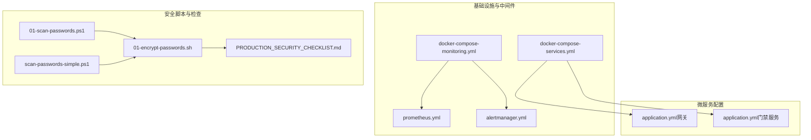
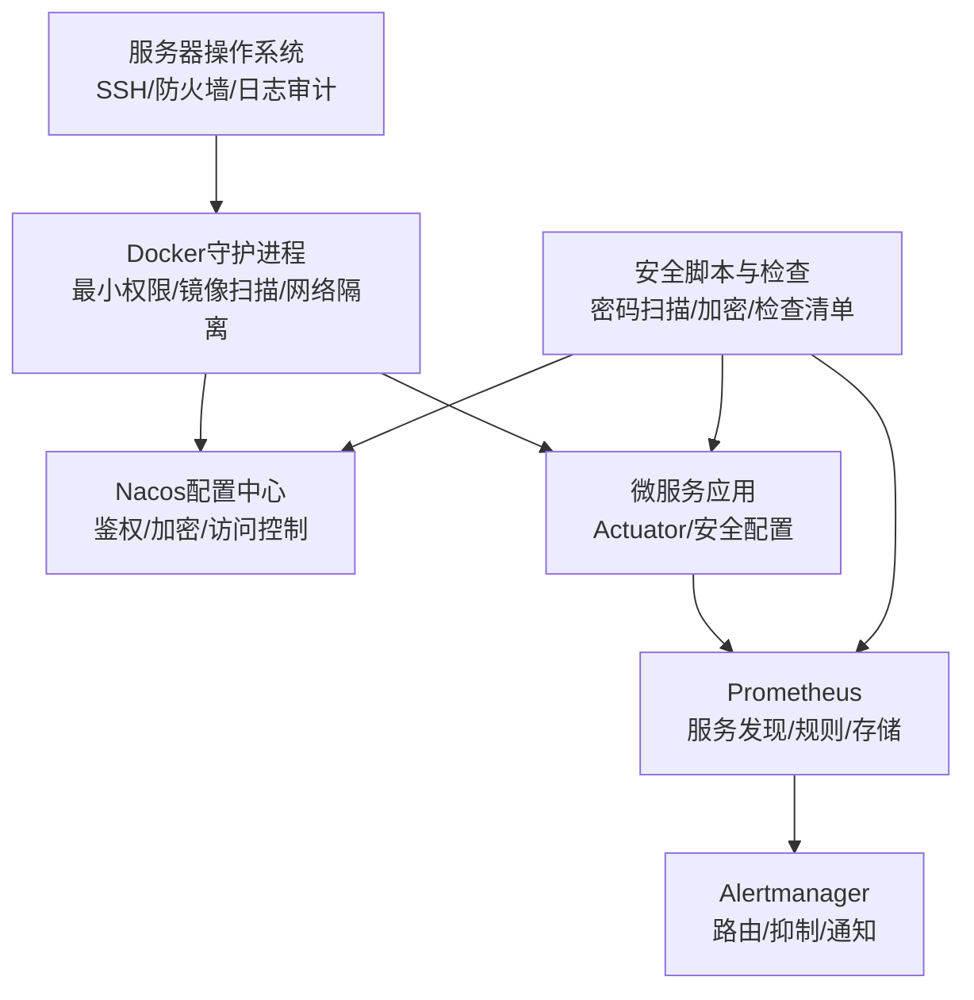
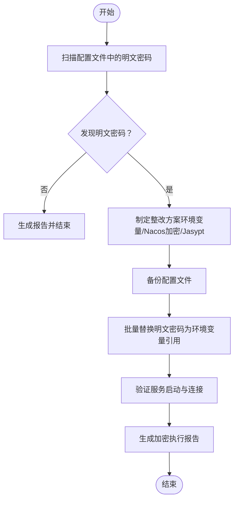
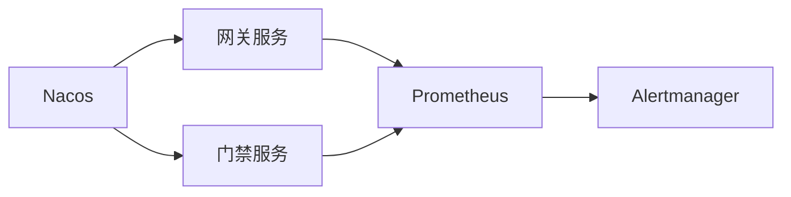

# 基础设施安全

<cite>
**本文引用的文件**
- [security_hardening_guide.md](file://security/security_hardening_guide.md)
- [docker-compose-services.yml](file://docker-compose-services.yml)
- [docker-compose-monitoring.yml](file://deployment/monitoring/docker-compose-monitoring.yml)
- [prometheus.yml](file://deployment/monitoring/prometheus/prometheus.yml)
- [alertmanager.yml](file://deployment/monitoring/alertmanager/alertmanager.yml)
- [application.yml（网关）](file://microservices/ioedream-gateway-service/src/main/resources/application.yml)
- [application.yml（门禁服务）](file://microservices/ioedream-access-service/src/main/resources/application.yml)
- [01-scan-passwords.ps1](file://scripts/p0-security/01-scan-passwords.ps1)
- [scan-passwords-simple.ps1](file://scripts/p0-security/scan-passwords-simple.ps1)
- [01-encrypt-passwords.sh](file://scripts/p0-security/01-encrypt-passwords.sh)
- [PRODUCTION_SECURITY_CHECKLIST.md](file://PRODUCTION_SECURITY_CHECKLIST.md)
</cite>

## 目录
1. [引言](#引言)
2. [项目结构](#项目结构)
3. [核心组件](#核心组件)
4. [架构总览](#架构总览)
5. [详细组件分析](#详细组件分析)
6. [依赖关系分析](#依赖关系分析)
7. [性能考虑](#性能考虑)
8. [故障排查指南](#故障排查指南)
9. [结论](#结论)
10. [附录](#附录)

## 引言
本文件面向系统基础设施安全，围绕服务器操作系统安全加固、Docker容器安全配置、中间件（Nacos、Prometheus、Alertmanager）安全配置、敏感信息治理（明文密码、密钥）、监控告警体系对安全事件的响应机制以及定期安全扫描与漏洞修复流程进行系统化说明。文档同时结合仓库内现有安全脚本、配置文件与检查清单，给出可落地的操作指引与最佳实践。

## 项目结构
本项目在基础设施与安全方面主要涉及以下区域：
- 安全策略与加固指南：security/security_hardening_guide.md
- 容器编排与中间件：deployment/monitoring/docker-compose-monitoring.yml、deployment/monitoring/prometheus/prometheus.yml、deployment/monitoring/alertmanager/alertmanager.yml
- 服务配置与安全暴露面：docker-compose-services.yml、各微服务 application.yml（如网关、门禁服务）
- 安全扫描与治理脚本：scripts/p0-security/*.ps1、scripts/p0-security/*.sh
- 生产安全检查清单：PRODUCTION_SECURITY_CHECKLIST.md

图表来源
- [docker-compose-services.yml](file://docker-compose-services.yml#L1-L41)
- [docker-compose-monitoring.yml](file://deployment/monitoring/docker-compose-monitoring.yml#L1-L109)
- [prometheus.yml](file://deployment/monitoring/prometheus/prometheus.yml#L1-L99)
- [alertmanager.yml](file://deployment/monitoring/alertmanager/alertmanager.yml#L1-L127)
- [application.yml（网关）](file://microservices/ioedream-gateway-service/src/main/resources/application.yml#L1-L75)
- [application.yml（门禁服务）](file://microservices/ioedream-access-service/src/main/resources/application.yml#L1-L83)
- [01-scan-passwords.ps1](file://scripts/p0-security/01-scan-passwords.ps1#L1-L326)
- [scan-passwords-simple.ps1](file://scripts/p0-security/scan-passwords-simple.ps1#L1-L234)
- [01-encrypt-passwords.sh](file://scripts/p0-security/01-encrypt-passwords.sh#L1-L387)
- [PRODUCTION_SECURITY_CHECKLIST.md](file://PRODUCTION_SECURITY_CHECKLIST.md#L286-L326)

章节来源
- [docker-compose-services.yml](file://docker-compose-services.yml#L1-L41)
- [docker-compose-monitoring.yml](file://deployment/monitoring/docker-compose-monitoring.yml#L1-L109)
- [prometheus.yml](file://deployment/monitoring/prometheus/prometheus.yml#L1-L99)
- [alertmanager.yml](file://deployment/monitoring/alertmanager/alertmanager.yml#L1-L127)
- [application.yml（网关）](file://microservices/ioedream-gateway-service/src/main/resources/application.yml#L1-L75)
- [application.yml（门禁服务）](file://microservices/ioedream-access-service/src/main/resources/application.yml#L1-L83)
- [01-scan-passwords.ps1](file://scripts/p0-security/01-scan-passwords.ps1#L1-L326)
- [scan-passwords-simple.ps1](file://scripts/p0-security/scan-passwords-simple.ps1#L1-L234)
- [01-encrypt-passwords.sh](file://scripts/p0-security/01-encrypt-passwords.sh#L1-L387)
- [PRODUCTION_SECURITY_CHECKLIST.md](file://PRODUCTION_SECURITY_CHECKLIST.md#L286-L326)

## 核心组件
- 服务器操作系统安全加固要点
  - SSH配置与防火墙规则：建议限制SSH端口、禁止root直连、启用公钥认证、设置失败锁定与登录超时；结合iptables或ufw限制不必要的入站端口。
  - 系统与软件更新：启用自动安全补丁与内核升级策略。
  - 日志与审计：集中采集系统日志，保留最少必要日志，防止日志被篡改。
- Docker容器安全配置
  - 最小权限原则：非root运行、只读根文件系统、丢弃不必要capabilities。
  - 镜像扫描：使用Trivy或Clair等工具扫描镜像漏洞，建立CI扫描门禁。
  - 网络隔离：使用自定义bridge网络、限制容器间互通、暴露端口最小化。
- 中间件安全配置
  - Nacos：启用鉴权、配置加密密钥、限制访问源、使用HTTPS与只读配置。
  - Prometheus/Alertmanager：限制管理端口访问、配置TLS与认证、合理分组与抑制规则。
- 敏感信息治理
  - 明文密码与密钥：通过环境变量、Docker secrets、Nacos加密配置或Jasypt加密替换。
  - 数据库连接：使用加密连接、最小权限账号、连接池安全过滤。
- 监控告警与安全事件响应
  - 基于Prometheus规则与Alertmanager路由，对异常登录、高频失败请求、系统资源异常等事件进行分级告警与处置。
- 定期安全扫描与修复流程
  - 配置扫描（只读）、密码加密替换、依赖漏洞扫描、补丁修复闭环。

章节来源
- [security_hardening_guide.md](file://security/security_hardening_guide.md#L1-L485)
- [docker-compose-services.yml](file://docker-compose-services.yml#L1-L41)
- [docker-compose-monitoring.yml](file://deployment/monitoring/docker-compose-monitoring.yml#L1-L109)
- [prometheus.yml](file://deployment/monitoring/prometheus/prometheus.yml#L1-L99)
- [alertmanager.yml](file://deployment/monitoring/alertmanager/alertmanager.yml#L1-L127)
- [01-scan-passwords.ps1](file://scripts/p0-security/01-scan-passwords.ps1#L1-L326)
- [scan-passwords-simple.ps1](file://scripts/p0-security/scan-passwords-simple.ps1#L1-L234)
- [01-encrypt-passwords.sh](file://scripts/p0-security/01-encrypt-passwords.sh#L1-L387)
- [PRODUCTION_SECURITY_CHECKLIST.md](file://PRODUCTION_SECURITY_CHECKLIST.md#L286-L326)

## 架构总览
下图展示基础设施安全相关组件的交互关系与数据流向，强调“配置安全—容器隔离—中间件—监控告警”的闭环。

图表来源
- [security_hardening_guide.md](file://security/security_hardening_guide.md#L1-L485)
- [docker-compose-services.yml](file://docker-compose-services.yml#L1-L41)
- [docker-compose-monitoring.yml](file://deployment/monitoring/docker-compose-monitoring.yml#L1-L109)
- [prometheus.yml](file://deployment/monitoring/prometheus/prometheus.yml#L1-L99)
- [alertmanager.yml](file://deployment/monitoring/alertmanager/alertmanager.yml#L1-L127)
- [01-scan-passwords.ps1](file://scripts/p0-security/01-scan-passwords.ps1#L1-L326)
- [01-encrypt-passwords.sh](file://scripts/p0-security/01-encrypt-passwords.sh#L1-L387)

## 详细组件分析

### 服务器操作系统安全加固
- SSH配置
  - 限制登录端口与来源IP，禁止root直接登录，启用公钥认证。
  - 设置失败尝试上限与锁定时间，启用登录超时。
- 防火墙规则
  - 仅开放必需端口（如SSH、Nacos、Prometheus、Alertmanager等），其余默认拒绝。
  - 对外暴露的管理端口（如9090、9093）仅允许受信网段访问。
- 系统与日志
  - 自动安全更新，保留最少必要日志，开启日志轮转与完整性校验。

章节来源
- [security_hardening_guide.md](file://security/security_hardening_guide.md#L1-L485)

### Docker容器安全配置
- 最小权限原则
  - 使用非root用户运行容器，移除多余capabilities，挂载只读根文件系统。
- 镜像扫描
  - 在CI中集成镜像漏洞扫描，阻断高危漏洞镜像上线。
- 网络隔离
  - 使用独立bridge网络，限制容器间互通；仅暴露必要端口。
- 环境变量与密钥管理
  - 使用Docker secrets或Nacos加密配置管理敏感信息，避免明文写入镜像或配置文件。

章节来源
- [security_hardening_guide.md](file://security/security_hardening_guide.md#L405-L446)
- [docker-compose-services.yml](file://docker-compose-services.yml#L1-L41)

### Nacos安全配置
- 鉴权与访问控制
  - 启用用户名/密码鉴权，限制访问源IP，关闭匿名访问。
- 配置加密
  - 生成32位AES密钥，启用配置加密前缀与后缀，确保敏感配置以ENC(...)形式存储。
- 运维安全
  - 使用只读配置，限制写入权限；定期轮换密钥与凭据。

章节来源
- [security_hardening_guide.md](file://security/security_hardening_guide.md#L14-L71)
- [docker-compose-services.yml](file://docker-compose-services.yml#L17-L33)

### Prometheus与Alertmanager安全配置
- Prometheus
  - 限制管理端口访问，启用健康检查与只读存储；按服务分组抓取，避免泄露敏感路径。
- Alertmanager
  - 配置路由与抑制规则，按严重级别分发；邮件与Webhook通知需配置认证与TLS。
- 规则与告警
  - 针对异常登录、高频失败请求、系统资源异常等事件建立规则，结合抑制避免告警风暴。

章节来源
- [docker-compose-monitoring.yml](file://deployment/monitoring/docker-compose-monitoring.yml#L1-L109)
- [prometheus.yml](file://deployment/monitoring/prometheus/prometheus.yml#L1-L99)
- [alertmanager.yml](file://deployment/monitoring/alertmanager/alertmanager.yml#L1-L127)

### 敏感信息治理（明文密码、密钥）
- 配置扫描
  - PowerShell脚本与简化脚本均支持只读扫描，识别配置文件中的明文密码、Redis/Nacos密码等，并生成报告与环境变量模板。
- 加密替换
  - Bash脚本提供扫描、生成环境变量模板、生成替换脚本与验证步骤，形成闭环整改流程。
- 环境变量与Docker secrets
  - 建议在生产环境使用Docker secrets或Nacos加密配置，避免将密钥写入镜像或版本库。

图表来源
- [01-scan-passwords.ps1](file://scripts/p0-security/01-scan-passwords.ps1#L1-L326)
- [scan-passwords-simple.ps1](file://scripts/p0-security/scan-passwords-simple.ps1#L1-L234)
- [01-encrypt-passwords.sh](file://scripts/p0-security/01-encrypt-passwords.sh#L1-L387)

章节来源
- [01-scan-passwords.ps1](file://scripts/p0-security/01-scan-passwords.ps1#L1-L326)
- [scan-passwords-simple.ps1](file://scripts/p0-security/scan-passwords-simple.ps1#L1-L234)
- [01-encrypt-passwords.sh](file://scripts/p0-security/01-encrypt-passwords.sh#L1-L387)
- [PRODUCTION_SECURITY_CHECKLIST.md](file://PRODUCTION_SECURITY_CHECKLIST.md#L286-L326)

### 监控告警体系对安全事件的响应
- Prometheus规则
  - 针对登录失败、请求异常、系统负载、磁盘/内存/CPU异常等建立规则文件，按服务与严重级别分组。
- Alertmanager路由
  - 按严重级别、服务类型与告警类型进行路由与抑制，避免告警风暴；配置邮件与Webhook通知。
- 响应机制
  - 建立值班与处置流程，对高危告警（如异常登录、高频失败）快速定位与阻断。

章节来源
- [docker-compose-monitoring.yml](file://deployment/monitoring/docker-compose-monitoring.yml#L1-L109)
- [prometheus.yml](file://deployment/monitoring/prometheus/prometheus.yml#L1-L99)
- [alertmanager.yml](file://deployment/monitoring/alertmanager/alertmanager.yml#L1-L127)

### 定期安全扫描与漏洞修复流程
- 配置安全扫描
  - 使用只读扫描脚本识别明文密码与硬编码密钥，生成报告与模板，指导后续整改。
- 依赖漏洞扫描
  - 使用OWASP Dependency-Check等工具扫描依赖漏洞，按风险等级处理并纳入CI门禁。
- 修复闭环
  - 制定修复计划与回滚预案，完成修复后进行回归验证与检查清单复核。

章节来源
- [01-scan-passwords.ps1](file://scripts/p0-security/01-scan-passwords.ps1#L1-L326)
- [PRODUCTION_SECURITY_CHECKLIST.md](file://PRODUCTION_SECURITY_CHECKLIST.md#L286-L326)

## 依赖关系分析
- 组件耦合
  - 微服务通过Nacos进行配置与注册发现，Prometheus通过静态配置抓取各服务的Actuator端点，Alertmanager负责统一告警分发。
- 外部依赖
  - Nacos作为配置中心与鉴权入口；Prometheus/Alertmanager作为监控与告警中枢；Docker作为容器运行时。
- 安全边界
  - 配置中心与监控管理端口应置于受控网络，限制访问源与启用认证。

图表来源
- [docker-compose-services.yml](file://docker-compose-services.yml#L17-L33)
- [application.yml（网关）](file://microservices/ioedream-gateway-service/src/main/resources/application.yml#L22-L38)
- [application.yml（门禁服务）](file://microservices/ioedream-access-service/src/main/resources/application.yml#L22-L39)
- [prometheus.yml](file://deployment/monitoring/prometheus/prometheus.yml#L1-L99)
- [alertmanager.yml](file://deployment/monitoring/alertmanager/alertmanager.yml#L1-L127)

章节来源
- [docker-compose-services.yml](file://docker-compose-services.yml#L17-L33)
- [application.yml（网关）](file://microservices/ioedream-gateway-service/src/main/resources/application.yml#L22-L38)
- [application.yml（门禁服务）](file://microservices/ioedream-access-service/src/main/resources/application.yml#L22-L39)
- [prometheus.yml](file://deployment/monitoring/prometheus/prometheus.yml#L1-L99)
- [alertmanager.yml](file://deployment/monitoring/alertmanager/alertmanager.yml#L1-L127)

## 性能考虑
- 容器性能
  - 控制容器数量与资源配额，避免过度竞争导致抖动；启用只读文件系统与最小权限降低上下文切换成本。
- 监控性能
  - 合理设置抓取间隔与规则评估周期，避免Prometheus与Alertmanager成为瓶颈；使用分片与远端存储。
- 安全扫描性能
  - 将镜像扫描与配置扫描纳入CI流水线，避免在构建阶段引入额外延迟；对大仓库采用增量扫描策略。

## 故障排查指南
- 明文密码问题
  - 使用扫描脚本定位具体文件与位置，确认是否已通过环境变量或Nacos加密配置替代。
- 服务无法连接配置中心
  - 检查Nacos鉴权、网络连通性与密钥配置；确认容器网络与外部网络策略。
- 监控告警不生效
  - 检查Prometheus抓取配置与服务暴露端点，确认Alertmanager路由与抑制规则；验证通知通道（邮件/Webhook）可用性。
- 生产安全检查未通过
  - 回溯最近一次安全扫描与修复记录，确认密钥轮换、权限回收与配置更新是否完成。

章节来源
- [01-scan-passwords.ps1](file://scripts/p0-security/01-scan-passwords.ps1#L1-L326)
- [scan-passwords-simple.ps1](file://scripts/p0-security/scan-passwords-simple.ps1#L1-L234)
- [01-encrypt-passwords.sh](file://scripts/p0-security/01-encrypt-passwords.sh#L1-L387)
- [PRODUCTION_SECURITY_CHECKLIST.md](file://PRODUCTION_SECURITY_CHECKLIST.md#L286-L326)

## 结论
通过服务器操作系统加固、Docker容器最小权限与网络隔离、Nacos与中间件的安全配置、敏感信息治理与定期安全扫描，本项目可构建起覆盖“配置—运行—监控—响应”的全链路安全体系。建议持续完善CI安全门禁、密钥轮换与应急演练，确保安全能力与业务发展同步演进。

## 附录
- 关键参考文件路径
  - 安全加固指南：security/security_hardening_guide.md
  - 容器编排：docker-compose-services.yml、deployment/monitoring/docker-compose-monitoring.yml
  - 监控配置：deployment/monitoring/prometheus/prometheus.yml、deployment/monitoring/alertmanager/alertmanager.yml
  - 微服务配置：microservices/*/src/main/resources/application.yml
  - 安全脚本：scripts/p0-security/*.ps1、scripts/p0-security/*.sh
  - 生产安全检查：PRODUCTION_SECURITY_CHECKLIST.md