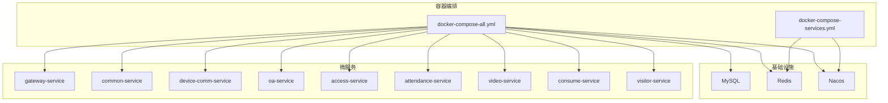
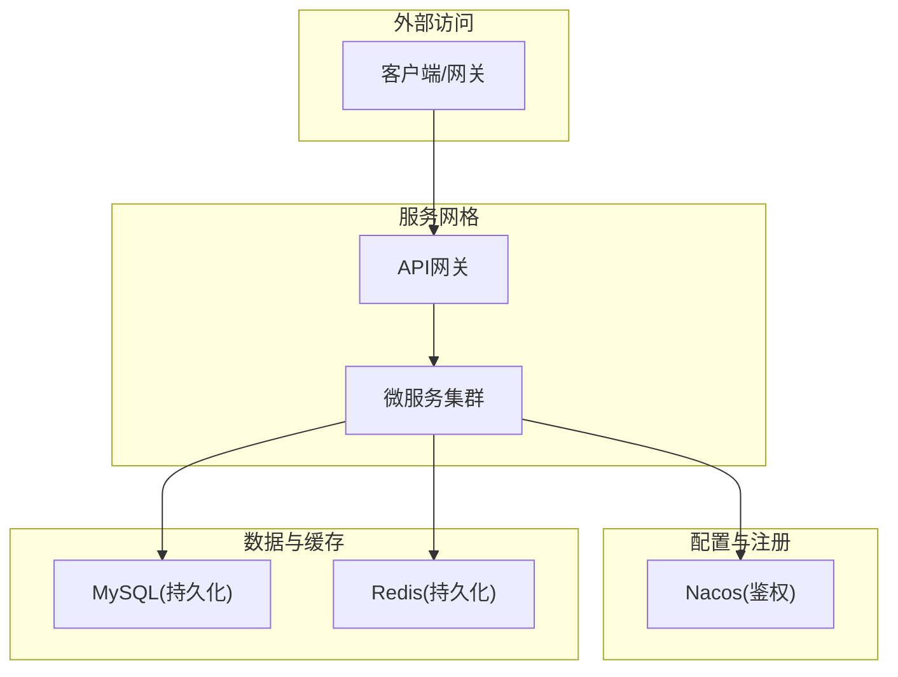
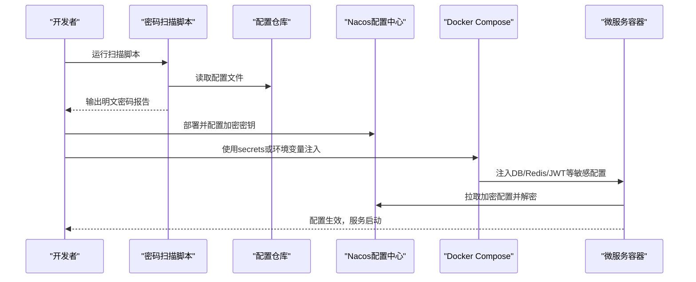
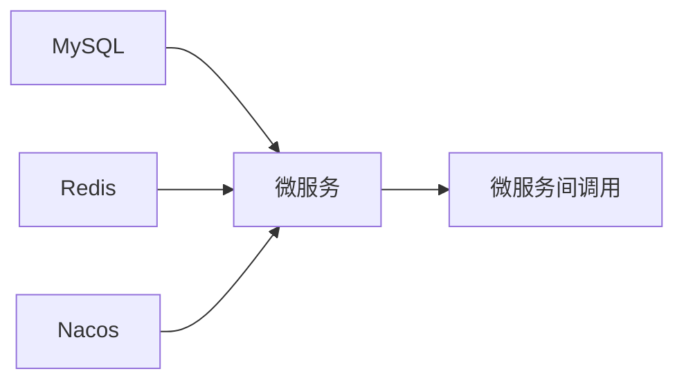

# 容器安全

<cite>
**本文引用的文件**
- [security_hardening_guide.md](file://security/security_hardening_guide.md)
- [docker-compose-all.yml](file://docker-compose-all.yml)
- [docker-compose-services.yml](file://docker-compose-services.yml)
- [secure-application.yml](file://templates/secure-application.yml)
- [scan-passwords-simple.ps1](file://scripts/p0-security/scan-passwords-simple.ps1)
- [run-all-scans.ps1](file://scripts/compliance-scan/run-all-scans.ps1)
- [P0-1_SCAN_SUMMARY.md](file://documentation/archive/reports-2025-12-04/P0-1_SCAN_SUMMARY.md)
- [PRODUCTION_SECURITY_CHECKLIST.md](file://PRODUCTION_SECURITY_CHECKLIST.md)
- [ioedream-access-service/Dockerfile](file://microservices/ioedream-access-service/Dockerfile)
- [ioedream-consume-service/Dockerfile](file://microservices/ioedream-consume-service/Dockerfile)
</cite>

## 目录
1. [引言](#引言)
2. [项目结构](#项目结构)
3. [核心组件](#核心组件)
4. [架构总览](#架构总览)
5. [详细组件分析](#详细组件分析)
6. [依赖关系分析](#依赖关系分析)
7. [性能与安全权衡](#性能与安全权衡)
8. [故障排查指南](#故障排查指南)
9. [结论](#结论)
10. [附录](#附录)

## 引言
本文件面向Docker容器化环境下的安全加固与最佳实践，结合仓库中现有的Docker Compose、Dockerfile、安全指南与扫描脚本，系统阐述如何在微服务架构中落地容器安全：包括以非root用户运行、最小化镜像与多阶段构建、资源限制与能力收敛、镜像与配置安全、网络隔离与卷挂载安全、以及密钥与敏感配置的管理。同时给出基于仓库现有配置的可操作示例与改进建议，帮助团队在开发与生产环境中降低攻击面、提升整体安全水平。

## 项目结构
本仓库提供了完整的容器化基础设施与微服务编排样例，涵盖：
- Docker Compose编排：基础设施（MySQL、Redis、Nacos）与多个微服务的组合部署
- Dockerfile：多阶段构建与健康检查配置
- 安全指南与扫描脚本：密码扫描、合规扫描、生产安全检查清单
- 安全配置模板：基于Nacos加密配置的应用安全模板

图表来源
- [docker-compose-all.yml](file://docker-compose-all.yml#L1-L479)
- [docker-compose-services.yml](file://docker-compose-services.yml#L1-L41)

章节来源
- [docker-compose-all.yml](file://docker-compose-all.yml#L1-L479)
- [docker-compose-services.yml](file://docker-compose-services.yml#L1-L41)

## 核心组件
- 容器编排与网络
  - 使用独立bridge网络隔离服务间通信，避免默认桥接暴露
  - 通过depends_on与健康检查确保依赖服务就绪
- 基础设施安全
  - MySQL、Redis、Nacos均配置健康检查与持久化卷
  - Nacos开启鉴权与令牌，MySQL使用环境变量注入根密码
- 微服务镜像与运行
  - 多阶段构建，使用Alpine JRE作为运行时，减少镜像体积
  - 设置JAVA_OPTS、健康检查与Spring Profile
- 安全配置与密钥管理
  - 提供基于Nacos加密配置的应用模板
  - 提供Docker Compose中使用secrets的示例与说明
  - 提供密码扫描与合规扫描脚本，辅助识别明文密码与配置问题

章节来源
- [docker-compose-all.yml](file://docker-compose-all.yml#L1-L479)
- [docker-compose-services.yml](file://docker-compose-services.yml#L1-L41)
- [ioedream-access-service/Dockerfile](file://microservices/ioedream-access-service/Dockerfile#L1-L33)
- [ioedream-consume-service/Dockerfile](file://microservices/ioedream-consume-service/Dockerfile#L1-L33)
- [secure-application.yml](file://templates/secure-application.yml#L1-L132)
- [security_hardening_guide.md](file://security/security_hardening_guide.md#L405-L446)

## 架构总览
下图展示容器化环境中的安全边界与数据流：微服务通过Nacos注册发现与配置中心，访问受控的MySQL与Redis；容器间通过专用网络隔离，健康检查与依赖顺序保证可用性。

图表来源
- [docker-compose-all.yml](file://docker-compose-all.yml#L1-L479)
- [secure-application.yml](file://templates/secure-application.yml#L1-L132)

## 详细组件分析

### 1) 容器镜像与运行时安全（非root、最小化、多阶段）
- 多阶段构建
  - 构建阶段使用Maven镜像，打包产物复制到Alpine JRE运行时，显著减小镜像体积
- 运行时最小化
  - 使用Alpine Linux与精简JRE，减少潜在漏洞面
- 健康检查与运行参数
  - 为各服务配置健康检查命令，结合Spring Actuator端点
  - 设置JAVA_OPTS与Spring Profile，便于在容器环境下统一配置
- 非root运行建议
  - 当前镜像未显式指定非root用户；建议在Dockerfile中增加用户与权限收窄，避免特权容器启动

章节来源
- [ioedream-access-service/Dockerfile](file://microservices/ioedream-access-service/Dockerfile#L1-L33)
- [ioedream-consume-service/Dockerfile](file://microservices/ioedream-consume-service/Dockerfile#L1-L33)

### 2) 资源限制与能力收敛（CPU/内存/Capabilities）
- 当前仓库未在Docker Compose中配置资源限制与Linux Capabilities
- 建议
  - 在服务定义中加入deploy.resources.limits与reservations，限制CPU/内存
  - 通过cap-drop与user等字段收敛容器能力，避免不必要的sys_admin、net_raw等能力
  - 对只读容器场景，可考虑只读根文件系统与最小mount集合

章节来源
- [docker-compose-all.yml](file://docker-compose-all.yml#L1-L479)

### 3) 文件系统权限与卷挂载安全
- 卷挂载
  - MySQL/Redis/Nacos均使用本地卷驱动，建议：
    - 限定卷权限与所有者，避免宿主机与容器内权限不一致
    - 对敏感卷（如日志、数据）启用只读或最小写权限
- 文件系统权限
  - 建议在容器内使用非root用户运行，避免容器内写入宿主机路径
  - 对挂载目录设置最小权限，避免过度授权

章节来源
- [docker-compose-all.yml](file://docker-compose-all.yml#L464-L473)

### 4) 网络隔离与服务发现
- 网络
  - 使用自定义bridge网络“ioedream-network”，隔离服务间通信
- 服务发现与配置中心
  - Nacos开启鉴权与令牌，微服务通过Nacos读取配置与注册服务
- 建议
  - 对Nacos与MySQL/Redis暴露端口进行防火墙限制，仅允许必要来源访问
  - 对外暴露的网关与服务端口，建议配合TLS与WAF

章节来源
- [docker-compose-all.yml](file://docker-compose-all.yml#L475-L479)
- [secure-application.yml](file://templates/secure-application.yml#L1-L132)

### 5) 密钥与敏感配置管理（Docker Secrets与Nacos加密）
- Docker Secrets示例
  - 安全指南中提供了在Compose中使用secrets的示例与说明
- Nacos加密配置
  - 安全指南与应用模板展示了基于Nacos的加密配置与共享配置加载
- 明文密码扫描
  - 提供PowerShell脚本扫描配置文件中的明文密码，并生成报告与环境变量模板
- 建议
  - 生产环境优先采用Nacos加密配置与Docker Secrets
  - 对所有敏感配置（数据库、Redis、JWT、加密密钥）均通过密钥管理服务注入

图表来源
- [scan-passwords-simple.ps1](file://scripts/p0-security/scan-passwords-simple.ps1#L1-L234)
- [security_hardening_guide.md](file://security/security_hardening_guide.md#L405-L446)
- [secure-application.yml](file://templates/secure-application.yml#L1-L132)
- [docker-compose-all.yml](file://docker-compose-all.yml#L1-L479)

章节来源
- [security_hardening_guide.md](file://security/security_hardening_guide.md#L405-L446)
- [secure-application.yml](file://templates/secure-application.yml#L1-L132)
- [scan-passwords-simple.ps1](file://scripts/p0-security/scan-passwords-simple.ps1#L1-L234)
- [P0-1_SCAN_SUMMARY.md](file://documentation/archive/reports-2025-12-04/P0-1_SCAN_SUMMARY.md#L50-L104)

### 6) 镜像扫描与漏洞治理（CI/CD集成建议）
- 现状
  - 仓库未提供镜像扫描脚本或CI集成示例
- 建议
  - 在CI中集成镜像扫描（如Trivy、Clair等），对构建产物进行漏洞扫描
  - 将扫描结果纳入质量门禁，阻断高危漏洞进入生产
  - 结合依赖扫描与合规扫描，形成闭环

章节来源
- [run-all-scans.ps1](file://scripts/compliance-scan/run-all-scans.ps1#L1-L157)
- [PRODUCTION_SECURITY_CHECKLIST.md](file://PRODUCTION_SECURITY_CHECKLIST.md#L418-L485)

### 7) docker-compose.yml 安全配置示例要点
- 网络隔离
  - 使用自定义bridge网络，避免与默认网络冲突
- 健康检查
  - 为MySQL、Redis、Nacos与各微服务配置健康检查，确保依赖可用
- 依赖顺序
  - 使用depends_on与条件判断，保证服务启动顺序
- 密钥注入
  - 建议在生产环境使用Docker Secrets或外部密钥管理服务注入敏感配置

章节来源
- [docker-compose-all.yml](file://docker-compose-all.yml#L1-L479)
- [docker-compose-services.yml](file://docker-compose-services.yml#L1-L41)

## 依赖关系分析
- 服务依赖
  - 各微服务依赖Nacos、Redis、MySQL，且通过健康检查与启动顺序保证可用性
- 配置依赖
  - 应用通过Nacos拉取配置，数据库与缓存地址通过环境变量注入
- 安全依赖
  - Nacos开启鉴权，微服务侧通过加密配置与安全头策略增强传输与会话安全

图表来源
- [docker-compose-all.yml](file://docker-compose-all.yml#L1-L479)

章节来源
- [docker-compose-all.yml](file://docker-compose-all.yml#L1-L479)

## 性能与安全权衡
- 安全加固通常会引入额外的依赖（Nacos、密钥管理、健康检查、网络隔离），可能带来启动延迟与资源占用
- 建议在CI中提前进行镜像与配置扫描，减少上线后的反复调整
- 对生产环境，优先采用Nacos加密配置与Docker Secrets，降低明文配置带来的风险

[本节为通用指导，无需列出具体文件来源]

## 故障排查指南
- 明文密码问题
  - 使用密码扫描脚本定位配置文件中的明文密码，生成报告并按建议替换为环境变量或Nacos加密配置
- 启动失败
  - 检查健康检查与依赖顺序，确认MySQL/Redis/Nacos均已就绪
  - 核对环境变量与密钥注入是否正确
- 配置无法加载
  - 确认Nacos鉴权与令牌配置正确，应用侧加密配置开关与密钥一致

章节来源
- [scan-passwords-simple.ps1](file://scripts/p0-security/scan-passwords-simple.ps1#L1-L234)
- [P0-1_SCAN_SUMMARY.md](file://documentation/archive/reports-2025-12-04/P0-1_SCAN_SUMMARY.md#L50-L104)
- [docker-compose-all.yml](file://docker-compose-all.yml#L1-L479)
- [secure-application.yml](file://templates/secure-application.yml#L1-L132)

## 结论
本仓库已具备较为完善的容器编排与安全指南基础，建议在现有基础上进一步：
- 在Docker Compose中增加资源限制与Linux Capabilities收敛
- 在生产环境全面采用Docker Secrets与Nacos加密配置
- 在CI中集成镜像与依赖扫描，建立安全门禁
- 对容器运行时进行非root与最小权限改造
通过以上措施，可在保持现有微服务架构稳定性的前提下，显著提升容器化环境的整体安全性与合规性。

[本节为总结性内容，无需列出具体文件来源]

## 附录

### A. 容器安全最佳实践清单（基于仓库现状）
- 镜像与运行
  - 使用多阶段构建与Alpine JRE
  - 增加非root用户与最小权限
  - 为服务配置健康检查与Spring Profile
- 资源与能力
  - 在Compose中增加资源限制与能力收敛
- 配置与密钥
  - 生产环境使用Nacos加密配置与Docker Secrets
  - 使用扫描脚本识别并替换明文密码
- 网络与依赖
  - 使用自定义bridge网络隔离
  - 通过健康检查与依赖顺序保证可用性

章节来源
- [ioedream-access-service/Dockerfile](file://microservices/ioedream-access-service/Dockerfile#L1-L33)
- [ioedream-consume-service/Dockerfile](file://microservices/ioedream-consume-service/Dockerfile#L1-L33)
- [docker-compose-all.yml](file://docker-compose-all.yml#L1-L479)
- [security_hardening_guide.md](file://security/security_hardening_guide.md#L405-L446)
- [secure-application.yml](file://templates/secure-application.yml#L1-L132)
- [scan-passwords-simple.ps1](file://scripts/p0-security/scan-passwords-simple.ps1#L1-L234)