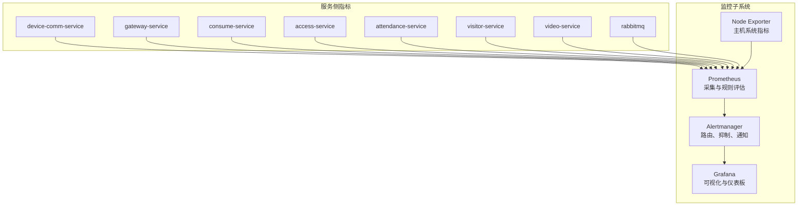
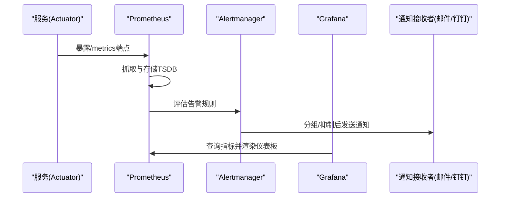
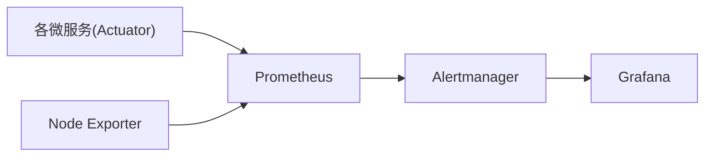

# 监控与告警安全

<cite>
**本文引用的文件**
- [protocol_alerts.yml](file://deployment/monitoring/prometheus/rules/protocol_alerts.yml)
- [prometheus.yml](file://deployment/monitoring/prometheus/prometheus.yml)
- [alertmanager.yml](file://deployment/monitoring/alertmanager/alertmanager.yml)
- [docker-compose-monitoring.yml](file://deployment/monitoring/docker-compose-monitoring.yml)
- [MONITORING_ALERTING_DEPLOYMENT_GUIDE.md](file://documentation/technical/MONITORING_ALERTING_DEPLOYMENT_GUIDE.md)
- [deploy-monitoring.ps1](file://scripts/deploy-monitoring.ps1)
- [门禁服务监控告警机制.md](file://documentation/04-部署运维/门禁服务监控告警机制.md)
- [security_hardening_guide.md](file://security/security_hardening_guide.md)
- [t_alert_rule.sql](file://database-scripts/common-service/12-t_alert_rule.sql)
- [t_alert.sql](file://database-scripts/common-service/11-t_alert.sql)
- [AlertRuleVO.java](file://microservices/microservices-common/src/main/java/net/lab1024/sa/common/monitor/domain/vo/AlertRuleVO.java)
- [AlertRuleAddDTO.java](file://microservices/microservices-common/src/main/java/net/lab1024/sa/common/monitor/domain/dto/AlertRuleAddDTO.java)
- [AlertEntity.java](file://microservices/microservices-common/src/main/java/net/lab1024/sa/common/monitor/domain/entity/AlertEntity.java)
- [AlertServiceImpl.java](file://microservices/microservices-common/src/main/java/net/lab1024/sa/common/monitor/service/impl/AlertServiceImpl.java)
- [ALERT_RULE_IMPLEMENTATION_SUMMARY.md](file://microservices/microservices-common/docs/ALERT_RULE_IMPLEMENTATION_SUMMARY.md)
</cite>

## 目录
1. [简介](#简介)
2. [项目结构](#项目结构)
3. [核心组件](#核心组件)
4. [架构总览](#架构总览)
5. [详细组件分析](#详细组件分析)
6. [依赖关系分析](#依赖关系分析)
7. [性能与容量考虑](#性能与容量考虑)
8. [故障排查指南](#故障排查指南)
9. [结论](#结论)
10. [附录](#附录)

## 简介
本文件面向监控与告警体系的安全加固与实战落地，围绕Prometheus与Alertmanager构建“安全事件的实时监控与响应机制”。重点说明如何基于仓库中的告警规则（如protocol_alerts.yml）识别异常登录行为、高频失败的认证请求、可疑的网络流量模式等安全事件；解释告警通知的传递路径与安全措施，确保告警信息不被未授权方获取；并介绍如何对监控系统自身进行安全加固，防止其成为攻击跳板，同时确保监控数据的完整性和机密性。

## 项目结构
监控与告警相关的核心文件集中在deployment/monitoring目录，配合部署脚本与文档指南，形成可复用的一键部署与运维流程。下图展示监控子系统的文件组织与职责划分。

图表来源
- [prometheus.yml](file://deployment/monitoring/prometheus/prometheus.yml#L1-L99)
- [alertmanager.yml](file://deployment/monitoring/alertmanager/alertmanager.yml#L1-L127)
- [docker-compose-monitoring.yml](file://deployment/monitoring/docker-compose-monitoring.yml#L1-L109)

章节来源
- [prometheus.yml](file://deployment/monitoring/prometheus/prometheus.yml#L1-L99)
- [alertmanager.yml](file://deployment/monitoring/alertmanager/alertmanager.yml#L1-L127)
- [docker-compose-monitoring.yml](file://deployment/monitoring/docker-compose-monitoring.yml#L1-L109)

## 核心组件
- Prometheus：负责从各服务的/metrics端点抓取指标，加载告警规则并评估触发条件。
- Alertmanager：负责路由、分组、去噪（抑制）、静默与通知下发。
- Grafana：作为可视化界面，接入Prometheus数据源，展示监控仪表板。
- Node Exporter：采集主机系统指标，辅助整体健康度评估。
- 服务侧指标：各微服务通过Actuator暴露/metrics，供Prometheus抓取。

章节来源
- [prometheus.yml](file://deployment/monitoring/prometheus/prometheus.yml#L1-L99)
- [alertmanager.yml](file://deployment/monitoring/alertmanager/alertmanager.yml#L1-L127)
- [docker-compose-monitoring.yml](file://deployment/monitoring/docker-compose-monitoring.yml#L1-L109)

## 架构总览
下图展示Prometheus、Alertmanager与Grafana之间的交互关系，以及服务侧指标采集路径。

图表来源
- [prometheus.yml](file://deployment/monitoring/prometheus/prometheus.yml#L1-L99)
- [alertmanager.yml](file://deployment/monitoring/alertmanager/alertmanager.yml#L1-L127)
- [docker-compose-monitoring.yml](file://deployment/monitoring/docker-compose-monitoring.yml#L1-L109)

## 详细组件分析

### Prometheus配置与规则
- 抓取目标：通过静态配置为多个微服务与RabbitMQ、Node Exporter建立抓取作业，统一打上service标签，便于后续路由与告警。
- 规则文件：加载rules目录下的告警规则，包含协议处理失败率、延迟、队列积压、熔断器、限流、缓存命中率等。
- 规则触发：通过for持续时间与阈值表达式，结合外部标签cluster、environment，形成可追溯的告警上下文。

章节来源
- [prometheus.yml](file://deployment/monitoring/prometheus/prometheus.yml#L1-L99)
- [protocol_alerts.yml](file://deployment/monitoring/prometheus/rules/protocol_alerts.yml#L1-L141)

### Alertmanager路由与通知链路
- 路由分层：按severity、service、alert_type进行路由，支持严重告警优先、协议相关告警专道、系统类告警分流。
- 抑制规则：当同一服务出现严重告警时，抑制对应警告告警，避免告警风暴。
- 通知渠道：默认邮件、严重告警邮件+钉钉、协议服务邮件+钉钉、系统类邮件；均支持HTML模板化内容与链接引导。

章节来源
- [alertmanager.yml](file://deployment/monitoring/alertmanager/alertmanager.yml#L1-L127)

### Grafana可视化与仪表板
- 数据源：Prometheus数据源指向容器内部地址，便于Grafana直接查询。
- 仪表板：建议围绕协议处理性能、系统资源、告警统计、服务健康状态等维度构建仪表板，便于快速定位异常。

章节来源
- [docker-compose-monitoring.yml](file://deployment/monitoring/docker-compose-monitoring.yml#L1-L109)

### 告警规则与安全事件识别
- 协议处理失败率高/严重：通过错误计数与总量比值判断，适用于识别异常登录行为、认证失败风暴等。
- 协议处理延迟高/严重：通过P99延迟阈值判断，可用于识别可疑网络流量模式或后端异常。
- 消息队列积压高/严重：用于识别协议消息堆积，可能反映下游处理异常或上游流量突增。
- 服务熔断器打开：用于识别下游依赖异常导致的熔断，间接反映安全事件引发的系统不稳定。
- 限流触发频繁：用于识别异常请求洪泛或暴力破解尝试。
- 缓存命中率低：用于识别缓存异常，可能影响鉴权与访问控制的稳定性。

章节来源
- [protocol_alerts.yml](file://deployment/monitoring/prometheus/rules/protocol_alerts.yml#L1-L141)

### 门禁服务安全告警与指标
- 门禁服务通过Micrometer暴露验证总量、成功/失败计数、响应时间、异常访问计数、设备在线率等指标，并提供告警规则与仪表板。
- 异常访问检测：通过rate(abnormal_access_total[5m])触发告警，结合Grafana仪表板快速定位异常访问类型与趋势。
- 多渠道通知：邮件、短信、微信、钉钉等渠道按级别选择，确保紧急告警快速触达。

章节来源
- [门禁服务监控告警机制.md](file://documentation/04-部署运维/门禁服务监控告警机制.md#L219-L400)
- [门禁服务监控告警机制.md](file://documentation/04-部署运维/门禁服务监控告警机制.md#L450-L649)

### 告警规则管理与持久化
- 规则模型：AlertRuleAddDTO、AlertRuleVO、AlertEntity等定义了规则的输入、展示与持久化字段，涵盖规则名称、指标、条件、阈值、级别、持续时间、通知渠道、适用服务与环境等。
- 规则表：t_alert_rule表定义了规则的存储结构，支持按服务与环境筛选。
- 告警表：t_alert表记录告警的级别、标题、消息、服务、实例、状态、解决信息等，支撑告警闭环管理。

章节来源
- [AlertRuleAddDTO.java](file://microservices/microservices-common/src/main/java/net/lab1024/sa/common/monitor/domain/dto/AlertRuleAddDTO.java#L1-L77)
- [AlertRuleVO.java](file://microservices/microservices-common/src/main/java/net/lab1024/sa/common/monitor/domain/vo/AlertRuleVO.java#L48-L92)
- [AlertEntity.java](file://microservices/microservices-common/src/main/java/net/lab1024/sa/common/monitor/domain/entity/AlertEntity.java#L1-L54)
- [t_alert_rule.sql](file://database-scripts/common-service/12-t_alert_rule.sql#L1-L23)
- [t_alert.sql](file://database-scripts/common-service/11-t_alert.sql#L1-L36)
- [ALERT_RULE_IMPLEMENTATION_SUMMARY.md](file://microservices/microservices-common/docs/ALERT_RULE_IMPLEMENTATION_SUMMARY.md#L1-L59)

### 告警规则创建与默认值
- 规则创建流程：实现参数校验、唯一性检查、VO到Entity转换、默认值设置（状态、优先级、持续时间、通知频率、抑制时间），确保规则可落地执行。
- 默认优先级：CRITICAL最高、ERROR次之、WARNING再之、INFO最低，便于Alertmanager路由与抑制策略生效。

章节来源
- [ALERT_RULE_IMPLEMENTATION_SUMMARY.md](file://microservices/microservices-common/docs/ALERT_RULE_IMPLEMENTATION_SUMMARY.md#L1-L59)
- [AlertServiceImpl.java](file://microservices/microservices-common/src/main/java/net/lab1024/sa/common/monitor/service/impl/AlertServiceImpl.java#L461-L488)

## 依赖关系分析
- Prometheus依赖各服务的/metrics端点与Actuator暴露的指标。
- Alertmanager依赖Prometheus的告警推送与自身的路由/抑制配置。
- Grafana依赖Prometheus数据源，通过仪表板查询指标。
- Node Exporter提供主机层指标，辅助系统健康度评估。
- 门禁服务通过Micrometer指标与告警规则，形成端到端的安全监控闭环。

图表来源
- [prometheus.yml](file://deployment/monitoring/prometheus/prometheus.yml#L1-L99)
- [alertmanager.yml](file://deployment/monitoring/alertmanager/alertmanager.yml#L1-L127)
- [docker-compose-monitoring.yml](file://deployment/monitoring/docker-compose-monitoring.yml#L1-L109)

## 性能与容量考虑
- 抓取间隔与评估间隔：统一设置为15s，兼顾实时性与资源消耗。
- 规则复杂度：避免过于复杂的表达式，减少TSDB查询压力；必要时拆分规则组。
- 存储保留：Prometheus TSDB保留30天，建议定期评估磁盘占用与归档策略。
- 告警风暴防护：通过抑制规则与静默窗口降低重复告警；合理设置分组与去噪。
- 通知频率：为不同级别设定通知间隔，避免频繁打扰。

章节来源
- [prometheus.yml](file://deployment/monitoring/prometheus/prometheus.yml#L1-L99)
- [alertmanager.yml](file://deployment/monitoring/alertmanager/alertmanager.yml#L1-L127)
- [docker-compose-monitoring.yml](file://deployment/monitoring/docker-compose-monitoring.yml#L1-L109)

## 故障排查指南
- Prometheus无法采集指标
  - 检查服务是否正常启动、/metrics端点可达、网络连通性。
- 告警未触发
  - 检查规则表达式、指标名称、标签匹配与阈值设置。
- 告警通知未送达
  - 检查SMTP配置、钉钉Webhook有效性、接收人邮箱与Bearer Token。
- 监控系统自身问题
  - 使用部署脚本查看服务状态与日志，确认容器健康检查与端口映射。

章节来源
- [MONITORING_ALERTING_DEPLOYMENT_GUIDE.md](file://documentation/technical/MONITORING_ALERTING_DEPLOYMENT_GUIDE.md#L227-L278)
- [deploy-monitoring.ps1](file://scripts/deploy-monitoring.ps1#L1-L193)

## 结论
通过Prometheus与Alertmanager的组合，结合服务侧Micrometer指标与规则，能够有效识别异常登录、认证失败风暴、可疑网络流量模式等安全事件。借助Alertmanager的路由、抑制与多渠道通知，实现告警的精准分发与闭环管理。同时，通过对监控系统自身的安全加固（如TLS、最小权限、密钥管理、日志脱敏与访问控制），可防止监控系统成为攻击跳板，确保监控数据的完整性与机密性。

## 附录

### 告警规则与安全事件映射
- 异常登录行为
  - 通过协议处理失败率高/严重规则，结合服务标签定位设备通讯服务，识别异常登录风暴。
- 高频失败的认证请求
  - 通过失败率规则与认证相关指标，结合门禁服务的验证失败计数与响应时间，快速定位异常。
- 可疑的网络流量模式
  - 通过协议处理延迟高/严重与队列积压规则，识别异常流量或下游处理异常。

章节来源
- [protocol_alerts.yml](file://deployment/monitoring/prometheus/rules/protocol_alerts.yml#L1-L141)
- [门禁服务监控告警机制.md](file://documentation/04-部署运维/门禁服务监控告警机制.md#L219-L400)

### 告警通知传递路径与安全措施
- 传递路径
  - Prometheus评估规则 → Alertmanager路由/抑制 → 邮件/钉钉/Webhook等通知渠道。
- 安全措施
  - SMTP启用TLS、凭证加密存储；钉钉Webhook配置Bearer Token；Grafana默认密码修改与禁止匿名注册；容器网络隔离与健康检查。
- 监控系统自身安全加固
  - 参考安全加固指南中的配置加密、HTTPS强制、安全头、会话与JWT安全配置、环境变量与密钥管理等实践。

章节来源
- [alertmanager.yml](file://deployment/monitoring/alertmanager/alertmanager.yml#L1-L127)
- [docker-compose-monitoring.yml](file://deployment/monitoring/docker-compose-monitoring.yml#L1-L109)
- [security_hardening_guide.md](file://security/security_hardening_guide.md#L1-L485)