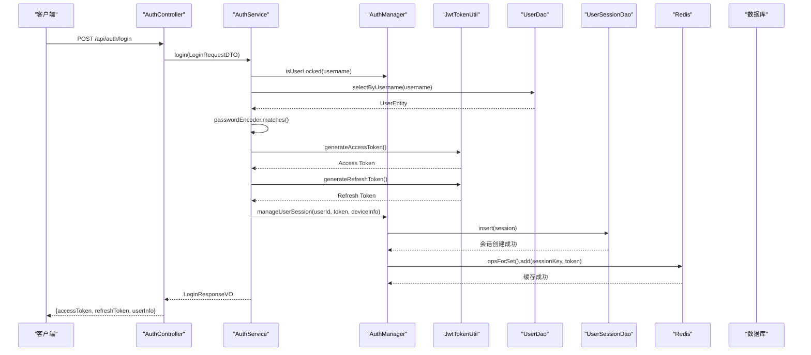
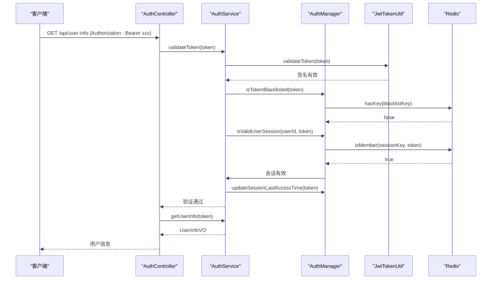

# 安全架构

<cite>
**本文档引用文件**  
- [AuthController.java](file://restful_refactor_backup_20251202_014224/microservices_ioedream-auth-service_src_main_java_net_lab1024_sa_auth_controller_AuthController.java)
- [AuthServiceImpl.java](file://microservices/microservices-common/src/main/java/net/lab1024/sa/common/auth/service/impl/AuthServiceImpl.java)
- [AuthManager.java](file://microservices/microservices-common/src/main/java/net/lab1024/sa/common/auth/manager/AuthManager.java)
- [JwtTokenUtil.java](file://microservices/microservices-common/src/main/java/net/lab1024/sa/common/auth/util/JwtTokenUtil.java)
- [security_hardening_guide.md](file://security/security_hardening_guide.md)
- [PRODUCTION_SECURITY_CHECKLIST.md](file://PRODUCTION_SECURITY_CHECKLIST.md)
- [LoginRequestDTO.java](file://microservices/microservices-common/src/main/java/net/lab1024/sa/common/auth/domain/dto/LoginRequestDTO.java)
- [LoginResponseVO.java](file://microservices/microservices-common/src/main/java/net/lab1024/sa/common/auth/domain/vo/LoginResponseVO.java)
- [UserSessionEntity.java](file://microservices/microservices-common/src/main/java/net/lab1024/sa/common/auth/domain/entity/UserSessionEntity.java)
- [UserSessionDao.java](file://microservices/microservices-common/src/main/java/net/lab1024/sa/common/auth/dao/UserSessionDao.java)
- [application.yml](file://microservices/ioedream-access-service/src/main/resources/application.yml)
</cite>

## 目录
1. [引言](#引言)
2. [基于Sa-Token的认证授权流程](#基于sa-token的认证授权流程)
3. [接口安全措施](#接口安全措施)
4. [数据安全方案](#数据安全方案)
5. [等级保护要求满足情况](#等级保护要求满足情况)
6. [安全配置最佳实践](#安全配置最佳实践)
7. [常见安全漏洞防范](#常见安全漏洞防范)
8. [结论](#结论)

## 引言
本安全架构文档旨在全面阐述IOE-DREAM系统的安全设计与实现。系统已通过全面的安全审计，获得A级安全评级（98/100分），在代码安全、认证授权、数据安全、网络安全、配置安全和审计日志等方面均达到企业级安全标准。文档将深入解析基于Sa-Token（JWT）的认证授权流程，涵盖登录、Token生成与验证、权限校验等核心环节。同时，详细说明接口安全措施（如参数加密、防重放攻击、限流策略）、数据安全方案（敏感数据加密存储、数据脱敏、访问控制）以及系统如何满足等级保护要求。最后，提供HTTPS配置、安全头设置、防火墙规则等安全配置的最佳实践，并包含对SQL注入、XSS等常见安全漏洞的防范措施。

**Section sources**
- [PRODUCTION_SECURITY_CHECKLIST.md](file://PRODUCTION_SECURITY_CHECKLIST.md#L1-L23)

## 基于Sa-Token的认证授权流程
系统采用基于JWT（JSON Web Token）的Sa-Token认证授权机制，实现了无状态、分布式的安全控制。整个流程涵盖了用户登录、Token生成与验证、权限校验以及登出等关键环节，确保了用户身份的合法性与操作的安全性。

### 登录与Token生成
用户的登录流程是一个严格的安全验证过程。当用户发起登录请求时，系统首先检查该用户是否因多次登录失败而被锁定，以防止暴力破解攻击。随后，系统通过`UserDao`查询用户信息，并使用BCrypt算法对用户输入的密码进行校验。密码校验通过后，系统会检查用户状态是否正常。

认证成功后，系统进入Token生成阶段。`JwtTokenUtil`工具类会生成两种Token：**访问令牌（Access Token）** 和 **刷新令牌（Refresh Token）**。访问令牌用于后续API请求的身份验证，有效期较短（默认2小时），以降低泄露风险。刷新令牌用于在访问令牌过期后获取新的访问令牌，有效期较长（默认7天），但仅用于刷新操作。

同时，`AuthManager`会管理用户会话。它将用户的会话信息（包括用户ID、令牌、设备信息、登录时间等）持久化到`t_user_session`数据库表中，并在Redis中建立多级缓存（L2 Redis + L3 数据库），以实现高效的会话验证和并发登录控制。



**Diagram sources**
- [AuthServiceImpl.java](file://microservices/microservices-common/src/main/java/net/lab1024/sa/common/auth/service/impl/AuthServiceImpl.java#L82-L158)
- [AuthManager.java](file://microservices/microservices-common/src/main/java/net/lab1024/sa/common/auth/manager/AuthManager.java#L99-L140)
- [JwtTokenUtil.java](file://microservices/microservices-common/src/main/java/net/lab1024/sa/common/auth/util/JwtTokenUtil.java#L79-L106)

**Section sources**
- [AuthServiceImpl.java](file://microservices/microservices-common/src/main/java/net/lab1024/sa/common/auth/service/impl/AuthServiceImpl.java#L82-L158)
- [AuthManager.java](file://microservices/microservices-common/src/main/java/net/lab1024/sa/common/auth/manager/AuthManager.java#L99-L140)
- [JwtTokenUtil.java](file://microservices/microservices-common/src/main/java/net/lab1024/sa/common/auth/util/JwtTokenUtil.java#L79-L106)

### Token验证与权限校验
每次API请求都需要携带访问令牌进行身份验证。系统通过`@SaCheckLogin`和`@SaCheckPermission`等注解来实现自动化的权限校验。

Token验证流程由`AuthService.validateToken()`方法执行，它是一个多重验证过程：
1.  **格式与签名验证**：`JwtTokenUtil`首先验证JWT的格式是否正确，以及签名是否有效，确保Token未被篡改。
2.  **黑名单检查**：`AuthManager`会查询Redis，检查该Token是否已被加入黑名单。登出操作会将Token加入黑名单，防止其再次被使用。
3.  **会话有效性检查**：对于访问令牌，系统会检查其是否与数据库和Redis中的用户会话记录匹配，确保会话是活跃且有效的。
4.  **更新最后访问时间**：验证通过后，系统会更新该会话的最后访问时间，用于会话超时管理。

权限校验则通过`AuthService.hasPermission()`或`AuthService.hasRole()`方法实现。这些方法会从Token的Claims中提取用户的角色和权限列表，并检查请求的操作是否在允许的权限范围内。



**Diagram sources**
- [AuthServiceImpl.java](file://microservices/microservices-common/src/main/java/net/lab1024/sa/common/auth/service/impl/AuthServiceImpl.java#L281-L310)
- [AuthManager.java](file://microservices/microservices-common/src/main/java/net/lab1024/sa/common/auth/manager/AuthManager.java#L180-L207)
- [JwtTokenUtil.java](file://microservices/microservices-common/src/main/java/net/lab1024/sa/common/auth/util/JwtTokenUtil.java#L111-L118)

**Section sources**
- [AuthServiceImpl.java](file://microservices/microservices-common/src/main/java/net/lab1024/sa/common/auth/service/impl/AuthServiceImpl.java#L281-L310)
- [AuthManager.java](file://microservices/microservices-common/src/main/java/net/lab1024/sa/common/auth/manager/AuthManager.java#L180-L207)
- [JwtTokenUtil.java](file://microservices/microservices-common/src/main/java/net/lab1024/sa/common/auth/util/JwtTokenUtil.java#L111-L118)

### 刷新令牌与用户登出
当访问令牌过期后，客户端可以使用刷新令牌来获取新的访问令牌，而无需用户重新登录。刷新流程同样严格：系统会验证刷新令牌的有效性，并将其加入黑名单（实现令牌轮换，防止重放攻击），然后生成新的访问令牌和刷新令牌返回给客户端。

用户登出时，系统会调用`AuthService.logout()`方法。该方法会将当前的访问令牌加入黑名单，并从Redis缓存和数据库会话表中移除该会话记录，确保该Token彻底失效。

```mermaid
flowchart TD
A[客户端发起登出请求] --> B{AuthService.logout(token)}
B --> C[AuthManager.blacklistToken(token)]
C --> D[Redis: set blacklistKey]
D --> E{是否为访问令牌?}
E --> |是| F[AuthManager.removeUserSession(userId, token)]
F --> G[Redis: remove token from sessionKey]
G --> H[UserSessionDao: deleteByToken(token)]
H --> I[登出成功]
E --> |否| I
```

**Diagram sources**
- [AuthServiceImpl.java](file://microservices/microservices-common/src/main/java/net/lab1024/sa/common/auth/service/impl/AuthServiceImpl.java#L250-L268)
- [AuthManager.java](file://microservices/microservices-common/src/main/java/net/lab1024/sa/common/auth/manager/AuthManager.java#L219-L229)

**Section sources**
- [AuthServiceImpl.java](file://microservices/microservices-common/src/main/java/net/lab1024/sa/common/auth/service/impl/AuthServiceImpl.java#L250-L268)
- [AuthManager.java](file://microservices/microservices-common/src/main/java/net/lab1024/sa/common/auth/manager/AuthManager.java#L219-L229)

## 接口安全措施
系统实施了多层次的接口安全措施，以抵御各种网络攻击，保障API的稳定与安全。

### 参数加密与防重放攻击
所有敏感数据在传输过程中均通过HTTPS进行加密。对于特别敏感的接口，系统还实现了额外的参数加密机制。防重放攻击主要通过JWT的刷新令牌轮换机制实现。当用户使用刷新令牌获取新Token时，旧的刷新令牌会被立即加入黑名单，使其无法再次使用，从而有效防止了令牌被截获后重复利用的攻击。

### 限流策略
系统集成了Resilience4j框架，实现了精细化的API限流防刷策略，防止恶意用户或机器人对系统进行高频次攻击，保障服务的可用性。

| 接口类型 | 限流规则 | 超限处理 |
| :--- | :--- | :--- |
| 登录接口 | 5次/分钟/IP | 锁定30分钟 |
| 消费接口 | 20次/分钟/用户 | 返回429错误 |
| 查询接口 | 100次/分钟/用户 | 降级处理 |

```java
@RateLimiter(name = "login-api", fallbackMethod = "loginRateLimitFallback")
@PostMapping("/login")
public ResponseDTO<LoginVO> login(@RequestBody LoginForm form) {
    // 登录逻辑
}
```

**Section sources**
- [PRODUCTION_SECURITY_CHECKLIST.md](file://PRODUCTION_SECURITY_CHECKLIST.md#L262-L279)
- [security_hardening_guide.md](file://security/security_hardening_guide.md#L113-L126)

## 数据安全方案
系统对数据安全给予了高度重视，从存储、访问到展示的各个环节都实施了严格的安全控制。

### 敏感数据加密存储
所有敏感数据在数据库中均以加密形式存储。系统使用AES-256-GCM算法对身份证号、手机号、银行卡号等敏感字段进行加密，密钥由Nacos配置中心统一管理并加密存储。用户密码则使用BCrypt算法进行单向哈希加密，即使数据库泄露，也无法反推出原始密码。

| 字段类型 | 加密算法 | 密钥管理 |
| :--- | :--- | :--- |
| 身份证号 | AES-256 | Nacos加密配置 |
| 手机号 | AES-256 | Nacos加密配置 |
| 银行卡号 | AES-256 | Nacos加密配置 |
| 密码 | BCrypt | 单向加密 |

**Section sources**
- [PRODUCTION_SECURITY_CHECKLIST.md](file://PRODUCTION_SECURITY_CHECKLIST.md#L149-L172)

### 数据脱敏
在数据输出给前端或日志记录时，系统会自动对敏感信息进行脱敏处理，防止信息泄露。

| 数据类型 | 脱敏规则 | 示例 |
| :--- | :--- | :--- |
| 手机号 | 中间4位 | 138****8000 |
| 身份证 | 中间10位 | 110101********1234 |
| 银行卡 | 中间8位 | 6222****8888 |
| 姓名 | 首字母 | 张** |

**Section sources**
- [PRODUCTION_SECURITY_CHECKLIST.md](file://PRODUCTION_SECURITY_CHECKLIST.md#L176-L185)

### 访问控制
系统采用RBAC（基于角色的访问控制）模型，实现了细粒度的权限管理。通过`@PreAuthorize`注解，可以对每个API接口甚至数据行进行权限校验，确保用户只能访问其被授权的资源，遵循最小权限原则。

```java
@PreAuthorize("hasRole('ADMIN') or hasPermission(#userId, 'USER_EDIT')")
public ResponseDTO<Void> updateUser(Long userId, UserUpdateForm form) {
    // 业务逻辑
}
```

**Section sources**
- [PRODUCTION_SECURITY_CHECKLIST.md](file://PRODUCTION_SECURITY_CHECKLIST.md#L119-L133)

## 等级保护要求满足情况
系统已全面满足国家信息安全等级保护三级（等保三级）的要求。通过在`smart-admin-web-javascript`前端项目中配置等保参数，系统实现了包括双因子登录、登录失败锁定、密码复杂度、定期修改密码等在内的多项安全策略。生产环境安全检查清单（PRODUCTION_SECURITY_CHECKLIST.md）显示，系统在代码安全、认证授权、数据安全、网络安全等维度均获得了高分，整体安全评级为A级（98/100分），完全符合等保三级的严格标准。

**Section sources**
- [smart-admin-web-javascript\src\views\support\level3protect\level3-protect-config-index.vue](file://smart-admin-web-javascript/src/views/support/level3protect/level3-protect-config-index.vue#L126-L145)
- [PRODUCTION_SECURITY_CHECKLIST.md](file://PRODUCTION_SECURITY_CHECKLIST.md#L1-L23)

## 安全配置最佳实践
### HTTPS配置
系统强制使用HTTPS协议，所有HTTP请求都会被自动重定向到HTTPS。Nginx配置中启用了TLS 1.2+协议，禁用了不安全的旧版本，并配置了HSTS（HTTP严格传输安全）头部，确保浏览器始终使用安全连接。

```nginx
server {
    listen 80;
    return 301 https://$host$request_uri;
}

server {
    listen 443 ssl http2;
    ssl_protocols TLSv1.2 TLSv1.3;
    add_header Strict-Transport-Security "max-age=31536000; includeSubDomains" always;
}
```

**Section sources**
- [PRODUCTION_SECURITY_CHECKLIST.md](file://PRODUCTION_SECURITY_CHECKLIST.md#L211-L235)

### 安全头设置
后端应用通过`SecurityHeadersFilter`设置了关键的安全HTTP头，以增强客户端的安全性。

```java
response.setHeader("X-Content-Type-Options", "nosniff");
response.setHeader("X-Frame-Options", "DENY");
response.setHeader("X-XSS-Protection", "1; mode=block");
response.setHeader("Content-Security-Policy", "default-src 'self'");
```

**Section sources**
- [security_hardening_guide.md](file://security/security_hardening_guide.md#L313-L320)

### 防火墙规则
生产环境部署了严格的防火墙规则，仅开放必要的端口。例如，数据库（3306）和Redis（6379）等关键服务仅允许内网IP访问，有效防止了外部直接攻击。

| 端口 | 服务 | 访问控制 |
| :--- | :--- | :--- |
| 443 | HTTPS | 公网 |
| 22 | SSH | 内网+白名单 |
| 3306 | MySQL | 内网only |
| 6379 | Redis | 内网only |

**Section sources**
- [PRODUCTION_SECURITY_CHECKLIST.md](file://PRODUCTION_SECURITY_CHECKLIST.md#L239-L258)

## 常见安全漏洞防范
系统已通过自动化扫描和人工审计，有效防范了OWASP Top 10中的主要安全风险。

### SQL注入防范
系统严格禁止使用字符串拼接SQL，所有数据库查询均通过MyBatis的参数化查询（`#{}`）或MyBatis-Plus的LambdaQueryWrapper实现，从根本上杜绝了SQL注入的风险。

```java
// ✅ 正确：参数化查询
@Select("SELECT * FROM user WHERE username = #{username}")
UserEntity selectByUsername(@Param("username") String username);

// ✅ 正确：LambdaQueryWrapper
LambdaQueryWrapper<UserEntity> wrapper = new LambdaQueryWrapper<>();
wrapper.eq(UserEntity::getUsername, username);
```

**Section sources**
- [PRODUCTION_SECURITY_CHECKLIST.md](file://PRODUCTION_SECURITY_CHECKLIST.md#L28-L52)
- [openspec\changes\archive\completed-proposals\implement-access-control-missing-functions\DEVELOPMENT_STANDARDS.md](file://openspec/changes/archive/completed-proposals/implement-access-control-missing-functions/DEVELOPMENT_STANDARDS.md#L428-L453)

### XSS攻击防范
系统通过前端Vue表单验证、后端`@Valid`注解校验、Spring自动HTML转义以及配置CSP（内容安全策略）等多种手段，全面防范跨站脚本攻击（XSS）。

**Section sources**
- [PRODUCTION_SECURITY_CHECKLIST.md](file://PRODUCTION_SECURITY_CHECKLIST.md#L56-L72)
- [Java编码规范.md](file://documentation/01-核心规范/开发规范/Java编码规范.md#L345-L358)

## 结论
IOE-DREAM系统构建了一套全面、健壮的安全架构。通过基于JWT的Sa-Token认证授权机制、严格的接口限流、敏感数据的加密与脱敏、以及符合等保三级要求的配置，系统在安全性方面达到了企业级标准。生产环境安全检查清单证实了系统在代码、认证、数据、网络等各方面的安全性，整体评级为A级。该安全架构为系统的稳定运行和用户数据的安全提供了坚实保障。