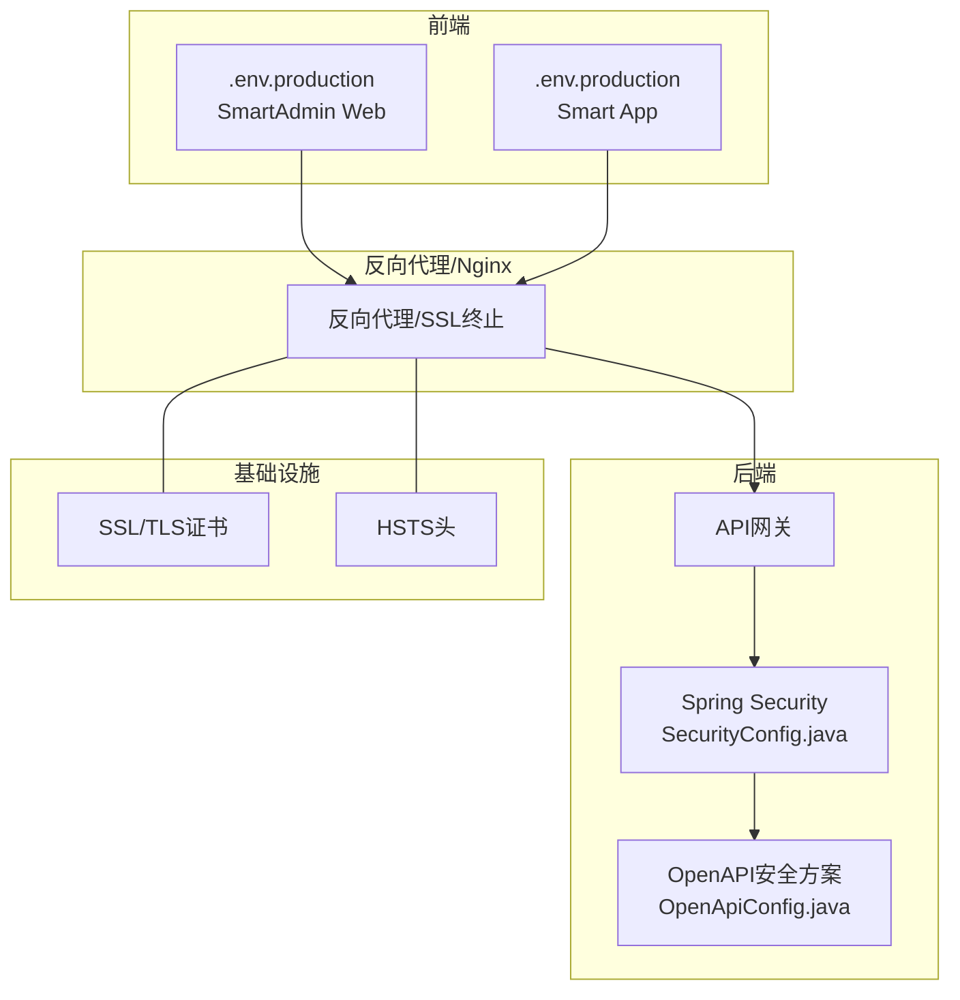
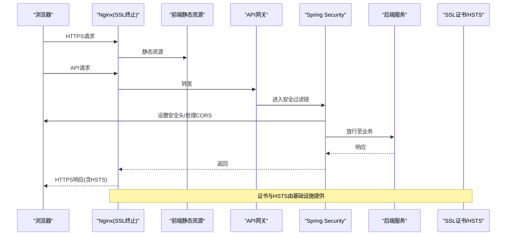
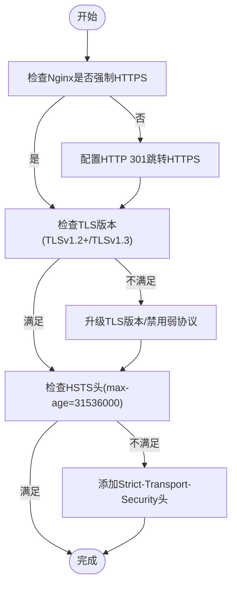
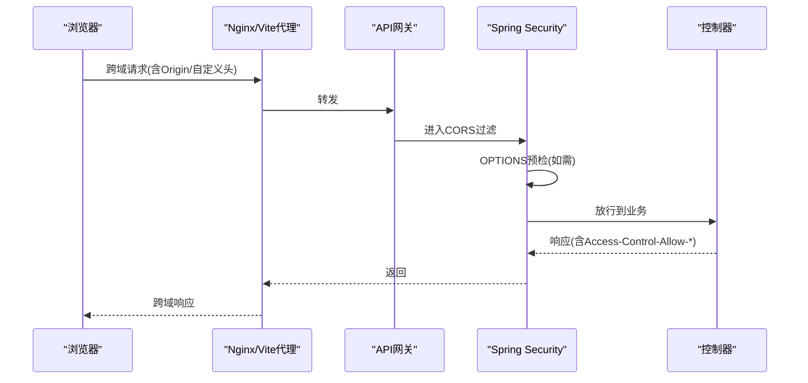
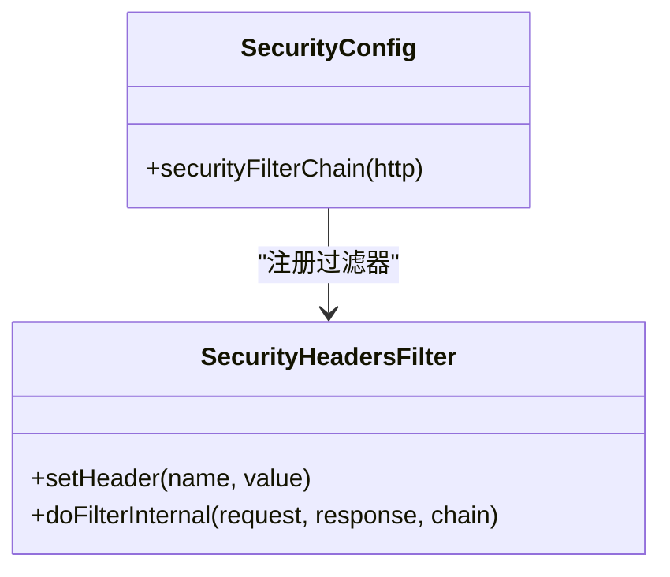
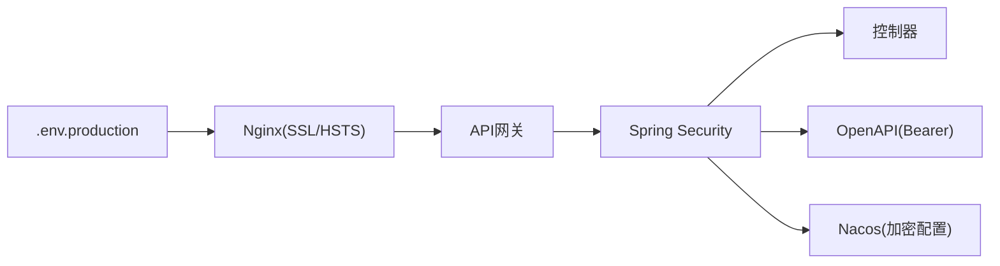

# HTTPS、CORS与安全头

<cite>
**本文引用的文件**
- [secure-application.yml](file://templates/secure-application.yml)
- [security_hardening_guide.md](file://security/security_hardening_guide.md)
- [PRODUCTION_SECURITY_CHECKLIST.md](file://PRODUCTION_SECURITY_CHECKLIST.md)
- [Deployment Guide](file://documentation/04-部署运维/部署指南.md)
- [SecurityConfig.java](file://microservices/microservices-common/src/main/java/net/lab1024/sa/common/auth/config/SecurityConfig.java)
- [.env.production（SmartAdmin Web）](file://smart-admin-web-javascript/.env.production)
- [.env.production（Smart App）](file://smart-app/.env.production)
- [DEVICE_MANAGEMENT_DEPLOYMENT.md](file://documentation/04-部署运维/DEVICE_MANAGEMENT_DEPLOYMENT.md)
- [OpenApiConfig.java](file://microservices/ioedream-common-service/src/main/java/net/lab1024/sa/common/config/OpenApiConfig.java)
- [config-security-fix.py](file://scripts/config-security-fix.py)
- [check-plaintext-passwords.sh](file://scripts/check-plaintext-passwords.sh)
</cite>

## 目录
1. [简介](#简介)
2. [项目结构](#项目结构)
3. [核心组件](#核心组件)
4. [架构总览](#架构总览)
5. [详细组件分析](#详细组件分析)
6. [依赖关系分析](#依赖关系分析)
7. [性能考虑](#性能考虑)
8. [故障排查指南](#故障排查指南)
9. [结论](#结论)
10. [附录](#附录)

## 简介
本文件聚焦于传输安全与浏览器安全策略，围绕HTTPS配置、TLS版本控制、HSTS头设置、CORS策略配置、关键安全HTTP头的作用与配置，以及生产环境安全配置要点展开。同时结合模板与脚本工具，给出安全审计与落地实施建议，帮助团队在微服务与前端环境中构建强健的安全防线。

## 项目结构
围绕安全主题的关键位置与文件：
- 模板与配置
  - templates/secure-application.yml：企业级安全配置模板（含Nacos加密配置、共享配置等）
  - security/security_hardening_guide.md：HTTPS与安全头配置示例、接口安全、会话安全等
  - PRODUCTION_SECURITY_CHECKLIST.md：生产安全检查清单（含Nginx强制HTTPS与HSTS）
  - documentation/04-部署运维/部署指南.md：部署架构与反向代理、端口规划
  - documentation/04-部署运维/DEVICE_MANAGEMENT_DEPLOYMENT.md：前端Nginx代理与HTTPS建议
- 后端安全配置
  - microservices/microservices-common/src/main/java/net/lab1024/.../SecurityConfig.java：Spring Security过滤链、CORS、无状态会话
  - microservices/ioedream-common-service/src/main/java/net/lab1024/.../OpenApiConfig.java：OpenAPI安全方案（Bearer JWT）
- 前端环境
  - smart-admin-web-javascript/.env.production、smart-app/.env.production：生产环境API URL（建议HTTPS）
- 安全审计与扫描
  - scripts/config-security-fix.py、scripts/check-plaintext-passwords.sh：配置安全扫描与明文密码检查

图表来源
- [Deployment Guide](file://documentation/04-部署运维/部署指南.md#L292-L330)
- [DEVICE_MANAGEMENT_DEPLOYMENT.md](file://documentation/04-部署运维/DEVICE_MANAGEMENT_DEPLOYMENT.md#L229-L302)
- [SecurityConfig.java](file://microservices/microservices-common/src/main/java/net/lab1024/sa/common/auth/config/SecurityConfig.java#L1-L88)
- [OpenApiConfig.java](file://microservices/ioedream-common-service/src/main/java/net/lab1024/sa/common/config/OpenApiConfig.java#L118-L140)

章节来源
- [Deployment Guide](file://documentation/04-部署运维/部署指南.md#L292-L330)
- [DEVICE_MANAGEMENT_DEPLOYMENT.md](file://documentation/04-部署运维/DEVICE_MANAGEMENT_DEPLOYMENT.md#L229-L302)

## 核心组件
- HTTPS与TLS配置
  - 后端SSL/TLS与强制HTTPS跳转示例见安全加固指南
  - 生产安全检查清单提供Nginx强制HTTPS与HSTS配置片段
  - 部署指南强调反向代理终止SSL并仅暴露必要端口
- CORS策略
  - Spring Security中通过HttpSecurity配置CORS，结合白名单公开接口
  - 前端通过Vite代理与Nginx代理实现跨域访问
- 关键安全HTTP头
  - 安全加固指南提供X-Content-Type-Options、X-Frame-Options、X-XSS-Protection、Strict-Transport-Security、Content-Security-Policy、Referrer-Policy等头设置示例
- 生产环境安全配置
  - secure-application.yml展示Nacos加密配置、共享配置、数据源安全过滤等
  - .env.production中API URL建议使用HTTPS
  - 安全审计脚本用于扫描明文密码与配置风险

章节来源
- [security_hardening_guide.md](file://security/security_hardening_guide.md#L270-L326)
- [PRODUCTION_SECURITY_CHECKLIST.md](file://PRODUCTION_SECURITY_CHECKLIST.md#L211-L264)
- [Deployment Guide](file://documentation/04-部署运维/部署指南.md#L292-L330)
- [SecurityConfig.java](file://microservices/microservices-common/src/main/java/net/lab1024/sa/common/auth/config/SecurityConfig.java#L55-L88)
- [secure-application.yml](file://templates/secure-application.yml#L1-L132)
- [.env.production（SmartAdmin Web）](file://smart-admin-web-javascript/.env.production#L1-L3)
- [.env.production（Smart App）](file://smart-app/.env.production#L1-L3)
- [config-security-fix.py](file://scripts/config-security-fix.py#L291-L324)
- [check-plaintext-passwords.sh](file://scripts/check-plaintext-passwords.sh#L135-L171)

## 架构总览
下图展示了生产环境中的安全交互路径：浏览器经由Nginx反向代理访问前端静态资源与API网关；后端通过Spring Security统一拦截，应用CORS与安全头；OpenAPI文档定义JWT认证方案；基础设施侧提供SSL证书与HSTS头。

图表来源
- [Deployment Guide](file://documentation/04-部署运维/部署指南.md#L292-L330)
- [SecurityConfig.java](file://microservices/microservices-common/src/main/java/net/lab1024/sa/common/auth/config/SecurityConfig.java#L55-L88)
- [OpenApiConfig.java](file://microservices/ioedream-common-service/src/main/java/net/lab1024/sa/common/config/OpenApiConfig.java#L118-L140)
- [PRODUCTION_SECURITY_CHECKLIST.md](file://PRODUCTION_SECURITY_CHECKLIST.md#L211-L264)

## 详细组件分析

### HTTPS与TLS配置
- 后端SSL/TLS与强制HTTPS跳转
  - 示例：server.ssl.enabled、key-store、trust-store、http.port、tomcat.remote-ip-header等
  - 建议：生产环境强制HTTPS，反向代理终止SSL，后端仅监听内网端口
- 生产安全检查清单
  - Nginx强制HTTP 301跳转HTTPS
  - TLS 1.2/1.3启用，禁用弱协议与套件
  - HSTS头配置（max-age=31536000；includeSubDomains）
- 部署指南
  - 仅暴露必要端口（80/443前端、8080网关）
  - 反向代理用于请求转发与SSL终止

图表来源
- [security_hardening_guide.md](file://security/security_hardening_guide.md#L270-L326)
- [PRODUCTION_SECURITY_CHECKLIST.md](file://PRODUCTION_SECURITY_CHECKLIST.md#L211-L264)
- [Deployment Guide](file://documentation/04-部署运维/部署指南.md#L292-L330)

章节来源
- [security_hardening_guide.md](file://security/security_hardening_guide.md#L270-L326)
- [PRODUCTION_SECURITY_CHECKLIST.md](file://PRODUCTION_SECURITY_CHECKLIST.md#L211-L264)
- [Deployment Guide](file://documentation/04-部署运维/部署指南.md#L292-L330)

### CORS策略配置
- Spring Security中通过HttpSecurity启用CORS，并配置公开接口白名单
- 前端通过Vite代理与Nginx代理实现跨域访问，避免浏览器同源限制
- 预检请求（OPTIONS）由CORS处理器自动处理，后端需确保对应路径放行

图表来源
- [SecurityConfig.java](file://microservices/microservices-common/src/main/java/net/lab1024/sa/common/auth/config/SecurityConfig.java#L55-L88)
- [DEVICE_MANAGEMENT_DEPLOYMENT.md](file://documentation/04-部署运维/DEVICE_MANAGEMENT_DEPLOYMENT.md#L229-L302)

章节来源
- [SecurityConfig.java](file://microservices/microservices-common/src/main/java/net/lab1024/sa/common/auth/config/SecurityConfig.java#L55-L88)
- [DEVICE_MANAGEMENT_DEPLOYMENT.md](file://documentation/04-部署运维/DEVICE_MANAGEMENT_DEPLOYMENT.md#L229-L302)

### 关键安全HTTP头
- X-Content-Type-Options: nosniff，阻止MIME嗅探
- X-Frame-Options: DENY，防止点击劫持
- X-XSS-Protection: 1; mode=block，启用浏览器XSS过滤
- Strict-Transport-Security: max-age=31536000; includeSubDomains，强制HTTPS
- Content-Security-Policy: default-src 'self'，限制资源来源
- Referrer-Policy: strict-origin-when-cross-origin，控制Referrer

图表来源
- [security_hardening_guide.md](file://security/security_hardening_guide.md#L293-L326)

章节来源
- [security_hardening_guide.md](file://security/security_hardening_guide.md#L293-L326)

### 生产环境安全配置（secure-application.yml）
- Nacos加密配置与共享配置
  - spring.cloud.nacos.config.shared-configs：加载common-security-config.yaml等共享配置
  - nacos.config.key：密钥管理
- 数据源安全过滤
  - filters.stat、filters.wall、filters.config：慢SQL、SQL注入防护、配置解密
- Redis安全配置
  - 密码、超时、连接池参数
- 加密配置导入
  - spring.config.import: optional:classpath:security-config.yml

章节来源
- [secure-application.yml](file://templates/secure-application.yml#L1-L132)

### 前端生产环境安全配置（.env.production）
- SmartAdmin Web与Smart App的生产环境API URL均指向HTTPS域名
- 建议：生产环境始终使用HTTPS，避免混合内容与降级风险

章节来源
- [.env.production（SmartAdmin Web）](file://smart-admin-web-javascript/.env.production#L1-L3)
- [.env.production（Smart App）](file://smart-app/.env.production#L1-L3)

### OpenAPI与JWT安全方案
- OpenAPI安全方案定义Bearer JWT认证，要求在请求头携带Authorization: Bearer {token}
- 结合Spring Security无状态会话与CORS，确保接口访问安全

章节来源
- [OpenApiConfig.java](file://microservices/ioedream-common-service/src/main/java/net/lab1024/sa/common/config/OpenApiConfig.java#L118-L140)
- [SecurityConfig.java](file://microservices/microservices-common/src/main/java/net/lab1024/sa/common/auth/config/SecurityConfig.java#L55-L88)

### 安全审计工具使用指南
- config-security-fix.py
  - 支持对指定微服务或全量检查配置安全风险
  - 输出高/中/低风险统计，便于分级整改
- check-plaintext-passwords.sh
  - 自动扫描明文密码，生成报告并退出码提示风险等级
  - 建议纳入CI流水线，形成常态化安全扫描

章节来源
- [config-security-fix.py](file://scripts/config-security-fix.py#L291-L324)
- [check-plaintext-passwords.sh](file://scripts/check-plaintext-passwords.sh#L135-L171)

## 依赖关系分析
- 组件耦合
  - 前端与后端通过API网关与CORS协作，后端通过Spring Security统一拦截
  - 基础设施（Nginx）承担SSL终止与HSTS头注入
- 外部依赖
  - Nacos配置中心用于加密配置与共享配置
  - OpenAPI定义JWT认证方案，配合后端安全过滤链

图表来源
- [Deployment Guide](file://documentation/04-部署运维/部署指南.md#L292-L330)
- [SecurityConfig.java](file://microservices/microservices-common/src/main/java/net/lab1024/sa/common/auth/config/SecurityConfig.java#L55-L88)
- [OpenApiConfig.java](file://microservices/ioedream-common-service/src/main/java/net/lab1024/sa/common/config/OpenApiConfig.java#L118-L140)
- [secure-application.yml](file://templates/secure-application.yml#L1-L132)

章节来源
- [Deployment Guide](file://documentation/04-部署运维/部署指南.md#L292-L330)
- [SecurityConfig.java](file://microservices/microservices-common/src/main/java/net/lab1024/sa/common/auth/config/SecurityConfig.java#L55-L88)
- [OpenApiConfig.java](file://microservices/ioedream-common-service/src/main/java/net/lab1024/sa/common/config/OpenApiConfig.java#L118-L140)
- [secure-application.yml](file://templates/secure-application.yml#L1-L132)

## 性能考虑
- HTTPS与HSTS
  - 启用TLS 1.2/1.3与现代密码套件，减少握手开销与兼容性问题
  - HSTS可降低中间人攻击风险，但需谨慎设置max-age，避免误伤
- CORS
  - 控制预检频率，避免不必要的OPTIONS请求
  - 白名单精确配置，减少跨域宽泛策略带来的性能与安全风险
- 反向代理
  - 合理缓存静态资源，减少后端压力
  - 仅暴露必要端口，降低攻击面

[本节为通用指导，不直接分析具体文件]

## 故障排查指南
- HTTPS/HSTS问题
  - 确认Nginx是否正确配置强制HTTPS与HSTS头
  - 检查证书链与域名匹配，避免浏览器报错
- CORS失败
  - 检查预检请求是否被正确放行
  - 核对Origin与自定义头是否在CORS白名单中
- 明文密码与配置风险
  - 使用check-plaintext-passwords.sh扫描明文密码
  - 使用config-security-fix.py对微服务进行配置安全检查与整改
- OpenAPI/JWT
  - 确认请求头Authorization: Bearer {token}正确传递
  - 检查后端安全过滤链是否启用CORS与无状态会话

章节来源
- [PRODUCTION_SECURITY_CHECKLIST.md](file://PRODUCTION_SECURITY_CHECKLIST.md#L211-L264)
- [SecurityConfig.java](file://microservices/microservices-common/src/main/java/net/lab1024/sa/common/auth/config/SecurityConfig.java#L55-L88)
- [check-plaintext-passwords.sh](file://scripts/check-plaintext-passwords.sh#L135-L171)
- [config-security-fix.py](file://scripts/config-security-fix.py#L291-L324)
- [OpenApiConfig.java](file://microservices/ioedream-common-service/src/main/java/net/lab1024/sa/common/config/OpenApiConfig.java#L118-L140)

## 结论
通过在基础设施层强制HTTPS与HSTS、在后端统一应用CORS与安全头、在配置中心实施加密配置与共享配置、在前端使用HTTPS与代理策略，以及借助安全审计脚本形成常态化检查机制，IOE-DREAM项目能够在微服务与前端环境中构建完整的传输安全与浏览器安全策略，有效降低常见安全威胁。

[本节为总结性内容，不直接分析具体文件]

## 附录
- 参考文件路径
  - [secure-application.yml](file://templates/secure-application.yml#L1-L132)
  - [security_hardening_guide.md](file://security/security_hardening_guide.md#L270-L326)
  - [PRODUCTION_SECURITY_CHECKLIST.md](file://PRODUCTION_SECURITY_CHECKLIST.md#L211-L264)
  - [Deployment Guide](file://documentation/04-部署运维/部署指南.md#L292-L330)
  - [DEVICE_MANAGEMENT_DEPLOYMENT.md](file://documentation/04-部署运维/DEVICE_MANAGEMENT_DEPLOYMENT.md#L229-L302)
  - [SecurityConfig.java](file://microservices/microservices-common/src/main/java/net/lab1024/sa/common/auth/config/SecurityConfig.java#L55-L88)
  - [OpenApiConfig.java](file://microservices/ioedream-common-service/src/main/java/net/lab1024/sa/common/config/OpenApiConfig.java#L118-L140)
  - [.env.production（SmartAdmin Web）](file://smart-admin-web-javascript/.env.production#L1-L3)
  - [.env.production（Smart App）](file://smart-app/.env.production#L1-L3)
  - [config-security-fix.py](file://scripts/config-security-fix.py#L291-L324)
  - [check-plaintext-passwords.sh](file://scripts/check-plaintext-passwords.sh#L135-L171)