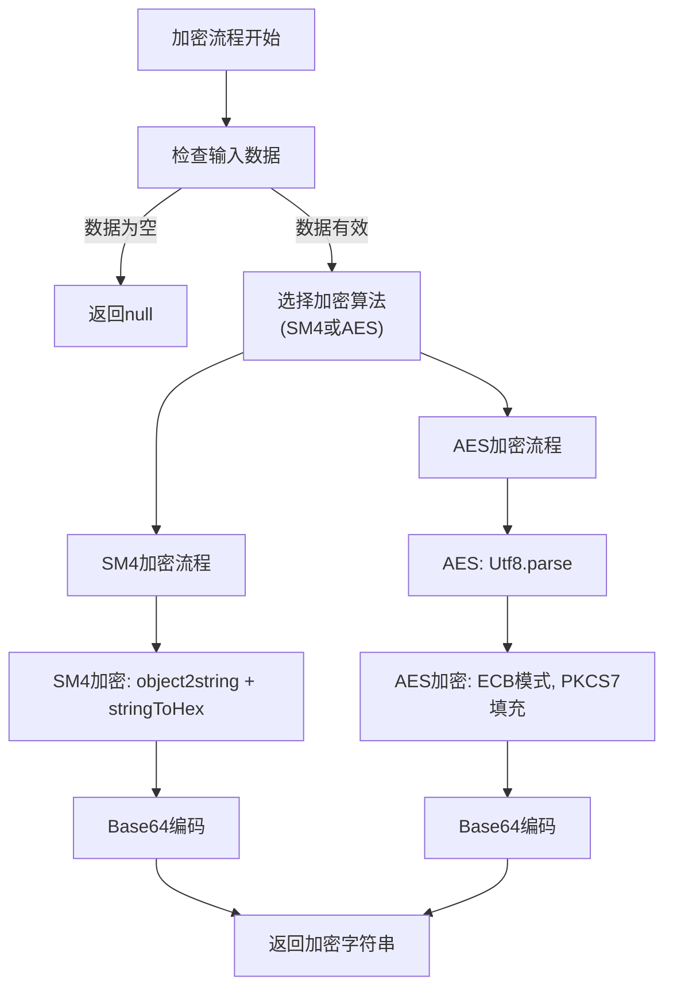
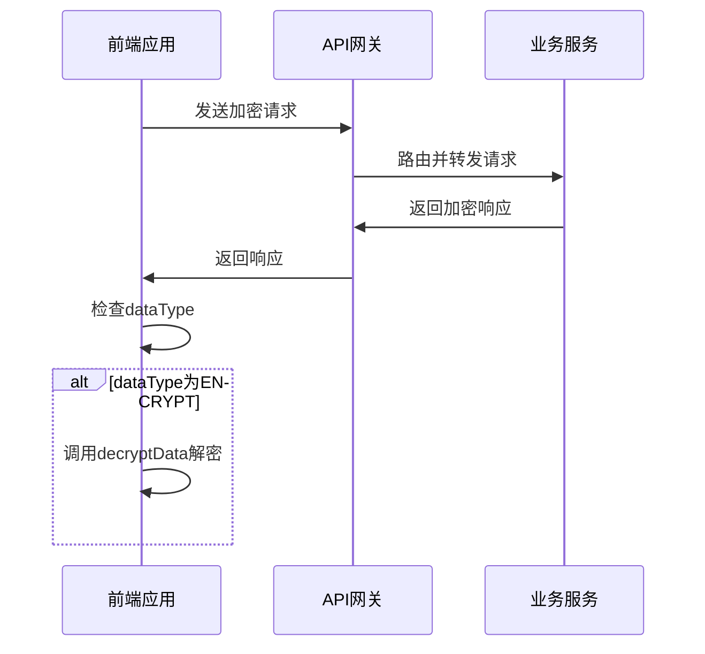
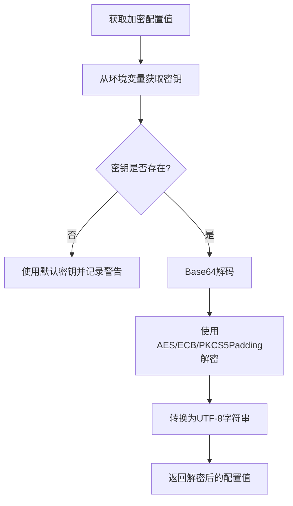
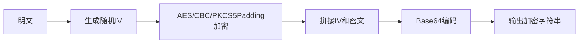

# 接口加密

<cite>
**本文档引用文件**   
- [encrypt.js](file://smart-admin-web-javascript/src/lib/encrypt.js)
- [api-encrypt-api.js](file://smart-admin-web-javascript/src/api/support/api-encrypt-api.js)
- [secure-application.yml](file://templates/secure-application.yml)
- [ConfigManager.java](file://microservices/microservices-common/src/main/java/net/lab1024/sa/common/system/manager/ConfigManager.java)
- [encrypt-config.java](file://scripts/encrypt-config.java)
- [api-encrypt-index.vue](file://smart-admin-web-javascript/src/views/support/api-encrypt/api-encrypt-index.vue)
</cite>

## 目录
1. [引言](#引言)
2. [前端加密机制](#前端加密机制)
3. [后端解密处理](#后端解密处理)
4. [加密配置管理](#加密配置管理)
5. [加密算法选型与性能](#加密算法选型与性能)
6. [密钥管理与安全策略](#密钥管理与安全策略)
7. [风险应对与最佳实践](#风险应对与最佳实践)
8. [结论](#结论)

## 引言

接口加密机制是IOE-DREAM系统安全架构的核心组成部分，旨在保护敏感数据在传输过程中的机密性和完整性。本系统采用前后端协同的加密方案，前端JavaScript库负责请求参数的加密，后端网关层负责解密处理，同时通过Nacos配置中心实现加密配置的集中管理。该机制不仅防止了中间人攻击，还确保了数据库密码等敏感信息不会以明文形式出现在配置文件中。

**Section sources**
- [api-encrypt-index.vue](file://smart-admin-web-javascript/src/views/support/api-encrypt/api-encrypt-index.vue#L1-L238)

## 前端加密机制

前端加密主要通过`smart-admin-web-javascript/src/lib/encrypt.js`文件实现，该文件提供了统一的加密和解密接口。系统支持国密SM4和AES两种加密算法，当前默认使用SM4算法。

### 加密库实现原理

`encrypt.js`库的核心是一个灵活的加密对象（`EncryptObject`），它允许在SM4和AES算法之间轻松切换。开发者只需修改`const EncryptObject = SM4;`这一行代码，即可切换到AES算法。



**Diagram sources**
- [encrypt.js](file://smart-admin-web-javascript/src/lib/encrypt.js#L1-L120)

**Section sources**
- [encrypt.js](file://smart-admin-web-javascript/src/lib/encrypt.js#L1-L120)

### SM4加密流程

SM4加密流程分为两个步骤：
1.  **SM4加密**：使用`sm-crypto`库的`CryptoSM.sm4.encrypt`方法，将JSON字符串化的数据和16字节的十六进制密钥进行加密。
2.  **Base64编码**：将加密后的字符串通过`CryptoJS.enc.Utf8.parse`解析，再使用`CryptoJS.enc.Base64.stringify`进行Base64编码，生成最终的传输字符串。

### AES加密流程

AES加密流程同样分为两个步骤：
1.  **AES加密**：使用`CryptoJS.AES.encrypt`方法，采用ECB模式和PKCS7填充，对数据进行加密。
2.  **Base64编码**：直接对加密结果的`ciphertext`进行Base64编码。

### 加密参数格式

前端通过`postEncryptRequest`方法发送加密请求。该方法会自动调用`encryptData`函数对请求参数进行加密，并将加密后的数据作为请求体发送。后端通过`dataType`字段识别加密数据。

**Section sources**
- [encrypt.js](file://smart-admin-web-javascript/src/lib/encrypt.js#L79-L120)
- [axios.js](file://smart-admin-web-javascript/src/lib/axios.js#L77-L82)

## 后端解密处理

后端的解密处理主要在网关服务和通用组件中完成，确保了加密逻辑的统一和可维护性。

### 网关层解密流程

当加密请求到达网关服务（`ioedream-gateway-service`）时，系统会通过响应拦截器进行处理。在`smart-admin-web-javascript/src/lib/axios.js`中定义的响应拦截器会检查响应数据的`dataType`字段。



**Diagram sources**
- [axios.js](file://smart-admin-web-javascript/src/lib/axios.js#L76-L82)
- [GatewayServiceApplication.java](file://microservices/ioedream-gateway-service/src/main/java/net/lab1024/sa/gateway/GatewayServiceApplication.java#L1-L56)

**Section sources**
- [axios.js](file://smart-admin-web-javascript/src/lib/axios.js#L76-L82)

### 配置中心解密机制

对于存储在Nacos配置中心的加密配置（如数据库密码），系统通过`ConfigManager.java`中的`decryptConfigValue`方法进行解密。



**Diagram sources**
- [ConfigManager.java](file://microservices/microservices-common/src/main/java/net/lab1024/sa/common/system/manager/ConfigManager.java#L205-L233)

**Section sources**
- [ConfigManager.java](file://microservices/microservices-common/src/main/java/net/lab1024/sa/common/system/manager/ConfigManager.java#L205-L233)

## 加密配置管理

系统的加密配置通过`secure-application.yml`模板和`encrypt-config.java`工具进行管理，确保了配置的安全性和一致性。

### secure-application.yml配置

`templates/secure-application.yml`是安全配置的模板文件，它定义了如何在Spring Boot应用中启用Nacos的加密配置功能。

```yaml
# 数据源安全配置
datasource:
  password: ${DB_PASSWORD}  # 必须使用Nacos加密配置

# Druid安全配置
druid:
  filters:
    config:
      enabled: true
      connection-properties: |
        config.decrypt=true;
        config.decrypt.key=${nacos.config.key};
        config.decrypt.error=false
```

该配置启用了Druid连接池的config filter，使其能够自动解密Nacos中以`ENC(...)`格式存储的加密值。

**Section sources**
- [secure-application.yml](file://templates/secure-application.yml#L43-L71)

### 配置加密工具

`scripts/encrypt-config.java`是一个独立的Java工具，用于生成密钥和加密明文。它使用AES/CBC/PKCS5Padding算法，并在加密数据前生成随机的IV（初始化向量），然后将IV与加密数据拼接后进行Base64编码。



**Diagram sources**
- [encrypt-config.java](file://scripts/encrypt-config.java#L1-L53)

**Section sources**
- [encrypt-config.java](file://scripts/encrypt-config.java#L1-L140)

## 加密算法选型与性能

### 算法选型依据

系统选择SM4和AES算法主要基于以下几点：
- **国密合规性**：SM4是中国国家密码管理局发布的商用密码算法，符合国内安全合规要求。
- **广泛支持**：AES是国际标准，被广泛支持，具有良好的互操作性。
- **性能平衡**：两者都是对称加密算法，性能开销相对较小，适合高频的API调用场景。

### 性能影响评估

- **前端性能**：JavaScript加密对现代浏览器的性能影响微乎其微，加密过程通常在毫秒级内完成。
- **后端性能**：由于解密操作主要在配置加载时进行，且有缓存机制，对运行时性能几乎没有影响。
- **网络开销**：Base64编码会使数据体积增加约33%，但这是为了保证数据在HTTP传输中安全所必需的。

**Section sources**
- [encrypt.js](file://smart-admin-web-javascript/src/lib/encrypt.js#L31-L40)
- [encrypt.js](file://smart-admin-web-javascript/src/lib/encrypt.js#L68-L77)

## 密钥管理与安全策略

### 密钥管理策略

- **前端密钥**：硬编码在`encrypt.js`中（如`SM4_KEY = '1024lab__1024lab'`），虽然存在泄露风险，但结合HTTPS和代码混淆，可以满足一般安全需求。
- **后端密钥**：通过环境变量`CONFIG_ENCRYPT_KEY`注入，生产环境必须配置，避免使用默认密钥。
- **轮换方案**：密钥轮换需要同时更新前端代码和后端环境变量，建议通过自动化部署流程来完成，以减少人为错误。

### 安全策略

- **环境隔离**：开发、测试、生产环境使用不同的密钥。
- **最小权限**：只有必要的服务和人员才能访问密钥。
- **审计日志**：所有配置的修改和访问都应记录日志。

**Section sources**
- [encrypt.js](file://smart-admin-web-javascript/src/lib/encrypt.js#L80-L81)
- [ConfigManager.java](file://microservices/microservices-common/src/main/java/net/lab1024/sa/common/system/manager/ConfigManager.java#L168-L171)

## 风险应对与最佳实践

### 应对中间人攻击

- **强制HTTPS**：所有API调用必须通过HTTPS进行，防止数据在传输过程中被窃听或篡改。
- **完整性校验**：虽然当前方案未实现，但未来可考虑在加密数据中加入HMAC签名，以验证数据完整性。

### 应对密钥泄露风险

- **定期轮换**：建立密钥定期轮换机制。
- **应急响应**：一旦发现密钥泄露，立即启动密钥轮换流程。
- **前端混淆**：对前端JavaScript代码进行混淆，增加逆向工程的难度。

### 最佳实践

- **敏感数据加密**：除了接口数据，数据库中的敏感字段（如身份证号、手机号）也应进行加密存储。
- **配置中心安全**：Nacos配置中心本身应启用访问控制和审计功能。
- **安全测试**：定期进行渗透测试，验证加密机制的有效性。

**Section sources**
- [security_hardening_guide.md](file://security/security_hardening_guide.md#L405-L446)
- [PHASE1_TASK4_CONFIG_SECURITY_FIX.md](file://documentation/archive/reports-2025-12-04/PHASE1_TASK4_CONFIG_SECURITY_FIX.md#L65-L133)

## 结论

IOE-DREAM系统的接口加密机制构建了一个多层次的安全防护体系。从前端JavaScript的请求加密，到后端网关的自动解密，再到Nacos配置中心的加密存储，形成了一个完整的安全闭环。该方案在安全性、性能和可维护性之间取得了良好的平衡。未来可进一步增强，如引入非对称加密进行密钥交换，或采用更安全的加密模式（如CBC模式替代ECB模式），以应对日益复杂的网络安全威胁。