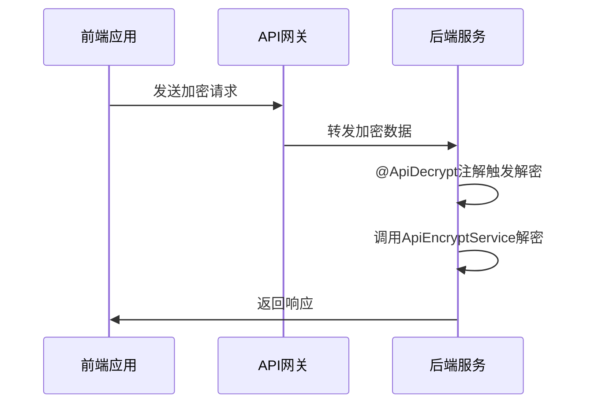
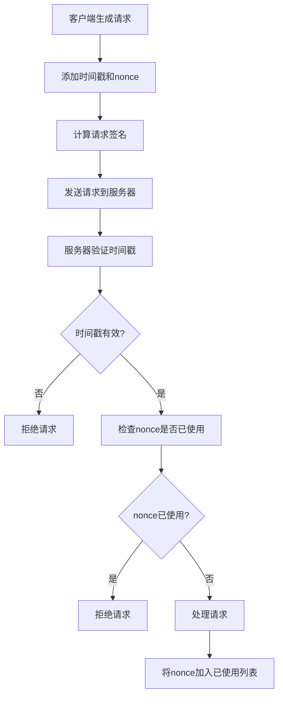
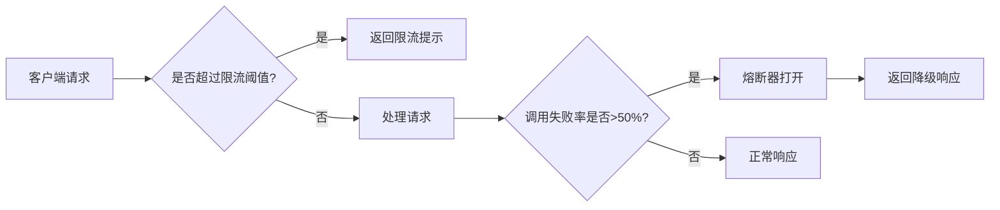
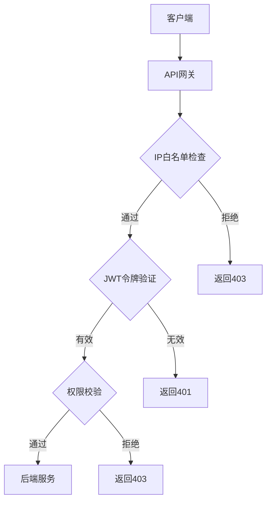
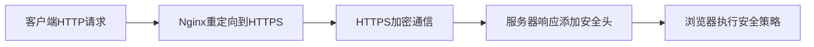
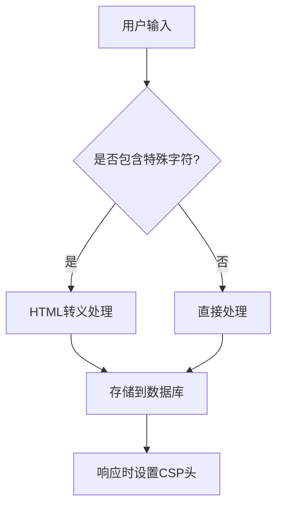
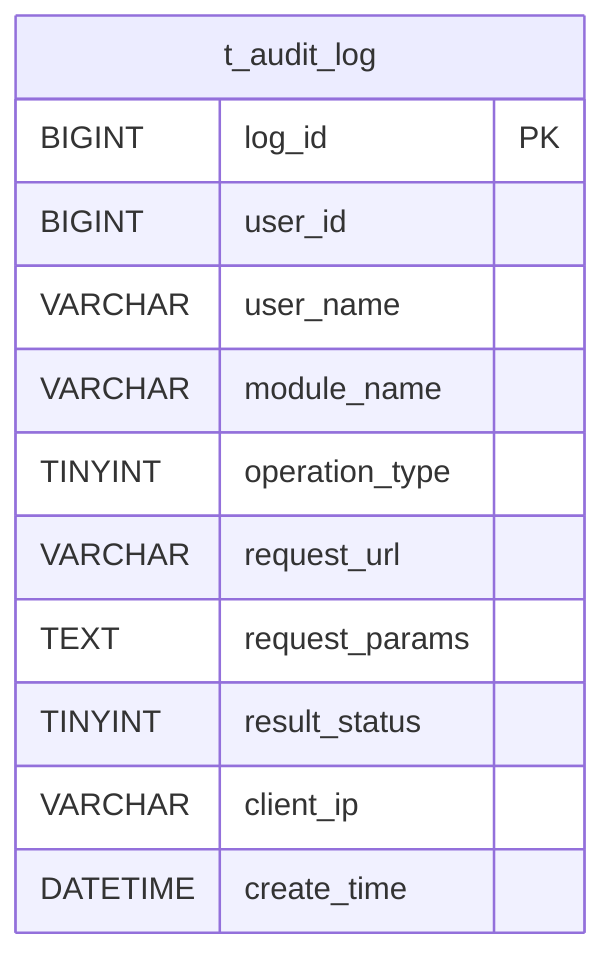

# 接口安全

<cite>
**本文档引用文件**  
- [security_hardening_guide.md](file://security/security_hardening_guide.md)
- [OPTIMAL_ARCHITECTURE_DESIGN.md](file://documentation/architecture/OPTIMAL_ARCHITECTURE_DESIGN.md)
- [全局架构规范.md](file://documentation/01-核心规范/架构规范/全局架构规范.md)
- [Java编码规范.md](file://documentation/01-核心规范/开发规范/Java编码规范.md)
- [application.yml](file://microservices/ioedream-gateway-service/src/main/resources/application.yml)
- [GatewayServiceApplication.java](file://microservices/ioedream-gateway-service/src/main/java/net/lab1024/sa/gateway/GatewayServiceApplication.java)
- [SecurityConfig.java](file://microservices/microservices-common/src/main/java/net/lab1024/sa/common/auth/config/SecurityConfig.java)
- [AuthServiceImpl.java](file://microservices/microservices-common/src/main/java/net/lab1024/sa/common/auth/service/impl/AuthServiceImpl.java)
- [AuthManager.java](file://microservices/microservices-common/src/main/java/net/lab1024/sa/common/auth/manager/AuthManager.java)
- [t_audit_log.sql](file://database-scripts/common-service/10-t_audit_log.sql)
- [PRODUCTION_SECURITY_CHECKLIST.md](file://PRODUCTION_SECURITY_CHECKLIST.md)
- [axios.js](file://smart-admin-web-javascript/src/lib/axios.js)
- [encrypt.js](file://smart-admin-web-javascript/src/lib/encrypt.js)
- [api-encrypt-api.js](file://smart-admin-web-javascript/src/api/support/api-encrypt-api.js)
- [api-encrypt-index.vue](file://smart-admin-web-javascript/src/views/support/api-encrypt/api-encrypt-index.vue)
</cite>

## 目录
1. [引言](#引言)
2. [请求参数加密与解密机制](#请求参数加密与解密机制)
3. [防重放攻击机制](#防重放攻击机制)
4. [接口限流与熔断策略（Resilience4j）](#接口限流与熔断策略resilience4j)
5. [API网关层安全过滤规则](#api网关层安全过滤规则)
6. [HTTPS配置与安全HTTP头](#https配置与安全http头)
7. [常见攻击防护](#常见攻击防护)
8. [安全审计日志集成](#安全审计日志集成)
9. [结论](#结论)

## 引言

本项目采用微服务架构，通过API网关统一管理所有服务的入口，确保接口安全。系统实现了完整的认证授权流程，包括用户登录、JWT Token生成与验证、权限校验和Token刷新机制。所有接口均需身份认证，关键接口需权限校验，敏感数据传输加密，并实现接口防刷和限流。

系统采用Spring Security框架进行安全控制，结合JWT实现无状态会话管理，避免CSRF攻击。密码使用BCrypt算法加密存储，支持IP白名单、请求签名验证和敏感操作二次确认等安全措施。通过Resilience4j实现接口限流、熔断和重试机制，保障系统稳定性。

**Section sources**
- [OPTIMAL_ARCHITECTURE_DESIGN.md](file://documentation/architecture/OPTIMAL_ARCHITECTURE_DESIGN.md#L883-L910)
- [全局架构规范.md](file://documentation/01-核心规范/架构规范/全局架构规范.md#L1062-L1113)

## 请求参数加密与解密机制

系统实现了前端请求参数加密与后端解密的完整流程。前端使用AES或国密SM4算法对请求参数进行加密，后端通过`@ApiEncrypt`和`@ApiDecrypt`注解实现自动解密和加密。

前端通过`postEncryptRequest`方法发送加密请求，该方法将数据通过`encryptData`函数加密后封装在`encryptData`字段中发送。后端控制器使用`@ApiDecrypt`注解标记需要解密的方法，框架自动调用解密服务进行解密处理。

**Diagram sources**
- [axios.js](file://smart-admin-web-javascript/src/lib/axios.js#L170-L176)
- [api-encrypt-api.js](file://smart-admin-web-javascript/src/api/support/api-encrypt-api.js#L8)
- [api-encrypt-index.vue](file://smart-admin-web-javascript/src/views/support/api-encrypt/api-encrypt-index.vue#L17-L20)

**Section sources**
- [encrypt.js](file://smart-admin-web-javascript/src/lib/encrypt.js)
- [SecurityConfig.java](file://microservices/microservices-common/src/main/java/net/lab1024/sa/common/auth/config/SecurityConfig.java)

## 防重放攻击机制

系统通过时间戳与nonce机制防止重放攻击。每次请求需包含时间戳和唯一nonce值，服务器验证时间戳的有效性（通常允许5分钟偏差）并检查nonce是否已使用过。

认证服务在`validateToken`方法中实现多重验证机制，包括令牌格式、签名验证、黑名单检查和会话有效性验证。`AuthManager`类负责管理令牌黑名单，将登出的令牌加入Redis黑名单，有效期7天，防止令牌被重放使用。

**Diagram sources**
- [AuthServiceImpl.java](file://microservices/microservices-common/src/main/java/net/lab1024/sa/common/auth/service/impl/AuthServiceImpl.java#L281-L310)
- [AuthManager.java](file://microservices/microservices-common/src/main/java/net/lab1024/sa/common/auth/manager/AuthManager.java#L219-L245)

**Section sources**
- [AuthManager.java](file://microservices/microservices-common/src/main/java/net/lab1024/sa/common/auth/manager/AuthManager.java#L72-L82)
- [security_hardening_guide.md](file://security/security_hardening_guide.md#L75-L78)

## 接口限流与熔断策略（Resilience4j）

系统使用Resilience4j实现接口限流和熔断策略。在网关层和关键服务接口配置限流规则，防止恶意请求导致系统过载。

限流配置包括每秒100次请求的限制，窗口期为1秒，超时时间为3秒。熔断器配置失败率阈值为50%，滑动窗口大小为10次调用，打开状态等待时间为30秒。当服务异常时，自动触发降级方法返回友好提示。

**Diagram sources**
- [security_hardening_guide.md](file://security/security_hardening_guide.md#L113-L126)
- [PRODUCTION_SECURITY_CHECKLIST.md](file://PRODUCTION_SECURITY_CHECKLIST.md#L264-L268)

**Section sources**
- [security_hardening_guide.md](file://security/security_hardening_guide.md#L78-L79)
- [PRODUCTION_SECURITY_CHECKLIST.md](file://PRODUCTION_SECURITY_CHECKLIST.md#L260-L268)

## API网关层安全过滤规则

API网关作为系统统一入口，实施严格的安全过滤规则。网关服务配置了路由转发、负载均衡、限流熔断、统一认证等功能，确保所有请求都经过安全验证。

网关层实现IP白名单过滤，只允许特定IP地址访问敏感接口。通过`@SaCheckPermission`注解实现细粒度权限控制，确保用户只能访问其权限范围内的资源。敏感操作需要二次确认，防止误操作。

**Diagram sources**
- [application.yml](file://microservices/ioedream-gateway-service/src/main/resources/application.yml#L15-L75)
- [GatewayServiceApplication.java](file://microservices/ioedream-gateway-service/src/main/java/net/lab1024/sa/gateway/GatewayServiceApplication.java#L32-L42)

**Section sources**
- [GatewayServiceApplication.java](file://microservices/ioedream-gateway-service/src/main/java/net/lab1024/sa/gateway/GatewayServiceApplication.java)
- [application.yml](file://microservices/ioedream-gateway-service/src/main/resources/application.yml)

## HTTPS配置与安全HTTP头

系统强制使用HTTPS协议，所有HTTP请求自动重定向到HTTPS。配置TLS 1.2+协议，禁用不安全的TLS 1.0/1.1版本，支持完美前向保密（PFS）。

通过安全HTTP头增强防护能力：
- `X-Content-Type-Options: nosniff` 防止MIME类型嗅探
- `X-Frame-Options: DENY` 防止点击劫持
- `X-XSS-Protection: 1; mode=block` 启用XSS过滤
- `Strict-Transport-Security` 强制浏览器使用HTTPS
- `Content-Security-Policy` 控制资源加载来源
- `Referrer-Policy` 控制Referer信息发送

**Diagram sources**
- [security_hardening_guide.md](file://security/security_hardening_guide.md#L294-L325)
- [PRODUCTION_SECURITY_CHECKLIST.md](file://PRODUCTION_SECURITY_CHECKLIST.md#L211-L235)

**Section sources**
- [security_hardening_guide.md](file://security/security_hardening_guide.md#L270-L326)
- [PRODUCTION_SECURITY_CHECKLIST.md](file://PRODUCTION_SECURITY_CHECKLIST.md#L211-L235)

## 常见攻击防护

系统针对常见攻击提供了全面的防护措施：

### CSRF防护
由于系统采用JWT令牌进行无状态认证，天然免疫CSRF攻击。`SecurityConfig`中明确禁用CSRF保护，因为JWT令牌存储在Authorization头中，不受浏览器同源策略影响。

### 暴力破解防护
`AuthManager`实现登录失败计数机制，同一用户名5次登录失败后账户锁定30分钟。使用Redis记录失败次数，避免数据库压力。

### SQL注入防护
所有数据库操作使用MyBatis参数化查询，禁止字符串拼接SQL。通过`@Param`注解传递参数，防止SQL注入攻击。

### XSS防护
对用户输入进行HTML转义处理，使用`HtmlUtils.htmlEscape`方法过滤特殊字符。响应头设置`Content-Security-Policy`限制脚本执行。

**Section sources**
- [Java编码规范.md](file://documentation/01-核心规范/开发规范/Java编码规范.md#L334-L359)
- [AuthManager.java](file://microservices/microservices-common/src/main/java/net/lab1024/sa/common/auth/manager/AuthManager.java#L247-L260)
- [SecurityConfig.java](file://microservices/microservices-common/src/main/java/net/lab1024/sa/common/auth/config/SecurityConfig.java#L58-L59)

## 安全审计日志集成

系统集成完整的安全审计日志功能，记录所有关键操作。审计日志表`t_audit_log`记录用户ID、操作类型、请求URL、客户端IP、执行时间等信息。

审计覆盖范围包括：
- 用户登录/登出（保留180天）
- 权限变更（永久保留）
- 数据修改（保留90天）
- 配置变更（永久保留）
- 敏感数据访问（保留180天）

日志格式包含时间戳、用户信息、操作类型、结果状态和详细信息，便于安全审计和问题追溯。

**Diagram sources**
- [t_audit_log.sql](file://database-scripts/common-service/10-t_audit_log.sql#L8-L38)
- [PRODUCTION_SECURITY_CHECKLIST.md](file://PRODUCTION_SECURITY_CHECKLIST.md#L327-L351)

**Section sources**
- [t_audit_log.sql](file://database-scripts/common-service/10-t_audit_log.sql)
- [PRODUCTION_SECURITY_CHECKLIST.md](file://PRODUCTION_SECURITY_CHECKLIST.md#L324-L357)

## 结论

本系统构建了多层次的API安全防护体系，从前端加密到后端验证，从网关过滤到服务级防护，形成了完整的安全闭环。通过JWT无状态认证、请求加密、防重放、限流熔断、HTTPS加密和安全审计等机制，有效抵御各类安全威胁。

建议持续关注安全漏洞，定期更新依赖库，实施安全扫描，加强员工安全意识培训，确保系统长期安全稳定运行。