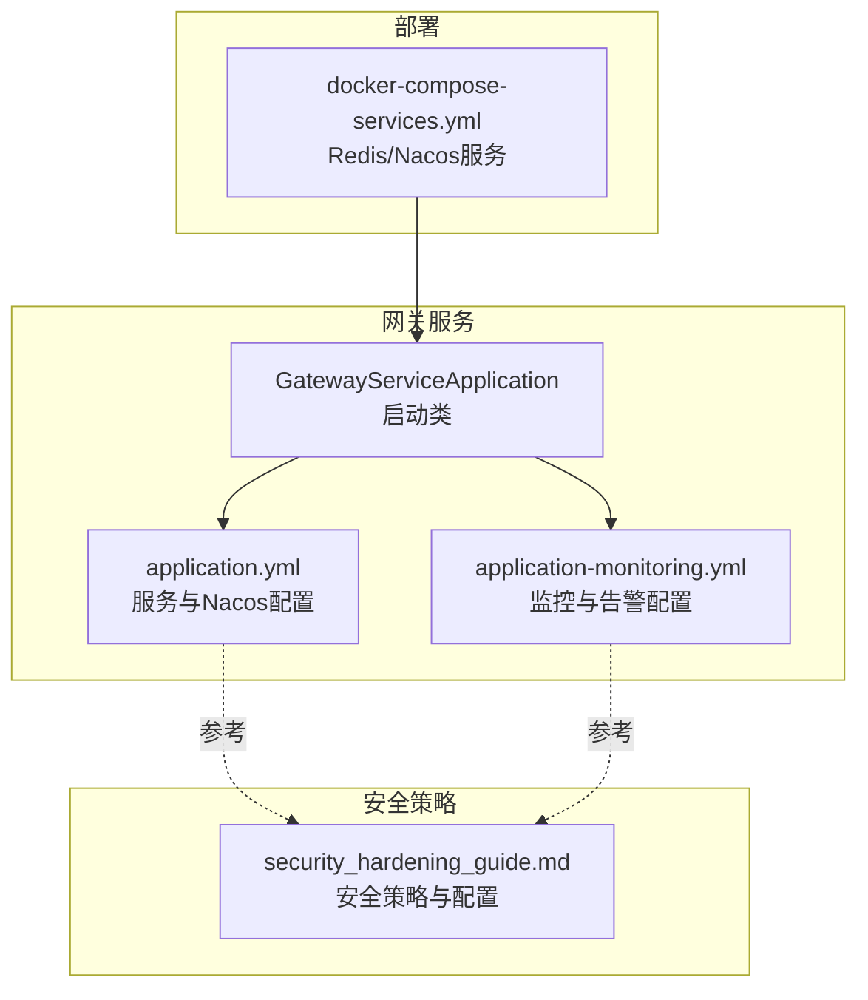
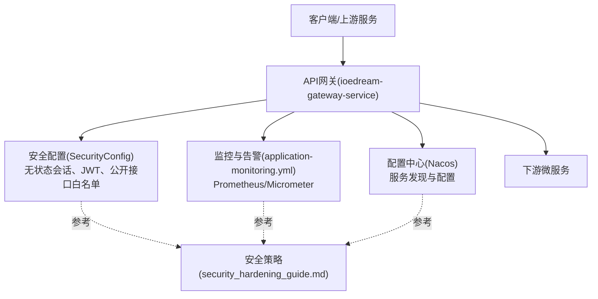
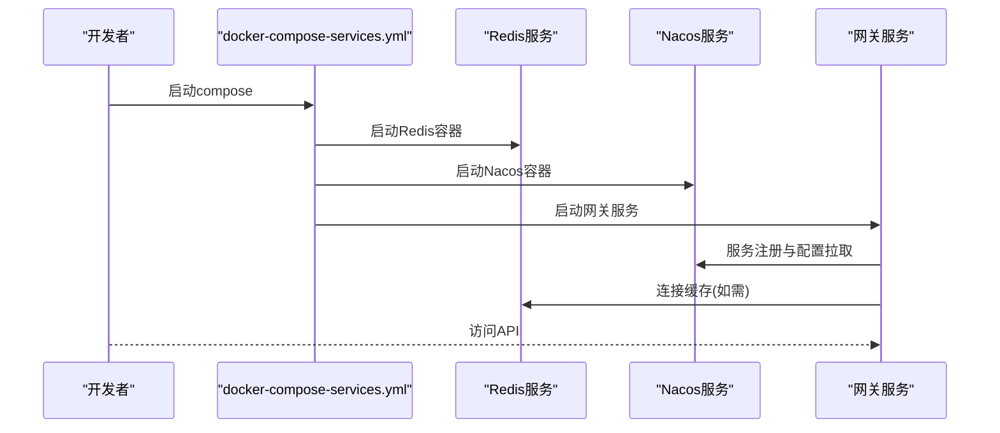
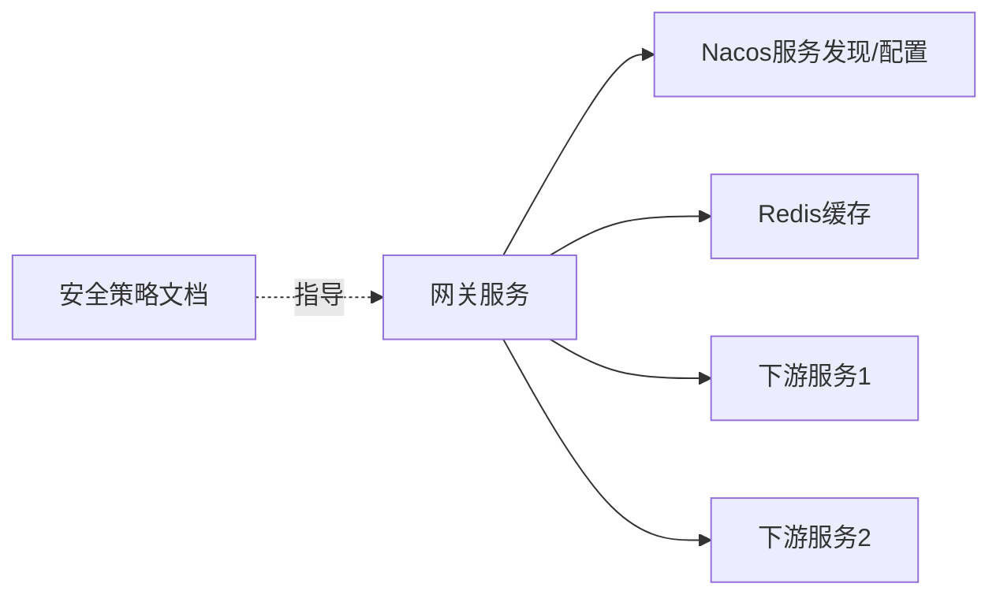

# 网关安全过滤

<cite>
**本文引用的文件**
- [security_hardening_guide.md](file://security/security_hardening_guide.md)
- [docker-compose-services.yml](file://docker-compose-services.yml)
- [GatewayServiceApplication.java](file://microservices/ioedream-gateway-service/src/main/java/net/lab1024/sa/gateway/GatewayServiceApplication.java)
- [application.yml](file://microservices/ioedream-gateway-service/src/main/resources/application.yml)
- [application-monitoring.yml](file://microservices/ioedream-gateway-service/src/main/resources/application-monitoring.yml)
- [SecurityConfig.java](file://microservices/microservices-common/src/main/java/net/lab1024/sa/common/auth/config/SecurityConfig.java)
- [AccessMobileControllerTest.java](file://microservices/ioedream-access-service/src/test/java/net/lab1024/sa/access/controller/AccessMobileControllerTest.java)
- [FINAL_FIX_SUMMARY_REPORT.md](file://documentation/archive/reports-2025-12-04/FINAL_FIX_SUMMARY_REPORT.md)
</cite>

## 目录
1. [引言](#引言)
2. [项目结构](#项目结构)
3. [核心组件](#核心组件)
4. [架构总览](#架构总览)
5. [详细组件分析](#详细组件分析)
6. [依赖关系分析](#依赖关系分析)
7. [性能考量](#性能考量)
8. [故障排查指南](#故障排查指南)
9. [结论](#结论)
10. [附录](#附录)

## 引言
本文件围绕API网关层的安全过滤规则展开，重点说明以下能力在本仓库中的落地情况与实现要点：
- IP白名单过滤
- 请求签名验证（HMAC-SHA256）
- 敏感操作二次确认机制
- 安全策略在网关中的执行顺序与异常处理
- 基于现有配置的网关部署与扩展方法
- 性能影响评估与优化建议

同时，本文以仓库内现有文件为依据，对未在代码中直接体现的功能给出“现状说明”与“落地建议”，帮助读者准确理解当前实现与后续演进方向。

## 项目结构
- 网关服务位于 microservices/ioedream-gateway-service，包含启动类与配置文件，负责服务发现、路由、限流熔断、统一认证与监控等职责。
- 安全策略由 security/security_hardening_guide.md 提供，涵盖接口安全、数据安全、审计日志、HTTPS与安全头、密码策略、会话与JWT、环境变量与Docker安全等。
- 部署配置位于 docker-compose-services.yml，提供Redis、Nacos等基础设施服务，便于网关与下游服务协同运行。

图表来源
- [GatewayServiceApplication.java](file://microservices/ioedream-gateway-service/src/main/java/net/lab1024/sa/gateway/GatewayServiceApplication.java#L1-L56)
- [application.yml](file://microservices/ioedream-gateway-service/src/main/resources/application.yml#L1-L75)
- [application-monitoring.yml](file://microservices/ioedream-gateway-service/src/main/resources/application-monitoring.yml#L1-L306)
- [security_hardening_guide.md](file://security/security_hardening_guide.md#L1-L485)
- [docker-compose-services.yml](file://docker-compose-services.yml#L1-L41)

章节来源
- [GatewayServiceApplication.java](file://microservices/ioedream-gateway-service/src/main/java/net/lab1024/sa/gateway/GatewayServiceApplication.java#L1-L56)
- [application.yml](file://microservices/ioedream-gateway-service/src/main/resources/application.yml#L1-L75)
- [application-monitoring.yml](file://microservices/ioedream-gateway-service/src/main/resources/application-monitoring.yml#L1-L306)
- [security_hardening_guide.md](file://security/security_hardening_guide.md#L1-L485)
- [docker-compose-services.yml](file://docker-compose-services.yml#L1-L41)

## 核心组件
- 网关服务启动类：负责应用启动、包扫描路径与服务发现启用。
- 网关配置文件：定义服务端口、Nacos服务发现与配置中心、Actuator监控暴露、日志级别等。
- 监控与告警配置：Prometheus指标导出、Micrometer分布统计、业务指标与告警规则。
- 安全策略文档：提供接口安全、限流熔断、HTTPS与安全头、密码与会话、JWT、环境变量与Docker安全等指导。

章节来源
- [GatewayServiceApplication.java](file://microservices/ioedream-gateway-service/src/main/java/net/lab1024/sa/gateway/GatewayServiceApplication.java#L1-L56)
- [application.yml](file://microservices/ioedream-gateway-service/src/main/resources/application.yml#L1-L75)
- [application-monitoring.yml](file://microservices/ioedream-gateway-service/src/main/resources/application-monitoring.yml#L1-L306)
- [security_hardening_guide.md](file://security/security_hardening_guide.md#L1-L485)

## 架构总览
下图展示网关在整体系统中的角色与与安全策略的关系映射。

图表来源
- [GatewayServiceApplication.java](file://microservices/ioedream-gateway-service/src/main/java/net/lab1024/sa/gateway/GatewayServiceApplication.java#L1-L56)
- [SecurityConfig.java](file://microservices/microservices-common/src/main/java/net/lab1024/sa/common/auth/config/SecurityConfig.java#L1-L75)
- [application-monitoring.yml](file://microservices/ioedream-gateway-service/src/main/resources/application-monitoring.yml#L1-L306)
- [security_hardening_guide.md](file://security/security_hardening_guide.md#L1-L485)

## 详细组件分析

### 1) IP白名单过滤
- 现状说明：在本仓库中，未发现网关层显式实现IP白名单过滤的代码或配置片段。安全策略文档强调了接口安全、限流熔断、HTTPS与安全头等，但未明确列出IP白名单作为网关过滤器的内置能力。
- 建议落地方式（概念性说明）：
  - 在网关路由层增加自定义过滤器，基于请求头或源IP进行匹配，匹配失败直接拒绝。
  - 与Nacos配置中心联动，动态加载白名单列表，支持热更新。
  - 与下游服务的鉴权/授权配合，避免绕过网关直接访问。
- 异常处理：匹配失败时返回统一错误码与响应体，记录审计日志并上报监控。

[本小节为概念性说明，不直接分析具体文件，故无章节来源]

### 2) 请求签名验证（HMAC-SHA256）
- 现状说明：在本仓库中，未发现网关层实现HMAC-SHA256签名验证的代码或配置片段。安全策略文档提供了接口安全检查清单、限流熔断与安全头等，但未包含签名验证的具体实现。
- 建议落地方式（概念性说明）：
  - 在网关过滤器链中加入签名验证环节，要求请求携带签名参数与时间戳，服务端按约定算法重新计算签名并与请求签名比对。
  - 对时间戳设置容差窗口，防止时钟漂移导致误判。
  - 与Nacos配置中心联动，动态下发密钥与签名算法参数。
- 异常处理：签名不匹配或过期时，返回统一错误码与响应体，记录审计日志并上报监控。

[本小节为概念性说明，不直接分析具体文件，故无章节来源]

### 3) 敏感操作二次确认机制
- 现状说明：在本仓库中，未发现网关层实现敏感操作二次确认的代码或配置片段。安全策略文档强调了接口安全、限流熔断、审计日志与HTTPS等，但未包含二次确认机制的具体实现。
- 建议落地方式（概念性说明）：
  - 在网关层对敏感操作（如删除、修改、高危变更）进行拦截，要求客户端发起二次确认请求，服务端核验确认信息后才放行。
  - 与审计日志联动，记录二次确认过程与结果。
- 异常处理：二次确认失败或超时，返回统一错误码与响应体，记录审计日志并上报监控。

[本小节为概念性说明，不直接分析具体文件，故无章节来源]

### 4) 安全策略在网关中的落地
- 身份认证与权限校验：安全策略文档强调“所有接口需要身份认证、关键接口需要权限校验”。网关侧可通过统一认证与鉴权中间件实现，结合下游服务的权限注解（如方法级权限）形成闭环。
- 限流与熔断：安全策略文档提供了Resilience4j限流与熔断配置示例，网关层可结合限流与熔断中间件，降低突发流量与异常服务对系统的冲击。
- HTTPS与安全头：安全策略文档提供了HTTPS强制与安全HTTP头配置示例，网关层可启用HTTPS与安全头，提升传输层安全性。
- 审计日志：安全策略文档提供了审计切面与注解使用示例，网关层可结合统一日志与审计中间件，记录请求与响应的关键信息。

章节来源
- [security_hardening_guide.md](file://security/security_hardening_guide.md#L1-L485)
- [SecurityConfig.java](file://microservices/microservices-common/src/main/java/net/lab1024/sa/common/auth/config/SecurityConfig.java#L1-L75)

### 5) 过滤器链执行顺序与异常处理
- 执行顺序（概念性说明）：
  - 鉴权与权限校验：在路由之前进行，确保只有合法用户进入后续处理。
  - IP白名单/签名验证：在鉴权之后、路由之前，快速拒绝非法来源。
  - 限流与熔断：在路由之前或路由之后，根据策略选择。
  - 审计日志：贯穿请求生命周期，记录关键信息。
  - 异常处理：统一捕获异常，返回标准化错误响应，记录审计日志并上报监控。
- 异常处理（概念性说明）：
  - 对于鉴权失败、签名不匹配、限流触发、熔断打开等情况，返回统一错误码与响应体。
  - 记录请求ID、用户ID、IP、时间戳、错误原因等，便于定位问题。

[本小节为概念性说明，不直接分析具体文件，故无章节来源]

### 6) 网关部署配置
- 网关服务端口与服务发现：application.yml中定义了服务端口与Nacos服务发现配置，便于网关注册与发现下游服务。
- 监控与告警：application-monitoring.yml中定义了Prometheus指标导出、Micrometer分布统计、业务指标与告警规则，便于观测网关运行状态。
- 基础设施：docker-compose-services.yml提供了Redis与Nacos服务，便于网关与下游服务协同运行。

图表来源
- [docker-compose-services.yml](file://docker-compose-services.yml#L1-L41)
- [application.yml](file://microservices/ioedream-gateway-service/src/main/resources/application.yml#L1-L75)
- [application-monitoring.yml](file://microservices/ioedream-gateway-service/src/main/resources/application-monitoring.yml#L1-L306)

章节来源
- [docker-compose-services.yml](file://docker-compose-services.yml#L1-L41)
- [application.yml](file://microservices/ioedream-gateway-service/src/main/resources/application.yml#L1-L75)
- [application-monitoring.yml](file://microservices/ioedream-gateway-service/src/main/resources/application-monitoring.yml#L1-L306)

### 7) 自定义安全规则的扩展方法
- 建议采用“过滤器链 + 配置中心”的方式扩展：
  - 在网关层新增自定义过滤器，支持IP白名单、签名验证、二次确认等功能。
  - 通过Nacos配置中心动态下发规则与参数，实现热更新。
  - 与审计日志与监控告警联动，确保可追踪与可观测。
- 与现有代码的衔接：
  - 网关启动类与配置文件保持现有结构，新增过滤器通过Spring Cloud Gateway或自定义过滤器机制接入。
  - 安全策略文档作为扩展设计的参考依据。

[本小节为概念性说明，不直接分析具体文件，故无章节来源]

### 8) 性能影响评估
- 现状：application-monitoring.yml展示了Prometheus与Micrometer的配置，可用于观测网关性能指标（如P99响应时间、业务指标等），但未包含具体的性能基线与阈值。
- 建议：
  - 基于Prometheus指标建立SLA与告警阈值，结合业务高峰期与容量规划进行压测与调优。
  - 对签名验证、限流与熔断等高开销环节进行参数优化，避免成为瓶颈。
  - 与下游服务的性能协同优化，避免链路中的“短板”。

[本小节为概念性说明，不直接分析具体文件，故无章节来源]

## 依赖关系分析
- 网关服务依赖：
  - Nacos服务发现与配置中心：用于服务注册与配置拉取。
  - Redis：用于缓存（如会话、限流状态等，若启用）。
  - 下游微服务：网关负责路由与转发。
- 安全策略依赖：
  - 安全策略文档为网关扩展提供设计参考，包括接口安全、限流熔断、HTTPS与安全头、密码与会话、JWT、环境变量与Docker安全等。

图表来源
- [application.yml](file://microservices/ioedream-gateway-service/src/main/resources/application.yml#L1-L75)
- [application-monitoring.yml](file://microservices/ioedream-gateway-service/src/main/resources/application-monitoring.yml#L1-L306)
- [security_hardening_guide.md](file://security/security_hardening_guide.md#L1-L485)

章节来源
- [application.yml](file://microservices/ioedream-gateway-service/src/main/resources/application.yml#L1-L75)
- [application-monitoring.yml](file://microservices/ioedream-gateway-service/src/main/resources/application-monitoring.yml#L1-L306)
- [security_hardening_guide.md](file://security/security_hardening_guide.md#L1-L485)

## 性能考量
- 指标观测：通过Prometheus与Micrometer导出指标，关注请求量、错误率、P99/P95响应时间、业务指标等。
- 参数优化：根据业务峰值与SLA调整限流窗口、熔断阈值、超时时间等。
- 资源规划：结合下游服务的性能与容量，合理配置网关实例数量与资源。

[本节为通用指导，不直接分析具体文件，故无章节来源]

## 故障排查指南
- 统一错误响应：安全策略文档提供了统一错误响应的使用示例，网关层应遵循统一错误码与消息格式，便于前端与监控系统识别。
- 网关调用客户端：在测试中可见网关调用客户端的使用方式，有助于定位网关与下游服务之间的调用问题。
- 安全配置核对：核对安全配置（如JWT密钥长度、HTTPS与安全头、会话安全等）是否符合安全策略文档的要求。

章节来源
- [security_hardening_guide.md](file://security/security_hardening_guide.md#L1-L485)
- [AccessMobileControllerTest.java](file://microservices/ioedream-access-service/src/test/java/net/lab1024/sa/access/controller/AccessMobileControllerTest.java#L1-L159)
- [FINAL_FIX_SUMMARY_REPORT.md](file://documentation/archive/reports-2025-12-04/FINAL_FIX_SUMMARY_REPORT.md#L175-L193)

## 结论
- 本仓库中，网关服务启动类与配置文件明确了服务发现、端口与监控等基础能力；安全策略文档提供了接口安全、限流熔断、HTTPS与安全头、密码与会话、JWT、环境变量与Docker安全等指导。
- IP白名单过滤、请求签名验证（HMAC-SHA256）、敏感操作二次确认机制在当前代码中未见直接实现，建议以“过滤器链 + 配置中心”的方式扩展，并与审计日志与监控告警联动。
- 部署方面，docker-compose-services.yml提供了Redis与Nacos服务，application.yml与application-monitoring.yml定义了网关的服务与监控配置，便于快速上线与观测。

[本节为总结性内容，不直接分析具体文件，故无章节来源]

## 附录
- 网关启动类与配置文件路径：
  - [GatewayServiceApplication.java](file://microservices/ioedream-gateway-service/src/main/java/net/lab1024/sa/gateway/GatewayServiceApplication.java#L1-L56)
  - [application.yml](file://microservices/ioedream-gateway-service/src/main/resources/application.yml#L1-L75)
  - [application-monitoring.yml](file://microservices/ioedream-gateway-service/src/main/resources/application-monitoring.yml#L1-L306)
- 安全策略参考：
  - [security_hardening_guide.md](file://security/security_hardening_guide.md#L1-L485)
- 部署参考：
  - [docker-compose-services.yml](file://docker-compose-services.yml#L1-L41)