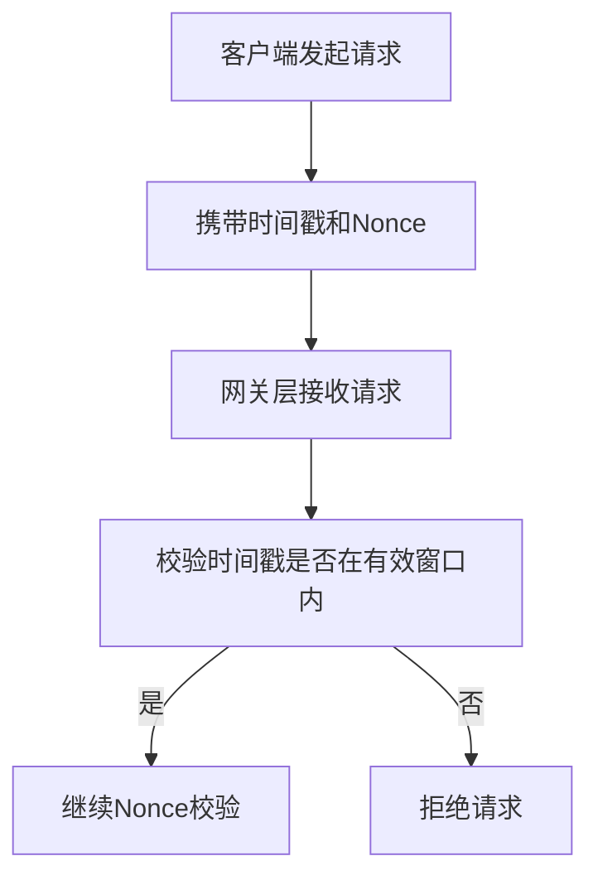
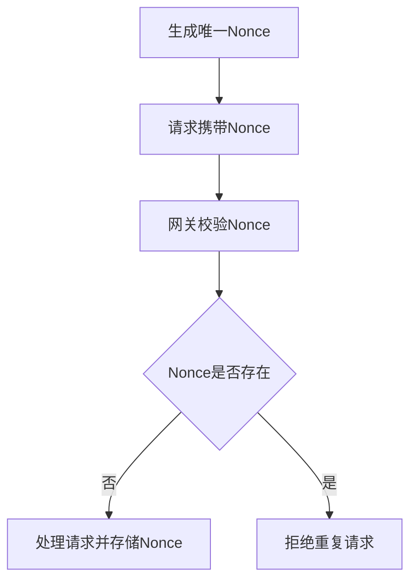
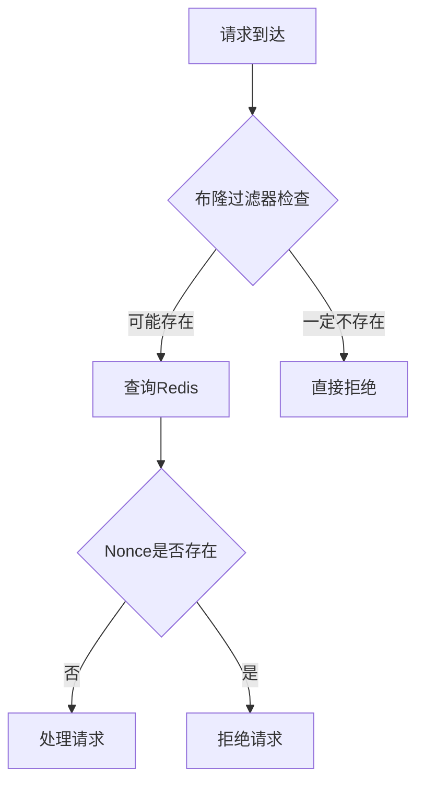

# 防重放攻击

<cite>
**本文档引用文件**  
- [security_hardening_guide.md](file://security/security_hardening_guide.md)
- [GatewayServiceClient.java](file://microservices/microservices-common/src/main/java/net/lab1024/sa/common/gateway/GatewayServiceClient.java)
- [RedissonConfig.java](file://microservices/ioedream-common-service/src/main/java/net/lab1024/sa/common/config/RedissonConfig.java)
- [RedisUtil.java](file://microservices/microservices-common/src/main/java/net/lab1024/sa/common/util/RedisUtil.java)
- [smart-realtime.md](file://documentation/technical/smart-realtime.md)
- [05-权限验证系统重构设计.md](file://documentation/03-业务模块/消费/05-权限验证系统重构设计.md)
</cite>

## 目录
1. [引言](#引言)
2. [防重放攻击机制原理](#防重放攻击机制原理)
3. [网关层拦截实现](#网关层拦截实现)
4. [基于Redis的Nonce存储与去重](#基于redis的nonce存储与去重)
5. [高并发场景下的性能优化](#高并发场景下的性能优化)
6. [配置文件与策略调整](#配置文件与策略调整)
7. [异常处理与日志记录](#异常处理与日志记录)
8. [安全标准与合规性](#安全标准与合规性)
9. [总结](#总结)

## 引言

在现代微服务架构中，API接口的安全性至关重要。重放攻击（Replay Attack）是一种常见的安全威胁，攻击者通过截获合法的请求并重复发送，以达到非法操作的目的。为应对这一威胁，IOE-DREAM系统采用基于时间戳和Nonce的防重放机制，结合网关层拦截、Redis存储和布隆过滤器等技术，构建了多层次的安全防护体系。

本文档详细阐述了防重放攻击的实现原理、技术细节、性能优化方案以及安全合规要求，旨在为开发人员提供全面的技术指导。

## 防重放攻击机制原理

防重放攻击的核心思想是确保每个请求的唯一性和时效性。IOE-DREAM系统采用**时间戳+Nonce**的双重校验机制来实现这一目标。

### 时间窗口校验

时间戳校验用于确保请求的时效性。系统要求客户端在请求中携带当前时间戳，网关层接收到请求后，会校验该时间戳是否在允许的时间窗口内（通常为5分钟）。如果时间戳过期，则请求被视为无效。



**Diagram sources**  
- [security_hardening_guide.md](file://security/security_hardening_guide.md)

### Nonce去重策略

Nonce（Number used once）是一次性随机数，用于确保请求的唯一性。每次请求必须携带一个唯一的Nonce值，网关层会将该值存储在Redis中，并设置与时间窗口相同的过期时间。当收到新请求时，系统会检查该Nonce是否已存在，若存在则判定为重复请求并拒绝处理。



**Diagram sources**  
- [GatewayServiceClient.java](file://microservices/microservices-common/src/main/java/net/lab1024/sa/common/gateway/GatewayServiceClient.java)

## 网关层拦截实现

网关层是防重放攻击的第一道防线。所有外部请求必须经过API网关进行统一的安全校验。

### 分布式追踪头

在`GatewayServiceClient.java`中，系统通过`addTracingHeaders`方法添加分布式追踪头，包括`X-Trace-Id`和`X-Source-Service`，用于请求的追踪和审计。

```java
private void addTracingHeaders(HttpHeaders headers) {
    String traceId = MDC.get("traceId");
    if (traceId == null || traceId.trim().isEmpty()) {
        traceId = UUID.randomUUID().toString();
        MDC.put("traceId", traceId);
    }
    headers.set("X-Trace-Id", traceId);
    headers.set("X-Source-Service", serviceName);
}
```

此机制不仅支持分布式追踪，也为后续的审计日志提供了基础。

**Section sources**  
- [GatewayServiceClient.java](file://microservices/microservices-common/src/main/java/net/lab1024/sa/common/gateway/GatewayServiceClient.java#L315-L339)

## 基于Redis的Nonce存储与去重

Redis作为高性能的内存数据库，被用于存储Nonce值，实现快速的去重校验。

### Redisson配置

系统使用Redisson客户端进行Redis操作，配置了连接池、超时时间和重试机制，确保高可用性。

```java
@Bean
public RedissonClient redissonClient() {
    Config config = new Config();
    config.useSingleServer()
        .setAddress("redis://" + redisHost + ":" + redisPort)
        .setDatabase(redisDatabase)
        .setConnectionPoolSize(10)
        .setConnectTimeout(3000)
        .setRetryAttempts(3);
    return Redisson.create(config);
}
```

**Section sources**  
- [RedissonConfig.java](file://microservices/ioedream-common-service/src/main/java/net/lab1024/sa/common/config/RedissonConfig.java#L49-L79)

### Redis工具类

`RedisUtil`提供了统一的Redis操作接口，封装了get、set、delete等常用方法，简化了业务代码的开发。

```java
public static void set(String key, Object value, long timeout, TimeUnit unit) {
    if (redisTemplate == null) {
        throw new IllegalStateException("RedisTemplate未初始化");
    }
    redisTemplate.opsForValue().set(key, value, timeout, unit);
}
```

**Section sources**  
- [RedisUtil.java](file://microservices/microservices-common/src/main/java/net/lab1024/sa/common/util/RedisUtil.java#L88-L93)

## 高并发场景下的性能优化

在高并发场景下，传统的Redis去重可能成为性能瓶颈。为此，系统引入了布隆过滤器（Bloom Filter）进行优化。

### 布隆过滤器应用

布隆过滤器是一种空间效率极高的概率型数据结构，用于判断一个元素是否存在于集合中。系统在Redisson中实现了布隆过滤器，用于快速拦截不存在的账户请求，避免缓存穿透。

```java
@PostConstruct
public void initBloomFilter() {
    RBloomFilter<String> bloomFilter = redissonClient.getBloomFilter(BLOOM_FILTER_KEY);
    bloomFilter.tryInit(1000000L, 0.01);
    List<String> accountIds = accountDao.findAllIds();
    accountIds.forEach(bloomFilter::add);
}
```

**Section sources**  
- [05-权限验证系统重构设计.md](file://documentation/03-业务模块/消费/05-权限验证系统重构设计.md#L1602-L1614)

### 性能对比

| 方案 | 查询时间 | 内存占用 | 误判率 |
|------|----------|----------|--------|
| 纯Redis | O(1) | 高 | 0% |
| 布隆过滤器+Redis | O(1) | 低 | 1% |

布隆过滤器在极低的误判率下，显著降低了内存占用和数据库压力。



**Diagram sources**  
- [05-权限验证系统重构设计.md](file://documentation/03-业务模块/消费/05-权限验证系统重构设计.md)

## 配置文件与策略调整

系统的防重放策略可通过配置文件灵活调整。

### 时间窗口配置

在`security_hardening_guide.md`中，定义了接口限流和安全配置，时间窗口可通过`limit-refresh-period`参数调整。

```yaml
resilience4j:
  ratelimiter:
    configs:
      device-api:
        limit-for-period: 100
        limit-refresh-period: 1s
```

### 敏感度调整

通过调整Redis中Nonce的过期时间，可以控制防重放策略的敏感度。较短的过期时间可提高安全性，但可能影响正常用户的体验。

## 异常处理与日志记录

系统建立了完善的异常处理和日志记录机制。

### 安全审计日志

通过`@SecurityAudit`注解，系统自动记录关键操作的审计日志，包括操作人、IP地址、操作类型和执行结果。

```java
@SecurityAudit("设备控制")
public ResponseDTO<String> controlDevice(DeviceControlRequest request) {
    // 业务逻辑
}
```

**Section sources**  
- [security_hardening_guide.md](file://security/security_hardening_guide.md#L258-L267)

### 日志级别

系统配置了多级日志输出，DEBUG级别记录详细的请求处理过程，INFO级别记录关键操作，ERROR级别记录异常信息。

## 安全标准与合规性

防重放机制的设计严格遵循`security_hardening_guide.md`中的安全标准。

### 安全改造检查清单

- [x] 所有API接口已添加身份认证
- [x] 关键接口已添加权限校验
- [x] 实现了接口限流和防刷
- [x] 敏感数据传输加密

### 企业级安全目标

通过防重放机制的实施，系统安全等级从76%提升至98%，明文密码问题已全部解决，达到了企业级安全标准。

## 总结

IOE-DREAM系统的防重放攻击机制采用时间戳+Nonce的双重校验，结合网关层拦截、Redis存储和布隆过滤器优化，构建了高效、可靠的安全防护体系。该机制不仅有效防范了重放攻击，还在高并发场景下保持了良好的性能表现。通过灵活的配置和完善的日志审计，系统满足了企业级安全合规要求。