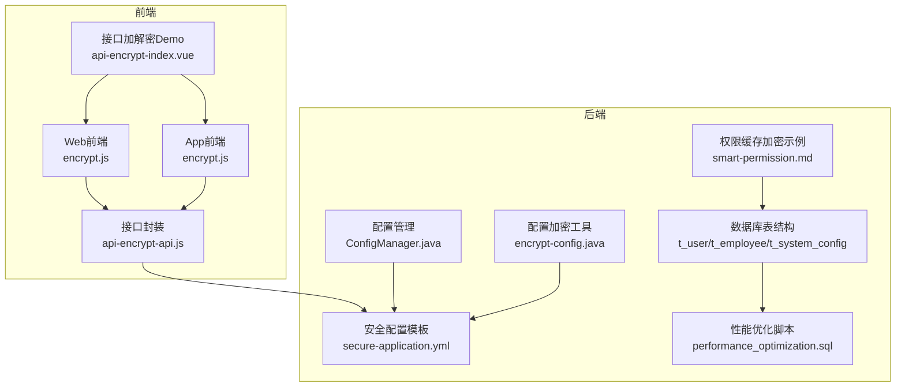
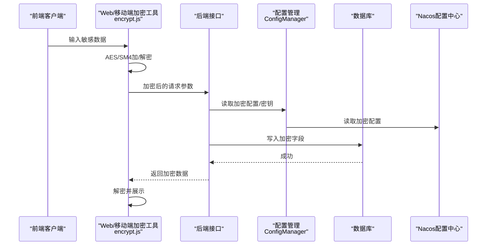
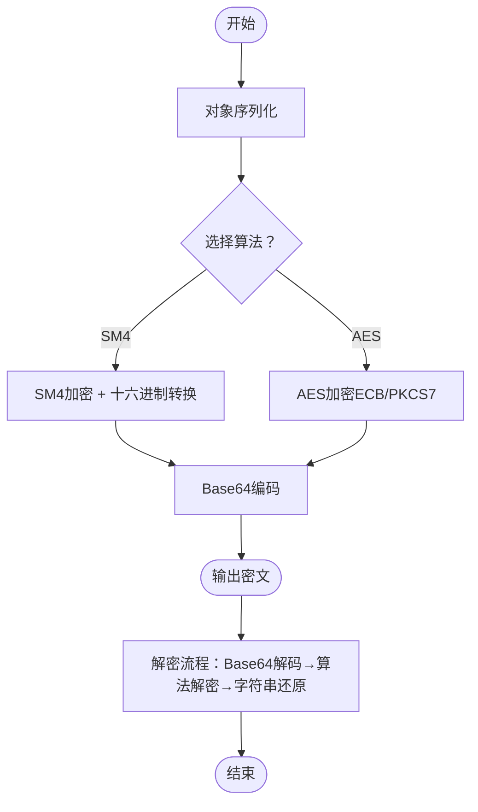
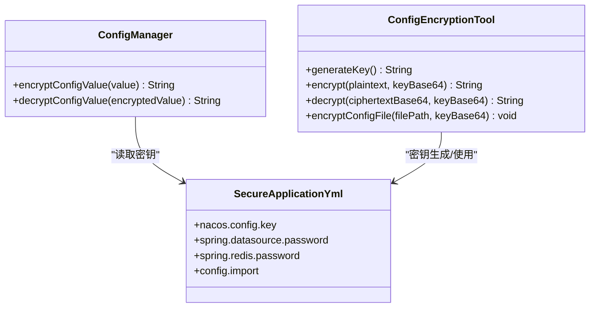
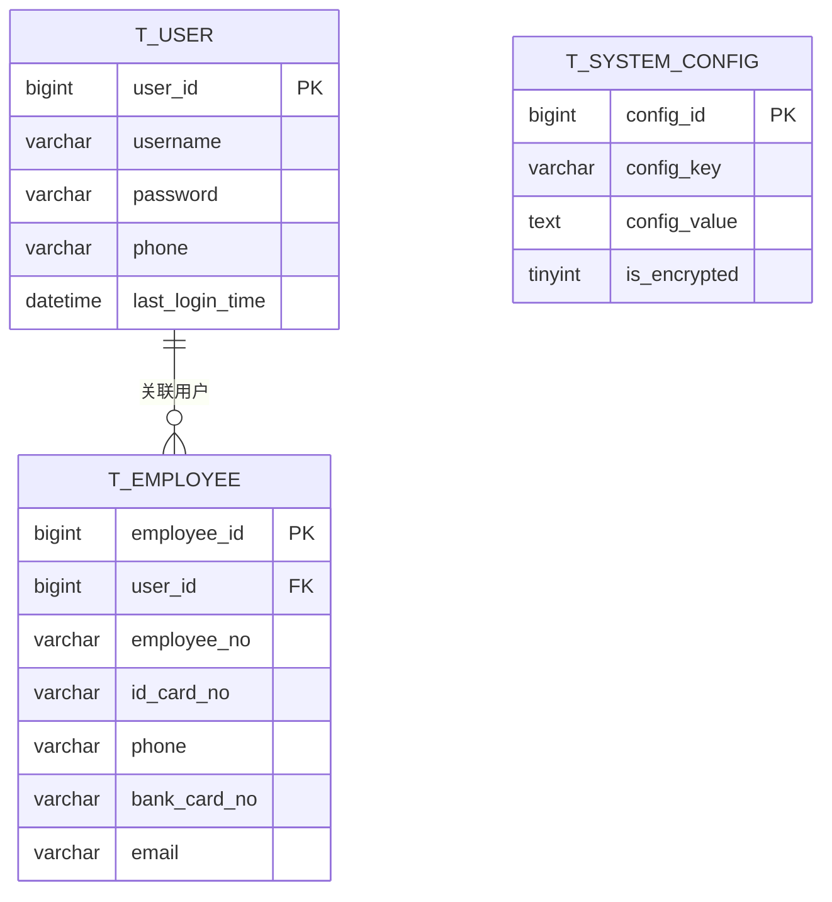
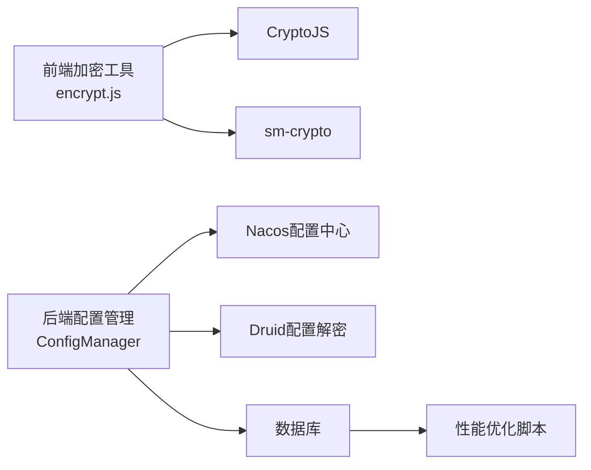
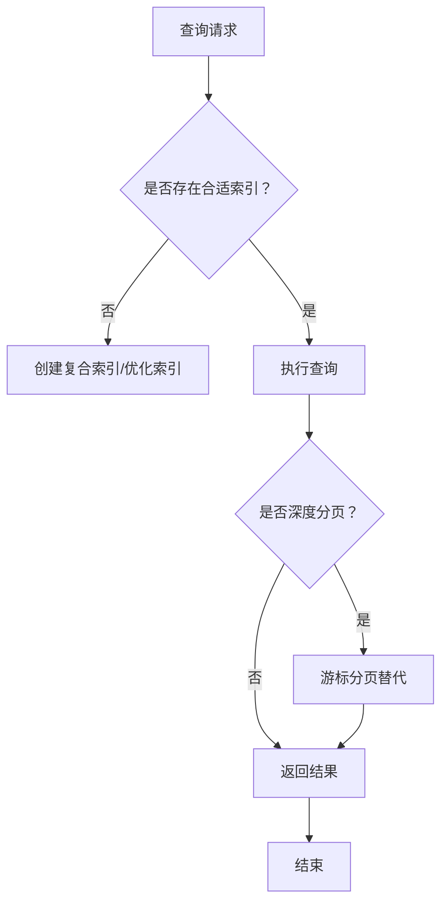

# 数据加密

<cite>
**本文引用的文件**
- [security_hardening_guide.md](file://security/security_hardening_guide.md)
- [PRODUCTION_SECURITY_CHECKLIST.md](file://PRODUCTION_SECURITY_CHECKLIST.md)
- [encrypt-config.java](file://scripts/encrypt-config.java)
- [secure-application.yml](file://templates/secure-application.yml)
- [ConfigManager.java](file://microservices/microservices-common/src/main/java/net/lab1024/sa/common/system/manager/ConfigManager.java)
- [api-encrypt-index.vue](file://smart-admin-web-javascript/src/views/support/api-encrypt/api-encrypt-index.vue)
- [api-encrypt-api.js](file://smart-admin-web-javascript/src/api/support/api-encrypt-api.js)
- [encrypt.js（Web前端）](file://smart-admin-web-javascript/src/lib/encrypt.js)
- [encrypt.js（App前端）](file://smart-app/src/lib/encrypt.js)
- [t_user.sql](file://database-scripts/common-service/02-t_user.sql)
- [t_employee.sql](file://database-scripts/common-service/18-t_employee.sql)
- [t_system_config.sql](file://database-scripts/common-service/16-t_system_config.sql)
- [performance_optimization.sql](file://database/performance_optimization.sql)
- [smart-permission.md](file://documentation/technical/smart-permission.md)
</cite>

## 目录
1. [简介](#简介)
2. [项目结构](#项目结构)
3. [核心组件](#核心组件)
4. [架构总览](#架构总览)
5. [详细组件分析](#详细组件分析)
6. [依赖关系分析](#依赖关系分析)
7. [性能考量](#性能考量)
8. [故障排查指南](#故障排查指南)
9. [结论](#结论)
10. [附录](#附录)

## 简介
本文件系统性梳理本仓库的数据加密实现，涵盖算法选型（AES、SM4）、敏感字段（密码、身份证号、手机号等）的加密存储、加解密工具类设计与使用、密钥生成与轮换策略、配置文件中的密钥安全管理，以及数据库字段加密对查询性能的影响与优化方案。内容面向不同技术背景读者，既提供高层概览，也给出可落地的实现指引与可视化图示。

## 项目结构
围绕数据加密的关键文件分布如下：
- 前端加密工具：Web端与App端分别提供AES/SM4加解密封装，用于接口参数与返回数据的加解密演示与使用。
- 后端配置与密钥管理：提供Nacos加密配置模板、配置值加解密工具、以及生产安全检查清单。
- 数据库敏感字段：用户表、员工表、系统配置表等涉及敏感字段的建模与索引优化。
- 性能优化：数据库索引与查询优化脚本，降低加密字段带来的查询开销。

图表来源
- [encrypt.js（Web前端）](file://smart-admin-web-javascript/src/lib/encrypt.js#L1-L120)
- [encrypt.js（App前端）](file://smart-app/src/lib/encrypt.js#L1-L120)
- [api-encrypt-index.vue](file://smart-admin-web-javascript/src/views/support/api-encrypt/api-encrypt-index.vue#L1-L41)
- [api-encrypt-api.js](file://smart-admin-web-javascript/src/api/support/api-encrypt-api.js#L1-L40)
- [ConfigManager.java](file://microservices/microservices-common/src/main/java/net/lab1024/sa/common/system/manager/ConfigManager.java#L161-L233)
- [encrypt-config.java](file://scripts/encrypt-config.java#L1-L103)
- [secure-application.yml](file://templates/secure-application.yml#L1-L132)
- [t_user.sql](file://database-scripts/common-service/02-t_user.sql#L1-L41)
- [t_employee.sql](file://database-scripts/common-service/18-t_employee.sql#L1-L69)
- [t_system_config.sql](file://database-scripts/common-service/16-t_system_config.sql#L1-L33)
- [performance_optimization.sql](file://database/performance_optimization.sql#L1-L270)
- [smart-permission.md](file://documentation/technical/smart-permission.md#L780-L846)

章节来源
- [encrypt.js（Web前端）](file://smart-admin-web-javascript/src/lib/encrypt.js#L1-L120)
- [encrypt.js（App前端）](file://smart-app/src/lib/encrypt.js#L1-L120)
- [api-encrypt-index.vue](file://smart-admin-web-javascript/src/views/support/api-encrypt/api-encrypt-index.vue#L1-L41)
- [api-encrypt-api.js](file://smart-admin-web-javascript/src/api/support/api-encrypt-api.js#L1-L40)
- [ConfigManager.java](file://microservices/microservices-common/src/main/java/net/lab1024/sa/common/system/manager/ConfigManager.java#L161-L233)
- [encrypt-config.java](file://scripts/encrypt-config.java#L1-L103)
- [secure-application.yml](file://templates/secure-application.yml#L1-L132)
- [t_user.sql](file://database-scripts/common-service/02-t_user.sql#L1-L41)
- [t_employee.sql](file://database-scripts/common-service/18-t_employee.sql#L1-L69)
- [t_system_config.sql](file://database-scripts/common-service/16-t_system_config.sql#L1-L33)
- [performance_optimization.sql](file://database/performance_optimization.sql#L1-L270)
- [smart-permission.md](file://documentation/technical/smart-permission.md#L780-L846)

## 核心组件
- 前端加解密工具：提供AES与SM4两种算法的封装，默认使用SM4；支持对象序列化、Base64编解码、密钥转换等流程。
- 后端配置加密：提供Nacos加密配置模板与配置值加解密工具，支持AES/CBC与AES/ECB两种模式。
- 数据库敏感字段：用户表含密码字段，员工表含手机号、身份证号、银行卡号等敏感字段；系统配置表支持字段加密标记。
- 安全检查与规范：生产安全检查清单明确敏感字段加密策略与密钥管理方式；安全加固指南提供端到端的安全实践。

章节来源
- [encrypt.js（Web前端）](file://smart-admin-web-javascript/src/lib/encrypt.js#L1-L120)
- [encrypt.js（App前端）](file://smart-app/src/lib/encrypt.js#L1-L120)
- [ConfigManager.java](file://microservices/microservices-common/src/main/java/net/lab1024/sa/common/system/manager/ConfigManager.java#L161-L233)
- [encrypt-config.java](file://scripts/encrypt-config.java#L1-L103)
- [PRODUCTION_SECURITY_CHECKLIST.md](file://PRODUCTION_SECURITY_CHECKLIST.md#L139-L191)
- [security_hardening_guide.md](file://security/security_hardening_guide.md#L1-L167)
- [t_user.sql](file://database-scripts/common-service/02-t_user.sql#L1-L41)
- [t_employee.sql](file://database-scripts/common-service/18-t_employee.sql#L1-L69)
- [t_system_config.sql](file://database-scripts/common-service/16-t_system_config.sql#L1-L33)

## 架构总览
数据加密在系统中的位置与交互如下：

图表来源
- [encrypt.js（Web前端）](file://smart-admin-web-javascript/src/lib/encrypt.js#L1-L120)
- [encrypt.js（App前端）](file://smart-app/src/lib/encrypt.js#L1-L120)
- [ConfigManager.java](file://microservices/microservices-common/src/main/java/net/lab1024/sa/common/system/manager/ConfigManager.java#L161-L233)
- [secure-application.yml](file://templates/secure-application.yml#L1-L132)
- [t_user.sql](file://database-scripts/common-service/02-t_user.sql#L1-L41)
- [t_employee.sql](file://database-scripts/common-service/18-t_employee.sql#L1-L69)

## 详细组件分析

### 前端加解密工具（AES/SM4）
- 算法选择：同时支持AES与SM4，前端默认使用SM4；可通过切换实现对象选择AES。
- 密钥与填充：密钥长度为128位（16字节），采用ECB模式与PKCS7填充；SM4路径包含十六进制转换。
- 使用流程：对象序列化→加密→Base64编码；解密时Base64解码→解密→字符串还原。
- 适用场景：接口请求参数加密、返回数据解密、演示与测试。

图表来源
- [encrypt.js（Web前端）](file://smart-admin-web-javascript/src/lib/encrypt.js#L1-L120)
- [encrypt.js（App前端）](file://smart-app/src/lib/encrypt.js#L1-L120)

章节来源
- [encrypt.js（Web前端）](file://smart-admin-web-javascript/src/lib/encrypt.js#L1-L120)
- [encrypt.js（App前端）](file://smart-app/src/lib/encrypt.js#L1-L120)
- [api-encrypt-index.vue](file://smart-admin-web-javascript/src/views/support/api-encrypt/api-encrypt-index.vue#L17-L41)
- [api-encrypt-api.js](file://smart-admin-web-javascript/src/api/support/api-encrypt-api.js#L1-L40)

### 后端配置加密与密钥管理
- Nacos加密配置：模板中启用Nacos配置中心、开启配置解密、指定密钥来源与前缀/后缀。
- 配置值加解密：提供AES/ECB/PKCS5Padding的配置值加解密实现，支持从环境变量读取密钥。
- 配置加密工具：提供AES/CBC/PKCS5Padding的密钥生成、加密、解密工具，便于批量处理配置文件。

图表来源
- [encrypt-config.java](file://scripts/encrypt-config.java#L1-L103)
- [ConfigManager.java](file://microservices/microservices-common/src/main/java/net/lab1024/sa/common/system/manager/ConfigManager.java#L161-L233)
- [secure-application.yml](file://templates/secure-application.yml#L1-L132)

章节来源
- [encrypt-config.java](file://scripts/encrypt-config.java#L1-L103)
- [ConfigManager.java](file://microservices/microservices-common/src/main/java/net/lab1024/sa/common/system/manager/ConfigManager.java#L161-L233)
- [secure-application.yml](file://templates/secure-application.yml#L1-L132)

### 敏感字段加密存储（数据库）
- 用户表（t_user）：密码字段采用加密存储；手机号字段具备索引，便于查询与脱敏。
- 员工表（t_employee）：身份证号、手机号、银行卡号等敏感字段；索引覆盖常用查询维度。
- 系统配置表（t_system_config）：新增“是否加密”字段，支持配置项的加密存储。

图表来源
- [t_user.sql](file://database-scripts/common-service/02-t_user.sql#L1-L41)
- [t_employee.sql](file://database-scripts/common-service/18-t_employee.sql#L1-L69)
- [t_system_config.sql](file://database-scripts/common-service/16-t_system_config.sql#L1-L33)

章节来源
- [t_user.sql](file://database-scripts/common-service/02-t_user.sql#L1-L41)
- [t_employee.sql](file://database-scripts/common-service/18-t_employee.sql#L1-L69)
- [t_system_config.sql](file://database-scripts/common-service/16-t_system_config.sql#L1-L33)

### 密钥生成、存储与轮换策略
- 密钥生成：使用AES/CBC模式生成256位密钥，确保随机性与安全性。
- 密钥存储：通过环境变量或Nacos配置中心集中管理密钥，避免硬编码。
- 密钥轮换：建议周期性轮换密钥，旧密钥保留过渡期，新旧密钥并行解密，逐步切到新密钥。
- 安全检查：生产安全检查清单明确敏感字段加密策略与密钥管理方式。

章节来源
- [encrypt-config.java](file://scripts/encrypt-config.java#L1-L103)
- [PRODUCTION_SECURITY_CHECKLIST.md](file://PRODUCTION_SECURITY_CHECKLIST.md#L139-L191)
- [security_hardening_guide.md](file://security/security_hardening_guide.md#L1-L167)

### 接口加解密（演示与使用）
- 前端：提供请求参数加密与返回数据解密的演示页面与接口封装。
- 后端：通过注解与服务实现请求/响应的加解密，便于在特定接口启用加密。

章节来源
- [api-encrypt-index.vue](file://smart-admin-web-javascript/src/views/support/api-encrypt/api-encrypt-index.vue#L17-L41)
- [api-encrypt-api.js](file://smart-admin-web-javascript/src/api/support/api-encrypt-api.js#L1-L40)

## 依赖关系分析
- 前端依赖：CryptoJS与sm-crypto库，分别用于AES与SM4加解密。
- 后端依赖：Spring Cloud Nacos配置中心、Druid连接池配置解密、数据库驱动。
- 数据库依赖：敏感字段所在表结构与索引，支撑查询与脱敏需求。

图表来源
- [encrypt.js（Web前端）](file://smart-admin-web-javascript/src/lib/encrypt.js#L1-L120)
- [encrypt.js（App前端）](file://smart-app/src/lib/encrypt.js#L1-L120)
- [ConfigManager.java](file://microservices/microservices-common/src/main/java/net/lab1024/sa/common/system/manager/ConfigManager.java#L161-L233)
- [secure-application.yml](file://templates/secure-application.yml#L1-L132)
- [performance_optimization.sql](file://database/performance_optimization.sql#L1-L270)

章节来源
- [encrypt.js（Web前端）](file://smart-admin-web-javascript/src/lib/encrypt.js#L1-L120)
- [encrypt.js（App前端）](file://smart-app/src/lib/encrypt.js#L1-L120)
- [ConfigManager.java](file://microservices/microservices-common/src/main/java/net/lab1024/sa/common/system/manager/ConfigManager.java#L161-L233)
- [secure-application.yml](file://templates/secure-application.yml#L1-L132)
- [performance_optimization.sql](file://database/performance_optimization.sql#L1-L270)

## 性能考量
- 加密字段查询挑战：加密存储导致无法直接对敏感字段进行等值/范围查询，需通过索引优化与替代方案降低开销。
- 索引优化：为常用查询维度创建复合索引，减少全表扫描；针对深度分页采用游标分页策略。
- 缓存策略：结合本地缓存、Redis缓存与网关缓存，提升热点数据访问性能。
- 审计与脱敏：对敏感字段进行脱敏输出，避免在日志与接口响应中泄露明文。

图表来源
- [performance_optimization.sql](file://database/performance_optimization.sql#L1-L270)
- [PRODUCTION_SECURITY_CHECKLIST.md](file://PRODUCTION_SECURITY_CHECKLIST.md#L139-L191)

章节来源
- [performance_optimization.sql](file://database/performance_optimization.sql#L1-L270)
- [PRODUCTION_SECURITY_CHECKLIST.md](file://PRODUCTION_SECURITY_CHECKLIST.md#L139-L191)

## 故障排查指南
- 前端加解密异常：检查密钥长度与编码一致性、算法模式与填充方式是否匹配；确认Base64编解码链路。
- 后端配置解密失败：核对Nacos配置中心密钥配置、连接属性、错误处理开关；检查环境变量是否正确注入。
- 数据库查询性能下降：核查索引是否生效、是否存在全表扫描；评估深度分页问题并采用游标分页。
- 权限缓存加密异常：检查缓存键构建与密钥来源，确保解密流程健壮性与异常处理。

章节来源
- [encrypt.js（Web前端）](file://smart-admin-web-javascript/src/lib/encrypt.js#L1-L120)
- [encrypt.js（App前端）](file://smart-app/src/lib/encrypt.js#L1-L120)
- [ConfigManager.java](file://microservices/microservices-common/src/main/java/net/lab1024/sa/common/system/manager/ConfigManager.java#L161-L233)
- [secure-application.yml](file://templates/secure-application.yml#L1-L132)
- [smart-permission.md](file://documentation/technical/smart-permission.md#L780-L846)

## 结论
本仓库在数据加密方面形成了从前端加解密、后端配置加密、数据库敏感字段存储到性能优化的完整闭环。AES与SM4算法并存，满足不同场景需求；通过Nacos集中密钥管理与严格的生产安全检查，显著提升了系统的安全性与合规性。配合索引优化与缓存策略，可在保障安全的前提下维持良好的查询性能。

## 附录
- 实际代码示例路径（不直接粘贴代码）：
  - 前端加解密工具：[encrypt.js（Web前端）](file://smart-admin-web-javascript/src/lib/encrypt.js#L1-L120)、[encrypt.js（App前端）](file://smart-app/src/lib/encrypt.js#L1-L120)
  - 后端配置加密工具：[encrypt-config.java](file://scripts/encrypt-config.java#L1-L103)
  - 配置管理与密钥读取：[ConfigManager.java](file://microservices/microservices-common/src/main/java/net/lab1024/sa/common/system/manager/ConfigManager.java#L161-L233)
  - 安全配置模板：[secure-application.yml](file://templates/secure-application.yml#L1-L132)
  - 数据库敏感字段建模：[t_user.sql](file://database-scripts/common-service/02-t_user.sql#L1-L41)、[t_employee.sql](file://database-scripts/common-service/18-t_employee.sql#L1-L69)、[t_system_config.sql](file://database-scripts/common-service/16-t_system_config.sql#L1-L33)
  - 性能优化脚本：[performance_optimization.sql](file://database/performance_optimization.sql#L1-L270)
  - 权限缓存加密示例：[smart-permission.md](file://documentation/technical/smart-permission.md#L780-L846)