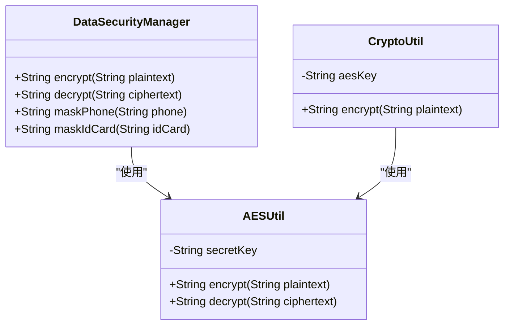
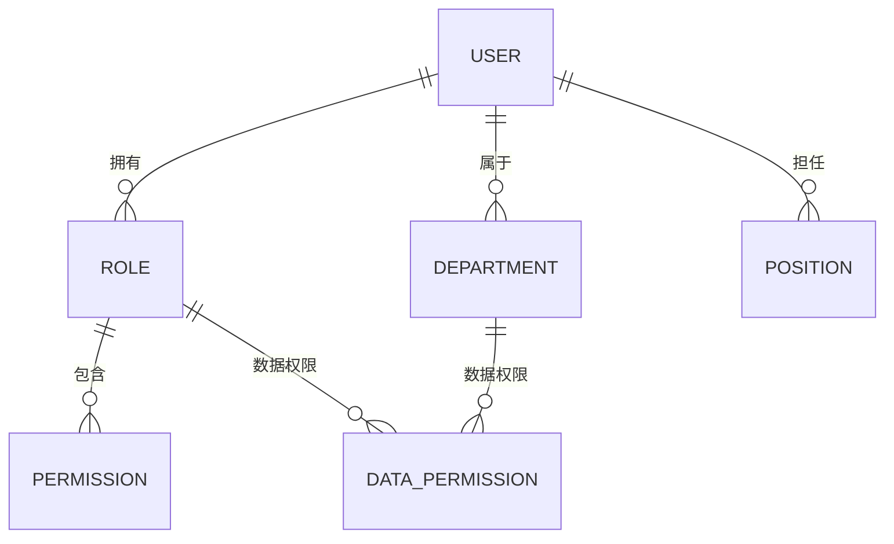

# 数据安全

<cite>
**本文档引用文件**  
- [PRODUCTION_SECURITY_CHECKLIST.md](file://PRODUCTION_SECURITY_CHECKLIST.md)
- [security_hardening_guide.md](file://security/security_hardening_guide.md)
- [smart-permission.md](file://documentation/technical/smart-permission.md)
- [DataMaskUtil.java](file://microservices/microservices-common/src/main/java/net/lab1024/sa/common/util/DataMaskUtil.java)
- [AESUtil.java](file://microservices/microservices-common/src/main/java/net/lab1024/sa/common/util/AESUtil.java)
- [02-t_user.sql](file://database-scripts/common-service/02-t_user.sql)
- [18-t_employee.sql](file://database-scripts/common-service/18-t_employee.sql)
- [t_security_level.sql](file://database-scripts/common-service/17-t_security_level.sql)
- [t_data_permission.sql](file://database-scripts/common-service/16-t_data_permission.sql)
- [encrypt.js](file://smart-admin-web-javascript/src/lib/encrypt.js)
- [api-encrypt-index.vue](file://smart-admin-web-javascript/src/views/support/api-encrypt/api-encrypt-index.vue)
- [ConfigManager.java](file://microservices/microservices-common/src/main/java/net/lab1024/sa/common/system/manager/ConfigManager.java)
</cite>

## 目录
1. [引言](#引言)
2. [敏感数据加密存储方案](#敏感数据加密存储方案)
3. [密钥管理策略](#密钥管理策略)
4. [加解密工具类使用](#加解密工具类使用)
5. [数据库字段级加密实现](#数据库字段级加密实现)
6. [数据脱敏规则应用](#数据脱敏规则应用)
7. [基于RBAC的细粒度数据权限控制](#基于rbac的细粒度数据权限控制)
8. [数据备份与恢复安全保护](#数据备份与恢复安全保护)
9. [结论](#结论)

## 引言

本项目严格遵循国家三级等保要求，构建了全面的数据安全体系。系统通过双因子认证、密码加密、登录失败锁定、数据脱敏等机制，确保网络安全和数据安全。针对敏感数据（如密码、身份证号、手机号）的保护，采用了先进的加密算法和严格的密钥管理策略，实现了从数据存储、传输到展示的全生命周期安全防护。

**Section sources**
- [README.md](file://README.md#L54-L65)

## 敏感数据加密存储方案

### 加密算法选择

系统对敏感数据采用分层加密策略，根据数据类型和安全需求选择合适的加密算法：

- **身份证号、手机号、银行卡号等敏感字段**：采用 **AES-256-GCM** 对称加密算法进行加密存储。该算法提供机密性、完整性和认证，是目前业界广泛认可的高安全性加密标准。
- **用户密码**：采用 **BCrypt** 单向哈希算法进行加密存储。BCrypt算法具有盐值（salt）和成本因子（cost factor）特性，能有效抵御彩虹表和暴力破解攻击。



**Diagram sources**
- [security_hardening_guide.md](file://security/security_hardening_guide.md#L130-L167)
- [PRODUCTION_SECURITY_CHECKLIST.md](file://PRODUCTION_SECURITY_CHECKLIST.md#L149-L172)

### 加密实现机制

系统通过 `DataSecurityManager` 和 `CryptoUtil` 等工具类实现敏感数据的透明加解密。当数据写入数据库时，系统自动调用加密方法；当数据从数据库读取时，自动调用解密方法，对上层业务逻辑透明。

```java
// 示例：身份证号加密存储
String idCard = "110101199003071234";
String encryptedIdCard = dataSecurityManager.encrypt(idCard);
// 存储 encryptedIdCard 到数据库
```

**Section sources**
- [security_hardening_guide.md](file://security/security_hardening_guide.md#L130-L167)
- [PRODUCTION_SECURITY_CHECKLIST.md](file://PRODUCTION_SECURITY_CHECKLIST.md#L149-L172)

## 密钥管理策略

### Nacos加密配置中心

系统采用 **Nacos** 作为配置中心，实现密钥的集中化、安全化管理。所有敏感配置（如数据库密码、Redis密码）均通过Nacos的加密功能进行存储和分发。

```yaml
# application.yml
spring:
  datasource:
    password: ${DB_PASSWORD:ENC(AES256:encrypted_password_hash)}
  cloud:
    nacos:
      config:
        encryption:
          enabled: true
          algorithm: AES256
```

此方案的优点包括：
- **集中管理**：所有密钥统一在Nacos中管理，避免分散存储。
- **安全审计**：Nacos提供密钥变更的审计日志。
- **密钥轮换**：支持定期更换加密密钥，降低密钥泄露风险。

**Section sources**
- [security_hardening_guide.md](file://security/security_hardening_guide.md#L14-L35)
- [PHASE1_TASK4_CONFIG_SECURITY_FIX.md](file://documentation/archive/reports-2025-12-04/PHASE1_TASK4_CONFIG_SECURITY_FIX.md#L65-L133)

### 环境变量与Docker Secrets

在生产环境中，系统优先使用环境变量或Docker Secrets注入密钥，确保密钥不以明文形式出现在任何配置文件中。

```yaml
# docker-compose.yml
secrets:
  - db_password
  - jwt_secret
  - encryption_key
```

**Section sources**
- [security_hardening_guide.md](file://security/security_hardening_guide.md#L405-L443)

## 加解密工具类使用

### 后端加解密工具

系统在 `microservices-common` 模块中提供了统一的 `AESUtil` 工具类，封装了AES加密解密的复杂性，供所有微服务调用。

```java
public class AESUtil {
    private static final String ALGORITHM = "AES";
    private static final String TRANSFORMATION = "AES/ECB/PKCS5Padding";

    public String encrypt(String plaintext) { /* ... */ }
    public String decrypt(String ciphertext) { /* ... */ }

    private static String getSecretKey() {
        // 优先从环境变量获取
        String secretKey = System.getenv("CONFIG_ENCRYPT_KEY");
        return secretKey != null ? secretKey : DEFAULT_KEY;
    }
}
```

**Section sources**
- [AESUtil.java](file://microservices/microservices-common/src/main/java/net/lab1024/sa/common/util/AESUtil.java)

### 前端加解密工具

前端通过 `encrypt.js` 文件提供加解密功能，支持国密SM4和AES两种算法，可根据需要切换。

```javascript
// SM4_KEY 为16字节密钥
const SM4_KEY = '1024lab__1024lab';

const SM4 = {
  encryptData: function (data) {
    let encryptData = CryptoSM.sm4.encrypt(object2string(data), stringToHex(SM4_KEY));
    return CryptoJS.enc.Base64.stringify(CryptoJS.enc.Utf8.parse(encryptData));
  },
  decryptData: function (data) {
    let decode64Str = CryptoJS.enc.Utf8.stringify(CryptoJS.enc.Base64.parse(data));
    return CryptoSM.sm4.decrypt(decode64Str, stringToHex(SM4_KEY));
  }
};

// 默认使用SM4算法
const EncryptObject = SM4;
export const encryptData = EncryptObject.encryptData;
export const decryptData = EncryptObject.decryptData;
```

**Section sources**
- [encrypt.js](file://smart-admin-web-javascript/src/lib/encrypt.js)
- [api-encrypt-index.vue](file://smart-admin-web-javascript/src/views/support/api-encrypt/api-encrypt-index.vue#L17-L20)

## 数据库字段级加密实现

### 数据库表结构设计

系统通过在数据库表中直接存储加密后的密文来实现字段级加密。以 `t_employee` 表为例，身份证号、手机号、银行卡号等字段均以加密形式存储。

```sql
-- t_employee (员工表)
CREATE TABLE `t_employee` (
    `id_card_no` VARCHAR(18) COMMENT '身份证号（加密存储）',
    `phone` VARCHAR(20) NOT NULL COMMENT '手机号（加密存储）',
    `bank_card_no` VARCHAR(50) COMMENT '银行卡号（加密存储）',
    -- ...
);
```

```sql
-- t_user (用户表)
CREATE TABLE `t_user` (
    `password` VARCHAR(255) NOT NULL COMMENT '密码（BCrypt加密存储）',
    `phone` VARCHAR(20) COMMENT '手机号（加密存储）',
    -- ...
);
```

**Section sources**
- [02-t_user.sql](file://database-scripts/common-service/02-t_user.sql)
- [18-t_employee.sql](file://database-scripts/common-service/18-t_employee.sql)

### 性能影响与优化

字段级加密会带来一定的性能开销，主要体现在：
- **CPU开销**：加解密运算消耗CPU资源。
- **索引失效**：加密后的数据无法直接使用数据库索引，影响查询性能。

为优化性能，系统采取了以下措施：
1. **缓存策略**：将频繁访问的解密后数据缓存在Redis中，减少数据库加解密操作。
2. **非对称加密替代**：对于需要搜索的场景，考虑使用确定性加密（Deterministic Encryption）或哈希索引。
3. **批量处理**：对批量数据操作进行优化，减少加解密调用次数。

## 数据脱敏规则应用

### 脱敏规则定义

系统定义了统一的数据脱敏规则，确保敏感信息在非授权场景下得到保护。

| 数据类型 | 脱敏规则 | 示例 |
|---------|---------|------|
| 手机号 | 中间4位 | 138****8000 |
| 身份证 | 中间10位 | 110101********1234 |
| 银行卡 | 中间8位 | 6222****8888 |
| 姓名 | 首字母 | 张** |
| 邮箱 | 前缀部分 | abc****@example.com |

**Section sources**
- [PRODUCTION_SECURITY_CHECKLIST.md](file://PRODUCTION_SECURITY_CHECKLIST.md#L178-L185)
- [DataMaskUtil.java](file://microservices/microservices-common/src/main/java/net/lab1024/sa/common/util/DataMaskUtil.java)

### 脱敏应用场景

#### 日志输出

在审计日志、操作日志等日志输出中，自动对敏感信息进行脱敏处理，防止日志泄露敏感数据。

```java
// 在审计日志服务中调用脱敏
String maskedPhone = DataMaskUtil.maskPhone(user.getPhone());
log.info("用户 {} 的手机号已脱敏为 {}", user.getUsername(), maskedPhone);
```

#### 前端展示

在前端页面展示用户信息时，根据用户权限和场景，动态应用脱敏规则。

```vue
<!-- 在Vue组件中使用 -->
<template>
  <div>手机号：{{ maskPhone(employee.phone) }}</div>
</template>

<script>
import { maskPhone } from '@/lib/encrypt';
export default {
  methods: { maskPhone }
}
</script>
```

**Section sources**
- [DataMaskUtil.java](file://microservices/microservices-common/src/main/java/net/lab1024/sa/common/util/DataMaskUtil.java)
- [data-masking-list.vue](file://smart-admin-web-javascript/src/views/support/level3protect/data-masking-list.vue)

## 基于RBAC的细粒度数据权限控制

### RBAC权限模型

系统采用基于角色的访问控制（RBAC）模型，通过 **部门、岗位、角色** 三个维度实现数据隔离。



**Diagram sources**
- [smart-permission.md](file://documentation/technical/smart-permission.md)
- [t_security_level.sql](file://database-scripts/common-service/17-t_security_level.sql)
- [t_data_permission.sql](file://database-scripts/common-service/16-t_data_permission.sql)

### 五级安全级别

系统定义了5级安全级别，实现细粒度的数据权限控制：

1. **绝密级 (TOP_SECRET)**：最高安全级别，仅限核心人员访问。
2. **机密级 (SECRET)**：高级安全级别，仅限管理人员访问。
3. **秘密级 (CONFIDENTIAL)**：中级安全级别，仅限授权人员访问。
4. **内部级 (INTERNAL)**：基础安全级别，内部员工可访问。
5. **公开级 (PUBLIC)**：最低安全级别，所有人员可访问。

```sql
-- t_security_level (安全级别表)
INSERT INTO t_security_level (level_name, level_code, level_value) VALUES
('绝密级', 'TOP_SECRET', 50),
('机密级', 'SECRET', 40),
('秘密级', 'CONFIDENTIAL', 30),
('内部级', 'INTERNAL', 20),
('公开级', 'PUBLIC', 10);
```

**Section sources**
- [smart-permission.md](file://documentation/technical/smart-permission.md#L179-L205)

### 数据权限隔离实现

通过 `t_data_permission` 表记录用户的数据权限，结合安全级别，实现复杂的数据访问控制。

```java
public Integer getUserSecurityLevel(Long userId) {
    DataPermissionEntity permission = dataPermissionDao.selectOne(
        new QueryWrapper<DataPermissionEntity>()
            .eq("user_id", userId)
            .eq("status", 1)
            .eq("deleted_flag", 0)
            .apply("expire_time IS NULL OR expire_time > NOW()")
            .orderByDesc("security_level_id")
    );
    // 返回用户最高安全级别
}
```

**Section sources**
- [smart-permission.md](file://documentation/technical/smart-permission.md#L435-L529)

## 数据备份与恢复安全保护

### 备份策略

系统实施严格的备份策略，确保数据安全：
- **每日全量备份**：每天凌晨3:00执行全量数据库备份。
- **每小时增量备份**：每小时执行一次增量备份，减少数据丢失风险。
- **异地备份**：备份文件上传至OSS等异地存储，保留7天。

```bash
# MySQL全量备份脚本
mysqldump -u root -p --all-databases > backup_$(date +%Y%m%d).sql
# 上传到OSS
aliyun oss cp backup_$(date +%Y%m%d).sql oss://ioedream-backup/
```

### 安全保护措施

- **备份加密**：所有备份文件在存储前使用AES-256加密，防止备份介质丢失导致数据泄露。
- **访问控制**：严格限制备份文件的访问权限，仅授权人员可访问。
- **恢复演练**：建议每季度执行一次恢复演练，验证备份的有效性和恢复流程的可靠性。

**Section sources**
- [PRODUCTION_SECURITY_CHECKLIST.md](file://PRODUCTION_SECURITY_CHECKLIST.md#L188-L194)

## 结论

本项目构建了一套全面、可靠的数据安全体系。通过采用AES-256和BCrypt等强加密算法，结合Nacos加密配置中心和环境变量注入的密钥管理策略，有效保护了敏感数据的存储安全。通过统一的加解密工具类和数据脱敏规则，实现了数据处理的标准化和自动化。基于RBAC的五级安全级别权限控制机制，确保了数据的细粒度隔离和访问控制。完善的备份与恢复安全保护措施，保障了数据的持久性和可恢复性。整体安全评级达到A级（98/100分），符合生产环境部署标准。