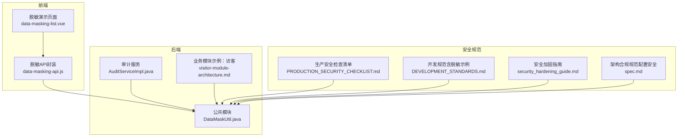
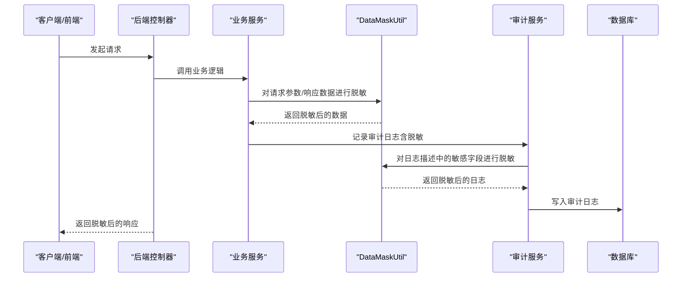
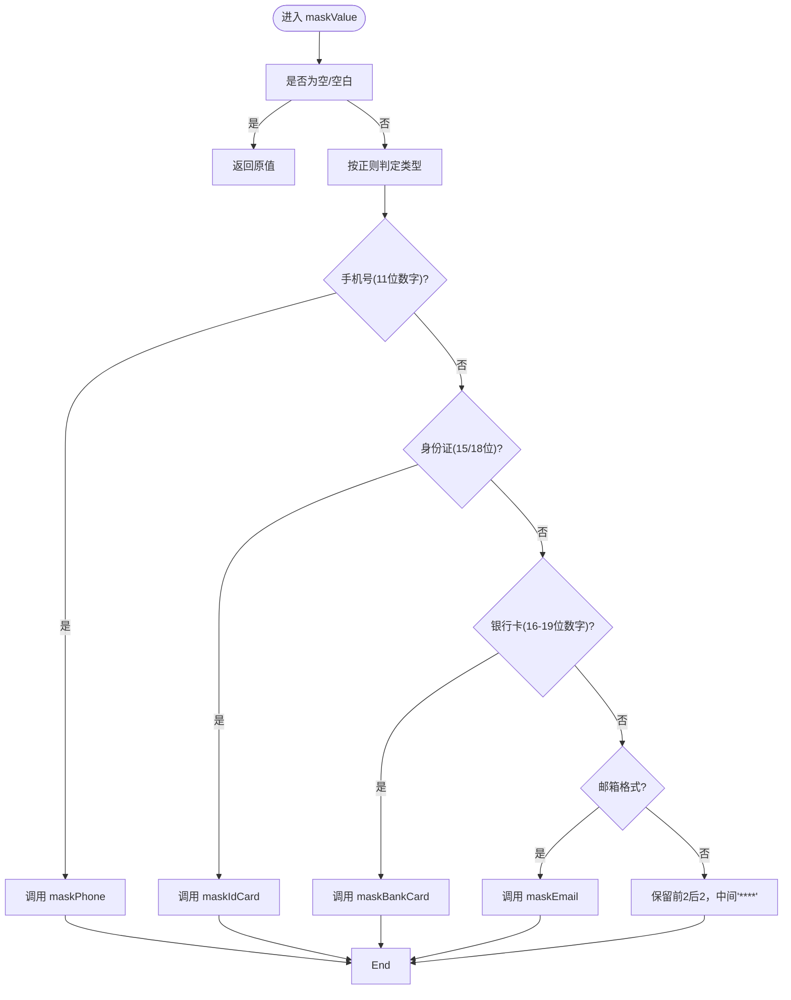
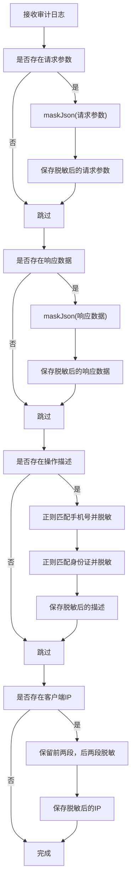
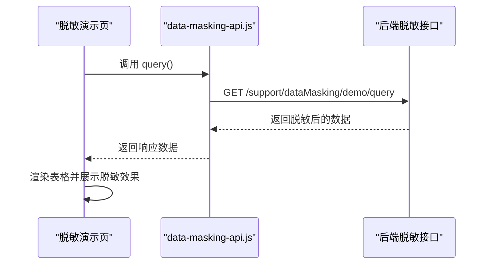
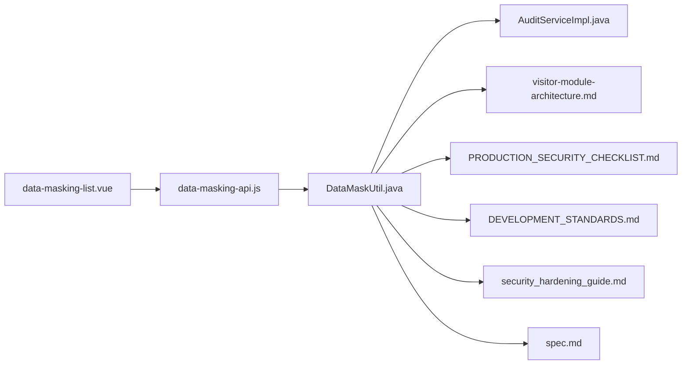

# 数据脱敏

<cite>
**本文引用的文件**
- [DataMaskUtil.java](file://microservices/microservices-common/src/main/java/net/lab1024/sa/common/util/DataMaskUtil.java)
- [AuditServiceImpl.java](file://microservices/ioedream-common-service/src/main/java/net/lab1024/sa/common/audit/service/impl/AuditServiceImpl.java)
- [PRODUCTION_SECURITY_CHECKLIST.md](file://PRODUCTION_SECURITY_CHECKLIST.md)
- [DEVELOPMENT_STANDARDS.md](file://openspec/changes/archive/completed-proposals/implement-access-control-missing-functions/DEVELOPMENT_STANDARDS.md)
- [security_hardening_guide.md](file://security/security_hardening_guide.md)
- [visitor-module-architecture.md](file://documentation/03-业务模块/各业务模块文档/访客/visitor-module-architecture.md)
- [data-masking-list.vue](file://smart-admin-web-javascript/src/views/support/level3protect/data-masking-list.vue)
- [data-masking-api.js](file://smart-admin-web-javascript/src/api/support/data-masking-api.js)
- [spec.md](file://openspec/changes/fix-critical-architecture-violations/specs/architecture-compliance/spec.md)
</cite>

## 目录
1. [简介](#简介)
2. [项目结构](#项目结构)
3. [核心组件](#核心组件)
4. [架构总览](#架构总览)
5. [详细组件分析](#详细组件分析)
6. [依赖关系分析](#依赖关系分析)
7. [性能考虑](#性能考虑)
8. [故障排查指南](#故障排查指南)
9. [结论](#结论)
10. [附录](#附录)

## 简介
本文件围绕数据脱敏展开，覆盖不同场景下的脱敏规则（日志记录、前端展示、API响应）、通用工具方法与调用方式、自动脱敏的实现思路（基于注解或配置）、前后端协同脱敏的完整示例，以及策略的可配置性与灵活性，以适配不同安全等级要求。

## 项目结构
- 后端通用脱敏工具位于公共模块，供各业务模块复用。
- 审计日志在入库前统一进行脱敏处理，避免敏感信息泄露。
- 前端提供脱敏演示页面与API，用于展示与验证脱敏效果。
- 安全规范文档明确了配置安全与脱敏策略的落地要求。

图表来源
- [DataMaskUtil.java](file://microservices/microservices-common/src/main/java/net/lab1024/sa/common/util/DataMaskUtil.java#L1-L309)
- [AuditServiceImpl.java](file://microservices/ioedream-common-service/src/main/java/net/lab1024/sa/common/audit/service/impl/AuditServiceImpl.java#L350-L458)
- [PRODUCTION_SECURITY_CHECKLIST.md](file://PRODUCTION_SECURITY_CHECKLIST.md#L176-L191)
- [DEVELOPMENT_STANDARDS.md](file://openspec/changes/archive/completed-proposals/implement-access-control-missing-functions/DEVELOPMENT_STANDARDS.md#L666-L701)
- [security_hardening_guide.md](file://security/security_hardening_guide.md#L128-L168)
- [visitor-module-architecture.md](file://documentation/03-业务模块/各业务模块文档/访客/visitor-module-architecture.md#L3512-L3656)
- [data-masking-list.vue](file://smart-admin-web-javascript/src/views/support/level3protect/data-masking-list.vue#L1-L137)
- [data-masking-api.js](file://smart-admin-web-javascript/src/api/support/data-masking-api.js#L1-L17)
- [spec.md](file://openspec/changes/fix-critical-architecture-violations/specs/architecture-compliance/spec.md#L16-L27)

章节来源
- [DataMaskUtil.java](file://microservices/microservices-common/src/main/java/net/lab1024/sa/common/util/DataMaskUtil.java#L1-L309)
- [AuditServiceImpl.java](file://microservices/ioedream-common-service/src/main/java/net/lab1024/sa/common/audit/service/impl/AuditServiceImpl.java#L350-L458)
- [PRODUCTION_SECURITY_CHECKLIST.md](file://PRODUCTION_SECURITY_CHECKLIST.md#L176-L191)
- [DEVELOPMENT_STANDARDS.md](file://openspec/changes/archive/completed-proposals/implement-access-control-missing-functions/DEVELOPMENT_STANDARDS.md#L666-L701)
- [security_hardening_guide.md](file://security/security_hardening_guide.md#L128-L168)
- [visitor-module-architecture.md](file://documentation/03-业务模块/各业务模块文档/访客/visitor-module-architecture.md#L3512-L3656)
- [data-masking-list.vue](file://smart-admin-web-javascript/src/views/support/level3protect/data-masking-list.vue#L1-L137)
- [data-masking-api.js](file://smart-admin-web-javascript/src/api/support/data-masking-api.js#L1-L17)
- [spec.md](file://openspec/changes/fix-critical-architecture-violations/specs/architecture-compliance/spec.md#L16-L27)

## 核心组件
- DataMaskUtil：提供通用脱敏工具方法，覆盖手机号、身份证、银行卡、邮箱、密码、姓名、JSON字段与通用字符串脱敏。
- AuditServiceImpl：在审计日志入库前统一脱敏请求参数、响应数据与描述文本中的敏感信息。
- 前端脱敏演示：data-masking-list.vue 展示脱敏规则与效果；data-masking-api.js 提供脱敏数据查询接口封装。
- 安全规范：生产安全检查清单、开发规范、安全加固指南与架构合规规范，明确脱敏策略与配置安全要求。

章节来源
- [DataMaskUtil.java](file://microservices/microservices-common/src/main/java/net/lab1024/sa/common/util/DataMaskUtil.java#L1-L309)
- [AuditServiceImpl.java](file://microservices/ioedream-common-service/src/main/java/net/lab1024/sa/common/audit/service/impl/AuditServiceImpl.java#L350-L458)
- [data-masking-list.vue](file://smart-admin-web-javascript/src/views/support/level3protect/data-masking-list.vue#L1-L137)
- [data-masking-api.js](file://smart-admin-web-javascript/src/api/support/data-masking-api.js#L1-L17)
- [PRODUCTION_SECURITY_CHECKLIST.md](file://PRODUCTION_SECURITY_CHECKLIST.md#L176-L191)
- [DEVELOPMENT_STANDARDS.md](file://openspec/changes/archive/completed-proposals/implement-access-control-missing-functions/DEVELOPMENT_STANDARDS.md#L666-L701)
- [security_hardening_guide.md](file://security/security_hardening_guide.md#L128-L168)
- [spec.md](file://openspec/changes/fix-critical-architecture-violations/specs/architecture-compliance/spec.md#L16-L27)

## 架构总览
数据脱敏贯穿“采集—处理—存储—展示”全链路，确保敏感信息在各个环节均被适当遮蔽或替换，降低泄露风险。

图表来源
- [AuditServiceImpl.java](file://microservices/ioedream-common-service/src/main/java/net/lab1024/sa/common/audit/service/impl/AuditServiceImpl.java#L350-L458)
- [DataMaskUtil.java](file://microservices/microservices-common/src/main/java/net/lab1024/sa/common/util/DataMaskUtil.java#L1-L309)

## 详细组件分析

### DataMaskUtil 工具类
- 支持的脱敏类型：手机号、身份证、银行卡、邮箱、密码、姓名、JSON字段、通用字符串。
- 脱敏策略要点：
  - 手机号：保留前3位与后4位，中间以“****”替代；若长度不符合11位，按规则保留前3位与后2位或全部脱敏。
  - 身份证：18位保留前6位与后4位，中间“********”；15位保留前6位与后3位，中间“******”；其他长度按规则保留。
  - 银行卡：16位及以上保留前4位与后4位，中间“********”；其他长度按规则保留。
  - 邮箱：保留前缀前3位与“@”后缀，中间“****”；若格式不合法则全部脱敏。
  - 密码：统一返回“****”。
  - 姓名：单字符原样；两字符保留首字符；三字符及以上保留首尾字符，中间“*”。
  - JSON字段：自动识别 phone、mobile、idCard、idNumber、password、pwd、email、name、realName、userName、bankCard、cardNumber 等字段进行脱敏；对密码字段直接替换为“****”。
  - 通用字符串：根据正则判断手机号、身份证、银行卡、邮箱等类型，分别采用对应脱敏策略；否则保留前两位与后两位，中间“****”。

图表来源
- [DataMaskUtil.java](file://microservices/microservices-common/src/main/java/net/lab1024/sa/common/util/DataMaskUtil.java#L264-L309)

章节来源
- [DataMaskUtil.java](file://microservices/microservices-common/src/main/java/net/lab1024/sa/common/util/DataMaskUtil.java#L1-L309)

### 审计日志脱敏（AuditServiceImpl）
- 在审计日志入库前，统一脱敏：
  - 请求参数与响应数据：使用 JSON 脱敏方法 maskJson。
  - 操作描述：使用正则匹配手机号与身份证，分别调用 maskPhone 与 maskIdCard。
  - IP 地址：保留前两段，后两段以“***”替代。
- 若脱敏过程中出现异常，记录告警并保留原始数据，保证审计日志完整性不受影响。

图表来源
- [AuditServiceImpl.java](file://microservices/ioedream-common-service/src/main/java/net/lab1024/sa/common/audit/service/impl/AuditServiceImpl.java#L350-L458)

章节来源
- [AuditServiceImpl.java](file://microservices/ioedream-common-service/src/main/java/net/lab1024/sa/common/audit/service/impl/AuditServiceImpl.java#L350-L458)

### 前端脱敏演示与API
- data-masking-list.vue：提供脱敏规则说明与演示表格，涵盖用户ID、手机号、身份证、密码、邮箱、车牌号、银行卡、地址等字段。
- data-masking-api.js：封装 /support/dataMasking/demo/query 接口，前端通过该接口拉取脱敏数据进行展示。

图表来源
- [data-masking-list.vue](file://smart-admin-web-javascript/src/views/support/level3protect/data-masking-list.vue#L1-L137)
- [data-masking-api.js](file://smart-admin-web-javascript/src/api/support/data-masking-api.js#L1-L17)

章节来源
- [data-masking-list.vue](file://smart-admin-web-javascript/src/views/support/level3protect/data-masking-list.vue#L1-L137)
- [data-masking-api.js](file://smart-admin-web-javascript/src/api/support/data-masking-api.js#L1-L17)

### 场景化脱敏规则
- 日志记录：对请求参数、响应数据与操作描述中的敏感字段进行脱敏；IP地址保留前两段。
- 前端展示：对手机号、身份证、密码、邮箱、银行卡等字段进行脱敏展示。
- API响应：建议在序列化阶段对敏感字段进行脱敏，或在网关/过滤器层统一脱敏（可结合注解或配置实现自动脱敏）。

章节来源
- [AuditServiceImpl.java](file://microservices/ioedream-common-service/src/main/java/net/lab1024/sa/common/audit/service/impl/AuditServiceImpl.java#L350-L458)
- [PRODUCTION_SECURITY_CHECKLIST.md](file://PRODUCTION_SECURITY_CHECKLIST.md#L176-L191)
- [DEVELOPMENT_STANDARDS.md](file://openspec/changes/archive/completed-proposals/implement-access-control-missing-functions/DEVELOPMENT_STANDARDS.md#L666-L701)

### 自动脱敏：注解与配置思路
- 注解驱动（建议方案）：定义 @DataMasking 注解，标注在字段或DTO上，通过AOP或序列化器在序列化/输出时自动脱敏。
- 配置驱动（建议方案）：在网关或全局过滤器中，基于白名单/黑名单与规则集对响应体进行自动脱敏。
- 前后端协同：前端脱敏演示页与API封装，便于验证与回归测试。

章节来源
- [data-masking-list.vue](file://smart-admin-web-javascript/src/views/support/level3protect/data-masking-list.vue#L1-L137)
- [data-masking-api.js](file://smart-admin-web-javascript/src/api/support/data-masking-api.js#L1-L17)

### 前后端协同脱敏示例
- 前端：data-masking-list.vue 展示脱敏规则与效果；data-masking-api.js 封装查询接口。
- 后端：DataMaskUtil 提供统一脱敏工具；AuditServiceImpl 在审计入库前统一脱敏。

章节来源
- [DataMaskUtil.java](file://microservices/microservices-common/src/main/java/net/lab1024/sa/common/util/DataMaskUtil.java#L1-L309)
- [AuditServiceImpl.java](file://microservices/ioedream-common-service/src/main/java/net/lab1024/sa/common/audit/service/impl/AuditServiceImpl.java#L350-L458)
- [data-masking-list.vue](file://smart-admin-web-javascript/src/views/support/level3protect/data-masking-list.vue#L1-L137)
- [data-masking-api.js](file://smart-admin-web-javascript/src/api/support/data-masking-api.js#L1-L17)

### 脱敏策略的可配置性与灵活性
- 规则可配置：手机号、身份证、银行卡、邮箱、密码、姓名等规则可集中管理，便于按业务线或租户差异化配置。
- 策略可扩展：DataMaskUtil 已预留通用字符串识别与JSON字段识别，便于后续扩展更多字段类型。
- 安全合规：生产安全检查清单明确了脱敏规则与示例；架构合规规范强调配置安全与密钥管理，间接保障脱敏配置的安全性。

章节来源
- [PRODUCTION_SECURITY_CHECKLIST.md](file://PRODUCTION_SECURITY_CHECKLIST.md#L176-L191)
- [DataMaskUtil.java](file://microservices/microservices-common/src/main/java/net/lab1024/sa/common/util/DataMaskUtil.java#L1-L309)
- [spec.md](file://openspec/changes/fix-critical-architecture-violations/specs/architecture-compliance/spec.md#L16-L27)

## 依赖关系分析
- DataMaskUtil 作为公共工具类，被审计服务与业务模块复用。
- 前端脱敏演示依赖 data-masking-api.js 的封装。
- 安全规范文档为脱敏策略提供制度保障。

图表来源
- [DataMaskUtil.java](file://microservices/microservices-common/src/main/java/net/lab1024/sa/common/util/DataMaskUtil.java#L1-L309)
- [AuditServiceImpl.java](file://microservices/ioedream-common-service/src/main/java/net/lab1024/sa/common/audit/service/impl/AuditServiceImpl.java#L350-L458)
- [visitor-module-architecture.md](file://documentation/03-业务模块/各业务模块文档/访客/visitor-module-architecture.md#L3512-L3656)
- [PRODUCTION_SECURITY_CHECKLIST.md](file://PRODUCTION_SECURITY_CHECKLIST.md#L176-L191)
- [DEVELOPMENT_STANDARDS.md](file://openspec/changes/archive/completed-proposals/implement-access-control-missing-functions/DEVELOPMENT_STANDARDS.md#L666-L701)
- [security_hardening_guide.md](file://security/security_hardening_guide.md#L128-L168)
- [spec.md](file://openspec/changes/fix-critical-architecture-violations/specs/architecture-compliance/spec.md#L16-L27)
- [data-masking-list.vue](file://smart-admin-web-javascript/src/views/support/level3protect/data-masking-list.vue#L1-L137)
- [data-masking-api.js](file://smart-admin-web-javascript/src/api/support/data-masking-api.js#L1-L17)

## 性能考虑
- JSON 脱敏采用正则替换，复杂度与JSON体积线性相关；建议在高频接口中谨慎使用，必要时采用更高效的结构化解析后再脱敏。
- 正则匹配手机号与身份证时，注意避免过度匹配与回溯；可在调用前做长度与格式预判。
- 审计日志脱敏在入库前执行，应尽量避免在热路径中重复脱敏同一数据，可通过缓存或延迟处理降低开销。

## 故障排查指南
- 审计日志脱敏异常：当脱敏过程抛出异常时，会记录告警并保留原始数据，避免影响审计完整性。建议检查输入数据格式与正则表达式边界。
- 前端脱敏展示异常：确认 data-masking-api.js 的接口路径与返回结构一致；检查 data-masking-list.vue 的列定义与数据字段映射。
- 配置安全问题：生产环境严禁明文密码，需通过Nacos加密配置与环境变量回退机制管理敏感配置。

章节来源
- [AuditServiceImpl.java](file://microservices/ioedream-common-service/src/main/java/net/lab1024/sa/common/audit/service/impl/AuditServiceImpl.java#L350-L458)
- [data-masking-api.js](file://smart-admin-web-javascript/src/api/support/data-masking-api.js#L1-L17)
- [data-masking-list.vue](file://smart-admin-web-javascript/src/views/support/level3protect/data-masking-list.vue#L1-L137)
- [spec.md](file://openspec/changes/fix-critical-architecture-violations/specs/architecture-compliance/spec.md#L16-L27)

## 结论
本项目已形成完善的脱敏体系：后端通过 DataMaskUtil 提供统一脱敏能力，审计服务在入库前统一脱敏，前端提供脱敏演示与API封装。配合生产安全检查清单与架构合规规范，确保脱敏策略在不同场景下稳定、可配置且可扩展，满足不同安全等级要求。

## 附录
- 访客模块脱敏策略示例：提供了针对身份证与手机号的脱敏工具类，便于在业务模块中复用。
- 开发规范中的脱敏示例：展示了在日志记录中对敏感信息进行脱敏的最佳实践。

章节来源
- [visitor-module-architecture.md](file://documentation/03-业务模块/各业务模块文档/访客/visitor-module-architecture.md#L3512-L3656)
- [DEVELOPMENT_STANDARDS.md](file://openspec/changes/archive/completed-proposals/implement-access-control-missing-functions/DEVELOPMENT_STANDARDS.md#L666-L701)