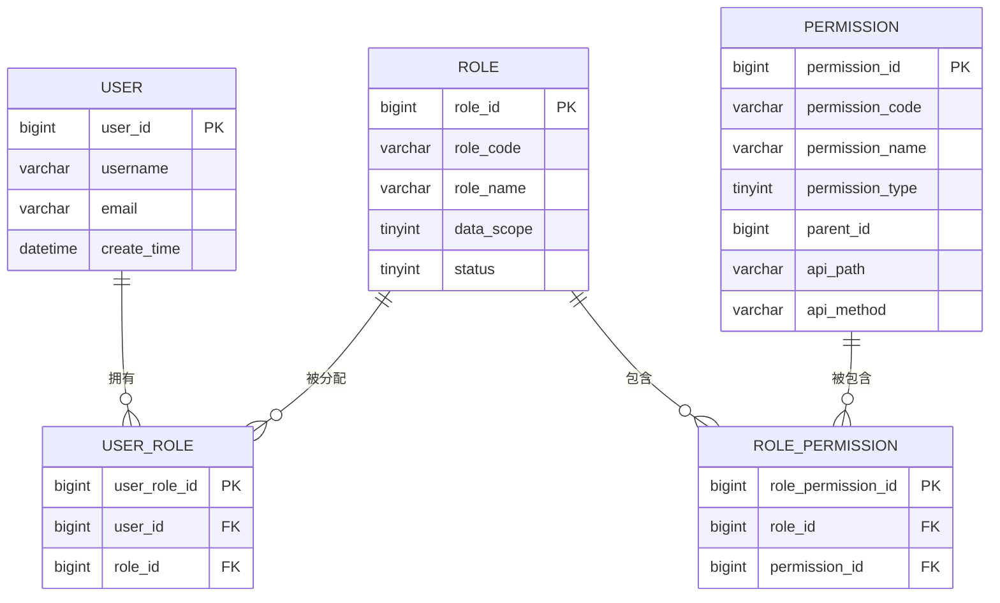
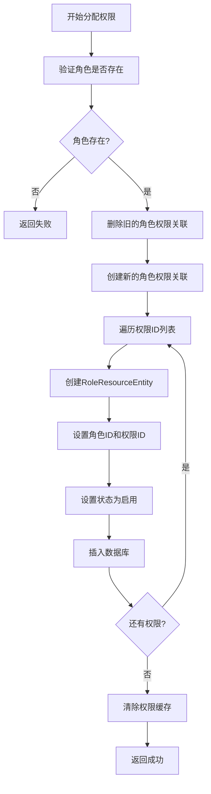
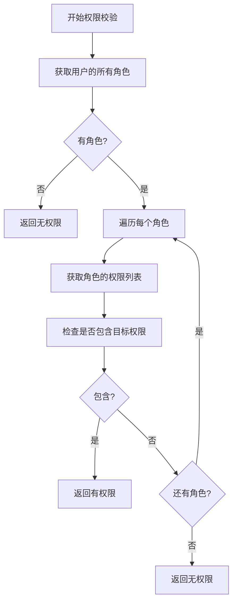
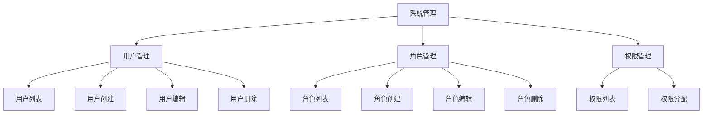
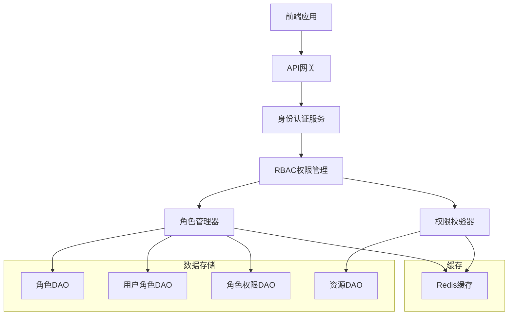
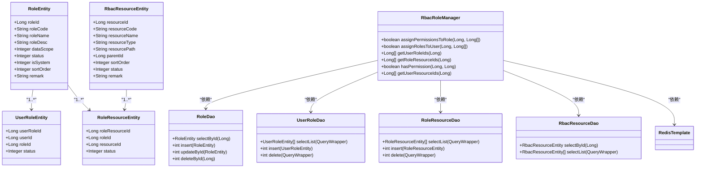
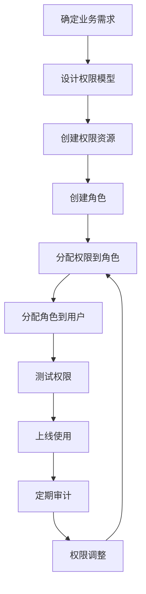

# RBAC权限模型

<cite>
**本文档引用文件**  
- [03-t_role.sql](file://database-scripts/common-service/03-t_role.sql)
- [04-t_permission.sql](file://database-scripts/common-service/04-t_permission.sql)
- [05-t_user_role.sql](file://database-scripts/common-service/05-t_user_role.sql)
- [06-t_role_permission.sql](file://database-scripts/common-service/06-t_role_permission.sql)
- [RoleEntity.java](file://microservices/microservices-common/src/main/java/net/lab1024/sa/common/rbac/domain/entity/RoleEntity.java)
- [RbacResourceEntity.java](file://microservices/microservices-common/src/main/java/net/lab1024/sa/common/rbac/domain/entity/RbacResourceEntity.java)
- [UserRoleEntity.java](file://microservices/microservices-common/src/main/java/net/lab1024/sa/common/rbac/domain/entity/UserRoleEntity.java)
- [RbacRoleManager.java](file://microservices/ioedream-common-service/src/main/java/net/lab1024/sa/common/rbac/manager/RbacRoleManager.java)
- [RoleController.java](file://restful_refactor_backup_20251202_014224/microservices_ioedream-identity-service_src_main_java_net_lab1024_sa_identity_module_rbac_controller_RoleController.java)
- [PermissionController.java](file://restful_refactor_backup_20251202_014224/microservices_ioedream-identity-service_src_main_java_net_lab1024_sa_identity_module_rbac_controller_PermissionController.java)
- [RoleDao.java](file://microservices/microservices-common/src/main/java/net/lab1024/sa/common/rbac/dao/RoleDao.java)
- [RbacResourceDao.java](file://microservices/microservices-common/src/main/java/net/lab1024/sa/common/rbac/dao/RbacResourceDao.java)
- [UserRoleDao.java](file://microservices/microservices-common/src/main/java/net/lab1024/sa/common/rbac/dao/UserRoleDao.java)
- [RoleResourceDao.java](file://microservices/microservices-common/src/main/java/net/lab1024/sa/common/rbac/dao/RoleResourceDao.java)
</cite>

## 目录
1. [引言](#引言)
2. [核心概念与关系](#核心概念与关系)
3. [数据库表结构设计](#数据库表结构设计)
4. [角色与权限绑定机制](#角色与权限绑定机制)
5. [权限校验流程](#权限校验流程)
6. [角色继承与层级结构](#角色继承与层级结构)
7. [功能权限与数据权限控制](#功能权限与数据权限控制)
8. [核心API接口说明](#核心api接口说明)
9. [系统架构与组件关系](#系统架构与组件关系)
10. [最佳实践与使用指南](#最佳实践与使用指南)

## 引言

RBAC（基于角色的访问控制）权限模型是本系统安全体系的核心组成部分，用于实现精细化的权限管理。该模型通过定义用户、角色和权限三者之间的关系，实现了灵活且可扩展的权限控制系统。系统支持功能权限（菜单、按钮、接口）和数据权限（数据范围）的双重控制，确保用户只能访问其被授权的资源和数据。

本模型遵循企业级安全标准，具备权限缓存、事务管理、异常处理等特性，并通过Redis提升权限校验性能。权限体系支持动态配置，管理员可通过后台管理系统灵活调整角色权限和用户角色分配。

## 核心概念与关系

RBAC权限模型包含三个核心实体：用户（User）、角色（Role）和权限（Permission），它们之间通过多对多关系进行关联。

- **用户（User）**：系统的使用者，每个用户可以被分配一个或多个角色
- **角色（Role）**：权限的集合，代表一类用户的职责和权限范围
- **权限（Permission）**：系统中最小的访问控制单元，包括菜单、按钮、接口等资源

三者之间的关系通过两张关联表实现：
1. **用户-角色关联**：一个用户可以拥有多个角色，一个角色可以被分配给多个用户
2. **角色-权限关联**：一个角色可以包含多个权限，一个权限可以被多个角色引用

这种设计实现了权限的集中管理和灵活分配，避免了直接为用户分配权限带来的管理复杂性。

**核心关系图**


**图示来源**
- [03-t_role.sql](file://database-scripts/common-service/03-t_role.sql)
- [04-t_permission.sql](file://database-scripts/common-service/04-t_permission.sql)
- [05-t_user_role.sql](file://database-scripts/common-service/05-t_user_role.sql)
- [06-t_role_permission.sql](file://database-scripts/common-service/06-t_role_permission.sql)

## 数据库表结构设计

### t_role（角色表）

角色表存储系统中所有角色的基本信息，是权限管理的基础。

| 字段名 | 类型 | 是否为空 | 默认值 | 描述 |
|--------|------|----------|--------|------|
| role_id | BIGINT | NOT NULL | AUTO_INCREMENT | 角色ID，主键 |
| role_code | VARCHAR(50) | NOT NULL | - | 角色编码，唯一标识 |
| role_name | VARCHAR(100) | NOT NULL | - | 角色名称 |
| role_desc | VARCHAR(500) | YES | - | 角色描述 |
| data_scope | TINYINT | NOT NULL | 5 | 数据权限范围：1-全部 2-自定义 3-本部门 4-本部门及子部门 5-仅本人 |
| status | TINYINT | NOT NULL | 1 | 状态：1-启用 2-禁用 |
| is_system | TINYINT | NOT NULL | 0 | 是否系统角色：0-否 1-是 |
| sort_order | INT | NOT NULL | 0 | 排序号 |
| remark | VARCHAR(500) | YES | - | 备注 |
| create_time | DATETIME | NOT NULL | CURRENT_TIMESTAMP | 创建时间 |
| update_time | DATETIME | NOT NULL | CURRENT_TIMESTAMP ON UPDATE CURRENT_TIMESTAMP | 更新时间 |
| create_user_id | BIGINT | YES | - | 创建人ID |
| update_user_id | BIGINT | YES | - | 更新人ID |
| deleted_flag | TINYINT | NOT NULL | 0 | 删除标记：0-未删除 1-已删除 |

**设计要点**：
- `role_code`字段设置唯一约束，确保角色编码的唯一性
- `data_scope`字段实现数据权限控制，支持多种数据范围策略
- `is_system`字段标识系统预定义角色，防止被误修改
- 软删除机制通过`deleted_flag`实现，保留数据完整性

**表结构来源**
- [03-t_role.sql](file://database-scripts/common-service/03-t_role.sql)
- [RoleEntity.java](file://microservices/microservices-common/src/main/java/net/lab1024/sa/common/rbac/domain/entity/RoleEntity.java)

### t_permission（权限表）

权限表存储系统中所有可被控制的资源，包括菜单、按钮、接口等。

| 字段名 | 类型 | 是否为空 | 默认值 | 描述 |
|--------|------|----------|--------|------|
| permission_id | BIGINT | NOT NULL | AUTO_INCREMENT | 权限ID，主键 |
| permission_code | VARCHAR(100) | NOT NULL | - | 权限编码，唯一标识 |
| permission_name | VARCHAR(100) | NOT NULL | - | 权限名称 |
| permission_type | TINYINT | NOT NULL | - | 权限类型：1-菜单 2-按钮 3-接口 4-数据 |
| parent_id | BIGINT | NOT NULL | 0 | 父权限ID，用于构建树形结构 |
| path | VARCHAR(200) | YES | - | 路由路径（前端使用） |
| component | VARCHAR(200) | YES | - | 组件路径（前端使用） |
| icon | VARCHAR(100) | YES | - | 图标 |
| api_path | VARCHAR(200) | YES | - | API路径 |
| api_method | VARCHAR(20) | YES | - | API方法：GET/POST/PUT/DELETE |
| sort_order | INT | NOT NULL | 0 | 排序号 |
| is_external | TINYINT | NOT NULL | 0 | 是否外链：0-否 1-是 |
| is_cache | TINYINT | NOT NULL | 1 | 是否缓存：0-否 1-是 |
| is_hidden | TINYINT | NOT NULL | 0 | 是否隐藏：0-否 1-是 |
| status | TINYINT | NOT NULL | 1 | 状态：1-启用 2-禁用 |
| remark | VARCHAR(500) | YES | - | 备注 |
| create_time | DATETIME | NOT NULL | CURRENT_TIMESTAMP | 创建时间 |
| update_time | DATETIME | NOT NULL | CURRENT_TIMESTAMP ON UPDATE CURRENT_TIMESTAMP | 更新时间 |
| create_user_id | BIGINT | YES | - | 创建人ID |
| update_user_id | BIGINT | YES | - | 更新人ID |
| deleted_flag | TINYINT | NOT NULL | 0 | 删除标记：0-未删除 1-已删除 |

**设计要点**：
- `permission_type`字段区分不同类型的权限资源
- `parent_id`字段支持权限的树形层级结构，便于菜单导航
- `api_path`和`api_method`字段用于接口权限控制
- 支持前端路由相关的字段（path、component、icon），实现前后端权限同步

**表结构来源**
- [04-t_permission.sql](file://database-scripts/common-service/04-t_permission.sql)
- [RbacResourceEntity.java](file://microservices/microservices-common/src/main/java/net/lab1024/sa/common/rbac/domain/entity/RbacResourceEntity.java)

### 关联表设计

#### t_user_role（用户角色关联表）

实现用户与角色的多对多关系。

| 字段名 | 类型 | 是否为空 | 默认值 | 描述 |
|--------|------|----------|--------|------|
| user_role_id | BIGINT | NOT NULL | AUTO_INCREMENT | 用户角色ID，主键 |
| user_id | BIGINT | NOT NULL | - | 用户ID |
| role_id | BIGINT | NOT NULL | - | 角色ID |
| create_time | DATETIME | NOT NULL | CURRENT_TIMESTAMP | 创建时间 |
| create_user_id | BIGINT | YES | - | 创建人ID |

**约束**：
- 唯一约束：`uk_user_role` (`user_id`, `role_id`)，防止重复关联
- 索引：`idx_user_id`、`idx_role_id`，提升查询性能

**表结构来源**
- [05-t_user_role.sql](file://database-scripts/common-service/05-t_user_role.sql)
- [UserRoleEntity.java](file://microservices/microservices-common/src/main/java/net/lab1024/sa/common/rbac/domain/entity/UserRoleEntity.java)

#### t_role_permission（角色权限关联表）

实现角色与权限的多对多关系。

| 字段名 | 类型 | 是否为空 | 默认值 | 描述 |
|--------|------|----------|--------|------|
| role_permission_id | BIGINT | NOT NULL | AUTO_INCREMENT | 角色权限ID，主键 |
| role_id | BIGINT | NOT NULL | - | 角色ID |
| permission_id | BIGINT | NOT NULL | - | 权限ID |
| create_time | DATETIME | NOT NULL | CURRENT_TIMESTAMP | 创建时间 |
| create_user_id | BIGINT | YES | - | 创建人ID |

**约束**：
- 唯一约束：`uk_role_permission` (`role_id`, `permission_id`)，防止重复关联
- 索引：`idx_role_id`、`idx_permission_id`，提升查询性能

**表结构来源**
- [06-t_role_permission.sql](file://database-scripts/common-service/06-t_role_permission.sql)
- [RoleResourceEntity.java](file://microservices/microservices-common/src/main/java/net/lab1024/sa/common/rbac/domain/entity/RoleResourceEntity.java)

## 角色与权限绑定机制

系统通过`RbacRoleManager`类实现角色与权限的绑定管理，采用事务性操作确保数据一致性。

### 绑定流程



**流程说明**：
1. **角色验证**：首先检查目标角色是否存在，防止为不存在的角色分配权限
2. **旧数据清理**：删除该角色原有的所有权限关联，实现权限的完全替换
3. **新数据插入**：将新的权限列表与角色进行关联，逐条插入数据库
4. **缓存更新**：清除相关的权限缓存，确保后续权限校验获取最新数据

### 核心代码逻辑

```java
@Transactional(rollbackFor = Exception.class)
public boolean assignPermissionsToRole(Long roleId, List<Long> resourceIds) {
    // 1. 验证角色是否存在
    RoleEntity role = roleDao.selectById(roleId);
    if (role == null) {
        return false;
    }

    // 2. 删除旧的角色权限关联
    roleResourceDao.delete(new LambdaQueryWrapper<RoleResourceEntity>()
            .eq(RoleResourceEntity::getRoleId, roleId));

    // 3. 创建新的角色权限关联
    if (resourceIds != null && !resourceIds.isEmpty()) {
        for (Long resourceId : resourceIds) {
            RoleResourceEntity roleResource = new RoleResourceEntity();
            roleResource.setRoleId(roleId);
            roleResource.setResourceId(resourceId);
            roleResource.setStatus(1); // 1-启用
            roleResourceDao.insert(roleResource);
        }
    }

    // 4. 清除权限缓存
    clearRolePermissionCache(roleId);

    return true;
}
```

**事务特性**：
- 使用`@Transactional(rollbackFor = Exception.class)`确保操作的原子性
- 任何步骤失败都会回滚所有数据库操作，保持数据一致性
- 完整的异常处理和日志记录，便于问题排查

**代码来源**
- [RbacRoleManager.java](file://microservices/ioedream-common-service/src/main/java/net/lab1024/sa/common/rbac/manager/RbacRoleManager.java#L73-L109)

## 权限校验流程

系统提供多层次的权限校验机制，确保用户只能访问其被授权的资源。

### 权限校验流程图



### 核心校验方法

```java
@Transactional(readOnly = true)
public boolean hasPermission(Long userId, Long resourceId) {
    // 1. 获取用户的所有角色
    List<Long> roleIds = getUserRoleIds(userId);
    if (roleIds.isEmpty()) {
        return false;
    }

    // 2. 检查任一角色是否有该资源权限
    for (Long roleId : roleIds) {
        List<Long> resourceIds = getRoleResourceIds(roleId);
        if (resourceIds.contains(resourceId)) {
            return true;
        }
    }

    return false;
}
```

### 缓存优化策略

系统使用Redis缓存角色权限，显著提升校验性能：

```java
@Transactional(readOnly = true)
public List<Long> getRoleResourceIds(Long roleId) {
    // 先从缓存获取
    String cacheKey = "rbac:role:resources:" + roleId;
    @SuppressWarnings("unchecked")
    List<Long> cachedResources = (List<Long>) redisTemplate.opsForValue().get(cacheKey);
    if (cachedResources != null) {
        return cachedResources;
    }

    // 从数据库查询
    List<RoleResourceEntity> roleResources = roleResourceDao.selectList(
            new LambdaQueryWrapper<RoleResourceEntity>()
                    .eq(RoleResourceEntity::getRoleId, roleId)
                    .eq(RoleResourceEntity::getStatus, 1)
                    .eq(RoleResourceEntity::getDeletedFlag, 0));

    List<Long> resourceIds = roleResources.stream()
            .map(RoleResourceEntity::getResourceId)
            .collect(Collectors.toList());

    // 存入缓存（有效期30分钟）
    redisTemplate.opsForValue().set(cacheKey, resourceIds, java.time.Duration.ofMinutes(30));

    return resourceIds;
}
```

**缓存策略**：
- 缓存键格式：`rbac:role:resources:{roleId}`
- 缓存有效期：30分钟
- 当权限变更时，自动清除相关缓存
- 读取缓存失败时，降级到数据库查询

**代码来源**
- [RbacRoleManager.java](file://microservices/ioedream-common-service/src/main/java/net/lab1024/sa/common/rbac/manager/RbacRoleManager.java#L238-L262)

## 角色继承与层级结构

虽然当前模型未直接实现角色继承，但通过权限的灵活分配，可以模拟角色继承的效果。

### 角色继承模拟

通过为"子角色"分配"父角色"的所有权限，可以实现继承效果：

```java
public boolean inheritRolePermissions(Long childRoleId, Long parentRoleId) {
    // 获取父角色的所有权限
    List<Long> parentPermissions = getRoleResourceIds(parentRoleId);
    
    // 将父角色的权限分配给子角色
    return assignPermissionsToRole(childRoleId, parentPermissions);
}
```

### 权限层级结构

权限表通过`parent_id`字段实现树形层级结构，支持复杂的权限组织：



**层级优势**：
- 支持按功能模块组织权限
- 便于批量操作（如展开/折叠菜单）
- 提升用户体验和可维护性

**代码来源**
- [RbacResourceEntity.java](file://microservices/microservices-common/src/main/java/net/lab1024/sa/common/rbac/domain/entity/RbacResourceEntity.java#L35)

## 功能权限与数据权限控制

系统实现了功能权限和数据权限的双重控制机制。

### 功能权限控制

功能权限控制用户可以访问哪些功能模块、菜单、按钮和接口。

**控制方式**：
- **菜单权限**：控制左侧导航菜单的显示
- **按钮权限**：控制页面内操作按钮的显示
- **接口权限**：控制API接口的访问

**实现机制**：
- 前端根据用户权限动态渲染菜单和按钮
- 后端通过`@RequireResource`注解校验接口访问权限
- 权限编码与资源编码一一对应

### 数据权限控制

数据权限控制用户可以访问哪些数据范围。

**数据范围类型**：
1. **全部**：可访问系统中所有数据
2. **自定义**：可访问指定的数据范围
3. **本部门**：仅可访问本部门的数据
4. **本部门及子部门**：可访问本部门及下属部门的数据
5. **仅本人**：仅可访问自己的数据

**实现方式**：
- 在查询语句中动态添加数据范围过滤条件
- 根据用户角色的`data_scope`值生成不同的WHERE子句
- 结合部门树结构实现部门及子部门的数据过滤

**代码来源**
- [RoleEntity.java](file://microservices/microservices-common/src/main/java/net/lab1024/sa/common/rbac/domain/entity/RoleEntity.java#L35)

## 核心API接口说明

### 角色管理API

| 接口 | HTTP方法 | 路径 | 描述 | 权限要求 |
|------|---------|------|------|---------|
| 获取角色列表 | GET | /api/roles | 获取所有角色 | ROLE_LIST:READ |
| 获取角色详情 | GET | /api/roles/{roleId} | 根据ID获取角色信息 | ROLE_DETAIL:READ |
| 创建角色 | POST | /api/roles | 创建新角色 | ROLE_CREATE:WRITE |
| 更新角色 | PUT | /api/roles/{roleId} | 更新角色信息 | ROLE_UPDATE:WRITE |
| 删除角色 | DELETE | /api/roles/{roleId} | 删除角色 | ROLE_DELETE:DELETE |
| 分配角色权限 | POST | /api/roles/{roleId}/permissions | 为角色分配权限 | ROLE_ASSIGN_PERMISSIONS:WRITE |
| 用户分配角色 | POST | /api/roles/users/{userId}/roles | 为用户分配角色 | USER_ASSIGN_ROLES:WRITE |

### 权限校验API

| 接口 | HTTP方法 | 路径 | 描述 | 权限要求 |
|------|---------|------|------|---------|
| 检查用户权限 | GET | /api/permissions/check | 检查用户是否有指定权限 | PERMISSION_CHECK:READ |
| 批量检查权限 | POST | /api/permissions/batch-check/{userId} | 批量检查用户权限 | BATCH_PERMISSION_CHECK:READ |
| 获取用户权限 | GET | /api/permissions/user/{userId} | 获取用户的所有权限 | USER_PERMISSIONS:READ |
| 获取用户角色 | GET | /api/permissions/user/{userId}/roles | 获取用户的所有角色 | USER_ROLES:READ |
| 检查超级管理员 | GET | /api/permissions/is-super-admin/{userId} | 检查用户是否为超级管理员 | SUPER_ADMIN_CHECK:READ |

**API来源**
- [RoleController.java](file://restful_refactor_backup_20251202_014224/microservices_ioedream-identity-service_src_main_java_net_lab1024_sa_identity_module_rbac_controller_RoleController.java)
- [PermissionController.java](file://restful_refactor_backup_20251202_014224/microservices_ioedream-identity-service_src_main_java_net_lab1024_sa_identity_module_rbac_controller_PermissionController.java)

## 系统架构与组件关系

### 组件架构图



### 类关系图



**架构来源**
- [RbacRoleManager.java](file://microservices/ioedream-common-service/src/main/java/net/lab1024/sa/common/rbac/manager/RbacRoleManager.java)
- [RoleDao.java](file://microservices/microservices-common/src/main/java/net/lab1024/sa/common/rbac/dao/RoleDao.java)
- [UserRoleDao.java](file://microservices/microservices-common/src/main/java/net/lab1024/sa/common/rbac/dao/UserRoleDao.java)
- [RoleResourceDao.java](file://microservices/microservices-common/src/main/java/net/lab1024/sa/common/rbac/dao/RoleResourceDao.java)
- [RbacResourceDao.java](file://microservices/microservices-common/src/main/java/net/lab1024/sa/common/rbac/dao/RbacResourceDao.java)

## 最佳实践与使用指南

### 角色设计原则

1. **职责分离**：每个角色应有明确的职责范围，避免权限过度集中
2. **最小权限**：遵循最小权限原则，只授予完成工作所需的最低权限
3. **命名规范**：角色编码和名称应具有业务含义，便于理解和管理
4. **层级设计**：通过角色继承或权限模板实现权限的层级管理

### 权限管理流程



### 性能优化建议

1. **合理使用缓存**：确保权限缓存的有效性和及时更新
2. **批量操作**：避免频繁的单条权限分配，使用批量操作提升性能
3. **索引优化**：确保关联表的外键字段有适当的索引
4. **连接池配置**：合理配置数据库连接池，应对高并发权限校验

### 安全注意事项

1. **权限验证**：所有敏感操作都必须进行权限验证
2. **日志记录**：记录权限变更和敏感操作日志
3. **定期审计**：定期审查角色权限分配，防止权限滥用
4. **系统角色保护**：系统预定义角色应有额外的保护措施

**使用指南来源**
- [RbacRoleManager.java](file://microservices/ioedream-common-service/src/main/java/net/lab1024/sa/common/rbac/manager/RbacRoleManager.java)
- [RoleController.java](file://restful_refactor_backup_20251202_014224/microservices_ioedream-identity-service_src_main_java_net_lab1024_sa_identity_module_rbac_controller_RoleController.java)
- [PermissionController.java](file://restful_refactor_backup_20251202_014224/microservices_ioedream-identity-service_src_main_java_net_lab1024_sa_identity_module_rbac_controller_PermissionController.java)