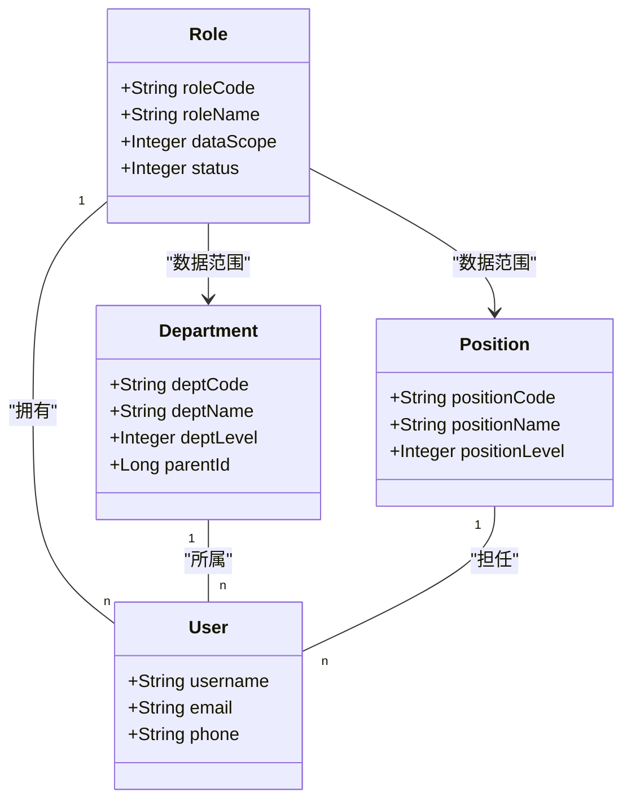
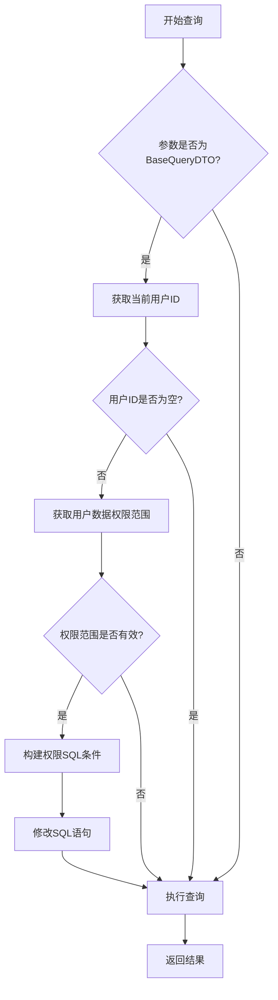
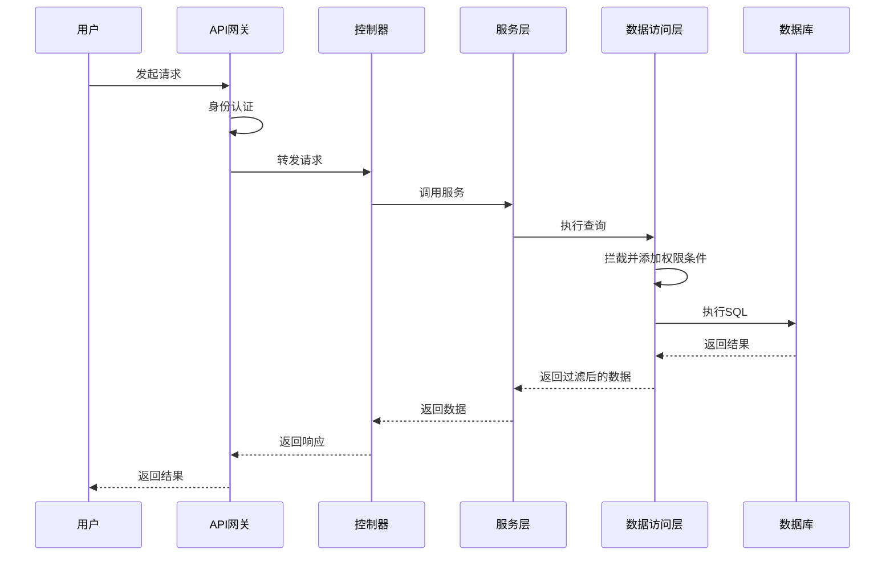

# 数据访问控制

<cite>
**本文档引用的文件**  
- [smart-permission.md](file://docs\COMMON_MODULES\smart-permission.md)
- [smart-permission.md](file://documentation\technical\smart-permission.md)
- [03-t_role.sql](file://database-scripts\common-service\03-t_role.sql)
- [smart-person.md](file://documentation\technical\smart-person.md)
- [PermissionController.java](file://restful_refactor_backup_20251202_014224\microservices_ioedream-identity-service_src_main_java_net_lab1024_sa_identity_module_rbac_controller_PermissionController.java)
- [role-data-scope\index.vue](file://smart-admin-web-javascript\src\views\system\role\components\role-data-scope\index.vue)
</cite>

## 目录
1. [引言](#引言)
2. [RBAC模型与数据权限控制机制](#rbac模型与数据权限控制机制)
3. [权限标识命名规范](#权限标识命名规范)
4. [数据权限过滤实现原理](#数据权限过滤实现原理)
5. [多租户环境下的数据隔离](#多租户环境下的数据隔离)
6. [权限校验流程示例](#权限校验流程示例)
7. [总结](#总结)

## 引言
数据访问控制是IOE-DREAM系统安全架构的核心组成部分，旨在通过基于角色的访问控制（RBAC）模型实现细粒度的数据权限管理。本系统通过角色、部门、岗位等多维度实现数据隔离，确保用户只能访问其权限范围内的数据。权限控制机制贯穿于系统的各个层级，从数据库查询到API接口调用，均实现了自动化的权限过滤。本文档将深入解析数据访问控制的实现机制，包括权限模型、命名规范、过滤原理及最佳实践。

## RBAC模型与数据权限控制机制
IOE-DREAM系统采用基于角色的访问控制（RBAC）模型，通过角色、部门、岗位等维度实现细粒度的数据权限控制。该模型的核心是将权限分配给角色，再将角色分配给用户，从而实现权限的集中管理和灵活分配。

### 角色与数据范围
系统中的角色表（t_role）定义了数据权限范围，通过`data_scope`字段实现五种级别的数据隔离：
- **1-全部**: 可访问所有数据
- **2-自定义**: 可访问自定义范围的数据
- **3-本部门**: 仅可访问本部门数据
- **4-本部门及子部门**: 可访问本部门及其子部门数据
- **5-仅本人**: 仅可访问自己的数据



**Diagram sources**
- [03-t_role.sql](file://database-scripts\common-service\03-t_role.sql)
- [smart-person.md](file://documentation\technical\smart-person.md)

**Section sources**
- [03-t_role.sql](file://database-scripts\common-service\03-t_role.sql)
- [smart-person.md](file://documentation\technical\smart-person.md)

### 五级安全级别
系统实现了5级安全级别权限控制，支持数据权限隔离、临时权限管理和权限审计等功能：
- **绝密级 (TOP_SECRET)**: 最高安全级别，仅限核心人员访问
- **机密级 (SECRET)**: 高级安全级别，仅限管理人员访问
- **秘密级 (CONFIDENTIAL)**: 中级安全级别，仅限授权人员访问
- **内部级 (INTERNAL)**: 基础安全级别，内部员工可访问
- **公开级 (PUBLIC)**: 最低安全级别，所有人员可访问

## 权限标识命名规范
权限标识的命名遵循统一的规范，确保权限的可读性和可维护性。权限编码采用分层结构，格式为`模块:功能:操作`，例如`system:role:dataScope:update`。

### 命名规则
- **模块**: 系统模块名称，如`system`、`access`、`attendance`
- **功能**: 具体功能点，如`role`、`user`、`department`
- **操作**: 操作类型，如`read`、`write`、`update`、`delete`

### 接口中的使用方式
在接口中，权限标识通过`@RequireResource`注解进行声明，指定权限编码、操作动作和描述信息。例如：
```java
@GetMapping("/user/{userId}/depts")
@RequireResource(code = "USER_DEPTS", action = "READ", description = "获取用户部门权限")
public ResponseDTO<Set<Long>> getUserDeptPermissions(@PathVariable Long userId) {
    // 接口实现
}
```

**Section sources**
- [PermissionController.java](file://restful_refactor_backup_20251202_014224\microservices_ioedream-identity-service_src_main_java_net_lab1024_sa_identity_module_rbac_controller_PermissionController.java)

## 数据权限过滤实现原理
数据权限过滤的实现原理是在DAO层自动注入数据范围条件，确保查询结果符合用户的权限范围。系统通过拦截器在查询执行前动态添加权限相关的SQL条件。

### 拦截器实现
`DataPermissionInterceptor`实现了`InnerInterceptor`接口，在`beforeQuery`方法中获取用户的数据权限范围，并构建相应的SQL条件。



**Diagram sources**
- [smart-permission.md](file://documentation\technical\smart-permission.md)

**Section sources**
- [smart-permission.md](file://documentation\technical\smart-permission.md)

### 权限SQL构建
权限SQL的构建基于用户的数据权限范围，主要包含数据范围权限和设备权限。例如，当用户有特定区域的访问权限时，系统会自动在SQL中添加`AND area_id IN (...)`条件。

## 多租户环境下的数据隔离
在多租户环境下，数据隔离通过租户ID和数据权限范围的双重控制实现。每个租户的数据在物理或逻辑上隔离，确保不同租户之间的数据互不干扰。

### 隔离策略
- **物理隔离**: 不同租户使用独立的数据库实例
- **逻辑隔离**: 同一数据库中通过租户ID字段区分数据
- **权限隔离**: 基于角色和数据范围的细粒度权限控制

### 最佳实践
1. **租户ID作为查询条件**: 所有跨租户的查询必须包含租户ID作为过滤条件
2. **权限缓存**: 使用Redis缓存用户权限信息，提高查询性能
3. **审计日志**: 记录所有权限相关的操作，便于安全审计

## 权限校验流程示例
权限校验流程从用户发起请求开始，经过网关认证、权限验证、数据过滤等多个环节，最终返回符合权限范围的数据。



**Diagram sources**
- [smart-permission.md](file://documentation\technical\smart-permission.md)

**Section sources**
- [smart-permission.md](file://documentation\technical\smart-permission.md)

## 总结
IOE-DREAM系统的数据访问控制机制通过RBAC模型实现了细粒度的数据权限管理。系统采用五级安全级别，结合角色、部门、岗位等多维度实现数据隔离。权限标识的命名规范确保了权限的可读性和可维护性，而数据权限过滤的实现原理则在DAO层自动注入数据范围条件，确保查询结果符合用户的权限范围。在多租户环境下，通过租户ID和数据权限范围的双重控制实现数据隔离。权限校验流程涵盖了从请求发起、身份认证、权限验证到数据过滤的完整过程，确保了系统的安全性。