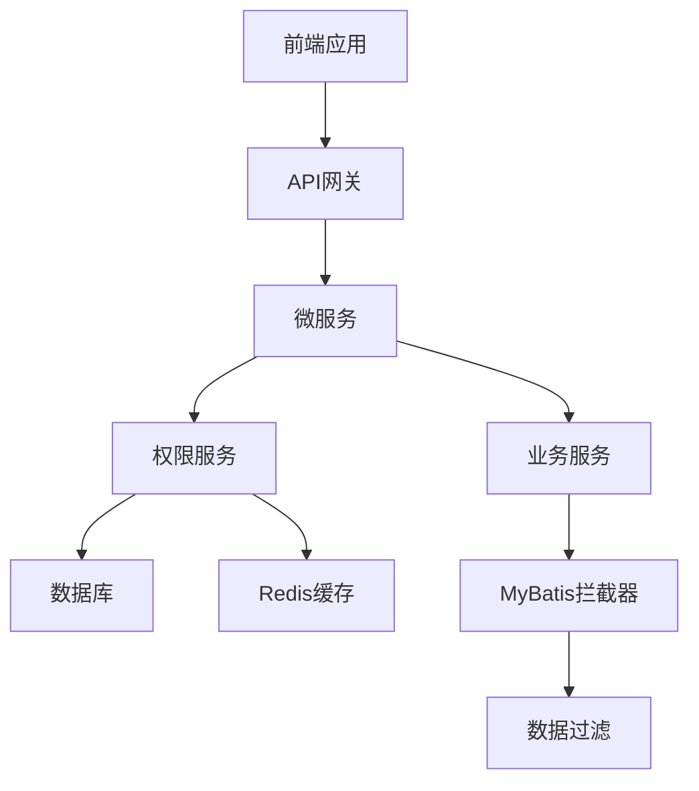

# 数据隔离策略

<cite>
**本文档引用文件**   
- [smart-permission.md](file://documentation/technical/smart-permission.md)
- [03-t_role.sql](file://database-scripts/common-service/03-t_role.sql)
- [role-setting/index.vue](file://smart-admin-web-javascript/src/views/system/role/components/role-setting/index.vue)
- [role-data-scope/index.vue](file://smart-admin-web-javascript/src/views/system/role/components/role-data-scope/index.vue)
- [EmployeeEntity.java](file://microservices/microservices-common/src/main/java/net/lab1024/sa/common/system/employee/domain/entity/EmployeeEntity.java)
- [02-安全级别详细设计.md](file://documentation/03-业务模块/各业务模块文档/智能视频/02-安全级别详细设计.md)
- [smart-business-integration.md](file://documentation/technical/smart-business-integration.md)
- [smart-person.md](file://documentation/technical/smart-person.md)
</cite>

## 目录
1. [引言](#引言)
2. [数据隔离架构设计](#数据隔离架构设计)
3. [多维度数据权限控制](#多维度数据权限控制)
4. [数据权限规则配置](#数据权限规则配置)
5. [数据过滤技术实现](#数据过滤技术实现)
6. [性能优化策略](#性能优化策略)
7. [总结](#总结)

## 引言
本系统采用多层级数据访问隔离策略，基于部门、岗位、角色等维度实现精细化的数据权限控制。在多租户场景下，通过数据分区方案确保不同租户间的数据隔离。系统通过AOP和MyBatis拦截器自动注入数据过滤条件，确保数据安全。本文档详细阐述了系统的数据隔离策略，包括权限配置方式、技术实现细节和性能优化建议。

## 数据隔离架构设计
系统采用四层架构模式，包括Controller（接口控制层）、Service（核心业务层）、Manager（流程管理层）和DAO（数据访问层）。数据权限控制主要在Service层和DAO层实现。系统使用Sa-Token进行认证授权，通过Redis和Caffeine实现多级缓存策略，提高权限验证性能。



**Diagram sources**
- [smart-permission.md](file://documentation/technical/smart-permission.md#L23-54)

## 多维度数据权限控制
系统支持基于部门、岗位、角色等多个维度的数据权限控制。用户的数据权限范围由其角色决定，角色的数据权限范围包括：全部、自定义、本部门、本部门及子部门、仅本人。

### 部门维度
部门数据权限通过部门表中的`dept_id`和`parent_id`字段实现。系统支持部门层级结构，用户可以访问本部门及子部门的数据。

```sql
CREATE TABLE t_department (
    dept_id BIGINT PRIMARY KEY AUTO_INCREMENT COMMENT '部门ID',
    dept_code VARCHAR(50) NOT NULL UNIQUE COMMENT '部门编码',
    dept_name VARCHAR(100) NOT NULL COMMENT '部门名称',
    parent_id BIGINT DEFAULT 0 COMMENT '父部门ID',
    dept_level INT DEFAULT 1 COMMENT '部门层级',
    ...
) COMMENT = '部门表';
```

### 岗位维度
岗位数据权限通过岗位表中的`position_id`和`dept_id`字段实现。用户可以访问其岗位所在部门的数据。

```sql
CREATE TABLE t_position (
    position_id BIGINT PRIMARY KEY AUTO_INCREMENT COMMENT '岗位ID',
    position_code VARCHAR(50) NOT NULL UNIQUE COMMENT '岗位编码',
    position_name VARCHAR(100) NOT NULL COMMENT '岗位名称',
    dept_id BIGINT COMMENT '所属部门ID',
    ...
) COMMENT = '岗位表';
```

### 角色维度
角色数据权限通过角色表中的`data_scope`字段实现。`data_scope`字段的取值包括：1-全部、2-自定义、3-本部门、4-本部门及子部门、5-仅本人。

```sql
CREATE TABLE t_role (
    role_id BIGINT NOT NULL AUTO_INCREMENT COMMENT '角色ID',
    role_code VARCHAR(50) NOT NULL COMMENT '角色编码',
    role_name VARCHAR(100) NOT NULL COMMENT '角色名称',
    data_scope TINYINT NOT NULL DEFAULT 5 COMMENT '数据权限范围：1-全部 2-自定义 3-本部门 4-本部门及子部门 5-仅本人',
    ...
) COMMENT='角色表';
```

**Section sources**
- [smart-person.md](file://documentation/technical/smart-person.md#L365-443)
- [03-t_role.sql](file://database-scripts/common-service/03-t_role.sql#L8-28)

## 数据权限规则配置
系统提供灵活的数据权限规则配置方式，管理员可以通过角色管理界面配置角色的数据权限范围。

### 角色数据范围配置
在角色管理界面，管理员可以为每个角色配置数据范围。配置界面包括三个标签页：角色-功能权限、角色-数据范围、角色-员工列表。

```vue
<template>
  <a-card class="role-container">
    <a-tabs v-model:activeKey="activeKey">
      <a-tab-pane key="1" tab="角色-功能权限">
        <RoleTree />
      </a-tab-pane>
      <a-tab-pane key="2" tab="角色-数据范围">
        <RoleDataScope />
      </a-tab-pane>
      <a-tab-pane key="3" tab="角色-员工列表">
        <RoleEmployeeList />
      </a-tab-pane>
    </a-tabs>
  </a-card>
</template>
```

### 数据范围类型
系统支持多种数据范围类型，包括：
- 全部：可以访问所有数据
- 自定义：可以访问指定范围的数据
- 本部门：可以访问本部门的数据
- 本部门及子部门：可以访问本部门及子部门的数据
- 仅本人：只能访问自己的数据

```javascript
// 获取系统支持的所有种类的数据范围
async function getDataScope() {
  let result = await roleApi.getDataScopeList();
  dataScopeList.value = result.data;
}
```

**Section sources**
- [role-setting/index.vue](file://smart-admin-web-javascript/src/views/system/role/components/role-setting/index.vue#L11-39)
- [role-data-scope/index.vue](file://smart-admin-web-javascript/src/views/system/role/components/role-data-scope/index.vue#L1-157)

## 数据过滤技术实现
系统通过MyBatis拦截器在查询过程中自动注入数据过滤条件，确保用户只能访问其权限范围内的数据。

### MyBatis拦截器实现
系统使用`DataPermissionInterceptor`拦截器，在执行查询前根据用户的数据权限范围构建SQL条件。

```java
@Component
public class DataPermissionInterceptor implements InnerInterceptor {

    @Resource
    private DataPermissionService dataPermissionService;

    @Override
    public void beforeQuery(Executor executor, MappedStatement ms, Object parameter,
                           RowBounds rowBounds, ResultHandler resultHandler,
                           BoundSql boundSql) throws SQLException {

        if (parameter instanceof BaseQueryDTO) {
            BaseQueryDTO queryDTO = (BaseQueryDTO) parameter;
            Long userId = SmartRequestUtil.getCurrentUserId();

            if (userId != null) {
                // 获取用户数据权限范围
                DataPermissionScope scope = dataPermissionService.getUserDataPermission(userId);

                if (scope != null && scope.hasPermission()) {
                    // 构建权限SQL条件
                    String permissionSql = buildPermissionSql(boundSql.getSql(), scope);
                    setSql(boundSql, permissionSql);
                }
            }
        }
    }

    private String buildPermissionSql(String originalSql, DataPermissionScope scope) {
        StringBuilder sqlBuilder = new StringBuilder(originalSql);

        // 数据范围权限
        if (scope.getAreaIds() != null && !scope.getAreaIds().isEmpty()) {
            sqlBuilder.append(" AND area_id IN (")
                     .append(scope.getAreaIds().stream()
                         .map(String::valueOf)
                         .collect(Collectors.joining(",")))
                     .append(")");
        }

        // 设备权限
        if (scope.getDeviceIds() != null && !scope.getDeviceIds().isEmpty()) {
            sqlBuilder.append(" AND device_id IN (")
                     .append(scope.getDeviceIds().stream()
                         .map(String::valueOf)
                         .collect(Collectors.joining(",")))
                     .append(")");
        }

        return sqlBuilder.toString();
    }
}
```

### AOP权限验证
系统使用AOP在方法执行前验证用户权限，确保用户具有执行操作的权限。

```java
@Aspect
@Component
@RequiredArgsConstructor
public class BusinessPermissionInterceptor {

    private final BusinessPermissionService businessPermissionService;

    @Around("@annotation(businessPermission)")
    public Object checkPermission(ProceedingJoinPoint joinPoint, BusinessPermission businessPermission) throws Throwable {
        try {
            // 获取当前用户ID
            Long userId = getCurrentUserId();
            if (userId == null) {
                throw new BusinessException("用户未登录");
            }

            // 检查权限
            String permissionCode = businessPermission.value();
            if (!businessPermissionService.hasPermission(userId, permissionCode)) {
                log.warn("用户{}无权限访问：{}", userId, permissionCode);
                throw new BusinessException("无权限执行此操作");
            }

            return joinPoint.proceed();

        } catch (BusinessException e) {
            throw e;
        } catch (Exception e) {
            log.error("权限检查失败", e);
            throw new BusinessException("权限验证失败");
        }
    }
}
```

**Section sources**
- [smart-permission.md](file://documentation/technical/smart-permission.md#L903-955)
- [smart-business-integration.md](file://documentation/technical/smart-business-integration.md#L501-587)

## 性能优化策略
为提高数据权限控制的性能，系统采用多种优化策略，包括索引设计和查询缓存。

### 索引设计
在相关表上创建适当的索引，提高查询性能。例如，在`data_permission`表上创建`user_id`、`role_id`、`security_level_id`等字段的索引。

```sql
CREATE TABLE t_data_permission (
    permission_id BIGINT PRIMARY KEY AUTO_INCREMENT COMMENT '权限ID',
    user_id BIGINT NOT NULL COMMENT '用户ID',
    role_id BIGINT COMMENT '角色ID',
    security_level_id BIGINT NOT NULL COMMENT '安全级别ID',
    ...
    INDEX idx_user_id (user_id),
    INDEX idx_role_id (role_id),
    INDEX idx_security_level (security_level_id),
    ...
) COMMENT = '数据权限表';
```

### 查询缓存
使用Redis缓存权限信息，减少数据库查询次数。系统使用`@Cacheable`注解缓存权限信息，使用`@CacheEvict`注解清除缓存。

```java
@Component
public class SecurityLevelManager {

    @Resource
    private RedisTemplate<String, Object> redisTemplate;

    // 缓存常量
    private static final String CACHE_PREFIX = "security:level:";
    private static final String USER_LEVEL_PREFIX = "user:security:level:";
    private static final Duration CACHE_EXPIRE = Duration.ofMinutes(30);

    @Cacheable(value = "security", key = "'all:levels'")
    public List<SecurityLevelVO> getAllSecurityLevels() {
        return securityLevelDao.selectList(new QueryWrapper<SecurityLevelEntity>()
            .eq("status", 1)
            .eq("deleted_flag", 0)
            .orderByAsc("sort_order")
        ).stream().map(entity -> {
            SecurityLevelVO vo = new SecurityLevelVO();
            BeanUtil.copyProperties(entity, vo);
            return vo;
        }).collect(Collectors.toList());
    }

    @Cacheable(value = "security", key = "#userId")
    public Integer getUserSecurityLevel(Long userId) {
        DataPermissionEntity permission = dataPermissionDao.selectOne(
            new QueryWrapper<DataPermissionEntity>()
                .eq("user_id", userId)
                .eq("status", 1)
                .eq("deleted_flag", 0)
                .apply("expire_time IS NULL OR expire_time > NOW()")
                .orderByDesc("security_level_id")
        );

        if (permission == null) {
            return null; // 无权限
        }

        SecurityLevelEntity level = securityLevelDao.selectById(permission.getSecurityLevelId());
        return level != null ? level.getLevelValue() : null;
    }

    @CacheEvict(value = "security", allEntries = true)
    public void grantUserSecurityLevel(SecurityLevelGrantDTO grantDTO) {
        // 授权逻辑
    }
}
```

**Section sources**
- [smart-permission.md](file://documentation/technical/smart-permission.md#L209-530)

## 总结
本系统通过多层级数据访问隔离策略，实现了基于部门、岗位、角色等维度的精细化数据权限控制。在多租户场景下，通过数据分区方案确保不同租户间的数据隔离。系统通过AOP和MyBatis拦截器自动注入数据过滤条件，确保数据安全。通过合理的索引设计和查询缓存策略，提高了数据权限控制的性能。未来可以进一步优化权限验证算法，提高系统的可扩展性和性能。