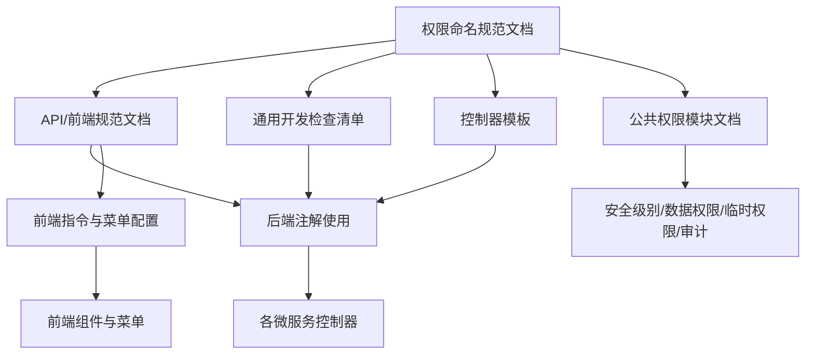
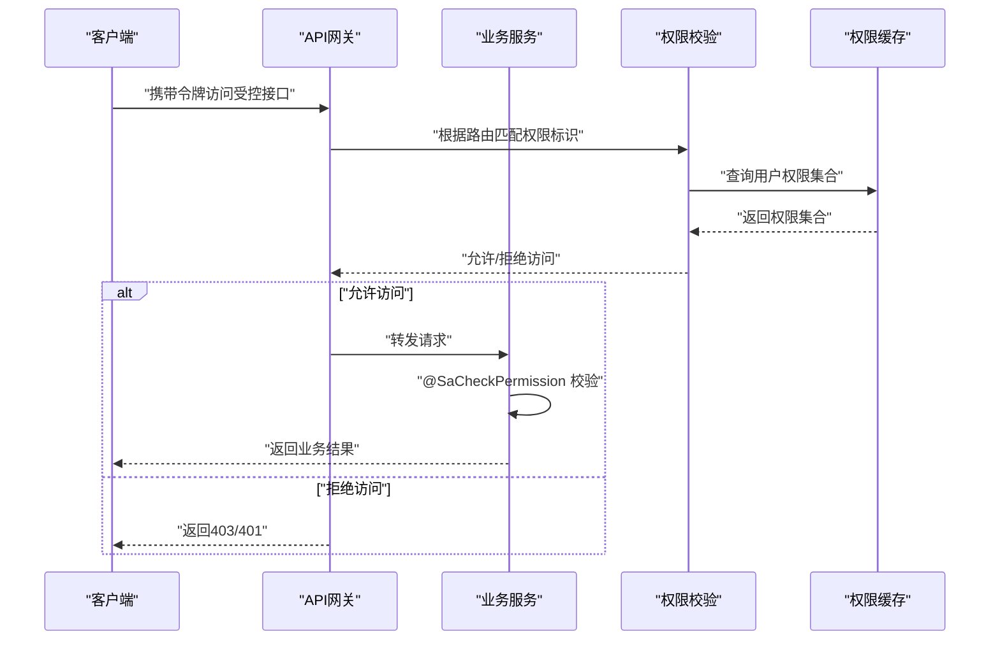
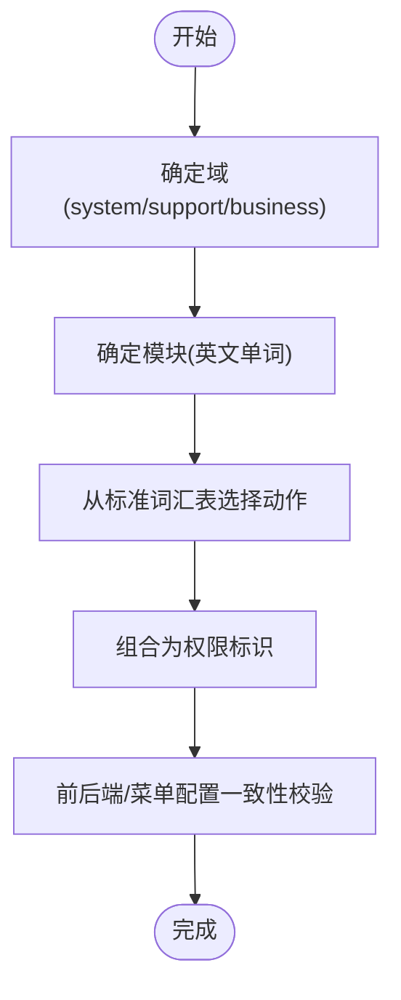
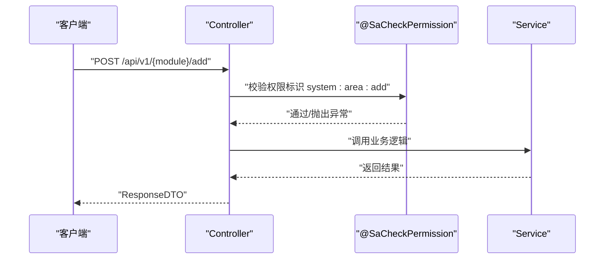
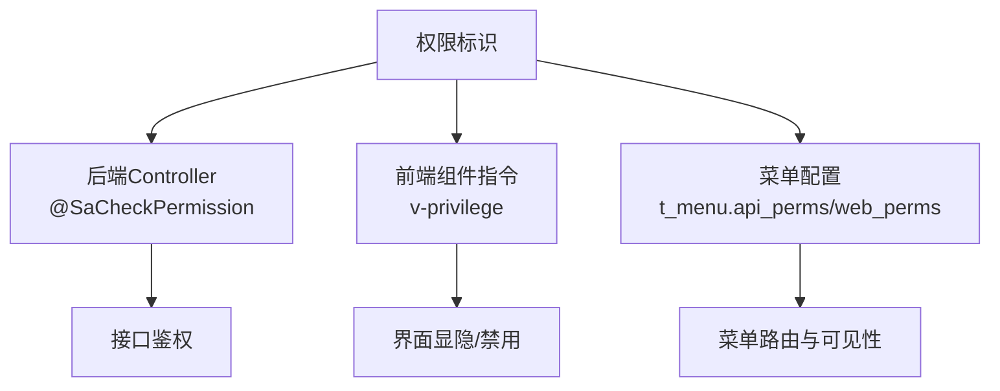
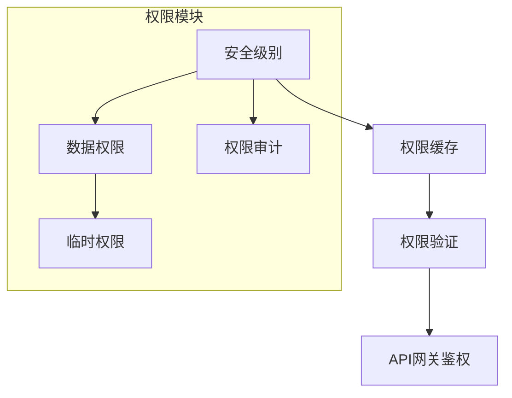
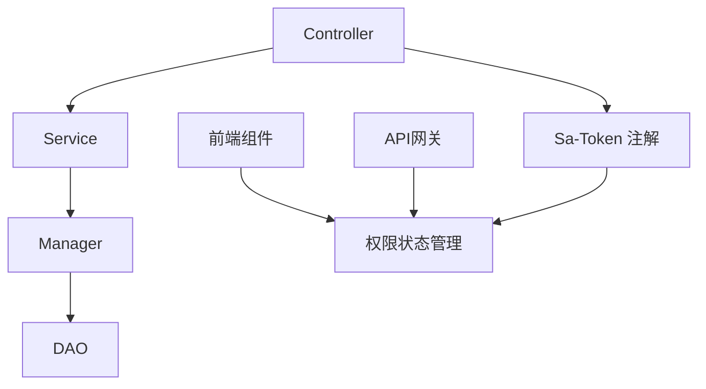

# 权限标识命名规范

<cite>
**本文引用的文件**
- [权限命名规范.md](file://documentation/01-核心规范/权限命名规范.md)
- [smart-permission.md](file://docs/COMMON_MODULES/smart-permission.md)
- [API路径规范.md](file://documentation/01-核心规范/API路径规范.md)
- [前端组件开发规范.md](file://documentation/01-核心规范/前端组件开发规范.md)
- [通用开发检查清单.md](file://docs/CHECKLISTS/通用开发检查清单.md)
- [Controller模板.md](file://documentation/06-模板工具/代码模板/Controller模板.md)
- [DEVELOPMENT_STANDARDS.md](file://openspec/changes/archive/completed-proposals/implement-access-control-missing-functions/DEVELOPMENT_STANDARDS.md)
- [AuthController.java](file://restful_refactor_backup_20251202_014224/microservices_ioedream-auth-service_src_main_java_net_lab1024_sa_auth_controller_AuthController.java)
- [RoleController.java](file://restful_refactor_backup_20251202_014224/microservices_ioedream-system-service_src_main_java_net_lab1024_sa_system_controller_RoleController.java)
- [PermissionController.java](file://restful_refactor_backup_20251202_014224/microservices_ioedream-identity-service_src_main_java_net_lab1024_sa_identity_module_rbac_controller_PermissionController.java)
- [LoginResponseVO.java](file://microservices/microservices-common/src/main/java/net/lab1024/sa/common/auth/domain/vo/LoginResponseVO.java)
- [SecurityConfig.java](file://microservices/microservices-common/src/main/java/net/lab1024/sa/common/auth/config/SecurityConfig.java)
</cite>

## 目录
1. [引言](#引言)
2. [项目结构](#项目结构)
3. [核心组件](#核心组件)
4. [架构总览](#架构总览)
5. [详细组件分析](#详细组件分析)
6. [依赖分析](#依赖分析)
7. [性能考虑](#性能考虑)
8. [故障排查指南](#故障排查指南)
9. [结论](#结论)
10. [附录](#附录)

## 引言
本规范旨在统一 SmartAdmin 项目中权限标识（Permission Code）的命名规则与使用方式，确保前后端权限校验一致、可追溯、可维护。权限标识采用“域:模块:动作”的三层结构，配合 Sa-Token 的 @SaCheckPermission 注解在接口层进行权限拦截，并在菜单配置、前端指令、API 网关侧进行一致性落地。同时，文档提供常见模块的命名示例与最佳实践，帮助开发者快速、准确地定义与使用权限标识。

## 项目结构
围绕权限标识命名规范，项目中与之相关的关键文件与位置如下：
- 核心规范文档：统一权限命名格式、Action 标准词汇、前后端一致性要求、开发检查清单与最佳实践
- 公共权限模块文档：安全级别、数据权限、临时权限、权限审计与缓存策略
- API/前端规范文档：接口注解使用、前端指令与菜单配置一致性
- 通用开发检查清单：对权限注解使用的强制性检查项
- 控制器模板：统一的权限注解使用模板
- 开发标准文档：对权限注解与资源权限注解的示例
- 后端控制器与响应模型：体现权限校验与权限列表返回的典型用法
- 安全配置：方法级安全与权限拦截的基础配置

图表来源
- [权限命名规范.md](file://documentation/01-核心规范/权限命名规范.md#L1-L357)
- [smart-permission.md](file://docs/COMMON_MODULES/smart-permission.md#L1-L200)
- [API路径规范.md](file://documentation/01-核心规范/API路径规范.md#L260-L320)
- [前端组件开发规范.md](file://documentation/01-核心规范/前端组件开发规范.md#L580-L610)
- [通用开发检查清单.md](file://docs/CHECKLISTS/通用开发检查清单.md#L80-L210)
- [Controller模板.md](file://documentation/06-模板工具/代码模板/Controller模板.md#L181-L283)

章节来源
- [权限命名规范.md](file://documentation/01-核心规范/权限命名规范.md#L1-L357)
- [smart-permission.md](file://docs/COMMON_MODULES/smart-permission.md#L1-L200)

## 核心组件
- 权限标识命名规则
  - 格式：{域}:{模块}:{动作}
  - 字母全部小写，使用冒号分隔，模块与动作使用英文单词
  - 域包括 system/support/business 等；模块为业务领域下的功能模块；动作来自标准词汇表
- Sa-Token 注解
  - @SaCheckLogin：登录校验
  - @SaCheckPermission：权限校验，参数为权限标识字符串
- 前后端一致性
  - 后端：Controller 方法上使用 @SaCheckPermission
  - 前端：组件指令 v-privilege 使用相同权限标识
  - 菜单配置：t_menu 表 api_perms/web_perms 字段与权限标识一致
- API 网关鉴权
  - 在网关层基于权限标识进行路由与鉴权控制，确保跨服务一致的权限策略

章节来源
- [权限命名规范.md](file://documentation/01-核心规范/权限命名规范.md#L10-L30)
- [权限命名规范.md](file://documentation/01-核心规范/权限命名规范.md#L191-L243)
- [API路径规范.md](file://documentation/01-核心规范/API路径规范.md#L260-L320)
- [前端组件开发规范.md](file://documentation/01-核心规范/前端组件开发规范.md#L580-L610)

## 架构总览
权限标识贯穿以下环节：
- 设计阶段：定义域/模块/动作，生成权限标识
- 开发阶段：后端接口使用 @SaCheckPermission 校验
- 前端阶段：组件指令与菜单配置使用相同权限标识
- 运维阶段：API 网关基于权限标识进行路由与鉴权
- 审计阶段：权限审计日志记录权限变更与访问

图表来源
- [AuthController.java](file://restful_refactor_backup_20251202_014224/microservices_ioedream-auth-service_src_main_java_net_lab1024_sa_auth_controller_AuthController.java#L186-L209)
- [RoleController.java](file://restful_refactor_backup_20251202_014224/microservices_ioedream-system-service_src_main_java_net_lab1024_sa_system_controller_RoleController.java#L125-L141)
- [PermissionController.java](file://restful_refactor_backup_20251202_014224/microservices_ioedream-identity-service_src_main_java_net_lab1024_sa_identity_module_rbac_controller_PermissionController.java#L42-L54)
- [LoginResponseVO.java](file://microservices/microservices-common/src/main/java/net/lab1024/sa/common/auth/domain/vo/LoginResponseVO.java#L40-L58)
- [SecurityConfig.java](file://microservices/microservices-common/src/main/java/net/lab1024/sa/common/auth/config/SecurityConfig.java#L32-L42)

## 详细组件分析

### 组件A：权限标识命名与标准词汇
- 命名格式与约束
  - {域}:{模块}:{动作}
  - 全小写、冒号分隔、英文单词
- Action 标准词汇
  - 查询类：query/list/detail/tree/page
  - 写入类：add/create/save/insert
  - 更新类：update/edit/modify
  - 删除类：delete/batchDelete/remove
  - 其他：export/import/upload/download/enable/disable/audit/approve
- 常见模块示例
  - system:menu:add、system:employee:query、system:area:delete
  - support:dict:upload、support:file:delete
  - business:goods:query、business:order:export

图表来源
- [权限命名规范.md](file://documentation/01-核心规范/权限命名规范.md#L95-L136)
- [权限命名规范.md](file://documentation/01-核心规范/权限命名规范.md#L139-L188)

章节来源
- [权限命名规范.md](file://documentation/01-核心规范/权限命名规范.md#L95-L188)

### 组件B：后端接口注解与权限校验
- @SaCheckLogin：强制登录
- @SaCheckPermission：基于权限标识进行校验
- 典型用法
  - 控制器方法上直接标注 @SaCheckPermission
  - 结合 Swagger 注解完善接口文档
  - 在模板中统一使用 {module}:add/{module}:update/{module}:delete/{module}:query

图表来源
- [Controller模板.md](file://documentation/06-模板工具/代码模板/Controller模板.md#L229-L277)
- [RoleController.java](file://restful_refactor_backup_20251202_014224/microservices_ioedream-system-service_src_main_java_net_lab1024_sa_system_controller_RoleController.java#L125-L141)

章节来源
- [Controller模板.md](file://documentation/06-模板工具/代码模板/Controller模板.md#L181-L283)
- [RoleController.java](file://restful_refactor_backup_20251202_014224/microservices_ioedream-system-service_src_main_java_net_lab1024_sa_system_controller_RoleController.java#L125-L141)

### 组件C：前端指令与菜单配置
- 前端指令
  - v-privilege 使用权限标识，支持 hide/disable 等修饰符
- 菜单配置
  - t_menu 表 api_perms/web_perms 字段与权限标识一致
- 一致性要求
  - 后端 @SaCheckPermission 与前端 v-privilege、菜单配置三者保持一致

图表来源
- [权限命名规范.md](file://documentation/01-核心规范/权限命名规范.md#L191-L243)
- [前端组件开发规范.md](file://documentation/01-核心规范/前端组件开发规范.md#L580-L610)

章节来源
- [权限命名规范.md](file://documentation/01-核心规范/权限命名规范.md#L191-L243)
- [前端组件开发规范.md](file://documentation/01-核心规范/前端组件开发规范.md#L580-L610)

### 组件D：API 网关鉴权与权限审计
- API 网关
  - 基于权限标识进行路由与鉴权控制，确保跨服务一致
- 权限审计
  - 记录权限变更与访问日志，便于追踪与合规审计
- 公共权限模块
  - 安全级别、数据权限、临时权限、权限缓存与验证流程

图表来源
- [smart-permission.md](file://docs/COMMON_MODULES/smart-permission.md#L1-L200)
- [smart-permission.md](file://docs/COMMON_MODULES/smart-permission.md#L230-L367)

章节来源
- [smart-permission.md](file://docs/COMMON_MODULES/smart-permission.md#L1-L200)
- [smart-permission.md](file://docs/COMMON_MODULES/smart-permission.md#L230-L367)

### 组件E：权限校验的实际应用代码片段路径
- 后端注解使用示例
  - [AuthController.java](file://restful_refactor_backup_20251202_014224/microservices_ioedream-auth-service_src_main_java_net_lab1024_sa_auth_controller_AuthController.java#L186-L209)
  - [RoleController.java](file://restful_refactor_backup_20251202_014224/microservices_ioedream-system-service_src_main_java_net_lab1024_sa_system_controller_RoleController.java#L125-L141)
  - [PermissionController.java](file://restful_refactor_backup_20251202_014224/microservices_ioedream-identity-service_src_main_java_net_lab1024_sa_identity_module_rbac_controller_PermissionController.java#L42-L54)
- 前端指令与菜单配置
  - [前端组件开发规范.md](file://documentation/01-核心规范/前端组件开发规范.md#L580-L610)
- 权限校验与权限列表返回
  - [LoginResponseVO.java](file://microservices/microservices-common/src/main/java/net/lab1024/sa/common/auth/domain/vo/LoginResponseVO.java#L40-L58)
- 开发标准与注解示例
  - [DEVELOPMENT_STANDARDS.md](file://openspec/changes/archive/completed-proposals/implement-access-control-missing-functions/DEVELOPMENT_STANDARDS.md#L364-L392)

章节来源
- [AuthController.java](file://restful_refactor_backup_20251202_014224/microservices_ioedream-auth-service_src_main_java_net_lab1024_sa_auth_controller_AuthController.java#L186-L209)
- [RoleController.java](file://restful_refactor_backup_20251202_014224/microservices_ioedream-system-service_src_main_java_net/lab1024/sa/system/controller/RoleController.java#L125-L141)
- [PermissionController.java](file://restful_refactor_backup_20251202_014224/microservices_ioedream-identity-service_src_main_java_net_lab1024_sa_identity_module_rbac_controller_PermissionController.java#L42-L54)
- [前端组件开发规范.md](file://documentation/01-核心规范/前端组件开发规范.md#L580-L610)
- [LoginResponseVO.java](file://microservices/microservices-common/src/main/java/net/lab1024/sa/common/auth/domain/vo/LoginResponseVO.java#L40-L58)
- [DEVELOPMENT_STANDARDS.md](file://openspec/changes/archive/completed-proposals/implement-access-control-missing-functions/DEVELOPMENT_STANDARDS.md#L364-L392)

## 依赖分析
- 组件耦合
  - 后端：Controller 依赖 Service，Service 依赖 Manager/DAO，权限校验位于 Controller 层
  - 前端：组件依赖权限状态管理与指令，菜单依赖权限标识
  - 网关：依赖权限标识进行路由与鉴权
- 外部依赖
  - Sa-Token：提供 @SaCheckLogin/@SaCheckPermission 注解与会话管理
  - Spring Security：方法级安全与过滤器链配置
  - 数据库：t_menu、权限审计表等

图表来源
- [通用开发检查清单.md](file://docs/CHECKLISTS/通用开发检查清单.md#L80-L210)
- [SecurityConfig.java](file://microservices/microservices-common/src/main/java/net/lab1024/sa/common/auth/config/SecurityConfig.java#L32-L42)

章节来源
- [通用开发检查清单.md](file://docs/CHECKLISTS/通用开发检查清单.md#L80-L210)
- [SecurityConfig.java](file://microservices/microservices-common/src/main/java/net/lab1024/sa/common/auth/config/SecurityConfig.java#L32-L42)

## 性能考虑
- 权限缓存
  - 使用多级缓存（本地/分布式）降低权限查询开销
  - 对权限结果与配置进行缓存，结合失效策略与事件清除
- 批量与并行
  - 在批量权限校验场景中，采用分组、去重与并行处理以提升吞吐
- 低开销校验
  - 优先使用轻量级校验与缓存命中，避免重复查询数据库

章节来源
- [smart-permission.md](file://docs/COMMON_MODULES/smart-permission.md#L369-L587)

## 故障排查指南
- 常见错误
  - 缺少域前缀、使用中文或拼音、Action 不规范、前后端不一致
- 检查清单
  - 权限格式是否符合 {域}:{模块}:{动作}
  - 域/模块/动作是否正确且小写
  - 后端注解与前端指令、菜单配置是否一致
  - 是否使用冒号分隔，不使用下划线或连字符
- 审计与日志
  - 通过权限审计日志定位失败原因与调用轨迹

章节来源
- [权限命名规范.md](file://documentation/01-核心规范/权限命名规范.md#L246-L303)
- [smart-permission.md](file://docs/COMMON_MODULES/smart-permission.md#L200-L280)

## 结论
通过统一的权限标识命名规范与 Sa-Token 注解在接口层的严格执行，结合前端指令与菜单配置的一致性，以及 API 网关的鉴权控制，能够有效提升系统的安全性、可维护性与一致性。建议在新功能开发与权限重构中，严格遵循本规范，并将权限校验纳入通用开发检查清单，确保每一条权限标识的正确性与可追溯性。

## 附录
- 常见模块命名示例
  - system:menu:add、system:employee:query、system:area:delete
  - support:dict:upload、support:file:delete
  - business:goods:query、business:order:export
- 开发检查清单要点
  - 是否使用 @SaCheckLogin 验证登录
  - 是否使用 @SaCheckPermission 进行权限控制
  - 权限编码是否规范（module:action 格式）
  - 角色权限控制是否正确
  - 数据权限隔离是否严格
  - 登录安全机制是否完善
  - 会话管理是否安全
  - 密码加密是否符合规范
  - 权限审计日志是否记录

章节来源
- [权限命名规范.md](file://documentation/01-核心规范/权限命名规范.md#L95-L136)
- [通用开发检查清单.md](file://docs/CHECKLISTS/通用开发检查清单.md#L80-L210)