# 认证与授权

<cite>
**本文档引用文件**   
- [AuthService.java](file://microservices\microservices-common\src\main\java\net\lab1024\sa\common\auth\service\AuthService.java)
- [AuthServiceImpl.java](file://microservices\microservices-common\src\main\java\net\lab1024\sa\common\auth\service\impl\AuthServiceImpl.java)
- [AuthManager.java](file://microservices\microservices-common\src\main\java\net\lab1024\sa\common\auth\manager\AuthManager.java)
- [JwtTokenUtil.java](file://microservices\microservices-common\src\main\java\net\lab1024\sa\common\auth\util\JwtTokenUtil.java)
- [SecurityConfig.java](file://microservices\microservices-common\src\main\java\net\lab1024\sa\common\auth\config\SecurityConfig.java)
- [UserSessionEntity.java](file://microservices\microservices-common\src\main\java\net\lab1024\sa\common\auth\domain\entity\UserSessionEntity.java)
- [LoginResponseVO.java](file://microservices\microservices-common\src\main\java\net\lab1024\sa\common\auth\domain\vo\LoginResponseVO.java)
- [t_user_session_table.sql](file://database-scripts\common-service\t_user_session_table.sql)
- [smart-permission.md](file://documentation\technical\smart-permission.md)
- [security_hardening_guide.md](file://security\security_hardening_guide.md)
</cite>

## 目录
1. [简介](#简介)
2. [登录流程与Token生成](#登录流程与token生成)
3. [会话管理机制](#会话管理机制)
4. [权限校验实现原理](#权限校验实现原理)
5. [前后端交互方式](#前后端交互方式)
6. [自定义拦截器与权限注解](#自定义拦截器与权限注解)
7. [多端登录与单点登录](#多端登录与单点登录)
8. [临时授权实现](#临时授权实现)
9. [常见问题解决方案](#常见问题解决方案)
10. [性能优化建议](#性能优化建议)

## 简介
本文档详细阐述了基于Sa-Token的认证与授权机制，涵盖了从用户登录到权限校验的完整流程。系统采用JWT（JSON Web Token）作为主要的认证技术，结合Redis和数据库实现企业级的安全特性，包括防暴力破解、令牌轮换、会话管理和多级权限控制。

系统架构遵循分层设计原则，包含Controller、Service、Manager和DAO层，确保了代码的可维护性和扩展性。认证服务被封装在`microservices-common`模块中，实现了微服务间的共享和复用。

**Section sources**
- [AuthService.java](file://microservices\microservices-common\src\main\java\net\lab1024\sa\common\auth\service\AuthService.java#L1-L81)
- [AuthServiceImpl.java](file://microservices\microservices-common\src\main\java\net\lab1024\sa\common\auth\service\impl\AuthServiceImpl.java#L1-L397)

## 登录流程与Token生成
### 登录流程
用户登录流程是一个多步骤的复杂业务过程，由`AuthServiceImpl`和`AuthManager`协同完成。

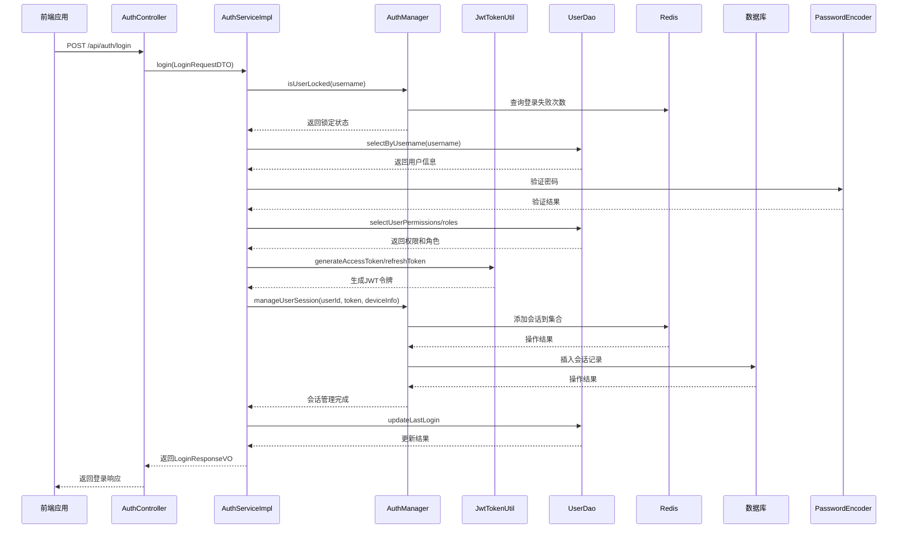

**Diagram sources**
- [AuthServiceImpl.java](file://microservices\microservices-common\src\main\java\net\lab1024\sa\common\auth\service\impl\AuthServiceImpl.java#L81-L157)
- [AuthManager.java](file://microservices\microservices-common\src\main\java\net\lab1024\sa\common\auth\manager\AuthManager.java#L98-L142)

### Token生成与验证机制
系统使用JWT作为认证令牌，通过`JwtTokenUtil`类进行生成和验证。

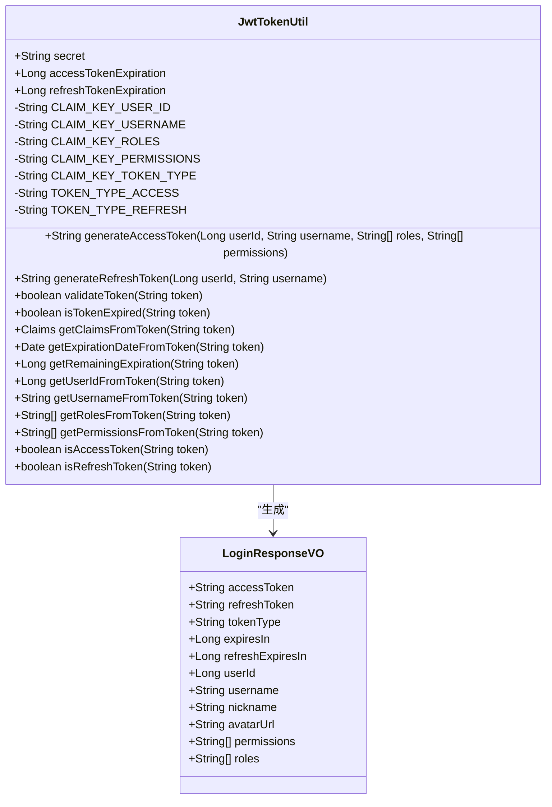

**Diagram sources**
- [JwtTokenUtil.java](file://microservices\microservices-common\src\main\java\net\lab1024\sa\common\auth\util\JwtTokenUtil.java#L1-L252)
- [LoginResponseVO.java](file://microservices\microservices-common\src\main\java\net\lab1024\sa\common\auth\domain\vo\LoginResponseVO.java#L1-L58)

**Section sources**
- [JwtTokenUtil.java](file://microservices\microservices-common\src\main\java\net\lab1024\sa\common\auth\util\JwtTokenUtil.java#L1-L252)
- [LoginResponseVO.java](file://microservices\microservices-common\src\main\java\net\lab1024\sa\common\auth\domain\vo\LoginResponseVO.java#L1-L58)

## 会话管理机制
### 会话实体与数据库设计
系统通过`UserSessionEntity`实体和`t_user_session`表来持久化用户会话信息，确保会话的可靠性和可审计性。

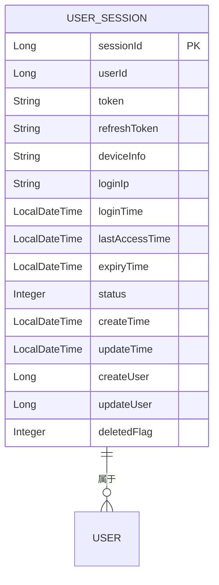

**Diagram sources**
- [UserSessionEntity.java](file://microservices\microservices-common\src\main\java\net\lab1024\sa\common\auth\domain\entity\UserSessionEntity.java#L1-L109)
- [t_user_session_table.sql](file://database-scripts\common-service\t_user_session_table.sql#L1-L37)

### 会话管理流程
会话管理由`AuthManager`负责，采用多级缓存策略（Redis + 数据库）以提高性能和可靠性。

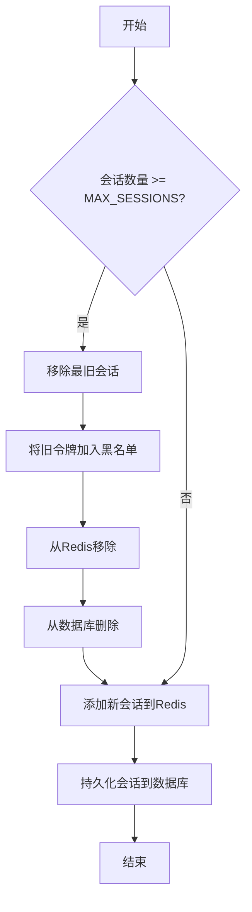

**Diagram sources**
- [AuthManager.java](file://microservices\microservices-common\src\main\java\net\lab1024\sa\common\auth\manager\AuthManager.java#L98-L142)

**Section sources**
- [UserSessionEntity.java](file://microservices\microservices-common\src\main\java\net\lab1024\sa\common\auth\domain\entity\UserSessionEntity.java#L1-L109)
- [AuthManager.java](file://microservices\microservices-common\src\main\java\net\lab1024\sa\common\auth\manager\AuthManager.java#L98-L142)

## 权限校验实现原理
### 权限校验流程
权限校验是系统安全的核心，通过`AuthService`的`hasPermission`和`hasRole`方法实现。

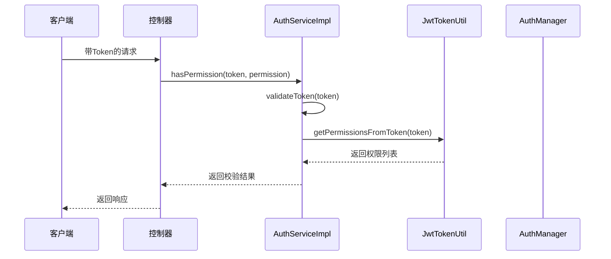

**Diagram sources**
- [AuthServiceImpl.java](file://microservices\microservices-common\src\main\java\net\lab1024\sa\common\auth\service\impl\AuthServiceImpl.java#L358-L371)

### 5级安全级别权限控制
系统实现了基于5级安全级别的精细化权限控制，支持数据权限隔离和临时权限管理。

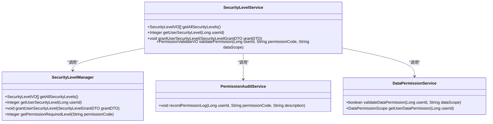

**Diagram sources**
- [smart-permission.md](file://documentation\technical\smart-permission.md#L353-L430)

**Section sources**
- [smart-permission.md](file://documentation\technical\smart-permission.md#L353-L430)

## 前后端交互方式
### Token传递与刷新策略
前后端通过HTTP Header传递Token，采用双Token机制（访问令牌和刷新令牌）确保安全性和用户体验。

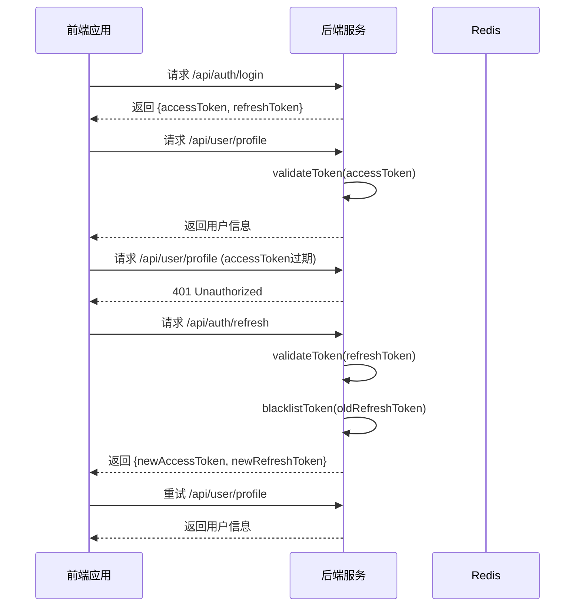

**Diagram sources**
- [AuthServiceImpl.java](file://microservices\microservices-common\src\main\java\net\lab1024\sa\common\auth\service\impl\AuthServiceImpl.java#L176-L232)

### Token失效策略
系统实现了多层次的Token失效策略，包括黑名单机制、会话管理和自动过期。

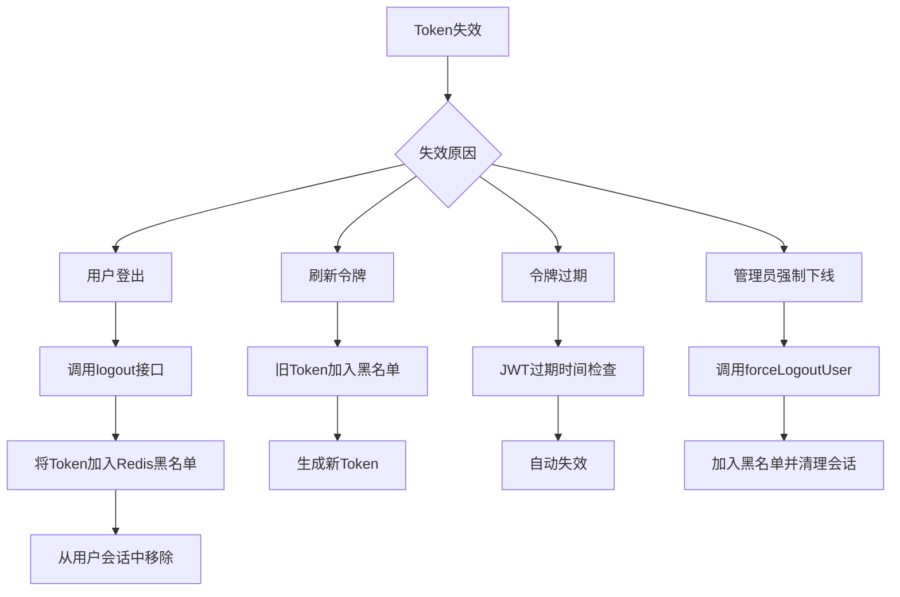

**Diagram sources**
- [AuthServiceImpl.java](file://microservices\microservices-common\src\main\java\net\lab1024\sa\common\auth\service\impl\AuthServiceImpl.java#L250-L268)
- [AuthManager.java](file://microservices\microservices-common\src\main\java\net\lab1024\sa\common\auth\manager\AuthManager.java#L416-L438)

**Section sources**
- [AuthServiceImpl.java](file://microservices\microservices-common\src\main\java\net\lab1024\sa\common\auth\service\impl\AuthServiceImpl.java#L250-L268)
- [AuthManager.java](file://microservices\microservices-common\src\main\java\net\lab1024\sa\common\auth\manager\AuthManager.java#L416-L438)

## 自定义拦截器与权限注解
### 自定义拦截器实现
系统通过自定义拦截器实现数据权限控制，确保用户只能访问其权限范围内的数据。

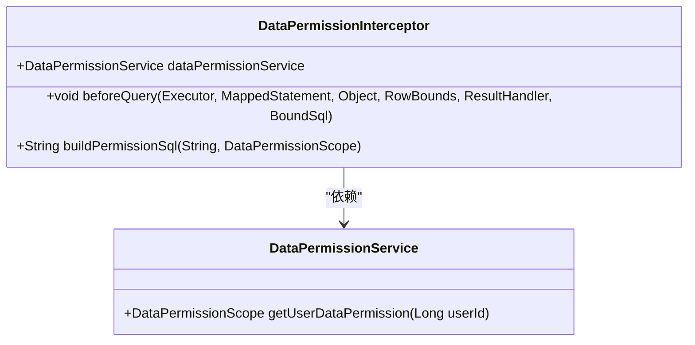

**Diagram sources**
- [smart-permission.md](file://documentation\technical\smart-permission.md#L902-L953)

### 权限注解使用方法
系统提供了丰富的权限注解，如`@SaCheckLogin`、`@SaCheckPermission`等，简化了权限控制的实现。

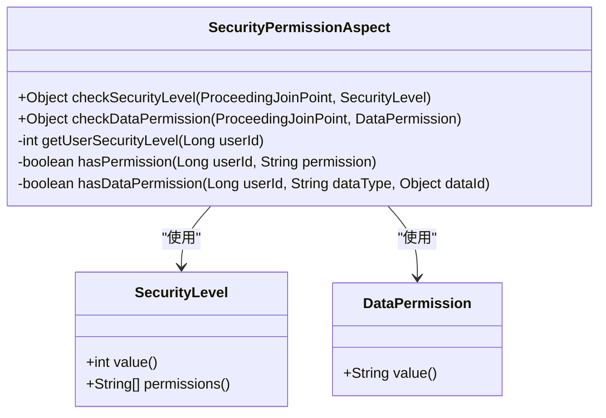

**Diagram sources**
- [smart-permission.md](file://documentation\03-业务模块\智能视频\02-安全级别详细设计.md#L622-L701)

**Section sources**
- [smart-permission.md](file://documentation\technical\smart-permission.md#L902-L953)
- [smart-permission.md](file://documentation\03-业务模块\智能视频\02-安全级别详细设计.md#L622-L701)

## 多端登录与单点登录
### 多端登录控制
系统通过`AuthManager`的并发登录控制功能，限制每个用户最多3个并发会话。

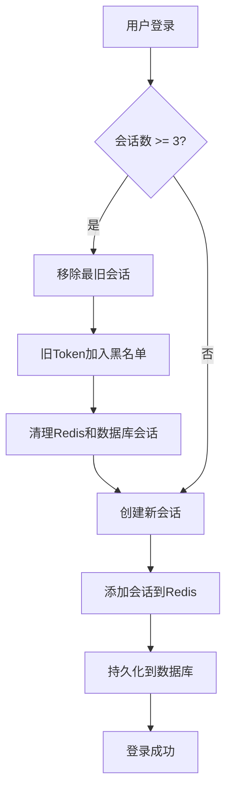

**Diagram sources**
- [AuthManager.java](file://microservices\microservices-common\src\main\java\net\lab1024\sa\common\auth\manager\AuthManager.java#L104-L123)

### 单点登录（SSO）实现
虽然当前系统主要基于JWT实现无状态认证，但可以通过中心化的会话管理和Token黑名单机制来实现类似SSO的功能。

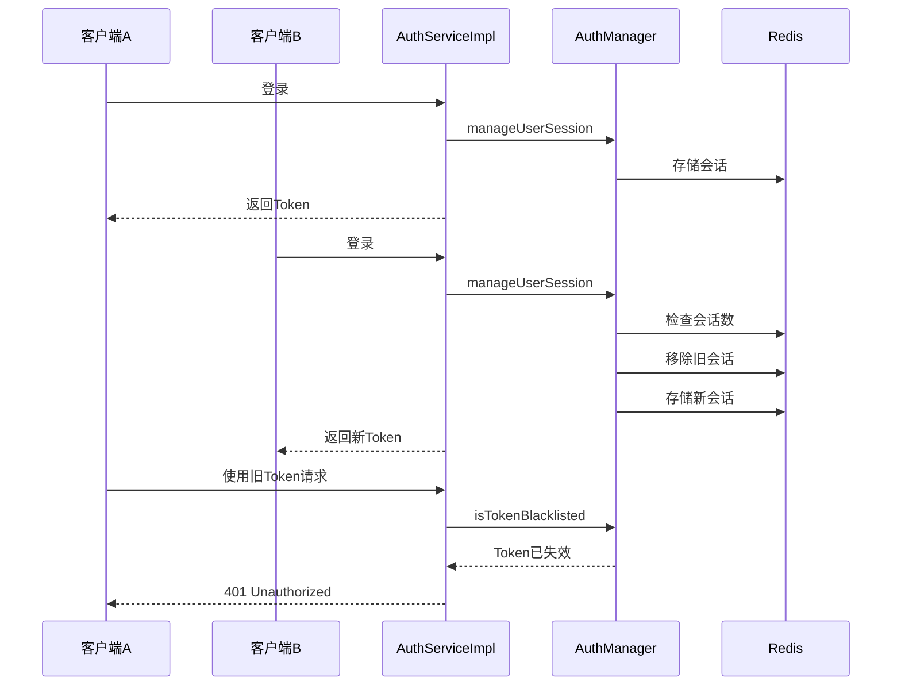

**Diagram sources**
- [AuthManager.java](file://microservices\microservices-common\src\main\java\net\lab1024\sa\common\auth\manager\AuthManager.java#L98-L142)

**Section sources**
- [AuthManager.java](file://microservices\microservices-common\src\main\java\net\lab1024\sa\common\auth\manager\AuthManager.java#L98-L142)

## 临时授权实现
### 临时权限申请流程
系统支持临时权限的申请和审批，满足特殊场景下的权限需求。

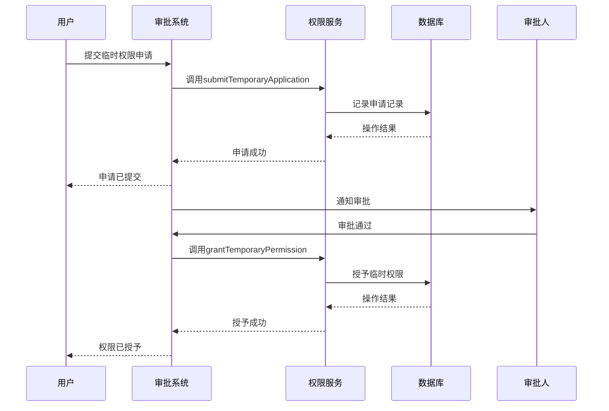

**Section sources**
- [AccessApprovalController.java](file://restful_refactor_backup_20251202_014224\microservices_ioedream-access-service_src_main_java_net_lab1024_sa_access_approval_controller_AccessApprovalController.java#L58-L66)

## 常见问题解决方案
### Token过期处理
前端应实现Token自动刷新机制，在收到401响应后自动使用刷新令牌获取新的访问令牌。

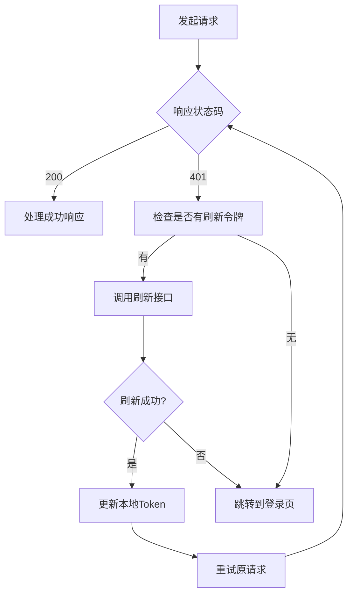

### 并发请求认证失败
为避免并发请求因Token刷新导致的认证失败，应使用请求队列或锁机制确保Token刷新的原子性。

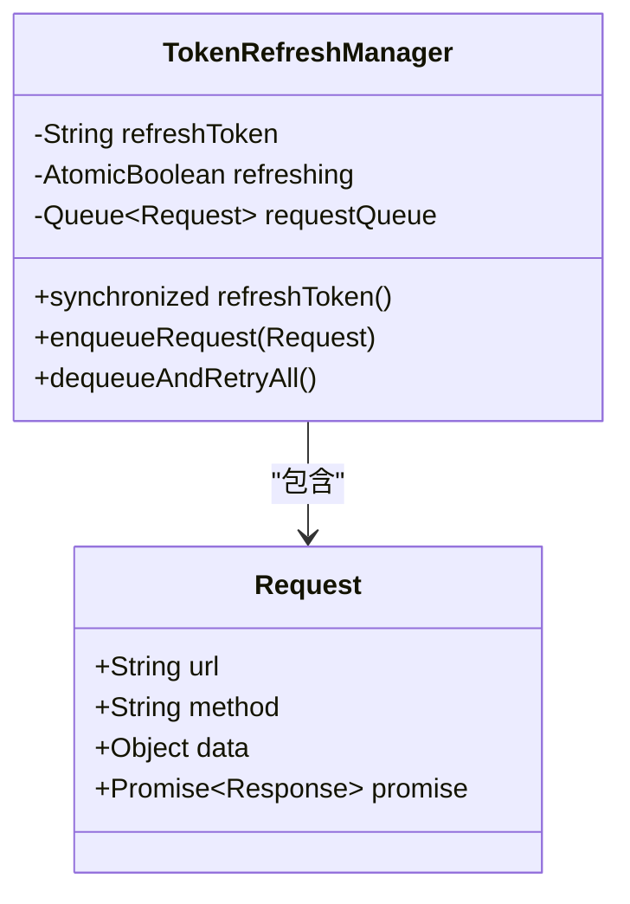

**Section sources**
- [AuthServiceImpl.java](file://microservices\microservices-common\src\main\java\net\lab1024\sa\common\auth\service\impl\AuthServiceImpl.java#L176-L232)

## 性能优化建议
### 缓存策略
采用多级缓存策略，结合Redis和本地缓存，减少数据库访问。

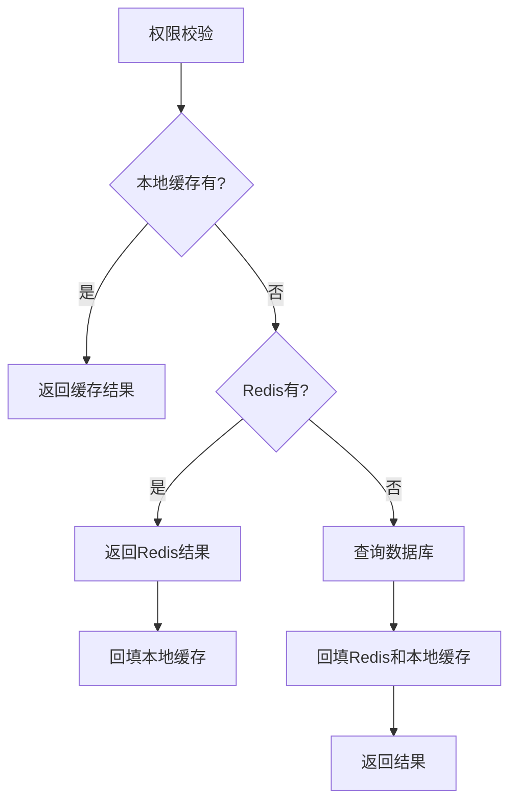

### 数据库优化
对`t_user_session`表建立适当的索引，如`user_id`、`token`和`status`字段的组合索引，以提高查询性能。

```sql
CREATE INDEX idx_user_token_status ON t_user_session (user_id, token, status);
```

**Section sources**
- [UserSessionEntity.java](file://microservices\microservices-common\src\main\java\net\lab1024\sa\common\auth\domain\entity\UserSessionEntity.java#L31-L108)
- [t_user_session_table.sql](file://database-scripts\common-service\t_user_session_table.sql#L1-L37)