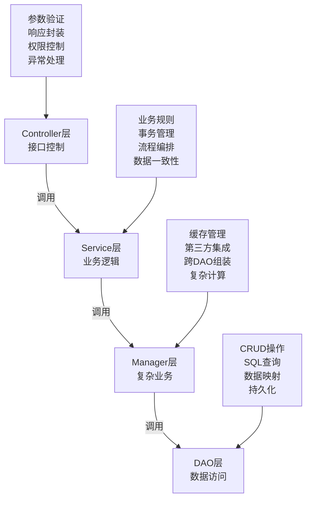

# 代码规范

<cite>
**本文档引用文件**  
- [DEV_STANDARDS.md](file://docs/DEV_STANDARDS.md)
- [Vue3_Composition_API最佳实践.md](file://documentation/01-核心规范/Vue3_Composition_API最佳实践.md)
- [.eslintrc.cjs](file://smart-admin-web-javascript/.eslintrc.cjs)
- [.stylelintrc.js](file://smart-admin-web-javascript/.stylelintrc.js)
- [.prettierrc.cjs](file://smart-admin-web-javascript/.prettierrc.cjs)
- [pom.xml](file://microservices/pom.xml)
- [GIT_COMMIT_AND_MERGE_GUIDE.md](file://documentation/technical/GIT_COMMIT_AND_MERGE_GUIDE.md)
- [前端组件开发规范.md](file://documentation/01-核心规范/前端组件开发规范.md)
</cite>

## 目录
1. [后端Java编码规范](#后端java编码规范)
2. [前端Vue3开发规范](#前端vue3开发规范)
3. [Git提交信息规范](#git提交信息规范)
4. [静态检查工具配置](#静态检查工具配置)

## 后端Java编码规范

### 命名约定
```markdown
✅ 类命名：
- Controller类：{模块}Controller（如UserController）
- Service类：{模块}Service（如UserService）
- Manager类：{模块}Manager（如UserManager）
- DAO类：{模块}Dao（如UserDao）
- 实体类：{模块}Entity（如UserEntity）
- DTO类：{模块}DTO（如UserDTO）
- VO类：{模块}VO（如UserVO）
- 表单类：{模块}Form（如UserForm）

✅ 方法命名：
- 查询方法：get{Entity}、list{Entity}、page{Entity}
- 新增方法：add{Entity}、create{Entity}
- 更新方法：update{Entity}、modify{Entity}
- 删除方法：delete{Entity}、remove{Entity}
- 状态更新：update{Entity}Status
- 验证方法：validate{Entity}

✅ 变量命名：
- 驼峰命名法：userId、userName、createTime
- 常量命名：全大写加下划线：MAX_RETRY_COUNT
- 布尔变量：is、has、can开头：isActive、hasPermission
```

### 代码格式
```markdown
✅ 缩进：使用4个空格，不使用Tab
✅ 行宽：每行不超过150个字符
✅ 大括号：K&R风格，左大括号不换行
✅ 空行：方法间空一行，逻辑块间适当空行
✅ 导入：按顺序导入，避免使用*
```

### 注释要求
```markdown
✅ 类注释：
/**
 * 用户服务类
 *
 * @Author: zhangsan
 * @Date: 2025-01-10
 * @Description: 处理用户相关的业务逻辑
 */

✅ 方法注释：
/**
 * 根据ID获取用户详情
 *
 * @param userId 用户ID
 * @return 用户VO对象
 * @throws UserNotFoundException 用户不存在异常
 */

✅ 行内注释：
// 检查用户状态是否正常
if (user.getStatus() == 1) {
    // 处理正常状态用户
    processActiveUser(user);
}
```

### 异常处理
```markdown
✅ 异常处理原则：
- 不要捕获Exception，要捕获具体异常
- 不要忽略异常，必须处理或向上抛出
- 自定义业务异常继承RuntimeException
- 记录异常日志，包含上下文信息
- 统一异常处理使用@ControllerAdvice

✅ 自定义异常：
public class BusinessException extends RuntimeException {
    private Integer code;
    
    public BusinessException(String message) {
        super(message);
    }
    
    public BusinessException(Integer code, String message) {
        super(message);
        this.code = code;
    }
}

✅ 统一异常处理：
@RestControllerAdvice
public class GlobalExceptionHandler {
    
    @ExceptionHandler(BusinessException.class)
    public ResponseDTO<String> handleBusinessException(BusinessException e) {
        log.error("业务异常: ", e);
        return ResponseDTO.error(e.getCode(), e.getMessage());
    }
    
    @ExceptionHandler(Exception.class)
    public ResponseDTO<String> handleException(Exception e) {
        log.error("系统异常: ", e);
        return ResponseDTO.error("系统内部错误");
    }
}
```

### 日志规范
```markdown
✅ 日志级别：
- DEBUG：调试信息，开发环境使用
- INFO：重要业务操作，如用户登录、订单创建
- WARN：潜在问题，如重试、降级
- ERROR：错误信息，必须记录异常堆栈

✅ 日志格式：
log.info("新增用户, param: {}", addUserForm);
log.warn("用户登录失败次数过多, userId: {}, count: {}", userId, failCount);
log.error("数据库连接失败", e);

✅ 日志内容：
- 包含操作类型和关键参数
- 包含用户ID、请求ID等上下文信息
- 避免记录敏感信息（密码、身份证号）
```

### 四层架构调用规则


**图示来源**
- [DEV_STANDARDS.md](file://docs/DEV_STANDARDS.md#L146-L156)

**本节来源**
- [DEV_STANDARDS.md](file://docs/DEV_STANDARDS.md#L158-L222)

## 前端Vue3开发规范

### Vue3 Composition API使用规范
```markdown
✅ setup语法：
<script setup lang="ts">
import { ref, reactive, computed, onMounted } from 'vue'

// 响应式数据
const count = ref(0)
const user = reactive({ name: '', age: 0 })

// 计算属性
const doubleCount = computed(() => count.value * 2)

// 生命周期
onMounted(() => {
    loadData()
})

// 方法
const increment = () => {
    count.value++
}
</script>

✅ 类型定义：
// types/user.ts
export interface User {
    id: number
    name: string
    email: string
    status: number
}

export interface UserQueryParams {
    name?: string
    status?: number
    current: number
    pageSize: number
}

✅ API封装：
// api/user.ts
import request from '@/utils/request'
import type { User, UserQueryParams } from '@/types/user'

export const userApi = {
    getList: (params: UserQueryParams) => {
        return request.get('/api/user/page', { params })
    },
    add: (data: User) => {
        return request.post('/api/user/add', data)
    },
    update: (data: User) => {
        return request.post('/api/user/update', data)
    },
    delete: (id: number) => {
        return request.post('/api/user/delete', { id })
    }
}
```

### 组件命名规范
```markdown
✅ 组件命名：
- 文件名：大驼峰命名法：UserProfile.vue、UserList.vue
- 组件名：多单词，使用连字符：user-profile、user-list
- 页面组件：以Page结尾：UserPage.vue
- 模态框组件：以Modal结尾：UserModal.vue
- 表单组件：以Form结尾：UserForm.vue

✅ 目录结构：
src/
├── components/
│   ├── common/           # 通用组件
│   │   ├── Button.vue
│   │   ├── Table.vue
│   │   └── Modal.vue
│   └── business/         # 业务组件
│       ├── user/
│       │   ├── UserProfile.vue
│       │   ├── UserList.vue
│       │   └── UserModal.vue
├── views/
│   ├── user/
│   │   ├── UserPage.vue
│   │   └── UserDetail.vue
```

### 样式规范（使用Less）
```markdown
✅ Less使用规范：
<style lang="less" scoped>
.user-profile {
    padding: 24px;
    background: #fff;
    border-radius: 8px;
    
    &__header {
        display: flex;
        align-items: center;
        margin-bottom: 16px;
        
        &-avatar {
            width: 64px;
            height: 64px;
            border-radius: 50%;
            margin-right: 16px;
        }
        
        &-info {
            flex: 1;
            
            &-name {
                font-size: 20px;
                font-weight: 500;
                margin: 0 0 4px 0;
            }
            
            &-email {
                color: #666;
                margin: 0;
            }
        }
    }
    
    &__content {
        .ant-tabs {
            margin-top: 16px;
        }
    }
}
</style>

✅ 样式原则：
- 使用scoped避免样式污染
- 使用BEM命名规范
- 避免深层嵌套（不超过3层）
- 使用变量管理颜色、间距等
- 移动端适配使用rem或vw
```

### TypeScript最佳实践
```markdown
✅ 类型安全：
// 避免使用any
let data: any = getData() // ❌
let data: DataType = getData() // ✅

// 接口定义
interface User {
    id: number
    name: string
    email: string
    status: UserStatus
}

// 枚举定义
enum UserStatus {
    ACTIVE = 1,
    DISABLED = 0
}

// 类型断言谨慎使用
const user = data as User // 仅在确定类型时使用

// 泛型使用
function useTable<T>(api: () => Promise<T[]>) {
    const data = ref<T[]>([])
    const loading = ref(false)
    
    const loadData = async () => {
        try {
            loading.value = true
            data.value = await api()
        } finally {
            loading.value = false
        }
    }
    
    return {
        data,
        loading,
        loadData
    }
}
```

**本节来源**
- [Vue3_Composition_API最佳实践.md](file://documentation/01-核心规范/Vue3_Composition_API最佳实践.md)
- [前端组件开发规范.md](file://documentation/01-核心规范/前端组件开发规范.md)

## Git提交信息规范

### 提交类型前缀
```markdown
✅ 提交类型：
- feat: 新功能（feature）
- fix: 修复bug
- docs: 文档更新
- style: 代码格式调整（不影响代码运行）
- refactor: 代码重构（既不修复bug也不增加新功能）
- perf: 性能优化
- test: 增加测试
- build: 构建过程或辅助工具的变动
- ci: CI配置文件和脚本的修改
- chore: 其他不修改src或test的修改
- revert: 回滚提交

✅ 提交信息格式：
<type>(<scope>): <subject>

// 示例
feat(user): 添加用户搜索功能
fix(login): 修复登录密码验证bug
docs(api): 更新用户API文档
style(code): 调整代码格式
refactor(user): 重构用户服务逻辑
perf(list): 优化用户列表加载性能
test(user): 增加用户服务测试用例
build(deps): 升级Spring Boot版本
ci(pipeline): 修改CI流水线配置
chore(readme): 更新README文件
revert(user): 回滚用户服务修改
```

### 提交信息详细说明
```markdown
✅ 完整提交信息格式：
<type>(<scope>): <subject>
<BLANK LINE>
<body>
<BLANK LINE>
<footer>

// 示例
feat(user): 添加用户搜索功能

实现用户按姓名、邮箱搜索功能，支持分页查询。
优化搜索性能，添加索引支持。

Closes #123
```

### 提交范围（scope）
```markdown
✅ 常用范围：
- user: 用户相关
- auth: 认证相关
- role: 角色相关
- menu: 菜单相关
- dept: 部门相关
- dict: 字典相关
- log: 日志相关
- config: 配置相关
- api: API相关
- ui: 用户界面相关
- db: 数据库相关
- security: 安全相关

// 示例
feat(auth): 添加JWT刷新令牌功能
fix(user): 修复用户信息更新bug
docs(menu): 更新菜单权限文档
```

**本节来源**
- [GIT_COMMIT_AND_MERGE_GUIDE.md](file://documentation/technical/GIT_COMMIT_AND_MERGE_GUIDE.md)

## 静态检查工具配置

### ESLint配置
```javascript
// .eslintrc.cjs
module.exports = {
  root: true,
  env: {
    browser: true,
    es2021: true,
    node: true,
  },
  parser: 'vue-eslint-parser',
  parserOptions: {
    ecmaVersion: 12,
    sourceType: 'module',
  },
  extends: ['plugin:vue/vue3-essential', 'eslint:recommended', 'plugin:vue/base'],
  globals: {
    defineProps: 'readonly',
    defineEmits: 'readonly',
    defineExpose: 'readonly',
    withDefaults: 'readonly',
  },
  plugins: ['vue'],
  rules: {
    'no-unused-vars': [
      'error',
      { varsIgnorePattern: '.*', args: 'none' },
    ],
    'space-before-function-paren': 'off',
    'vue/attributes-order': 'off',
    'vue/one-component-per-file': 'off',
    'vue/html-closing-bracket-newline': 'off',
    'vue/max-attributes-per-line': 'off',
    'vue/multiline-html-element-content-newline': 'off',
    'vue/singleline-html-element-content-newline': 'off',
    'vue/attribute-hyphenation': 'off',
    'vue/require-default-prop': 'off',
    'vue/multi-word-component-names': [
      'error',
      {
        ignores: ['index'],
      },
    ],
    'vue/html-self-closing': [
      'error',
      {
        html: {
          void: 'always',
          normal: 'never',
          component: 'always',
        },
        svg: 'always',
        math: 'always',
      },
    ],
    'vue/script-setup-uses-vars': 'error',
  },
};
```

### Stylelint配置
```javascript
// .stylelintrc.js
module.exports = {
  root: true,
  plugins: ['stylelint-order'],
  extends: ['stylelint-config-standard', 'stylelint-config-prettier'],
  rules: {
    'selector-pseudo-class-no-unknown': [
      true,
      {
        ignorePseudoClasses: ['global'],
      },
    ],
    'selector-pseudo-element-no-unknown': [
      true,
      {
        ignorePseudoElements: ['v-deep'],
      },
    ],
    'at-rule-no-unknown': [
      true,
      {
        ignoreAtRules: [
          'tailwind',
          'apply',
          'variants',
          'responsive',
          'screen',
          'function',
          'if',
          'each',
          'include',
          'mixin',
        ],
      },
    ],
    'no-empty-source': null,
    'named-grid-areas-no-invalid': null,
    'unicode-bom': 'never',
    'no-descending-specificity': null,
    'font-family-no-missing-generic-family-keyword': null,
    'declaration-colon-space-after': 'always-single-line',
    'declaration-colon-space-before': 'never',
    'rule-empty-line-before': [
      'always',
      {
        ignore: ['after-comment', 'first-nested'],
      },
    ],
    'unit-no-unknown': [true, { ignoreUnits: ['rpx'] }],
    'order/order': [
      [
        'dollar-variables',
        'custom-properties',
        'at-rules',
        'declarations',
        {
          type: 'at-rule',
          name: 'supports',
        },
        {
          type: 'at-rule',
          name: 'media',
        },
        'rules',
      ],
      { severity: 'warning' },
    ],
  },
  ignoreFiles: ['**/*.js', '**/*.jsx', '**/*.tsx', '**/*.ts'],
};
```

### Prettier配置
```javascript
// .prettierrc.cjs
module.exports = {
  printWidth: 150,
  tabWidth: 2,
  useTabs: false,
  semi: true,
  singleQuote: true,
  vueIndentScriptAndStyle: true,
  quoteProps: 'as-needed',
  jsxSingleQuote: true,
  trailingComma: 'es5',
  bracketSpacing: true,
  jsxBracketSameLine: false,
  arrowParens: 'always',
  rangeStart: 0,
  rangeEnd: Infinity,
  requirePragma: false,
  insertPragma: false,
  proseWrap: 'preserve',
  htmlWhitespaceSensitivity: 'css',
  endOfLine: 'auto',
};
```

### Checkstyle配置
```xml
<!-- pom.xml -->
<properties>
    <maven.compiler.source>17</maven.compiler.source>
    <maven.compiler.target>17</maven.compiler.target>
    <project.build.sourceEncoding>UTF-8</project.build.sourceEncoding>
    <java.version>17</java.version>
</properties>

<dependencyManagement>
    <dependencies>
        <dependency>
            <groupId>org.springframework.boot</groupId>
            <artifactId>spring-boot-dependencies</artifactId>
            <version>${spring-boot.version}</version>
            <type>pom</type>
            <scope>import</scope>
        </dependency>
    </dependencies>
</dependencyManagement>

<build>
    <pluginManagement>
        <plugins>
            <plugin>
                <groupId>org.springframework.boot</groupId>
                <artifactId>spring-boot-maven-plugin</artifactId>
                <version>${spring-boot.version}</version>
                <configuration>
                    <excludes>
                        <exclude>
                            <groupId>org.projectlombok</groupId>
                            <artifactId>lombok</artifactId>
                        </exclude>
                    </excludes>
                </configuration>
            </plugin>
            <plugin>
                <groupId>org.apache.maven.plugins</groupId>
                <artifactId>maven-compiler-plugin</artifactId>
                <version>3.11.0</version>
                <configuration>
                    <source>${java.version}</source>
                    <target>${java.version}</target>
                    <encoding>${project.build.sourceEncoding}</encoding>
                    <annotationProcessorPaths>
                        <path>
                            <groupId>org.projectlombok</groupId>
                            <artifactId>lombok</artifactId>
                            <version>${lombok.version}</version>
                        </path>
                    </annotationProcessorPaths>
                </configuration>
            </plugin>
        </plugins>
    </pluginManagement>
</build>
```

**本节来源**
- [.eslintrc.cjs](file://smart-admin-web-javascript/.eslintrc.cjs)
- [.stylelintrc.js](file://smart-admin-web-javascript/.stylelintrc.js)
- [.prettierrc.cjs](file://smart-admin-web-javascript/.prettierrc.cjs)
- [pom.xml](file://microservices/pom.xml)