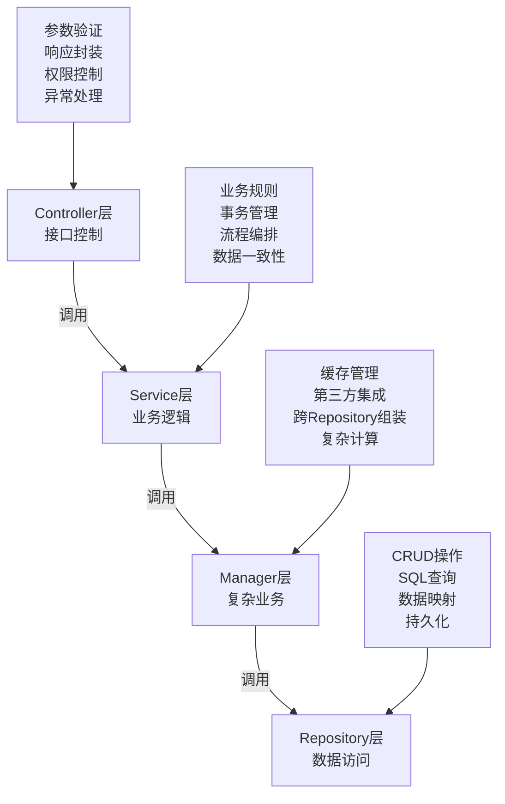

# 开发指南

<cite>
**本文档引用文件**   
- [README.md](file://README.md)
- [DEV_STANDARDS.md](file://docs/DEV_STANDARDS.md)
- [DEVELOPMENT_GUIDE.md](file://documentation/guide/DEVELOPMENT_GUIDE.md)
- [.eslintrc.cjs](file://smart-admin-web-javascript/.eslintrc.cjs)
- [.prettierrc.cjs](file://smart-admin-web-javascript/.prettierrc.cjs)
- [package.json](file://smart-admin-web-javascript/package.json)
- [vite.config.js](file://smart-admin-web-javascript/vite.config.js)
- [pom.xml](file://microservices/pom.xml)
- [CLAUDE.md](file://CLAUDE.md)
- [run-all-scans.ps1](file://scripts/compliance-scan/run-all-scans.ps1)
- [docker-compose-services.yml](file://docker-compose-services.yml)
</cite>

## 目录
1. [开发环境配置](#开发环境配置)
2. [代码规范](#代码规范)
3. [静态代码分析工具](#静态代码分析工具)
4. [调试指南](#调试指南)
5. [测试指南](#测试指南)
6. [代码提交与评审流程](#代码提交与评审流程)

## 开发环境配置

### IDE推荐设置

#### IntelliJ IDEA
- **JDK版本**: 必须使用OpenJDK 17+
- **Maven配置**: 使用Maven 3.9+，配置`settings.xml`指向项目本地仓库
- **插件推荐**:
  - Lombok Plugin: 支持Lombok注解
  - MyBatisX: MyBatis代码生成和导航
  - Alibaba Java Coding Guidelines: 阿里巴巴代码规范检查
  - Spring Boot Helper: Spring Boot项目辅助工具
  - Rainbow Brackets: 括号配对高亮
- **编码设置**: 文件编码统一为UTF-8
- **行分隔符**: Unix (LF)
- **自动导入**: 启用"Optimize imports on the fly"和"Add unambiguous imports on the fly"

#### VS Code
- **Node.js版本**: 必须使用Node.js 18+
- **推荐插件**:
  - Volar: Vue 3语言支持
  - ESLint: JavaScript/TypeScript代码检查
  - Prettier: 代码格式化
  - Stylelint: CSS/SCSS/Less样式检查
  - GitLens: Git增强功能
  - Path Intellisense: 路径自动补全
  - Auto Rename Tag: 标签自动重命名
  - Bracket Pair Colorizer: 括号配对颜色
- **工作区设置**: 项目根目录下的`.vscode/settings.json`会自动配置格式化规则

### 前端开发环境

#### 依赖安装
```bash
cd smart-admin-web-javascript
npm install
```

#### 环境配置
项目支持多环境配置，通过不同的`.env`文件区分：
- `.env.development`: 开发环境
- `.env.localhost`: 本地开发环境
- `.env.pre`: 预发布环境
- `.env.production`: 生产环境
- `.env.test`: 测试环境

#### 启动命令
```bash
# 本地开发
npm run dev

# 本地服务器
npm run localhost

# 构建测试环境
npm run build:test

# 构建预发布环境
npm run build:pre

# 构建生产环境
npm run build:prod
```

### 后端开发环境

#### 依赖管理
使用Maven进行依赖管理，父POM文件位于`microservices/pom.xml`，统一管理所有微服务的依赖版本。

#### 环境要求
- **JDK**: OpenJDK 17+
- **Maven**: 3.9+
- **MySQL**: 8.0+ (推荐使用9.3.0)
- **Redis**: 7.0+
- **Nacos**: 2.3+
- **Node.js**: 18+ (前端开发需要)

#### 本地服务启动
使用Docker Compose启动基础服务：
```bash
docker-compose -f docker-compose-services.yml up -d
```

**Section sources**
- [README.md](file://README.md#L3-L16)
- [DEVELOPMENT_GUIDE.md](file://documentation/guide/DEVELOPMENT_GUIDE.md#L20-L30)
- [docker-compose-services.yml](file://docker-compose-services.yml#L1-L41)

## 代码规范

### Java编码规范

#### 命名规范
- **类名**: 大驼峰命名（PascalCase）
- **方法名**: 小驼峰命名（camelCase）
- **常量**: 全大写下划线分隔（UPPER_SNAKE_CASE）
- **包名**: 全小写，点分隔（net.lab1024.sa）
- **变量名**: 小驼峰命名，具有业务含义

#### 注释规范
```java
/**
 * 类/方法说明
 * <p>
 * 详细描述
 * </p>
 *
 * @param param1 参数说明
 * @return 返回值说明
 * @throws Exception 异常说明
 * @author IOE-DREAM Team
 * @since 2025-01-30
 */
```

#### 四层架构规范


**Diagram sources**
- [CLAUDE.md](file://CLAUDE.md#L404-L410)
- [DEV_STANDARDS.md](file://docs/DEV_STANDARDS.md#L146-L156)

#### 依赖注入规范
- 统一使用`@Resource`注解进行依赖注入
- 禁止使用`@Autowired`注解
- 禁止使用构造函数注入

```java
// ✅ 正确示例
@Service
public class ConsumeServiceImpl implements ConsumeService {

    @Resource
    private ConsumeManager consumeManager;

    @Resource
    private AccountDao accountDao;
}
```

#### DAO层命名规范
- 数据访问层接口统一使用`Dao`后缀
- 必须使用`@Mapper`注解标识
- 必须继承`BaseMapper<Entity>`
- 禁止使用`Repository`后缀
- 禁止使用`@Repository`注解

```java
// ✅ 正确示例
@Mapper
public interface AccountDao extends BaseMapper<AccountEntity> {
    @Transactional(readOnly = true)
    AccountEntity selectByUserId(@Param("userId") Long userId);
}
```

**Section sources**
- [CLAUDE.md](file://CLAUDE.md#L404-L610)
- [DEV_STANDARDS.md](file://docs/DEV_STANDARDS.md#L143-L222)

### 前端代码规范

#### Vue 3组件规范
```vue
<template>
  <div class="{module-name}">
    <!-- 加载状态 -->
    <a-spin :spinning="loading" tip="加载中...">
      <!-- 搜索区域 -->
      <div class="search-form">
        <a-form :model="searchForm" layout="inline">
          <a-form-item label="{字段名称}">
            <a-input
              v-model:value="searchForm.{fieldName}"
              placeholder="请输入{字段名称}"
              allow-clear
            />
          </a-form-item>
          <a-form-item>
            <a-space>
              <a-button type="primary" @click="handleSearch">
                搜索
              </a-button>
              <a-button @click="handleReset">重置</a-button>
            </a-space>
          </a-form-item>
        </a-form>
      </div>
    </a-spin>
  </div>
</template>
```

#### TypeScript规范
- 必须使用TypeScript 5.0+严格模式
- 禁止使用`any`类型
- 禁止使用`var`声明变量
- 禁止直接修改props
- 使用Composition API

#### 目录结构规范
```
smart-admin-web-javascript/
├── public/                           # 静态资源
├── src/
│   ├── api/                          # API接口
│   ├── assets/                       # 静态资源
│   ├── components/                   # 公共组件
│   ├── composables/                  # 组合式函数
│   ├── layouts/                      # 布局组件
│   ├── pages/                        # 页面组件
│   ├── router/                       # 路由配置
│   ├── stores/                       # Pinia状态管理
│   ├── types/                        # 类型定义
│   ├── utils/                        # 工具函数
│   ├── views/                        # 视图组件
│   ├── App.vue                       # 根组件
│   └── main.ts                       # 入口文件
```

**Section sources**
- [DEV_STANDARDS.md](file://docs/DEV_STANDARDS.md#L514-L778)
- [package.json](file://smart-admin-web-javascript/package.json#L19-L48)

### Git提交规范

#### 提交信息格式
```
<type>(<scope>): <subject>

<body>

<footer>
```

#### 类型（type）说明
- **feat**: 新功能
- **fix**: 修复bug
- **docs**: 文档更新
- **style**: 代码格式调整（不影响代码运行）
- **refactor**: 代码重构（既不修复bug也不增加新功能）
- **perf**: 性能优化
- **test**: 增加测试
- **chore**: 构建过程或辅助工具的变动

#### 范围（scope）说明
- **backend**: 后端代码
- **frontend**: 前端代码
- **mobile**: 移动端代码
- **config**: 配置文件
- **ci**: CI/CD相关
- **deps**: 依赖更新

#### 示例
```
feat(consume): 增加消费记录查询功能

- 实现消费记录分页查询API
- 添加消费记录前端页面
- 增加消费记录导出功能

Closes #123
```

**Section sources**
- [DEV_STANDARDS.md](file://docs/DEV_STANDARDS.md#L346-L429)

## 静态代码分析工具

### 前端代码检查

#### ESLint配置
```javascript
module.exports = {
  root: true,
  env: {
    browser: true,
    es2021: true,
    node: true,
  },
  parser: 'vue-eslint-parser',
  parserOptions: {
    ecmaVersion: 12,
    sourceType: 'module',
  },
  extends: ['plugin:vue/vue3-essential', 'eslint:recommended', 'plugin:vue/base'],
  globals: {
    defineProps: 'readonly',
    defineEmits: 'readonly',
    defineExpose: 'readonly',
    withDefaults: 'readonly',
  },
  plugins: ['vue'],
  rules: {
    'no-unused-vars': [
      'error',
      { varsIgnorePattern: '.*', args: 'none' },
    ],
    'space-before-function-paren': 'off',
    'vue/multi-word-component-names': [
      'error',
      {
        ignores: ['index'],
      },
    ],
    'vue/html-self-closing': [
      'error',
      {
        html: {
          void: 'always',
          normal: 'never',
          component: 'always',
        },
        svg: 'always',
        math: 'always',
      },
    ],
    'vue/script-setup-uses-vars': 'error',
  },
};
```

#### Prettier配置
```javascript
module.exports = {
  printWidth: 150,
  tabWidth: 2,
  useTabs: false,
  semi: true,
  singleQuote: true,
  vueIndentScriptAndStyle: true,
  quoteProps: 'as-needed',
  jsxSingleQuote: true,
  trailingComma: 'es5',
  bracketSpacing: true,
  jsxBracketSameLine: false,
  arrowParens: 'always',
  endOfLine: 'auto',
};
```

#### 检查命令
```bash
# 运行ESLint检查
npm run lint

# 运行Prettier格式化
npm run format

# 运行Stylelint检查
npm run stylelint
```

**Section sources**
- [.eslintrc.cjs](file://smart-admin-web-javascript/.eslintrc.cjs#L1-L67)
- [.prettierrc.cjs](file://smart-admin-web-javascript/.prettierrc.cjs#L1-L31)

### 后端代码检查

#### Maven检查插件
在`pom.xml`中配置了以下检查插件：
- **maven-compiler-plugin**: 编译器插件，配置Java版本为17
- **spring-boot-maven-plugin**: Spring Boot Maven插件
- **spotbugs-maven-plugin**: 代码质量检查
- **checkstyle-maven-plugin**: 代码风格检查

#### 架构合规性检查
项目提供了自动化脚本进行架构合规性检查：
```powershell
# 执行所有合规性扫描
powershell -ExecutionPolicy Bypass -File run-all-scans.ps1
```

检查内容包括：
- `@Repository`注解违规
- `@Autowired`注解违规
- 架构边界违规

**Section sources**
- [pom.xml](file://microservices/pom.xml#L130-L168)
- [run-all-scans.ps1](file://scripts/compliance-scan/run-all-scans.ps1#L1-L157)

## 调试指南

### 后端服务调试

#### 开发环境配置
在Nacos配置中心配置数据库连接：
```yaml
spring:
  datasource:
    url: jdbc:mysql://localhost:3306/ioedream?useUnicode=true&characterEncoding=UTF-8&serverTimezone=Asia/Shanghai
    username: root
    password: root
    type: com.alibaba.druid.pool.DruidDataSource
```

#### Redis配置
```yaml
spring:
  data:
    redis:
      host: localhost
      port: 6379
      password: 
      database: 0
```

#### 启动步骤
1. 启动Nacos服务
2. 启动Redis服务
3. 启动MySQL数据库
4. 在IDE中运行各个微服务的`main`方法

#### 调试技巧
- 使用`@Resource`注解注入依赖，避免循环依赖
- 在Controller层使用`@Valid`注解进行参数验证
- 使用`ResponseDTO`封装统一响应格式
- 在Service层使用`@Transactional`注解管理事务

**Section sources**
- [DEVELOPMENT_GUIDE.md](file://documentation/guide/DEVELOPMENT_GUIDE.md#L45-L71)
- [CLAUDE.md](file://CLAUDE.md#L687-L713)

### 前端应用调试

#### 代理配置
在`vite.config.js`中配置了开发服务器代理：
```javascript
server: {
  host: '0.0.0.0',
  port: 8081,
  proxy: {
    '/': {
      target: 'http://127.0.0.1:1024/',
      changeOrigin: true,
      rewrite: (path) => path,
    },
  },
}
```

#### 调试技巧
- 使用Vue Devtools进行组件调试
- 在浏览器开发者工具中查看网络请求
- 使用`console.log`输出调试信息（生产环境会自动清除）
- 利用Vite的热重载功能快速查看修改效果

**Section sources**
- [vite.config.js](file://smart-admin-web-javascript/vite.config.js#L38-L51)

## 测试指南

### 单元测试

#### 后端单元测试
使用JUnit 5进行单元测试，测试类命名以`Test`结尾，测试方法以`test`开头。

```java
@Test
public void testConsumeService() {
    // 测试代码
}
```

#### 前端单元测试
使用Jest进行前端单元测试，配置文件位于`smart-app/jest.config.js`。

```javascript
module.exports = {
  testEnvironment: 'jsdom',
  moduleNameMapper: {
    '^@/(.*)$': '<rootDir>/src/$1',
    '\\.(css|less|scss|sass)$': 'identity-obj-proxy',
    '\\.(jpg|jpeg|png|gif|svg)$': '<rootDir>/__mocks__/fileMock.js'
  },
  transform: {
    '^.+\\.vue$': '@vue/vue3-jest',
    '^.+\\.js$': 'babel-jest'
  },
  testMatch: [
    '**/__tests__/**/*.test.js',
    '**/?(*.)+(spec|test).js'
  ],
  collectCoverageFrom: [
    'src/**/*.{js,vue}',
    '!src/main.js',
    '!src/**/*.spec.js',
    '!src/**/*.test.js'
  ],
  coverageThreshold: {
    global: {
      branches: 80,
      functions: 80,
      lines: 80,
      statements: 80
    }
  }
}
```

### 集成测试

#### 测试环境
- 使用`test`环境配置文件
- 连接测试数据库
- 使用独立的Redis实例

#### 测试策略
- Controller层测试：验证API接口的正确性
- Service层测试：验证业务逻辑的正确性
- DAO层测试：验证数据库操作的正确性
- 端到端测试：验证整个业务流程的正确性

#### 测试执行
```bash
# 运行所有单元测试
mvn test

# 运行所有集成测试
mvn verify

# 运行前端测试
npm run test
```

**Section sources**
- [jest.config.js](file://smart-app/jest.config.js#L1-L64)

## 代码提交与评审流程

### 分支管理策略
采用Git Flow工作流：
- **main**: 主分支，对应生产环境
- **develop**: 开发分支，对应开发环境
- **feature/\***: 功能分支，开发新功能
- **release/\***: 发布分支，准备发布
- **hotfix/\***: 热修复分支，紧急修复

### 提交流程
1. 从`develop`分支创建功能分支
2. 在功能分支上进行开发
3. 提交代码并推送至远程仓库
4. 创建Pull Request到`develop`分支
5. 等待代码评审
6. 修复评审意见
7. 合并到`develop`分支

### 代码评审标准
- 代码是否符合编码规范
- 是否有适当的注释
- 是否有单元测试覆盖
- 是否有性能问题
- 是否有安全漏洞
- 是否有重复代码
- 是否遵循四层架构规范
- 是否正确使用`@Resource`注解
- DAO层是否使用`Dao`后缀和`@Mapper`注解

### 合并流程
1. 至少需要一位核心开发人员批准
2. 所有CI/CD检查必须通过
3. 代码覆盖率必须达到80%以上
4. 无严重架构违规
5. 合并后自动触发构建和部署

**Section sources**
- [run-all-scans.ps1](file://scripts/compliance-scan/run-all-scans.ps1#L1-L157)
- [CLAUDE.md](file://CLAUDE.md#L385-L800)