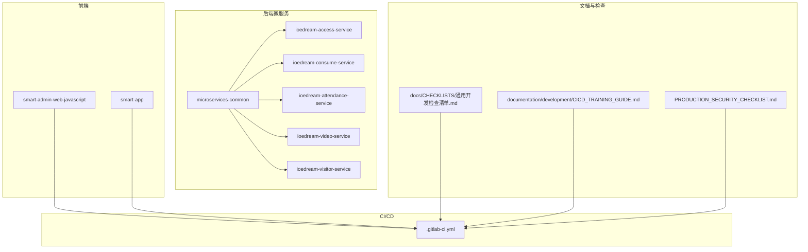
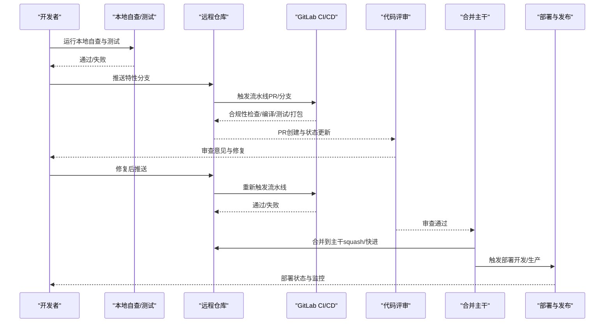
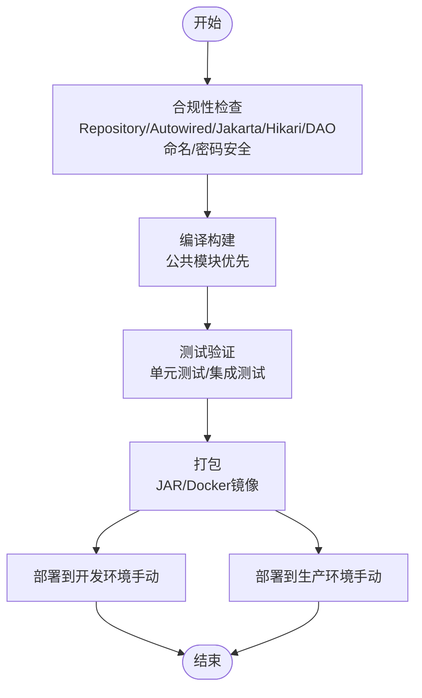
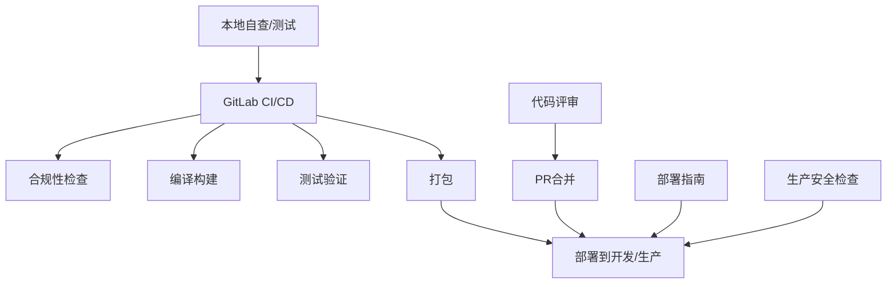

# 开发流程

<cite>
**本文引用的文件**
- [.gitlab-ci.yml](file://.gitlab-ci.yml)
- [documentation/development/CICD_TRAINING_GUIDE.md](file://documentation/development/CICD_TRAINING_GUIDE.md)
- [documentation/technical/GIT_COMMIT_AND_MERGE_GUIDE.md](file://documentation/technical/GIT_COMMIT_AND_MERGE_GUIDE.md)
- [docs/CHECKLISTS/README.md](file://docs/CHECKLISTS/README.md)
- [docs/CHECKLISTS/通用开发检查清单.md](file://docs/CHECKLISTS/通用开发检查清单.md)
- [scripts/compliance-scan/README.md](file://scripts/compliance-scan/README.md)
- [documentation/04-部署运维/部署指南.md](file://documentation/04-部署运维/部署指南.md)
- [PRODUCTION_SECURITY_CHECKLIST.md](file://PRODUCTION_SECURITY_CHECKLIST.md)
- [documentation/guide/DEVELOPMENT_GUIDE.md](file://documentation/guide/DEVELOPMENT_GUIDE.md)
- [documentation/04-部署运维/DEVICE_MANAGEMENT_DEPLOYMENT.md](file://documentation/04-部署运维/DEVICE_MANAGEMENT_DEPLOYMENT.md)
- [documentation/04-部署运维/架构规范持续维护机制.md](file://documentation/04-部署运维/架构规范持续维护机制.md)
- [openspec/AGENTS.md](file://openspec/AGENTS.md)
- [MERGE_RISK_ASSESSMENT_CHECKLIST.md](file://MERGE_RISK_ASSESSMENT_CHECKLIST.md)
- [MERGE_DECISION_DOCUMENT.md](file://MERGE_DECISION_DOCUMENT.md)
</cite>

## 目录
1. [简介](#简介)
2. [项目结构](#项目结构)
3. [核心组件](#核心组件)
4. [架构总览](#架构总览)
5. [详细组件分析](#详细组件分析)
6. [依赖分析](#依赖分析)
7. [性能考量](#性能考量)
8. [故障排查指南](#故障排查指南)
9. [结论](#结论)
10. [附录](#附录)

## 简介
本文件定义从代码提交到部署的标准化开发工作流，覆盖特性分支创建、提交前检查清单、Pull Request（PR）与代码评审、CI/CD流水线触发与执行、以及代码合并到主干后的发布流程。目标是确保变更安全可控、质量可追溯、风险可量化，并形成可复用的最佳实践。

## 项目结构
- 后端采用多模块微服务结构，统一在根目录的微服务模块中进行开发与构建。
- 前端包含Web与移动端项目，分别提供静态资源与代理配置。
- CI/CD通过GitLab CI/CD流水线驱动，包含合规性检查、编译构建、测试验证、打包与部署阶段。
- 文档与检查清单体系完善，涵盖通用开发检查、部署指南、生产安全检查等。

图表来源
- [.gitlab-ci.yml](file://.gitlab-ci.yml#L1-L334)
- [docs/CHECKLISTS/通用开发检查清单.md](file://docs/CHECKLISTS/通用开发检查清单.md#L1-L538)
- [documentation/development/CICD_TRAINING_GUIDE.md](file://documentation/development/CICD_TRAINING_GUIDE.md#L1-L800)
- [PRODUCTION_SECURITY_CHECKLIST.md](file://PRODUCTION_SECURITY_CHECKLIST.md#L390-L562)

章节来源
- [documentation/guide/DEVELOPMENT_GUIDE.md](file://documentation/guide/DEVELOPMENT_GUIDE.md#L1-L242)

## 核心组件
- 提交前检查与合规性扫描：本地自查脚本、合规性扫描工具、架构规范培训材料。
- PR与代码评审：PR流程、代码审查清单、风险评估与决策文档。
- CI/CD流水线：阶段划分、触发条件、任务依赖与制品管理。
- 部署与发布：部署指南、生产安全检查、灰度与回滚策略。

章节来源
- [scripts/compliance-scan/README.md](file://scripts/compliance-scan/README.md#L1-L249)
- [documentation/development/CICD_TRAINING_GUIDE.md](file://documentation/development/CICD_TRAINING_GUIDE.md#L1-L800)
- [.gitlab-ci.yml](file://.gitlab-ci.yml#L1-L334)
- [docs/CHECKLISTS/README.md](file://docs/CHECKLISTS/README.md#L1-L247)
- [docs/CHECKLISTS/通用开发检查清单.md](file://docs/CHECKLISTS/通用开发检查清单.md#L1-L538)
- [PRODUCTION_SECURITY_CHECKLIST.md](file://PRODUCTION_SECURITY_CHECKLIST.md#L390-L562)

## 架构总览
标准化开发工作流分为五个阶段：本地自查与提交、CI/CD检查、代码评审、合并与发布、生产验证与监控。

图表来源
- [.gitlab-ci.yml](file://.gitlab-ci.yml#L1-L334)
- [documentation/development/CICD_TRAINING_GUIDE.md](file://documentation/development/CICD_TRAINING_GUIDE.md#L440-L520)
- [documentation/technical/GIT_COMMIT_AND_MERGE_GUIDE.md](file://documentation/technical/GIT_COMMIT_AND_MERGE_GUIDE.md#L1-L165)

## 详细组件分析

### 1. 特性分支创建与本地开发
- 建议使用特性分支进行开发，分支命名规范参考项目约定（例如 feature/your-feature），并在本地完成自查与测试。
- 本地自查包括：架构合规性检查、编译验证、单元测试、代码格式化、敏感信息检查等。
- 提交前检查清单可参考通用开发检查清单与检查清单目录，确保关键项通过。

章节来源
- [documentation/development/CICD_TRAINING_GUIDE.md](file://documentation/development/CICD_TRAINING_GUIDE.md#L440-L520)
- [docs/CHECKLISTS/README.md](file://docs/CHECKLISTS/README.md#L1-L247)
- [docs/CHECKLISTS/通用开发检查清单.md](file://docs/CHECKLISTS/通用开发检查清单.md#L1-L538)

### 2. 提交前检查清单（代码格式化、静态检查、本地测试）
- 代码格式化：使用项目提供的格式化工具（如Maven插件）统一风格。
- 静态检查：本地自查脚本与合规性扫描工具（Repository/Autowired/Jakarta/Hikari/DAO命名/密码安全等）。
- 本地测试：运行单元测试与集成测试（如存在），确保基本质量门禁。

章节来源
- [documentation/development/CICD_TRAINING_GUIDE.md](file://documentation/development/CICD_TRAINING_GUIDE.md#L110-L193)
- [scripts/compliance-scan/README.md](file://scripts/compliance-scan/README.md#L1-L249)
- [docs/CHECKLISTS/通用开发检查清单.md](file://docs/CHECKLISTS/通用开发检查清单.md#L288-L333)

### 3. Pull Request（PR）与代码评审
- PR流程：创建分支、本地测试、推送远程、创建PR、等待CI/CD检查、代码评审、修复问题、再次检查。
- 代码评审规范：至少一位审查者批准；审查清单包含架构规范、命名规范、注入规范、包名规范、配置规范、异常处理、事务管理、日志记录、测试覆盖率、注释等。
- 风险评估与决策：合并前进行风险评估与决策文档，明确执行策略、回滚预案与缓解措施。

章节来源
- [documentation/development/CICD_TRAINING_GUIDE.md](file://documentation/development/CICD_TRAINING_GUIDE.md#L490-L519)
- [docs/CHECKLISTS/README.md](file://docs/CHECKLISTS/README.md#L41-L68)
- [docs/CHECKLISTS/通用开发检查清单.md](file://docs/CHECKLISTS/通用开发检查清单.md#L396-L422)
- [MERGE_RISK_ASSESSMENT_CHECKLIST.md](file://MERGE_RISK_ASSESSMENT_CHECKLIST.md#L226-L277)
- [MERGE_DECISION_DOCUMENT.md](file://MERGE_DECISION_DOCUMENT.md#L75-L130)

### 4. CI/CD流水线（触发条件与执行步骤）
- 触发条件：Push到develop/main、创建Merge Request、手动触发。
- 阶段划分：
  - 阶段1：合规性检查（Repository/Autowired/Jakarta/Hikari/DAO命名/密码安全）。
  - 阶段2：编译构建（先构建公共模块，再构建所有服务）。
  - 阶段3：测试验证（单元测试、集成测试）。
  - 阶段4：打包（JAR包、Docker镜像）。
  - 阶段5：部署（开发/生产环境，手动触发）。
- 任务依赖与制品：Artifacts与依赖管理确保流水线有序执行。

图表来源
- [.gitlab-ci.yml](file://.gitlab-ci.yml#L1-L334)

章节来源
- [.gitlab-ci.yml](file://.gitlab-ci.yml#L1-L334)
- [documentation/development/CICD_TRAINING_GUIDE.md](file://documentation/development/CICD_TRAINING_GUIDE.md#L214-L274)

### 5. 代码合并到主干后的发布流程
- 合并策略：建议使用Squash合并，保持主干提交历史清晰。
- 发布策略：生产环境采用灰度发布（如10%→50%→100%），观察期不少于48小时；同时准备回滚预案。
- 生产安全检查：密码通过环境变量注入、HTTPS证书有效、防火墙规则、数据库用户权限最小化、Redis密码、服务器SSH密钥登录等。
- 部署与监控：前端Web应用与移动端部署、Nginx代理配置、健康检查端点、Prometheus/Grafana监控、日志聚合与告警。

章节来源
- [documentation/technical/GIT_COMMIT_AND_MERGE_GUIDE.md](file://documentation/technical/GIT_COMMIT_AND_MERGE_GUIDE.md#L1-L165)
- [PRODUCTION_SECURITY_CHECKLIST.md](file://PRODUCTION_SECURITY_CHECKLIST.md#L438-L562)
- [documentation/04-部署运维/部署指南.md](file://documentation/04-部署运维/部署指南.md#L292-L330)
- [documentation/04-部署运维/DEVICE_MANAGEMENT_DEPLOYMENT.md](file://documentation/04-部署运维/DEVICE_MANAGEMENT_DEPLOYMENT.md#L229-L392)

### 6. 变更提案与评审机制（概念性说明）
- 变更提案框架：针对新特性、破坏性变更、架构变更等，遵循提案流程，明确背景、目标、非目标、技术决策与规格。
- 评审材料：包含议程、演示、风险评估、成本收益、团队分工、时间表、决策文档与启动检查清单等。

章节来源
- [openspec/AGENTS.md](file://openspec/AGENTS.md#L123-L222)
- [MERGE_RISK_ASSESSMENT_CHECKLIST.md](file://MERGE_RISK_ASSESSMENT_CHECKLIST.md#L364-L413)
- [MERGE_DECISION_DOCUMENT.md](file://MERGE_DECISION_DOCUMENT.md#L75-L130)

## 依赖分析
- 组件耦合与协作：
  - CI/CD流水线依赖本地自查与合规性扫描工具，确保上游质量。
  - PR流程依赖代码评审清单与风险评估文档，降低合并风险。
  - 发布流程依赖部署指南与生产安全检查，保障上线质量。
- 外部依赖与集成点：
  - GitLab Runner与Kubernetes用于流水线执行与部署。
  - Nacos用于配置中心，Prometheus/Grafana用于监控，Zipkin用于分布式追踪。

图表来源
- [.gitlab-ci.yml](file://.gitlab-ci.yml#L1-L334)
- [documentation/development/CICD_TRAINING_GUIDE.md](file://documentation/development/CICD_TRAINING_GUIDE.md#L214-L274)
- [documentation/04-部署运维/部署指南.md](file://documentation/04-部署运维/部署指南.md#L292-L330)
- [PRODUCTION_SECURITY_CHECKLIST.md](file://PRODUCTION_SECURITY_CHECKLIST.md#L438-L562)

章节来源
- [.gitlab-ci.yml](file://.gitlab-ci.yml#L1-L334)
- [documentation/development/CICD_TRAINING_GUIDE.md](file://documentation/development/CICD_TRAINING_GUIDE.md#L214-L274)

## 性能考量
- 本地性能优化：缓存策略（本地缓存+Redis）、数据库索引优化、分页优化（游标分页）、连接池配置。
- CI/CD性能：多线程编译、缓存Maven依赖、并行任务、制品保留策略。
- 生产性能：灰度发布、健康检查、监控仪表盘、告警阈值与通知。

章节来源
- [documentation/guide/DEVELOPMENT_GUIDE.md](file://documentation/guide/DEVELOPMENT_GUIDE.md#L156-L242)
- [.gitlab-ci.yml](file://.gitlab-ci.yml#L1-L334)
- [PRODUCTION_SECURITY_CHECKLIST.md](file://PRODUCTION_SECURITY_CHECKLIST.md#L390-L562)

## 故障排查指南
- CI/CD失败排查：查看失败Job日志、本地重现问题、使用修复脚本、重新提交。
- 合规性违规：使用合规性扫描工具与修复脚本，确保Repository/Autowired/Jakarta/Hikari/DAO命名/密码安全等检查通过。
- 合并冲突：解决冲突后提交，必要时重新推送。

章节来源
- [documentation/development/CICD_TRAINING_GUIDE.md](file://documentation/development/CICD_TRAINING_GUIDE.md#L613-L645)
- [scripts/compliance-scan/README.md](file://scripts/compliance-scan/README.md#L112-L168)
- [documentation/technical/GIT_COMMIT_AND_MERGE_GUIDE.md](file://documentation/technical/GIT_COMMIT_AND_MERGE_GUIDE.md#L134-L165)

## 结论
通过标准化的特性分支、提交前检查、PR与代码评审、CI/CD流水线与生产发布流程，项目实现了从开发到上线的全链路质量与风险管控。建议持续完善检查清单、强化自动化工具与监控告警，确保变更安全可控、可追溯、可回滚。

## 附录
- 术语与规范
  - 架构规范：四层架构、依赖注入、DAO命名、包名、连接池等。
  - 提交规范：Commit Message格式、分支命名、PR描述与关联Issue。
  - 发布规范：灰度发布、回滚预案、生产安全检查、监控与告警。

章节来源
- [documentation/development/CICD_TRAINING_GUIDE.md](file://documentation/development/CICD_TRAINING_GUIDE.md#L670-L711)
- [documentation/04-部署运维/架构规范持续维护机制.md](file://documentation/04-部署运维/架构规范持续维护机制.md#L190-L223)