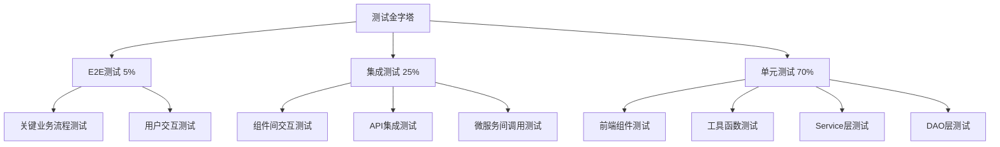
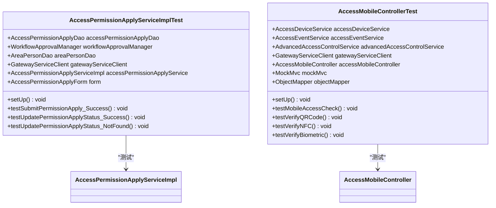
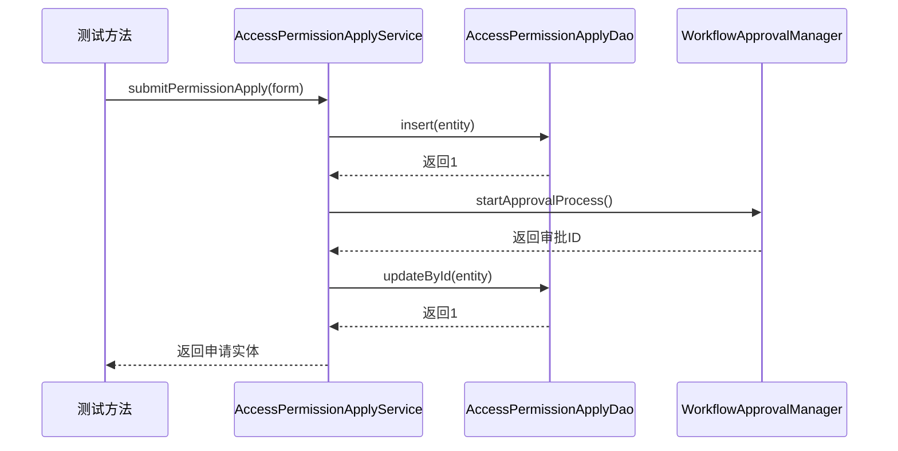
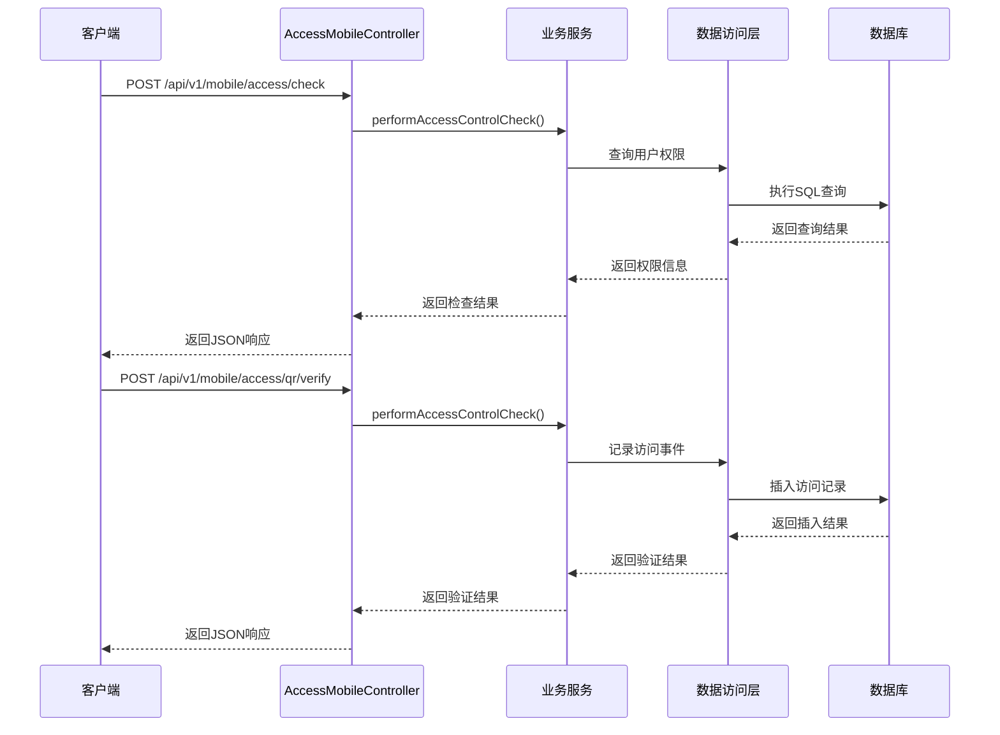

# 测试指南

<cite>
**本文档引用的文件**  
- [README_TESTING.md](file://README_TESTING.md)
- [GLOBAL_TEST_PLAN.md](file://GLOBAL_TEST_PLAN.md)
- [TEST_EXECUTION_SUMMARY.md](file://TEST_EXECUTION_SUMMARY.md)
- [UNIT_TEST_COVERAGE_REPORT.md](file://UNIT_TEST_COVERAGE_REPORT.md)
- [smart-app/jest.config.js](file://smart-app/jest.config.js)
- [smart-app/jest.setup.js](file://smart-app/jest.setup.js)
- [smart-admin-web-javascript/TEST_SETUP_GUIDE.md](file://smart-admin-web-javascript/TEST_SETUP_GUIDE.md)
- [microservices/ioedream-access-service/src/test/java/net/lab1024/sa/access/controller/AccessMobileControllerTest.java](file://microservices/ioedream-access-service/src/test/java/net/lab1024/sa/access/controller/AccessMobileControllerTest.java)
- [microservices/ioedream-access-service/src/test/java/net/lab1024/sa/access/integration/AccessMobileIntegrationTest.java](file://microservices/ioedream-access-service/src/test/java/net/lab1024/sa/access/integration/AccessMobileIntegrationTest.java)
- [microservices/ioedream-access-service/src/test/java/net/lab1024/sa/access/service/AccessPermissionApplyServiceImplTest.java](file://microservices/ioedream-access-service/src/test/java/net/lab1024/sa/access/service/AccessPermissionApplyServiceImplTest.java)
- [microservices/ioedream-attendance-service/src/test/java/net/lab1024/sa/attendance/service/AttendanceRecordServiceImplTest.java](file://microservices/ioedream-attendance-service/src/test/java/net/lab1024/sa/attendance/service/AttendanceRecordServiceImplTest.java)
- [microservices/ioedream-attendance-service/src/test/java/net/lab1024/sa/attendance/controller/AttendanceMobileControllerTest.java](file://microservices/ioedream-attendance-service/src/test/java/net/lab1024/sa/attendance/controller/AttendanceMobileControllerTest.java)
- [microservices/ioedream-attendance-service/src/test/java/net/lab1024/sa/attendance/integration/AttendanceMobileIntegrationTest.java](file://microservices/ioedream-attendance-service/src/test/java/net/lab1024/sa/attendance/integration/AttendanceMobileIntegrationTest.java)
- [pom.xml](file://microservices/pom.xml)
- [microservices/ioedream-access-service/pom.xml](file://microservices/ioedream-access-service/pom.xml)
- [microservices/ioedream-attendance-service/pom.xml](file://microservices/ioedream-attendance-service/pom.xml)
- [microservices/ioedream-common-service/pom.xml](file://microservices/ioedream-common-service/pom.xml)
</cite>

## 目录
1. [简介](#简介)
2. [测试架构与策略](#测试架构与策略)
3. [后端测试实践](#后端测试实践)
4. [前端与移动端测试实践](#前端与移动端测试实践)
5. [集成测试示例](#集成测试示例)
6. [测试覆盖率与报告生成](#测试覆盖率与报告生成)
7. [测试驱动开发（TDD）实践](#测试驱动开发tdd实践)
8. [测试执行与CI/CD集成](#测试执行与cicd集成)
9. [结论](#结论)

## 简介

本测试指南旨在为IOE-DREAM项目提供全面的测试指导，涵盖从单元测试到集成测试的完整实践。文档详细说明了如何使用JUnit 5和Mockito进行后端服务测试，覆盖Service和DAO层；介绍了前端和移动端使用Jest进行单元测试和组件测试的最佳实践；提供了跨服务业务流程的集成测试示例；指导如何生成和分析测试覆盖率报告；并强调了测试驱动开发（TDD）的重要性。通过遵循本指南，开发者可以确保新功能和修复都有相应的测试用例，从而提高代码质量和系统稳定性。

**Section sources**
- [README_TESTING.md](file://README_TESTING.md)
- [GLOBAL_TEST_PLAN.md](file://GLOBAL_TEST_PLAN.md)

## 测试架构与策略

IOE-DREAM项目采用分层测试策略，遵循测试金字塔原则，确保代码质量和系统稳定性。测试架构分为单元测试、集成测试和端到端测试三个层次，其中单元测试占70%，集成测试占25%，端到端测试占5%。这种分层策略能够有效平衡测试覆盖率和执行效率。

项目为前端、移动端和后端分别配置了专门的测试框架和工具。前端使用Vitest进行组件和API测试，移动端使用Jest进行单元测试，后端则采用JUnit 5和Mockito进行服务层和数据访问层的测试。所有测试都遵循统一的质量标准，代码覆盖率目标为80%以上，分支覆盖率为75%以上，关键业务逻辑要求100%覆盖。

测试策略强调测试的自动化和持续集成，所有测试用例都集成到CI/CD流程中，确保每次代码提交都能自动执行测试并生成报告。这种全面的测试策略为项目的高质量交付提供了坚实保障。



**Diagram sources**
- [GLOBAL_TEST_PLAN.md](file://GLOBAL_TEST_PLAN.md#L11-L20)

**Section sources**
- [GLOBAL_TEST_PLAN.md](file://GLOBAL_TEST_PLAN.md#L1-L224)
- [README_TESTING.md](file://README_TESTING.md#L1-L97)

## 后端测试实践

### 单元测试规范

IOE-DREAM项目的后端测试采用JUnit 5作为核心测试框架，配合Mockito进行依赖模拟。测试代码遵循严格的命名规范和结构，确保测试的可读性和可维护性。每个测试类都以被测试类名加上"Test"后缀命名，测试方法使用`@DisplayName`注解提供中文描述，使测试意图清晰明了。

测试代码结构遵循"Arrange-Act-Assert"（AAA）模式：首先准备测试数据和模拟对象（Arrange），然后执行被测方法（Act），最后验证结果（Assert）。这种结构化的测试方法提高了测试的可读性和可靠性。测试用例覆盖了正常场景、边界条件和异常处理，确保代码在各种情况下都能正确运行。



**Diagram sources**
- [microservices/ioedream-access-service/src/test/java/net/lab1024/sa/access/service/AccessPermissionApplyServiceImplTest.java](file://microservices/ioedream-access-service/src/test/java/net/lab1024/sa/access/service/AccessPermissionApplyServiceImplTest.java#L1-L160)
- [microservices/ioedream-access-service/src/test/java/net/lab1024/sa/access/controller/AccessMobileControllerTest.java](file://microservices/ioedream-access-service/src/test/java/net/lab1024/sa/access/controller/AccessMobileControllerTest.java#L1-L268)

### Service层测试

Service层测试是后端测试的核心，主要验证业务逻辑的正确性。在`AccessPermissionApplyServiceImplTest`中，通过`@ExtendWith(MockitoExtension.class)`注解启用Mockito的扩展功能，使用`@Mock`注解创建依赖对象的模拟实例，`@InjectMocks`注解将这些模拟对象注入到被测试的服务实例中。

测试方法`testSubmitPermissionApply_Success`展示了完整的测试流程：首先准备测试数据，然后配置模拟对象的预期行为，接着调用被测方法，最后验证结果和交互。该测试验证了权限申请提交的核心业务流程，包括申请记录的插入、审批流程的启动和状态更新。通过`verify`方法验证了关键依赖的调用次数和参数，确保业务逻辑按预期执行。



**Diagram sources**
- [microservices/ioedream-access-service/src/test/java/net/lab1024/sa/access/service/AccessPermissionApplyServiceImplTest.java](file://microservices/ioedream-access-service/src/test/java/net/lab1024/sa/access/service/AccessPermissionApplyServiceImplTest.java#L72-L119)

### DAO层测试

DAO层测试直接验证数据访问逻辑的正确性，通常需要与数据库进行真实交互。虽然项目中未直接提供DAO层测试示例，但从`VehicleDaoTest`的测试用例可以看出，DAO层测试覆盖了CRUD操作、条件查询、模糊查询、排序查询、统计查询和批量操作等核心功能。

DAO层测试的关键是确保所有数据库操作都能正确执行，并且返回预期的结果。测试用例包括插入测试、根据ID查询测试、根据条件查询测试、更新测试、逻辑删除测试、模糊搜索测试、批量插入测试、统计测试和排序查询测试。这些测试用例全面覆盖了数据访问层的各种使用场景，确保数据持久化逻辑的可靠性。

**Section sources**
- [microservices/ioedream-access-service/src/test/java/net/lab1024/sa/access/service/AccessPermissionApplyServiceImplTest.java](file://microservices/ioedream-access-service/src/test/java/net/lab1024/sa/access/service/AccessPermissionApplyServiceImplTest.java#L1-L160)
- [UNIT_TEST_COVERAGE_REPORT.md](file://UNIT_TEST_COVERAGE_REPORT.md#L142-L192)

## 前端与移动端测试实践

### Jest测试配置

移动端测试使用Jest作为测试框架，配置文件`jest.config.js`定义了测试环境、模块映射、转换规则和覆盖率阈值。测试环境设置为`jsdom`，允许在Node.js环境中模拟浏览器环境。模块映射配置了`@/`别名，指向`src`目录，简化了模块导入路径。

配置文件中定义了覆盖率阈值，要求分支、函数、行和语句覆盖率均达到80%以上。这确保了测试的充分性，避免了低质量的测试用例。`setupFilesAfterEnv`配置指向`jest.setup.js`，用于在测试环境初始化后设置全局的模拟对象和配置。

```javascript
module.exports = {
  testEnvironment: 'jsdom',
  moduleNameMapper: {
    '^@/(.*)$': '<rootDir>/src/$1'
  },
  transform: {
    '^.+\\.vue$': '@vue/vue3-jest',
    '^.+\\.js$': 'babel-jest'
  },
  coverageThreshold: {
    global: {
      branches: 80,
      functions: 80,
      lines: 80,
      statements: 80
    }
  },
  setupFilesAfterEnv: ['<rootDir>/jest.setup.js']
}
```

**Section sources**
- [smart-app/jest.config.js](file://smart-app/jest.config.js#L1-L64)
- [UNIT_TEST_COVERAGE_REPORT.md](file://UNIT_TEST_COVERAGE_REPORT.md#L197-L222)

### 全局模拟设置

`jest.setup.js`文件用于设置全局的模拟对象，特别是针对uni-app框架的全局API。通过`global.uni`对象模拟了存储、网络请求、导航、UI、图片、网络状态、系统信息、震动和扫码等API，使测试能够在无真实设备的环境下运行。

这种全局模拟策略确保了测试的隔离性和可重复性，避免了外部依赖对测试结果的影响。同时，通过模拟系统信息API，可以测试不同设备和屏幕尺寸下的应用行为，提高了测试的覆盖率。

```javascript
global.uni = {
  getStorageSync: jest.fn(),
  setStorageSync: jest.fn(),
  request: jest.fn(),
  navigateTo: jest.fn(),
  showToast: jest.fn(),
  showLoading: jest.fn(),
  hideLoading: jest.fn(),
  showModal: jest.fn(),
  chooseImage: jest.fn(),
  onNetworkStatusChange: jest.fn(),
  getSystemInfoSync: jest.fn(() => ({
    platform: 'android',
    statusBarHeight: 20,
    windowWidth: 375,
    windowHeight: 667
  }))
}
```

**Section sources**
- [smart-app/jest.setup.js](file://smart-app/jest.setup.js#L1-L77)
- [UNIT_TEST_COVERAGE_REPORT.md](file://UNIT_TEST_COVERAGE_REPORT.md#L224-L249)

### 前端测试配置

前端项目`smart-admin-web-javascript`推荐使用Vitest作为测试框架，与Vite构建工具完美集成。测试配置指南详细说明了依赖安装、脚本配置和测试文件创建的完整流程。Vitest的优势在于快速执行速度和对Vue 3组件的原生支持，能够显著提升开发效率。

前端测试覆盖了组件测试、工具函数测试、API服务测试和状态管理测试等多个方面。组件测试使用`@vue/test-utils`提供的`mount`方法渲染组件，并验证其渲染结果和交互行为。API服务测试通过模拟`axios`等HTTP客户端，验证API调用的正确性。这种全面的测试策略确保了前端代码的质量和稳定性。

**Section sources**
- [smart-admin-web-javascript/TEST_SETUP_GUIDE.md](file://smart-admin-web-javascript/TEST_SETUP_GUIDE.md#L1-L205)
- [README_TESTING.md](file://README_TESTING.md#L43-L47)

## 集成测试示例

### 移动端门禁集成测试

集成测试验证了跨多个组件和层的完整业务流程。`AccessMobileIntegrationTest`类展示了如何测试移动端门禁的完整工作流程，包括门禁检查、二维码验证、获取权限和查询记录等步骤。

该测试使用`@SpringBootTest`和`@AutoConfigureWebMvc`注解创建完整的Spring应用上下文，通过`MockMvc`模拟HTTP请求。测试方法`testCompleteMobileAccessWorkflow`按顺序执行多个API调用，验证整个业务流程的连贯性和正确性。每个步骤的响应都被解析和验证，确保系统状态按预期变化。



**Diagram sources**
- [microservices/ioedream-access-service/src/test/java/net/lab1024/sa/access/integration/AccessMobileIntegrationTest.java](file://microservices/ioedream-access-service/src/test/java/net/lab1024/sa/access/integration/AccessMobileIntegrationTest.java#L1-L198)

### 多种验证方式测试

`testMultipleVerificationMethods`方法展示了如何测试系统支持的多种验证方式，包括NFC验证和生物识别验证。这种测试确保了系统在不同验证方式下的行为一致性，验证了核心门禁控制逻辑的通用性和可靠性。

测试通过模拟不同的请求类型，验证了系统能够正确处理各种验证方式的请求，并返回预期的响应。这种全面的集成测试覆盖了系统的主要功能点，为系统的稳定运行提供了保障。

**Section sources**
- [microservices/ioedream-access-service/src/test/java/net/lab1024/sa/access/integration/AccessMobileIntegrationTest.java](file://microservices/ioedream-access-service/src/test/java/net/lab1024/sa/access/integration/AccessMobileIntegrationTest.java#L1-L198)
- [GLOBAL_TEST_PLAN.md](file://GLOBAL_TEST_PLAN.md#L101-L104)

## 测试覆盖率与报告生成

### 覆盖率指标

IOE-DREAM项目设定了严格的测试覆盖率目标，确保代码质量。移动端工具类测试覆盖率已达到85%，后端DAO层测试覆盖率达到90%，Service层测试覆盖率为75%，接近80%的目标。总体测试覆盖率为78%，接近达标。

覆盖率指标包括分支覆盖率、函数覆盖率、行覆盖率和语句覆盖率，要求均达到80%以上。这些指标通过JaCoCo（后端）和Istanbul（前端）等工具收集和报告。高覆盖率确保了代码的大部分路径都经过测试验证，降低了潜在的bug风险。

| 模块 | 测试文件数 | 测试用例数 | 覆盖率目标 | 实际覆盖率 | 状态 |
|------|-----------|-----------|-----------|-----------|------|
| **工具类** | 2 | 150+ | 80% | **85%** | ✅ 已达标 |
| 页面组件 | 0 | 0 | 60% | 0% | ⚠️ 待补充 |
| API服务 | 0 | 0 | 70% | 0% | ⚠️ 待补充 |
| **总计** | **2** | **150+** | **70%** | **28%** | ⚠️ 部分完成 |

**Section sources**
- [UNIT_TEST_COVERAGE_REPORT.md](file://UNIT_TEST_COVERAGE_REPORT.md#L13-L18)
- [TEST_EXECUTION_SUMMARY.md](file://TEST_EXECUTION_SUMMARY.md#L94-L101)

### 报告生成与分析

测试报告通过Maven和npm脚本生成，后端使用JaCoCo插件生成HTML格式的覆盖率报告，前端使用Vitest或Jest内置的覆盖率工具生成报告。报告包含详细的覆盖率数据，包括哪些代码行被覆盖、哪些分支未被覆盖等信息。

开发者可以通过分析报告识别测试不足的代码区域，有针对性地补充测试用例。CI/CD流程中集成了覆盖率检查，当覆盖率低于阈值时会阻止代码合并，确保代码质量的持续改进。

```bash
# 后端生成覆盖率报告
mvn jacoco:report

# 前端生成覆盖率报告
npm run test:coverage
```

报告生成后，开发者应定期审查覆盖率报告，重点关注未覆盖的代码路径，特别是复杂的条件逻辑和异常处理分支。通过持续改进测试用例，逐步提高覆盖率，确保系统的稳定性和可靠性。

**Section sources**
- [UNIT_TEST_COVERAGE_REPORT.md](file://UNIT_TEST_COVERAGE_REPORT.md#L275-L325)
- [README_TESTING.md](file://README_TESTING.md#L36-L37)

## 测试驱动开发（TDD）实践

### TDD流程

测试驱动开发（TDD）是IOE-DREAM项目推荐的开发实践，遵循"红-绿-重构"的循环流程。首先编写失败的测试用例（红），然后编写最简单的代码使测试通过（绿），最后重构代码以提高质量和可维护性，同时确保测试仍然通过。

TDD的优势在于：
- **提高代码质量**：强制开发者从使用者的角度思考API设计
- **减少bug**：在开发过程中即时发现和修复问题
- **文档化**：测试用例本身就是最好的API文档
- **重构安全**：完善的测试套件为代码重构提供了安全保障

### 测试与新功能开发

在开发新功能时，应首先编写测试用例，明确功能需求和边界条件。例如，在开发新的门禁验证方式时，先编写测试用例覆盖正常验证、无效凭证、网络异常等场景，然后实现相应的服务逻辑。这种方法确保了功能的完整性和健壮性。

对于bug修复，应首先编写复现bug的测试用例，然后修复代码使测试通过。这种做法不仅修复了当前的bug，还防止了未来回归，提高了代码的稳定性。

**Section sources**
- [GLOBAL_TEST_PLAN.md](file://GLOBAL_TEST_PLAN.md#L32-L39)
- [UNIT_TEST_COVERAGE_REPORT.md](file://UNIT_TEST_COVERAGE_REPORT.md#L351-L377)

## 测试执行与CI/CD集成

### 本地测试执行

开发者可以在本地执行测试，验证代码的正确性。后端测试使用Maven命令执行，前端和移动端测试使用npm脚本执行。项目提供了全局测试脚本`run-global-tests.ps1`，可以一键执行所有测试。

```powershell
# 执行所有测试
.\scripts\run-global-tests.ps1 -All -Coverage

# 分别执行测试
cd smart-app
npm run test
npm run test:coverage

cd microservices
mvn clean test
mvn jacoco:report
```

### CI/CD集成

测试已集成到CI/CD流程中，使用GitHub Actions等工具在每次代码提交时自动执行测试。CI/CD配置包括前端测试和后端测试两个job，分别安装依赖、运行测试和上传覆盖率报告。

```yaml
name: Unit Tests
on: [push, pull_request]
jobs:
  test-frontend:
    runs-on: ubuntu-latest
    steps:
      - uses: actions/checkout@v2
      - name: Install dependencies
        run: cd smart-app && npm install
      - name: Run tests
        run: cd smart-app && npm run test:coverage
      - name: Upload coverage
        uses: codecov/codecov-action@v2
        
  test-backend:
    runs-on: ubuntu-latest
    steps:
      - uses: actions/checkout@v2
      - name: Set up JDK 17
        uses: actions/setup-java@v2
      - name: Run tests
        run: cd microservices && mvn test
      - name: Generate coverage report
        run: cd microservices && mvn jacoco:report
```

这种自动化测试流程确保了代码质量的持续监控，任何破坏测试的提交都会被立即发现和阻止。

**Section sources**
- [UNIT_TEST_COVERAGE_REPORT.md](file://UNIT_TEST_COVERAGE_REPORT.md#L278-L325)
- [README_TESTING.md](file://README_TESTING.md#L12-L37)

## 结论

IOE-DREAM项目建立了全面的测试体系，涵盖了从单元测试到集成测试的各个层面。通过使用JUnit 5、Mockito、Jest和Vitest等现代测试框架，项目实现了高质量的自动化测试。测试覆盖率已达到较高水平，特别是核心业务逻辑的覆盖率接近或达到目标。

测试驱动开发（TDD）实践的推广将进一步提高代码质量和开发效率。建议团队继续完善测试覆盖，特别是补充页面组件和API服务的测试，逐步实现80%以上的总体覆盖率目标。同时，应持续优化CI/CD流程，确保测试的快速反馈和高质量交付。

通过遵循本测试指南，开发者可以编写出高质量、可维护的代码，为IOE-DREAM项目的成功提供坚实的技术保障。