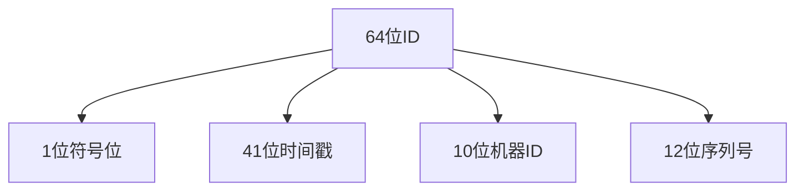
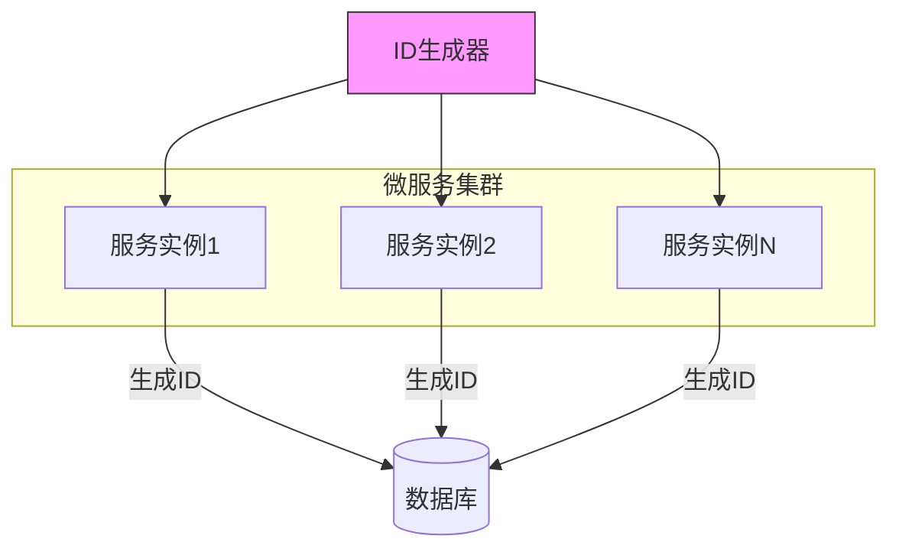
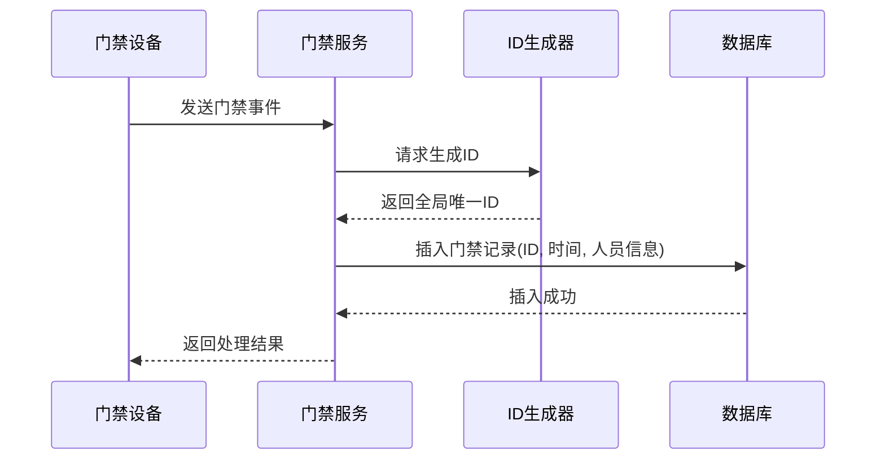

# ID生成器

<cite>
**本文档引用的文件**   
- [CLAUDE.md](file://CLAUDE.md#L1267-L1270)
- [全局架构规范.md](file://documentation/01-核心规范/架构规范/全局架构规范.md#L1012-L1015)
- [消费流水数据准确性与性能设计.md](file://documentation/03-业务模块/消费/15-消费流水数据准确性与性能设计.md#L207)
</cite>

## 目录
1. [引言](#引言)
2. [ID生成器概述](#id生成器概述)
3. [雪花算法原理](#雪花算法原理)
4. [时钟回拨问题处理](#时钟回拨问题处理)
5. [微服务架构下的主键冲突解决方案](#微服务架构下的主键冲突解决方案)
6. [最佳实践示例](#最佳实践示例)
7. [结论](#结论)

## 引言
在分布式系统中，全局唯一ID的生成是一个关键问题。特别是在微服务架构下，多个服务实例同时写入数据库时，传统的自增主键无法满足需求。本文档详细介绍了基于雪花算法（Snowflake）的ID生成器实现，以及其在门禁记录、消费流水和考勤数据等场景中的应用。

## ID生成器概述
ID生成器是基于雪花算法实现的分布式ID生成工具，能够生成全局唯一、趋势递增的64位长整型ID。该生成器在`microservices-common`模块中被设计为可复用的公共组件，供各个微服务调用使用。

**Section sources**
- [CLAUDE.md](file://CLAUDE.md#L1267-L1270)
- [全局架构规范.md](file://documentation/01-核心规范/架构规范/全局架构规范.md#L1012-L1015)

## 雪花算法原理
雪花算法生成的ID是一个64位的长整型数字，其结构如下：

**Diagram sources**
- [CLAUDE.md](file://CLAUDE.md#L1267-L1270)

### 组成部分详解
- **符号位（1位）**：始终为0，保证生成的ID为正数
- **时间戳（41位）**：记录时间毫秒值，可以使用约69年
- **机器ID（10位）**：支持部署1024个节点，可根据数据中心和机器编号分配
- **序列号（12位）**：每毫秒内序列号自增，支持每台机器每秒生成4096个ID

这种设计确保了在分布式环境下生成的ID既全局唯一，又具有趋势递增的特性，有利于数据库索引性能。

**Section sources**
- [CLAUDE.md](file://CLAUDE.md#L1267-L1270)

## 时钟回拨问题处理
时钟回拨是指系统时间被调整回退，可能导致生成重复ID的风险。ID生成器通过以下机制解决此问题：

1. **检测时钟回拨**：当获取的当前时间戳小于上次记录的时间戳时，判定为时钟回拨
2. **等待补偿**：在小范围时钟回拨（如几毫秒）情况下，等待系统时间追上
3. **异常抛出**：在大范围时钟回拨情况下，抛出异常并记录日志，需要人工干预

这种处理机制确保了即使在极端情况下，也不会生成重复的ID，保障了数据的完整性。

**Section sources**
- [CLAUDE.md](file://CLAUDE.md#L1267-L1270)

## 微服务架构下的主键冲突解决方案
在微服务架构中，多个服务实例同时写入数据库时，传统自增主键会导致主键冲突。ID生成器通过以下方式解决此问题：

**Diagram sources**
- [全局架构规范.md](file://documentation/01-核心规范/架构规范/全局架构规范.md#L1012-L1015)

### 解决方案优势
- **全局唯一性**：基于机器ID和序列号的组合，确保不同实例生成的ID不重复
- **高性能**：本地生成ID，无需访问数据库或网络请求
- **趋势递增**：有利于数据库B+树索引的性能
- **无单点故障**：每个服务实例均可独立生成ID

**Section sources**
- [全局架构规范.md](file://documentation/01-核心规范/架构规范/全局架构规范.md#L1012-L1015)

## 最佳实践示例
在创建门禁记录、消费流水或考勤数据时，使用ID生成器的最佳实践如下：

### 门禁记录创建

**Diagram sources**
- [CLAUDE.md](file://CLAUDE.md#L1267-L1270)

### 消费流水处理
在消费流水文档中明确指出，分布式唯一流水号应使用雪花算法生成：

> "生成流水号：分布式唯一流水号，使用Redis自增序列或雪花算法"

这确保了在高并发消费场景下，每笔交易都有唯一的标识，避免了数据冲突。

**Section sources**
- [消费流水数据准确性与性能设计.md](file://documentation/03-业务模块/消费/15-消费流水数据准确性与性能设计.md#L207)

### 考勤数据同步
在考勤系统中，多个考勤设备同时上传数据时，使用ID生成器可以确保：

1. 每条考勤记录都有全局唯一的ID
2. 不同设备上传的数据不会因主键冲突而失败
3. 数据按时间趋势递增，便于后续的数据分析和查询

## 结论
基于雪花算法的ID生成器是解决分布式系统中全局唯一ID生成问题的有效方案。它不仅解决了微服务架构下多个服务实例同时写入数据库时的主键冲突问题，还提供了高性能、高可用的ID生成服务。在门禁、消费、考勤等业务场景中，正确使用ID生成器可以确保数据的完整性和一致性，是构建可靠分布式系统的重要基础设施。