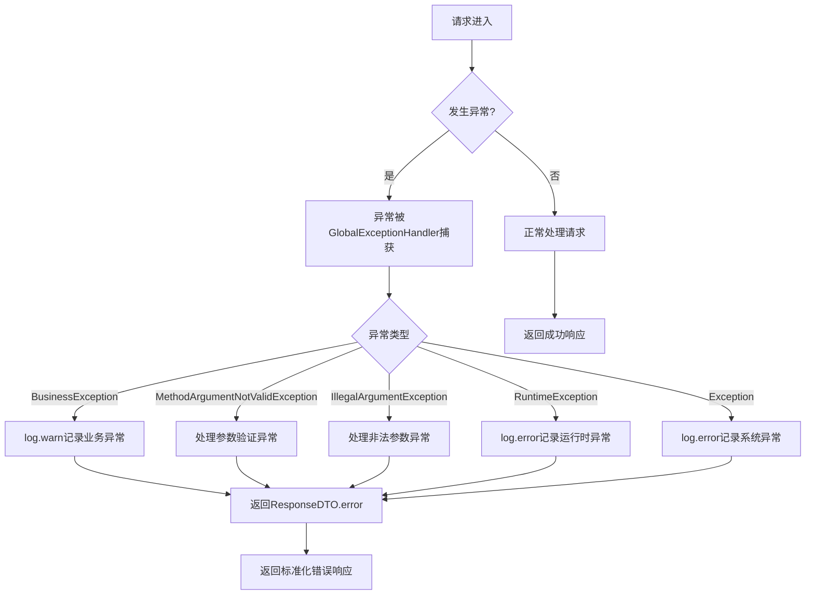

# 全局异常处理

<cite>
**本文档引用文件**  
- [BusinessException.java](file://microservices/microservices-common/src/main/java/net/lab1024/sa/common/exception/BusinessException.java)
- [ResponseDTO.java](file://microservices/microservices-common/src/main/java/net/lab1024/sa/common/dto/ResponseDTO.java)
- [PHASE3_TASK32_EXCEPTION_HANDLING_PLAN.md](file://documentation/archive/reports-2025-12-04/PHASE3_TASK32_EXCEPTION_HANDLING_PLAN.md)
- [PHASE3_TASK32_EXCEPTION_HANDLING_COMPLETE.md](file://documentation/archive/reports-2025-12-04/PHASE3_TASK32_EXCEPTION_HANDLING_COMPLETE.md)
- [Java编码规范.md](file://documentation/01-核心规范/开发规范/Java编码规范.md)
</cite>

## 目录
1. [引言](#引言)
2. [全局异常处理机制概述](#全局异常处理机制概述)
3. [核心组件分析](#核心组件分析)
4. [异常处理流程](#异常处理流程)
5. [统一响应格式设计](#统一响应格式设计)
6. [业务异常处理示例](#业务异常处理示例)
7. [最佳实践与规范](#最佳实践与规范)
8. [总结](#总结)

## 引言

在微服务架构中，统一的异常处理机制是确保系统稳定性和用户体验的关键。本文档详细说明了microservices-common模块中全局异常处理机制的设计与实现，重点介绍GlobalExceptionHandler如何通过@ControllerAdvice统一捕获和处理所有业务微服务中的异常，以及RestResponse统一响应格式的设计原理。

## 全局异常处理机制概述

系统采用集中式异常处理机制，通过@ControllerAdvice注解实现全局异常处理器，确保所有微服务的异常处理具有一致性。该机制将技术异常（如数据库异常、网络异常）和业务异常（如参数校验失败、权限不足）统一转化为前端友好的标准化错误响应。

全局异常处理机制的主要特点包括：
- 统一的异常处理入口
- 标准化的错误响应格式
- 完整的异常日志记录
- 生产环境异常信息脱敏
- 异常链追踪

**本文档引用文件**  
- [PHASE3_TASK32_EXCEPTION_HANDLING_COMPLETE.md](file://documentation/archive/reports-2025-12-04/PHASE3_TASK32_EXCEPTION_HANDLING_COMPLETE.md)
- [Java编码规范.md](file://documentation/01-核心规范/开发规范/Java编码规范.md)

## 核心组件分析

### BusinessException

BusinessException是系统中自定义的业务异常类，继承自RuntimeException，用于处理业务逻辑中的异常情况。该类包含错误码和错误信息，严格遵循CLAUDE.md规范。

```java
public class BusinessException extends RuntimeException {
    private final String code;
    private final Object[] args;
    
    // 构造函数
    public BusinessException(String message) {
        super(message);
        this.code = "BUSINESS_ERROR";
        this.args = null;
    }
    
    public BusinessException(String code, String message) {
        super(message);
        this.code = code;
        this.args = null;
    }
    
    public BusinessException(String code, String message, Object... args) {
        super(message);
        this.code = code;
        this.args = args;
    }
    
    // Getter方法
    public String getCode() {
        return code;
    }
    
    public Object[] getArgs() {
        return args;
    }
}
```

**本文档引用文件**  
- [BusinessException.java](file://microservices/microservices-common/src/main/java/net/lab1024/sa/common/exception/BusinessException.java)

### ResponseDTO

ResponseDTO是系统的统一响应DTO，定义了所有API接口的标准化响应格式。该类使用Lombok注解简化代码，包含状态码、消息、数据和时间戳等字段。

```java
@Data
@Builder
@NoArgsConstructor
@AllArgsConstructor
public class ResponseDTO<T> implements Serializable {
    private static final long serialVersionUID = 1L;
    
    private Integer code;
    private String message;
    private T data;
    private Long timestamp;
    
    // 静态工厂方法
    public static <T> ResponseDTO<T> ok() { /* ... */ }
    public static <T> ResponseDTO<T> ok(T data) { /* ... */ }
    public static <T> ResponseDTO<T> error(Integer code, String message) { /* ... */ }
    public static <T> ResponseDTO<T> error(String code, String message) { /* ... */ }
    // ... 其他静态方法
}
```

**本文档引用文件**  
- [ResponseDTO.java](file://microservices/microservices-common/src/main/java/net/lab1024/sa/common/dto/ResponseDTO.java)

## 异常处理流程

### 全局异常处理器

系统为每个微服务创建了独立的全局异常处理器，如ConsumeGlobalExceptionHandler、AttendanceGlobalExceptionHandler等。这些处理器使用@RestControllerAdvice注解，确保能够捕获所有Controller层的异常。

```java
@Slf4j
@RestControllerAdvice
public class XxxGlobalExceptionHandler {
    
    @ExceptionHandler(BusinessException.class)
    @ResponseStatus(HttpStatus.BAD_REQUEST)
    public ResponseDTO<Void> handleBusinessException(BusinessException e) {
        log.warn("业务异常: code={}, message={}", e.getCode(), e.getMessage(), e);
        return ResponseDTO.error(e.getCode(), e.getMessage());
    }
    
    @ExceptionHandler(MethodArgumentNotValidException.class)
    @ResponseStatus(HttpStatus.BAD_REQUEST)
    public ResponseDTO<Map<String, String>> handleMethodArgumentNotValidException(MethodArgumentNotValidException e) {
        // 处理参数验证异常
    }
    
    @ExceptionHandler(Exception.class)
    @ResponseStatus(HttpStatus.INTERNAL_SERVER_ERROR)
    public ResponseDTO<Void> handleException(Exception e) {
        log.error("系统异常", e);
        return ResponseDTO.error(500, "系统异常，请联系管理员");
    }
}
```

### 异常处理优先级

异常处理遵循特定的优先级顺序：
1. 业务异常（BusinessException）
2. 参数验证异常（MethodArgumentNotValidException、BindException）
3. 约束违反异常（ConstraintViolationException）
4. 非法参数异常（IllegalArgumentException）
5. 运行时异常（RuntimeException）
6. 通用异常（Exception）

这种分层处理机制确保了异常能够被最合适的处理器捕获和处理。

**本文档引用文件**  
- [PHASE3_TASK32_EXCEPTION_HANDLING_PLAN.md](file://documentation/archive/reports-2025-12-04/PHASE3_TASK32_EXCEPTION_HANDLING_PLAN.md)
- [PHASE3_TASK32_EXCEPTION_HANDLING_COMPLETE.md](file://documentation/archive/reports-2025-12-04/PHASE3_TASK32_EXCEPTION_HANDLING_COMPLETE.md)

## 统一响应格式设计

### 响应结构

统一响应格式包含以下核心字段：
- **code**: 状态码（200-成功，400-499客户端错误，500-599服务端错误，1000+业务错误码）
- **message**: 消息描述
- **data**: 响应数据（泛型）
- **timestamp**: 时间戳（毫秒）

### 状态码规范

| 状态码范围 | 含义 |
|-----------|------|
| 200 | 成功 |
| 400-499 | 客户端错误 |
| 500-599 | 服务端错误 |
| 1000+ | 业务错误码 |

### 静态工厂方法

ResponseDTO提供了丰富的静态工厂方法，简化了响应的创建：

```java
// 成功响应
ResponseDTO.ok();
ResponseDTO.ok(data);
ResponseDTO.ok("自定义消息", data);

// 错误响应
ResponseDTO.error(500, "系统错误");
ResponseDTO.error("BUSINESS_ERROR", "业务异常");
ResponseDTO.errorParam("参数错误");
ResponseDTO.errorNotFound("资源未找到");
```

**本文档引用文件**  
- [ResponseDTO.java](file://microservices/microservices-common/src/main/java/net/lab1024/sa/common/dto/ResponseDTO.java)

## 业务异常处理示例

### 在消费服务中抛出业务异常

```java
@Service
public class PaymentService {
    
    public void processPayment(PaymentRequest request) {
        if (request.getAmount() <= 0) {
            throw new BusinessException("INVALID_AMOUNT", "支付金额必须大于0");
        }
        
        if (request.getPaymentMethod() == null) {
            throw new BusinessException("PAYMENT_METHOD_REQUIRED", "支付方式不能为空");
        }
        
        try {
            // 支付处理逻辑
            paymentProcessor.process(request);
        } catch (PaymentException e) {
            log.error("支付处理失败", e);
            throw new BusinessException("PAYMENT_PROCESSING_ERROR", "支付处理失败: " + e.getMessage(), e);
        }
    }
}
```

### 在访客服务中处理业务异常

```java
@RestController
@RequestMapping("/api/visitor")
public class VisitorController {
    
    @PostMapping("/register")
    public ResponseDTO<String> registerVisitor(@Valid @RequestBody VisitorRegisterForm form) {
        try {
            String visitorId = visitorService.register(form);
            return ResponseDTO.ok("访客注册成功", visitorId);
        } catch (BusinessException e) {
            // 异常会被全局处理器捕获，无需在此处处理
            throw e;
        }
    }
}
```

### 全局异常处理器处理流程



**本文档引用文件**  
- [PHASE3_TASK32_EXCEPTION_HANDLING_PLAN.md](file://documentation/archive/reports-2025-12-04/PHASE3_TASK32_EXCEPTION_HANDLING_PLAN.md)
- [BusinessException.java](file://microservices/microservices-common/src/main/java/net/lab1024/sa/common/exception/BusinessException.java)

## 最佳实践与规范

### 异常处理最佳实践

1. **业务异常优先**: 先捕获业务异常，再捕获通用异常
2. **错误码规范**: 使用有意义的错误码字符串，便于问题定位
3. **异常信息完整**: 包含错误码、消息和原因异常
4. **日志级别合理**: 业务异常使用WARN，系统异常使用ERROR
5. **避免敏感信息泄露**: 生产环境异常信息脱敏

### 代码规范要求

- 所有微服务都必须有全局异常处理器
- Service层统一使用业务异常
- Controller层移除@ExceptionHandler（由全局处理器统一处理）
- 异常日志记录规范统一
- 统一使用ResponseDTO格式

### 异常处理改进效果

- **异常处理集中**: 异常处理逻辑集中在全局异常处理器中
- **错误码规范**: 使用有意义的错误码，便于问题定位
- **代码简洁**: Controller层不再需要异常处理代码
- **可维护性提升**: 异常处理逻辑统一，便于维护和扩展

**本文档引用文件**  
- [PHASE3_TASK32_EXCEPTION_HANDLING_COMPLETE.md](file://documentation/archive/reports-2025-12-04/PHASE3_TASK32_EXCEPTION_HANDLING_COMPLETE.md)
- [Java编码规范.md](file://documentation/01-核心规范/开发规范/Java编码规范.md)

## 总结

microservices-common模块中的全局异常处理机制通过GlobalExceptionHandler和ResponseDTO实现了统一的异常处理和响应格式。该机制将技术异常和业务异常转化为前端友好的标准化错误响应，提高了系统的稳定性和用户体验。

通过为每个微服务创建独立的全局异常处理器，系统实现了异常处理的集中化和规范化。BusinessException类的设计确保了业务异常的可追溯性和可维护性，而ResponseDTO的统一响应格式则简化了前端对API响应的处理。

该机制的成功实施显著提升了系统的可维护性和开发效率，为微服务架构的稳定运行提供了有力保障。