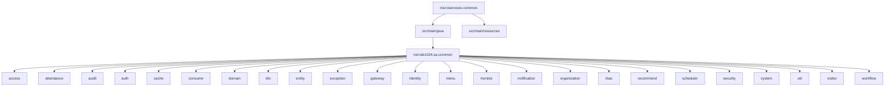
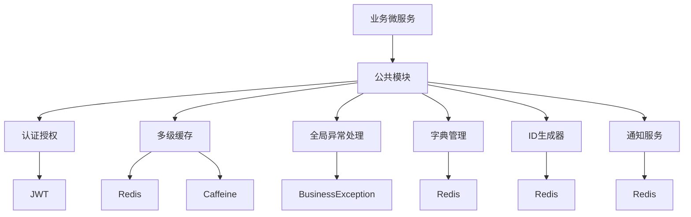
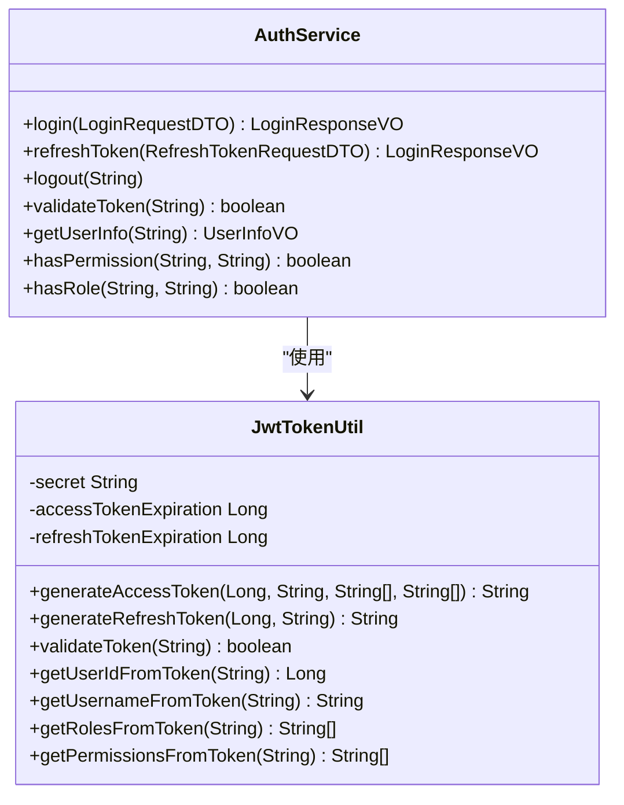
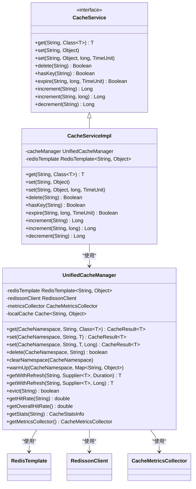
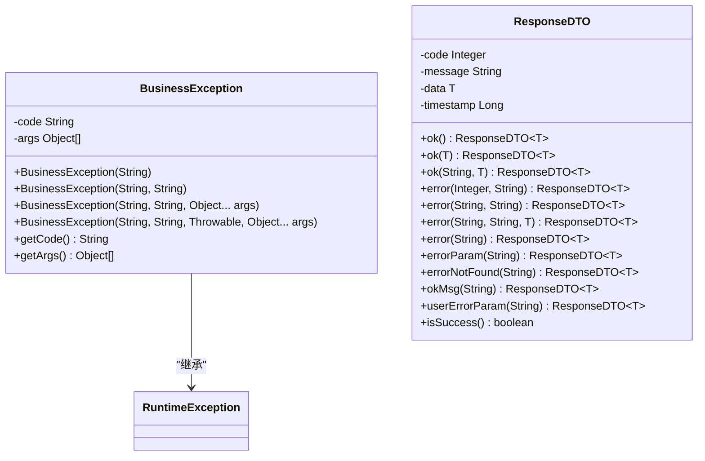
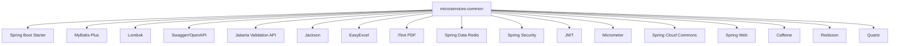

# 公共模块 (microservices-common)

<cite>
**本文档引用的文件**  
- [pom.xml](file://microservices/microservices-common/pom.xml)
- [CacheServiceImpl.java](file://microservices/microservices-common/src/main/java/net/lab1024/sa/common/cache/CacheServiceImpl.java)
- [UnifiedCacheManager.java](file://microservices/microservices-common/src/main/java/net/lab1024/sa/common/cache/UnifiedCacheManager.java)
- [AuthService.java](file://microservices/microservices-common/src/main/java/net/lab1024/sa/common/auth/service/AuthService.java)
- [JwtTokenUtil.java](file://microservices/microservices-common/src/main/java/net/lab1024/sa/common/auth/util/JwtTokenUtil.java)
- [BusinessException.java](file://microservices/microservices-common/src/main/java/net/lab1024/sa/common/exception/BusinessException.java)
- [ResponseDTO.java](file://microservices/microservices-common/src/main/java/net/lab1024/sa/common/dto/ResponseDTO.java)
- [RedisUtil.java](file://microservices/microservices-common/src/main/java/net/lab1024/sa/common/util/RedisUtil.java)
</cite>

## 目录
1. [简介](#简介)
2. [项目结构](#项目结构)
3. [核心组件](#核心组件)
4. [架构概述](#架构概述)
5. [详细组件分析](#详细组件分析)
6. [依赖分析](#依赖分析)
7. [性能考虑](#性能考虑)
8. [故障排除指南](#故障排除指南)
9. [结论](#结论)

## 简介
microservices-common 公共模块是 IOE-DREAM 微服务架构中的基础依赖模块，为所有业务微服务提供统一的核心功能组件。该模块通过 Maven 依赖的方式被各个业务微服务引入，实现了代码的复用和标准化，避免了重复开发。公共模块包含统一的认证授权、多级缓存、全局异常处理、字典管理、ID生成器、通知服务等核心功能，确保了整个系统的一致性和可维护性。

## 项目结构
microservices-common 模块的项目结构遵循标准的 Maven 项目布局，主要包含 Java 源代码和资源文件。源代码按照功能领域进行组织，如 auth（认证）、cache（缓存）、exception（异常处理）、dto（数据传输对象）等，确保了代码的高内聚和低耦合。

**Diagram sources**
- [pom.xml](file://microservices/microservices-common/pom.xml)

**Section sources**
- [pom.xml](file://microservices/microservices-common/pom.xml)

## 核心组件
microservices-common 模块提供了多个核心功能组件，这些组件是所有业务微服务的基础。主要包括统一的认证授权（基于 Sa-Token 集成）、多级缓存（Redis+Caffeine）、全局异常处理、字典管理、ID生成器和通知服务等。这些组件通过标准化的接口和实现，确保了各微服务在处理这些通用功能时的一致性。

**Section sources**
- [pom.xml](file://microservices/microservices-common/pom.xml)
- [CacheServiceImpl.java](file://microservices/microservices-common/src/main/java/net/lab1024/sa/common/cache/CacheServiceImpl.java)
- [AuthService.java](file://microservices/microservices-common/src/main/java/net/lab1024/sa/common/auth/service/AuthService.java)
- [BusinessException.java](file://microservices/microservices-common/src/main/java/net/lab1024/sa/common/exception/BusinessException.java)
- [ResponseDTO.java](file://microservices/microservices-common/src/main/java/net/lab1024/sa/common/dto/ResponseDTO.java)

## 架构概述
microservices-common 模块的架构设计旨在提供一个高内聚、低耦合的基础平台。该模块通过定义清晰的接口和抽象类，将通用功能封装起来，并通过依赖注入的方式提供给业务微服务使用。这种设计模式不仅提高了代码的复用率，还增强了系统的可扩展性和可维护性。

**Diagram sources**
- [pom.xml](file://microservices/microservices-common/pom.xml)

## 详细组件分析

### 认证授权组件分析
认证授权组件是 microservices-common 模块的核心之一，负责处理用户的登录、登出、权限验证等操作。该组件基于 Sa-Token 框架集成，提供了统一的认证服务接口和实现。

#### 对象导向组件

**Diagram sources**
- [AuthService.java](file://microservices/microservices-common/src/main/java/net/lab1024/sa/common/auth/service/AuthService.java)
- [JwtTokenUtil.java](file://microservices/microservices-common/src/main/java/net/lab1024/sa/common/auth/util/JwtTokenUtil.java)

### 多级缓存组件分析
多级缓存组件实现了 L1 本地缓存（Caffeine）和 L2 分布式缓存（Redis）的结合，提供了高性能的缓存解决方案。该组件通过统一的缓存管理器 `UnifiedCacheManager` 和缓存服务 `CacheService`，简化了缓存的使用。

#### 对象导向组件

**Diagram sources**
- [CacheServiceImpl.java](file://microservices/microservices-common/src/main/java/net/lab1024/sa/common/cache/CacheServiceImpl.java)
- [UnifiedCacheManager.java](file://microservices/microservices-common/src/main/java/net/lab1024/sa/common/cache/UnifiedCacheManager.java)

### 全局异常处理组件分析
全局异常处理组件通过自定义异常类 `BusinessException` 和统一的响应 DTO `ResponseDTO`，实现了对业务异常的统一管理和响应。这使得业务微服务可以专注于业务逻辑，而无需关心异常的处理细节。

#### 对象导向组件

**Diagram sources**
- [BusinessException.java](file://microservices/microservices-common/src/main/java/net/lab1024/sa/common/exception/BusinessException.java)
- [ResponseDTO.java](file://microservices/microservices-common/src/main/java/net/lab1024/sa/common/dto/ResponseDTO.java)

## 依赖分析
microservices-common 模块依赖于多个第三方库，这些库提供了必要的功能支持。主要依赖包括 Spring Boot Starter、MyBatis-Plus、Lombok、Swagger/OpenAPI、Jakarta Validation API、Jackson、EasyExcel、iText PDF、Spring Data Redis、Spring Security、JWT、Micrometer、Spring Cloud Commons、Spring Web、Caffeine、Redisson 和 Quartz。

**Diagram sources**
- [pom.xml](file://microservices/microservices-common/pom.xml)

**Section sources**
- [pom.xml](file://microservices/microservices-common/pom.xml)

## 性能考虑
microservices-common 模块在设计时充分考虑了性能因素。多级缓存机制有效减少了对数据库的访问压力，提高了系统的响应速度。通过使用 Caffeine 作为本地缓存，可以在内存中快速访问热点数据；而 Redis 作为分布式缓存，保证了数据的一致性和高可用性。此外，`UnifiedCacheManager` 中的缓存击穿防护和空值缓存机制，进一步提升了系统的稳定性和性能。

## 故障排除指南
在使用 microservices-common 模块时，可能会遇到一些常见问题。例如，缓存未命中、认证失败、异常处理不当等。针对这些问题，建议首先检查配置文件中的相关设置，确保各项参数正确无误。其次，查看日志输出，定位问题的具体原因。最后，参考文档中的示例代码，确保调用方式正确。

**Section sources**
- [CacheServiceImpl.java](file://microservices/microservices-common/src/main/java/net/lab1024/sa/common/cache/CacheServiceImpl.java)
- [AuthService.java](file://microservices/microservices-common/src/main/java/net/lab1024/sa/common/auth/service/AuthService.java)
- [BusinessException.java](file://microservices/microservices-common/src/main/java/net/lab1024/sa/common/exception/BusinessException.java)
- [ResponseDTO.java](file://microservices/microservices-common/src/main/java/net/lab1024/sa/common/dto/ResponseDTO.java)

## 结论
microservices-common 公共模块作为 IOE-DREAM 微服务架构的基础，提供了统一的认证授权、多级缓存、全局异常处理、字典管理、ID生成器和通知服务等核心功能。通过 Maven 依赖的方式，各业务微服务可以方便地引入并使用这些组件，实现了代码的复用和标准化，提高了开发效率和系统的一致性。未来，该模块将继续优化现有功能，并根据业务需求添加新的通用组件，以支持更复杂的业务场景。