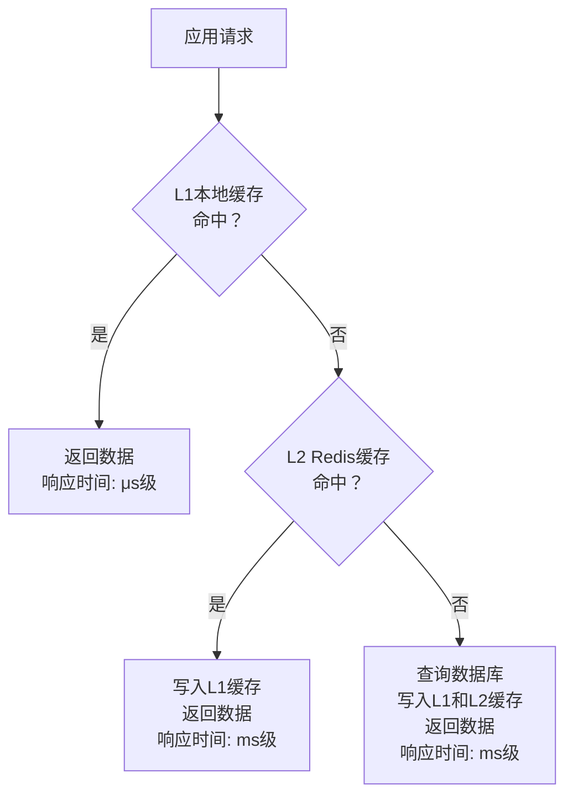
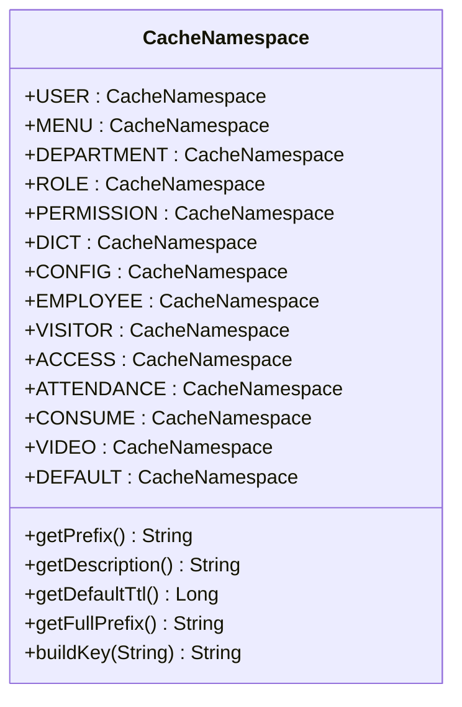
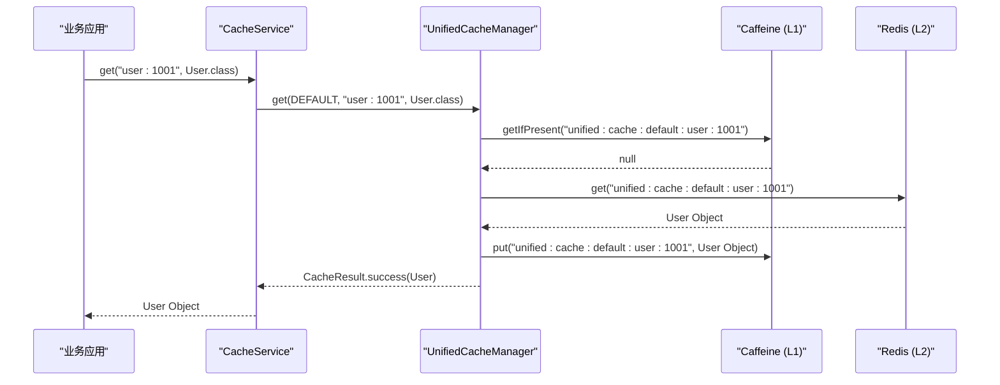

# 多级缓存

<cite>
**本文档引用文件**  
- [UnifiedCacheManager.java](file://microservices\microservices-common\src\main\java\net\lab1024\sa\common\cache\UnifiedCacheManager.java)
- [CacheNamespace.java](file://microservices\microservices-common\src\main\java\net\lab1024\sa\common\cache\CacheNamespace.java)
- [CacheMetricsCollector.java](file://microservices\microservices-common\src\main\java\net\lab1024\sa\common\cache\CacheMetricsCollector.java)
- [CacheService.java](file://microservices\microservices-common\src\main\java\net\lab1024\sa\common\cache\CacheService.java)
- [CacheServiceImpl.java](file://microservices\microservices-common\src\main\java\net\lab1024\sa\common\cache\CacheServiceImpl.java)
- [AccessDeviceServiceImpl.java](file://microservices\ioedream-access-service\src\main\java\net\lab1024\sa\access\service\impl\AccessDeviceServiceImpl.java)
- [AttendanceRecordServiceImpl.java](file://microservices\ioedream-attendance-service\src\main\java\net\lab1024\sa\attendance\service\impl\AttendanceRecordServiceImpl.java)
</cite>

## 目录
1. [引言](#引言)
2. [多级缓存架构设计](#多级缓存架构设计)
3. [核心组件分析](#核心组件分析)
4. [缓存配置与使用方法](#缓存配置与使用方法)
5. [缓存防护策略](#缓存防护策略)
6. [业务应用案例](#业务应用案例)
7. [性能监控与指标](#性能监控与指标)
8. [总结](#总结)

## 引言

在现代微服务架构中，高性能的数据访问是系统稳定运行的关键。为了应对高并发场景下的数据查询压力，本系统在`microservices-common`模块中设计并实现了多级缓存机制。该机制结合了Redis（分布式缓存）和Caffeine（本地缓存），构建了一个高效、可靠的缓存体系。

多级缓存通过将热点数据存储在不同层级的缓存中，显著降低了数据库的访问压力，提升了系统的响应速度和吞吐量。本文档将详细介绍该多级缓存机制的设计原理、核心组件、配置方法、防护策略以及在门禁、考勤等业务服务中的实际应用。

## 多级缓存架构设计

本系统的多级缓存采用L1（本地缓存）+ L2（分布式缓存）的两级架构模式。L1缓存使用Caffeine实现，部署在应用服务器本地内存中，提供微秒级的访问速度；L2缓存使用Redis实现，作为集群共享的分布式缓存，确保数据的一致性和高可用性。

当应用需要获取数据时，缓存访问流程如下：
1. 首先查询L1本地缓存，如果命中则直接返回。
2. 如果L1未命中，则查询L2 Redis缓存，如果命中则将数据写入L1并返回。
3. 如果L2也未命中，则从数据库加载数据，同时写入L1和L2缓存，以备后续请求使用。

这种设计充分利用了本地缓存的高速访问优势和分布式缓存的共享特性，在保证性能的同时，也避免了缓存数据不一致的问题。

**图示来源**  
- [UnifiedCacheManager.java](file://microservices\microservices-common\src\main\java\net\lab1024\sa\common\cache\UnifiedCacheManager.java#L130-L184)

## 核心组件分析

### UnifiedCacheManager

`UnifiedCacheManager`是多级缓存的核心管理类，负责协调L1和L2缓存的读写操作。该类遵循CLAUDE.md规范，作为纯Java类不使用Spring注解，通过构造函数注入`RedisTemplate`、`RedissonClient`和`MeterRegistry`等依赖。

其主要功能包括：
- **多级缓存读取**：`get`方法实现L1→L2→DB的逐级查询策略。
- **多级缓存写入**：`set`方法同时写入L1和L2缓存，保证数据一致性。
- **缓存删除**：`delete`方法同步清除L1和L2中的缓存项。
- **命名空间管理**：通过`CacheNamespace`枚举统一管理缓存键的前缀和过期时间。

**组件来源**  
- [UnifiedCacheManager.java](file://microservices\microservices-common\src\main\java\net\lab1024\sa\common\cache\UnifiedCacheManager.java#L43-L532)

### CacheNamespace

`CacheNamespace`是一个枚举类，用于统一管理所有缓存的命名空间。每个命名空间定义了前缀、描述和默认过期时间，确保了缓存键的标准化和规范化。

例如，门禁缓存（ACCESS）的过期时间为600秒，考勤缓存（ATTENDANCE）为1800秒，字典缓存（DICT）为86400秒。这种差异化配置策略，使得不同业务场景的缓存数据能够根据其更新频率和重要性，设置合理的过期时间。

**图示来源**  
- [CacheNamespace.java](file://microservices\microservices-common\src\main\java\net\lab1024\sa\common\cache\CacheNamespace.java#L22-L149)

### CacheMetricsCollector

`CacheMetricsCollector`是缓存指标收集器，用于监控缓存的命中率、响应时间等性能指标。它通过Micrometer框架将指标暴露给Prometheus，实现了对缓存健康状况的实时监控。

该组件记录了L1、L2和DB三个层级的命中与未命中次数，并计算总体命中率。这些指标对于评估缓存效果、优化缓存策略具有重要意义。

**组件来源**  
- [CacheMetricsCollector.java](file://microservices\microservices-common\src\main\java\net\lab1024\sa\common\cache\CacheMetricsCollector.java#L29-L219)

## 缓存配置与使用方法

### RedisCacheManager与CaffeineCacheManager配置

在本系统中，`UnifiedCacheManager`封装了对Redis和Caffeine的管理，开发者无需直接操作`RedisCacheManager`或`CaffeineCacheManager`。具体的配置通过Spring Boot的自动配置机制完成。

- **Redis配置**：通过`spring.redis`配置项设置连接信息，使用`RedisTemplate<String, Object>`进行序列化操作。
- **Caffeine配置**：在`UnifiedCacheManager`中硬编码配置，L1缓存最大容量为10000，过期时间为5分钟。

### @Cache注解的使用

虽然本系统未直接使用Spring的`@Cache`注解，但提供了功能类似的`CacheService`接口。开发者可以通过注入`CacheService`来实现缓存操作。

`CacheService`接口定义了以下方法：
- `get(key, clazz)`：根据键获取缓存值。
- `set(key, value)`：设置缓存值，使用默认过期时间。
- `set(key, value, timeout, unit)`：设置缓存值，并指定过期时间。
- `delete(key)`：删除缓存。
- `hasKey(key)`：判断缓存是否存在。

**图示来源**  
- [CacheServiceImpl.java](file://microservices\microservices-common\src\main\java\net\lab1024\sa\common\cache\CacheServiceImpl.java#L55-L68)
- [UnifiedCacheManager.java](file://microservices\microservices-common\src\main\java\net\lab1024\sa\common\cache\UnifiedCacheManager.java#L142-L184)

## 缓存防护策略

### 缓存穿透防护

缓存穿透是指查询一个不存在的数据，导致每次请求都穿透到数据库。本系统通过`getWithRefresh`方法中的空值缓存策略来防护。

当数据加载器返回`null`时，系统会将一个特殊值（如"NULL"）写入Redis缓存，并设置较短的过期时间（300秒），防止同一无效请求反复冲击数据库。

### 缓存击穿防护

缓存击穿是指某个热点数据在过期的瞬间，大量并发请求同时穿透到数据库。本系统通过Redisson的分布式锁来防护。

在`getWithRefresh`方法中，当L1和L2均未命中时，会尝试获取一个基于缓存键的分布式锁。只有获取到锁的线程才能执行数据加载，其他线程会等待并重试，从而避免了大量请求同时访问数据库。

### 缓存雪崩防护

缓存雪崩是指大量缓存数据在同一时间过期，导致数据库压力骤增。本系统通过以下策略防护：
- **差异化过期时间**：不同业务的缓存设置了不同的过期时间，避免同时过期。
- **永不过期策略**：对于极少更新的静态数据（如字典），采用后台定时刷新的策略，而非设置过期时间。
- **缓存预热**：在系统启动或低峰期，通过`warmUp`方法预先加载热点数据到缓存中。

## 业务应用案例

### 门禁服务中的缓存应用

在门禁服务中，设备信息、区域信息和用户权限是高频访问的数据。通过`AccessDeviceServiceImpl`中的`getAreaById`方法，可以看到缓存的使用。

当查询设备详情时，系统会通过网关调用公共服务获取区域信息。该区域信息会被`UnifiedCacheManager`自动缓存，后续请求将直接从L1或L2缓存中获取，避免了重复的远程调用。

**案例来源**  
- [AccessDeviceServiceImpl.java](file://microservices\ioedream-access-service\src\main\java\net\lab1024\sa\access\service\impl\AccessDeviceServiceImpl.java#L593-L606)

### 考勤服务中的缓存应用

在考勤服务中，考勤记录的查询和统计是核心功能。`AttendanceRecordServiceImpl`中的`queryAttendanceRecords`方法会频繁访问数据库。

通过将常用的查询条件（如员工ID、日期范围）组合成缓存键，可以将查询结果缓存起来。当相同条件的请求再次到来时，可以直接返回缓存结果，极大地提升了查询性能。

**案例来源**  
- [AttendanceRecordServiceImpl.java](file://microservices\ioedream-attendance-service\src\main\java\net\lab1024\sa\attendance\service\impl\AttendanceRecordServiceImpl.java#L51-L118)

## 性能监控与指标

系统通过`CacheMetricsCollector`收集了详细的缓存性能指标，并通过Micrometer暴露给Prometheus。关键监控指标包括：

| 指标名称 | 说明 | 采集方式 |
| :--- | :--- | :--- |
| `cache.hit` | 缓存命中次数 | Micrometer Counter |
| `cache.miss` | 缓存未命中次数 | Micrometer Counter |
| `cache.response.time` | 缓存响应时间 | Micrometer Timer |
| `cache.hit.rate` | 缓存命中率 | 计算得出 |

通过Grafana等可视化工具，可以实时监控缓存的命中率变化趋势。建议将L1缓存命中率维持在80%以上，总体缓存命中率维持在95%以上，以确保系统性能处于最佳状态。

**指标来源**  
- [CacheMetricsCollector.java](file://microservices\microservices-common\src\main\java\net\lab1024\sa\common\cache\CacheMetricsCollector.java#L52-L112)

## 总结

本文档详细介绍了`microservices-common`模块中的多级缓存机制。该机制通过整合Caffeine和Redis，构建了一个高性能、高可用的缓存体系。`UnifiedCacheManager`作为核心组件，实现了多级缓存的统一管理，并集成了缓存击穿、穿透、雪崩的防护策略。

通过在门禁、考勤等业务服务中的实际应用，证明了该多级缓存机制能够有效提升系统性能，降低数据库压力。同时，完善的监控指标体系为缓存的优化和维护提供了有力支持。

未来，可以进一步探索缓存数据的主动失效机制和更智能的缓存预热策略，以应对更加复杂的业务场景。