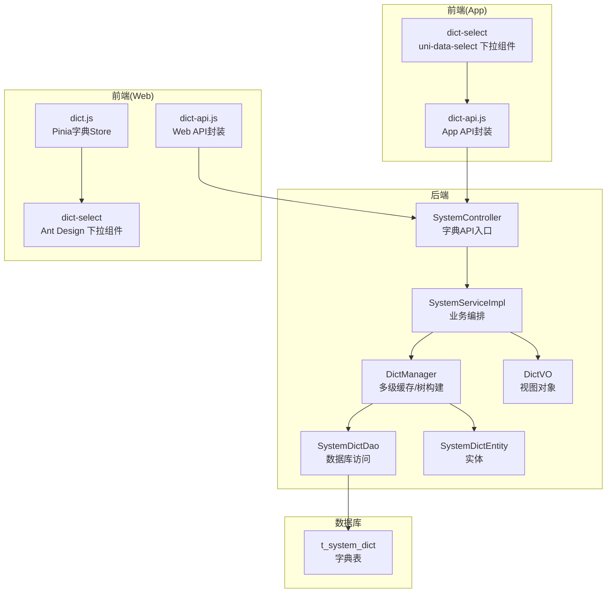
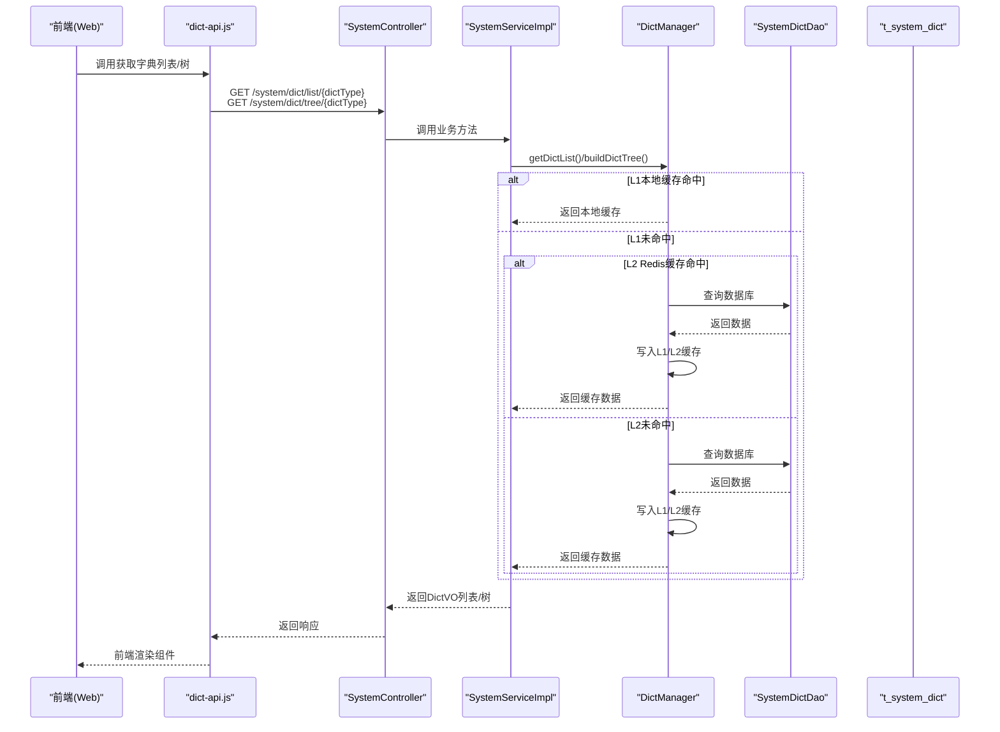
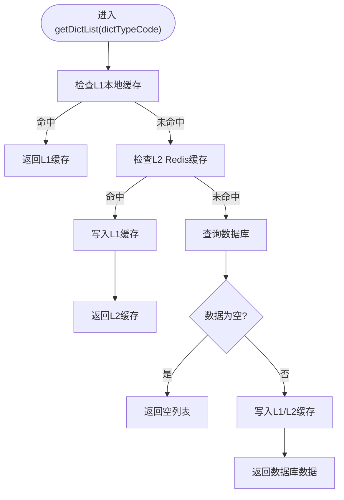
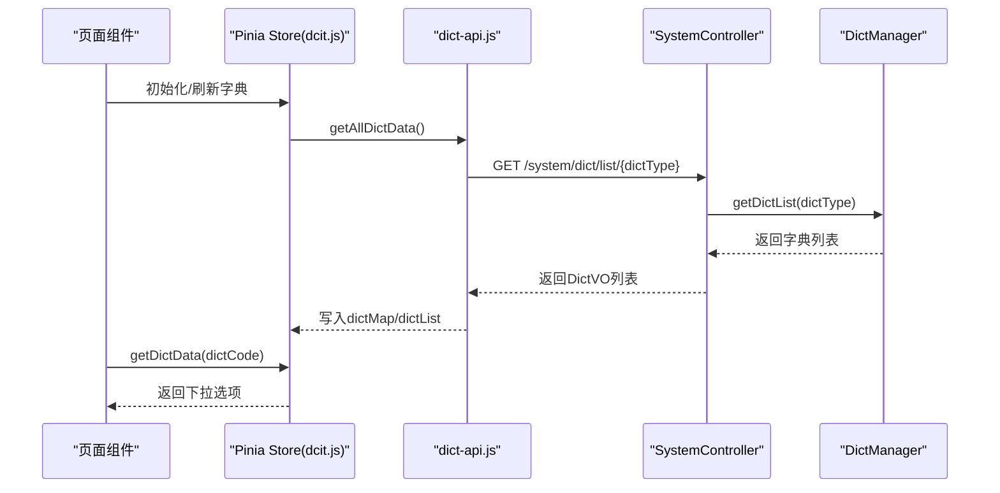
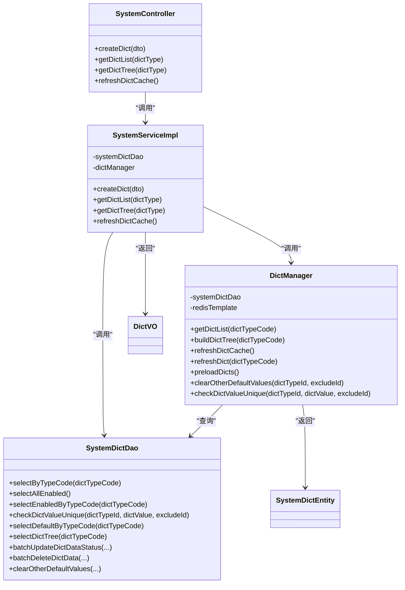

# 字典管理

<cite>
**本文引用的文件**
- [DictManager.java](file://microservices/microservices-common/src/main/java/net/lab1024/sa/common/system/manager/DictManager.java)
- [SystemDictDao.java](file://microservices/microservices-common/src/main/java/net/lab1024/sa/common/system/dao/SystemDictDao.java)
- [SystemController.java](file://microservices/microservices-common/src/main/java/net/lab1024/sa/common/system/controller/SystemController.java)
- [SystemServiceImpl.java](file://microservices/microservices-common/src/main/java/net/lab1024/sa/common/system/service/impl/SystemServiceImpl.java)
- [DictVO.java](file://microservices/microservices-common/src/main/java/net/lab1024/sa/common/system/domain/vo/DictVO.java)
- [SystemDictEntity.java](file://microservices/microservices-common/src/main/java/net/lab1024/sa/common/system/domain/entity/SystemDictEntity.java)
- [t_system_dict.sql](file://database-scripts/common-service/17-t_system_dict.sql)
- [dict-api.js（Web）](file://smart-admin-web-javascript/src/api/support/dict-api.js)
- [dict.js（Web Store）](file://smart-admin-web-javascript/src/store/modules/system/dict.js)
- [dict-select（Web 组件）](file://smart-admin-web-javascript/src/components/support/dict-select/index.vue)
- [dict-api.js（App）](file://smart-app/src/api/support/dict-api.js)
- [dict-select（App 组件）](file://smart-app/src/components/dict-select/index.vue)
</cite>

## 目录
1. [简介](#简介)
2. [项目结构](#项目结构)
3. [核心组件](#核心组件)
4. [架构总览](#架构总览)
5. [详细组件分析](#详细组件分析)
6. [依赖关系分析](#依赖关系分析)
7. [性能考量](#性能考量)
8. [故障排查指南](#故障排查指南)
9. [结论](#结论)
10. [附录](#附录)

## 简介
本文件面向 microservices-common 模块中的“字典管理”能力，系统化说明 DictManager 如何提供统一的字典数据查询与缓存服务，覆盖数据库表 t_system_dict 的设计、DAO 层访问、多级缓存策略，以及业务服务（门禁、消费等）与前端组件（dict-select）如何调用字典 API 获取列表或进行业务逻辑判断。文档同时给出端到端的集成流程，帮助开发者快速理解与落地。

## 项目结构
- 后端（microservices-common）
  - 控制层：SystemController 提供字典相关 API
  - 服务层：SystemServiceImpl 调用 DictManager
  - 管理层：DictManager 实现多级缓存与字典树构建
  - DAO 层：SystemDictDao 提供字典数据访问
  - 数据模型：SystemDictEntity、DictVO
- 数据库：t_system_dict 表定义
- 前端（Web）
  - API：dict-api.js
  - Store：dict.js（全局字典缓存）
  - 组件：dict-select（下拉选择）
- 前端（App）
  - API：dict-api.js
  - 组件：dict-select（下拉选择）

图表来源
- [SystemController.java](file://microservices/microservices-common/src/main/java/net/lab1024/sa/common/system/controller/SystemController.java#L70-L102)
- [SystemServiceImpl.java](file://microservices/microservices-common/src/main/java/net/lab1024/sa/common/system/service/impl/SystemServiceImpl.java#L1-L75)
- [DictManager.java](file://microservices/microservices-common/src/main/java/net/lab1024/sa/common/system/manager/DictManager.java#L1-L194)
- [SystemDictDao.java](file://microservices/microservices-common/src/main/java/net/lab1024/sa/common/system/dao/SystemDictDao.java#L1-L249)
- [SystemDictEntity.java](file://microservices/microservices-common/src/main/java/net/lab1024/sa/common/system/domain/entity/SystemDictEntity.java#L1-L38)
- [DictVO.java](file://microservices/microservices-common/src/main/java/net/lab1024/sa/common/system/domain/vo/DictVO.java#L1-L31)
- [t_system_dict.sql](file://database-scripts/common-service/17-t_system_dict.sql#L1-L31)
- [dict-api.js（Web）](file://smart-admin-web-javascript/src/api/support/dict-api.js#L1-L75)
- [dict.js（Web Store）](file://smart-admin-web-javascript/src/store/modules/system/dict.js#L1-L87)
- [dict-select（Web 组件）](file://smart-admin-web-javascript/src/components/support/dict-select/index.vue#L1-L80)
- [dict-api.js（App）](file://smart-app/src/api/support/dict-api.js#L1-L59)
- [dict-select（App 组件）](file://smart-app/src/components/dict-select/index.vue#L1-L55)

章节来源
- [SystemController.java](file://microservices/microservices-common/src/main/java/net/lab1024/sa/common/system/controller/SystemController.java#L70-L102)
- [t_system_dict.sql](file://database-scripts/common-service/17-t_system_dict.sql#L1-L31)

## 核心组件
- DictManager：负责多级缓存（L1 本地 + L2 Redis）、字典树构建、字典值唯一性校验、默认值清理、预热等
- SystemDictDao：基于 MyBatis 的数据访问接口，提供按类型、状态、默认值、唯一性校验等查询
- SystemController：对外暴露字典 API（创建、列表、树、刷新缓存）
- SystemServiceImpl：服务编排，调用 DictManager 完成业务逻辑
- SystemDictEntity/DictVO：数据模型与视图对象
- 前端 Store 与组件：统一缓存与渲染字典数据

章节来源
- [DictManager.java](file://microservices/microservices-common/src/main/java/net/lab1024/sa/common/system/manager/DictManager.java#L1-L194)
- [SystemDictDao.java](file://microservices/microservices-common/src/main/java/net/lab1024/sa/common/system/dao/SystemDictDao.java#L1-L249)
- [SystemController.java](file://microservices/microservices-common/src/main/java/net/lab1024/sa/common/system/controller/SystemController.java#L70-L102)
- [SystemServiceImpl.java](file://microservices/microservices-common/src/main/java/net/lab1024/sa/common/system/service/impl/SystemServiceImpl.java#L1-L75)
- [SystemDictEntity.java](file://microservices/microservices-common/src/main/java/net/lab1024/sa/common/system/domain/entity/SystemDictEntity.java#L1-L38)
- [DictVO.java](file://microservices/microservices-common/src/main/java/net/lab1024/sa/common/system/domain/vo/DictVO.java#L1-L31)

## 架构总览
后端采用“Controller -> Service -> Manager -> DAO -> DB”的分层架构；字典查询通过 DictManager 的多级缓存策略降低数据库压力；前端通过统一 API 获取字典数据并缓存至 Store，组件按需渲染。

图表来源
- [SystemController.java](file://microservices/microservices-common/src/main/java/net/lab1024/sa/common/system/controller/SystemController.java#L70-L102)
- [SystemServiceImpl.java](file://microservices/microservices-common/src/main/java/net/lab1024/sa/common/system/service/impl/SystemServiceImpl.java#L1-L75)
- [DictManager.java](file://microservices/microservices-common/src/main/java/net/lab1024/sa/common/system/manager/DictManager.java#L62-L124)
- [SystemDictDao.java](file://microservices/microservices-common/src/main/java/net/lab1024/sa/common/system/dao/SystemDictDao.java#L1-L249)
- [t_system_dict.sql](file://database-scripts/common-service/17-t_system_dict.sql#L1-L31)

## 详细组件分析

### 数据库设计：t_system_dict
- 字段要点：字典类型、标签、值、排序、默认标记、状态、备注、创建/更新时间、创建/更新人、删除标记
- 索引：对类型、值、状态、删除标记建立索引，支撑高频查询
- 用途：作为系统字典主表，承载门禁类型、考勤状态、消费模式等业务字典

章节来源
- [t_system_dict.sql](file://database-scripts/common-service/17-t_system_dict.sql#L1-L31)

### DAO 层：SystemDictDao
- 能力范围：按类型/状态/默认值查询、唯一性校验、批量更新/删除、统计、导出、排序更新、默认值清理、树形查询等
- 设计特点：基于注解的 SQL 映射，支持动态条件拼接，便于灵活扩展

章节来源
- [SystemDictDao.java](file://microservices/microservices-common/src/main/java/net/lab1024/sa/common/system/dao/SystemDictDao.java#L1-L249)

### 管理层：DictManager（多级缓存与树构建）
- 多级缓存
  - L1：本地 ConcurrentHashMap，毫秒级命中
  - L2：Redis，毫秒级命中，TTL 2 小时
  - L3：数据库，作为最终一致性来源
- 核心方法
  - getDictList(dictTypeCode)：按类型获取启用字典，按 L1/L2/L3 顺序查找
  - buildDictTree(dictTypeCode)：将字典数据映射为树形结构节点
  - refreshDictCache()：清空所有级别缓存
  - refreshDict(dictTypeCode)：按类型刷新缓存
  - preloadDicts()：预加载全部启用字典，按类型分组写入缓存
  - clearOtherDefaultValues(dictTypeId, excludeId)：清理同类型其他默认值
  - checkDictValueUnique(dictTypeId, dictValue, excludeId)：校验字典值唯一性

图表来源
- [DictManager.java](file://microservices/microservices-common/src/main/java/net/lab1024/sa/common/system/manager/DictManager.java#L62-L124)

章节来源
- [DictManager.java](file://microservices/microservices-common/src/main/java/net/lab1024/sa/common/system/manager/DictManager.java#L1-L194)

### 控制层：SystemController
- 提供字典 API
  - POST /system/dict：创建字典
  - GET /system/dict/list/{dictType}：获取字典列表
  - GET /system/dict/tree/{dictType}：获取字典树
  - POST /system/dict/refresh：刷新字典缓存
- 与 Service 层交互，返回统一响应结构

章节来源
- [SystemController.java](file://microservices/microservices-common/src/main/java/net/lab1024/sa/common/system/controller/SystemController.java#L70-L102)

### 服务层：SystemServiceImpl
- 依赖注入：SystemDictDao、ConfigManager、DictManager
- 调用 DictManager 完成字典列表/树与缓存刷新
- 事务管理：对写操作使用事务注解

章节来源
- [SystemServiceImpl.java](file://microservices/microservices-common/src/main/java/net/lab1024/sa/common/system/service/impl/SystemServiceImpl.java#L1-L75)

### 数据模型：SystemDictEntity 与 DictVO
- SystemDictEntity：对应 t_system_dict 表，包含字典主键、类型、标签、值、排序、默认标记、状态、备注等
- DictVO：用于对外返回的视图对象，包含常用字段以便前端渲染

章节来源
- [SystemDictEntity.java](file://microservices/microservices-common/src/main/java/net/lab1024/sa/common/system/domain/entity/SystemDictEntity.java#L1-L38)
- [DictVO.java](file://microservices/microservices-common/src/main/java/net/lab1024/sa/common/system/domain/vo/DictVO.java#L1-L31)

### 前端集成：Web 端
- API 封装：dict-api.js 提供获取字典列表、分页查询、启用/禁用、缓存刷新等方法
- Store：dict.js 维护 dictList 与 dictMap，提供按 dictCode 获取字典数据、按值获取标签等工具方法
- 组件：dict-select（Ant Design）基于 Pinia store 渲染下拉框，支持禁用/隐藏选项

图表来源
- [dict-api.js（Web）](file://smart-admin-web-javascript/src/api/support/dict-api.js#L1-L75)
- [dict.js（Web Store）](file://smart-admin-web-javascript/src/store/modules/system/dict.js#L1-L87)
- [dict-select（Web 组件）](file://smart-admin-web-javascript/src/components/support/dict-select/index.vue#L1-L80)
- [SystemController.java](file://microservices/microservices-common/src/main/java/net/lab1024/sa/common/system/controller/SystemController.java#L70-L102)
- [DictManager.java](file://microservices/microservices-common/src/main/java/net/lab1024/sa/common/system/manager/DictManager.java#L62-L124)

章节来源
- [dict-api.js（Web）](file://smart-admin-web-javascript/src/api/support/dict-api.js#L1-L75)
- [dict.js（Web Store）](file://smart-admin-web-javascript/src/store/modules/system/dict.js#L1-L87)
- [dict-select（Web 组件）](file://smart-admin-web-javascript/src/components/support/dict-select/index.vue#L1-L80)

### 前端集成：App 端
- API 封装：dict-api.js 提供 valueList 等方法
- 组件：dict-select（uni-data-select）在 mounted 时调用 API 获取值列表并渲染

章节来源
- [dict-api.js（App）](file://smart-app/src/api/support/dict-api.js#L1-L59)
- [dict-select（App 组件）](file://smart-app/src/components/dict-select/index.vue#L1-L55)

## 依赖关系分析
- 控制层依赖服务层
- 服务层依赖 DAO 与 Manager
- Manager 依赖 DAO 与 RedisTemplate
- 前端 Store 依赖 API，API 调用后端 Controller

图表来源
- [SystemController.java](file://microservices/microservices-common/src/main/java/net/lab1024/sa/common/system/controller/SystemController.java#L70-L102)
- [SystemServiceImpl.java](file://microservices/microservices-common/src/main/java/net/lab1024/sa/common/system/service/impl/SystemServiceImpl.java#L1-L75)
- [DictManager.java](file://microservices/microservices-common/src/main/java/net/lab1024/sa/common/system/manager/DictManager.java#L1-L194)
- [SystemDictDao.java](file://microservices/microservices-common/src/main/java/net/lab1024/sa/common/system/dao/SystemDictDao.java#L1-L249)
- [SystemDictEntity.java](file://microservices/microservices-common/src/main/java/net/lab1024/sa/common/system/domain/entity/SystemDictEntity.java#L1-L38)
- [DictVO.java](file://microservices/microservices-common/src/main/java/net/lab1024/sa/common/system/domain/vo/DictVO.java#L1-L31)

## 性能考量
- 多级缓存策略
  - L1 本地缓存命中延迟最低，适合热点字典频繁访问
  - L2 Redis 缓存命中延迟较低，适合跨实例共享
  - TTL 2 小时，兼顾新鲜度与性能
- 预热策略
  - 预加载全部启用字典，按类型分组写入缓存，减少首次访问延迟
- 数据库层面
  - 对字典类型、值、状态、删除标记建立索引，提升查询效率
- 前端缓存
  - Store 维护全局字典缓存，避免重复请求后端

章节来源
- [DictManager.java](file://microservices/microservices-common/src/main/java/net/lab1024/sa/common/system/manager/DictManager.java#L62-L124)
- [t_system_dict.sql](file://database-scripts/common-service/17-t_system_dict.sql#L1-L31)

## 故障排查指南
- 字典列表为空
  - 检查数据库是否存在启用且未删除的字典数据
  - 检查 dictTypeCode 是否正确
  - 检查缓存是否被刷新或预热
- 缓存未生效
  - 检查 Redis 是否可用
  - 检查缓存键前缀与 TTL 设置
- 唯一性校验失败
  - 检查同一类型下 dictValue 是否重复
  - 检查排除 ID 是否正确传递
- 前端下拉无数据
  - 检查 API 路由与权限
  - 检查 Store 初始化与 dictMap/dictList 是否写入成功

章节来源
- [SystemDictDao.java](file://microservices/microservices-common/src/main/java/net/lab1024/sa/common/system/dao/SystemDictDao.java#L1-L249)
- [DictManager.java](file://microservices/microservices-common/src/main/java/net/lab1024/sa/common/system/manager/DictManager.java#L126-L194)
- [dict.js（Web Store）](file://smart-admin-web-javascript/src/store/modules/system/dict.js#L1-L87)

## 结论
microservices-common 的字典管理通过“多级缓存 + 统一 API + 前端 Store”的组合，实现了高性能、可扩展、易维护的字典服务能力。业务服务与前端组件均可通过统一接口获取字典数据，结合树形结构与默认值策略，满足门禁类型、考勤状态、消费模式等多样化场景。

## 附录
- 常用 API（后端）
  - POST /system/dict：创建字典
  - GET /system/dict/list/{dictType}：获取字典列表
  - GET /system/dict/tree/{dictType}：获取字典树
  - POST /system/dict/refresh：刷新字典缓存
- 常用 API（前端）
  - Web：getAllDictData、queryDict、updateDisabled、valueList 等
  - App：valueList、cacheRefresh 等

章节来源
- [SystemController.java](file://microservices/microservices-common/src/main/java/net/lab1024/sa/common/system/controller/SystemController.java#L70-L102)
- [dict-api.js（Web）](file://smart-admin-web-javascript/src/api/support/dict-api.js#L1-L75)
- [dict-api.js（App）](file://smart-app/src/api/support/dict-api.js#L1-L59)