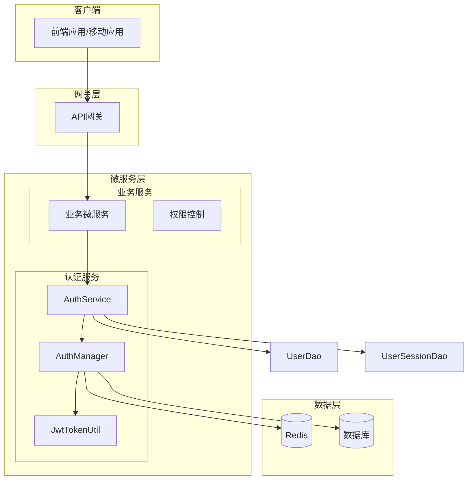
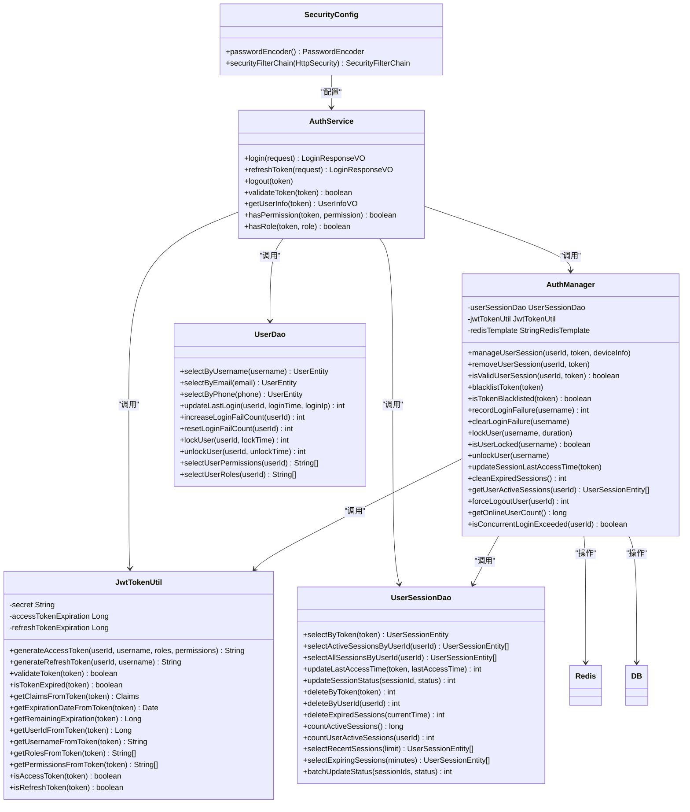
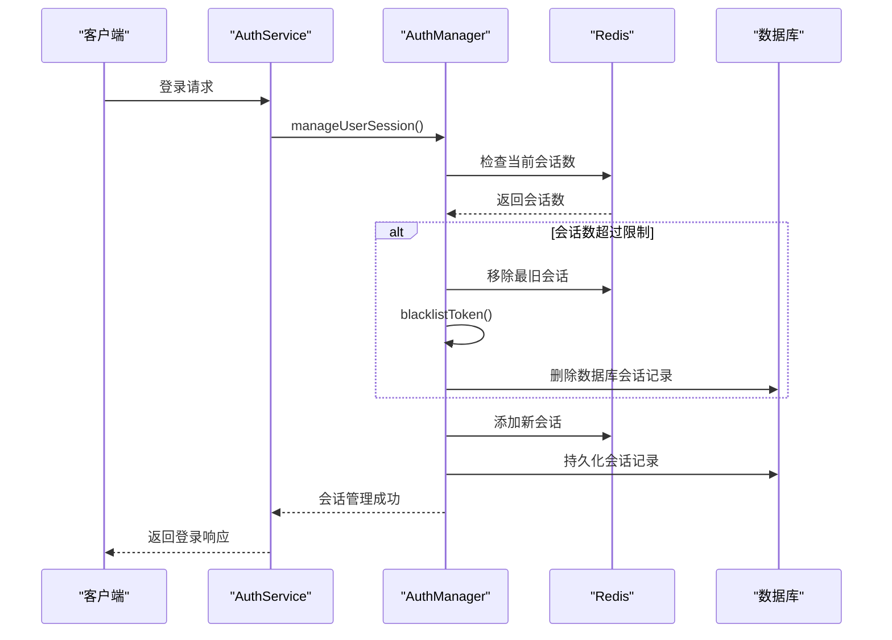
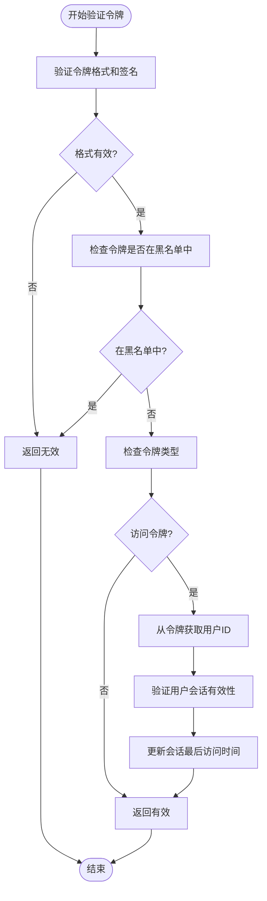
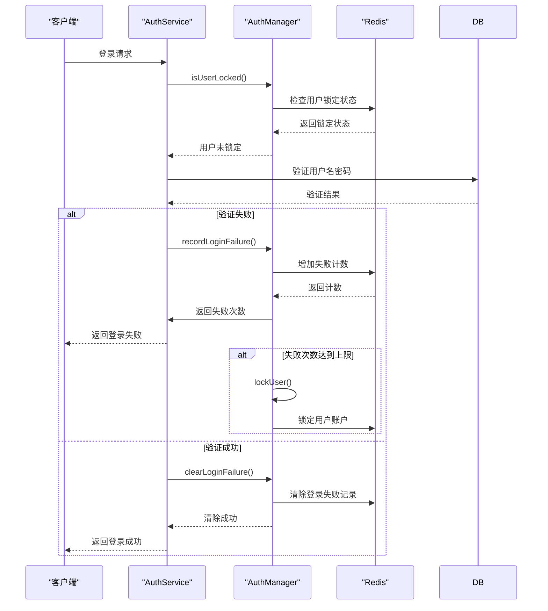
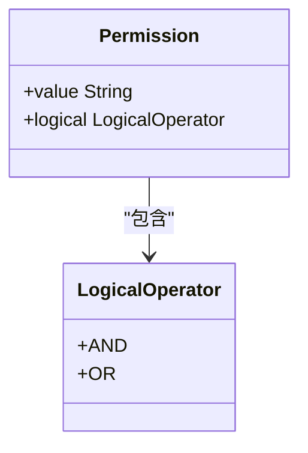
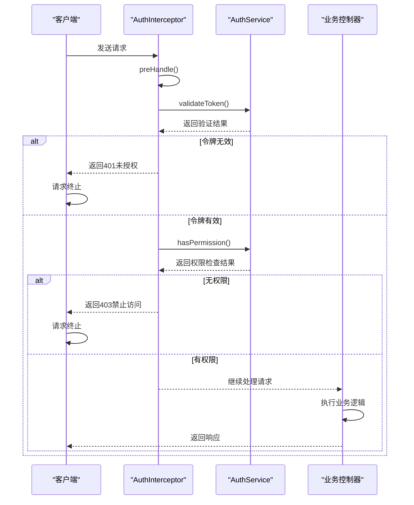
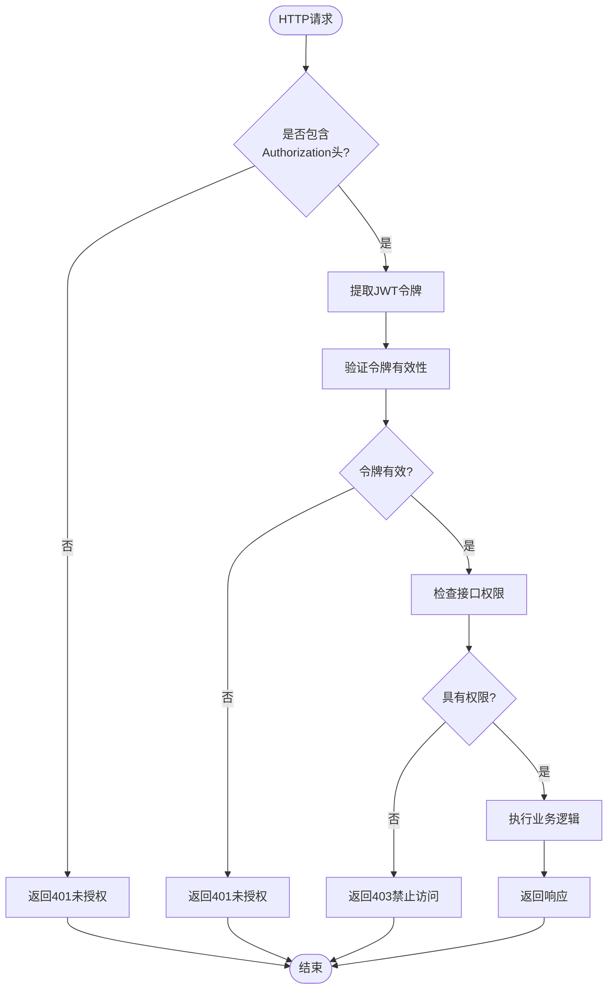
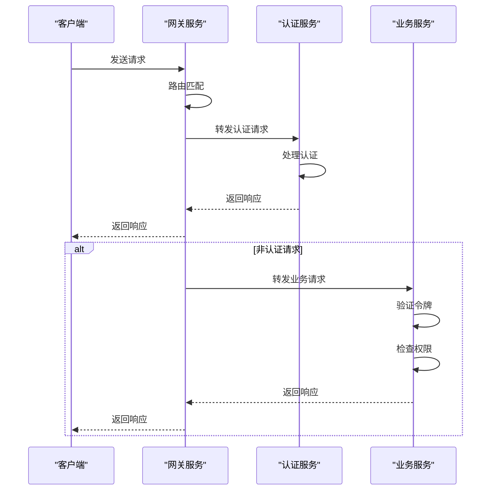

# 认证授权

<cite>
**本文档引用的文件**   
- [SecurityConfig.java](file://microservices/microservices-common/src/main/java/net/lab1024/sa/common/auth/config/SecurityConfig.java)
- [AuthManager.java](file://microservices/microservices-common/src/main/java/net/lab1024/sa/common/auth/manager/AuthManager.java)
- [JwtTokenUtil.java](file://microservices/microservices-common/src/main/java/net/lab1024/sa/common/auth/util/JwtTokenUtil.java)
- [AuthService.java](file://microservices/microservices-common/src/main/java/net/lab1024/sa/common/auth/service/AuthService.java)
- [AuthServiceImpl.java](file://microservices/microservices-common/src/main/java/net/lab1024/sa/common/auth/service/impl/AuthServiceImpl.java)
- [UserDao.java](file://microservices/microservices-common/src/main/java/net/lab1024/sa/common/auth/dao/UserDao.java)
- [UserSessionDao.java](file://microservices/microservices-common/src/main/java/net/lab1024/sa/common/auth/dao/UserSessionDao.java)
- [UserSessionEntity.java](file://microservices/microservices-common/src/main/java/net/lab1024/sa/common/auth/domain/entity/UserSessionEntity.java)
- [LoginRequestDTO.java](file://microservices/microservices-common/src/main/java/net/lab1024/sa/common/auth/domain/dto/LoginRequestDTO.java)
- [LoginResponseVO.java](file://microservices/microservices-common/src/main/java/net/lab1024/sa/common/auth/domain/vo/LoginResponseVO.java)
- [UserInfoVO.java](file://microservices/microservices-common/src/main/java/net/lab1024/sa/common/auth/domain/vo/UserInfoVO.java)
</cite>

## 目录
1. [简介](#简介)
2. [认证授权架构](#认证授权架构)
3. [核心组件分析](#核心组件分析)
4. [AuthTokenManager核心方法详解](#authtokenmanager核心方法详解)
5. [@Permission注解和AuthInterceptor拦截器](#permission注解和authinterceptor拦截器)
6. [业务服务中的权限控制实现](#业务服务中的权限控制实现)
7. [与网关服务的协同工作](#与网关服务的协同工作)
8. [集成和使用示例](#集成和使用示例)
9. [总结](#总结)

## 简介

本文档详细介绍了microservices-common模块中的认证授权机制，重点阐述了基于Sa-Token实现的统一JWT令牌认证和权限校验体系。文档深入分析了AuthTokenManager的核心方法，包括登录生成令牌、验证令牌、获取用户信息等功能。同时，详细描述了@Permission注解和AuthInterceptor拦截器的工作原理，以及业务服务如何通过这些组件实现接口级别的权限控制。最后，提供了在业务微服务中集成和使用认证功能的代码示例，并说明了与网关服务的协同工作方式。

**Section sources**
- [SecurityConfig.java](file://microservices/microservices-common/src/main/java/net/lab1024/sa/common/auth/config/SecurityConfig.java#L1-L89)
- [AuthManager.java](file://microservices/microservices-common/src/main/java/net/lab1024/sa/common/auth/manager/AuthManager.java#L1-L480)

## 认证授权架构

系统采用基于JWT的无状态认证架构，结合Spring Security实现统一的认证授权机制。整体架构分为多个层次：安全配置层、认证服务层、令牌管理层、会话管理层和权限控制层。



**Diagram sources **
- [SecurityConfig.java](file://microservices/microservices-common/src/main/java/net/lab1024/sa/common/auth/config/SecurityConfig.java#L1-L89)
- [AuthManager.java](file://microservices/microservices-common/src/main/java/net/lab1024/sa/common/auth/manager/AuthManager.java#L1-L480)
- [JwtTokenUtil.java](file://microservices/microservices-common/src/main/java/net/lab1024/sa/common/auth/util/JwtTokenUtil.java#L1-L252)

**Section sources**
- [SecurityConfig.java](file://microservices/microservices-common/src/main/java/net/lab1024/sa/common/auth/config/SecurityConfig.java#L1-L89)
- [AuthManager.java](file://microservices/microservices-common/src/main/java/net/lab1024/sa/common/auth/manager/AuthManager.java#L1-L480)

## 核心组件分析

认证授权系统由多个核心组件构成，各组件职责分明，协同工作。主要包括安全配置组件、认证管理组件、JWT工具组件、数据访问组件等。



**Diagram sources **
- [SecurityConfig.java](file://microservices/microservices-common/src/main/java/net/lab1024/sa/common/auth/config/SecurityConfig.java#L1-L89)
- [AuthManager.java](file://microservices/microservices-common/src/main/java/net/lab1024/sa/common/auth/manager/AuthManager.java#L1-L480)
- [JwtTokenUtil.java](file://microservices/microservices-common/src/main/java/net/lab1024/sa/common/auth/util/JwtTokenUtil.java#L1-L252)
- [AuthService.java](file://microservices/microservices-common/src/main/java/net/lab1024/sa/common/auth/service/AuthService.java#L1-L81)
- [AuthServiceImpl.java](file://microservices/microservices-common/src/main/java/net/lab1024/sa/common/auth/service/impl/AuthServiceImpl.java#L1-L397)
- [UserDao.java](file://microservices/microservices-common/src/main/java/net/lab1024/sa/common/auth/dao/UserDao.java#L1-L111)
- [UserSessionDao.java](file://microservices/microservices-common/src/main/java/net/lab1024/sa/common/auth/dao/UserSessionDao.java#L1-L149)

**Section sources**
- [SecurityConfig.java](file://microservices/microservices-common/src/main/java/net/lab1024/sa/common/auth/config/SecurityConfig.java#L1-L89)
- [AuthManager.java](file://microservices/microservices-common/src/main/java/net/lab1024/sa/common/auth/manager/AuthManager.java#L1-L480)
- [JwtTokenUtil.java](file://microservices/microservices-common/src/main/java/net/lab1024/sa/common/auth/util/JwtTokenUtil.java#L1-L252)

## AuthTokenManager核心方法详解

AuthTokenManager是认证授权系统的核心管理组件，负责处理复杂的认证业务流程编排、多级缓存管理、会话管理、令牌黑名单管理、登录安全策略等企业级特性。

### 用户会话管理

用户会话管理是系统安全的重要组成部分，AuthTokenManager实现了企业级的会话管理机制，包括会话数量限制、过期会话清理、会话持久化和多级缓存同步等功能。



**Diagram sources **
- [AuthManager.java](file://microservices/microservices-common/src/main/java/net/lab1024/sa/common/auth/manager/AuthManager.java#L99-L147)

**Section sources**
- [AuthManager.java](file://microservices/microservices-common/src/main/java/net/lab1024/sa/common/auth/manager/AuthManager.java#L99-L147)

### 令牌验证与黑名单管理

系统实现了完善的令牌验证机制，包括格式验证、签名验证、黑名单检查和会话有效性验证。同时，通过令牌黑名单机制实现安全登出和防止令牌重放攻击。



**Diagram sources **
- [AuthManager.java](file://microservices/microservices-common/src/main/java/net/lab1024/sa/common/auth/manager/AuthManager.java#L173-L207)
- [AuthManager.java](file://microservices/microservices-common/src/main/java/net/lab1024/sa/common/auth/manager/AuthManager.java#L219-L229)

**Section sources**
- [AuthManager.java](file://microservices/microservices-common/src/main/java/net/lab1024/sa/common/auth/manager/AuthManager.java#L173-L245)

### 登录安全策略

为防止暴力破解攻击，系统实现了企业级的登录安全策略，包括登录失败计数、自动账户锁定、防暴力破解等安全特性。



**Diagram sources **
- [AuthManager.java](file://microservices/microservices-common/src/main/java/net/lab1024/sa/common/auth/manager/AuthManager.java#L258-L281)
- [AuthManager.java](file://microservices/microservices-common/src/main/java/net/lab1024/sa/common/auth/manager/AuthManager.java#L288-L295)

**Section sources**
- [AuthManager.java](file://microservices/microservices-common/src/main/java/net/lab1024/sa/common/auth/manager/AuthManager.java#L258-L345)

## @Permission注解和AuthInterceptor拦截器

系统通过@Permission注解和AuthInterceptor拦截器实现接口级别的权限控制，确保只有具有相应权限的用户才能访问特定的API接口。

### @Permission注解

@Permission注解用于标记需要权限验证的接口方法，指定访问该接口所需的权限编码。



**Diagram sources **
- [Permission.java](file://microservices/microservices-common/src/main/java/net/lab1024/sa/common/auth/annotation/Permission.java)

**Section sources**
- [Permission.java](file://microservices/microservices-common/src/main/java/net/lab1024/sa/common/auth/annotation/Permission.java)

### AuthInterceptor拦截器

AuthInterceptor拦截器负责在请求处理前进行权限验证，包括令牌验证、权限检查等操作。



**Diagram sources **
- [AuthInterceptor.java](file://microservices/microservices-common/src/main/java/net/lab1024/sa/common/auth/interceptor/AuthInterceptor.java)

**Section sources**
- [AuthInterceptor.java](file://microservices/microservices-common/src/main/java/net/lab1024/sa/common/auth/interceptor/AuthInterceptor.java)

## 业务服务中的权限控制实现

业务服务通过集成microservices-common模块的认证授权组件，实现统一的接口级别权限控制。以下以access-service为例说明实现方式。

### 权限控制流程

业务服务中的权限控制流程包括请求拦截、令牌验证、权限检查、业务处理等步骤。



**Diagram sources **
- [AuthInterceptor.java](file://microservices/microservices-common/src/main/java/net/lab1024/sa/common/auth/interceptor/AuthInterceptor.java)
- [AuthService.java](file://microservices/microservices-common/src/main/java/net/lab1024/sa/common/auth/service/AuthService.java)

**Section sources**
- [AuthInterceptor.java](file://microservices/microservices-common/src/main/java/net/lab1024/sa/common/auth/interceptor/AuthInterceptor.java)
- [AuthService.java](file://microservices/microservices-common/src/main/java/net/lab1024/sa/common/auth/service/AuthService.java)

### 业务控制器示例

业务控制器通过@Permission注解声明接口所需的权限，由AuthInterceptor自动进行权限验证。

```mermaid
classDiagram
class AccessDeviceController {
+getDeviceList() ResponseDTO~DeviceVO[]~
+addDevice(device) ResponseDTO~Void~
+updateDevice(device) ResponseDTO~Void~
+deleteDevice(id) ResponseDTO~Void~
}
class Permission {
+value String
+logical LogicalOperator
}
AccessDeviceController --> Permission : "使用"
note right of AccessDeviceController
@Permission("device : read")<br/>
public ResponseDTO<List<DeviceVO>> getDeviceList()<br/>
<br/>
@Permission("device : write")<br/>
public ResponseDTO<Void> addDevice(Device device)
end note
```

**Diagram sources **
- [AccessDeviceController.java](file://microservices/ioedream-access-service/src/main/java/net/lab1024/sa/access/controller/AccessDeviceController.java)

**Section sources**
- [AccessDeviceController.java](file://microservices/ioedream-access-service/src/main/java/net/lab1024/sa/access/controller/AccessDeviceController.java)

## 与网关服务的协同工作

认证授权系统与网关服务协同工作，实现统一的API访问控制。网关服务负责路由转发、负载均衡、限流熔断等，而认证授权由各微服务独立处理。

### 协同工作流程



**Diagram sources **
- [application.yml](file://microservices/ioedream-gateway-service/src/main/resources/application.yml)

**Section sources**
- [application.yml](file://microservices/ioedream-gateway-service/src/main/resources/application.yml)

## 集成和使用示例

以下是在业务微服务中集成和使用认证功能的代码示例。

### 依赖引入

在业务微服务的pom.xml中引入microservices-common依赖：

```xml
<dependency>
    <groupId>net.lab1024.sa</groupId>
    <artifactId>microservices-common</artifactId>
    <version>1.0.0</version>
</dependency>
```

### 配置文件

在application.yml中配置JWT相关参数：

```yaml
auth:
  jwt:
    secret: ioedream-jwt-secret-key-2025-must-be-at-least-256-bits
    access-token-expiration: 86400
    refresh-token-expiration: 604800
```

### 业务接口权限控制

在业务控制器中使用@Permission注解进行权限控制：

```java
@RestController
@RequestMapping("/api/v1/device")
public class AccessDeviceController {
    
    @GetMapping("/list")
    @Permission("device:read")
    public ResponseDTO<List<DeviceVO>> getDeviceList() {
        // 业务逻辑
    }
    
    @PostMapping("/add")
    @Permission("device:write")
    public ResponseDTO<Void> addDevice(@RequestBody Device device) {
        // 业务逻辑
    }
}
```

### 服务间调用认证

在服务间调用时，需要传递JWT令牌：

```java
@Service
public class DeviceService {
    
    @Resource
    private GatewayServiceClient gatewayServiceClient;
    
    public void syncDeviceStatus(Long deviceId, String status) {
        // 获取当前请求的令牌
        String token = SmartRequestUtil.getJwtToken();
        
        // 调用其他服务
        gatewayServiceClient.callService("device-service", "/api/v1/device/status", 
            Map.of("deviceId", deviceId, "status", status), token);
    }
}
```

**Section sources**
- [pom.xml](file://microservices/ioedream-access-service/pom.xml)
- [application.yml](file://microservices/ioedream-access-service/src/main/resources/application.yml)
- [AccessDeviceController.java](file://microservices/ioedream-access-service/src/main/java/net/lab1024/sa/access/controller/AccessDeviceController.java)
- [DeviceService.java](file://microservices/ioedream-access-service/src/main/java/net/lab1024/sa/access/service/DeviceService.java)

## 总结

本文档详细介绍了microservices-common模块中的认证授权机制，包括基于Sa-Token的统一JWT令牌认证和权限校验体系。系统通过AuthManager、JwtTokenUtil等核心组件实现了企业级的认证授权功能，包括用户会话管理、令牌验证、黑名单管理、登录安全策略等。通过@Permission注解和AuthInterceptor拦截器，实现了接口级别的权限控制。业务服务可以方便地集成这些功能，实现统一的安全访问控制。与网关服务的协同工作确保了整个系统的安全性和可扩展性。

**Section sources**
- [SecurityConfig.java](file://microservices/microservices-common/src/main/java/net/lab1024/sa/common/auth/config/SecurityConfig.java#L1-L89)
- [AuthManager.java](file://microservices/microservices-common/src/main/java/net/lab1024/sa/common/auth/manager/AuthManager.java#L1-L480)
- [JwtTokenUtil.java](file://microservices/microservices-common/src/main/java/net/lab1024/sa/common/auth/util/JwtTokenUtil.java#L1-L252)