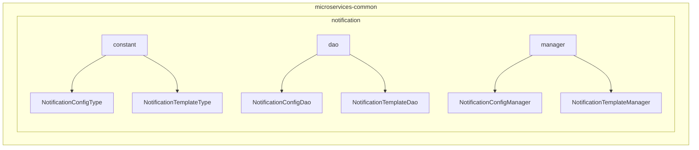
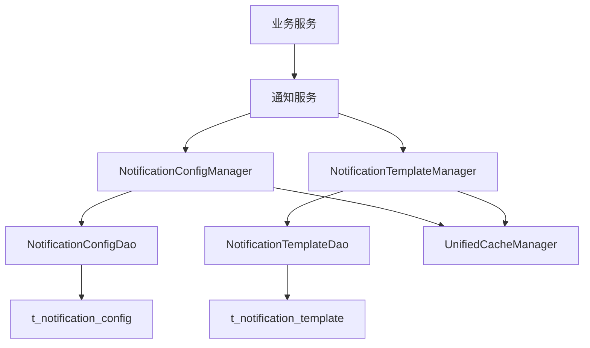
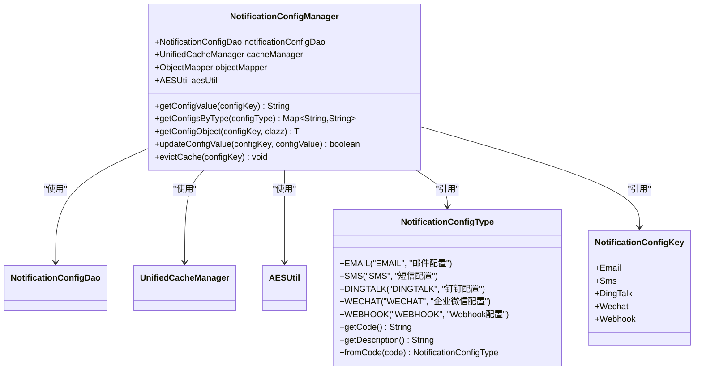
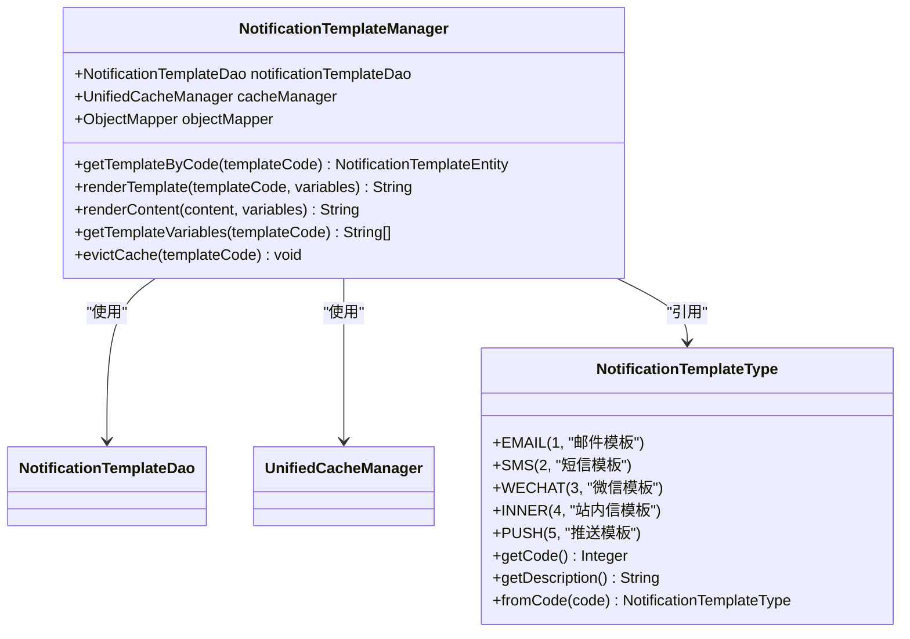
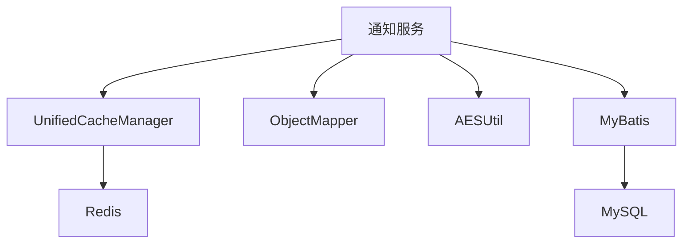

# 通知服务

<cite>
**本文档引用文件**  
- [07-t_notification_message.sql](file://database-scripts/common-service/07-t_notification_message.sql)
- [08-t_notification_template.sql](file://database-scripts/common-service/08-t_notification_template.sql)
- [09-t_notification_config.sql](file://database-scripts/common-service/09-t_notification_config.sql)
- [NotificationConfigKey.java](file://microservices/microservices-common/src/main/java/net/lab1024/sa/common/notification/constant/NotificationConfigKey.java)
- [NotificationConfigType.java](file://microservices/microservices-common/src/main/java/net/lab1024/sa/common/notification/constant/NotificationConfigType.java)
- [NotificationTemplateType.java](file://microservices/microservices-common/src/main/java/net/lab1024/sa/common/notification/constant/NotificationTemplateType.java)
- [NotificationConfigManager.java](file://microservices/microservices-common/src/main/java/net/lab1024/sa/common/notification/manager/NotificationConfigManager.java)
- [NotificationTemplateManager.java](file://microservices/microservices-common/src/main/java/net/lab1024/sa/common/notification/manager/NotificationTemplateManager.java)
- [NotificationConfigDao.java](file://microservices/microservices-common/src/main/java/net/lab1024/sa/common/notification/dao/NotificationConfigDao.java)
- [NotificationTemplateDao.java](file://microservices/microservices-common/src/main/java/net/lab1024/sa/common/notification/dao/NotificationTemplateDao.java)
</cite>

## 目录
1. [简介](#简介)
2. [项目结构](#项目结构)
3. [核心组件](#核心组件)
4. [架构概述](#架构概述)
5. [详细组件分析](#详细组件分析)
6. [依赖分析](#依赖分析)
7. [性能考虑](#性能考虑)
8. [故障排除指南](#故障排除指南)
9. [结论](#结论)

## 简介
通知服务是 microservices-common 模块中的核心组件，为整个系统提供统一的消息通知能力。该服务支持系统公告、审批提醒、告警通知等多种场景，通过标准化接口和灵活配置，实现了跨业务系统的消息推送功能。服务基于 `t_notification_message` 表进行数据管理，并通过异步处理机制确保通知的可靠送达。

## 项目结构
通知服务的实现位于 microservices-common 模块中，主要包括数据库表定义、DAO 层、Manager 层和常量定义。服务通过分层架构实现了配置管理、模板管理和消息发送等功能。

**图表来源**  
- [NotificationConfigType.java](file://microservices/microservices-common/src/main/java/net/lab1024/sa/common/notification/constant/NotificationConfigType.java)
- [NotificationTemplateType.java](file://microservices/microservices-common/src/main/java/net/lab1024/sa/common/notification/constant/NotificationTemplateType.java)
- [NotificationConfigDao.java](file://microservices/microservices-common/src/main/java/net/lab1024/sa/common/notification/dao/NotificationConfigDao.java)
- [NotificationTemplateDao.java](file://microservices/microservices-common/src/main/java/net/lab1024/sa/common/notification/dao/NotificationTemplateDao.java)
- [NotificationConfigManager.java](file://microservices/microservices-common/src/main/java/net/lab1024/sa/common/notification/manager/NotificationConfigManager.java)
- [NotificationTemplateManager.java](file://microservices/microservices-common/src/main/java/net/lab1024/sa/common/notification/manager/NotificationTemplateManager.java)

**章节来源**  
- [database-scripts/common-service/07-t_notification_message.sql](file://database-scripts/common-service/07-t_notification_message.sql)
- [database-scripts/common-service/08-t_notification_template.sql](file://database-scripts/common-service/08-t_notification_template.sql)
- [database-scripts/common-service/09-t_notification_config.sql](file://database-scripts/common-service/09-t_notification_config.sql)

## 核心组件
通知服务的核心组件包括通知消息管理、通知模板管理和通知配置管理。服务通过 `NotificationConfigManager` 和 `NotificationTemplateManager` 两个核心管理器提供配置和模板的统一访问接口，支持多级缓存、加密解密和热更新等企业级特性。

**章节来源**  
- [NotificationConfigManager.java](file://microservices/microservices-common/src/main/java/net/lab1024/sa/common/notification/manager/NotificationConfigManager.java)
- [NotificationTemplateManager.java](file://microservices/microservices-common/src/main/java/net/lab1024/sa/common/notification/manager/NotificationTemplateManager.java)

## 架构概述
通知服务采用分层架构设计，包括数据访问层（DAO）、业务逻辑层（Manager）和常量定义层。服务通过统一的缓存管理器（UnifiedCacheManager）实现多级缓存，确保配置和模板的高效访问。所有 Manager 类均为纯 Java 类，通过构造函数注入依赖，不使用 Spring 注解。

**图表来源**  
- [NotificationConfigManager.java](file://microservices/microservices-common/src/main/java/net/lab1024/sa/common/notification/manager/NotificationConfigManager.java)
- [NotificationTemplateManager.java](file://microservices/microservices-common/src/main/java/net/lab1024/sa/common/notification/manager/NotificationTemplateManager.java)
- [NotificationConfigDao.java](file://microservices/microservices-common/src/main/java/net/lab1024/sa/common/notification/dao/NotificationConfigDao.java)
- [NotificationTemplateDao.java](file://microservices/microservices-common/src/main/java/net/lab1024/sa/common/notification/dao/NotificationTemplateDao.java)

## 详细组件分析

### 通知配置管理
通知配置管理器（NotificationConfigManager）负责管理各种通知渠道的配置信息，包括邮件、短信、钉钉、企业微信等。管理器支持配置的加密存储、多级缓存和热更新。

#### 配置管理类图

**图表来源**  
- [NotificationConfigManager.java](file://microservices/microservices-common/src/main/java/net/lab1024/sa/common/notification/manager/NotificationConfigManager.java)
- [NotificationConfigType.java](file://microservices/microservices-common/src/main/java/net/lab1024/sa/common/notification/constant/NotificationConfigType.java)
- [NotificationConfigKey.java](file://microservices/microservices-common/src/main/java/net/lab1024/sa/common/notification/constant/NotificationConfigKey.java)

**章节来源**  
- [NotificationConfigManager.java](file://microservices/microservices-common/src/main/java/net/lab1024/sa/common/notification/manager/NotificationConfigManager.java)

### 通知模板管理
通知模板管理器（NotificationTemplateManager）负责管理通知模板的获取、渲染和缓存。支持变量替换（{{variable}}格式），可用于动态生成通知内容。

#### 模板管理类图

**图表来源**  
- [NotificationTemplateManager.java](file://microservices/microservices-common/src/main/java/net/lab1024/sa/common/notification/manager/NotificationTemplateManager.java)
- [NotificationTemplateType.java](file://microservices/microservices-common/src/main/java/net/lab1024/sa/common/notification/constant/NotificationTemplateType.java)

**章节来源**  
- [NotificationTemplateManager.java](file://microservices/microservices-common/src/main/java/net/lab1024/sa/common/notification/manager/NotificationTemplateManager.java)

## 依赖分析
通知服务依赖于 microservices-common 模块中的统一缓存管理器（UnifiedCacheManager）、JSON 处理工具（ObjectMapper）和加密工具（AESUtil）。服务通过 DAO 层与数据库交互，使用 MyBatis 框架进行数据访问。

**图表来源**  
- [NotificationConfigManager.java](file://microservices/microservices-common/src/main/java/net/lab1024/sa/common/notification/manager/NotificationConfigManager.java)
- [NotificationTemplateManager.java](file://microservices/microservices-common/src/main/java/net/lab1024/sa/common/notification/manager/NotificationTemplateManager.java)

**章节来源**  
- [NotificationConfigManager.java](file://microservices/microservices-common/src/main/java/net/lab1024/sa/common/notification/manager/NotificationConfigManager.java)
- [NotificationTemplateManager.java](file://microservices/microservices-common/src/main/java/net/lab1024/sa/common/notification/manager/NotificationTemplateManager.java)

## 性能考虑
通知服务通过多级缓存机制（本地缓存 + Redis）提高配置和模板的访问性能。缓存过期时间为30分钟，支持热更新。服务采用异步处理模式，避免阻塞业务流程。配置和模板数据在首次访问后会被缓存，后续访问直接从缓存读取，显著降低数据库压力。

## 故障排除指南
当通知服务出现问题时，可按以下步骤进行排查：
1. 检查通知配置是否正确，特别是加密配置的解密是否成功
2. 验证通知模板是否存在且处于启用状态
3. 检查缓存是否正常工作，必要时清除相关缓存
4. 查看数据库连接是否正常，特别是 t_notification_config 和 t_notification_template 表的访问

**章节来源**  
- [NotificationConfigManager.java](file://microservices/microservices-common/src/main/java/net/lab1024/sa/common/notification/manager/NotificationConfigManager.java)
- [NotificationTemplateManager.java](file://microservices/microservices-common/src/main/java/net/lab1024/sa/common/notification/manager/NotificationTemplateManager.java)

## 结论
通知服务为系统提供了统一、可靠的消息通知能力。通过标准化的配置管理和模板机制，支持多种通知渠道和场景。服务的分层架构和企业级特性（多级缓存、加密存储、热更新）确保了其高性能和可维护性。业务服务可通过调用该服务的接口发送通知，前端可通过轮询或WebSocket获取实时通知。