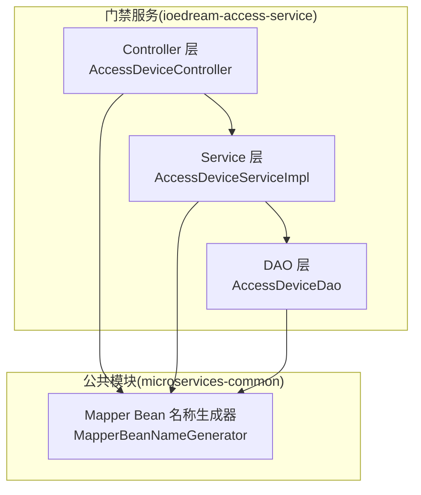
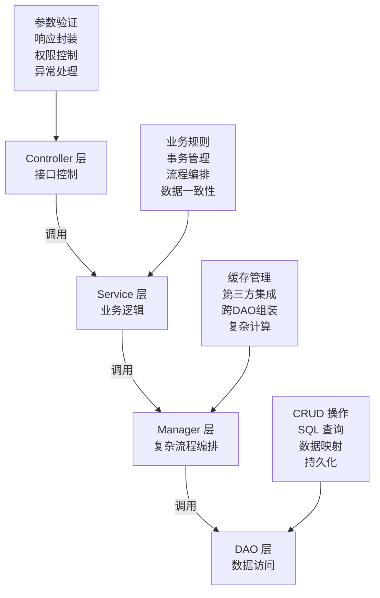
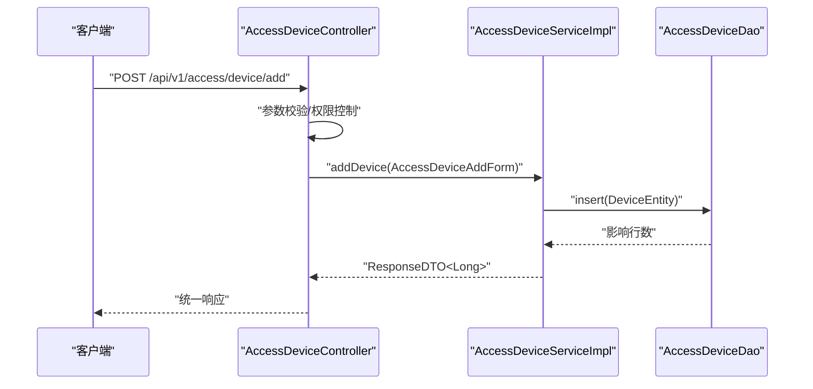
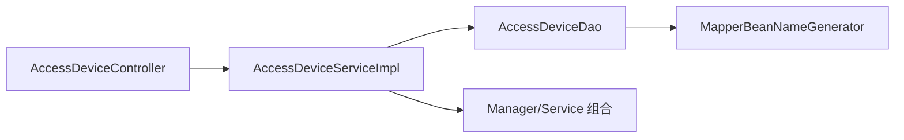

# 四层架构模式

<cite>
**本文引用的文件**
- [README.md](file://README.md)
- [DEV_STANDARDS.md](file://docs/DEV_STANDARDS.md)
- [ACCESS_SERVICE_FIX_PROGRESS.md](file://documentation/archive/reports-2025-12-04/ACCESS_SERVICE_FIX_PROGRESS.md)
- [ARCHITECTURE_COMPLIANCE_VERIFICATION_REPORT_2025-12-03.md](file://documentation/archive/reports-2025-12-04/ARCHITECTURE_COMPLIANCE_VERIFICATION_REPORT_2025-12-03.md)
- [GLOBAL_ARCHITECTURE_DEEP_ANALYSIS_REPORT_2025-12-04.md](file://documentation/archive/reports-2025-12-04/GLOBAL_ARCHITECTURE_DEEP_ANALYSIS_REPORT_2025-12-04.md)
- [PHASE1_ACTUAL_COMPLIANCE_STATUS.md](file://documentation/archive/reports-2025-12-04/PHASE1_ACTUAL_COMPLIANCE_STATUS.md)
- [DOCUMENTATION_INCONSISTENCY_ANALYSIS_REPORT.md](file://documentation/archive/reports-2025-12-04/DOCUMENTATION_INCONSISTENCY_ANALYSIS_REPORT.md)
- [GLOBAL_CODE_REVIEW_FINAL_REPORT.md](file://documentation/archive/reports-2025-12-04/GLOBAL_CODE_REVIEW_FINAL_REPORT.md)
- [GLOBAL_DAO_REDUNDANCY_SCAN_REPORT.md](file://documentation/archive/reports-2025-12-04/GLOBAL_DAO_REDUNDANCY_SCAN_REPORT.md)
- [PROJECT.md](file://openspec/PROJECT.md)
- [AccessDeviceController.java](file://microservices/ioedream-access-service/src/main/java/net/lab1024/sa/access/controller/AccessDeviceController.java)
- [AccessDeviceServiceImpl.java](file://microservices/ioedream-access-service/src/main/java/net/lab1024/sa/access/service/impl/AccessDeviceServiceImpl.java)
- [AccessDeviceDao.java](file://microservices/ioedream-access-service/src/main/java/net/lab1024/sa/access/dao/AccessDeviceDao.java)
- [AccessRecordDao.java](file://microservices/ioedream-access-service/src/main/java/net/lab1024/sa/access/dao/AccessRecordDao.java)
- [AccessDeviceService.java](file://microservices/ioedream-access-service/src/main/java/net/lab1024/sa/access/service/AccessDeviceService.java)
- [AccessMobileControllerTest.java](file://microservices/ioedream-access-service/src/test/java/net/lab1024/sa/access/controller/AccessMobileControllerTest.java)
- [MapperBeanNameGenerator.java](file://microservices/microservices-common/src/test/java/net/lab1024/sa/common/config/MapperBeanNameGenerator.java)
</cite>

## 目录
1. [简介](#简介)
2. [项目结构](#项目结构)
3. [核心组件](#核心组件)
4. [架构总览](#架构总览)
5. [详细组件分析](#详细组件分析)
6. [依赖分析](#依赖分析)
7. [性能考虑](#性能考虑)
8. [故障排查指南](#故障排查指南)
9. [结论](#结论)
10. [附录](#附录)

## 简介
本文件围绕 IOE-DREAM 的“四层架构”（Controller、Service、Manager、DAO）进行系统化阐述，结合门禁设备创建这一典型业务流程，展示各层职责、调用关系与协作方式，并总结命名规范与最佳实践，帮助读者理解该模式如何提升可维护性与可测试性。

## 项目结构
- 后端采用微服务架构，门禁相关能力集中在 ioedream-access-service 中，遵循统一的四层分层与包结构规范。
- 门禁设备创建流程贯穿 Controller → Service → DAO，体现“参数验证在 Controller、业务逻辑在 Service、数据持久化在 DAO”的分层边界。

图表来源
- [AccessDeviceController.java](file://microservices/ioedream-access-service/src/main/java/net/lab1024/sa/access/controller/AccessDeviceController.java#L1-L228)
- [AccessDeviceServiceImpl.java](file://microservices/ioedream-access-service/src/main/java/net/lab1024/sa/access/service/impl/AccessDeviceServiceImpl.java#L1-L120)
- [AccessDeviceDao.java](file://microservices/ioedream-access-service/src/main/java/net/lab1024/sa/access/dao/AccessDeviceDao.java#L1-L175)
- [MapperBeanNameGenerator.java](file://microservices/microservices-common/src/test/java/net/lab1024/sa/common/config/MapperBeanNameGenerator.java#L1-L38)

章节来源
- [PROJECT.md](file://openspec/PROJECT.md#L33-L40)
- [DEV_STANDARDS.md](file://docs/DEV_STANDARDS.md#L143-L223)

## 核心组件
- Controller 层：接收 HTTP 请求、参数校验、权限控制、调用 Service 并封装统一响应。
- Service 层：承载核心业务逻辑、事务管理、业务规则校验、调用 DAO 完成数据持久化。
- Manager 层：在本仓库中未直接暴露为独立类，但通过 Service 内部组合的 Manager/Service 组件体现跨 Service 的流程编排与事务管理职责。
- DAO 层：封装数据库 CRUD 与查询，使用 MyBatis-Plus BaseMapper，严格遵循命名与注解规范。

章节来源
- [DEV_STANDARDS.md](file://docs/DEV_STANDARDS.md#L143-L223)
- [ARCHITECTURE_COMPLIANCE_VERIFICATION_REPORT_2025-12-03.md](file://documentation/archive/reports-2025-12-04/ARCHITECTURE_COMPLIANCE_VERIFICATION_REPORT_2025-12-03.md#L1-L43)

## 架构总览
四层架构的职责边界与调用方向如下图所示：

图表来源
- [DEV_STANDARDS.md](file://docs/DEV_STANDARDS.md#L143-L223)

## 详细组件分析

### 门禁设备创建流程（Controller → Service → DAO）
以下序列图展示了“门禁设备创建”的端到端调用链路，体现四层职责与边界：

图表来源
- [AccessDeviceController.java](file://microservices/ioedream-access-service/src/main/java/net/lab1024/sa/access/controller/AccessDeviceController.java#L149-L161)
- [AccessDeviceServiceImpl.java](file://microservices/ioedream-access-service/src/main/java/net/lab1024/sa/access/service/impl/AccessDeviceServiceImpl.java#L159-L208)
- [AccessDeviceDao.java](file://microservices/ioedream-access-service/src/main/java/net/lab1024/sa/access/dao/AccessDeviceDao.java#L1-L175)

章节来源
- [AccessDeviceController.java](file://microservices/ioedream-access-service/src/main/java/net/lab1024/sa/access/controller/AccessDeviceController.java#L149-L161)
- [AccessDeviceServiceImpl.java](file://microservices/ioedream-access-service/src/main/java/net/lab1024/sa/access/service/impl/AccessDeviceServiceImpl.java#L159-L208)
- [AccessDeviceDao.java](file://microservices/ioedream-access-service/src/main/java/net/lab1024/sa/access/dao/AccessDeviceDao.java#L1-L175)

### Controller 层职责与实现要点
- 职责：接收请求、参数校验、权限控制、调用 Service、封装统一响应。
- 实践：使用 @Resource 注入 Service；使用 @Valid 进行参数校验；返回统一 ResponseDTO；对敏感操作使用权限注解。
- 示例路径：
  - [AccessDeviceController.java](file://microservices/ioedream-access-service/src/main/java/net/lab1024/sa/access/controller/AccessDeviceController.java#L1-L228)

章节来源
- [DEV_STANDARDS.md](file://docs/DEV_STANDARDS.md#L160-L174)
- [AccessDeviceController.java](file://microservices/ioedream-access-service/src/main/java/net/lab1024/sa/access/controller/AccessDeviceController.java#L1-L228)

### Service 层职责与实现要点
- 职责：核心业务逻辑、事务管理、业务规则校验、调用 DAO。
- 实践：使用 @Transactional 管理事务；在 Service 内部进行参数校验与业务规则判断；DAO 注入使用 @Resource。
- 示例路径：
  - [AccessDeviceServiceImpl.java](file://microservices/ioedream-access-service/src/main/java/net/lab1024/sa/access/service/impl/AccessDeviceServiceImpl.java#L1-L120)
  - [AccessDeviceService.java](file://microservices/ioedream-access-service/src/main/java/net/lab1024/sa/access/service/AccessDeviceService.java)

章节来源
- [DEV_STANDARDS.md](file://docs/DEV_STANDARDS.md#L176-L191)
- [AccessDeviceServiceImpl.java](file://microservices/ioedream-access-service/src/main/java/net/lab1024/sa/access/service/impl/AccessDeviceServiceImpl.java#L1-L120)

### Manager 层职责与实现要点
- 职责：复杂业务流程编排、跨 Service/DAO 的数据组装、缓存与第三方集成。
- 实践：在 Service 内部组合 Manager/Service 组件，集中处理跨模块流程与事务边界。
- 示例路径：
  - [AccessDeviceServiceImpl.java](file://microservices/ioedream-access-service/src/main/java/net/lab1024/sa/access/service/impl/AccessDeviceServiceImpl.java#L1-L120)

章节来源
- [DEV_STANDARDS.md](file://docs/DEV_STANDARDS.md#L192-L206)
- [AccessDeviceServiceImpl.java](file://microservices/ioedream-access-service/src/main/java/net/lab1024/sa/access/service/impl/AccessDeviceServiceImpl.java#L1-L120)

### DAO 层职责与实现要点
- 职责：数据库 CRUD 与查询、SQL 映射、数据访问封装。
- 实践：使用 @Mapper 注解、继承 BaseMapper、查询方法标注 @Transactional(readOnly = true)、避免业务逻辑与事务管理。
- 示例路径：
  - [AccessDeviceDao.java](file://microservices/ioedream-access-service/src/main/java/net/lab1024/sa/access/dao/AccessDeviceDao.java#L1-L175)
  - [AccessRecordDao.java](file://microservices/ioedream-access-service/src/main/java/net/lab1024/sa/access/dao/AccessRecordDao.java#L1-L26)

章节来源
- [DEV_STANDARDS.md](file://docs/DEV_STANDARDS.md#L208-L222)
- [AccessDeviceDao.java](file://microservices/ioedream-access-service/src/main/java/net/lab1024/sa/access/dao/AccessDeviceDao.java#L1-L175)
- [AccessRecordDao.java](file://microservices/ioedream-access-service/src/main/java/net/lab1024/sa/access/dao/AccessRecordDao.java#L1-L26)

### 门禁设备创建流程的复杂度与边界
- 参数校验与业务规则：Service 层负责设备编号唯一性、区域存在性等校验。
- 事务边界：Service 层使用 @Transactional 管理插入、更新、删除等写操作。
- DAO 边界：DAO 仅负责数据访问，不包含业务逻辑与事务管理。

章节来源
- [AccessDeviceServiceImpl.java](file://microservices/ioedream-access-service/src/main/java/net/lab1024/sa/access/service/impl/AccessDeviceServiceImpl.java#L159-L208)
- [AccessDeviceDao.java](file://microservices/ioedream-access-service/src/main/java/net/lab1024/sa/access/dao/AccessDeviceDao.java#L1-L175)

## 依赖分析
- 依赖注入规范：统一使用 @Resource，禁止使用 @Autowired 或构造函数注入。
- DAO 命名与注解：DAO 使用 Dao 命名、@Mapper 注解、禁止 @Repository。
- 架构边界：Controller 仅注入 Service；Service 仅注入 DAO；Manager 作为 Service 内部编排者，不对外暴露为独立类。
- DAO 冲突与 Bean 命名：当存在同名 DAO 时，通过 MapperBeanNameGenerator 生成带模块前缀的唯一 Bean 名称，避免冲突。

图表来源
- [AccessDeviceController.java](file://microservices/ioedream-access-service/src/main/java/net/lab1024/sa/access/controller/AccessDeviceController.java#L1-L228)
- [AccessDeviceServiceImpl.java](file://microservices/ioedream-access-service/src/main/java/net/lab1024/sa/access/service/impl/AccessDeviceServiceImpl.java#L1-L120)
- [AccessDeviceDao.java](file://microservices/ioedream-access-service/src/main/java/net/lab1024/sa/access/dao/AccessDeviceDao.java#L1-L175)
- [MapperBeanNameGenerator.java](file://microservices/microservices-common/src/test/java/net/lab1024/sa/common/config/MapperBeanNameGenerator.java#L1-L38)

章节来源
- [PHASE1_ACTUAL_COMPLIANCE_STATUS.md](file://documentation/archive/reports-2025-12-04/PHASE1_ACTUAL_COMPLIANCE_STATUS.md#L122-L143)
- [DOCUMENTATION_INCONSISTENCY_ANALYSIS_REPORT.md](file://documentation/archive/reports-2025-12-04/DOCUMENTATION_INCONSISTENCY_ANALYSIS_REPORT.md#L416-L436)
- [MapperBeanNameGenerator.java](file://microservices/microservices-common/src/test/java/net/lab1024/sa/common/config/MapperBeanNameGenerator.java#L1-L38)

## 性能考虑
- DAO 查询标注 readOnly：查询方法统一使用 @Transactional(readOnly = true)，降低写锁开销。
- 批量操作与 IN 查询：DAO 提供批量更新与 IN 查询，避免 N+1 问题，提升查询性能。
- 缓存与一致性：通过 Manager 层进行缓存管理与一致性保证，DAO 层专注数据访问。
- 索引与 SQL：DAO 中的 SQL 使用合适的索引字段与排序，减少全表扫描。

章节来源
- [AccessDeviceDao.java](file://microservices/ioedream-access-service/src/main/java/net/lab1024/sa/access/dao/AccessDeviceDao.java#L1-L175)

## 故障排查指南
- 架构合规检查：若发现 Controller 直接注入 DAO/Manager，需按规范修正为仅注入 Service。
- DAO 冗余与引用混乱：当 DAO 在多个模块重复定义时，会导致引用路径混乱与编译错误，需统一到公共模块并更新 import。
- 事务与只读：查询方法应标注 readOnly=true，写操作使用 @Transactional(rollbackFor = Exception.class)。
- 单元测试：通过 Mock Service/DAO，验证 Controller 的行为与 Service 的业务逻辑。

章节来源
- [ARCHITECTURE_COMPLIANCE_VERIFICATION_REPORT_2025-12-03.md](file://documentation/archive/reports-2025-12-04/ARCHITECTURE_COMPLIANCE_VERIFICATION_REPORT_2025-12-03.md#L1-L43)
- [ACCESS_SERVICE_FIX_PROGRESS.md](file://documentation/archive/reports-2025-12-04/ACCESS_SERVICE_FIX_PROGRESS.md#L165-L211)
- [GLOBAL_DAO_REDUNDANCY_SCAN_REPORT.md](file://documentation/archive/reports-2025-12-04/GLOBAL_DAO_REDUNDANCY_SCAN_REPORT.md#L181-L198)
- [AccessMobileControllerTest.java](file://microservices/ioedream-access-service/src/test/java/net/lab1024/sa/access/controller/AccessMobileControllerTest.java#L25-L63)

## 结论
IOE-DREAM 的四层架构通过严格的分层边界与依赖注入规范，实现了清晰的职责划分与良好的可维护性、可测试性。门禁设备创建流程体现了“参数验证在 Controller、业务逻辑在 Service、数据持久化在 DAO”的最佳实践。DAO 层的统一命名与注解规范、以及 Mapper Bean 命名冲突的解决方案，进一步提升了代码的一致性与可演进性。

## 附录

### 命名规范与最佳实践
- 依赖注入：统一使用 @Resource 注解，禁止 @Autowired 或构造函数注入。
- DAO 命名：使用 Dao 后缀、@Mapper 注解、禁止 @Repository。
- 包结构：严格遵循模块包名规范，Controller/Service/DAO/Domain 分层清晰。
- 事务管理：查询方法 readOnly=true，写操作使用 @Transactional(rollbackFor = Exception.class)。
- 统一响应：Controller 返回统一 ResponseDTO，Service 返回业务结果。

章节来源
- [DEV_STANDARDS.md](file://docs/DEV_STANDARDS.md#L143-L223)
- [DOCUMENTATION_INCONSISTENCY_ANALYSIS_REPORT.md](file://documentation/archive/reports-2025-12-04/DOCUMENTATION_INCONSISTENCY_ANALYSIS_REPORT.md#L416-L436)
- [PHASE1_ACTUAL_COMPLIANCE_STATUS.md](file://documentation/archive/reports-2025-12-04/PHASE1_ACTUAL_COMPLIANCE_STATUS.md#L122-L143)