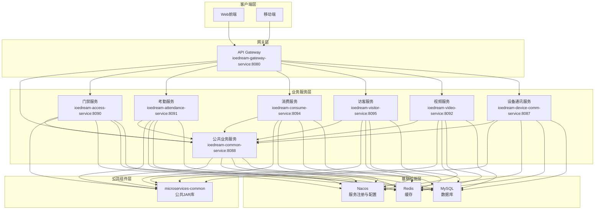
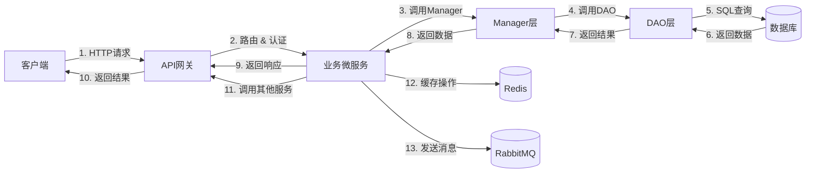

# 微服务架构

<cite>
**本文档引用文件**   
- [pom.xml](file://microservices/pom.xml)
- [docker-compose-services.yml](file://docker-compose-services.yml)
- [project.md](file://openspec/project.md)
- [OPTIMAL_ARCHITECTURE_DESIGN.md](file://documentation/architecture/OPTIMAL_ARCHITECTURE_DESIGN.md)
- [secure-application.yml](file://templates/secure-application.yml)
- [application-monitoring.yml](file://microservices/ioedream-gateway-service/src/main/resources/application-monitoring.yml)
</cite>

## 目录
1. [引言](#引言)
2. [服务列表与职责](#服务列表与职责)
3. [API网关通信机制](#api网关通信机制)
4. [四层架构模式](#四层架构模式)
5. [服务依赖关系图](#服务依赖关系图)
6. [数据流图](#数据流图)
7. [Nacos服务注册与配置管理](#nacos服务注册与配置管理)
8. [可扩展性、容错性与监控集成](#可扩展性容错性与监控集成)
9. [结论](#结论)

## 引言

IOE-DREAM是一个基于Spring Boot 3.5和Jakarta EE的企业级智能管理系统，采用微服务架构设计。系统专注于智能门禁、消费管理、考勤管理、视频监控等核心业务场景，支持多端统一（Web端、移动端、管理后台）的用户体验。本架构文档详细阐述了系统的微服务组成、通信机制、分层架构、依赖关系和监控体系，为开发、运维和架构决策提供权威指导。

**Section sources**
- [project.md](file://openspec/project.md#L1-L85)

## 服务列表与职责

IOE-DREAM系统由多个微服务组成，每个服务负责特定的业务领域，通过清晰的职责划分实现高内聚、低耦合。

| 服务名称 | 端口 | 职责描述 | 核心功能 |
|---------|------|---------|---------|
| **ioedream-gateway-service** | 8080 | API网关服务 | 路由转发、负载均衡、认证鉴权、限流熔断、日志追踪 |
| **ioedream-common-service** | 8088 | 公共业务服务 | 用户认证、组织架构、权限管理、字典管理、审计日志、系统配置、通知管理、任务调度、监控告警 |
| **ioedream-device-comm-service** | 8087 | 设备通讯服务 | 设备协议解析、连接管理、数据采集、指令下发 |
| **ioedream-access-service** | 8090 | 门禁管理服务 | 门禁控制、通行记录、权限管理、区域管理 |
| **ioedream-attendance-service** | 8091 | 考勤管理服务 | 考勤打卡、排班管理、异常检测、考勤统计 |
| **ioedream-consume-service** | 8094 | 消费管理服务 | 消费管理、账户管理、交易记录、报表分析、支付集成 |
| **ioedream-visitor-service** | 8095 | 访客管理服务 | 访客预约、访客登记、访客通行、访客统计 |
| **ioedream-video-service** | 8092 | 视频监控服务 | 视频监控、录像回放、智能分析、设备管理 |

**Section sources**
- [OPTIMAL_ARCHITECTURE_DESIGN.md](file://documentation/architecture/OPTIMAL_ARCHITECTURE_DESIGN.md#L180-L190)
- [pom.xml](file://microservices/pom.xml#L117-L127)

## API网关通信机制

所有外部请求和微服务间的内部调用都必须通过`ioedream-gateway-service`进行，确保了系统的安全性和可管理性。

### 通信流程
1.  **外部请求**: 客户端（Web、移动端）将请求发送到API网关（8080端口）。
2.  **网关处理**: 网关执行路由、认证、限流等操作。
3.  **服务调用**: 网关将请求转发到后端的微服务。
4.  **响应返回**: 微服务处理请求后，结果通过网关返回给客户端。

### 服务间调用实现
微服务之间通过`GatewayServiceClient`类进行通信，该类封装了`RestTemplate`，提供了统一的调用接口。

```java
@Component
public class GatewayServiceClient {
    @Resource
    private RestTemplate restTemplate;

    public <T> T callAccessService(String path, HttpMethod method, Object body, Class<T> responseType) {
        String url = "http://ioedream-access-service" + path;
        return executeRequest(url, method, body, responseType);
    }

    public <T> T callAttendanceService(String path, HttpMethod method, Object body, Class<T> responseType) {
        String url = "http://ioedream-attendance-service" + path;
        return executeRequest(url, method, body, responseType);
    }
    // ... 其他服务调用方法
}
```

**Diagram sources**
- [OPTIMAL_ARCHITECTURE_DESIGN.md](file://documentation/architecture/OPTIMAL_ARCHITECTURE_DESIGN.md#L760-L799)

**Section sources**
- [OPTIMAL_ARCHITECTURE_DESIGN.md](file://documentation/architecture/OPTIMAL_ARCHITECTURE_DESIGN.md#L750-L799)
- [pom.xml](file://microservices/pom.xml#L29-L33)

## 四层架构模式

系统在每个微服务中严格遵循四层架构模式，确保代码结构清晰、职责分明。

### 架构层级与职责
```
┌─────────────────────────────────────────────────────────────────┐
│                    Controller层 (接口控制层)                      │
│  职责: 接收请求、参数校验、调用Service、返回响应                   │
│  注解: @RestController, @RequestMapping, @Valid                  │
│  返回: ResponseDTO<T>                                            │
├─────────────────────────────────────────────────────────────────┤
│                    Service层 (业务逻辑层)                         │
│  职责: 核心业务逻辑、事务管理、调用Manager                         │
│  注解: @Service, @Transactional                                  │
│  位置: ioedream-xxx-service 微服务中                             │
├─────────────────────────────────────────────────────────────────┤
│                    Manager层 (业务编排层)                         │
│  职责: 复杂业务编排、多DAO协调、缓存管理、外部服务调用              │
│  注解: @Component                                                │
│  位置: microservices-common 或 微服务中                          │
├─────────────────────────────────────────────────────────────────┤
│                    DAO层 (数据访问层)                             │
│  职责: 数据库CRUD操作、SQL映射                                    │
│  注解: @Mapper, extends BaseMapper<T>                            │
│  位置: microservices-common                                      │
└─────────────────────────────────────────────────────────────────┘
```

### 调用关系
- **Controller** → **Service**: Controller调用Service层执行业务逻辑。
- **Service** → **Manager**: Service层调用Manager层进行复杂的业务编排。
- **Manager** → **DAO**: Manager层调用DAO层进行数据持久化操作。

**Diagram sources**
- [OPTIMAL_ARCHITECTURE_DESIGN.md](file://documentation/architecture/OPTIMAL_ARCHITECTURE_DESIGN.md#L310-L331)

**Section sources**
- [OPTIMAL_ARCHITECTURE_DESIGN.md](file://documentation/architecture/OPTIMAL_ARCHITECTURE_DESIGN.md#L308-L331)
- [DAO模板.md](file://documentation/06-模板工具/代码模板/DAO模板.md#L223-L229)

## 服务依赖关系图



**Diagram sources**
- [OPTIMAL_ARCHITECTURE_DESIGN.md](file://documentation/architecture/OPTIMAL_ARCHITECTURE_DESIGN.md#L105-L176)
- [docker-compose-services.yml](file://docker-compose-services.yml#L1-L41)

## 数据流图



**Diagram sources**
- [OPTIMAL_ARCHITECTURE_DESIGN.md](file://documentation/architecture/OPTIMAL_ARCHITECTURE_DESIGN.md#L105-L176)

## Nacos服务注册与配置管理

Nacos在IOE-DREAM架构中扮演着核心角色，提供服务注册发现和配置管理两大功能。

### 服务注册与发现
- **注册**: 每个微服务启动时，会向Nacos注册自己的服务名、IP地址和端口号。
- **发现**: 当一个服务需要调用另一个服务时，它会向Nacos查询目标服务的实例列表，实现服务间的动态发现和负载均衡。

### 配置管理
- **集中管理**: 所有微服务的配置文件（如数据库连接、缓存配置）都存储在Nacos中。
- **动态刷新**: 配置变更后，无需重启服务，即可通过Nacos的配置监听机制动态更新。
- **环境隔离**: 支持dev、test、prod等多环境配置，通过namespace进行隔离。

```yaml
spring:
  cloud:
    nacos:
      discovery:
        server-addr: ${NACOS_SERVER_ADDR:127.0.0.1:8848}
        namespace: ${NACOS_NAMESPACE:dev}
        group: ${NACOS_GROUP:IOE-DREAM}
      config:
        server-addr: ${NACOS_SERVER_ADDR:127.0.0.1:8848}
        namespace: ${NACOS_NAMESPACE:dev}
        group: ${NACOS_GROUP:IOE-DREAM}
        file-extension: yaml
        refresh-enabled: true
```

**Diagram sources**
- [docker-compose-services.yml](file://docker-compose-services.yml#L17-L33)
- [secure-application.yml](file://templates/secure-application.yml#L10-L32)

**Section sources**
- [docker-compose-services.yml](file://docker-compose-services.yml#L17-L33)
- [secure-application.yml](file://templates/secure-application.yml#L10-L32)

## 可扩展性容错性与监控集成

### 可扩展性
- **水平扩展**: 所有微服务均可通过增加实例数量来应对高并发，Nacos和API网关自动实现负载均衡。
- **技术栈统一**: 基于Spring Cloud Alibaba，确保了技术栈的统一和生态的成熟。

### 容错性
- **熔断降级**: 通过集成Sentinel或Resilience4j，当某个服务出现故障时，自动熔断，防止雪崩效应。
- **服务降级**: 在故障期间，提供默认的降级响应，保证核心功能可用。

### 监控集成（Prometheus）
系统集成了Prometheus和Grafana，构建了完整的监控告警体系。
- **指标采集**: 各微服务通过`/actuator/prometheus`端点暴露JVM、HTTP请求、数据库连接等监控指标。
- **数据存储**: Prometheus定时从各服务拉取指标数据并存储。
- **可视化**: Grafana连接Prometheus，展示实时监控大盘。
- **告警**: Alertmanager根据预设规则发送告警通知。

```yaml
# application-monitoring.yml
scrape_configs:
  - job_name: 'ioedream-services'
    metrics_path: '/actuator/prometheus'
    static_configs:
      - targets:
        - 'gateway:8080'
        - 'common-service:8088'
        - 'access-service:8090'
        - 'attendance-service:8091'
        - 'consume-service:8094'
```

**Section sources**
- [application-monitoring.yml](file://microservices/ioedream-gateway-service/src/main/resources/application-monitoring.yml#L288-L297)

## 结论

IOE-DREAM微服务架构设计严谨，通过清晰的服务划分、统一的API网关、规范的四层架构和强大的基础设施支持，构建了一个高可用、高性能、高可扩展的企业级系统。Nacos的引入实现了服务治理和配置管理的自动化，而Prometheus+Grafana的监控体系则为系统的稳定运行提供了有力保障。该架构为未来的业务扩展和技术演进奠定了坚实的基础。