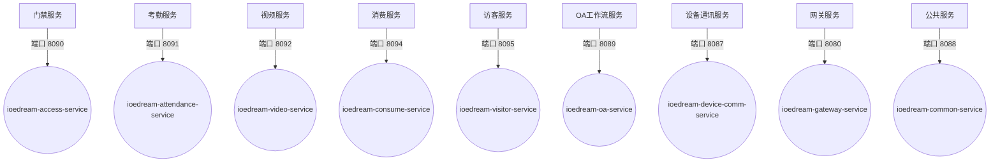
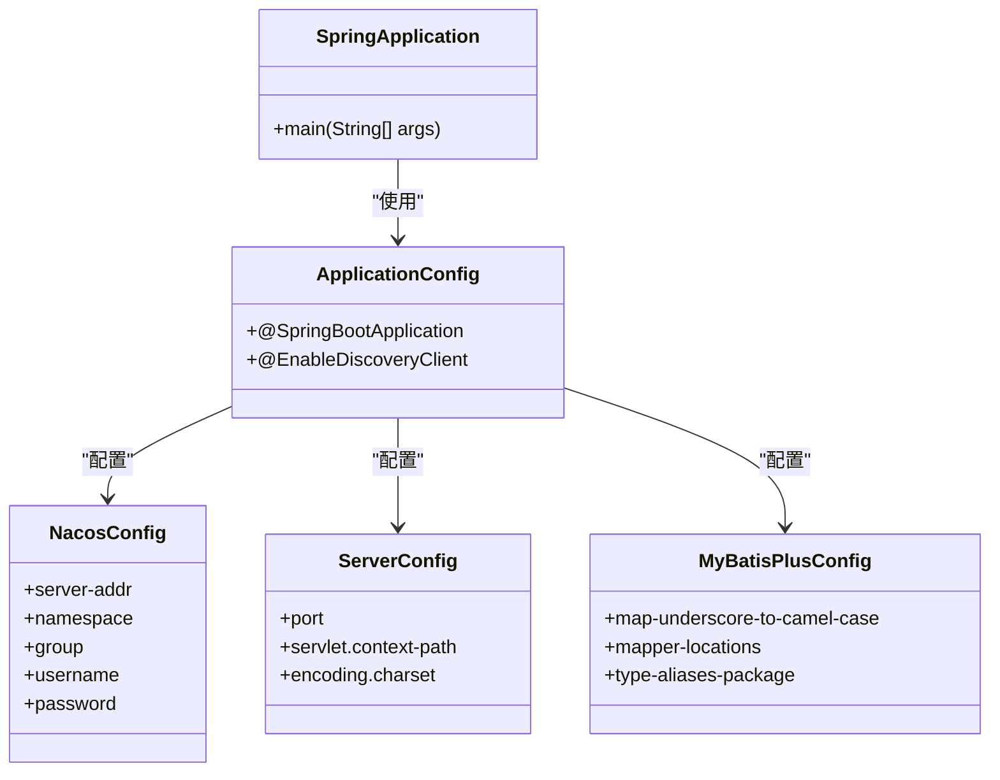

# 服务列表与职责

<cite>
**本文档引用文件**  
- [ioedream-access-service\pom.xml](file://microservices/ioedream-access-service/pom.xml)
- [ioedream-attendance-service\pom.xml](file://microservices/ioedream-attendance-service/pom.xml)
- [ioedream-consume-service\pom.xml](file://microservices/ioedream-consume-service/pom.xml)
- [ioedream-visitor-service\pom.xml](file://microservices/ioedream-visitor-service/pom.xml)
- [ioedream-video-service\pom.xml](file://microservices/ioedream-video-service/pom.xml)
- [ioedream-oa-service\pom.xml](file://microservices/ioedream-oa-service/pom.xml)
- [ioedream-device-comm-service\pom.xml](file://microservices/ioedream-device-comm-service/pom.xml)
- [ioedream-gateway-service\pom.xml](file://microservices/ioedream-gateway-service/pom.xml)
- [ioedream-common-service\pom.xml](file://microservices/ioedream-common-service/pom.xml)
- [ioedream-access-service\src\main\resources\application.yml](file://microservices/ioedream-access-service/src/main/resources/application.yml)
- [ioedream-attendance-service\src\main\resources\application.yml](file://microservices/ioedream-attendance-service/src/main/resources/application.yml)
- [ioedream-consume-service\src\main\resources\application.yml](file://microservices/ioedream-consume-service/src/main/resources/application.yml)
- [ioedream-visitor-service\src\main\resources\application.yml](file://microservices/ioedream-visitor-service/src/main/resources/application.yml)
- [ioedream-video-service\src\main\resources\application.yml](file://microservices/ioedream-video-service/src/main/resources/application.yml)
- [ioedream-oa-service\src\main\resources\application.yml](file://microservices/ioedream-oa-service/src/main/resources/application.yml)
- [ioedream-device-comm-service\src\main\resources\application.yml](file://microservices/ioedream-device-comm-service/src/main/resources/application.yml)
- [ioedream-gateway-service\src\main\resources\application.yml](file://microservices/ioedream-gateway-service/src/main/resources/application.yml)
- [ioedream-common-service\src\main\resources\application.yml](file://microservices/ioedream-common-service/src/main/resources/application.yml)
</cite>

## 目录
1. [核心微服务列表](#核心微服务列表)
2. [服务端口配置](#服务端口配置)
3. [服务职责详解](#服务职责详解)
4. [启动类与Spring Boot配置](#启动类与spring-boot配置)
5. [服务功能与业务模块映射](#服务功能与业务模块映射)

## 核心微服务列表

IOE-DREAM微服务架构包含以下核心微服务：

- **门禁服务** (ioedream-access-service)
- **考勤服务** (ioedream-attendance-service)
- **消费服务** (ioedream-consume-service)
- **访客服务** (ioedream-visitor-service)
- **视频服务** (ioedream-video-service)
- **OA工作流服务** (ioedream-oa-service)
- **设备通讯服务** (ioedream-device-comm-service)
- **网关服务** (ioedream-gateway-service)
- **公共服务** (ioedream-common-service)

**文档来源**
- [ioedream-access-service\pom.xml](file://microservices/ioedream-access-service/pom.xml)
- [ioedream-attendance-service\pom.xml](file://microservices/ioedream-attendance-service/pom.xml)
- [ioedream-consume-service\pom.xml](file://microservices/ioedream-consume-service/pom.xml)
- [ioedream-visitor-service\pom.xml](file://microservices/ioedream-visitor-service/pom.xml)
- [ioedream-video-service\pom.xml](file://microservices/ioedream-video-service/pom.xml)
- [ioedream-oa-service\pom.xml](file://microservices/ioedream-oa-service/pom.xml)
- [ioedream-device-comm-service\pom.xml](file://microservices/ioedream-device-comm-service/pom.xml)
- [ioedream-gateway-service\pom.xml](file://microservices/ioedream-gateway-service/pom.xml)
- [ioedream-common-service\pom.xml](file://microservices/ioedream-common-service/pom.xml)

## 服务端口配置

各微服务在application.yml中配置的端口号如下：

**图表来源**
- [ioedream-access-service\src\main\resources\application.yml](file://microservices/ioedream-access-service/src/main/resources/application.yml#L43)
- [ioedream-attendance-service\src\main\resources\application.yml](file://microservices/ioedream-attendance-service/src/main/resources/application.yml#L43)
- [ioedream-video-service\src\main\resources\application.yml](file://microservices/ioedream-video-service/src/main/resources/application.yml#L41)
- [ioedream-consume-service\src\main\resources\application.yml](file://microservices/ioedream-consume-service/src/main/resources/application.yml#L41)
- [ioedream-visitor-service\src\main\resources\application.yml](file://microservices/ioedream-visitor-service/src/main/resources/application.yml#L43)
- [ioedream-oa-service\src\main\resources\application.yml](file://microservices/ioedream-oa-service/src/main/resources/application.yml#L41)
- [ioedream-device-comm-service\src\main\resources\application.yml](file://microservices/ioedream-device-comm-service/src/main/resources/application.yml#L61)
- [ioedream-gateway-service\src\main\resources\application.yml](file://microservices/ioedream-gateway-service/src/main/resources/application.yml#L41)
- [ioedream-common-service\src\main\resources\application.yml](file://microservices/ioedream-common-service/src/main/resources/application.yml#L43)

## 服务职责详解

### 门禁服务
负责门禁设备管理、通行权限控制、通行记录处理等核心功能，提供门禁控制和通行记录的业务API。

### 考勤服务
负责考勤打卡记录处理、排班管理、考勤规则配置等核心功能，提供考勤打卡和排班管理的业务API。

### 消费服务
负责消费记录处理、账户管理、消费报表生成等核心功能，提供消费、账户和报表的业务API。

### 访客服务
负责访客预约管理、访客登记、访客通行权限控制等核心功能，提供访客预约和登记的业务API。

### 视频服务
负责视频监控管理、录像回放、视频分析等核心功能，提供视频监控和录像回放的业务API。

### OA工作流服务
负责工作流管理、审批流程处理、文档管理等核心功能，提供工作流和审批的业务API。

### 设备通讯服务
负责设备协议处理、设备连接管理、设备状态监控等核心功能，提供设备协议和连接管理的业务API。

### 网关服务
负责API路由转发、负载均衡、限流熔断、安全认证等核心功能，作为系统的统一入口。

### 公共服务
负责用户管理、权限管理、字典管理、邮件短信通知等公共业务功能，提供用户、权限和字典的公共业务API。

**文档来源**
- [ioedream-access-service\pom.xml](file://microservices/ioedream-access-service/pom.xml#L19)
- [ioedream-attendance-service\pom.xml](file://microservices/ioedream-attendance-service/pom.xml#L19)
- [ioedream-consume-service\pom.xml](file://microservices/ioedream-consume-service/pom.xml#L19)
- [ioedream-visitor-service\pom.xml](file://microservices/ioedream-visitor-service/pom.xml#L19)
- [ioedream-video-service\pom.xml](file://microservices/ioedream-video-service/pom.xml#L19)
- [ioedream-oa-service\pom.xml](file://microservices/ioedream-oa-service/pom.xml#L19)
- [ioedream-device-comm-service\pom.xml](file://microservices/ioedream-device-comm-service/pom.xml#L19)
- [ioedream-gateway-service\pom.xml](file://microservices/ioedream-gateway-service/pom.xml#L19)
- [ioedream-common-service\pom.xml](file://microservices/ioedream-common-service/pom.xml#L19)

## 启动类与Spring Boot配置

各微服务均采用Spring Boot框架，通过@SpringBootApplication注解配置启动类。服务配置主要通过application.yml文件进行，包含服务发现(Nacos)、服务器端口、MyBatis-Plus、日志和监控等配置。

所有服务都依赖于microservices-common公共模块，并使用Nacos作为服务发现和配置中心。服务通过Spring Cloud Alibaba Nacos Discovery实现服务注册与发现。

**图表来源**
- [ioedream-access-service\pom.xml](file://microservices/ioedream-access-service/pom.xml)
- [ioedream-access-service\src\main\resources\application.yml](file://microservices/ioedream-access-service/src/main/resources/application.yml)
- [ioedream-attendance-service\pom.xml](file://microservices/ioedream-attendance-service/pom.xml)
- [ioedream-attendance-service\src\main\resources\application.yml](file://microservices/ioedream-attendance-service/src/main/resources/application.yml)

## 服务功能与业务模块映射

以下表格展示了各服务与业务模块的映射关系：

| 服务名称 | 服务模块 | 主要业务功能 | 端口号 | 配置文件路径 |
|---------|---------|------------|-------|------------|
| 门禁服务 | 门禁管理 | 门禁设备管理、通行权限控制、通行记录处理 | 8090 | microservices/ioedream-access-service/src/main/resources/application.yml |
| 考勤服务 | 考勤管理 | 考勤打卡、排班管理、考勤规则配置 | 8091 | microservices/ioedream-attendance-service/src/main/resources/application.yml |
| 视频服务 | 视频监控 | 视频监控、录像回放、视频分析 | 8092 | microservices/ioedream-video-service/src/main/resources/application.yml |
| 消费服务 | 消费管理 | 消费记录、账户管理、消费报表 | 8094 | microservices/ioedream-consume-service/src/main/resources/application.yml |
| 访客服务 | 访客管理 | 访客预约、访客登记、访客通行 | 8095 | microservices/ioedream-visitor-service/src/main/resources/application.yml |
| OA工作流服务 | OA办公 | 工作流管理、审批流程、文档管理 | 8089 | microservices/ioedream-oa-service/src/main/resources/application.yml |
| 设备通讯服务 | 设备通讯 | 设备协议、连接管理、状态监控 | 8087 | microservices/ioedream-device-comm-service/src/main/resources/application.yml |
| 网关服务 | API网关 | 路由转发、负载均衡、限流熔断 | 8080 | microservices/ioedream-gateway-service/src/main/resources/application.yml |
| 公共服务 | 公共业务 | 用户管理、权限管理、字典管理 | 8088 | microservices/ioedream-common-service/src/main/resources/application.yml |

**文档来源**
- [ioedream-access-service\src\main\resources\application.yml](file://microservices/ioedream-access-service/src/main/resources/application.yml)
- [ioedream-attendance-service\src\main\resources\application.yml](file://microservices/ioedream-attendance-service/src/main/resources/application.yml)
- [ioedream-video-service\src\main\resources\application.yml](file://microservices/ioedream-video-service/src/main/resources/application.yml)
- [ioedream-consume-service\src\main\resources\application.yml](file://microservices/ioedream-consume-service/src/main/resources/application.yml)
- [ioedream-visitor-service\src\main\resources\application.yml](file://microservices/ioedream-visitor-service/src/main/resources/application.yml)
- [ioedream-oa-service\src\main\resources\application.yml](file://microservices/ioedream-oa-service/src/main/resources/application.yml)
- [ioedream-device-comm-service\src\main\resources\application.yml](file://microservices/ioedream-device-comm-service/src/main/resources/application.yml)
- [ioedream-gateway-service\src\main\resources\application.yml](file://microservices/ioedream-gateway-service/src/main/resources/application.yml)
- [ioedream-common-service\src\main\resources\application.yml](file://microservices/ioedream-common-service/src/main/resources/application.yml)