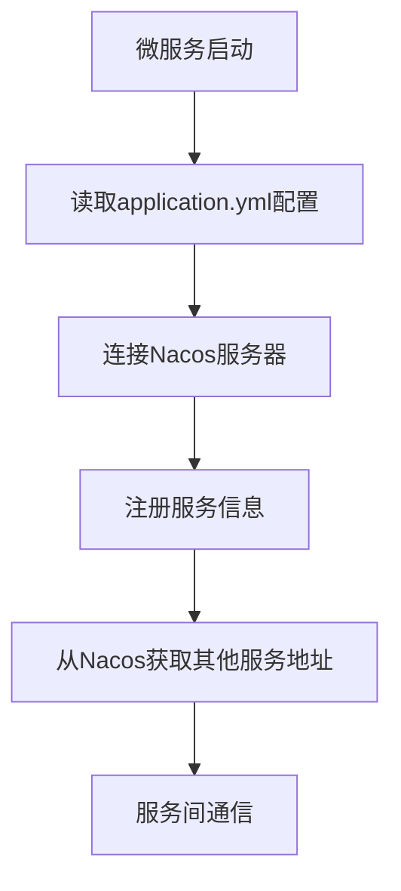
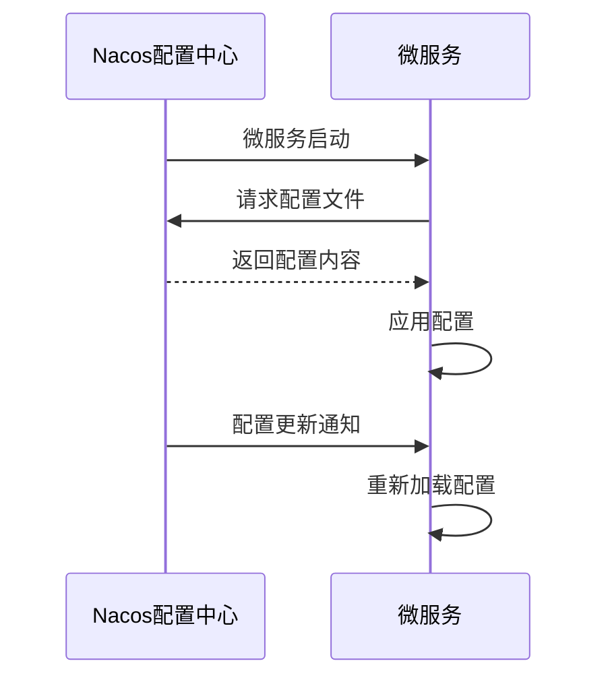
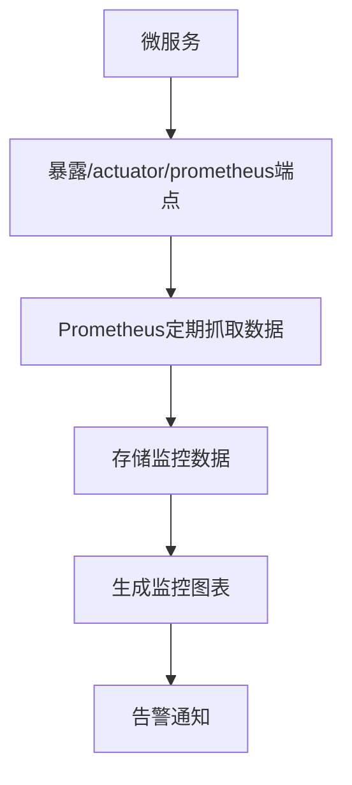

# 服务发现与配置管理

<cite>
**本文档引用文件**  
- [application.yml](file://microservices/ioedream-gateway-service/src/main/resources/application.yml)
- [docker-compose-all.yml](file://docker-compose-all.yml)
- [bootstrap.yml](file://microservices/ioedream-common-service/src/main/resources/bootstrap.yml)
- [security_hardening_guide.md](file://security/security_hardening_guide.md)
- [DRUID_NACOS_CONFIG_TEMPLATE.md](file://documentation/deployment/DRUID_NACOS_CONFIG_TEMPLATE.md)
- [第三方系统集成实现方案.md](file://documentation/03-业务模块/第三方系统集成实现方案.md)
- [secure-application.yml](file://templates/secure-application.yml)
</cite>

## 目录
1. [引言](#引言)
2. [Nacos服务注册与发现配置](#nacos服务注册与发现配置)
3. [动态配置管理](#动态配置管理)
4. [Nacos与Prometheus监控集成](#nacos与prometheus监控集成)
5. [Nacos控制台使用指南](#nacos控制台使用指南)
6. [最佳实践](#最佳实践)
7. [结论](#结论)

## 引言

Nacos在IOE-DREAM项目中作为核心的注册中心和配置中心，承担着微服务架构中服务发现、配置管理、动态更新等关键职责。通过Nacos，项目实现了微服务的自动注册与发现、配置的集中管理与热更新、以及与监控系统的无缝集成。本文档详细说明Nacos在IOE-DREAM中的应用，包括服务注册与发现的配置过程、动态配置管理的实现方式、与Prometheus监控系统的集成方法，以及Nacos控制台的使用指南和最佳实践。

**Section sources**
- [application.yml](file://microservices/ioedream-gateway-service/src/main/resources/application.yml#L1-L75)
- [docker-compose-all.yml](file://docker-compose-all.yml#L1-L479)

## Nacos服务注册与发现配置

在IOE-DREAM项目中，所有微服务均通过Nacos实现服务注册与发现。微服务在启动时会自动向Nacos注册自己的服务信息，包括服务名称、IP地址、端口等，并从Nacos获取其他服务的地址信息，实现服务间的通信。

微服务通过在`application.yml`文件中配置Nacos服务发现的相关参数来实现自动注册。以网关服务为例，其配置如下：

```yaml
spring:
  cloud:
    nacos:
      discovery:
        server-addr: ${NACOS_SERVER_ADDR:127.0.0.1:8848}
        namespace: ${NACOS_NAMESPACE:dev}
        group: ${NACOS_GROUP:IOE-DREAM}
        username: ${NACOS_USERNAME:nacos}
        password: ${NACOS_PASSWORD:nacos}
        enabled: true
        register-enabled: true
```

其中，`server-addr`指定Nacos服务器地址，`namespace`指定命名空间，`group`指定服务分组，`username`和`password`为Nacos登录凭证。这些配置均使用环境变量，便于在不同环境中灵活配置。

在`docker-compose-all.yml`文件中，定义了Nacos服务的Docker容器配置，包括镜像版本、端口映射、环境变量等，确保Nacos服务能够正常启动并与数据库连接。



**Diagram sources**
- [application.yml](file://microservices/ioedream-gateway-service/src/main/resources/application.yml#L21-L32)
- [docker-compose-all.yml](file://docker-compose-all.yml#L51-L85)

**Section sources**
- [application.yml](file://microservices/ioedream-gateway-service/src/main/resources/application.yml#L21-L32)
- [docker-compose-all.yml](file://docker-compose-all.yml#L51-L85)

## 动态配置管理

Nacos不仅作为服务注册中心，还作为配置中心，实现了配置的集中管理和动态更新。微服务的配置项（如数据库连接、缓存参数等）被抽取到Nacos配置中心，实现配置与代码的分离，便于统一管理和动态调整。

在`application.yml`文件中，通过`spring.cloud.nacos.config`配置项指定Nacos配置中心的相关参数：

```yaml
spring:
  cloud:
    nacos:
      config:
        server-addr: ${NACOS_SERVER_ADDR:127.0.0.1:8848}
        namespace: ${NACOS_NAMESPACE:dev}
        group: ${NACOS_GROUP:IOE-DREAM}
        file-extension: yaml
        enabled: true
```

微服务启动时，会从Nacos配置中心拉取对应的配置文件。配置文件的命名规则为`{服务名}-{环境}.yaml`，例如`ioedream-gateway-service-dev.yaml`。当配置发生变化时，Nacos会通知微服务，微服务会自动更新配置，实现配置的热更新。

为了确保配置安全，敏感信息（如数据库密码）在Nacos中使用AES-256加密存储。微服务通过配置加密密钥来解密配置内容。在`security_hardening_guide.md`文档中，详细说明了Nacos加密配置的步骤，包括生成加密密钥、加密敏感配置、配置加密规则等。



**Diagram sources**
- [application.yml](file://microservices/ioedream-gateway-service/src/main/resources/application.yml#L32-L38)
- [security_hardening_guide.md](file://security/security_hardening_guide.md#L1-L71)

**Section sources**
- [application.yml](file://microservices/ioedream-gateway-service/src/main/resources/application.yml#L32-L38)
- [security_hardening_guide.md](file://security/security_hardening_guide.md#L1-L71)

## Nacos与Prometheus监控集成

Nacos与Prometheus监控系统集成，实现了对微服务健康状态的实时监控。微服务通过暴露健康检查端点，供Prometheus定期抓取监控数据。

在`application.yml`文件中，通过`management.endpoints.web.exposure.include`配置项暴露健康检查端点：

```yaml
management:
  endpoints:
    web:
      exposure:
        include: health,info,metrics,prometheus,gateway
```

Prometheus通过`/actuator/prometheus`端点获取微服务的监控指标，包括CPU使用率、内存使用率、请求延迟等。在`docker-compose-all.yml`文件中，定义了Prometheus服务的Docker容器配置，包括监控规则、数据存储等。



**Diagram sources**
- [application.yml](file://microservices/ioedream-gateway-service/src/main/resources/application.yml#L59-L75)
- [docker-compose-all.yml](file://docker-compose-all.yml#L1-L479)

**Section sources**
- [application.yml](file://microservices/ioedream-gateway-service/src/main/resources/application.yml#L59-L75)
- [docker-compose-all.yml](file://docker-compose-all.yml#L1-L479)

## Nacos控制台使用指南

Nacos控制台是管理Nacos服务的主要界面，通过控制台可以查看服务列表、配置管理、命名空间管理等。

1. **登录控制台**：访问`http://localhost:8848/nacos`，使用默认账号`nacos`和密码`nacos`登录。
2. **查看服务列表**：在“服务管理”页面，可以查看所有注册的服务，包括服务名称、实例数量、健康状态等。
3. **配置管理**：在“配置管理”页面，可以添加、编辑、删除配置文件。配置文件按`dataId`和`group`进行组织。
4. **命名空间管理**：在“命名空间”页面，可以创建不同的命名空间，用于隔离不同环境或项目的配置。

在`DRUID_NACOS_CONFIG_TEMPLATE.md`文档中，提供了在Nacos控制台中配置Druid连接池的详细步骤，包括配置内容、验证步骤、注意事项等。

**Section sources**
- [DRUID_NACOS_CONFIG_TEMPLATE.md](file://documentation/deployment/DRUID_NACOS_CONFIG_TEMPLATE.md#L1-L241)

## 最佳实践

1. **配置安全**：敏感信息（如数据库密码）必须在Nacos中加密存储，避免明文暴露。
2. **命名规范**：服务名称和配置文件名应遵循统一的命名规范，便于管理和查找。
3. **环境隔离**：使用不同的命名空间隔离开发、测试、生产环境的配置，避免配置冲突。
4. **监控告警**：配置Prometheus监控规则，对关键指标设置告警阈值，及时发现和处理问题。
5. **配置备份**：定期备份Nacos中的配置，防止配置丢失。

在`secure-application.yml`模板文件中，提供了企业级安全标准的配置模板，包括Nacos加密配置、数据源安全配置、Redis安全配置等，可作为微服务配置的参考。

**Section sources**
- [secure-application.yml](file://templates/secure-application.yml#L1-L132)

## 结论

Nacos在IOE-DREAM项目中发挥了重要作用，通过服务注册与发现、动态配置管理、与监控系统集成等功能，提升了微服务架构的灵活性和可维护性。通过遵循最佳实践，可以确保Nacos的稳定运行和配置安全，为项目的持续发展提供有力支持。