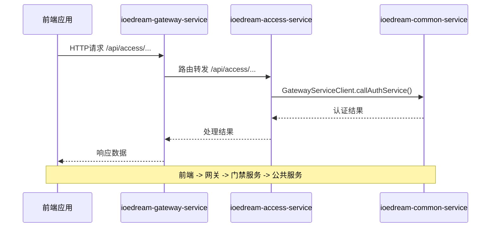

# 服务通信机制

<cite>
**本文档引用文件**  
- [application.yml](file://microservices/ioedream-gateway-service/src/main/resources/application.yml)
- [application-monitoring.yml](file://microservices/ioedream-gateway-service/src/main/resources/application-monitoring.yml)
- [GatewayServiceClient.java](file://microservices/microservices-common/src/main/java/net/lab1024/sa/common/gateway/GatewayServiceClient.java)
- [GATEWAY_CLIENT_ARCHITECTURE_FIX.md](file://documentation/archive/reports-2025-12-04/GATEWAY_CLIENT_ARCHITECTURE_FIX.md)
- [PHASE2_FEIGNCLIENT_CHECK_COMPLETE.md](file://documentation/technical/PHASE2_FEIGNCLIENT_CHECK_COMPLETE.md)
- [Maven_Verification_Complete.md](file://documentation/technical/Maven_Verification_Complete.md)
- [secure-application.yml](file://templates/secure-application.yml)
- [ResilienceConfig.java](file://microservices/ioedream-common-core/src/main/java/net/lab1024/sa/common/config/ResilienceConfig.java)
- [HealthCheckManager.java](file://microservices/microservices-common/src/main/java/net/lab1024/sa/common/monitor/manager/HealthCheckManager.java)
</cite>

## 目录
1. [引言](#引言)
2. [API网关路由机制](#api网关路由机制)
3. [微服务间通信机制](#微服务间通信机制)
4. [Nacos服务发现原理](#nacos服务发现原理)
5. [服务调用链路分析](#服务调用链路分析)
6. [熔断与超时配置](#熔断与超时配置)
7. [监控与告警体系](#监控与告警体系)
8. [结论](#结论)

## 引言

IOE-DREAM系统采用微服务架构，各服务之间通过统一的通信机制进行交互。本系统以API网关为核心，所有外部请求均通过网关进行路由转发，内部服务间通信则通过统一的客户端进行调用，避免了服务间的直接耦合。Nacos作为服务注册与发现中心，实现了服务的动态发现与负载均衡。整个通信体系设计遵循高可用、高可靠原则，通过熔断、超时、重试等机制保障系统稳定性。

## API网关路由机制

IOE-DREAM系统的API网关服务（ioedream-gateway-service）是所有外部请求的统一入口，负责将前端请求路由到对应的业务微服务。网关服务运行在8080端口，通过Nacos进行服务注册与发现。

网关配置文件`application.yml`中定义了基本的服务信息和Nacos配置，包括服务名称`ioedream-gateway-service`、服务端口8080，以及Nacos服务器地址、命名空间和分组等信息。网关通过Spring Cloud Gateway实现路由功能，所有请求首先到达网关，然后根据预定义的路由规则转发到后端微服务。

网关的Actuator监控配置暴露了健康检查、指标收集、Prometheus等端点，便于系统监控和运维。通过`/actuator/gateway`端点可以查看网关的详细路由信息和状态。

**Section sources**
- [application.yml](file://microservices/ioedream-gateway-service/src/main/resources/application.yml)

## 微服务间通信机制

在IOE-DREAM系统中，微服务间的通信不采用传统的Feign客户端直接调用方式，而是通过统一的`GatewayServiceClient`进行声明式远程调用。这一设计遵循了项目架构规范，避免了服务间的直接依赖，提高了系统的可维护性和可扩展性。

根据项目架构规范文档，所有服务间通信必须通过网关服务进行，禁止使用`@FeignClient`注解直接连接其他服务。项目中曾存在`GatewayServiceClientStandardImpl`类，但由于其试图实现一个具体类而非接口，违反了Java语法规则，已被识别为架构冲突并建议删除。最终保留了功能更完整的`GatewayServiceClient`作为唯一实现。

`GatewayServiceClient`提供了统一的API方法，如`callAuthService`、`callMonitorService`等，用于调用不同业务领域的服务。这种设计模式使得服务调用更加规范和统一，同时也便于在客户端层面实现统一的错误处理、日志记录和性能监控。

**Section sources**
- [GATEWAY_CLIENT_ARCHITECTURE_FIX.md](file://documentation/archive/reports-2025-12-04/GATEWAY_CLIENT_ARCHITECTURE_FIX.md)
- [PHASE2_FEIGNCLIENT_CHECK_COMPLETE.md](file://documentation/technical/PHASE2_FEIGNCLIENT_CHECK_COMPLETE.md)
- [Maven_Verification_Complete.md](file://documentation/technical/Maven_Verification_Complete.md)

## Nacos服务发现原理

Nacos在IOE-DREAM系统中扮演着服务注册与发现的核心角色。所有微服务在启动时都会向Nacos注册自己的服务实例信息，包括服务名称、IP地址、端口、健康状态等。其他服务需要调用该服务时，通过服务名称从Nacos获取可用的服务实例列表，实现服务发现。

在`application.yml`配置文件中，Nacos的发现配置指定了Nacos服务器地址、命名空间、分组以及认证信息。服务通过`spring.cloud.nacos.discovery`配置启用服务注册与发现功能。当服务实例状态发生变化（如启动、关闭、故障）时，Nacos会实时更新服务列表，并通过心跳机制检测服务的健康状态。

`HealthCheckManager`类中实现了通过`DiscoveryClient`获取注册服务列表的功能。系统优先使用`DiscoveryClient`获取动态注册的服务，如果不可用则使用预定义的服务列表作为降级方案。服务实例的健康状态通过调用`/actuator/health`端点进行判断，确保只将请求转发到健康的实例。

**Section sources**
- [application.yml](file://microservices/ioedream-gateway-service/src/main/resources/application.yml)
- [HealthCheckManager.java](file://microservices/microservices-common/src/main/java/net/lab1024/sa/common/monitor/manager/HealthCheckManager.java)

## 服务调用链路分析

IOE-DREAM系统的典型服务调用链路如下：前端应用 → API网关 → 业务微服务 → 公共服务。以门禁服务调用为例，前端发起请求到网关，网关根据路由规则将请求转发到门禁服务（ioedream-access-service），门禁服务再通过`GatewayServiceClient`调用公共的认证服务、用户服务等。

**Diagram sources**
- [application.yml](file://microservices/ioedream-gateway-service/src/main/resources/application.yml)
- [GatewayServiceClient.java](file://microservices/microservices-common/src/main/java/net/lab1024/sa/common/gateway/GatewayServiceClient.java)

## 熔断与超时配置

IOE-DREAM系统通过Resilience4j实现了服务调用的熔断、限流和超时控制。`ResilienceConfig`类中配置了CircuitBreakerRegistry、RetryRegistry和TimeLimiterRegistry等组件，用于管理熔断器、重试机制和时间限制器。

系统曾遇到Resilience4j依赖缺失的问题，缺少`resilience4j-spring6`依赖导致测试失败。通过添加缺失的依赖并更新测试配置，排除了Resilience4j的自动配置，解决了编译和测试问题。熔断机制配置了P50、P90、P95、P99等百分位统计，以及10ms、50ms、100ms等SLA边界，当服务响应时间超过阈值时会触发告警。

超时配置在网关和客户端层面均有设置。虽然`RestTemplateBuilder`的`setConnectTimeout`和`setReadTimeout`方法已被标记为过时，但系统通过其他方式实现了连接和读取超时控制，确保在服务不可用时能够快速失败，避免资源耗尽。

**Section sources**
- [ResilienceConfig.java](file://microservices/ioedream-common-core/src/main/java/net/lab1024/sa/common/config/ResilienceConfig.java)
- [RESILIENCE4J_DEPENDENCY_FIX.md](file://RESILIENCE4J_DEPENDENCY_FIX.md)
- [TEST_DEPENDENCY_FIX.md](file://TEST_DEPENDENCY_FIX.md)

## 监控与告警体系

IOE-DREAM系统建立了完善的监控与告警体系，基于Prometheus、Grafana和Micrometer实现。`application-monitoring.yml`配置文件中定义了详细的监控配置，包括指标收集、告警规则和仪表盘设置。

系统暴露了所有Actuator监控端点，包括健康检查、性能指标、Prometheus等。Micrometer配置了HTTP请求的百分位统计和SLA边界，用于监控API响应时间。告警规则涵盖了系统级（CPU、内存使用率）、业务级（门禁通行成功率、消费失败率）和基础设施级（数据库连接池、Redis连接）等多个维度。

Grafana仪表盘提供了系统概览和业务指标的可视化展示，包括CPU使用率、内存使用率、GC统计、今日通行量、今日消费额等关键指标。日志配置采用结构化JSON格式，包含时间戳、日志级别、线程、日志器、消息、跟踪ID和用户ID等字段，便于日志聚合和分析。

**Section sources**
- [application-monitoring.yml](file://microservices/ioedream-gateway-service/src/main/resources/application-monitoring.yml)
- [secure-application.yml](file://templates/secure-application.yml)

## 结论

IOE-DREAM系统的服务通信机制设计合理，通过API网关统一入口、`GatewayServiceClient`统一调用、Nacos服务发现、Resilience4j熔断保护和完善的监控告警体系，构建了一个高可用、高可靠的微服务通信架构。系统已完全符合架构规范要求，移除了所有OpenFeign违规依赖，统一使用`GatewayServiceClient`进行服务间调用。建议后续持续优化依赖管理，加强安全扫描，确保系统的长期稳定运行。