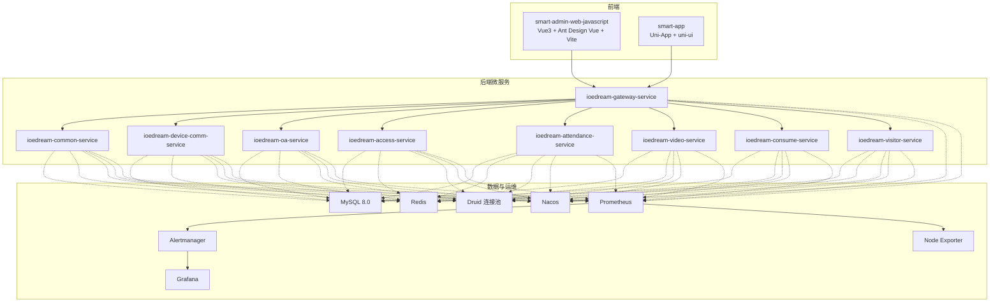
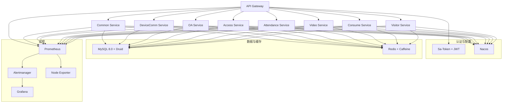
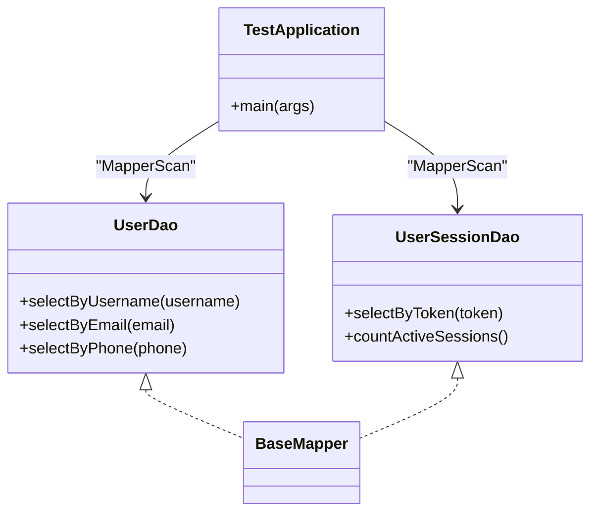
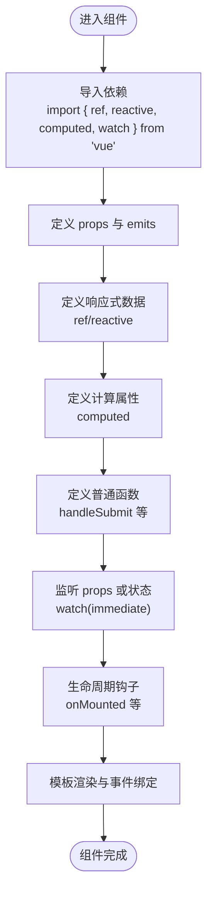
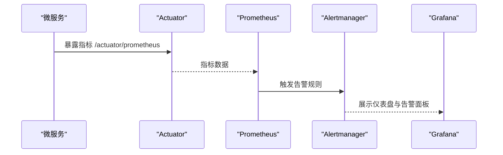
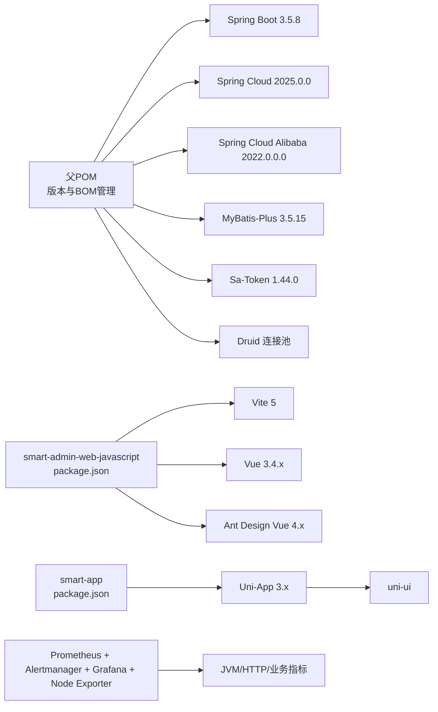

# 技术栈与依赖

<cite>
**本文引用的文件**
- [README.md](file://README.md)
- [CLAUDE.md](file://CLAUDE.md)
- [microservices/pom.xml](file://microservices/pom.xml)
- [ioedream-common-service/OpenApiConfig.java](file://microservices/ioedream-common-service/src/main/java/net/lab1024/sa/common/config/OpenApiConfig.java)
- [microservices-common/UserDao.java](file://microservices/microservices-common/src/main/java/net/lab1024/sa/common/auth/dao/UserDao.java)
- [microservices-common/UserSessionDao.java](file://microservices/microservices-common/src/main/java/net/lab1024/sa/common/auth/dao/UserSessionDao.java)
- [microservices-common/TestApplication.java](file://microservices/microservices-common/src/test/java/net/lab1024/sa/common/TestApplication.java)
- [BEAN_CONFLICT_FIX_REPORT.md](file://BEAN_CONFLICT_FIX_REPORT.md)
- [smart-admin-web-javascript/package.json](file://smart-admin-web-javascript/package.json)
- [smart-app/package.json](file://smart-app/package.json)
- [deployment/monitoring/docker-compose-monitoring.yml](file://deployment/monitoring/docker-compose-monitoring.yml)
- [deployment/monitoring/prometheus/prometheus.yml](file://deployment/monitoring/prometheus/prometheus.yml)
- [deployment/monitoring/alertmanager/alertmanager.yml](file://deployment/monitoring/alertmanager/alertmanager.yml)
- [templates/secure-application.yml](file://templates/secure-application.yml)
- [documentation/01-核心规范/架构规范/系统概述.md](file://documentation/01-核心规范/架构规范/系统概述.md)
- [documentation/01-核心规范/Vue3_Composition_API最佳实践.md](file://documentation/01-核心规范/Vue3_Composition_API最佳实践.md)
- [documentation/04-部署运维/部署指南.md](file://documentation/04-部署运维/部署指南.md)
- [documentation/technical/DEPENDENCY_UPGRADE_PROPOSAL.md](file://documentation/technical/DEPENDENCY_UPGRADE_PROPOSAL.md)
- [scripts/verify-dependency-upgrade.ps1](file://scripts/verify-dependency-upgrade.ps1)
</cite>

## 目录
1. [引言](#引言)
2. [项目结构](#项目结构)
3. [核心组件](#核心组件)
4. [架构总览](#架构总览)
5. [详细组件分析](#详细组件分析)
6. [依赖关系分析](#依赖关系分析)
7. [性能考虑](#性能考虑)
8. [故障排查指南](#故障排查指南)
9. [结论](#结论)
10. [附录](#附录)

## 引言
本文件系统性梳理 IOE-DREAM 项目的“技术栈与依赖”主题，覆盖后端技术栈（Java 17、Spring Boot 3.5.8、MyBatis-Plus、Sa-Token）、前端技术栈（Vue3、Composition API、Uni-App、Ant Design Vue）以及数据与运维技术栈（MySQL 8.0、Redis、Druid、Nacos、Prometheus、Alertmanager）。文档不仅给出版本与作用说明，还解释技术选型背景、集成方式与协同工作机制，帮助开发者理解整体技术生态与最佳实践。

## 项目结构
- 后端采用多模块微服务架构，统一由父 POM 管理版本与依赖，模块包括网关、公共模块、设备通讯、OA、门禁、考勤、视频、消费、访客等。
- 前端包含两套产物：PC 管理端（Vue3 + Ant Design Vue + Vite）与移动端（Uni-App + uni-ui），分别位于 smart-admin-web-javascript 与 smart-app。
- 运维监控采用 Docker Compose 编排 Prometheus、Alertmanager、Grafana 与 Node Exporter，形成可观测闭环。

图表来源
- [microservices/pom.xml](file://microservices/pom.xml#L117-L128)
- [deployment/monitoring/docker-compose-monitoring.yml](file://deployment/monitoring/docker-compose-monitoring.yml#L1-L109)
- [deployment/monitoring/prometheus/prometheus.yml](file://deployment/monitoring/prometheus/prometheus.yml#L1-L99)
- [deployment/monitoring/alertmanager/alertmanager.yml](file://deployment/monitoring/alertmanager/alertmanager.yml#L1-L127)

章节来源
- [README.md](file://README.md#L1-L20)
- [CLAUDE.md](file://CLAUDE.md#L20-L36)
- [documentation/01-核心规范/架构规范/系统概述.md](file://documentation/01-核心规范/架构规范/系统概述.md#L66-L109)

## 核心组件
- 后端技术栈
  - Java 17：统一编译与运行时版本，保证与 Spring Boot 3.5.8、Spring Cloud 2025.0.0、Jakarta EE 3.0+ 的兼容性。
  - Spring Boot 3.5.8：统一依赖管理与插件版本，提供 Actuator、Web、Security 等能力。
  - MyBatis-Plus：提供 BaseMapper、分页、代码生成等能力，DAO 层统一使用 @Mapper 注解与继承 BaseMapper。
  - Sa-Token：提供 JWT 认证与 RBAC 权限控制，结合 Spring Security 实现细粒度鉴权。
  - Nacos：服务注册与配置中心，统一治理微服务。
  - Druid：数据库连接池，提供监控、慢 SQL、安全过滤等能力。
  - Redis：缓存与会话存储，结合 Caffeine 实现多级缓存。
- 前端技术栈
  - Vue3 + Composition API：组件化开发，逻辑复用与可维护性提升。
  - Ant Design Vue 4.x：企业级 UI 组件库，提供丰富交互与一致性设计。
  - Vite 5：快速开发与构建，支持多环境配置与代理。
  - Uni-App：一套代码多端运行（APP、小程序、H5），统一移动端体验。
- 数据与运维技术栈
  - MySQL 8.0：关系型数据库，配合 Druid 连接池与慢 SQL 监控。
  - Redis：会话与缓存，结合多级缓存策略。
  - Prometheus + Alertmanager + Grafana + Node Exporter：统一采集、告警与可视化，覆盖 JVM、HTTP、业务指标与系统资源。

章节来源
- [documentation/01-核心规范/架构规范/系统概述.md](file://documentation/01-核心规范/架构规范/系统概述.md#L66-L109)
- [documentation/01-核心规范/Vue3_Composition_API最佳实践.md](file://documentation/01-核心规范/Vue3_Composition_API最佳实践.md#L11-L1028)
- [deployment/monitoring/docker-compose-monitoring.yml](file://deployment/monitoring/docker-compose-monitoring.yml#L1-L109)

## 架构总览
后端采用七微服务架构，统一由网关服务对外暴露，内部通过 Nacos 进行服务注册与配置下发；数据访问层统一采用 MyBatis-Plus，DAO 层使用 @Mapper 注解并继承 BaseMapper；认证授权采用 Sa-Token + Spring Security；监控链路通过 Actuator 暴露指标，Prometheus 抓取，Alertmanager 分发，Grafana 可视化。

图表来源
- [documentation/01-核心规范/架构规范/系统概述.md](file://documentation/01-核心规范/架构规范/系统概述.md#L66-L109)
- [deployment/monitoring/docker-compose-monitoring.yml](file://deployment/monitoring/docker-compose-monitoring.yml#L1-L109)
- [deployment/monitoring/prometheus/prometheus.yml](file://deployment/monitoring/prometheus/prometheus.yml#L1-L99)
- [deployment/monitoring/alertmanager/alertmanager.yml](file://deployment/monitoring/alertmanager/alertmanager.yml#L1-L127)

## 详细组件分析

### 后端技术栈（Java 17、Spring Boot 3.5.8、MyBatis-Plus、Sa-Token）

- 版本与统一管理
  - 父 POM 统一管理 Java 17、Spring Boot 3.5.8、Spring Cloud 2025.0.0、MyBatis-Plus 3.5.15、Sa-Token 1.44.0、Druid 等版本，确保各模块一致性。
  - 通过 Spring Boot、Spring Cloud、Spring Cloud Alibaba 三大 BOM 管理依赖版本，避免冲突。
- 数据访问层规范
  - DAO 接口统一使用 @Mapper 注解并继承 BaseMapper<Entity>，查询方法标注 @Transactional(readOnly = true)，写操作标注 @Transactional(rollbackFor = Exception.class)。
  - DAO 接口命名使用 Dao 后缀，避免 Repository 后缀；依赖注入使用 @Resource，而非 @Autowired。
  - 通过 TestApplication 的 @MapperScan 扫描不同包，避免同名 Bean 冲突。
- 认证与授权
  - Sa-Token + JWT 提供无状态认证；结合 Spring Security 的方法级安全注解，实现细粒度权限控制。
  - OpenApiConfig 中明确列出 Spring Boot 3.5.8、Spring Cloud 2023.0.0、Sa-Token + JWT、MyBatis-Plus、Redis、MySQL 等技术栈。
- 配置与安全
  - secure-application.yml 模板展示 Druid 数据源配置、MySQL 驱动、Redis 连接、Nacos 加密配置等关键参数。
  - 依赖升级建议与验证脚本确保版本一致性与兼容性。

图表来源
- [microservices/microservices-common/src/main/java/net/lab1024/sa/common/auth/dao/UserDao.java](file://microservices/microservices-common/src/main/java/net/lab1024/sa/common/auth/dao/UserDao.java#L1-L49)
- [microservices/microservices-common/src/main/java/net/lab1024/sa/common/auth/dao/UserSessionDao.java](file://microservices/microservices-common/src/main/java/net/lab1024/sa/common/auth/dao/UserSessionDao.java#L1-L46)
- [microservices/microservices-common/src/main/java/net/lab1024/sa/common/TestApplication.java](file://microservices/microservices-common/src/test/java/net/lab1024/sa/common/TestApplication.java#L25-L53)

章节来源
- [microservices/pom.xml](file://microservices/pom.xml#L16-L82)
- [microservices/microservices-common/src/main/java/net/lab1024/sa/common/auth/dao/UserDao.java](file://microservices/microservices-common/src/main/java/net/lab1024/sa/common/auth/dao/UserDao.java#L1-L49)
- [microservices/microservices-common/src/main/java/net/lab1024/sa/common/auth/dao/UserSessionDao.java](file://microservices/microservices-common/src/main/java/net/lab1024/sa/common/auth/dao/UserSessionDao.java#L1-L46)
- [microservices/microservices-common/src/test/java/net/lab1024/sa/common/TestApplication.java](file://microservices/microservices-common/src/test/java/net/lab1024/sa/common/TestApplication.java#L25-L53)
- [ioedream-common-service/OpenApiConfig.java](file://microservices/ioedream-common-service/src/main/java/net/lab1024/sa/common/config/OpenApiConfig.java#L75-L113)
- [templates/secure-application.yml](file://templates/secure-application.yml#L40-L84)
- [documentation/technical/DEPENDENCY_UPGRADE_PROPOSAL.md](file://documentation/technical/DEPENDENCY_UPGRADE_PROPOSAL.md#L73-L166)
- [scripts/verify-dependency-upgrade.ps1](file://scripts/verify-dependency-upgrade.ps1#L46-L81)

### 前端技术栈（Vue3、Composition API、Uni-App、Ant Design Vue）

- Vue3 + Composition API
  - 组件采用 <script setup> 结构，严格遵循导入、props/emits、响应式数据、计算属性、普通函数、watch、生命周期的顺序，提升可读性与可维护性。
  - 使用 Pinia 进行状态管理，Ant Design Vue 4.x 提供 UI 组件与样式。
- Vite 构建
  - 多环境构建脚本（localhost、dev、test、pre、prod），支持 base 路径、别名、代理与 Rollup 代码分割优化。
- Uni-App
  - 一套代码多端运行，支持 APP、小程序、H5，统一移动端体验；依赖 @dcloudio/uni-app、uni-ui、vue3 等。

图表来源
- [documentation/01-核心规范/Vue3_Composition_API最佳实践.md](file://documentation/01-核心规范/Vue3_Composition_API最佳实践.md#L11-L1028)

章节来源
- [documentation/01-核心规范/Vue3_Composition_API最佳实践.md](file://documentation/01-核心规范/Vue3_Composition_API最佳实践.md#L11-L1028)
- [documentation/04-部署运维/部署指南.md](file://documentation/04-部署运维/部署指南.md#L137-L171)
- [smart-admin-web-javascript/package.json](file://smart-admin-web-javascript/package.json#L1-L76)
- [smart-app/package.json](file://smart-app/package.json#L1-L90)

### 数据与运维技术栈（MySQL 8.0、Redis、Druid、Nacos、Prometheus、Alertmanager）

- 数据库与连接池
  - MySQL 8.0 驱动与连接字符串在 secure-application.yml 中配置；Druid 提供初始大小、最大活跃、慢 SQL 监控、安全过滤等能力。
  - 依赖升级建议与验证脚本确保 MySQL Connector、MyBatis-Plus、Druid、Lombok、MapStruct、JJWT 等版本一致。
- 缓存与多级缓存
  - Redis 用于会话与缓存，结合 Caffeine 实现 L1/L2/L3 多级缓存策略，降低数据库压力。
- 配置中心与服务治理
  - Nacos 作为服务注册与配置中心，统一治理微服务，支持加密配置与动态刷新。
- 监控与告警
  - Prometheus 通过静态配置抓取各服务 /actuator/prometheus 指标；Alertmanager 路由与抑制规则实现分级告警；Grafana 展示系统与业务仪表盘；Node Exporter 采集主机指标。

图表来源
- [deployment/monitoring/prometheus/prometheus.yml](file://deployment/monitoring/prometheus/prometheus.yml#L1-L99)
- [deployment/monitoring/alertmanager/alertmanager.yml](file://deployment/monitoring/alertmanager/alertmanager.yml#L1-L127)
- [deployment/monitoring/docker-compose-monitoring.yml](file://deployment/monitoring/docker-compose-monitoring.yml#L1-L109)

章节来源
- [templates/secure-application.yml](file://templates/secure-application.yml#L40-L84)
- [documentation/technical/DEPENDENCY_UPGRADE_PROPOSAL.md](file://documentation/technical/DEPENDENCY_UPGRADE_PROPOSAL.md#L73-L166)
- [scripts/verify-dependency-upgrade.ps1](file://scripts/verify-dependency-upgrade.ps1#L46-L81)
- [deployment/monitoring/docker-compose-monitoring.yml](file://deployment/monitoring/docker-compose-monitoring.yml#L1-L109)
- [deployment/monitoring/prometheus/prometheus.yml](file://deployment/monitoring/prometheus/prometheus.yml#L1-L99)
- [deployment/monitoring/alertmanager/alertmanager.yml](file://deployment/monitoring/alertmanager/alertmanager.yml#L1-L127)

## 依赖关系分析
- 后端依赖管理
  - 父 POM 通过 Spring Boot、Spring Cloud、Spring Cloud Alibaba 三大 BOM 管理版本，避免依赖冲突；统一 Java 17、Spring Boot 3.5.8、MyBatis-Plus 3.5.15、Sa-Token 1.44.0、Druid 等版本。
  - DAO 层统一使用 @Mapper 注解与 BaseMapper，避免 @Repository 与 @Autowired 的使用，符合 CLAUDE.md 规范。
  - TestApplication 通过多个 @MapperScan 扫描不同包，解决 Bean 冲突问题。
- 前端依赖管理
  - smart-admin-web-javascript 与 smart-app 分别维护各自 package.json，分别对应 PC 管理端与移动端。
  - Vite 5 与 Vue 3.4.x、Ant Design Vue 4.x、Pinia 等版本组合，满足现代前端开发需求。
- 运维依赖管理
  - Docker Compose 编排 Prometheus、Alertmanager、Grafana、Node Exporter，Prometheus 静态配置抓取各服务指标，Alertmanager 路由与抑制规则实现分级告警。

图表来源
- [microservices/pom.xml](file://microservices/pom.xml#L84-L114)
- [smart-admin-web-javascript/package.json](file://smart-admin-web-javascript/package.json#L1-L76)
- [smart-app/package.json](file://smart-app/package.json#L1-L90)
- [deployment/monitoring/docker-compose-monitoring.yml](file://deployment/monitoring/docker-compose-monitoring.yml#L1-L109)

章节来源
- [microservices/pom.xml](file://microservices/pom.xml#L84-L114)
- [BEAN_CONFLICT_FIX_REPORT.md](file://BEAN_CONFLICT_FIX_REPORT.md#L1-L52)
- [smart-admin-web-javascript/package.json](file://smart-admin-web-javascript/package.json#L1-L76)
- [smart-app/package.json](file://smart-app/package.json#L1-L90)
- [deployment/monitoring/docker-compose-monitoring.yml](file://deployment/monitoring/docker-compose-monitoring.yml#L1-L109)

## 性能考虑
- 数据库层
  - 使用 Druid 连接池，开启慢 SQL 监控与安全过滤，结合索引优化脚本与连接池参数调优，降低慢查询与连接抖动风险。
  - 建议定期执行索引优化与 SQL 分析，避免热点表与全表扫描。
- 缓存层
  - Redis + Caffeine 多级缓存，合理设置 TTL 与淘汰策略，避免缓存穿透与雪崩。
- 监控与告警
  - Prometheus 抓取 JVM、HTTP 请求耗时、GC、数据库连接池等关键指标；Alertmanager 分组与抑制规则避免告警风暴；Grafana 仪表盘辅助容量规划与性能分析。
- 前端性能
  - Vite 代码分割与按需加载，Ant Design Vue 组件按需引入，减少首屏体积；Pinia 状态管理避免不必要的重渲染。

[本节为通用指导，无需具体文件引用]

## 故障排查指南
- DAO Bean 冲突
  - 现象：Spring Boot 测试上下文加载失败，提示同名 Bean 冲突。
  - 根因：多个 DAO 接口同名（如 UserDao），默认 Bean 名称冲突。
  - 解决：为每个 DAO 指定唯一 Bean 名称，避免同名冲突。
- 依赖版本不一致
  - 现象：编译报错或运行时异常。
  - 解决：参考依赖升级提案与验证脚本，统一版本属性与依赖范围，确保 MySQL Connector、MyBatis-Plus、Druid、Lombok、MapStruct、JJWT 等版本一致。
- 前端环境变量与构建
  - 现象：开发/生产环境接口代理或构建产物异常。
  - 解决：检查 .env.* 与 vite.config.js 的环境变量与代理配置，确认多环境构建脚本正确。

章节来源
- [BEAN_CONFLICT_FIX_REPORT.md](file://BEAN_CONFLICT_FIX_REPORT.md#L1-L52)
- [documentation/technical/DEPENDENCY_UPGRADE_PROPOSAL.md](file://documentation/technical/DEPENDENCY_UPGRADE_PROPOSAL.md#L73-L166)
- [scripts/verify-dependency-upgrade.ps1](file://scripts/verify-dependency-upgrade.ps1#L46-L81)
- [documentation/04-部署运维/部署指南.md](file://documentation/04-部署运维/部署指南.md#L137-L171)

## 结论
IOE-DREAM 项目以“高性能、高可用、可扩展”为目标，采用 Java 17 + Spring Boot 3.5.8 + MyBatis-Plus + Sa-Token 的后端技术栈，Vue3 + Composition API + Ant Design Vue 的前端技术栈，以及 MySQL 8.0 + Redis + Druid + Nacos + Prometheus + Alertmanager 的数据与运维技术栈。通过统一的版本管理、严格的 DAO 层规范、完善的监控告警与多级缓存策略，项目在企业级微服务架构下实现了良好的稳定性与可维护性。建议持续关注依赖升级与性能优化，确保系统长期健康演进。

[本节为总结性内容，无需具体文件引用]

## 附录

### 技术栈版本对照与作用说明
- 后端
  - Java 17：统一编译与运行时，兼容 Spring Boot 3.5.8、Spring Cloud 2025.0.0、Jakarta EE 3.0+。
  - Spring Boot 3.5.8：提供 Actuator、Web、Security 等能力，统一插件与依赖版本。
  - MyBatis-Plus 3.5.15：提供 BaseMapper、分页、代码生成等能力。
  - Sa-Token 1.44.0：JWT 认证与 RBAC 权限控制。
  - Nacos：服务注册与配置中心。
  - Druid：数据库连接池，提供慢 SQL 监控与安全过滤。
  - Redis + Caffeine：会话与多级缓存。
- 前端
  - Vue3 + Composition API：组件化开发与逻辑复用。
  - Ant Design Vue 4.x：企业级 UI 组件库。
  - Vite 5：快速开发与构建。
  - Uni-App：一套代码多端运行。
- 运维
  - Prometheus：指标采集与规则评估。
  - Alertmanager：告警路由与抑制。
  - Grafana：可视化与仪表盘。
  - Node Exporter：主机指标采集。

章节来源
- [microservices/pom.xml](file://microservices/pom.xml#L16-L82)
- [documentation/01-核心规范/架构规范/系统概述.md](file://documentation/01-核心规范/架构规范/系统概述.md#L66-L109)
- [deployment/monitoring/docker-compose-monitoring.yml](file://deployment/monitoring/docker-compose-monitoring.yml#L1-L109)