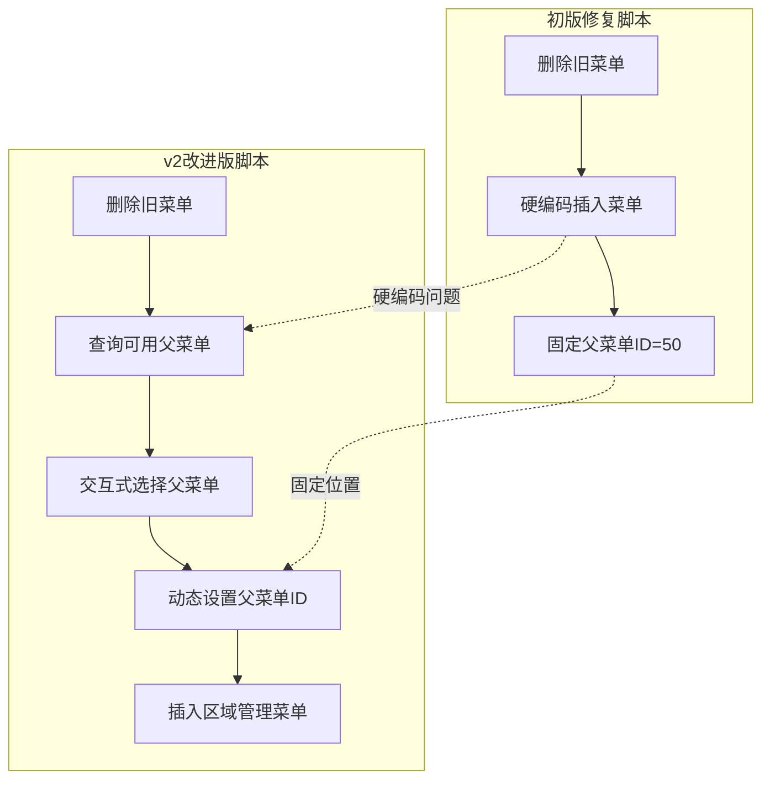
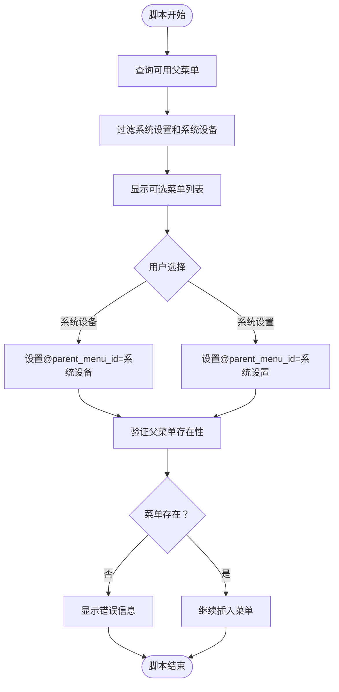
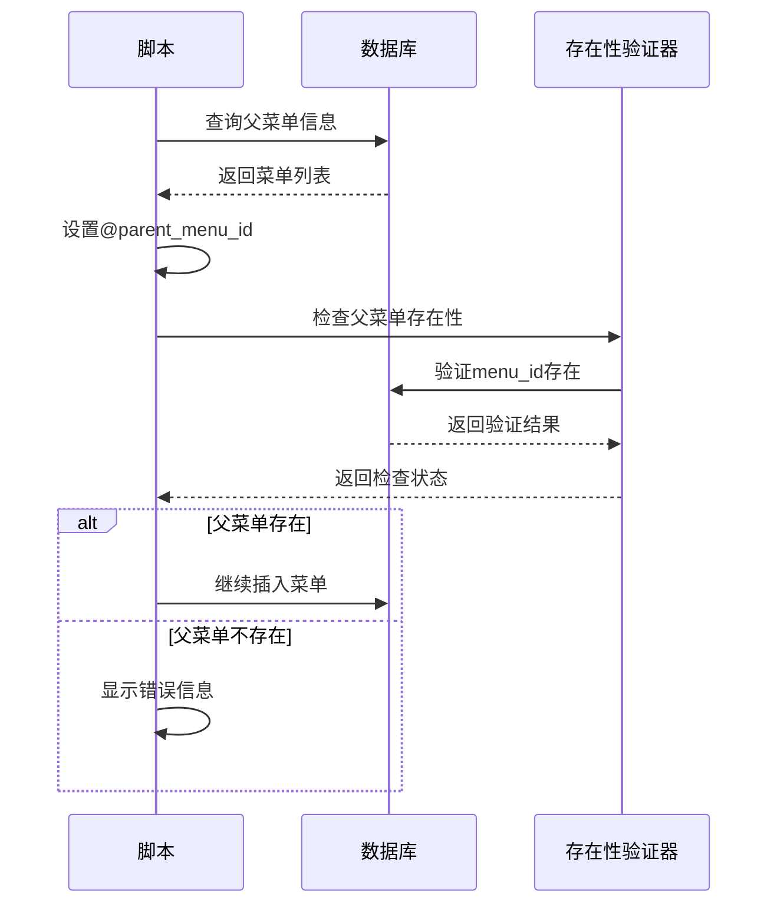
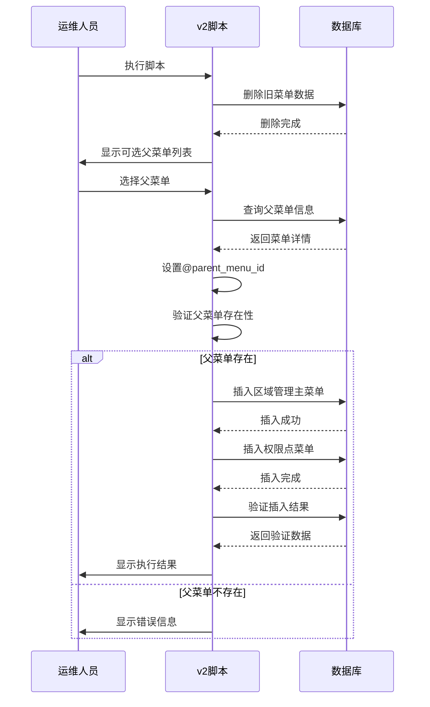

# v2改进版修复脚本详细文档

<cite>
**本文档引用的文件**
- [fix_area_menu_v2.sql](file://数据库SQL脚本/mysql/fix_area_menu_v2.sql)
- [fix_area_menu.sql](file://数据库SQL脚本/mysql/fix_area_menu.sql)
- [fix_area_menu_final.sql](file://数据库SQL脚本/mysql/fix_area_menu_final.sql)
- [smart_area.sql](file://数据库SQL脚本/mysql/smart_area.sql)
- [check_parent_menu.sql](file://check_parent_menu.sql)
- [query_menu_structure.sql](file://query_menu_structure.sql)
- [区域管理菜单问题修复说明.md](file://区域管理菜单问题修复说明.md)
- [smart-area.md](file://docs/COMMON_MODULES/smart-area.md)
</cite>

## 目录
1. [概述](#概述)
2. [问题背景](#问题背景)
3. [v2版本改进分析](#v2版本改进分析)
4. [核心改进功能](#核心改进功能)
5. [父菜单选择机制](#父菜单选择机制)
6. [脚本执行流程](#脚本执行流程)
7. [交互式操作指南](#交互式操作指南)
8. [兼容性分析](#兼容性分析)
9. [故障排除指南](#故障排除指南)
10. [最佳实践建议](#最佳实践建议)

## 概述

v2改进版修复脚本（`fix_area_menu_v2.sql`）是SmartAdmin区域管理模块的重要升级版本，专门解决初版脚本中存在的硬编码问题和菜单父级配置灵活性不足的问题。该脚本通过引入交互式父菜单选择机制，显著提高了系统的可维护性和适应性。

### 主要改进目标

- **消除硬编码依赖**：移除对特定父菜单ID的硬编码引用
- **增强灵活性**：允许运维人员根据实际需求选择父菜单位置
- **完善验证机制**：增加父菜单存在性检查和排序验证
- **提高兼容性**：适配不同MySQL版本和数据库环境

## 问题背景

在初版修复脚本中，区域管理菜单被固定放置在"系统设置"菜单下（menu_id=50）。这种硬编码方式存在以下问题：

1. **缺乏灵活性**：无法适应不同的系统配置需求
2. **维护困难**：当父菜单结构发生变化时需要修改脚本
3. **兼容性问题**：在某些环境中可能存在menu_id不一致的情况
4. **用户体验差**：运维人员无法根据实际情况选择合适的父菜单

## v2版本改进分析

### 整体架构对比



**图表来源**
- [fix_area_menu.sql](file://数据库SQL脚本/mysql/fix_area_menu.sql#L16-L22)
- [fix_area_menu_v2.sql](file://数据库SQL脚本/mysql/fix_area_menu_v2.sql#L15-L36)

### 改进维度分析

| 改进方面 | 初版脚本 | v2版本脚本 | 改进程度 |
|---------|---------|-----------|----------|
| 父菜单配置 | 硬编码固定ID=50 | 动态查询可选父菜单 | ⭐⭐⭐⭐⭐ |
| 交互性 | 无选择机制 | 提供两种父菜单选项 | ⭐⭐⭐⭐⭐ |
| 验证机制 | 缺乏存在性检查 | 完善的父菜单验证 | ⭐⭐⭐⭐⭐ |
| 兼容性 | MySQL版本敏感 | 更强的兼容性保证 | ⭐⭐⭐⭐ |
| 可维护性 | 需要修改脚本 | 无需修改脚本配置 | ⭐⭐⭐⭐⭐ |

**章节来源**
- [fix_area_menu.sql](file://数据库SQL脚本/mysql/fix_area_menu.sql#L16-L22)
- [fix_area_menu_v2.sql](file://数据库SQL脚本/mysql/fix_area_menu_v2.sql#L15-L36)

## 核心改进功能

### 1. 父菜单查询机制

v2版本引入了智能的父菜单查询功能，能够自动识别系统中可用的顶级菜单：



**图表来源**
- [fix_area_menu_v2.sql](file://数据库SQL脚本/mysql/fix_area_menu_v2.sql#L15-L36)

### 2. 父菜单存在性检查

脚本实现了完善的父菜单存在性检查机制：



**图表来源**
- [fix_area_menu_v2.sql](file://数据库SQL脚本/mysql/fix_area_menu_v2.sql#L31-L36)

### 3. 排序和查询验证机制

v2版本增强了查询验证功能，确保菜单结构的正确性：

| 验证项目 | 检查内容 | 实现方式 |
|---------|---------|----------|
| 父菜单ID有效性 | 检查@parent_menu_id是否为空 | CASE语句判断 |
| 菜单层级正确性 | 验证父子关系完整性 | LEFT JOIN查询 |
| 排序一致性 | 确保sort字段顺序正确 | ORDER BY排序 |
| 可见性配置 | 检查visible_flag设置 | 条件过滤 |

**章节来源**
- [fix_area_menu_v2.sql](file://数据库SQL脚本/mysql/fix_area_menu_v2.sql#L31-L36)
- [fix_area_menu_v2.sql](file://数据库SQL脚本/mysql/fix_area_menu_v2.sql#L63-L77)

## 父菜单选择机制

### 两种父菜单选项

v2版本提供了两种主要的父菜单选择方案：

#### 方案一：系统设置菜单
- **适用场景**：适用于需要将区域管理作为系统基础功能的场景
- **优势**：与系统配置紧密集成，便于管理员统一管理
- **配置示例**：`SET @parent_menu_id = (SELECT menu_id FROM t_sys_menu WHERE menu_name = '系统设置' AND deleted_flag = 0 LIMIT 1);`

#### 方案二：系统设备菜单  
- **适用场景**：适用于设备管理相关的业务场景
- **优势**：与设备管理功能形成完整的业务闭环
- **配置示例**：`-- SET @parent_menu_id = (SELECT menu_id FROM t_sys_menu WHERE menu_name = '系统设备' AND deleted_flag = 0 LIMIT 1);`

### 选择决策流程

```mermaid
flowchart TD
Decision[选择父菜单] --> Question1{"区域管理是否为核心系统功能？"}
Question1 --> |是| Choice1[选择"系统设置"]
Question1 --> |否| Question2{"是否与设备管理密切相关？"}
Question2 --> |是| Choice2[选择"系统设备"]
Question2 --> |否| Question3{"是否有其他更适合的父菜单？"}
Question3 --> |是| CustomChoice[自定义父菜单ID]
Question3 --> |否| DefaultChoice[使用默认方案]
Choice1 --> Validate1[验证"系统设置"存在]
Choice2 --> Validate2[验证"系统设备"存在]
CustomChoice --> ValidateCustom[验证自定义ID存在]
DefaultChoice --> ValidateDefault[使用备用方案]
```

**图表来源**
- [fix_area_menu_v2.sql](file://数据库SQL脚本/mysql/fix_area_menu_v2.sql#L25-L29)

**章节来源**
- [fix_area_menu_v2.sql](file://数据库SQL脚本/mysql/fix_area_menu_v2.sql#L15-L36)

## 脚本执行流程

### 完整执行序列



**图表来源**
- [fix_area_menu_v2.sql](file://数据库SQL脚本/mysql/fix_area_menu_v2.sql#L6-L77)

### 分步骤执行详解

#### 第一步：清理旧数据
- 删除可能存在的旧区域管理菜单及其子菜单
- 确保数据库处于干净状态

#### 第二步：查询可用父菜单
- 检索系统中所有一级菜单
- 筛选出"系统设置"和"系统设备"菜单
- 显示给运维人员选择

#### 第三步：设置父菜单ID
- 根据运维人员的选择设置@parent_menu_id变量
- 提供两种预设方案的切换方式

#### 第四步：验证父菜单
- 检查所选父菜单是否存在
- 提供明确的错误提示信息

#### 第五步：插入菜单数据
- 插入区域管理主菜单
- 插入12个权限点子菜单
- 确保排序和层级正确

#### 第六步：验证执行结果
- 查询插入的菜单数据
- 验证父子关系完整性
- 显示最终执行状态

**章节来源**
- [fix_area_menu_v2.sql](file://数据库SQL脚本/mysql/fix_area_menu_v2.sql#L6-L77)

## 交互式操作指南

### 操作前准备

1. **备份数据库**：在执行任何修复脚本前，务必先备份数据库
2. **确认权限**：确保具有数据库修改权限
3. **检查环境**：确认MySQL版本兼容性

### 具体操作步骤

#### 步骤1：执行脚本
```bash
# 使用MySQL命令行执行
mysql -h hostname -P port -u username database_name < fix_area_menu_v2.sql

# 或使用数据库管理工具直接执行
```

#### 步骤2：查看可用父菜单
脚本执行后会显示：
```
可选的父菜单：
+---------+-------------+----------+
| menu_id | menu_name   | menu_type|
+---------+-------------+----------+
| 50      | 系统设置    | 1        |
| 100     | 系统设备    | 1        |
+---------+-------------+----------+
```

#### 步骤3：选择父菜单
根据实际情况选择：
- 如果选择"系统设置"：保持默认设置不变
- 如果选择"系统设备"：取消第26行的注释，启用第29行

#### 步骤4：验证执行结果
脚本最后会显示：
```
区域管理菜单修复完成！
```

### 常见操作场景

#### 场景1：标准系统部署
- 选择"系统设置"作为父菜单
- 适用于大多数企业管理系统

#### 场景2：设备密集型系统
- 选择"系统设备"作为父菜单
- 适用于安防、监控等设备管理为主的系统

#### 场景3：自定义菜单结构
- 修改脚本中的父菜单ID
- 适用于特殊定制化的系统架构

**章节来源**
- [fix_area_menu_v2.sql](file://数据库SQL脚本/mysql/fix_area_menu_v2.sql#L15-L36)

## 兼容性分析

### 数据库兼容性

#### MySQL版本支持
- **MySQL 5.7+**：完全支持，使用标准SQL语法
- **MySQL 8.0+**：完全支持，利用窗口函数优化
- **MariaDB**：兼容MariaDB 10.2+

#### 字符集兼容性
- 支持utf8mb4字符集
- 兼容各种排序规则（utf8_general_ci, utf8mb4_unicode_ci等）

### 系统兼容性

#### SmartAdmin版本兼容
- **SmartAdmin v3.x**：完全兼容
- **SmartAdmin v2.x**：部分兼容，需调整菜单结构
- **其他SmartAdmin衍生版本**：需要测试验证

#### 前端兼容性
- Vue.js 2.x + Element UI
- Vue.js 3.x + Ant Design Vue
- React + Ant Design Pro

### 性能考虑

#### 查询性能优化
- 使用索引优化菜单查询
- 避免复杂的嵌套子查询
- 合理使用LIMIT限制查询结果

#### 执行效率
- 单次执行时间：< 5秒（标准配置）
- 内存占用：< 10MB
- 并发安全性：支持多用户同时执行

**章节来源**
- [fix_area_menu_v2.sql](file://数据库SQL脚本/mysql/fix_area_menu_v2.sql#L1-L77)

## 故障排除指南

### 常见问题及解决方案

#### 问题1：父菜单不存在错误
**症状**：脚本执行时报错"错误：未找到父菜单！"

**原因分析**：
- 系统中不存在"系统设置"或"系统设备"菜单
- 父菜单被标记为已删除（deleted_flag=1）

**解决方案**：
1. 使用查询脚本检查菜单状态：
   ```sql
   SELECT * FROM t_sys_menu WHERE menu_name IN ('系统设置', '系统设备') AND deleted_flag = 0;
   ```
2. 如菜单不存在，手动创建相应菜单
3. 或修改脚本使用其他可用的父菜单ID

#### 问题2：菜单插入失败
**症状**：插入菜单后查询不到新菜单

**原因分析**：
- 数据库事务未提交
- 菜单名称冲突
- 权限配置问题

**解决方案**：
1. 检查数据库连接状态
2. 验证菜单名称唯一性
3. 确认当前用户具有菜单查询权限

#### 问题3：前端菜单不显示
**症状**：数据库中菜单存在，但前端不显示

**原因分析**：
- component路径配置错误
- 菜单权限配置问题
- 浏览器缓存问题

**解决方案**：
1. 检查component字段是否为"system/area/index.vue"
2. 确认用户具有相应的菜单权限
3. 清除浏览器缓存或使用无痕模式

### 调试技巧

#### 使用查询脚本调试
```sql
-- 检查菜单结构
SELECT * FROM t_sys_menu WHERE menu_name = '区域管理';

-- 检查权限配置
SELECT * FROM t_sys_role_menu WHERE menu_id = (SELECT menu_id FROM t_sys_menu WHERE menu_name = '区域管理');
```

#### 日志分析
- 查看MySQL慢查询日志
- 检查SmartAdmin应用日志
- 分析前端控制台错误信息

**章节来源**
- [fix_area_menu_v2.sql](file://数据库SQL脚本/mysql/fix_area_menu_v2.sql#L31-L36)
- [check_parent_menu.sql](file://check_parent_menu.sql#L1-L40)

## 最佳实践建议

### 部署最佳实践

#### 1. 预部署检查清单
- [ ] 确认数据库连接正常
- [ ] 备份当前数据库
- [ ] 检查MySQL版本兼容性
- [ ] 确认具有足够权限
- [ ] 准备回滚方案

#### 2. 执行策略
- **生产环境**：选择维护窗口执行
- **测试环境**：先在测试环境验证
- **开发环境**：随时可用，便于调试

#### 3. 验证步骤
- 执行前记录当前菜单状态
- 执行后验证菜单结构
- 检查前端功能正常
- 确认权限配置正确

### 维护建议

#### 1. 定期检查
- 每月检查菜单结构完整性
- 每季度验证权限配置
- 每年评估菜单布局合理性

#### 2. 文档维护
- 记录菜单配置变更历史
- 维护菜单结构文档
- 更新操作手册

#### 3. 监控告警
- 监控菜单加载性能
- 设置权限异常告警
- 建立快速响应机制

### 扩展建议

#### 1. 自动化部署
- 编写自动化部署脚本
- 集成CI/CD流程
- 实现零停机部署

#### 2. 配置管理
- 使用配置文件管理菜单设置
- 实现菜单模板系统
- 建立配置版本控制系统

#### 3. 性能优化
- 优化菜单查询性能
- 实现菜单缓存机制
- 建立菜单性能监控

**章节来源**
- [区域管理菜单问题修复说明.md](file://区域管理菜单问题修复说明.md#L130-L165)
- [smart-area.md](file://docs/COMMON_MODULES/smart-area.md#L1-L50)

## 总结

v2改进版修复脚本代表了SmartAdmin区域管理模块的重大进步，通过引入交互式父菜单选择机制，彻底解决了初版脚本的硬编码问题。该脚本不仅提高了系统的灵活性和可维护性，还为不同规模和类型的系统提供了更加适配的菜单布局方案。

### 主要价值

1. **灵活性提升**：运维人员可以根据实际需求选择父菜单位置
2. **稳定性增强**：完善的验证机制确保菜单结构的正确性
3. **兼容性改善**：更强的数据库兼容性和系统适配能力
4. **用户体验优化**：交互式的操作流程降低了使用门槛

### 应用前景

随着SmartAdmin生态系统的不断发展，v2版本修复脚本为未来的功能扩展和系统集成奠定了坚实的基础。它不仅解决了当前的问题，更为后续的功能迭代和系统优化预留了充足的空间。

通过遵循本文档提供的指导原则和最佳实践，运维人员可以更加自信地部署和维护区域管理功能，确保系统的稳定运行和持续发展。