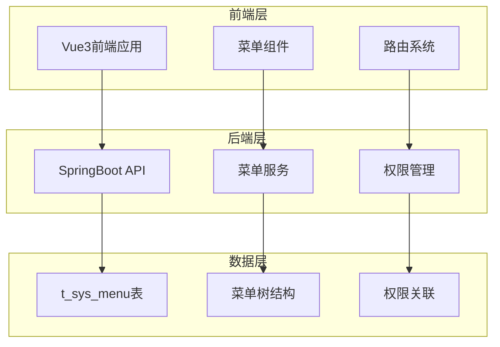
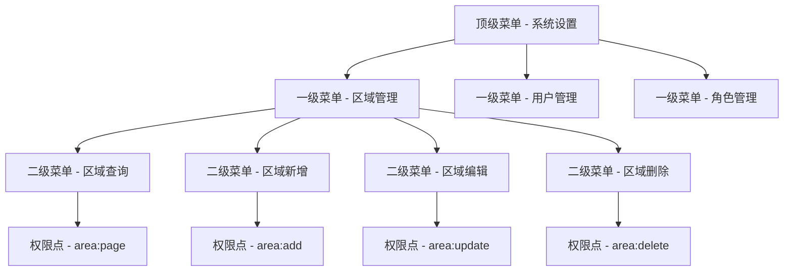
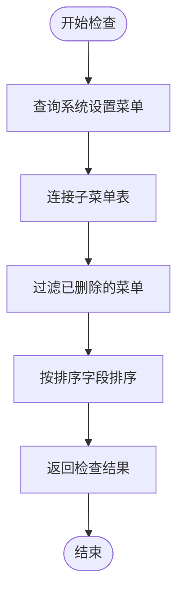
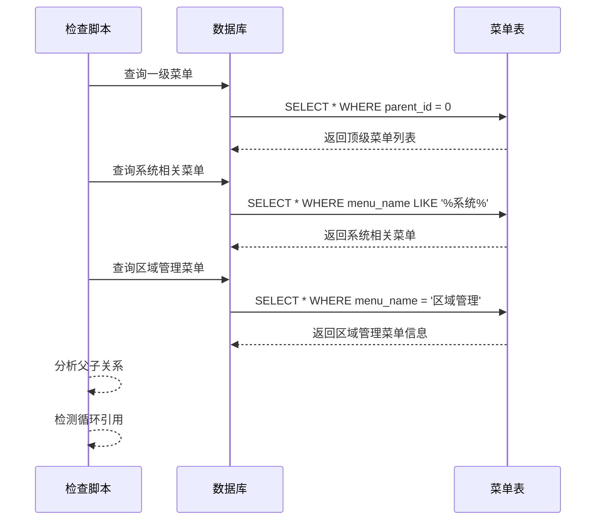
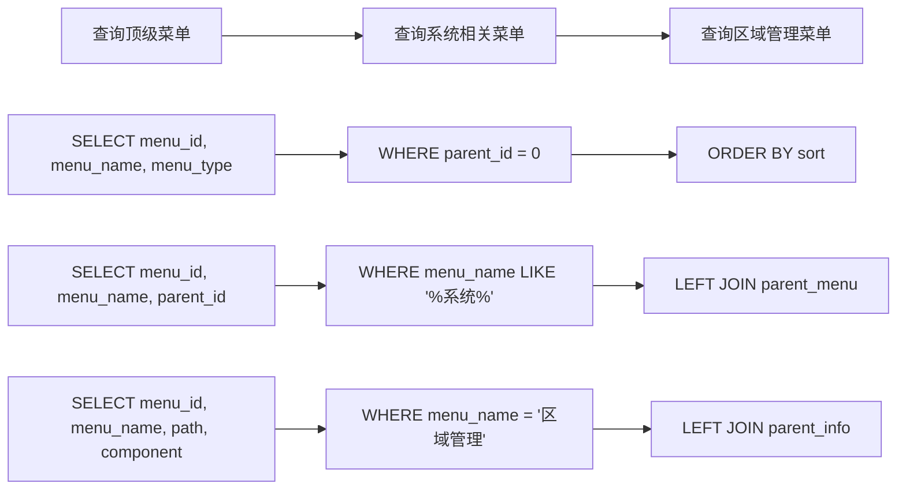
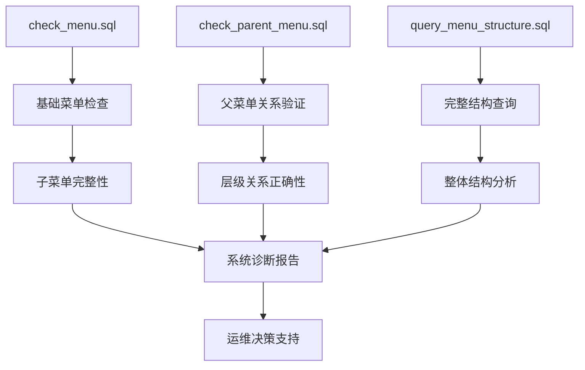

# 查询脚本

<cite>
**本文档中引用的文件**
- [check_menu.sql](file://check_menu.sql)
- [check_parent_menu.sql](file://check_parent_menu.sql)
- [query_menu_structure.sql](file://query_menu_structure.sql)
- [fix_area_menu.sql](file://数据库SQL脚本/mysql/fix_area_menu.sql)
- [fix_area_menu_final.sql](file://数据库SQL脚本/mysql/fix_area_menu_final.sql)
- [README.md](file://README.md)
</cite>

## 目录
1. [简介](#简介)
2. [项目结构](#项目结构)
3. [核心查询脚本](#核心查询脚本)
4. [架构概述](#架构概述)
5. [详细组件分析](#详细组件分析)
6. [依赖关系分析](#依赖关系分析)
7. [性能考虑](#性能考虑)
8. [故障排除指南](#故障排除指南)
9. [结论](#结论)

## 简介

SmartAdmin是一个基于SpringBoot3+Vue3的企业级快速开发平台，提供了完整的菜单管理系统。本文档详细介绍了与菜单相关的查询脚本功能，包括菜单完整性检查、父菜单验证和菜单结构查询等核心功能。这些查询脚本主要用于系统诊断、数据验证和运维检查，确保菜单系统的完整性和正确性。

## 项目结构

SmartAdmin采用前后端分离架构，菜单系统作为核心功能模块之一，涉及多个层次的组件：

**图表来源**
- [README.md](file://README.md#L1-L84)

**章节来源**
- [README.md](file://README.md#L1-L84)

## 核心查询脚本

SmartAdmin提供了三个核心的菜单查询脚本，每个脚本都有特定的功能和用途：

### 脚本概览

| 脚本文件 | 主要功能 | 应用场景 |
|---------|---------|---------|
| check_menu.sql | 检查系统设置下的子菜单配置 | 子菜单完整性验证 |
| check_parent_menu.sql | 验证父菜单关系和层级结构 | 父子菜单关系检查 |
| query_menu_structure.sql | 查询菜单整体结构和配置 | 菜单结构分析 |

**章节来源**
- [check_menu.sql](file://check_menu.sql#L1-L31)
- [check_parent_menu.sql](file://check_parent_menu.sql#L1-L40)
- [query_menu_structure.sql](file://query_menu_structure.sql#L1-L42)

## 架构概述

菜单系统采用典型的树形结构设计，支持无限层级的菜单组织：

**图表来源**
- [fix_area_menu.sql](file://数据库SQL脚本/mysql/fix_area_menu.sql#L19-L38)
- [fix_area_menu_final.sql](file://数据库SQL脚本/mysql/fix_area_menu_final.sql#L18-L61)

## 详细组件分析

### check_menu.sql - 子菜单完整性检查

该脚本专门用于检查系统设置下的子菜单配置，确保子菜单的完整性和正确性。

#### 查询逻辑分析

**图表来源**
- [check_menu.sql](file://check_menu.sql#L1-L16)

#### 关键特性

1. **父子关系验证**：通过LEFT JOIN验证父子菜单关系
2. **完整性检查**：确保子菜单与父菜单的关联正确
3. **状态过滤**：只检查未删除的菜单项
4. **排序输出**：按照菜单排序字段进行有序输出

**章节来源**
- [check_menu.sql](file://check_menu.sql#L1-L31)

### check_parent_menu.sql - 父菜单关系验证

该脚本专注于验证菜单的父级关系和层级结构，防止循环引用和无效的父子关系。

#### 验证流程

**图表来源**
- [check_parent_menu.sql](file://check_parent_menu.sql#L1-L40)

#### 核心验证功能

1. **一级菜单检查**：验证顶级菜单的parent_id为0
2. **系统菜单验证**：检查包含"系统"关键字的菜单
3. **特定菜单检查**：专门验证区域管理菜单的配置
4. **关系完整性**：确保父子菜单关系的正确性

**章节来源**
- [check_parent_menu.sql](file://check_parent_menu.sql#L1-L40)

### query_menu_structure.sql - 菜单结构查询

该脚本提供全面的菜单结构查询功能，支持递归查询和性能优化。

#### 查询策略

**图表来源**
- [query_menu_structure.sql](file://query_menu_structure.sql#L1-L42)

#### 性能优化策略

1. **索引利用**：充分利用parent_id和deleted_flag字段的索引
2. **条件过滤**：通过deleted_flag=0提前过滤无效数据
3. **排序优化**：使用sort字段进行有序查询
4. **连接优化**：合理使用LEFT JOIN避免笛卡尔积

**章节来源**
- [query_menu_structure.sql](file://query_menu_structure.sql#L1-L42)

## 依赖关系分析

菜单查询脚本之间存在复杂的依赖关系和相互补充的关系：

**图表来源**
- [check_menu.sql](file://check_menu.sql#L1-L31)
- [check_parent_menu.sql](file://check_parent_menu.sql#L1-L40)
- [query_menu_structure.sql](file://query_menu_structure.sql#L1-L42)

**章节来源**
- [check_menu.sql](file://check_menu.sql#L1-L31)
- [check_parent_menu.sql](file://check_parent_menu.sql#L1-L40)
- [query_menu_structure.sql](file://query_menu_structure.sql#L1-L42)

## 性能考虑

### 查询性能优化

1. **索引策略**：
   - parent_id字段应建立索引
   - deleted_flag字段应建立索引
   - sort字段应建立索引

2. **查询优化**：
   - 使用LIMIT限制结果集大小
   - 避免SELECT *，只查询需要的字段
   - 合理使用WHERE条件过滤数据

3. **内存优化**：
   - 分批处理大数据集
   - 及时释放查询结果
   - 避免内存泄漏

### 并发处理

1. **事务管理**：确保查询过程中的数据一致性
2. **锁机制**：避免长时间持有数据库锁
3. **重试机制**：处理并发冲突和死锁情况

## 故障排除指南

### 常见问题及解决方案

#### 1. 菜单不显示问题

**症状**：菜单项无法正常显示或访问

**排查步骤**：
1. 检查deleted_flag是否为0
2. 验证visible_flag是否为1
3. 确认disabled_flag是否为0
4. 检查权限配置是否正确

**解决方案**：
参考修复脚本中的处理方式，重新插入正确的菜单配置。

#### 2. 父子菜单关系错误

**症状**：菜单层级混乱或出现循环引用

**排查步骤**：
1. 使用check_parent_menu.sql检查父菜单关系
2. 验证parent_id字段的正确性
3. 检查是否存在循环引用

**解决方案**：
执行相应的修复脚本，重建正确的父子关系。

#### 3. 菜单排序异常

**症状**：菜单项显示顺序不正确

**排查步骤**：
1. 检查sort字段的值
2. 验证ORDER BY语句的正确性
3. 确认数据库排序规则

**解决方案**：
重新设置sort字段值，确保正确的显示顺序。

### 查询结果解读

#### 检查结果格式

| 字段 | 类型 | 说明 |
|------|------|------|
| menu_id | INT | 菜单唯一标识符 |
| menu_name | VARCHAR | 菜单显示名称 |
| menu_type | TINYINT | 菜单类型(1=目录,2=菜单,3=权限) |
| parent_id | INT | 父菜单ID |
| path | VARCHAR | 路由路径 |
| component | VARCHAR | 组件路径 |
| perms | VARCHAR | 权限标识 |
| visible_flag | TINYINT | 是否可见(0=否,1=是) |
| disabled_flag | TINYINT | 是否禁用(0=否,1=是) |

#### 异常情况识别

1. **null值处理**：某些字段允许为空，需特别关注
2. **重复数据**：检查是否有重复的menu_id
3. **无效引用**：parent_id指向不存在的菜单
4. **权限缺失**：缺少必要的perms字段

**章节来源**
- [fix_area_menu.sql](file://数据库SQL脚本/mysql/fix_area_menu.sql#L1-L59)
- [fix_area_menu_final.sql](file://数据库SQL脚本/mysql/fix_area_menu_final.sql#L1-L90)

## 结论

SmartAdmin的查询脚本系统提供了完整的菜单管理功能，涵盖了从基础检查到深度分析的各个方面。这些脚本不仅能够帮助开发者和运维人员快速定位和解决问题，还为系统的稳定运行提供了重要保障。

### 主要优势

1. **功能完整**：涵盖菜单检查、验证和查询的全流程
2. **易于使用**：SQL脚本简单直观，便于理解和执行
3. **性能优化**：合理的查询策略和索引利用
4. **故障排除**：提供详细的诊断信息和解决方案

### 最佳实践建议

1. **定期检查**：建立定期的菜单健康检查机制
2. **版本控制**：将查询脚本纳入版本控制系统
3. **文档维护**：及时更新查询脚本的使用说明
4. **监控集成**：将查询结果集成到监控系统中

通过合理使用这些查询脚本，可以有效提升SmartAdmin系统的稳定性和可维护性，为用户提供更好的使用体验。