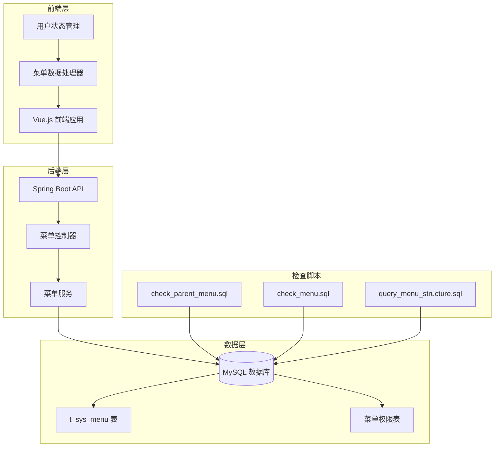
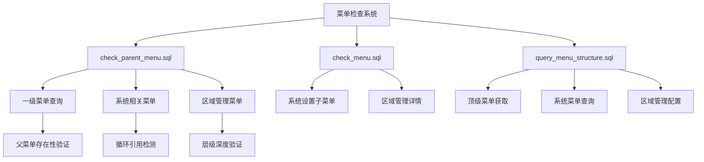
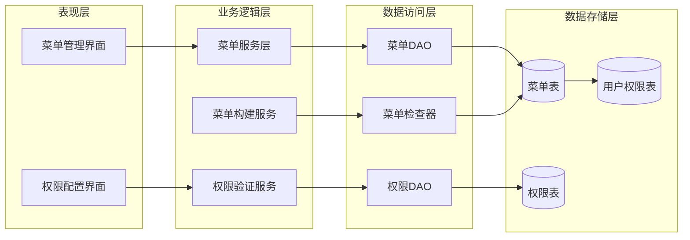
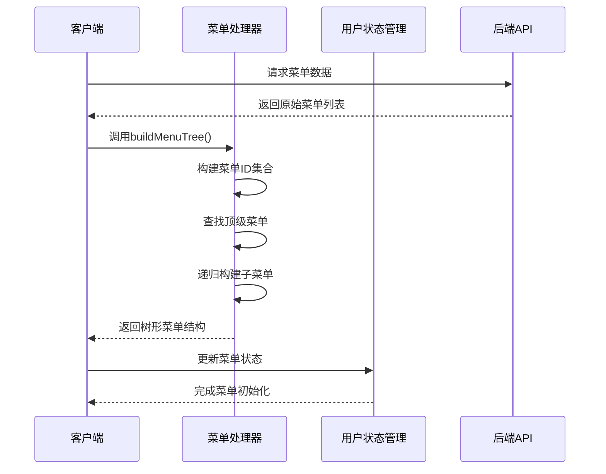
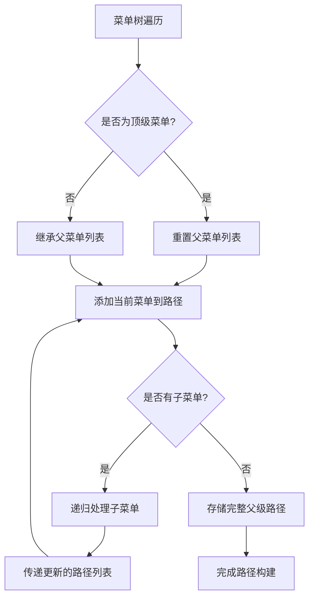
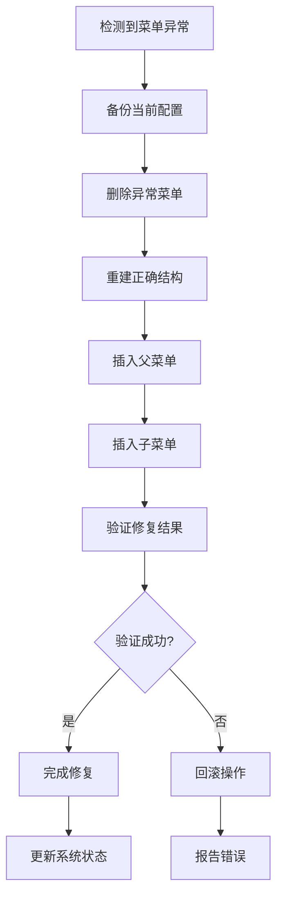
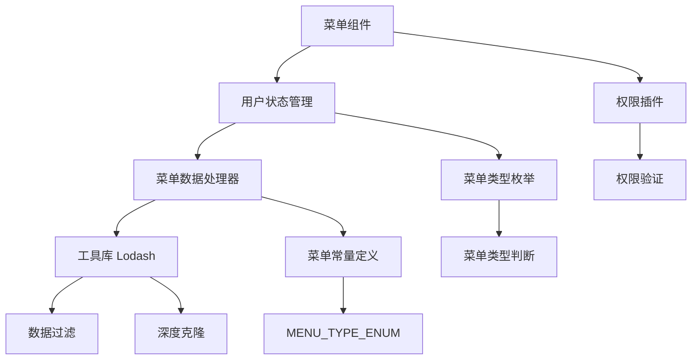
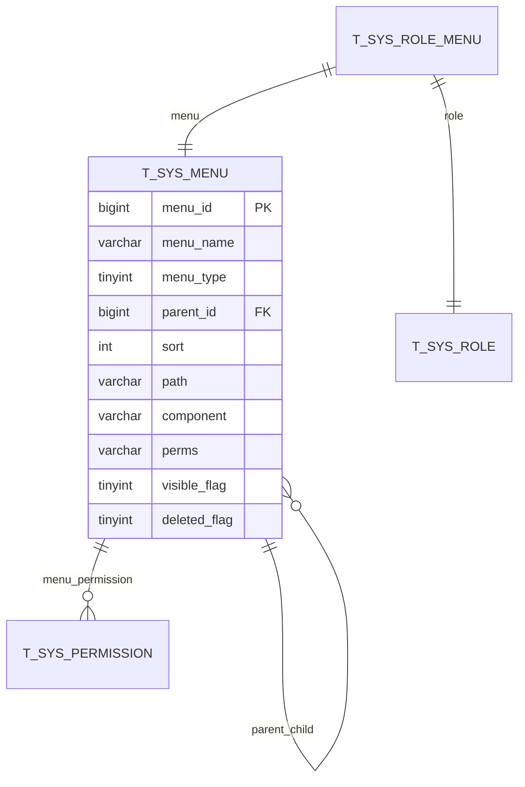
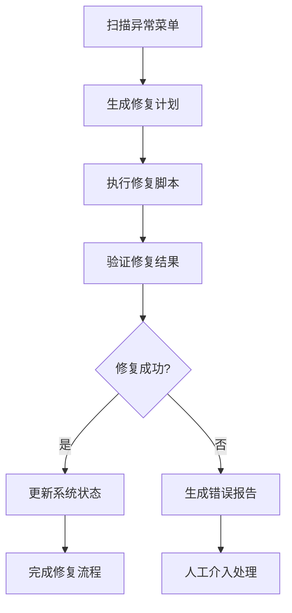

# 父菜单检查脚本文档

<cite>
**本文档中引用的文件**
- [check_parent_menu.sql](file://check_parent_menu.sql)
- [check_menu.sql](file://check_menu.sql)
- [query_menu_structure.sql](file://query_menu_structure.sql)
- [fix_area_menu.sql](file://数据库SQL脚本/mysql/fix_area_menu.sql)
- [fix_area_menu_final.sql](file://数据库SQL脚本/mysql/fix_area_menu_final.sql)
- [smart_area.sql](file://数据库SQL脚本/mysql/smart_area.sql)
- [menu-data-handler.js](file://smart-admin-web-javascript/src/views/system/menu/menu-data-handler.js)
- [user.js](file://smart-admin-web-javascript/src/store/modules/system/user.js)
</cite>

## 目录
1. [简介](#简介)
2. [项目结构概述](#项目结构概述)
3. [核心组件分析](#核心组件分析)
4. [架构概览](#架构概览)
5. [详细组件分析](#详细组件分析)
6. [依赖关系分析](#依赖关系分析)
7. [性能考虑](#性能考虑)
8. [故障排除指南](#故障排除指南)
9. [结论](#结论)

## 简介

父菜单检查脚本是SmartAdmin系统中用于验证菜单层级关系正确性的关键工具。该脚本通过SQL查询和递归逻辑，全面检查系统中菜单的父子关系完整性，识别并报告可能导致系统异常的非法父子关系配置。

SmartAdmin是一个基于Spring Boot和Vue.js的企业级管理系统，采用前后端分离架构。系统中的菜单管理模块负责维护复杂的多层级菜单结构，其中父菜单的存在性检查、循环引用检测和层级深度验证是确保系统稳定运行的重要保障。

## 项目结构概述

SmartAdmin项目采用模块化设计，菜单相关的功能分布在多个层次中：



**图表来源**
- [menu-data-handler.js](file://smart-admin-web-javascript/src/views/system/menu/menu-data-handler.js#L1-L152)
- [user.js](file://smart-admin-web-javascript/src/store/modules/system/user.js#L1-L908)

**章节来源**
- [check_parent_menu.sql](file://check_parent_menu.sql#L1-L40)
- [check_menu.sql](file://check_menu.sql#L1-L31)

## 核心组件分析

### 菜单数据库表结构

系统中的菜单数据主要存储在`t_sys_menu`表中，该表定义了完整的菜单层级关系：

| 字段名 | 类型 | 描述 | 约束 |
|--------|------|------|------|
| menu_id | BIGINT | 菜单唯一标识符 | 主键，自增 |
| menu_name | VARCHAR(200) | 菜单显示名称 | 非空 |
| menu_type | TINYINT | 菜单类型：1=目录，2=菜单，3=权限点 | 非空 |
| parent_id | BIGINT | 父菜单ID | 默认0表示顶级菜单 |
| sort | INT | 排序权重 | 数值越小越靠前 |
| path | VARCHAR(200) | 路由路径 | 可为空 |
| component | VARCHAR(2000) | 组件路径 | 可为空 |
| perms | VARCHAR(100) | 权限标识 | 可为空 |
| visible_flag | TINYINT | 是否可见 | 0=隐藏，1=显示 |
| deleted_flag | TINYINT | 删除标志 | 0=未删除，1=已删除 |

### 检查脚本功能模块

系统提供了三个主要的检查脚本，每个都有特定的验证职责：



**图表来源**
- [check_parent_menu.sql](file://check_parent_menu.sql#L1-L40)
- [check_menu.sql](file://check_menu.sql#L1-L31)
- [query_menu_structure.sql](file://query_menu_structure.sql#L1-L42)

**章节来源**
- [check_parent_menu.sql](file://check_parent_menu.sql#L1-L40)
- [check_menu.sql](file://check_menu.sql#L1-L31)

## 架构概览

SmartAdmin的菜单系统采用分层架构设计，确保菜单层级关系的完整性和一致性：



**图表来源**
- [menu-data-handler.js](file://smart-admin-web-javascript/src/views/system/menu/menu-data-handler.js#L37-L54)
- [user.js](file://smart-admin-web-javascript/src/store/modules/system/user.js#L345-L366)

## 详细组件分析

### check_parent_menu.sql 详细分析

#### 一级菜单查询功能

该脚本的第一个查询专门用于获取系统中所有的一级菜单（顶级菜单），这些菜单是整个菜单树的根节点：

```sql
-- 查询所有一级菜单（没有父菜单的菜单）
SELECT
    menu_id,
    menu_name,
    menu_type,
    parent_id,
    sort,
    path,
    icon,
    visible_flag
FROM t_sys_menu
WHERE parent_id = 0
AND deleted_flag = 0
ORDER BY sort;
```

**功能特点：**
- **父菜单ID检查**：通过`parent_id = 0`确保只查询顶级菜单
- **删除标记过滤**：通过`deleted_flag = 0`排除已删除的菜单项
- **排序保证**：按`sort`字段排序，确保菜单显示顺序的合理性

#### 系统相关菜单查询

第二个查询专注于查找与"系统"相关的菜单配置：

```sql
-- 查询"系统设置"相关菜单
SELECT
    menu_id,
    menu_name,
    menu_type,
    parent_id
FROM t_sys_menu
WHERE menu_name LIKE '%系统%'
AND deleted_flag = 0
ORDER BY parent_id, sort;
```

**验证机制：**
- **模糊匹配**：使用`LIKE '%系统%'`查找包含"系统"关键词的菜单
- **父子关系验证**：通过`parent_id`字段检查菜单的层级关系
- **完整性检查**：确保系统相关菜单的配置完整性

#### 区域管理菜单配置检查

第三个查询专门针对"区域管理"菜单进行深度检查：

```sql
-- 查询"区域管理"菜单的配置
SELECT
    m.menu_id,
    m.menu_name,
    m.parent_id,
    p.menu_name as parent_menu_name,
    m.path,
    m.component,
    m.visible_flag
FROM t_sys_menu m
LEFT JOIN t_sys_menu p ON m.parent_id = p.menu_id
WHERE m.menu_name = '区域管理'
AND m.deleted_flag = 0;
```

**检查要点：**
- **父子关联验证**：通过LEFT JOIN检查父菜单是否存在
- **配置完整性**：验证菜单的路径、组件等配置参数
- **可见性检查**：确认菜单的可见性设置是否合理

**章节来源**
- [check_parent_menu.sql](file://check_parent_menu.sql#L1-L40)

### 前端菜单处理机制

#### 菜单树构建算法

前端采用递归算法构建菜单树结构，确保菜单层级关系的正确性：



**图表来源**
- [menu-data-handler.js](file://smart-admin-web-javascript/src/views/system/menu/menu-data-handler.js#L37-L69)
- [user.js](file://smart-admin-web-javascript/src/store/modules/system/user.js#L345-L366)

#### 父菜单路径构建

系统维护每个菜单的父级路径信息，这对于权限验证和导航至关重要：



**图表来源**
- [user.js](file://smart-admin-web-javascript/src/store/modules/system/user.js#L314-L336)

**章节来源**
- [menu-data-handler.js](file://smart-admin-web-javascript/src/views/system/menu/menu-data-handler.js#L37-L69)
- [user.js](file://smart-admin-web-javascript/src/store/modules/system/user.js#L314-L336)

### 异常菜单修复机制

#### 区域管理菜单修复流程

当检测到菜单配置异常时，系统提供了完整的修复机制：



**图表来源**
- [fix_area_menu.sql](file://数据库SQL脚本/mysql/fix_area_menu.sql#L1-L59)
- [fix_area_menu_final.sql](file://数据库SQL脚本/mysql/fix_area_menu_final.sql#L1-L90)

#### 典型异常场景及解决方案

| 异常类型 | 症状描述 | 解决方案 | 预防措施 |
|----------|----------|----------|----------|
| 父菜单缺失 | 子菜单存在但父菜单不存在 | 重新建立父子关系或删除子菜单 | 完善菜单删除时的级联处理 |
| 循环引用 | 菜单形成闭环引用关系 | 打破循环或重构菜单结构 | 实施循环检测算法 |
| 层级过深 | 菜单嵌套层数超过限制 | 优化菜单结构或调整层级策略 | 设置合理的层级深度限制 |
| 权限配置错误 | 菜单权限与实际功能不符 | 重新配置权限或修复功能映射 | 建立权限配置的校验机制 |

**章节来源**
- [fix_area_menu.sql](file://数据库SQL脚本/mysql/fix_area_menu.sql#L1-L59)
- [fix_area_menu_final.sql](file://数据库SQL脚本/mysql/fix_area_menu_final.sql#L1-L90)

## 依赖关系分析

### 前端依赖关系



**图表来源**
- [menu-data-handler.js](file://smart-admin-web-javascript/src/views/system/menu/menu-data-handler.js#L13-L152)
- [user.js](file://smart-admin-web-javascript/src/store/modules/system/user.js#L1-L908)

### 数据库依赖关系

系统中的菜单数据相互依赖，形成了复杂的引用关系：



**图表来源**
- [smart_area.sql](file://数据库SQL脚本/mysql/smart_area.sql#L160-L193)

**章节来源**
- [menu-data-handler.js](file://smart-admin-web-javascript/src/views/system/menu/menu-data-handler.js#L13-L152)
- [user.js](file://smart-admin-web-javascript/src/store/modules/system/user.js#L1-L908)

## 性能考虑

### 查询优化策略

1. **索引利用**：确保`parent_id`、`deleted_flag`等常用查询条件字段有适当索引
2. **查询范围控制**：使用`LIMIT`和`WHERE`条件限制查询结果集大小
3. **连接优化**：合理使用JOIN操作，避免笛卡尔积
4. **缓存机制**：对频繁查询的菜单数据实施缓存策略

### 内存使用优化

前端菜单处理过程中需要注意内存使用效率：

- **递归深度控制**：限制菜单树的最大深度
- **对象引用管理**：及时释放不再使用的菜单对象引用
- **数据压缩**：对大型菜单树实施分页加载策略

## 故障排除指南

### 常见问题诊断

#### 菜单无法显示问题

**症状**：某些菜单项在界面上不可见

**排查步骤**：
1. 检查`visible_flag`字段是否为1
2. 验证`deleted_flag`是否为0
3. 确认父菜单是否存在且可见
4. 检查权限配置是否正确

#### 菜单层级混乱问题

**症状**：菜单显示顺序错误或层级关系异常

**排查步骤**：
1. 使用`check_parent_menu.sql`脚本检查菜单结构
2. 验证`sort`字段的数值合理性
3. 检查`parent_id`的指向是否正确
4. 确认没有循环引用关系

#### 权限访问异常问题

**症状**：用户无法访问某些功能菜单

**排查步骤**：
1. 检查用户的权限配置
2. 验证菜单的`perms`字段设置
3. 确认角色权限分配正确
4. 检查权限验证逻辑

**章节来源**
- [check_parent_menu.sql](file://check_parent_menu.sql#L1-L40)
- [fix_area_menu.sql](file://数据库SQL脚本/mysql/fix_area_menu.sql#L1-L59)

### 修复操作指南

#### 手动修复菜单结构

当自动检查发现问题时，可以手动执行修复脚本：

```sql
-- 1. 备份当前菜单配置
CREATE TABLE backup_menu AS SELECT * FROM t_sys_menu;

-- 2. 删除异常菜单
DELETE FROM t_sys_menu WHERE menu_name LIKE '%异常%';

-- 3. 重新插入正确配置
INSERT INTO t_sys_menu (...) VALUES (...);

-- 4. 验证修复结果
SELECT * FROM t_sys_menu WHERE menu_name LIKE '%修复%';
```

#### 自动化修复流程

对于批量异常情况，建议实施自动化修复流程：



## 结论

父菜单检查脚本是SmartAdmin系统中确保菜单层级关系完整性的关键工具。通过深入分析check_parent_menu.sql的设计原理和功能实现，我们可以看到：

1. **多层次验证机制**：脚本从不同角度验证菜单结构的正确性，包括父菜单存在性、循环引用检测和层级深度验证

2. **递归逻辑实现**：通过SQL查询和前端算法实现复杂的递归菜单处理，确保菜单树的完整性

3. **异常处理能力**：系统提供了完善的异常检测和修复机制，能够快速定位和解决菜单配置问题

4. **性能优化考虑**：在查询设计和前端处理中都考虑了性能因素，确保大规模菜单系统的响应速度

5. **扩展性设计**：检查脚本和相关机制具有良好的扩展性，能够适应系统功能的增长和变化

通过持续使用这些检查工具和遵循最佳实践，可以确保SmartAdmin系统的菜单管理始终保持高质量和稳定性，为用户提供优秀的用户体验。