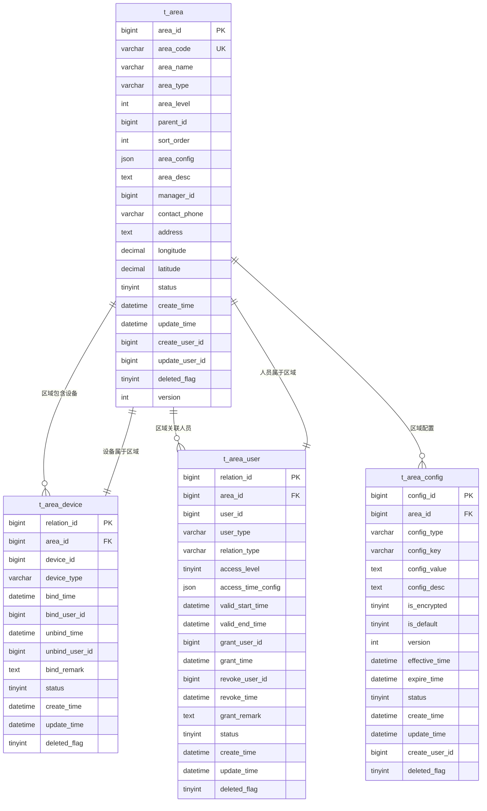
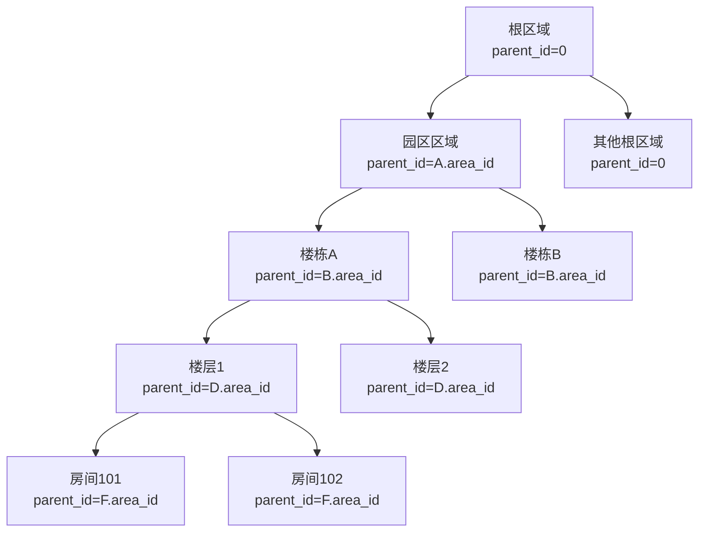
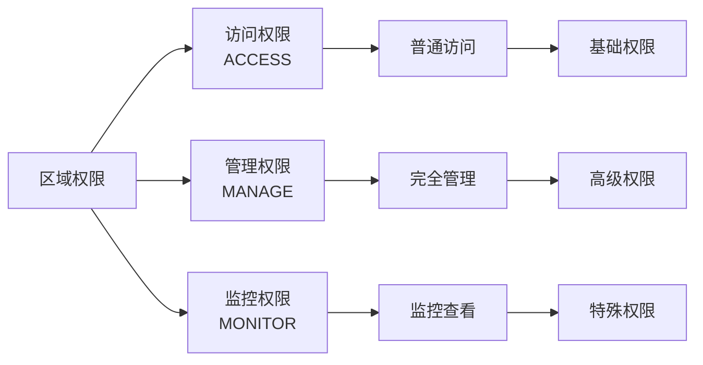
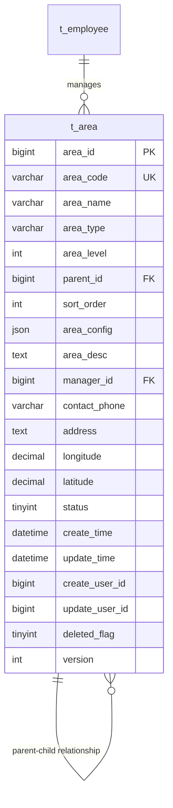
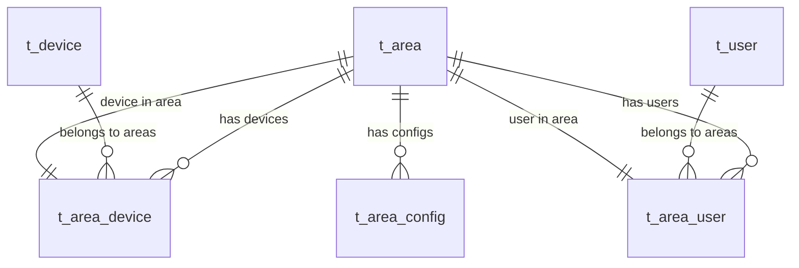

# 表结构脚本

<cite>
**本文档引用的文件**
- [smart_area.sql](file://数据库SQL脚本/mysql/smart_area.sql)
- [AreaEntity.java](file://smart-admin-api-java17-springboot3/sa-admin/src/main/java/net/lab1024/sa/admin/module/system/area/domain/entity/AreaEntity.java)
- [AreaDeviceEntity.java](file://smart-admin-api-java17-springboot3/sa-admin/src/main/java/net/lab1024/sa/admin/module/system/area/domain/entity/AreaDeviceEntity.java)
- [AreaUserEntity.java](file://smart-admin-api-java17-springboot3/sa-admin/src/main/java/net/lab1024/sa/admin/module/system/area/domain/entity/AreaUserEntity.java)
- [AreaConfigEntity.java](file://smart-admin-api-java17-springboot3/sa-admin/src/main/java/net/lab1024/sa/admin/module/system/area/domain/entity/AreaConfigEntity.java)
- [AreaMapper.xml](file://smart-admin-api-java17-springboot3/sa-admin/src/main/resources/mapper/system/area/AreaMapper.xml)
- [area-api.js](file://smart-admin-web-javascript/src/api/system/area-api.js)
- [区域管理模块部署说明.md](file://区域管理模块部署说明.md)
</cite>

## 目录
1. [概述](#概述)
2. [数据库架构](#数据库架构)
3. [核心表结构详解](#核心表结构详解)
4. [表关系设计](#表关系设计)
5. [索引策略](#索引策略)
6. [初始化数据](#初始化数据)
7. [技术特性](#技术特性)
8. [性能优化](#性能优化)
9. [扩展性设计](#扩展性设计)
10. [维护和管理](#维护和管理)

## 概述

SmartAdmin区域管理模块是一个完整的区域层级管理系统，提供统一的区域层级管理、设备分组、人员区域归属等功能。该模块采用标准的四层架构设计，包含完整的CRUD操作、树形结构管理和权限控制。

### 核心功能特性
- **无限层级区域树**：支持多级区域层级结构
- **设备关联管理**：区域与设备的双向绑定关系
- **人员权限管理**：基于角色的区域访问权限控制
- **配置化管理**：灵活的区域配置系统
- **审计跟踪**：完整的操作日志和版本控制
- **软删除机制**：支持数据的逻辑删除和恢复

## 数据库架构

区域管理模块包含四个核心表，形成完整的区域管理体系：



**图表来源**
- [AreaEntity.java](file://smart-admin-api-java17-springboot3/sa-admin/src/main/java/net/lab1024/sa/admin/module/system/area/domain/entity/AreaEntity.java#L20-L132)
- [AreaDeviceEntity.java](file://smart-admin-api-java17-springboot3/sa-admin/src/main/java/net/lab1024/sa/admin/module/system/area/domain/entity/AreaDeviceEntity.java#L16-L87)
- [AreaUserEntity.java](file://smart-admin-api-java17-springboot3/sa-admin/src/main/java/net/lab1024/sa/admin/module/system/area/domain/entity/AreaUserEntity.java#L19-L116)
- [AreaConfigEntity.java](file://smart-admin-api-java17-springboot3/sa-admin/src/main/java/net/lab1024/sa/admin/module/system/area/domain/entity/AreaConfigEntity.java#L16-L102)

## 核心表结构详解

### 1. 区域表 (t_area)

区域表是整个区域管理的核心表，负责存储区域的基本信息和层级关系。

#### 字段定义

| 字段名 | 数据类型 | 长度 | 允许空值 | 默认值 | 约束 | 业务含义 |
|--------|----------|------|----------|--------|------|----------|
| area_id | BIGINT | - | 否 | 自增 | 主键 | 区域唯一标识符 |
| area_code | VARCHAR | 100 | 否 | - | 唯一键 | 区域编码，全局唯一 |
| area_name | VARCHAR | 200 | 否 | - | - | 区域名称 |
| area_type | VARCHAR | 50 | 否 | - | - | 区域类型，如园区、楼栋等 |
| area_level | INT | - | 是 | 1 | - | 区域层级，从1开始 |
| parent_id | BIGINT | - | 是 | 0 | 外键 | 父区域ID，0表示顶级区域 |
| sort_order | INT | - | 是 | 0 | - | 排序权重 |
| area_config | JSON | - | 是 | - | - | 区域配置信息，JSON格式 |
| area_desc | TEXT | - | 是 | - | - | 区域描述信息 |
| manager_id | BIGINT | - | 是 | - | 外键 | 区域负责人ID |
| contact_phone | VARCHAR | 20 | 是 | - | - | 联系电话 |
| address | TEXT | - | 是 | - | - | 详细地址 |
| longitude | DECIMAL | 11,8 | 是 | - | - | 地理经度 |
| latitude | DECIMAL | 10,8 | 是 | - | - | 地理纬度 |
| status | TINYINT | - | 是 | 1 | - | 状态：1-启用，0-禁用 |
| create_time | DATETIME | - | 是 | CURRENT_TIMESTAMP | - | 创建时间 |
| update_time | DATETIME | - | 是 | CURRENT_TIMESTAMP ON UPDATE CURRENT_TIMESTAMP | - | 更新时间 |
| create_user_id | BIGINT | - | 是 | - | - | 创建人ID |
| update_user_id | BIGINT | - | 是 | - | - | 更新人ID |
| deleted_flag | TINYINT | - | 是 | 0 | - | 删除标志：0-未删除，1-已删除 |
| version | INT | - | 是 | 1 | - | 版本号，用于乐观锁 |

#### 层级结构设计

区域表通过`parent_id`字段实现递归关系，支持无限层级的树形结构：



**图表来源**
- [AreaEntity.java](file://smart-admin-api-java17-springboot3/sa-admin/src/main/java/net/lab1024/sa/admin/module/system/area/domain/entity/AreaEntity.java#L48-L53)

**节来源**
- [smart_area.sql](file://数据库SQL脚本/mysql/smart_area.sql#L8-L38)
- [AreaEntity.java](file://smart-admin-api-java17-springboot3/sa-admin/src/main/java/net/lab1024/sa/admin/module/system/area/domain/entity/AreaEntity.java#L20-L132)

### 2. 区域设备关联表 (t_area_device)

设备关联表建立区域与设备之间的多对多关系，支持设备的动态绑定和解绑。

#### 字段定义

| 字段名 | 数据类型 | 长度 | 允许空值 | 默认值 | 约束 | 业务含义 |
|--------|----------|------|----------|--------|------|----------|
| relation_id | BIGINT | - | 否 | 自增 | 主键 | 关联关系唯一标识 |
| area_id | BIGINT | - | 否 | - | 外键 | 区域ID |
| device_id | BIGINT | - | 否 | - | - | 设备ID |
| device_type | VARCHAR | 50 | 否 | - | - | 设备类型标识 |
| bind_time | DATETIME | - | 是 | CURRENT_TIMESTAMP | - | 绑定时间 |
| bind_user_id | BIGINT | - | 是 | - | - | 绑定人ID |
| unbind_time | DATETIME | - | 是 | - | - | 解绑时间 |
| unbind_user_id | BIGINT | - | 是 | - | - | 解绑人ID |
| bind_remark | TEXT | - | 是 | - | - | 绑定备注信息 |
| status | TINYINT | - | 是 | 1 | - | 状态：1-绑定，0-解绑 |
| create_time | DATETIME | - | 是 | CURRENT_TIMESTAMP | - | 创建时间 |
| update_time | DATETIME | - | 是 | CURRENT_TIMESTAMP ON UPDATE CURRENT_TIMESTAMP | - | 更新时间 |
| deleted_flag | TINYINT | - | 是 | 0 | - | 删除标志 |

#### 关联关系特点
- **唯一约束**：`(area_id, device_id)`确保一个设备只能在一个区域内
- **状态管理**：通过`status`字段区分绑定和解绑状态
- **时间追踪**：记录绑定和解绑的具体时间点
- **审计信息**：记录操作人和操作时间

**节来源**
- [smart_area.sql](file://数据库SQL脚本/mysql/smart_area.sql#L41-L62)
- [AreaDeviceEntity.java](file://smart-admin-api-java17-springboot3/sa-admin/src/main/java/net/lab1024/sa/admin/module/system/area/domain/entity/AreaDeviceEntity.java#L16-L87)

### 3. 区域人员关联表 (t_area_user)

人员关联表管理区域与用户的权限关系，支持复杂的权限控制和访问管理。

#### 字段定义

| 字段名 | 数据类型 | 长度 | 允许空值 | 默认值 | 约束 | 业务含义 |
|--------|----------|------|----------|--------|------|----------|
| relation_id | BIGINT | - | 否 | 自增 | 主键 | 关联关系唯一标识 |
| area_id | BIGINT | - | 否 | - | 外键 | 区域ID |
| user_id | BIGINT | - | 否 | - | - | 用户ID |
| user_type | VARCHAR | 20 | 否 | - | - | 用户类型：员工、访客等 |
| relation_type | VARCHAR | 20 | 否 | - | - | 关联类型：访问、管理、监控 |
| access_level | TINYINT | - | 是 | 1 | - | 访问级别 |
| access_time_config | JSON | - | 是 | - | - | 访问时间配置 |
| valid_start_time | DATETIME | - | 是 | - | - | 有效开始时间 |
| valid_end_time | DATETIME | - | 是 | - | - | 有效结束时间 |
| grant_user_id | BIGINT | - | 是 | - | - | 授权人ID |
| grant_time | DATETIME | - | 是 | CURRENT_TIMESTAMP | - | 授权时间 |
| revoke_user_id | BIGINT | - | 是 | - | - | 撤销人ID |
| revoke_time | DATETIME | - | 是 | - | - | 撤销时间 |
| grant_remark | TEXT | - | 是 | - | - | 授权备注 |
| status | TINYINT | - | 是 | 1 | - | 状态：1-有效，0-已撤销 |
| create_time | DATETIME | - | 是 | CURRENT_TIMESTAMP | - | 创建时间 |
| update_time | DATETIME | - | 是 | CURRENT_TIMESTAMP ON UPDATE CURRENT_TIMESTAMP | - | 更新时间 |
| deleted_flag | TINYINT | - | 是 | 0 | - | 删除标志 |

#### 权限模型设计



**图表来源**
- [AreaUserEntity.java](file://smart-admin-api-java17-springboot3/sa-admin/src/main/java/net/lab1024/sa/admin/module/system/area/domain/entity/AreaUserEntity.java#L42-L47)

**节来源**
- [smart_area.sql](file://数据库SQL脚本/mysql/smart_area.sql#L65-L94)
- [AreaUserEntity.java](file://smart-admin-api-java17-springboot3/sa-admin/src/main/java/net/lab1024/sa/admin/module/system/area/domain/entity/AreaUserEntity.java#L19-L116)

### 4. 区域配置表 (t_area_config)

配置表提供灵活的区域配置管理，支持不同类型的配置项和版本控制。

#### 字段定义

| 字段名 | 数据类型 | 长度 | 允许空值 | 默认值 | 约束 | 业务含义 |
|--------|----------|------|----------|--------|------|----------|
| config_id | BIGINT | - | 否 | 自增 | 主键 | 配置项唯一标识 |
| area_id | BIGINT | - | 否 | - | 外键 | 区域ID |
| config_type | VARCHAR | 50 | 否 | - | - | 配置类型分类 |
| config_key | VARCHAR | 100 | 否 | - | - | 配置键名 |
| config_value | TEXT | - | 是 | - | - | 配置值 |
| config_desc | TEXT | - | 是 | - | - | 配置描述 |
| is_encrypted | TINYINT | - | 是 | 0 | - | 是否加密：1-是，0-否 |
| is_default | TINYINT | - | 是 | 0 | - | 是否默认配置：1-是，0-否 |
| version | INT | - | 是 | 1 | - | 配置版本号 |
| effective_time | DATETIME | - | 是 | - | - | 生效时间 |
| expire_time | DATETIME | - | 是 | - | - | 过期时间 |
| status | TINYINT | - | 是 | 1 | - | 状态：1-生效，0-失效 |
| create_time | DATETIME | - | 是 | CURRENT_TIMESTAMP | - | 创建时间 |
| update_time | DATETIME | - | 是 | CURRENT_TIMESTAMP ON UPDATE CURRENT_TIMESTAMP | - | 更新时间 |
| create_user_id | BIGINT | - | 是 | - | - | 创建人ID |
| deleted_flag | TINYINT | - | 是 | 0 | - | 删除标志 |

#### 配置分类体系

| 配置类型 | 示例键名 | 用途说明 |
|----------|----------|----------|
| AREA_VISIBILITY | show_empty_areas | 控制是否显示空区域 |
| DEVICE_MANAGEMENT | auto_bind_device | 自动绑定设备功能 |
| USER_MANAGEMENT | auto_grant_access | 自动授予访问权限 |
| SECURITY_CONFIG | access_control_level | 访问控制级别设置 |
| NOTIFICATION_CONFIG | area_entry_notification | 区域进入通知配置 |

**节来源**
- [smart_area.sql](file://数据库SQL脚本/mysql/smart_area.sql#L97-L122)
- [AreaConfigEntity.java](file://smart-admin-api-java17-springboot3/sa-admin/src/main/java/net/lab1024/sa/admin/module/system/area/domain/entity/AreaConfigEntity.java#L16-L102)

## 表关系设计

### 1. 区域层级关系

区域表通过自引用实现树形结构，支持无限层级的区域组织：



**图表来源**
- [AreaEntity.java](file://smart-admin-api-java17-springboot3/sa-admin/src/main/java/net/lab1024/sa/admin/module/system/area/domain/entity/AreaEntity.java#L48-L53)

### 2. 多对多关联关系

区域与其他实体之间存在多对多的关联关系：



**图表来源**
- [AreaDeviceEntity.java](file://smart-admin-api-java17-springboot3/sa-admin/src/main/java/net/lab1024/sa/admin/module/system/area/domain/entity/AreaDeviceEntity.java#L29-L34)
- [AreaUserEntity.java](file://smart-admin-api-java17-springboot3/sa-admin/src/main/java/net/lab1024/sa/admin/module/system/area/domain/entity/AreaUserEntity.java#L32-L37)

### 3. 外键约束设计

所有外键都遵循标准的命名规范和约束策略：

| 外键字段 | 引用表 | 约束类型 | 级联操作 |
|----------|--------|----------|----------|
| manager_id | t_employee | 外键 | 不级联 |
| create_user_id | t_employee | 外键 | 不级联 |
| update_user_id | t_employee | 外键 | 不级联 |
| area_id | t_area | 外键 | 不级联 |
| device_id | t_device | 外键 | 不级联 |
| user_id | t_user | 外键 | 不级联 |

## 索引策略

### 1. 主键索引

每个表都有明确的主键设计：
- **t_area**: `PRIMARY KEY (area_id)`
- **t_area_device**: `PRIMARY KEY (relation_id)`
- **t_area_user**: `PRIMARY KEY (relation_id)`
- **t_area_config**: `PRIMARY KEY (config_id)`

### 2. 唯一键索引

重要的唯一约束确保数据完整性：
- **t_area**: `UNIQUE KEY uk_area_code (area_code)`
- **t_area_device**: `UNIQUE KEY uk_area_device (area_id, device_id)`
- **t_area_user**: `UNIQUE KEY uk_area_user (area_id, user_id, relation_type)`
- **t_area_config**: `UNIQUE KEY uk_area_config (area_id, config_key, version)`

### 3. 辅助索引

为提高查询性能，建立了多个辅助索引：

#### 区域表索引
- `idx_parent_id (parent_id)` - 支持树形查询
- `idx_area_type (area_type)` - 按类型查询
- `idx_area_level (area_level)` - 按层级查询
- `idx_status (status)` - 按状态查询
- `idx_manager_id (manager_id)` - 按负责人查询
- `idx_location (longitude, latitude)` - 地理位置查询

#### 设备关联表索引
- `idx_area_id (area_id)` - 按区域查询设备
- `idx_device_id (device_id)` - 按设备查询区域
- `idx_device_type (device_type)` - 按设备类型查询
- `idx_bind_time (bind_time)` - 按绑定时间查询
- `idx_status (status)` - 按状态查询

#### 人员关联表索引
- `idx_area_id (area_id)` - 按区域查询人员
- `idx_user_id (user_id)` - 按用户查询区域
- `idx_user_type (user_type)` - 按用户类型查询
- `idx_relation_type (relation_type)` - 按关联类型查询
- `idx_access_level (access_level)` - 按访问级别查询
- `idx_valid_time (valid_start_time, valid_end_time)` - 时间范围查询
- `idx_grant_time (grant_time)` - 按授权时间查询

#### 配置表索引
- `idx_area_id (area_id)` - 按区域查询配置
- `idx_config_type (config_type)` - 按配置类型查询
- `idx_config_key (config_key)` - 按配置键查询
- `idx_status (status)` - 按状态查询
- `idx_effective_time (effective_time)` - 按生效时间查询
- `idx_expire_time (expire_time)` - 按过期时间查询

**节来源**
- [smart_area.sql](file://数据库SQL脚本/mysql/smart_area.sql#L30-L37)
- [AreaMapper.xml](file://smart-admin-api-java17-springboot3/sa-admin/src/main/resources/mapper/system/area/AreaMapper.xml#L140-L157)

## 初始化数据

### 1. 区域类型字典

系统预定义了标准的区域类型，支持常见的区域分类：

| 字典类型 | 键名 | 值 | 排序 | 备注 |
|----------|------|----|-----|----- |
| AREA_TYPE | CAMPUS | 园区 | 1 | 整个园区 |
| AREA_TYPE | BUILDING | 楼栋 | 2 | 园区内的楼栋 |
| AREA_TYPE | FLOOR | 楼层 | 3 | 楼栋内的楼层 |
| AREA_TYPE | ROOM | 房间 | 4 | 楼层内的房间 |
| AREA_TYPE | OUTDOOR | 室外 | 5 | 室外区域 |
| AREA_TYPE | PARKING | 停车场 | 6 | 停车场 |
| AREA_TYPE | ENTRANCE | 出入口 | 7 | 出入口区域 |

### 2. 用户类型字典

定义了不同类型的用户身份：

| 字典类型 | 键名 | 值 | 排序 | 备注 |
|----------|------|----|-----|----- |
| USER_TYPE | EMPLOYEE | 员工 | 1 | 内部员工 |
| USER_TYPE | VISITOR | 访客 | 2 | 外部访客 |
| USER_TYPE | CONTRACTOR | 承包商 | 3 | 外部承包商 |
| USER_TYPE | SECURITY | 安保 | 4 | 安保人员 |

### 3. 关联类型字典

定义了区域与用户之间的关联关系类型：

| 字典类型 | 键名 | 值 | 排序 | 备注 |
|----------|------|----|-----|----- |
| RELATION_TYPE | ACCESS | 访问权限 | 1 | 可访问该区域 |
| RELATION_TYPE | MANAGE | 管理权限 | 2 | 可管理该区域 |
| RELATION_TYPE | MONITOR | 监控权限 | 3 | 可监控该区域 |

### 4. 默认配置数据

系统提供了基础的区域配置模板：

| 区域ID | 配置类型 | 键名 | 值 | 描述 | 默认 |
|--------|----------|------|----|----- |----- |
| 0 | AREA_VISIBILITY | show_empty_areas | true | 是否显示空区域 | 是 |
| 0 | DEVICE_MANAGEMENT | auto_bind_device | false | 自动绑定区域内的设备 | 是 |
| 0 | USER_MANAGEMENT | auto_grant_access | false | 自动授予区域访问权限 | 是 |
| 0 | SECURITY_CONFIG | access_control_level | 1 | 访问控制级别 | 是 |
| 0 | NOTIFICATION_CONFIG | area_entry_notification | true | 区域进入通知 | 是 |

### 5. 菜单权限数据

系统自动创建区域管理相关的菜单和权限：

#### 菜单结构
- **区域管理** (menu_id=50下的子菜单)
  - 查询区域 (area:page)
  - 区域详情 (area:detail)
  - 新增区域 (area:add)
  - 修改区域 (area:update)
  - 删除区域 (area:delete)
  - 区域树 (area:tree)
  - 绑定设备 (area:device:bind)
  - 解绑设备 (area:device:unbind)
  - 授予权限 (area:user:grant)
  - 撤销权限 (area:user:revoke)
  - 查看配置 (area:config:view)
  - 更新配置 (area:config:update)

**节来源**
- [smart_area.sql](file://数据库SQL脚本/mysql/smart_area.sql#L124-L196)

## 技术特性

### 1. JSON字段支持

系统充分利用MySQL的JSON功能，支持灵活的数据存储：

- **area_config**: 区域配置信息，支持任意结构的配置
- **access_time_config**: 访问时间配置，支持复杂的权限规则
- **JacksonTypeHandler**: Java实体类中的JSON字段自动序列化和反序列化

### 2. 软删除机制

采用软删除策略，保留数据完整性：

- **deleted_flag**: 0表示未删除，1表示已删除
- 所有查询都自动过滤已删除记录
- 支持数据恢复功能

### 3. 乐观锁控制

通过版本号实现乐观锁，防止并发更新冲突：

- **version**: 初始值为1，每次更新时+1
- 在更新操作中检查版本号一致性
- 支持并发安全的数据更新

### 4. 审计字段

完整的审计跟踪系统：

- **create_time/update_time**: 自动记录创建和更新时间
- **create_user_id/update_user_id**: 记录操作人ID
- **自动更新**: `update_time`字段在数据更新时自动更新

### 5. 递归查询支持

利用MySQL 8.0的CTE（Common Table Expressions）实现高效的递归查询：

```sql
WITH RECURSIVE area_tree AS (
    SELECT area_id, parent_id
    FROM t_area
    WHERE area_id = #{areaId}
    AND deleted_flag = 0
    
    UNION ALL
    
    SELECT a.area_id, a.parent_id
    FROM t_area a
    INNER JOIN area_tree at ON a.parent_id = at.area_id
    WHERE a.deleted_flag = 0
)
SELECT area_id FROM area_tree WHERE area_id != #{areaId}
```

**节来源**
- [AreaEntity.java](file://smart-admin-api-java17-springboot3/sa-admin/src/main/java/net/lab1024/sa/admin/module/system/area/domain/entity/AreaEntity.java#L63-L64)
- [AreaMapper.xml](file://smart-admin-api-java17-springboot3/sa-admin/src/main/resources/mapper/system/area/AreaMapper.xml#L140-L157)

## 性能优化

### 1. 查询优化策略

#### 1.1 树形查询优化
- 使用CTE实现递归查询，避免多次数据库往返
- 通过`parent_id`索引快速定位子节点
- 支持懒加载和分页查询

#### 1.2 关联查询优化
- 使用LEFT JOIN替代子查询，提高查询效率
- 通过适当的索引覆盖查询所需的所有字段
- 避免N+1查询问题

#### 1.3 分页查询优化
- 使用MyBatis Plus的分页插件
- 通过LIMIT和OFFSET实现高效分页
- 支持大数据量的分页查询

### 2. 索引优化策略

#### 2.1 复合索引设计
- `(parent_id, deleted_flag)` - 树形查询常用组合
- `(area_type, area_level)` - 类型和层级联合查询
- `(user_id, relation_type)` - 用户权限查询组合

#### 2.2 索引选择性
- 高选择性的字段优先建立索引
- 避免在低选择性字段上建立索引
- 定期分析索引使用情况

### 3. 缓存策略

#### 3.1 应用层缓存
- 区域树结构缓存
- 字典数据缓存
- 配置信息缓存

#### 3.2 数据库缓存
- MySQL查询缓存
- InnoDB缓冲池优化
- 索引缓存优化

### 4. 并发控制

#### 4.1 乐观锁
- 版本号控制，减少锁竞争
- 支持高并发场景下的数据更新
- 提供重试机制处理并发冲突

#### 4.2 事务隔离
- 使用适当的事务隔离级别
- 避免长时间持有锁
- 支持分布式事务

**节来源**
- [AreaMapper.xml](file://smart-admin-api-java17-springboot3/sa-admin/src/main/resources/mapper/system/area/AreaMapper.xml#L140-L157)

## 扩展性设计

### 1. 配置化扩展

#### 1.1 动态配置支持
- 通过`t_area_config`表支持运行时配置修改
- 支持配置的版本管理和回滚
- 提供配置继承和覆盖机制

#### 1.2 插件化架构
- 配置项支持插件化扩展
- 可以动态添加新的配置类型
- 支持第三方系统的配置集成

### 2. 权限扩展

#### 2.1 多维度权限
- 支持基于时间、地点、设备的权限控制
- 可扩展的权限规则引擎
- 支持权限的继承和传递

#### 2.2 第三方集成
- 支持与LDAP、AD等目录服务集成
- 可扩展的认证和授权机制
- 支持OAuth2.0等现代认证协议

### 3. 数据扩展

#### 3.1 分区策略
- 支持按时间分区存储历史数据
- 支持按区域ID范围分区
- 可根据业务需求调整分区策略

#### 3.2 备份和归档
- 支持定期数据归档
- 提供增量备份和全量备份
- 支持跨地域的数据同步

### 4. 接口扩展

#### 4.1 RESTful API
- 标准化的RESTful接口设计
- 支持OpenAPI/Swagger文档
- 提供版本控制和向后兼容

#### 4.2 消息队列集成
- 支持异步消息处理
- 可扩展的消息事件机制
- 支持实时数据同步

**节来源**
- [area-api.js](file://smart-admin-web-javascript/src/api/system/area-api.js#L1-L60)

## 维护和管理

### 1. 数据完整性维护

#### 1.1 约束检查
- 定期检查外键约束的有效性
- 验证区域层级关系的正确性
- 检查循环引用问题

#### 1.2 数据清理
- 清理无效的关联关系
- 优化索引碎片
- 清理过期的历史数据

### 2. 性能监控

#### 2.1 查询性能监控
- 监控慢查询的执行时间
- 分析查询计划和索引使用情况
- 识别性能瓶颈并优化

#### 2.2 系统资源监控
- 监控数据库连接数
- 监控内存和磁盘使用情况
- 监控CPU和I/O负载

### 3. 版本管理

#### 3.1 SQL脚本版本控制
- 使用语义化版本号管理脚本
- 提供升级和回滚脚本
- 维护变更日志和迁移文档

#### 3.2 数据迁移
- 提供自动化数据迁移工具
- 支持增量迁移和全量迁移
- 提供迁移前的备份和验证

### 4. 备份策略

#### 4.1 数据备份
- 定期全量备份和增量备份
- 支持远程备份和异地备份
- 提供备份验证和恢复测试

#### 4.2 配置备份
- 备份系统配置和字典数据
- 备份用户权限和菜单配置
- 支持配置的版本管理和回滚

### 5. 安全管理

#### 5.1 访问控制
- 实施最小权限原则
- 定期审查用户权限
- 监控异常访问行为

#### 5.2 数据保护
- 敏感数据加密存储
- 实施数据脱敏策略
- 保护备份数据的安全性

**节来源**
- [区域管理模块部署说明.md](file://区域管理模块部署说明.md#L1-L58)

## 结论

SmartAdmin区域管理模块的表结构设计体现了现代数据库设计的最佳实践，具有以下优势：

### 设计优势
1. **完整性**：完整的业务功能覆盖，从基础的区域管理到复杂的权限控制
2. **灵活性**：支持多种区域类型和配置选项，适应不同的业务场景
3. **性能**：合理的索引设计和查询优化，支持大规模数据处理
4. **可扩展**：模块化的设计便于功能扩展和系统集成
5. **安全性**：完善的审计和权限控制机制

### 技术特色
- **JSON字段支持**：灵活的数据存储和配置管理
- **递归查询**：高效的树形结构查询能力
- **软删除机制**：数据安全性和可恢复性
- **乐观锁控制**：并发环境下的数据一致性保证

### 应用价值
该表结构设计不仅满足了当前的业务需求，还为未来的功能扩展和系统演进奠定了坚实的基础。通过合理的架构设计和性能优化，能够支撑大规模的企业级应用需求。