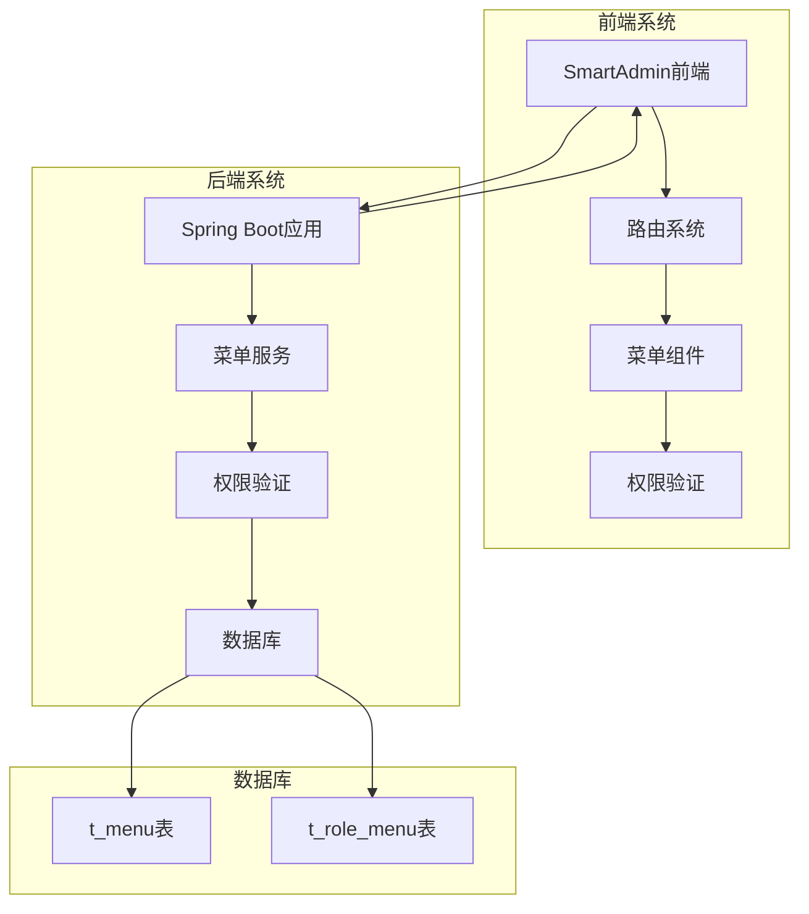
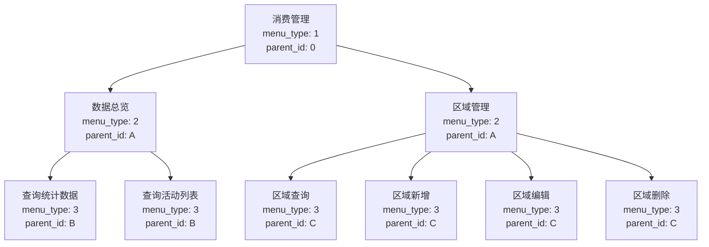
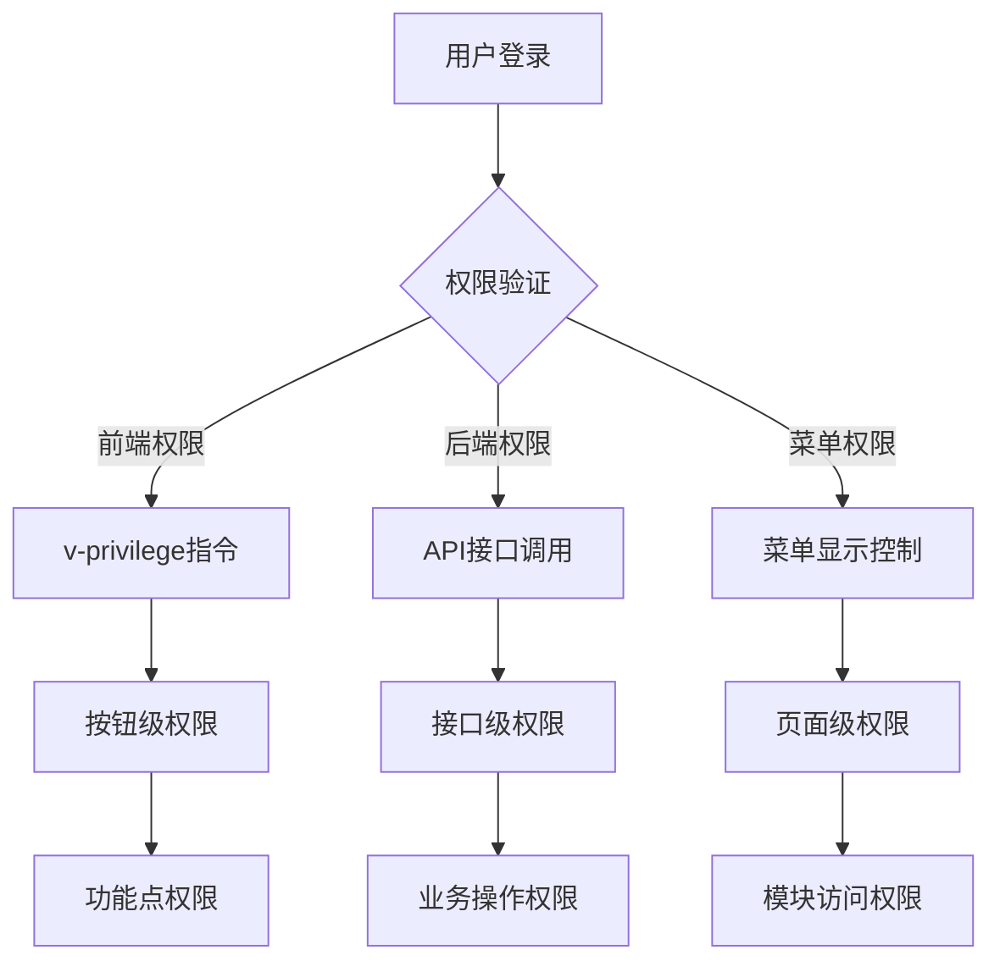
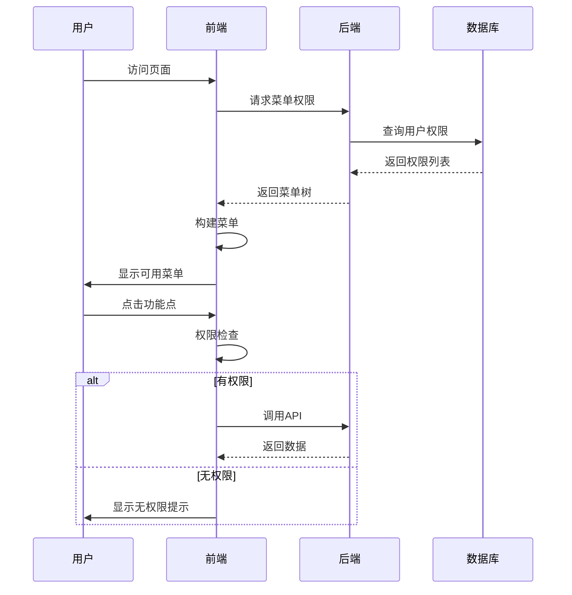
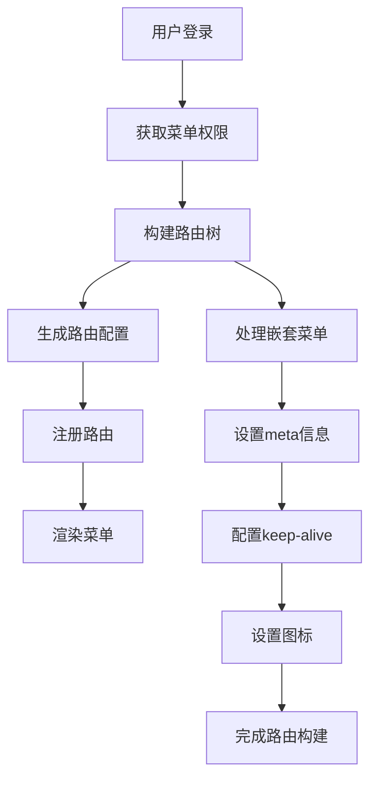
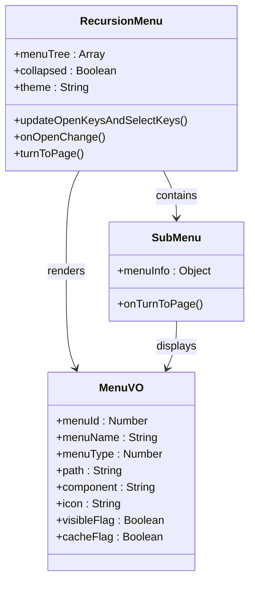

# 消费管理菜单配置脚本详细文档

<cite>
**本文档中引用的文件**
- [消费管理菜单配置.sql](file://smart-admin-web-javascript/src/views/business/consumption/消费管理菜单配置.sql)
- [路由配置说明.md](file://smart-admin-web-javascript/src/views/business/consumption/路由配置说明.md)
- [consumption.js](file://smart-admin-web-javascript/src/router/business/consumption.js)
- [menu-const.js](file://smart-admin-web-javascript/src/constants/system/menu-const.js)
- [consumption-api.js](file://smart-admin-web-javascript/src/api/business/consumption/consumption-api.js)
- [MenuMapper.xml](file://smart-admin-api-java17-springboot3\sa-admin\src\main\resources\mapper\system\menu\MenuMapper.xml)
- [recursion-menu.vue](file://smart-admin-web-javascript/src/layout/components/side-menu/recursion-menu.vue)
- [index.js](file://smart-admin-web-javascript/src/router/index.js)
- [user.js](file://smart-admin-web-javascript/src/store/modules/system/user.js)
</cite>

## 目录
1. [项目概述](#项目概述)
2. [脚本业务目的](#脚本业务目的)
3. [数据库表结构分析](#数据库表结构分析)
4. [菜单层级关系构建](#菜单层级关系构建)
5. [权限配置规则详解](#权限配置规则详解)
6. [前端路由集成](#前端路由集成)
7. [脚本执行时机](#脚本执行时机)
8. [自定义修改指导](#自定义修改指导)
9. [故障排除指南](#故障排除指南)
10. [最佳实践建议](#最佳实践建议)

## 项目概述

消费管理菜单配置脚本是SmartAdmin框架中用于初始化消费管理模块菜单权限结构的核心SQL脚本。该脚本负责在系统初始化时建立完整的菜单层次结构，包括一级目录、二级菜单和功能点权限的完整配置。

### 系统架构概览



**图表来源**
- [consumption.js](file://smart-admin-web-javascript/src/router/business/consumption.js#L1-L62)
- [MenuMapper.xml](file://smart-admin-api-java17-springboot3\sa-admin\src\main\resources\mapper\system\menu\MenuMapper.xml#L1-L78)

## 脚本业务目的

消费管理菜单配置脚本的主要业务目的是：

### 1. 初始化消费管理模块的基础菜单结构
- 创建一级目录"消费管理"作为顶级分类
- 建立二级菜单"数据总览"和"区域管理"等核心功能模块
- 配置三级功能点权限，实现细粒度的权限控制

### 2. 建立完整的权限体系
- 通过`web_perms`字段建立前端权限标识
- 通过`api_perms`字段建立后端接口权限
- 实现基于角色的权限分配机制

### 3. 支持动态路由生成
- 为前端路由系统提供标准化的菜单配置
- 支持动态菜单加载和权限验证
- 实现菜单的懒加载和缓存优化

**章节来源**
- [消费管理菜单配置.sql](file://smart-admin-web-javascript/src/views/business/consumption/消费管理菜单配置.sql#L1-L50)

## 数据库表结构分析

### t_menu表结构详解

消费管理菜单配置脚本操作的核心表是`t_menu`，其关键字段说明如下：

| 字段名 | 类型 | 说明 | 示例值 |
|--------|------|------|--------|
| menu_name | varchar | 菜单名称 | '消费管理', '数据总览' |
| menu_type | tinyint | 菜单类型：1=目录，2=菜单，3=功能点 | 1, 2, 3 |
| parent_id | bigint | 父级菜单ID，0表示顶级 | 0, 1001, 1002 |
| sort | int | 排序权重，数字越小越靠前 | 100, 1, 2 |
| path | varchar | 前端路由路径 | '/business/consumption/dashboard' |
| component | varchar | Vue组件路径 | '/business/consumption/dashboard/index.vue' |
| perms_type | tinyint | 权限类型：1=Sa-Token | 1 |
| api_perms | varchar | 后端接口权限标识 | '/consumption/dashboard/stats' |
| web_perms | varchar | 前端权限标识 | 'business:consumption:dashboard:query' |
| icon | varchar | Ant Design图标名 | 'ShoppingOutlined', 'DashboardOutlined' |
| cache_flag | tinyint | 是否缓存页面：1=是，0=否 | 0, 1 |

### t_role_menu表结构

该表用于建立角色与菜单的关联关系：

| 字段名 | 类型 | 说明 | 示例值 |
|--------|------|------|--------|
| role_id | bigint | 角色ID | 1 |
| menu_id | bigint | 菜单ID | 1001, 1002 |

**章节来源**
- [消费管理菜单配置.sql](file://smart-admin-web-javascript/src/views/business/consumption/消费管理菜单配置.sql#L4-L48)
- [MenuMapper.xml](file://smart-admin-api-java17-springboot3\sa-admin\src\main\resources\mapper\system\menu\MenuMapper.xml#L24-L37)

## 菜单层级关系构建

### 层级结构设计

消费管理模块采用三层级的菜单结构设计：



**图表来源**
- [消费管理菜单配置.sql](file://smart-admin-web-javascript/src/views/business/consumption/消费管理菜单配置.sql#L51-L443)

### 构建逻辑详解

#### 1. 一级目录构建
- **菜单名称**: "消费管理"
- **菜单类型**: 1 (目录)
- **父级ID**: 0 (顶级)
- **排序**: 100
- **路径**: "/business/consumption"
- **图标**: "ShoppingOutlined"

#### 2. 二级菜单构建
每个二级菜单都具有以下特征：
- **菜单类型**: 2 (菜单)
- **父级ID**: 引用一级目录的ID
- **路径**: 具体的路由路径
- **组件**: 对应的Vue组件路径
- **缓存标志**: 1 (启用缓存)

#### 3. 功能点权限构建
功能点具有以下特点：
- **菜单类型**: 3 (功能点)
- **父级ID**: 引用对应的二级菜单
- **路径**: NULL (功能点不需要路由)
- **组件**: NULL (功能点不需要组件)
- **权限标识**: 细粒度的权限控制

**章节来源**
- [消费管理菜单配置.sql](file://smart-admin-web-javascript/src/views/business/consumption/消费管理菜单配置.sql#L5-L443)

## 权限配置规则详解

### 权限类型体系

SmartAdmin采用多层次的权限控制体系：



**图表来源**
- [menu-const.js](file://smart-admin-web-javascript/src/constants/system/menu-const.js#L10-L44)

### 权限标识命名规范

#### 前端权限标识格式
```
business:{模块}:{功能}:{操作}
```

示例：
- `business:consumption:dashboard:query` - 数据总览查询权限
- `business:consumption:region:query` - 区域查询权限
- `business:consumption:region:add` - 区域新增权限

#### 后端权限标识格式
```
/{模块}/{功能}/{操作}
```

示例：
- `/consumption/dashboard/stats` - 统计数据接口权限
- `/consumption/region/query` - 区域查询接口权限

### 权限验证流程



**图表来源**
- [index.js](file://smart-admin-web-javascript/src/router/index.js#L76-L165)
- [user.js](file://smart-admin-web-javascript/src/store/modules/system/user.js#L322-L363)

**章节来源**
- [消费管理菜单配置.sql](file://smart-admin-web-javascript/src/views/business/consumption/消费管理菜单配置.sql#L132-L147)
- [consumption-api.js](file://smart-admin-web-javascript/src/api/business/consumption/consumption-api.js#L1-L33)

## 前端路由集成

### 动态路由生成机制

SmartAdmin采用动态路由生成机制，通过后端菜单配置自动生成前端路由：

#### 路由构建流程



**图表来源**
- [index.js](file://smart-admin-web-javascript/src/router/index.js#L76-L165)

#### 菜单组件渲染

前端使用递归菜单组件渲染完整的菜单树：



**图表来源**
- [recursion-menu.vue](file://smart-admin-web-javascript/src/layout/components/side-menu/recursion-menu.vue#L1-L133)

### 路由配置对照表

| 菜单路径 | 组件路径 | 路由名称 | 缓存状态 |
|----------|----------|----------|----------|
| /business/consumption/dashboard | /business/consumption/dashboard/index.vue | 1002 | 启用 |
| /business/consumption/region | /business/consumption/region/index.vue | 1003 | 启用 |

**章节来源**
- [consumption.js](file://smart-admin-web-javascript/src/router/business/consumption.js#L14-L62)
- [recursion-menu.vue](file://smart-admin-web-javascript/src/layout/components/side-menu/recursion-menu.vue#L1-L133)

## 脚本执行时机

### 最佳执行时机

消费管理菜单配置脚本应在以下时机执行：

#### 1. 系统初始化阶段
- **执行时间**: 应用启动时
- **执行条件**: 数据库首次部署
- **执行频率**: 一次性

#### 2. 新模块添加阶段
- **执行时间**: 添加新的消费管理功能模块时
- **执行条件**: 新增菜单需求
- **执行频率**: 按需执行

#### 3. 权限调整阶段
- **执行时间**: 权限结构调整时
- **执行条件**: 权限变更需求
- **执行频率**: 按需执行

### 执行方式

#### Docker环境执行
```bash
Get-Content 消费管理菜单配置.sql -Raw -Encoding UTF8 | docker exec -i mysql-ioe-dream mysql -uroot -proot1234 smart_admin_v3
```

#### MySQL命令行执行
```bash
mysql -u root -p smart_admin_v3 < 消费管理菜单配置.sql
```

#### 数据库迁移工具
- 使用Flyway进行版本化管理
- 使用Liquibase进行变更追踪
- 使用自定义脚本进行批量执行

**章节来源**
- [消费管理菜单配置.sql](file://smart-admin-web-javascript/src/views/business/consumption/消费管理菜单配置.sql#L2-L3)

## 自定义修改指导

### 修改原则

#### 1. 保持一致性原则
- 遵循现有的命名规范
- 保持菜单层级结构
- 维护权限标识格式

#### 2. 渐进式修改原则
- 先备份现有数据
- 测试修改后的功能
- 逐步推广修改

#### 3. 向后兼容原则
- 确保旧版本功能正常
- 保持API接口稳定
- 维护前端兼容性

### 常见修改场景

#### 添加新的二级菜单
```sql
-- 1. 插入新菜单
INSERT INTO `t_menu` (
  `menu_name`, 
  `menu_type`, 
  `parent_id`, 
  `sort`, 
  `path`, 
  `component`, 
  `perms_type`, 
  `api_perms`, 
  `web_perms`, 
  `icon`, 
  `cache_flag`, 
  `visible_flag`, 
  `disabled_flag`
) VALUES (
  '新功能模块',
  2,
  @consumption_menu_id,
  3,
  '/business/consumption/new-feature',
  '/business/consumption/new-feature/index.vue',
  1,
  NULL,
  'business:consumption:new-feature',
  'NewFeatureOutlined',
  1,
  1,
  0
);

-- 2. 获取新菜单ID
SET @new_menu_id = LAST_INSERT_ID();

-- 3. 添加功能点权限
INSERT INTO `t_menu` (
  `menu_name`, 
  `menu_type`, 
  `parent_id`, 
  `sort`, 
  `perms_type`, 
  `api_perms`, 
  `web_perms`
) VALUES (
  '新功能查询',
  3,
  @new_menu_id,
  1,
  1,
  '/consumption/new-feature/query',
  'business:consumption:new-feature:query'
);
```

#### 修改现有菜单
```sql
-- 更新菜单信息
UPDATE `t_menu`
SET 
  `menu_name` = '修改后的名称',
  `icon` = 'UpdatedIcon',
  `sort` = 2
WHERE `menu_id` = 1002;

-- 更新权限标识
UPDATE `t_menu`
SET `web_perms` = 'business:consumption:dashboard:view'
WHERE `menu_id` = 1002;
```

### 修改注意事项

#### 1. 数据完整性检查
- 确保父级菜单ID存在
- 验证菜单类型正确性
- 检查权限标识唯一性

#### 2. 前端同步更新
- 更新路由配置
- 修改权限验证逻辑
- 调整菜单渲染组件

#### 3. 权限重新分配
- 更新角色菜单关联
- 测试权限验证功能
- 验证功能点权限

**章节来源**
- [消费管理菜单配置.sql](file://smart-admin-web-javascript/src/views/business/consumption/消费管理菜单配置.sql#L1-L443)
- [路由配置说明.md](file://smart-admin-web-javascript/src/views/business/consumption/路由配置说明.md#L1-L304)

## 故障排除指南

### 常见问题及解决方案

#### 1. 菜单不显示问题

**症状**: 菜单在前端不显示

**可能原因**:
- `visible_flag` 设置为0
- `disabled_flag` 设置为1
- 权限验证失败
- 路由配置错误

**解决步骤**:
```sql
-- 检查菜单状态
SELECT menu_id, menu_name, visible_flag, disabled_flag 
FROM t_menu 
WHERE menu_name LIKE '%消费%';

-- 修复菜单状态
UPDATE t_menu 
SET visible_flag = 1, disabled_flag = 0 
WHERE menu_name = '消费管理';
```

#### 2. 权限验证失败

**症状**: 提示"无权限访问"

**可能原因**:
- 权限标识配置错误
- 角色未分配相应菜单
- 权限验证逻辑异常

**解决步骤**:
```sql
-- 检查权限配置
SELECT m.menu_name, r.role_name, rm.menu_id 
FROM t_role_menu rm
JOIN t_menu m ON rm.menu_id = m.menu_id
JOIN t_role r ON rm.role_id = r.role_id
WHERE m.menu_name LIKE '%消费%';

-- 重新分配权限
INSERT INTO t_role_menu (role_id, menu_id)
SELECT 1, menu_id 
FROM t_menu 
WHERE menu_name = '消费管理';
```

#### 3. 路由跳转失败

**症状**: 点击菜单无法跳转

**可能原因**:
- 路径配置错误
- 组件路径错误
- 路由注册失败

**解决步骤**:
```javascript
// 检查路由配置
console.log(router.getRoutes());

// 手动添加路由测试
router.addRoute({
  path: '/test/consumption',
  name: 'TestConsumption',
  component: () => import('/@/views/business/consumption/dashboard/index.vue')
});
```

### 调试工具和技巧

#### 1. 数据库查询工具
```sql
-- 查看菜单结构
SELECT menu_id, menu_name, menu_type, parent_id, path, component 
FROM t_menu 
ORDER BY parent_id, sort;

-- 检查角色权限
SELECT r.role_name, m.menu_name, rm.menu_id 
FROM t_role_menu rm
JOIN t_role r ON rm.role_id = r.role_id
JOIN t_menu m ON rm.menu_id = m.menu_id;
```

#### 2. 前端调试工具
```javascript
// 检查菜单树
console.log(useUserStore().getMenuTree);

// 检查权限验证
console.log($smartEnumPlugin.checkPermission('business:consumption:dashboard:query'));

// 检查路由状态
console.log(router.currentRoute.value);
```

**章节来源**
- [消费管理菜单配置.sql](file://smart-admin-web-javascript/src/views/business/consumption/消费管理菜单配置.sql#L442-L443)
- [index.js](file://smart-admin-web-javascript/src/router/index.js#L76-L165)

## 最佳实践建议

### 1. 权限设计最佳实践

#### 分层权限设计
- **模块级权限**: 控制对整个模块的访问
- **功能级权限**: 控制特定功能的使用
- **数据级权限**: 控制数据的查看和操作范围

#### 权限继承原则
```sql
-- 建议的权限继承结构
-- 模块权限 (父级)
-- ├── 功能权限 (子级)
-- │   ├── 查询权限
-- │   ├── 新增权限
-- │   ├── 编辑权限
-- │   └── 删除权限
```

### 2. 菜单组织最佳实践

#### 层级结构设计
- **一级菜单**: 按业务模块划分
- **二级菜单**: 按功能特性划分  
- **三级菜单**: 按操作类型划分

#### 排序规则
- 数字越小优先级越高
- 相同优先级按字母顺序
- 常用功能放在前面

### 3. 性能优化建议

#### 1. 缓存策略
- Dashboard页面启用缓存
- 减少重复的API调用
- 合理使用keep-alive

#### 2. 加载优化
- 使用懒加载组件
- 异步加载菜单数据
- 预加载关键资源

#### 3. 存储优化
- 合理使用localStorage
- 定期清理无效数据
- 压缩存储内容

### 4. 安全考虑

#### 1. 权限最小化原则
- 只授予必要的权限
- 定期审查权限分配
- 及时回收不再需要的权限

#### 2. 输入验证
- 验证菜单参数合法性
- 防止SQL注入攻击
- 检查权限标识格式

#### 3. 日志审计
- 记录权限变更日志
- 监控异常访问行为
- 定期安全审计

### 5. 维护管理建议

#### 1. 版本控制
- 使用Git管理SQL脚本
- 建立变更审批流程
- 维护变更历史记录

#### 2. 测试策略
- 单元测试覆盖核心功能
- 集成测试验证整体流程
- 性能测试确保响应速度

#### 3. 文档维护
- 保持文档及时更新
- 提供清晰的操作指南
- 建立知识分享机制

**章节来源**
- [路由配置说明.md](file://smart-admin-web-javascript/src/views/business/consumption/路由配置说明.md#L296-L304)
- [menu-const.js](file://smart-admin-web-javascript/src/constants/system/menu-const.js#L10-L44)