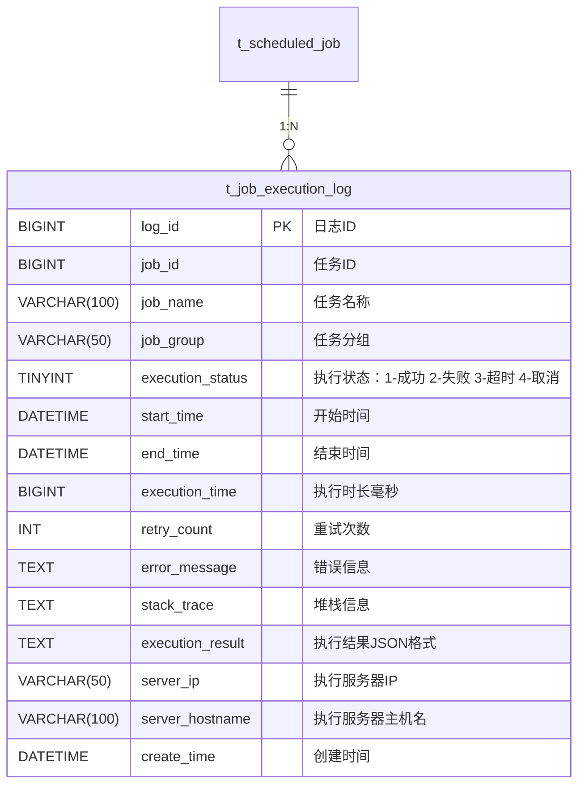
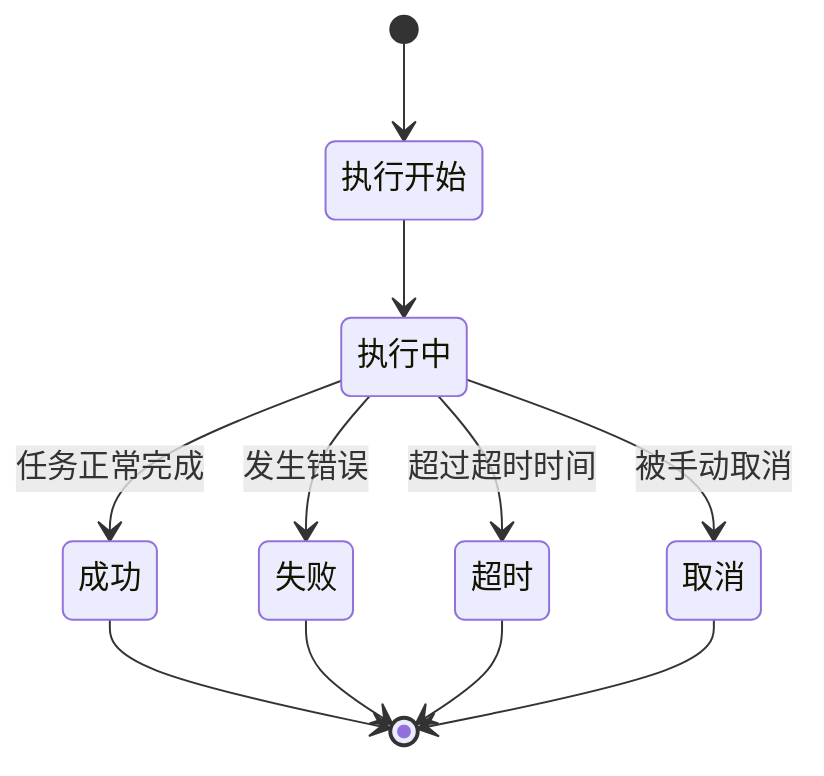
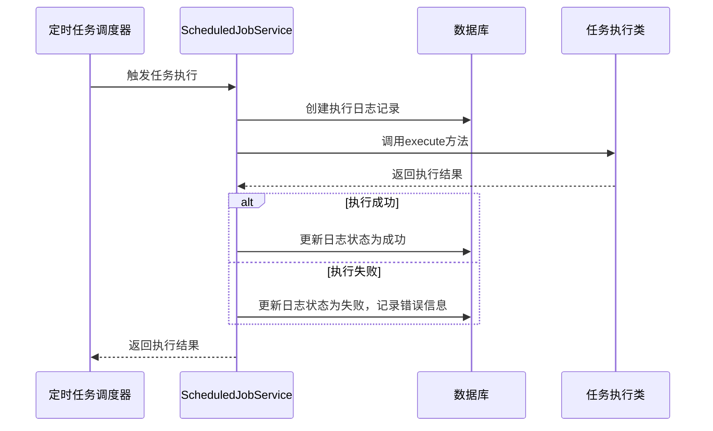

# 任务执行日志表设计

<cite>
**本文档引用文件**  
- [15-t_job_execution_log.sql](file://database-scripts/common-service/15-t_job_execution_log.sql)
- [14-t_scheduled_job.sql](file://database-scripts/common-service/14-t_scheduled_job.sql)
- [ScheduledJobEntity.java](file://microservices/microservices-common/src/main/java/net/lab1024/sa/common/scheduler/domain/entity/ScheduledJobEntity.java)
- [job-log-list-modal.vue](file://smart-admin-web-javascript/src/views/support/job/components/job-log-list-modal.vue)
</cite>

## 目录
1. [引言](#引言)
2. [表结构设计](#表结构设计)
3. [关键字段说明](#关键字段说明)
4. [执行状态设计](#执行状态设计)
5. [异常堆栈信息存储](#异常堆栈信息存储)
6. [与ScheduledJobService集成](#与scheduledjobservice集成)
7. [日志自动记录与清理策略](#日志自动记录与清理策略)
8. [查询与分析能力](#查询与分析能力)
9. [结论](#结论)

## 引言

任务执行日志表（t_job_execution_log）是IOE-DREAM系统中定时任务模块的核心组成部分，用于记录每次定时任务执行的完整生命周期信息。该表设计旨在支持任务执行情况的追溯、监控和分析，为系统运维和故障排查提供数据支持。通过详细记录任务执行的开始时间、结束时间、执行结果、错误信息等关键数据，系统能够全面掌握定时任务的运行状况，及时发现和解决问题。

**Section sources**
- [15-t_job_execution_log.sql](file://database-scripts/common-service/15-t_job_execution_log.sql#L1-L30)

## 表结构设计

t_job_execution_log表采用InnoDB存储引擎，字符集为utf8mb4，支持完整的Unicode字符存储。表结构设计遵循数据库设计规范，包含主键、索引和适当的字段类型，以确保数据的完整性和查询性能。

**Diagram sources**
- [15-t_job_execution_log.sql](file://database-scripts/common-service/15-t_job_execution_log.sql#L8-L29)
- [14-t_scheduled_job.sql](file://database-scripts/common-service/14-t_scheduled_job.sql#L8-L37)

**Section sources**
- [15-t_job_execution_log.sql](file://database-scripts/common-service/15-t_job_execution_log.sql#L8-L29)

## 关键字段说明

t_job_execution_log表包含多个关键字段，每个字段都有其特定的用途和数据类型：

| 字段名称 | 数据类型 | 是否必填 | 默认值 | 说明 |
|---------|--------|--------|-------|------|
| log_id | BIGINT | 是 | 无 | 日志ID，主键，自增 |
| job_id | BIGINT | 是 | 无 | 任务ID，关联t_scheduled_job表 |
| job_name | VARCHAR(100) | 是 | 无 | 任务名称 |
| job_group | VARCHAR(50) | 是 | 无 | 任务分组 |
| execution_status | TINYINT | 是 | 无 | 执行状态：1-成功 2-失败 3-超时 4-取消 |
| start_time | DATETIME | 是 | 无 | 开始时间 |
| end_time | DATETIME | 否 | 无 | 结束时间 |
| execution_time | BIGINT | 否 | 无 | 执行时长（毫秒） |
| retry_count | INT | 是 | 0 | 重试次数 |
| error_message | TEXT | 否 | 无 | 错误信息 |
| stack_trace | TEXT | 否 | 无 | 堆栈信息 |
| execution_result | TEXT | 否 | 无 | 执行结果（JSON格式） |
| server_ip | VARCHAR(50) | 否 | 无 | 执行服务器IP |
| server_hostname | VARCHAR(100) | 否 | 无 | 执行服务器主机名 |
| create_time | DATETIME | 是 | CURRENT_TIMESTAMP | 创建时间 |

该表通过job_id字段与t_scheduled_job表建立关联，实现任务配置与执行日志的关联查询。create_time字段使用CURRENT_TIMESTAMP作为默认值，确保每条记录都有准确的创建时间。

**Section sources**
- [15-t_job_execution_log.sql](file://database-scripts/common-service/15-t_job_execution_log.sql#L9-L23)

## 执行状态设计

execution_status字段采用TINYINT类型，使用数值编码表示不同的执行状态，这种设计既节省存储空间又便于查询和统计。具体状态码定义如下：

- **1 - 成功**：任务正常执行完成，没有发生任何错误
- **2 - 失败**：任务执行过程中发生错误，导致执行失败
- **3 - 超时**：任务执行时间超过预设的超时时间，被系统强制终止
- **4 - 取消**：任务在执行过程中被手动取消或由于其他原因被取消

这种状态码设计支持对任务执行情况进行分类统计和分析，例如可以快速查询所有失败的任务，或者统计不同状态任务的分布情况。前端界面（如job-log-list-modal.vue）也根据successFlag字段（1为成功，0为失败）来显示不同的状态图标，提供直观的视觉反馈。

**Diagram sources**
- [15-t_job_execution_log.sql](file://database-scripts/common-service/15-t_job_execution_log.sql#L13)
- [job-log-list-modal.vue](file://smart-admin-web-javascript/src/views/support/job/components/job-log-list-modal.vue#L14-L17)

**Section sources**
- [15-t_job_execution_log.sql](file://database-scripts/common-service/15-t_job_execution_log.sql#L13)

## 异常堆栈信息存储

error_stack字段在表中对应为stack_trace字段，用于存储任务执行过程中发生的异常堆栈信息。该字段设计为TEXT类型，能够存储较长的文本内容，足以容纳完整的异常堆栈信息。

当任务执行失败时，系统会捕获异常并将其堆栈信息序列化为字符串，存储在stack_trace字段中。同时，错误的简要信息会存储在error_message字段中，便于快速查看错误原因。这种设计使得故障排查更加高效，开发人员可以通过查看完整的堆栈信息来定位问题根源。

execution_result字段设计为TEXT类型，存储JSON格式的执行结果。这种设计具有良好的扩展性，可以存储各种类型和结构的执行结果数据，而不需要修改表结构。JSON格式也便于前后端的数据交换和处理。

**Section sources**
- [15-t_job_execution_log.sql](file://database-scripts/common-service/15-t_job_execution_log.sql#L18-L20)

## 与ScheduledJobService集成

t_job_execution_log表与ScheduledJobService服务紧密集成，实现定时任务执行日志的自动记录。ScheduledJobService是系统中负责定时任务调度和执行的核心服务，其主要功能包括：

1. 从t_scheduled_job表加载任务配置
2. 根据Cron表达式调度任务执行
3. 执行任务并记录执行日志
4. 处理任务失败和重试逻辑

当ScheduledJobService执行任务时，会自动创建t_job_execution_log表的记录，记录任务执行的完整生命周期。任务开始执行时，记录start_time；任务执行完成后，记录end_time、execution_time、execution_status等信息。如果任务执行失败，还会记录error_message和stack_trace。

ScheduledJobEntity类作为t_scheduled_job表的Java实体，通过MyBatis Plus框架与数据库进行映射，简化了数据访问操作。ScheduledJobDao接口提供了对定时任务数据的访问方法，遵循四层架构规范。

**Diagram sources**
- [ScheduledJobEntity.java](file://microservices/microservices-common/src/main/java/net/lab1024/sa/common/scheduler/domain/entity/ScheduledJobEntity.java#L34-L155)
- [15-t_job_execution_log.sql](file://database-scripts/common-service/15-t_job_execution_log.sql#L8-L29)

**Section sources**
- [ScheduledJobEntity.java](file://microservices/microservices-common/src/main/java/net/lab1024/sa/common/scheduler/domain/entity/ScheduledJobEntity.java#L34-L155)
- [14-t_scheduled_job.sql](file://database-scripts/common-service/14-t_scheduled_job.sql#L8-L37)

## 日志自动记录与清理策略

系统实现了完善的日志自动记录和清理策略，确保t_job_execution_log表的数据质量和性能。

**自动记录机制**：
1. 任务开始执行时，自动创建日志记录，设置log_id、job_id、job_name、job_group、start_time等字段
2. 任务执行过程中，记录重试次数retry_count
3. 任务执行完成后，更新end_time、execution_time、execution_status等字段
4. 如果发生错误，记录error_message和stack_trace
5. 记录执行服务器的IP和主机名，便于分布式环境下的问题定位

**清理策略**：
1. 系统定期清理过期的日志记录，避免表数据无限增长
2. 清理策略可配置，支持按时间（如保留最近30天的日志）或按数量（如保留最近10000条日志）进行清理
3. 清理操作在系统低峰期执行，减少对系统性能的影响
4. 提供手动清理功能，支持按条件删除特定任务的日志记录

索引设计（idx_job_id、idx_execution_status、idx_start_time、idx_create_time）优化了常见查询场景的性能，如按任务ID查询执行记录、按执行状态筛选日志、按时间范围查询等。

**Section sources**
- [15-t_job_execution_log.sql](file://database-scripts/common-service/15-t_job_execution_log.sql#L24-L28)

## 查询与分析能力

t_job_execution_log表支持多种查询和分析场景，为系统监控和运维提供有力支持：

1. **任务执行情况追溯**：通过job_id和start_time可以精确追溯某次任务执行的详细情况
2. **执行成功率分析**：统计不同任务或任务组的执行成功率，识别稳定性问题
3. **执行时长分析**：分析任务执行时长的变化趋势，发现性能退化问题
4. **错误模式分析**：分析错误信息和堆栈信息，识别常见错误模式和根本原因
5. **服务器性能分析**：通过server_ip和server_hostname分析不同服务器的执行性能差异

前端界面提供了丰富的查询条件，包括关键字搜索、执行结果筛选（成功/失败）、执行时间范围选择等，支持用户快速定位感兴趣的日志记录。

**Section sources**
- [job-log-list-modal.vue](file://smart-admin-web-javascript/src/views/support/job/components/job-log-list-modal.vue#L10-L22)

## 结论

t_job_execution_log表的设计充分考虑了定时任务执行日志记录的需求，通过合理的表结构设计、状态码设计和集成机制，实现了任务执行生命周期的完整记录。该表不仅支持基本的日志记录功能，还为任务执行情况的追溯、分析和故障排查提供了强大的支持。与ScheduledJobService的紧密集成确保了日志记录的自动化和准确性，而完善的清理策略则保证了系统的长期稳定运行。整体设计遵循了数据库设计最佳实践，具有良好的可维护性和扩展性。