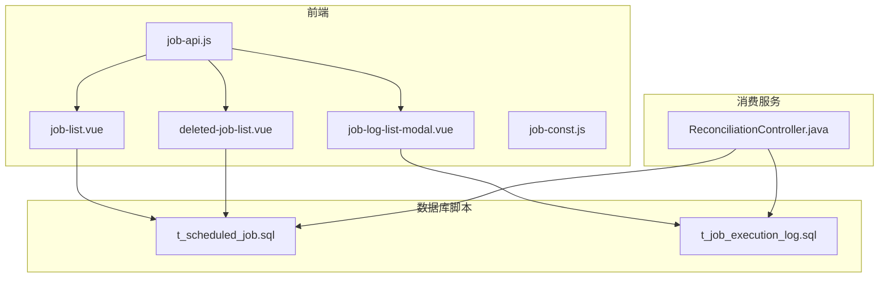
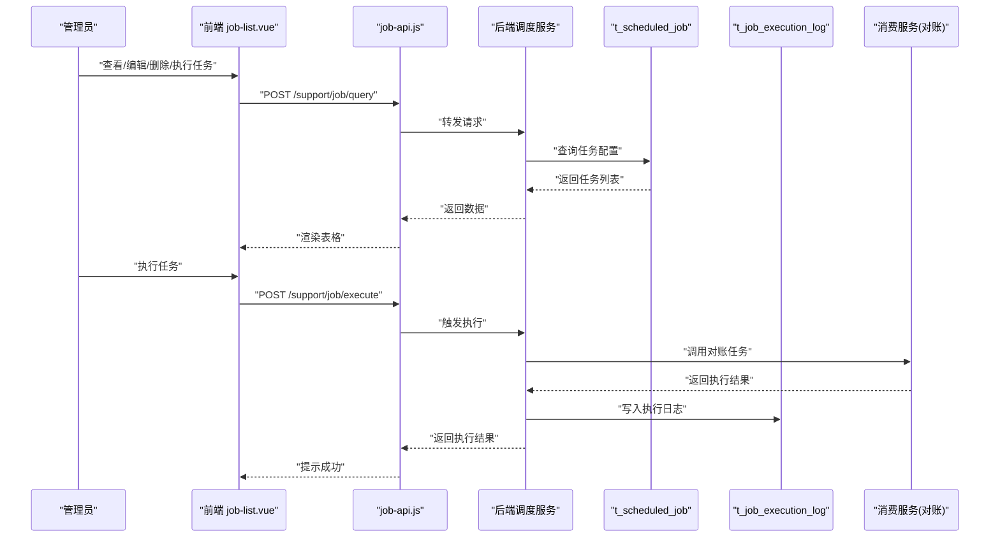
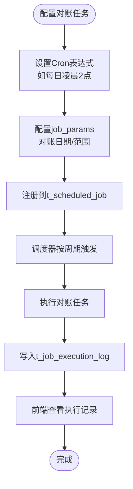
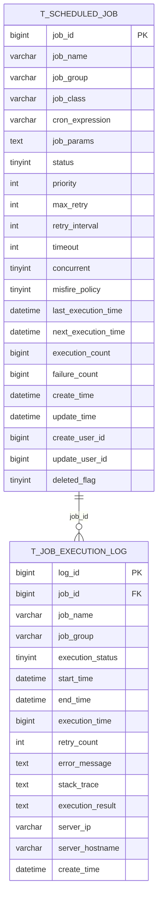

# 作业调度表设计

<cite>
**本文引用的文件**
- [t_scheduled_job.sql](file://database-scripts/common-service/14-t_scheduled_job.sql)
- [t_job_execution_log.sql](file://database-scripts/common-service/15-t_job_execution_log.sql)
- [job-api.js](file://smart-admin-web-javascript/src/api/support/job-api.js)
- [job-list.vue](file://smart-admin-web-javascript/src/views/support/job/job-list.vue)
- [deleted-job-list.vue](file://smart-admin-web-javascript/src/views/support/job/components/deleted-job-list.vue)
- [job-log-list-modal.vue](file://smart-admin-web-javascript/src/views/support/job/components/job-log-list-modal.vue)
- [job-const.js](file://smart-admin-web-javascript/src/constants/support/job-const.js)
- [ReconciliationController.java](file://microservices/ioedream-consume-service/src/main/java/net/lab1024/sa/consume/controller/ReconciliationController.java)
- [CONSUME_SERVICE_TODO_COMPLETION_SUMMARY.md](file://documentation/technical/CONSUME_SERVICE_TODO_COMPLETION_SUMMARY.md)
- [CONSUME_SERVICE_IMPLEMENTATION_FINAL_REPORT.md](file://documentation/technical/CONSUME_SERVICE_IMPLEMENTATION_FINAL_REPORT.md)
- [spec.md](file://openspec/changes/archive/completed-proposals/implement-third-party-system-integration/specs/third-party-system-integration/spec.md)
</cite>

## 目录
1. [引言](#引言)
2. [项目结构](#项目结构)
3. [核心组件](#核心组件)
4. [架构总览](#架构总览)
5. [详细组件分析](#详细组件分析)
6. [依赖分析](#依赖分析)
7. [性能考虑](#性能考虑)
8. [故障排查指南](#故障排查指南)
9. [结论](#结论)
10. [附录](#附录)

## 引言
本文件聚焦于作业调度模块的数据模型设计，系统性解析两个核心表：t_scheduled_job（定时任务表）与 t_job_execution_log（任务执行日志表）。文档将阐明：
- t_scheduled_job 中 cron 表达式、任务类型、执行策略等字段的设计意图与使用方式；
- 如何支持动态增删改查定时任务；
- t_job_execution_log 如何记录每次任务执行的详细信息（开始/结束时间、执行结果、异常堆栈等）；
- 与微服务中 ScheduledJobManager 的集成方式；
- 在分布式环境下如何实现任务协调；
- 消费系统自动对账任务等实际应用场景。

## 项目结构
作业调度模块的数据模型位于数据库脚本目录，前端通过 API 与后台交互，消费服务提供对账业务能力并与调度系统协同。

图表来源
- [t_scheduled_job.sql](file://database-scripts/common-service/14-t_scheduled_job.sql#L1-L39)
- [t_job_execution_log.sql](file://database-scripts/common-service/15-t_job_execution_log.sql#L1-L31)
- [job-api.js](file://smart-admin-web-javascript/src/api/support/job-api.js#L1-L43)
- [job-list.vue](file://smart-admin-web-javascript/src/views/support/job/job-list.vue#L92-L143)
- [deleted-job-list.vue](file://smart-admin-web-javascript/src/views/support/job/components/deleted-job-list.vue#L85-L123)
- [job-log-list-modal.vue](file://smart-admin-web-javascript/src/views/support/job/components/job-log-list-modal.vue#L1-L78)
- [job-const.js](file://smart-admin-web-javascript/src/constants/support/job-const.js#L1-L18)
- [ReconciliationController.java](file://microservices/ioedream-consume-service/src/main/java/net/lab1024/sa/consume/controller/ReconciliationController.java#L1-L74)

章节来源
- [t_scheduled_job.sql](file://database-scripts/common-service/14-t_scheduled_job.sql#L1-L39)
- [t_job_execution_log.sql](file://database-scripts/common-service/15-t_job_execution_log.sql#L1-L31)
- [job-api.js](file://smart-admin-web-javascript/src/api/support/job-api.js#L1-L43)
- [job-list.vue](file://smart-admin-web-javascript/src/views/support/job/job-list.vue#L92-L143)
- [deleted-job-list.vue](file://smart-admin-web-javascript/src/views/support/job/components/deleted-job-list.vue#L85-L123)
- [job-log-list-modal.vue](file://smart-admin-web-javascript/src/views/support/job/components/job-log-list-modal.vue#L1-L78)
- [job-const.js](file://smart-admin-web-javascript/src/constants/support/job-const.js#L1-L18)
- [ReconciliationController.java](file://microservices/ioedream-consume-service/src/main/java/net/lab1024/sa/consume/controller/ReconciliationController.java#L1-L74)

## 核心组件
- 定时任务表 t_scheduled_job：存储任务定义、调度策略、执行控制参数与运行指标。
- 任务执行日志表 t_job_execution_log：记录每次任务执行的生命周期与结果。

章节来源
- [t_scheduled_job.sql](file://database-scripts/common-service/14-t_scheduled_job.sql#L8-L37)
- [t_job_execution_log.sql](file://database-scripts/common-service/15-t_job_execution_log.sql#L8-L29)

## 架构总览
调度系统由“配置中心（数据库表）+ 前端管理界面 + 后端服务 + 消费服务业务”构成。前端通过 job-api.js 调用后端接口，后端根据 t_scheduled_job 的配置驱动任务执行，并将执行结果写入 t_job_execution_log。消费服务提供对账业务，可作为调度任务的执行类被调用。

图表来源
- [job-list.vue](file://smart-admin-web-javascript/src/views/support/job/job-list.vue#L116-L141)
- [job-api.js](file://smart-admin-web-javascript/src/api/support/job-api.js#L1-L43)
- [t_scheduled_job.sql](file://database-scripts/common-service/14-t_scheduled_job.sql#L8-L37)
- [t_job_execution_log.sql](file://database-scripts/common-service/15-t_job_execution_log.sql#L8-L29)
- [ReconciliationController.java](file://microservices/ioedream-consume-service/src/main/java/net/lab1024/sa/consume/controller/ReconciliationController.java#L44-L74)

## 详细组件分析

### t_scheduled_job 表结构与设计意图
- 关键字段与含义
  - job_id：任务唯一标识，主键。
  - job_name / job_group：任务名称与分组，联合唯一索引用于避免同组重复任务名。
  - job_class：任务执行类（即具体业务逻辑入口，如消费服务对账任务）。
  - cron_expression：Cron 表达式，定义任务触发周期。
  - job_params：任务参数（JSON），用于向执行类传递动态配置。
  - status：任务状态（启用/暂停/停止），配合调度器启停。
  - priority：优先级，用于调度器在资源紧张时选择执行顺序。
  - max_retry / retry_interval：最大重试次数与重试间隔（秒）。
  - timeout：任务超时时间（秒），超过则视为超时。
  - concurrent：是否允许并发执行（0 否，1 是）。
  - misfire_policy：错过执行策略（立即执行/执行一次/放弃执行）。
  - last_execution_time / next_execution_time：最近执行时间与下次执行时间，便于监控与排障。
  - execution_count / failure_count：累计执行次数与失败次数，用于统计与告警。
  - create_time / update_time / deleted_flag：通用审计与软删除字段。
  - create_user_id / update_user_id：操作人标识。

- 设计要点
  - 以 cron_expression 为核心触发条件，结合 misfire_policy 与 concurrent 控制执行行为。
  - 通过 status 与 deleted_flag 支持动态启停与软删除。
  - 通过 job_params 与 job_class 解耦配置与执行逻辑，便于扩展新任务类型。
  - 通过索引（status、next_execution_time、deleted_flag）提升调度查询效率。

- 动态增删改查支持
  - 新增：前端提交任务配置，后端写入 t_scheduled_job。
  - 修改：更新任务参数、Cron、重试策略、并发策略等。
  - 启停：修改 status 字段，调度器按状态拉取与执行。
  - 删除：标记 deleted_flag，前端可切换“已删除任务”视图。
  - 查询：按名称/分组/状态/时间等条件检索，支持分页与排序。

章节来源
- [t_scheduled_job.sql](file://database-scripts/common-service/14-t_scheduled_job.sql#L8-L37)
- [job-list.vue](file://smart-admin-web-javascript/src/views/support/job/job-list.vue#L116-L141)
- [deleted-job-list.vue](file://smart-admin-web-javascript/src/views/support/job/components/deleted-job-list.vue#L85-L123)
- [job-api.js](file://smart-admin-web-javascript/src/api/support/job-api.js#L11-L21)

### t_job_execution_log 表结构与记录内容
- 关键字段与含义
  - log_id：日志唯一标识，主键。
  - job_id / job_name / job_group：关联任务信息，便于回溯。
  - execution_status：执行状态（成功/失败/超时/取消）。
  - start_time / end_time：开始与结束时间，用于计算执行时长。
  - execution_time：执行时长（毫秒）。
  - retry_count：重试次数，配合 max_retry 进行统计。
  - error_message / stack_trace：错误信息与堆栈，便于定位问题。
  - execution_result：执行结果（JSON），用于记录业务输出摘要。
  - server_ip / server_hostname：执行节点信息，便于分布式追踪。
  - create_time：日志创建时间，便于归档与查询。

- 日志记录流程
  - 任务开始前记录一条初始日志（或在执行前准备阶段写入）。
  - 任务结束后根据结果写入最终状态、耗时、错误信息与结果摘要。
  - 支持重试场景下多次写入，retry_count 递增。

- 与前端的联动
  - 前端通过 job-log-list-modal.vue 展示任务执行记录，支持按时间、状态、关键字筛选与分页。

章节来源
- [t_job_execution_log.sql](file://database-scripts/common-service/15-t_job_execution_log.sql#L8-L29)
- [job-log-list-modal.vue](file://smart-admin-web-javascript/src/views/support/job/components/job-log-list-modal.vue#L1-L78)
- [job-api.js](file://smart-admin-web-javascript/src/api/support/job-api.js#L35-L40)

### 与微服务中 ScheduledJobManager 的集成方式
- 配置驱动
  - 后端调度服务读取 t_scheduled_job，依据 cron_expression 与 misfire_policy 配置调度器。
  - job_class 指向具体业务实现（例如消费服务对账任务），通过 job_params 注入参数。
- 执行与落盘
  - 任务执行完成后，将执行结果写入 t_job_execution_log，包含状态、耗时、错误与结果摘要。
- 前后端协作
  - 前端通过 job-api.js 的 /support/job/* 接口进行任务管理与执行记录查询。
  - job-list.vue 与 deleted-job-list.vue 提供任务列表与状态切换；job-log-list-modal.vue 提供执行记录查询与筛选。

章节来源
- [job-api.js](file://smart-admin-web-javascript/src/api/support/job-api.js#L1-L43)
- [job-list.vue](file://smart-admin-web-javascript/src/views/support/job/job-list.vue#L92-L143)
- [deleted-job-list.vue](file://smart-admin-web-javascript/src/views/support/job/components/deleted-job-list.vue#L85-L123)
- [job-log-list-modal.vue](file://smart-admin-web-javascript/src/views/support/job/components/job-log-list-modal.vue#L1-L78)

### 分布式环境下的任务协调
- 节点与并发
  - 通过配置并发策略与节点资源上限，避免单节点过载。
- 任务分配与容错
  - 任务依赖关系与失败转移策略由调度器实现，确保节点故障时任务可迁移。
- 实时状态与日志
  - 通过 WebSocket 或定期轮询推送执行状态，数据库记录执行历史以便审计与回放。

章节来源
- [spec.md](file://openspec/changes/archive/completed-proposals/implement-third-party-system-integration/specs/third-party-system-integration/spec.md#L107-L122)

### 实际应用场景：消费系统自动对账任务
- 业务背景
  - 消费服务提供对账能力，支持日终对账、实时对账与历史查询。
- 与调度系统集成
  - 将对账任务注册为定时任务（job_class 指向对账实现），通过 cron_expression 设置执行周期。
  - 任务执行结果写入 t_job_execution_log，便于监控与审计。
- 前端可观测性
  - 在前端任务列表中查看上次执行结果、下次执行时间与执行记录。

图表来源
- [t_scheduled_job.sql](file://database-scripts/common-service/14-t_scheduled_job.sql#L8-L37)
- [t_job_execution_log.sql](file://database-scripts/common-service/15-t_job_execution_log.sql#L8-L29)
- [ReconciliationController.java](file://microservices/ioedream-consume-service/src/main/java/net/lab1024/sa/consume/controller/ReconciliationController.java#L44-L74)
- [CONSUME_SERVICE_TODO_COMPLETION_SUMMARY.md](file://documentation/technical/CONSUME_SERVICE_TODO_COMPLETION_SUMMARY.md#L36-L55)
- [CONSUME_SERVICE_IMPLEMENTATION_FINAL_REPORT.md](file://documentation/technical/CONSUME_SERVICE_IMPLEMENTATION_FINAL_REPORT.md#L54-L96)

章节来源
- [ReconciliationController.java](file://microservices/ioedream-consume-service/src/main/java/net/lab1024/sa/consume/controller/ReconciliationController.java#L44-L74)
- [CONSUME_SERVICE_TODO_COMPLETION_SUMMARY.md](file://documentation/technical/CONSUME_SERVICE_TODO_COMPLETION_SUMMARY.md#L36-L55)
- [CONSUME_SERVICE_IMPLEMENTATION_FINAL_REPORT.md](file://documentation/technical/CONSUME_SERVICE_IMPLEMENTATION_FINAL_REPORT.md#L54-L96)

## 依赖分析
- 表间依赖
  - t_job_execution_log.job_id 外键关联 t_scheduled_job.job_id，用于执行记录与任务配置的关联。
- 前端依赖
  - job-api.js 依赖后端接口路径，job-list.vue、deleted-job-list.vue、job-log-list-modal.vue 依赖 job-api.js 进行数据交互。
- 业务依赖
  - 消费服务对账控制器与调度配置解耦，通过 job_class 与 job_params 传递业务上下文。

图表来源
- [t_scheduled_job.sql](file://database-scripts/common-service/14-t_scheduled_job.sql#L8-L37)
- [t_job_execution_log.sql](file://database-scripts/common-service/15-t_job_execution_log.sql#L8-L29)

章节来源
- [t_scheduled_job.sql](file://database-scripts/common-service/14-t_scheduled_job.sql#L8-L37)
- [t_job_execution_log.sql](file://database-scripts/common-service/15-t_job_execution_log.sql#L8-L29)

## 性能考虑
- 索引优化
  - t_scheduled_job：status、next_execution_time、deleted_flag 等索引有助于调度器快速筛选待执行任务。
  - t_job_execution_log：job_id、execution_status、start_time、create_time 索引便于按任务与时间维度查询。
- 并发与超时
  - concurrent 与 timeout 控制任务并发度与超时，避免资源争用与长时间阻塞。
- 日志归档
  - 对历史日志进行定期归档与清理，降低查询压力。

## 故障排查指南
- 常见问题定位
  - 任务未执行：检查 status 是否启用、cron_expression 是否正确、misfire_policy 是否符合预期。
  - 任务频繁失败：查看 t_job_execution_log.error_message 与 stack_trace，结合 job_params 排查参数问题。
  - 超时与阻塞：调整 timeout 与 concurrent，必要时拆分任务或增加资源。
- 前端辅助
  - 使用 job-log-list-modal.vue 查看执行时间线、状态与错误详情，快速定位异常批次。

章节来源
- [t_scheduled_job.sql](file://database-scripts/common-service/14-t_scheduled_job.sql#L16-L23)
- [t_job_execution_log.sql](file://database-scripts/common-service/15-t_job_execution_log.sql#L13-L21)
- [job-log-list-modal.vue](file://smart-admin-web-javascript/src/views/support/job/components/job-log-list-modal.vue#L1-L78)

## 结论
t_scheduled_job 与 t_job_execution_log 通过清晰的字段设计与索引策略，支撑了灵活的定时任务配置、可靠的执行记录与可观测性。前端通过标准化 API 与可视化界面实现了对任务的全生命周期管理；消费服务对账任务作为典型业务场景，展示了调度系统在分布式环境中的落地实践。建议在生产环境中结合 misfire_policy、concurrent、timeout 等策略进行精细化调优，并配套完善的日志归档与告警机制。

## 附录
- 任务类型枚举（前端）
  - TRIGGER_TYPE_ENUM：包含 cron 与 fixed_delay 等触发类型，便于前端在任务配置时选择合适的触发方式。

章节来源
- [job-const.js](file://smart-admin-web-javascript/src/constants/support/job-const.js#L1-L18)