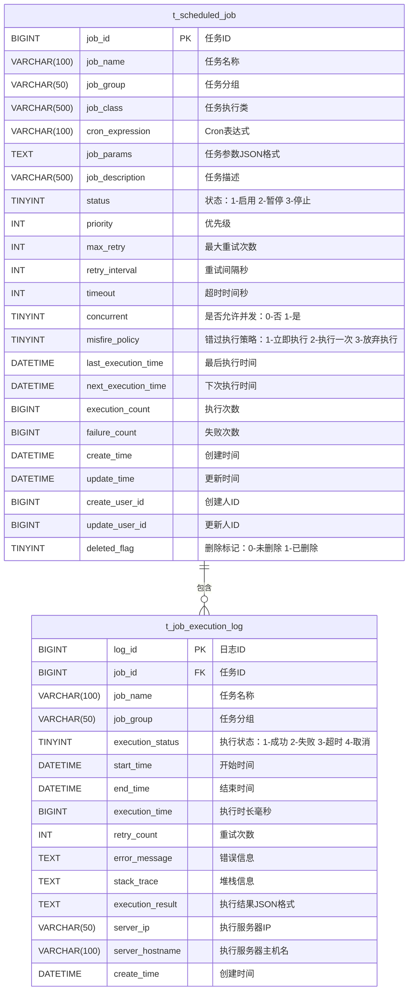
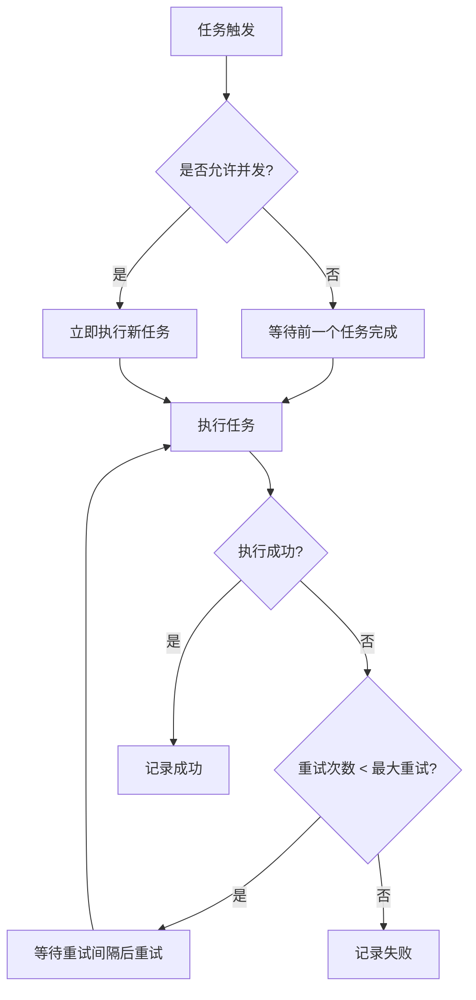
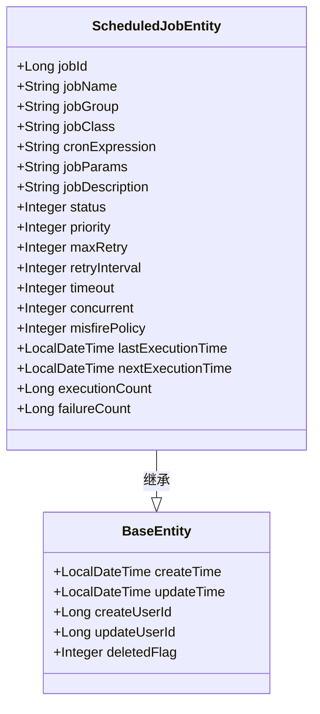
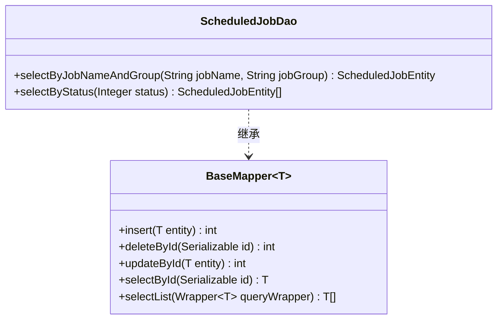
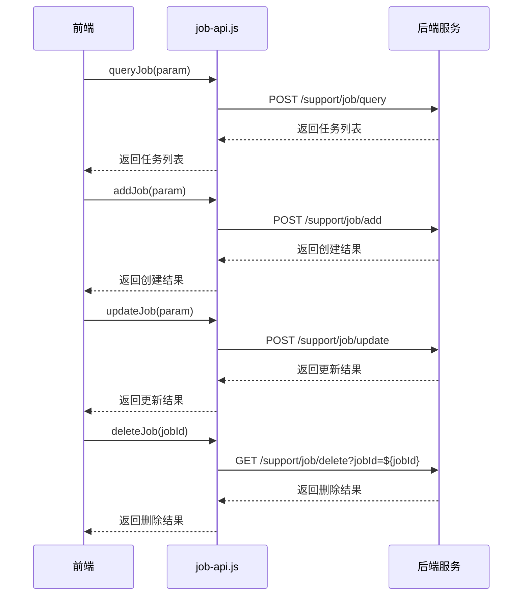

# 定时任务表设计

<cite>
**本文档引用文件**  
- [14-t_scheduled_job.sql](file://database-scripts/common-service/14-t_scheduled_job.sql)
- [ScheduledJobEntity.java](file://microservices/microservices-common/src/main/java/net/lab1024/sa/common/scheduler/domain/entity/ScheduledJobEntity.java)
- [ScheduledJobDao.java](file://microservices/microservices-common/src/main/java/net/lab1024/sa/common/scheduler/dao/ScheduledJobDao.java)
- [job-api.js](file://smart-admin-web-javascript/src/api/support/job-api.js)
- [job-list.vue](file://smart-admin-web-javascript/src/views/support/job/job-list.vue)
- [BaseEntity.java](file://microservices/microservices-common/src/main/java/net/lab1024/sa/common/entity/BaseEntity.java)
</cite>

## 目录
1. [引言](#引言)
2. [表结构设计](#表结构设计)
3. [核心字段详解](#核心字段详解)
4. [Cron表达式配置](#cron表达式配置)
5. [任务类型与执行策略](#任务类型与执行策略)
6. [实体类与MyBatis-Plus映射](#实体类与mybatis-plus映射)
7. [API接口与调用示例](#api接口与调用示例)
8. [最佳实践](#最佳实践)

## 引言
`t_scheduled_job`表是IOE-DREAM系统中定时任务模块的核心数据表，用于存储和管理所有定时任务的配置信息。该表支持灵活的定时任务调度，能够满足数据同步、报表生成、缓存刷新等多种业务场景的需求。通过与MyBatis-Plus框架的集成，实现了高效的CRUD操作，并提供了丰富的执行策略控制。

**Section sources**
- [14-t_scheduled_job.sql](file://database-scripts/common-service/14-t_scheduled_job.sql)

## 表结构设计
`t_scheduled_job`表的设计遵循了高可用性和可扩展性的原则，包含了任务的基本信息、调度配置、执行策略和审计字段。表结构如下：



**Diagram sources**
- [14-t_scheduled_job.sql](file://database-scripts/common-service/14-t_scheduled_job.sql)
- [15-t_job_execution_log.sql](file://database-scripts/common-service/15-t_job_execution_log.sql)

**Section sources**
- [14-t_scheduled_job.sql](file://database-scripts/common-service/14-t_scheduled_job.sql)

## 核心字段详解
`t_scheduled_job`表的核心字段设计旨在提供灵活的任务配置和精确的执行控制。

### job_id
`job_id`是任务的唯一标识符，采用BIGINT类型并设置为自增主键，确保每个任务都有唯一的ID。

### job_name
`job_name`字段用于存储任务的名称，VARCHAR(100)类型，不允许为空。任务名称在同一个分组内必须唯一，通过唯一索引`uk_job_name_group`保证。

### cron_expression
`cron_expression`字段存储Cron表达式，用于定义任务的执行时间规则。该字段为VARCHAR(100)类型，不允许为空，支持灵活的定时任务配置。

### job_type
虽然表结构中没有直接的`job_type`字段，但通过`job_class`字段可以间接确定任务类型。`job_class`存储任务执行类的完整类名，不同的类名对应不同类型的任务，如数据同步、报表生成等。

### execute_strategy
执行策略由多个字段共同控制：
- `concurrent`：是否允许并发执行，0表示不允许，1表示允许。
- `misfire_policy`：错过执行策略，1表示立即执行，2表示执行一次，3表示放弃执行。
- `max_retry`和`retry_interval`：定义最大重试次数和重试间隔。

**Section sources**
- [14-t_scheduled_job.sql](file://database-scripts/common-service/14-t_scheduled_job.sql)

## Cron表达式配置
Cron表达式是一种用于配置定时任务执行时间的字符串格式。`cron_expression`字段支持标准的Cron表达式，允许用户定义复杂的执行规则。

### Cron表达式格式
Cron表达式由6个或7个字段组成，分别表示秒、分钟、小时、日期、月份、星期和年份（可选）。例如：
- `0 0 12 * * ?`：每天中午12点执行
- `0 15 10 ? * MON-FRI`：工作日上午10:15执行
- `0 0/5 14,18 * * ?`：每天下午2点到6点，每5分钟执行一次

### 配置示例
```sql
-- 每天凌晨1点执行数据同步任务
INSERT INTO t_scheduled_job (job_name, job_class, cron_expression, job_params)
VALUES ('DataSyncJob', 'com.example.DataSyncTask', '0 0 1 * * ?', '{"source": "db1", "target": "db2"}');

-- 每周一上午9点生成周报
INSERT INTO t_scheduled_job (job_name, job_class, cron_expression, job_params)
VALUES ('WeeklyReportJob', 'com.example.WeeklyReportTask', '0 0 9 ? * MON', '{"reportType": "weekly"}');
```

**Section sources**
- [14-t_scheduled_job.sql](file://database-scripts/common-service/14-t_scheduled_job.sql)

## 任务类型与执行策略
### 任务类型
通过`job_class`字段区分不同类型的业务任务：
- **数据同步**：`com.example.DataSyncTask`
- **报表生成**：`com.example.ReportGenerationTask`
- **缓存刷新**：`com.example.CacheRefreshTask`
- **日志清理**：`com.example.LogCleanupTask`

### 执行策略
执行策略通过多个字段组合实现：
- **单机/集群**：通过`concurrent`字段控制，0表示单机模式，1表示集群模式。
- **串行/并行**：`concurrent`字段同样控制任务的串行或并行执行。
- **重试机制**：`max_retry`和`retry_interval`字段定义重试次数和间隔。
- **超时控制**：`timeout`字段定义任务执行的超时时间。



**Diagram sources**
- [14-t_scheduled_job.sql](file://database-scripts/common-service/14-t_scheduled_job.sql)

**Section sources**
- [14-t_scheduled_job.sql](file://database-scripts/common-service/14-t_scheduled_job.sql)

## 实体类与MyBatis-Plus映射
### ScheduledJobEntity
`ScheduledJobEntity`是`t_scheduled_job`表对应的Java实体类，继承自`BaseEntity`，包含了所有数据库字段的映射。



**Diagram sources**
- [ScheduledJobEntity.java](file://microservices/microservices-common/src/main/java/net/lab1024/sa/common/scheduler/domain/entity/ScheduledJobEntity.java)
- [BaseEntity.java](file://microservices/microservices-common/src/main/java/net/lab1024/sa/common/entity/BaseEntity.java)

### ScheduledJobDao
`ScheduledJobDao`接口继承自MyBatis-Plus的`BaseMapper`，提供了基本的CRUD操作，并定义了两个默认方法用于特定查询。



**Diagram sources**
- [ScheduledJobDao.java](file://microservices/microservices-common/src/main/java/net/lab1024/sa/common/scheduler/dao/ScheduledJobDao.java)

**Section sources**
- [ScheduledJobEntity.java](file://microservices/microservices-common/src/main/java/net/lab1024/sa/common/scheduler/domain/entity/ScheduledJobEntity.java)
- [ScheduledJobDao.java](file://microservices/microservices-common/src/main/java/net/lab1024/sa/common/scheduler/dao/ScheduledJobDao.java)

## API接口与调用示例
### 前端API定义
前端通过`job-api.js`定义了与定时任务相关的API接口。



**Diagram sources**
- [job-api.js](file://smart-admin-web-javascript/src/api/support/job-api.js)

### 创建新定时任务API调用示例
```javascript
// 创建数据同步任务
const dataSyncJob = {
  jobName: 'DataSyncJob',
  jobGroup: 'DATA_SYNC',
  jobClass: 'com.example.DataSyncTask',
  cronExpression: '0 0 1 * * ?',
  jobParams: JSON.stringify({
    source: 'production_db',
    target: 'analytics_db',
    tables: ['user', 'order', 'product']
  }),
  jobDescription: '每日凌晨1点同步生产库到分析库',
  status: 1,
  priority: 10,
  maxRetry: 3,
  retryInterval: 300,
  timeout: 3600,
  concurrent: 0,
  misfirePolicy: 1
};

jobApi.addJob(dataSyncJob).then(response => {
  console.log('任务创建成功:', response.data);
}).catch(error => {
  console.error('任务创建失败:', error);
});
```

**Section sources**
- [job-api.js](file://smart-admin-web-javascript/src/api/support/job-api.js)
- [job-list.vue](file://smart-admin-web-javascript/src/views/support/job/job-list.vue)

## 最佳实践
### 1. 任务命名规范
- 使用有意义的名称，如`DataSyncJob`、`DailyReportJob`
- 在任务分组中使用业务模块名称，如`DATA_SYNC`、`REPORT_GENERATION`

### 2. Cron表达式优化
- 避免在高峰期执行资源密集型任务
- 使用`?`通配符避免日期和星期的冲突
- 测试Cron表达式以确保预期的执行时间

### 3. 错误处理与重试
- 设置合理的`max_retry`和`retry_interval`
- 记录详细的错误信息和堆栈跟踪
- 实现告警机制，及时通知任务失败

### 4. 性能监控
- 定期检查`execution_count`和`failure_count`统计
- 监控`next_execution_time`确保任务按时触发
- 分析执行日志，优化任务执行时间

### 5. 安全性考虑
- 限制对定时任务管理接口的访问权限
- 对敏感任务参数进行加密存储
- 定期审计任务配置变更

**Section sources**
- [14-t_scheduled_job.sql](file://database-scripts/common-service/14-t_scheduled_job.sql)
- [ScheduledJobEntity.java](file://microservices/microservices-common/src/main/java/net/lab1024/sa/common/scheduler/domain/entity/ScheduledJobEntity.java)
- [job-api.js](file://smart-admin-web-javascript/src/api/support/job-api.js)