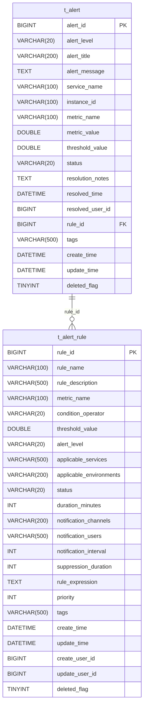
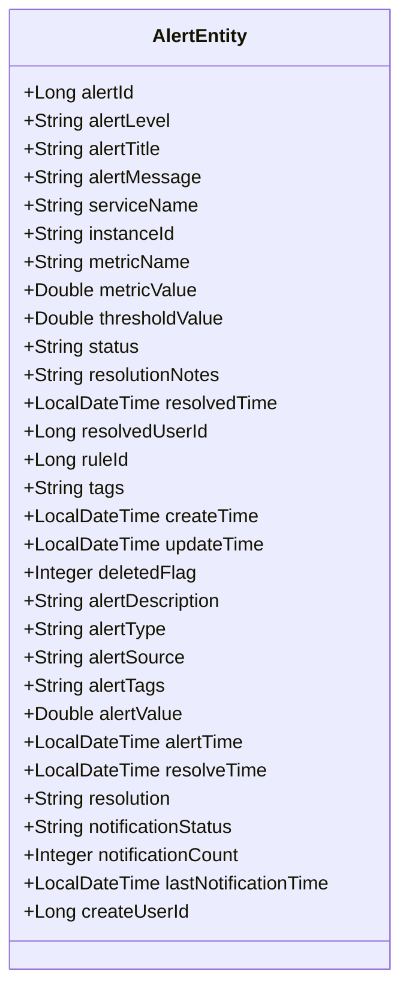
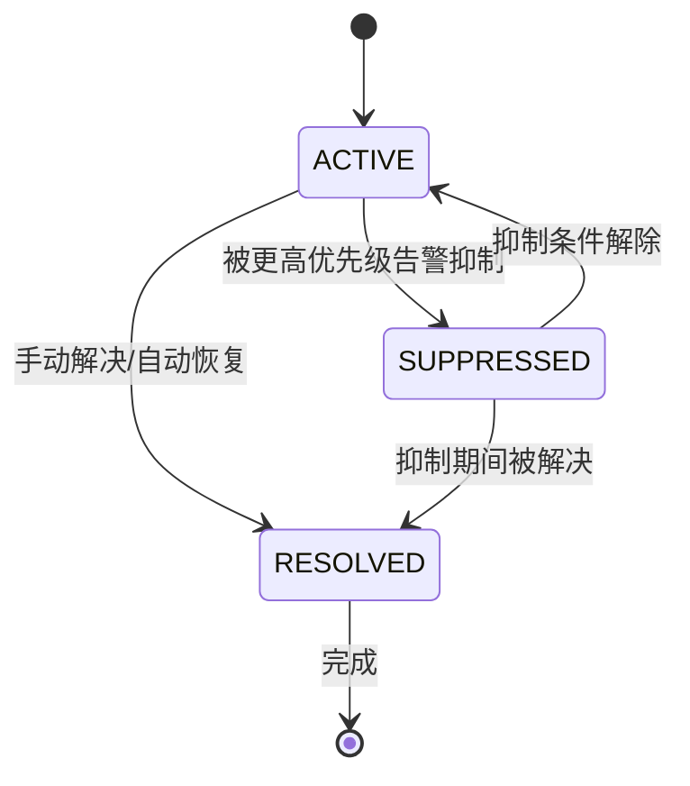
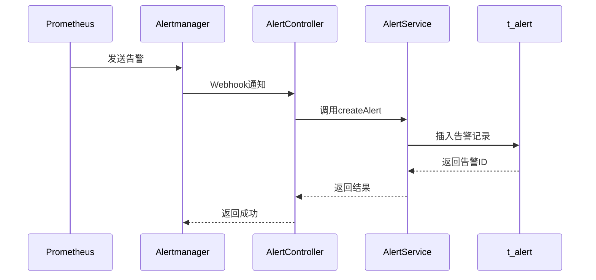
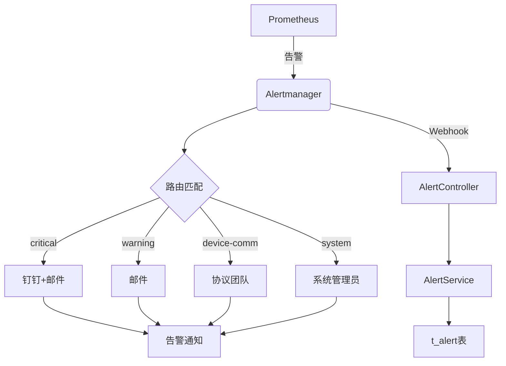
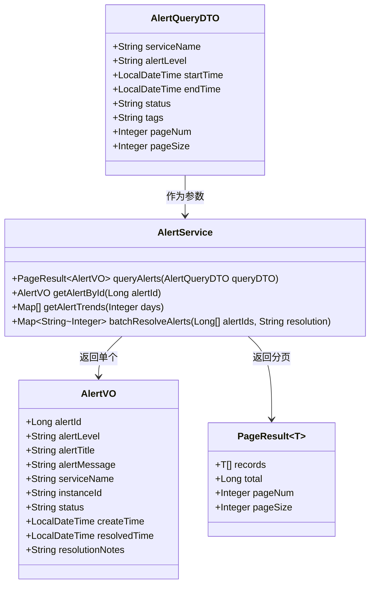

# 告警事件管理

<cite>
**本文档引用文件**   
- [11-t_alert.sql](file://database-scripts/common-service/11-t_alert.sql)
- [alertmanager.yml](file://deployment/monitoring/alertmanager/alertmanager.yml)
- [AlertEntity.java](file://microservices/microservices-common/src/main/java/net/lab1024/sa/common/monitor/domain/entity/AlertEntity.java)
- [AlertController.java](file://microservices/ioedream-common-service/src/main/java/net/lab1024/sa/common/monitor/controller/AlertController.java)
- [AlertServiceImpl.java](file://microservices/microservices-common/src/main/java/net/lab1024/sa/common/monitor/service/impl/AlertServiceImpl.java)
- [12-t_alert_rule.sql](file://database-scripts/common-service/12-t_alert_rule.sql)
- [prometheus.yml](file://deployment/monitoring/prometheus/prometheus.yml)
</cite>

## 目录
1. [引言](#引言)
2. [告警表设计](#告警表设计)
3. [核心字段说明](#核心字段说明)
4. [告警状态机](#告警状态机)
5. [与Alertmanager集成](#与alertmanager集成)
6. [告警去重与分组](#告警去重与分组)
7. [查询接口设计](#查询接口设计)
8. [告警操作支持](#告警操作支持)
9. [结论](#结论)

## 引言
本文档详细描述了IOE-DREAM系统中告警事件管理的设计与实现。重点介绍t_alert表的结构设计、核心字段定义、与Prometheus Alertmanager的集成机制，以及告警状态流转、去重分组策略和查询接口设计。该系统为微服务架构提供统一的告警管理能力，支持告警的创建、查询、确认、静默和抑制等操作。

## 告警表设计

告警表t_alert是告警事件管理的核心数据存储，用于持久化所有告警记录。该表设计遵循CLAUDE.md架构规范，采用InnoDB存储引擎和utf8mb4字符集。



**图表来源**
- [11-t_alert.sql](file://database-scripts/common-service/11-t_alert.sql#L8-L36)
- [12-t_alert_rule.sql](file://database-scripts/common-service/12-t_alert_rule.sql#L8-L40)

**本节来源**
- [11-t_alert.sql](file://database-scripts/common-service/11-t_alert.sql#L1-L36)
- [12-t_alert_rule.sql](file://database-scripts/common-service/12-t_alert_rule.sql#L1-L40)

## 核心字段说明

t_alert表定义了告警事件的核心属性，每个字段都有明确的业务含义和数据约束。

### 基础信息字段
- **alert_id**: 告警ID，主键，自增，唯一标识一个告警实例
- **alert_title**: 告警标题，非空，长度限制200字符
- **alert_message**: 告警消息，非空，存储详细的告警内容
- **create_time**: 创建时间，非空，默认为当前时间戳
- **update_time**: 更新时间，非空，默认为当前时间戳，更新时自动刷新

### 告警特征字段
- **alert_level**: 告警级别，非空，支持INFO/WARNING/ERROR/CRITICAL四种级别
- **service_name**: 服务名称，标识告警来源的服务
- **instance_id**: 实例ID，标识具体的服务实例
- **metric_name**: 监控指标名称，标识触发告警的具体指标
- **metric_value**: 指标值，触发告警时的指标实际值
- **threshold_value**: 阈值，触发告警的阈值
- **tags**: 标签，存储告警相关的标签信息，用于分类和查询

### 状态与处理字段
- **status**: 状态，非空，默认为ACTIVE，标识告警的当前状态
- **resolution_notes**: 解决说明，存储告警解决时的备注信息
- **resolved_time**: 解决时间，记录告警被解决的时间点
- **resolved_user_id**: 解决人ID，记录解决告警的用户ID
- **rule_id**: 关联告警规则ID，外键关联t_alert_rule表

### 系统字段
- **deleted_flag**: 删除标记，0表示未删除，1表示已删除，实现软删除
- **create_time**: 创建时间，记录告警创建的时间
- **update_time**: 更新时间，记录告警最后更新的时间



**图表来源**
- [11-t_alert.sql](file://database-scripts/common-service/11-t_alert.sql#L8-L36)
- [AlertEntity.java](file://microservices/microservices-common/src/main/java/net/lab1024/sa/common/monitor/domain/entity/AlertEntity.java#L23-L54)

**本节来源**
- [11-t_alert.sql](file://database-scripts/common-service/11-t_alert.sql#L8-L36)
- [AlertEntity.java](file://microservices/microservices-common/src/main/java/net/lab1024/sa/common/monitor/domain/entity/AlertEntity.java#L23-L54)

## 告警状态机

告警系统实现了完整的状态机流转逻辑，支持告警从产生到解决的全生命周期管理。

### 状态定义
告警状态机包含以下主要状态：
- **ACTIVE**: 活跃状态，告警已触发但尚未解决
- **RESOLVED**: 已解决状态，告警已被处理并解决
- **SUPPRESSED**: 被抑制状态，告警被其他规则抑制，暂时不处理

### 状态流转


状态流转由告警服务和Alertmanager共同管理。当Prometheus检测到指标恢复正常时，会发送resolved通知，告警服务接收到后将状态从ACTIVE更新为RESOLVED。当告警被手动确认或处理时，状态也会变为RESOLVED。

**图表来源**
- [11-t_alert.sql](file://database-scripts/common-service/11-t_alert.sql#L18)
- [alertmanager.yml](file://deployment/monitoring/alertmanager/alertmanager.yml#L35-L42)

**本节来源**
- [11-t_alert.sql](file://database-scripts/common-service/11-t_alert.sql#L18)
- [alertmanager.yml](file://deployment/monitoring/alertmanager/alertmanager.yml#L35-L42)

## 与Alertmanager集成

告警系统通过与Prometheus Alertmanager集成，实现告警事件的接收、持久化和通知分发。

### 集成架构


### 配置说明
Alertmanager配置文件(alertmanager.yml)定义了告警的路由、抑制和通知策略：

- **路由配置**: 根据告警名称、集群和服务进行分组，设置等待时间、分组间隔和重复间隔
- **抑制规则**: 当严重告警触发时，抑制相同服务的警告告警，避免告警风暴
- **接收器配置**: 定义不同严重程度的告警接收器，支持邮件、钉钉等多种通知方式



**图表来源**
- [alertmanager.yml](file://deployment/monitoring/alertmanager/alertmanager.yml#L1-L127)
- [AlertController.java](file://microservices/ioedream-common-service/src/main/java/net/lab1024/sa/common/monitor/controller/AlertController.java#L42-L104)
- [prometheus.yml](file://deployment/monitoring/prometheus/prometheus.yml#L8-L18)

**本节来源**
- [alertmanager.yml](file://deployment/monitoring/alertmanager/alertmanager.yml#L1-L127)
- [AlertController.java](file://microservices/ioedream-common-service/src/main/java/net/lab1024/sa/common/monitor/controller/AlertController.java#L42-L104)
- [prometheus.yml](file://deployment/monitoring/prometheus/prometheus.yml#L8-L18)

## 告警去重与分组

系统通过告警去重和分组策略，有效避免告警风暴，提高告警处理效率。

### 去重策略
告警去重主要通过以下机制实现：
- **时间窗口去重**: 在group_interval时间内，相同分组的告警会被合并
- **状态去重**: 对于已存在的ACTIVE状态告警，不会重复创建
- **哈希标识**: 基于告警关键属性生成唯一哈希值，用于识别重复告警

### 分组策略
告警分组基于以下维度进行：
- **服务维度**: 按服务名称分组，便于服务负责人关注
- **集群维度**: 按集群分组，便于集群管理员管理
- **告警类型**: 按告警名称分组，便于分类处理

分组配置在Alertmanager中定义：
```yaml
route:
  group_by: ['alertname', 'cluster', 'service']
  group_wait: 10s
  group_interval: 10s
  repeat_interval: 12h
```

### 抑制机制
系统实现了告警抑制机制，避免低级别告警干扰：
```yaml
inhibit_rules:
  - source_match:
      severity: 'critical'
    target_match:
      severity: 'warning'
    equal: ['alertname', 'service']
```

当严重告警触发时，相同服务和告警名称的警告级别告警会被自动抑制。

**本节来源**
- [alertmanager.yml](file://deployment/monitoring/alertmanager/alertmanager.yml#L11-L15)
- [alertmanager.yml](file://deployment/monitoring/alertmanager/alertmanager.yml#L35-L42)

## 查询接口设计

系统提供丰富的查询接口，支持按多种条件检索告警历史。

### 查询条件
支持以下查询条件：
- **服务名称**: 按服务名称过滤
- **告警级别**: 按INFO/WARNING/ERROR/CRITICAL级别过滤
- **时间范围**: 按创建时间范围查询
- **处理状态**: 按ACTIVE/RESOLVED/SUPPRESSED状态过滤
- **标签过滤**: 按自定义标签查询

### 接口设计


查询接口通过AlertController暴露：
```java
@PostMapping("/record/create")
public ResponseDTO<Long> createAlert(@Valid @RequestBody AlertEntity alert)
```

**图表来源**
- [AlertServiceImpl.java](file://microservices/microservices-common/src/main/java/net/lab1024/sa/common/monitor/service/impl/AlertServiceImpl.java#L421-L432)
- [AlertController.java](file://microservices/ioedream-common-service/src/main/java/net/lab1024/sa/common/monitor/controller/AlertController.java#L71-L104)

**本节来源**
- [AlertServiceImpl.java](file://microservices/microservices-common/src/main/java/net/lab1024/sa/common/monitor/service/impl/AlertServiceImpl.java#L421-L432)
- [AlertController.java](file://microservices/ioedream-common-service/src/main/java/net/lab1024/sa/common/monitor/controller/AlertController.java#L71-L104)

## 告警操作支持

系统支持多种告警操作，包括确认、静默、抑制等，满足不同场景的告警管理需求。

### 批量解决
支持批量解决告警，提高处理效率：
```java
@Override
public Map<String, Integer> batchResolveAlerts(List<Long> alertIds, String resolution) {
    // 实现批量解决逻辑
}
```

### 静默与抑制
通过Alertmanager配置实现静默和抑制：
- **静默**: 通过Alertmanager UI或API创建静默规则，暂时屏蔽特定条件的告警
- **抑制**: 通过inhibit_rules配置，当高优先级告警存在时，自动抑制低优先级告警

### 通知管理
系统支持多种通知渠道：
- 邮件通知
- 钉钉机器人
- 短信通知
- Webhook集成

通知策略可配置，支持不同级别告警发送到不同接收人。

**本节来源**
- [alertmanager.yml](file://deployment/monitoring/alertmanager/alertmanager.yml#L44-L127)
- [AlertServiceImpl.java](file://microservices/microservices-common/src/main/java/net/lab1024/sa/common/monitor/service/impl/AlertServiceImpl.java#L388-L419)

## 结论
本文档详细描述了IOE-DREAM系统中告警事件管理的设计与实现。t_alert表作为告警数据的核心存储，通过与Prometheus Alertmanager的深度集成，实现了告警的接收、持久化、去重、分组和通知。系统支持完整的告警状态机流转，提供丰富的查询接口和操作功能，为微服务架构提供了可靠的告警管理能力。未来可进一步优化告警智能分析和根因定位功能，提升告警处理效率。