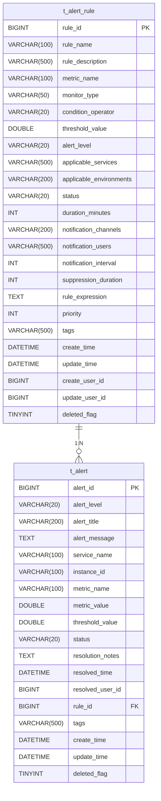
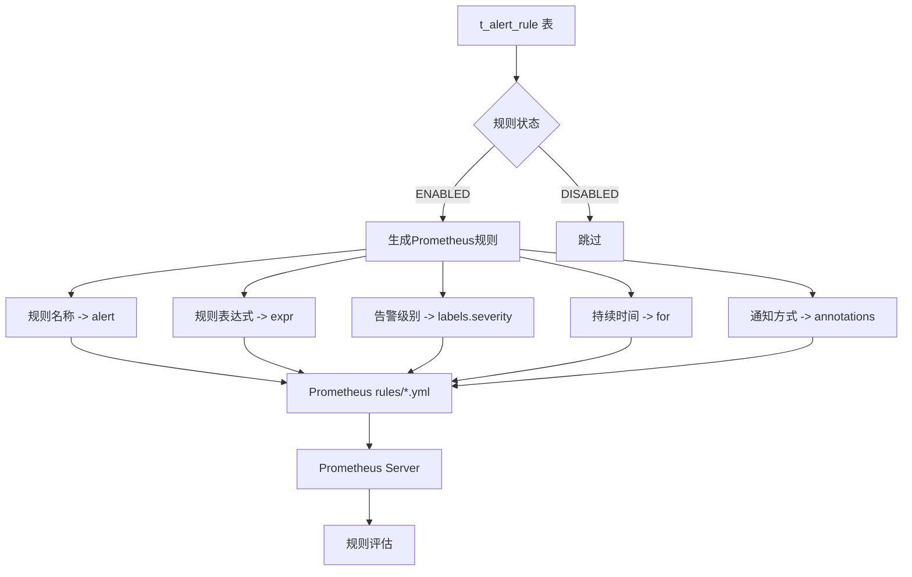
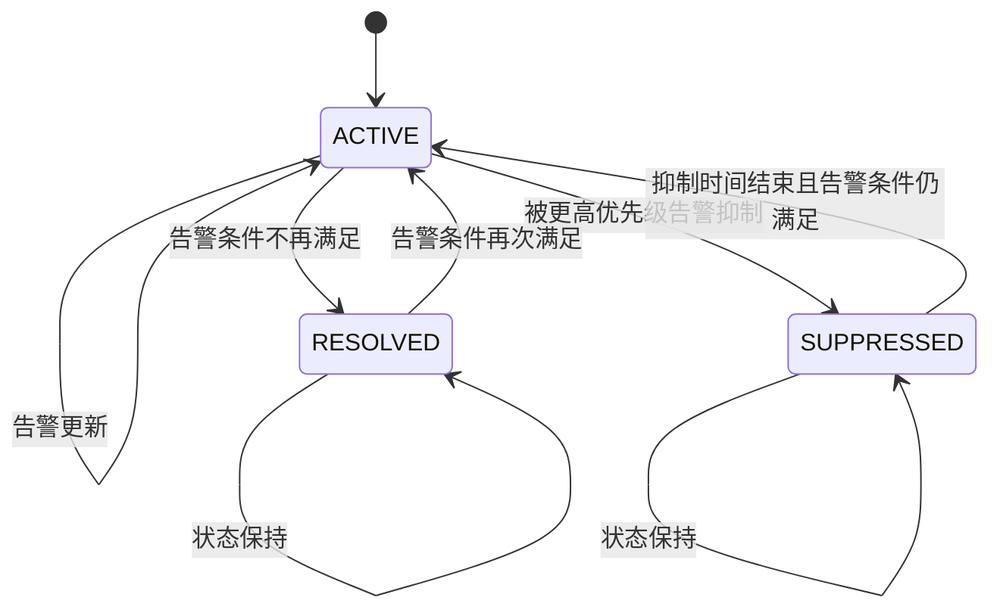
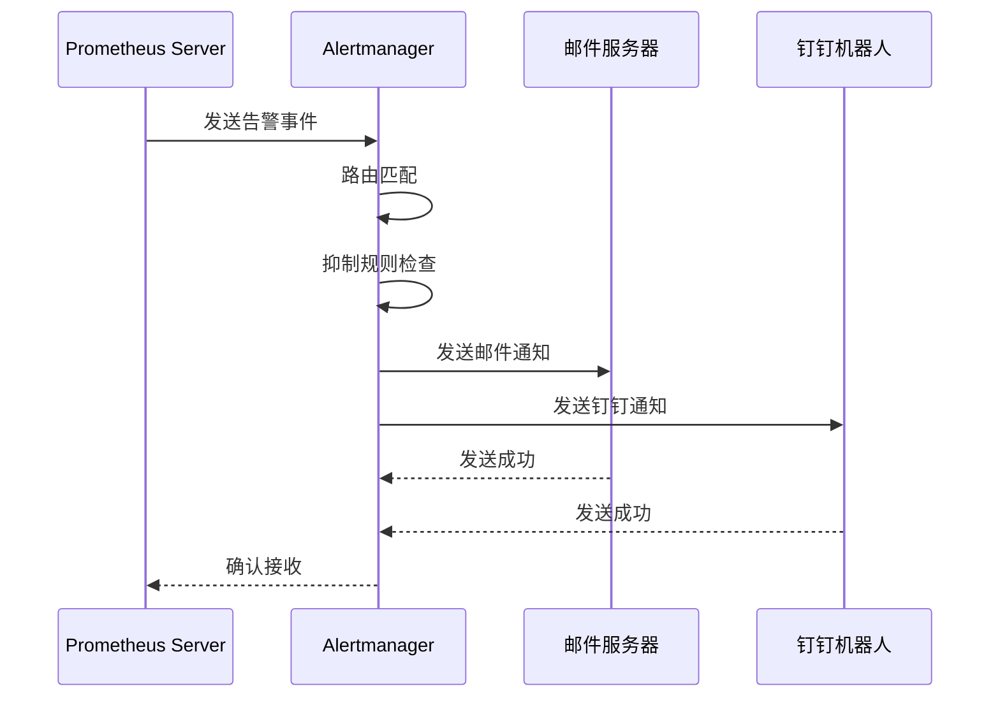
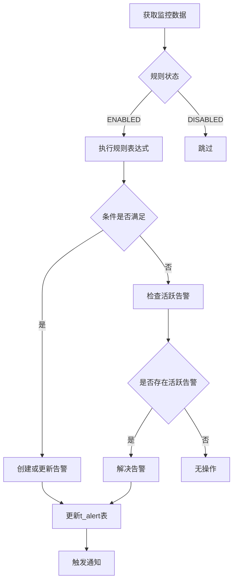
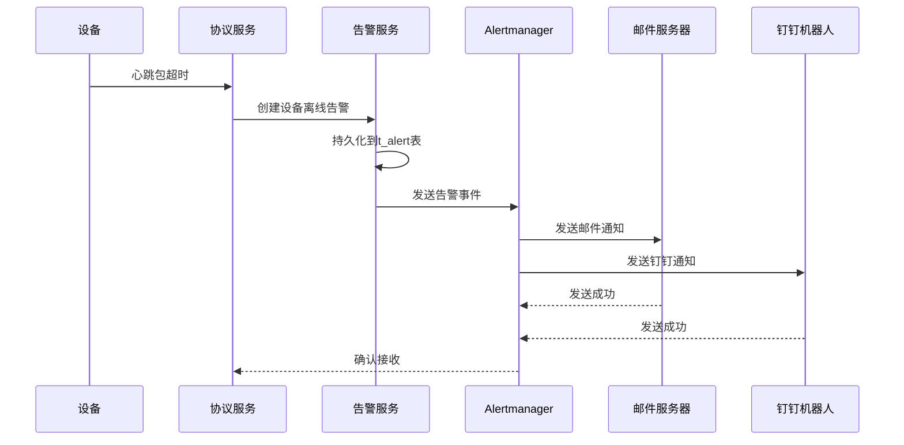
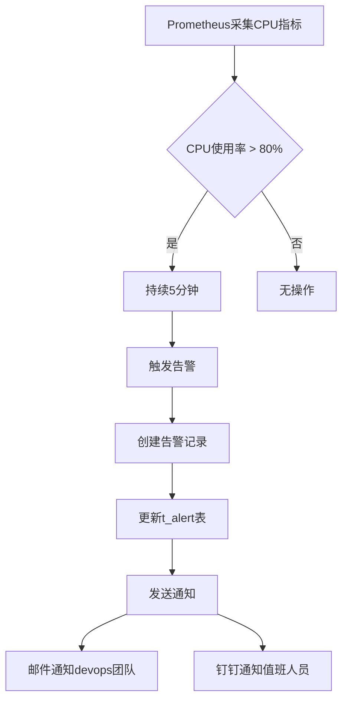
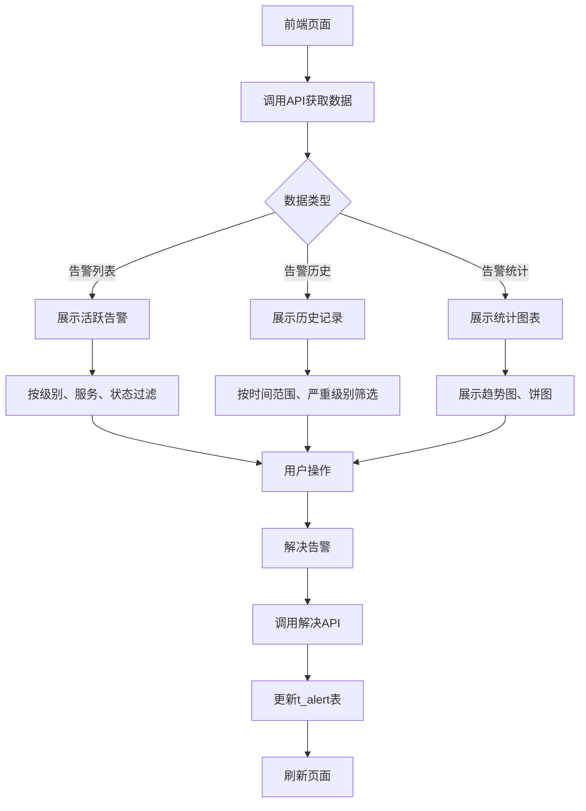

# 告警系统表设计

<cite>
**本文档引用文件**   
- [11-t_alert.sql](file://database-scripts/common-service/11-t_alert.sql)
- [12-t_alert_rule.sql](file://database-scripts/common-service/12-t_alert_rule.sql)
- [alertmanager.yml](file://deployment/monitoring/alertmanager/alertmanager.yml)
- [protocol_alerts.yml](file://deployment/monitoring/prometheus/rules/protocol_alerts.yml)
- [AlertEntity.java](file://microservices/microservices-common/src/main/java/net/lab1024/sa/common/monitor/domain/entity/AlertEntity.java)
- [AlertRuleEntity.java](file://microservices/microservices-common/src/main/java/net/lab1024/sa/common/monitor/domain/entity/AlertRuleEntity.java)
- [AlertController.java](file://microservices/ioedream-common-service/src/main/java/net/lab1024/sa/common/monitor/controller/AlertController.java)
- [AlertService.java](file://microservices/microservices-common/src/main/java/net/lab1024/sa/common/monitor/service/AlertService.java)
- [MonitorServiceImpl.java](file://microservices/microservices-common/src/main/java/net/lab1024/sa/common/monitor/service/impl/MonitorServiceImpl.java)
- [NotificationManager.java](file://microservices/microservices-common/src/main/java/net/lab1024/sa/common/monitor/manager/NotificationManager.java)
- [ALERT_RULE_IMPLEMENTATION_SUMMARY.md](file://microservices/microservices-common/docs/ALERT_RULE_IMPLEMENTATION_SUMMARY.md)
</cite>

## 目录
1. [引言](#引言)
2. [核心数据模型](#核心数据模型)
3. [告警规则配置](#告警规则配置)
4. [告警事件处理](#告警事件处理)
5. [规则引擎与状态机](#规则引擎与状态机)
6. [实际案例分析](#实际案例分析)
7. [前端展示与API](#前端展示与api)
8. [结论](#结论)

## 引言
本文档详细描述了IOE-DREAM系统中告警系统的数据模型设计，重点关注`t_alert`和`t_alert_rule`两张核心表。文档将深入分析告警规则的配置字段、与Prometheus告警规则的映射关系、告警事件的存储与处理机制，以及规则引擎的评估机制和告警状态机。通过实际案例，展示从规则配置到告警触发、通知、解决的完整流程。

## 核心数据模型

告警系统的核心数据模型由两张表构成：`t_alert_rule`（告警规则表）和`t_alert`（告警表）。这两张表共同构成了告警系统的数据基础，实现了从规则定义到事件记录的完整闭环。

**图表来源**
- [12-t_alert_rule.sql](file://database-scripts/common-service/12-t_alert_rule.sql)
- [11-t_alert.sql](file://database-scripts/common-service/11-t_alert.sql)

**本节来源**
- [12-t_alert_rule.sql](file://database-scripts/common-service/12-t_alert_rule.sql#L8-L38)
- [11-t_alert.sql](file://database-scripts/common-service/11-t_alert.sql#L8-L34)

## 告警规则配置

`t_alert_rule`表用于存储告警规则的配置信息，是告警系统的核心配置表。每条规则定义了在何种条件下触发告警，以及触发后如何处理。

### 配置字段详解

| 字段名 | 类型 | 必填 | 描述 | 示例值 |
|--------|------|------|------|--------|
| `rule_id` | BIGINT | 是 | 规则唯一标识 | 1001 |
| `rule_name` | VARCHAR(100) | 是 | 规则名称，需唯一 | CPU使用率过高告警 |
| `rule_description` | VARCHAR(500) | 否 | 规则详细描述 | 当CPU使用率持续5分钟超过80%时触发 |
| `metric_name` | VARCHAR(100) | 是 | 监控指标名称 | cpu_usage_percent |
| `monitor_type` | VARCHAR(50) | 否 | 监控类型，如系统、应用、网络等 | system |
| `condition_operator` | VARCHAR(20) | 是 | 告警条件操作符 | GT, GTE, LT, LTE, EQ, NEQ |
| `threshold_value` | DOUBLE | 是 | 告警阈值 | 80.0 |
| `alert_level` | VARCHAR(20) | 是 | 告警级别 | INFO, WARNING, ERROR, CRITICAL |
| `applicable_services` | VARCHAR(500) | 否 | 适用服务列表（逗号分隔） | ioedream-access-service,ioedream-attendance-service |
| `applicable_environments` | VARCHAR(200) | 否 | 适用环境列表（逗号分隔） | production,staging |
| `status` | VARCHAR(20) | 是 | 规则状态 | ENABLED, DISABLED |
| `duration_minutes` | INT | 否 | 持续时间（分钟），需持续满足条件的时间 | 5 |
| `notification_channels` | VARCHAR(200) | 否 | 通知方式（逗号分隔） | EMAIL,SMS,WEBHOOK |
| `notification_users` | VARCHAR(500) | 否 | 通知人员（逗号分隔） | devops@ioedream.com,oncall@ioedream.com |
| `notification_interval` | INT | 否 | 通知频率（分钟） | 60 |
| `suppression_duration` | INT | 否 | 抑制时间（分钟），告警解决后一段时间内不再触发 | 30 |
| `rule_expression` | TEXT | 否 | 规则表达式，可包含复杂逻辑 | cpu_usage_percent > 80 and memory_usage_percent > 70 |
| `priority` | INT | 是 | 规则优先级，数值越小优先级越高 | 10 |
| `tags` | VARCHAR(500) | 否 | 标签，用于分类和过滤 | system,performance |

### 与Prometheus告警规则的映射

告警规则配置与Prometheus告警规则存在直接的映射关系。系统通过定时任务或事件驱动的方式，将数据库中的告警规则同步到Prometheus的规则文件中。

**图表来源**
- [12-t_alert_rule.sql](file://database-scripts/common-service/12-t_alert_rule.sql)
- [protocol_alerts.yml](file://deployment/monitoring/prometheus/rules/protocol_alerts.yml)

**本节来源**
- [12-t_alert_rule.sql](file://database-scripts/common-service/12-t_alert_rule.sql#L8-L38)
- [ALERT_RULE_IMPLEMENTATION_SUMMARY.md](file://microservices/microservices-common/docs/ALERT_RULE_IMPLEMENTATION_SUMMARY.md#L1-L104)

## 告警事件处理

`t_alert`表用于存储触发的告警事件，记录了每次告警的详细信息，包括告警内容、状态、处理情况等。

### 告警状态机

告警系统采用状态机模式管理告警的生命周期，主要包含以下状态：

**图表来源**
- [11-t_alert.sql](file://database-scripts/common-service/11-t_alert.sql)
- [AlertEntity.java](file://microservices/microservices-common/src/main/java/net/lab1024/sa/common/monitor/domain/entity/AlertEntity.java)

**本节来源**
- [11-t_alert.sql](file://database-scripts/common-service/11-t_alert.sql#L8-L34)
- [AlertEntity.java](file://microservices/microservices-common/src/main/java/net/lab1024/sa/common/monitor/domain/entity/AlertEntity.java#L23-L54)

### 与Alertmanager的联动

告警事件通过Alertmanager进行统一处理和通知分发。当Prometheus检测到告警条件满足时，会将告警发送给Alertmanager，Alertmanager根据配置的路由规则和接收器进行处理。

**图表来源**
- [alertmanager.yml](file://deployment/monitoring/alertmanager/alertmanager.yml)
- [AlertController.java](file://microservices/ioedream-common-service/src/main/java/net/lab1024/sa/common/monitor/controller/AlertController.java)

**本节来源**
- [alertmanager.yml](file://deployment/monitoring/alertmanager/alertmanager.yml#L1-L127)
- [11-t_alert.sql](file://database-scripts/common-service/11-t_alert.sql#L8-L34)

## 规则引擎与状态机

告警系统的规则引擎负责评估监控数据是否满足告警条件，并管理告警的状态转换。

### 规则评估机制

规则引擎定期从监控系统获取指标数据，并与`t_alert_rule`表中的规则进行匹配评估。

**图表来源**
- [MonitorServiceImpl.java](file://microservices/microservices-common/src/main/java/net/lab1024/sa/common/monitor/service/impl/MonitorServiceImpl.java)
- [NotificationManager.java](file://microservices/microservices-common/src/main/java/net/lab1024/sa/common/monitor/manager/NotificationManager.java)

**本节来源**
- [MonitorServiceImpl.java](file://microservices/microservices-common/src/main/java/net/lab1024/sa/common/monitor/service/impl/MonitorServiceImpl.java)
- [NotificationManager.java](file://microservices/microservices-common/src/main/java/net/lab1024/sa/common/monitor/manager/NotificationManager.java)

## 实际案例分析

### 设备离线告警流程

当设备离线时，系统会触发设备离线告警，以下是完整的处理流程：

**图表来源**
- [AlertController.java](file://microservices/ioedream-common-service/src/main/java/net/lab1024/sa/common/monitor/controller/AlertController.java)
- [alertmanager.yml](file://deployment/monitoring/alertmanager/alertmanager.yml)

**本节来源**
- [AlertController.java](file://microservices/ioedream-common-service/src/main/java/net/lab1024/sa/common/monitor/controller/AlertController.java#L42-L104)
- [alertmanager.yml](file://deployment/monitoring/alertmanager/alertmanager.yml#L1-L127)

### 性能瓶颈告警流程

当系统出现性能瓶颈时，如CPU使用率过高，系统会触发性能瓶颈告警：

**图表来源**
- [protocol_alerts.yml](file://deployment/monitoring/prometheus/rules/protocol_alerts.yml)
- [12-t_alert_rule.sql](file://database-scripts/common-service/12-t_alert_rule.sql)

**本节来源**
- [protocol_alerts.yml](file://deployment/monitoring/prometheus/rules/protocol_alerts.yml)
- [12-t_alert_rule.sql](file://database-scripts/common-service/12-t_alert_rule.sql#L8-L38)

## 前端展示与API

前端通过API接口获取告警列表和历史记录，并在界面上进行展示。

### API接口设计

| 接口 | 方法 | 描述 | 请求参数 | 响应 |
|------|------|------|----------|------|
| /api/v1/alarm/record/create | POST | 创建报警记录 | AlertEntity | 告警ID |
| /api/v1/alert/history | GET | 获取告警历史 | pageNum, pageSize, severity, status | 分页结果 |
| /api/v1/alert/active/count | GET | 获取活跃告警统计 | 无 | 统计信息 |
| /api/v1/alert/statistics | GET | 获取告警统计 | days | 统计信息 |
| /api/v1/alert/trends | GET | 获取告警趋势 | days | 趋势数据 |

### 前端展示逻辑

**图表来源**
- [AlertService.java](file://microservices/microservices-common/src/main/java/net/lab1024/sa/common/monitor/service/AlertService.java)
- [AlertController.java](file://microservices/ioedream-common-service/src/main/java/net/lab1024/sa/common/monitor/controller/AlertController.java)

**本节来源**
- [AlertService.java](file://microservices/microservices-common/src/main/java/net/lab1024/sa/common/monitor/service/AlertService.java#L25-L144)
- [AlertController.java](file://microservices/ioedream-common-service/src/main/java/net/lab1024/sa/common/monitor/controller/AlertController.java#L42-L104)

## 结论
本文档详细阐述了IOE-DREAM系统中告警系统的数据模型设计，包括`t_alert`和`t_alert_rule`两张核心表的结构、字段含义以及它们之间的关系。文档还介绍了告警规则的配置、告警事件的处理流程、规则引擎的评估机制和告警状态机，并通过实际案例展示了设备离线告警和性能瓶颈告警的完整流程。最后，文档说明了前端如何通过API展示告警列表和历史记录。这些内容为系统的告警功能提供了全面的技术参考。