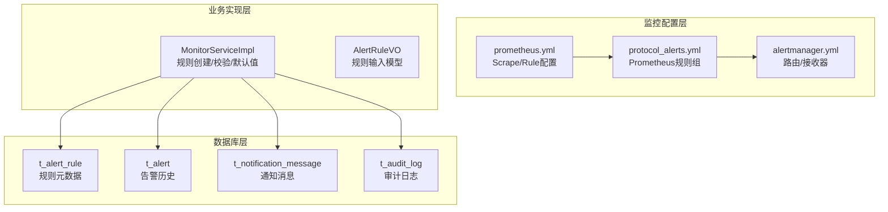
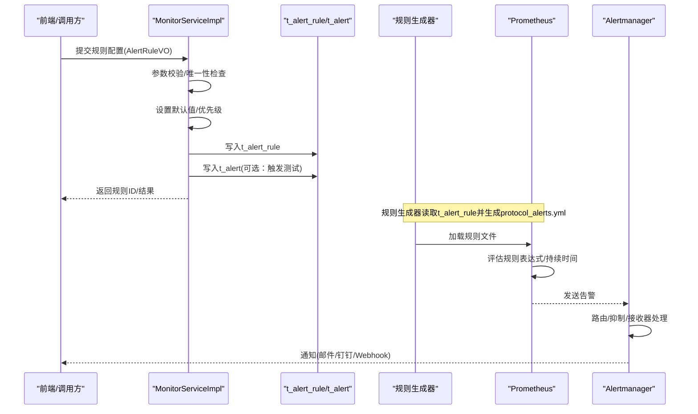
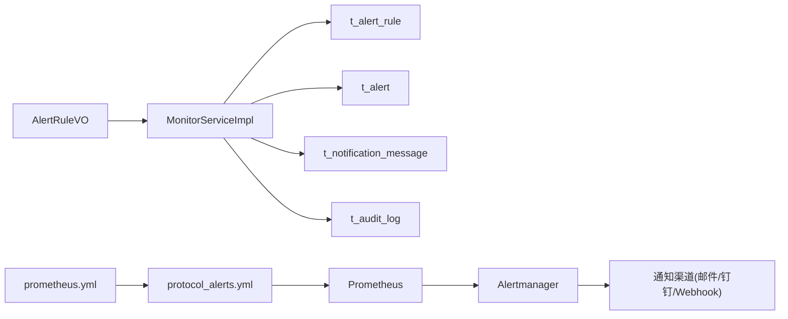

# 告警规则设计

<cite>
**本文引用的文件**
- [t_alert_rule.sql](file://database-scripts/common-service/12-t_alert_rule.sql)
- [protocol_alerts.yml](file://deployment/monitoring/prometheus/rules/protocol_alerts.yml)
- [prometheus.yml](file://deployment/monitoring/prometheus/prometheus.yml)
- [alertmanager.yml](file://deployment/monitoring/alertmanager/alertmanager.yml)
- [AlertRuleVO.java](file://microservices/microservices-common/src/main/java/net/lab1024/sa/common/monitor/domain/vo/AlertRuleVO.java)
- [MonitorServiceImpl.java](file://microservices/microservices-common/src/main/java/net/lab1024/sa/common/monitor/service/impl/MonitorServiceImpl.java)
- [t_alert.sql](file://database-scripts/common-service/11-t_alert.sql)
- [t_notification_message.sql](file://database-scripts/common-service/07-t_notification_message.sql)
- [t_audit_log.sql](file://database-scripts/common-service/10-t_audit_log.sql)
- [ALERT_RULE_IMPLEMENTATION_SUMMARY.md](file://microservices/microservices-common/docs/ALERT_RULE_IMPLEMENTATION_SUMMARY.md)
- [MERGE_TEST_CASES_CHECKLIST.md](file://MERGE_TEST_CASES_CHECKLIST.md)
</cite>

## 目录
1. [简介](#简介)
2. [项目结构](#项目结构)
3. [核心组件](#核心组件)
4. [架构总览](#架构总览)
5. [详细组件分析](#详细组件分析)
6. [依赖分析](#依赖分析)
7. [性能考虑](#性能考虑)
8. [故障排查指南](#故障排查指南)
9. [结论](#结论)
10. [附录](#附录)

## 简介
本文件聚焦于告警规则数据模型与Prometheus规则文件的映射关系，系统化阐述t_alert_rule表的结构设计、字段语义与配置方式，解释规则如何通过SQL配置动态生成Prometheus告警规则；同时给出版本管理与变更审计机制的设计思路，以及规则测试与验证流程的落地建议。本文还提供“CPU使用率超过80%持续5分钟触发告警”的配置示例，帮助快速上手。

## 项目结构
告警规则相关的核心文件分布如下：
- 数据库层：t_alert_rule表用于持久化规则元数据
- 监控配置层：Prometheus与Alertmanager配置文件，以及规则文件
- 业务实现层：监控服务实现类与规则VO定义
- 历史与通知：告警历史表、通知消息表、审计日志表

图表来源
- [t_alert_rule.sql](file://database-scripts/common-service/12-t_alert_rule.sql#L1-L40)
- [prometheus.yml](file://deployment/monitoring/prometheus/prometheus.yml#L1-L99)
- [protocol_alerts.yml](file://deployment/monitoring/prometheus/rules/protocol_alerts.yml#L1-L141)
- [alertmanager.yml](file://deployment/monitoring/alertmanager/alertmanager.yml#L1-L127)
- [MonitorServiceImpl.java](file://microservices/microservices-common/src/main/java/net/lab1024/sa/common/monitor/service/impl/MonitorServiceImpl.java#L100-L397)
- [AlertRuleVO.java](file://microservices/microservices-common/src/main/java/net/lab1024/sa/common/monitor/domain/vo/AlertRuleVO.java#L23-L91)

章节来源
- [t_alert_rule.sql](file://database-scripts/common-service/12-t_alert_rule.sql#L1-L40)
- [prometheus.yml](file://deployment/monitoring/prometheus/prometheus.yml#L1-L99)
- [protocol_alerts.yml](file://deployment/monitoring/prometheus/rules/protocol_alerts.yml#L1-L141)
- [alertmanager.yml](file://deployment/monitoring/alertmanager/alertmanager.yml#L1-L127)
- [MonitorServiceImpl.java](file://microservices/microservices-common/src/main/java/net/lab1024/sa/common/monitor/service/impl/MonitorServiceImpl.java#L100-L397)
- [AlertRuleVO.java](file://microservices/microservices-common/src/main/java/net/lab1024/sa/common/monitor/domain/vo/AlertRuleVO.java#L23-L91)

## 核心组件
- t_alert_rule表：存储告警规则的元数据，包括规则名称、条件表达式、评估周期、严重级别、通知模板、启用状态等。
- Prometheus规则文件：以YAML形式定义规则组、规则表达式、持续时间、标签与注解，供Prometheus评估。
- Alertmanager配置：定义路由、接收器、抑制规则，将告警按严重级别与服务进行分发。
- MonitorServiceImpl：负责规则创建的参数校验、默认值设置、持久化与异常处理。
- AlertRuleVO：规则输入模型，承载前端或调用方传入的规则配置。

章节来源
- [t_alert_rule.sql](file://database-scripts/common-service/12-t_alert_rule.sql#L1-L40)
- [protocol_alerts.yml](file://deployment/monitoring/prometheus/rules/protocol_alerts.yml#L1-L141)
- [alertmanager.yml](file://deployment/monitoring/alertmanager/alertmanager.yml#L1-L127)
- [MonitorServiceImpl.java](file://microservices/microservices-common/src/main/java/net/lab1024/sa/common/monitor/service/impl/MonitorServiceImpl.java#L100-L397)
- [AlertRuleVO.java](file://microservices/microservices-common/src/main/java/net/lab1024/sa/common/monitor/domain/vo/AlertRuleVO.java#L23-L91)

## 架构总览
下图展示了从规则元数据到Prometheus规则文件生成、再到告警分发的整体流程。

图表来源
- [MonitorServiceImpl.java](file://microservices/microservices-common/src/main/java/net/lab1024/sa/common/monitor/service/impl/MonitorServiceImpl.java#L100-L397)
- [t_alert_rule.sql](file://database-scripts/common-service/12-t_alert_rule.sql#L1-L40)
- [t_alert.sql](file://database-scripts/common-service/11-t_alert.sql#L1-L36)
- [prometheus.yml](file://deployment/monitoring/prometheus/prometheus.yml#L1-L99)
- [protocol_alerts.yml](file://deployment/monitoring/prometheus/rules/protocol_alerts.yml#L1-L141)
- [alertmanager.yml](file://deployment/monitoring/alertmanager/alertmanager.yml#L1-L127)

## 详细组件分析

### t_alert_rule表结构设计与字段语义
- 规则标识与基础信息
  - rule_id：主键，自增
  - rule_name：规则名称，必填，长度≤100
  - rule_description：规则描述
  - metric_name：监控指标名，必填，长度≤100
  - monitor_type：监控类型（如系统、应用、协议等）
  - tags：标签，便于过滤与聚合
- 条件与阈值
  - condition_operator：告警条件操作符，支持GT/GTE/LT/LTE/EQ/NEQ
  - threshold_value：告警阈值，非负数
  - rule_expression：复杂规则表达式（支持PromQL表达式）
- 评估与严重级别
  - duration_minutes：持续时间（分钟），用于Prometheus的for子句
  - alert_level：告警级别，支持INFO/WARNING/ERROR/CRITICAL
  - priority：规则优先级（数值越小优先级越高）
- 适用范围与状态
  - applicable_services：适用服务（逗号分隔）
  - applicable_environments：适用环境（逗号分隔）
  - status：规则状态，ENABLED/DISABLED，默认ENABLED
- 通知与抑制
  - notification_channels：通知方式（逗号分隔）
  - notification_users：通知人员（逗号分隔）
  - notification_interval：通知频率（分钟）
  - suppression_duration：抑制时间（分钟）
- 审计与版本
  - create_time/update_time：创建/更新时间
  - create_user_id/update_user_id：创建/更新人ID
  - deleted_flag：软删除标记

索引设计
- idx_metric_name、idx_status、idx_alert_level、idx_deleted_flag：提升查询与筛选效率

章节来源
- [t_alert_rule.sql](file://database-scripts/common-service/12-t_alert_rule.sql#L1-L40)

### Prometheus规则文件映射关系
- 规则组与评估周期
  - Prometheus通过rule_files加载规则文件，groups.name对应规则组名
  - Prometheus的interval决定评估周期，PromQL中的for子句对应规则的持续时间
- 规则表达式
  - Prometheus规则的expr字段映射t_alert_rule.rule_expression
  - 若规则表达式为空，可基于metric_name、condition_operator、threshold_value拼装表达式
- 严重级别与标签
  - Prometheus规则的labels.severity映射t_alert_rule.alert_level
  - labels.service/applicable_services映射适用服务
  - annotations.summary/description/runbook_url可映射规则描述与运维手册链接
- 通知模板
  - Prometheus规则的annotations用于生成通知内容
  - Alertmanager的接收器配置将告警按严重级别与服务分发至邮件、Webhook等渠道

章节来源
- [protocol_alerts.yml](file://deployment/monitoring/prometheus/rules/protocol_alerts.yml#L1-L141)
- [prometheus.yml](file://deployment/monitoring/prometheus/prometheus.yml#L1-L99)
- [alertmanager.yml](file://deployment/monitoring/alertmanager/alertmanager.yml#L1-L127)

### 规则创建与默认值策略
- 参数校验
  - 规则名称非空且长度≤100，唯一性检查
  - 监控指标非空且长度≤100
  - condition_operator仅允许GT/GTE/LT/LTE/EQ/NEQ（大小写不敏感）
  - threshold_value非负数
  - alert_level仅允许INFO/WARNING/ERROR/CRITICAL（大小写不敏感）
  - duration_minutes/notification_interval/suppression_duration非负数
- 默认值
  - status默认ENABLED
  - priority根据告警级别计算：CRITICAL=1、ERROR=10、WARNING=50、INFO=100
  - duration_minutes默认5分钟
  - notification_interval默认60分钟
  - suppression_duration默认30分钟
- 数据转换
  - condition_operator与alert_level统一转为大写
  - 字段映射完整，包含适用服务、环境、通知方式、标签等

章节来源
- [MonitorServiceImpl.java](file://microservices/microservices-common/src/main/java/net/lab1024/sa/common/monitor/service/impl/MonitorServiceImpl.java#L100-L397)
- [AlertRuleVO.java](file://microservices/microservices-common/src/main/java/net/lab1024/sa/common/monitor/domain/vo/AlertRuleVO.java#L23-L91)
- [ALERT_RULE_IMPLEMENTATION_SUMMARY.md](file://microservices/microservices-common/docs/ALERT_RULE_IMPLEMENTATION_SUMMARY.md#L1-L216)

### 版本管理与变更审计
- 版本管理机制（设计建议）
  - 在t_alert_rule中增加version字段，每次更新递增版本号
  - 新增t_alert_rule_version表，记录每次变更的差异快照（字段变更、表达式变更、状态变更等）
  - 提供规则回滚接口，按版本号恢复历史规则
- 变更审计（已有能力）
  - t_audit_log记录规则创建/修改/删除等关键操作，包含操作类型、资源类型、资源ID、请求参数、响应数据、结果状态、错误信息等
  - 建议在规则变更时记录变更前后对比，便于追溯与合规

章节来源
- [t_audit_log.sql](file://database-scripts/common-service/10-t_audit_log.sql#L1-L39)
- [t_alert_rule.sql](file://database-scripts/common-service/12-t_alert_rule.sql#L1-L40)

### 规则测试与验证流程
- 规则测试（前端/移动端已有测试入口）
  - 前端页面提供“测试规则”弹窗，调用后端接口触发规则测试
  - 测试成功/失败反馈，支持提示与日志记录
- 告警历史与验证
  - t_alert记录告警历史，包含告警级别、标题、消息、服务名、实例ID、指标名、指标值、阈值、状态、规则ID、标签、创建/更新时间等
  - 可通过查询最近告警历史验证规则是否生效
- 验证清单（参考测试用例）
  - 规则创建成功、唯一性校验通过
  - 规则启用后Prometheus评估周期内触发告警
  - 告警历史记录完整，状态更新及时
  - 通知渠道按严重级别与服务正确分发

章节来源
- [MERGE_TEST_CASES_CHECKLIST.md](file://MERGE_TEST_CASES_CHECKLIST.md#L383-L403)
- [t_alert.sql](file://database-scripts/common-service/11-t_alert.sql#L1-L36)

### 配置示例：CPU使用率超过80%持续5分钟触发告警
- 规则元数据（t_alert_rule）
  - rule_name：CPU使用率告警
  - metric_name：cpu.usage
  - condition_operator：GT
  - threshold_value：80.0
  - alert_level：WARNING
  - duration_minutes：5
  - status：ENABLED
  - applicable_services/applicable_environments：按需填写
  - tags：按需填写
- Prometheus规则（protocol_alerts.yml）
  - expr：基于metric_name、condition_operator、threshold_value拼装的PromQL表达式
  - for：duration_minutes对应的持续时间
  - labels.severity：映射alert_level
  - annotations.summary/description：规则描述与告警详情
- 通知与抑制
  - notification_channels/notification_users：按需配置
  - notification_interval/suppression_duration：按需配置

章节来源
- [t_alert_rule.sql](file://database-scripts/common-service/12-t_alert_rule.sql#L1-L40)
- [protocol_alerts.yml](file://deployment/monitoring/prometheus/rules/protocol_alerts.yml#L1-L141)
- [MonitorServiceImpl.java](file://microservices/microservices-common/src/main/java/net/lab1024/sa/common/monitor/service/impl/MonitorServiceImpl.java#L100-L397)

## 依赖分析
- 组件耦合
  - MonitorServiceImpl依赖AlertRuleVO与DAO层进行规则创建与持久化
  - Prometheus通过prometheus.yml加载规则文件，规则文件定义了评估表达式与持续时间
  - Alertmanager根据alertmanager.yml的路由与接收器对告警进行分发
- 外部依赖
  - Prometheus与Alertmanager的配置文件位于部署目录，规则文件挂载到Prometheus容器
  - 通知渠道（邮件、Webhook、钉钉）在Alertmanager中配置

图表来源
- [AlertRuleVO.java](file://microservices/microservices-common/src/main/java/net/lab1024/sa/common/monitor/domain/vo/AlertRuleVO.java#L23-L91)
- [MonitorServiceImpl.java](file://microservices/microservices-common/src/main/java/net/lab1024/sa/common/monitor/service/impl/MonitorServiceImpl.java#L100-L397)
- [t_alert_rule.sql](file://database-scripts/common-service/12-t_alert_rule.sql#L1-L40)
- [t_alert.sql](file://database-scripts/common-service/11-t_alert.sql#L1-L36)
- [t_notification_message.sql](file://database-scripts/common-service/07-t_notification_message.sql#L1-L42)
- [t_audit_log.sql](file://database-scripts/common-service/10-t_audit_log.sql#L1-L39)
- [prometheus.yml](file://deployment/monitoring/prometheus/prometheus.yml#L1-L99)
- [protocol_alerts.yml](file://deployment/monitoring/prometheus/rules/protocol_alerts.yml#L1-L141)
- [alertmanager.yml](file://deployment/monitoring/alertmanager/alertmanager.yml#L1-L127)

## 性能考虑
- 查询与索引
  - 对metric_name/status/alert_level/deleted_flag建立索引，提升规则筛选与状态查询性能
- 规则表达式
  - PromQL表达式应尽量使用标签过滤与聚合函数，避免全量扫描
- 评估周期
  - Prometheus的evaluation_interval与rule_files的group.interval需平衡准确性与开销
- 通知频率与抑制
  - notification_interval与suppression_duration合理设置，避免重复通知与告警风暴

## 故障排查指南
- 规则未生效
  - 检查Prometheus是否加载到protocol_alerts.yml（rule_files配置）
  - 检查规则表达式是否符合PromQL语法
  - 检查labels.severity与alert_level映射是否一致
- 告警未触发
  - 检查指标采集是否正常（job_name与metrics_path）
  - 检查duration_minutes是否过长导致未达到持续时间
- 通知未到达
  - 检查Alertmanager路由匹配（severity、service等标签）
  - 检查接收器配置（邮件/钉钉/Webhook）是否正确
- 历史与审计
  - 通过t_alert查询最近告警历史，确认规则ID与状态
  - 通过t_audit_log核对规则变更操作记录

章节来源
- [prometheus.yml](file://deployment/monitoring/prometheus/prometheus.yml#L1-L99)
- [protocol_alerts.yml](file://deployment/monitoring/prometheus/rules/protocol_alerts.yml#L1-L141)
- [alertmanager.yml](file://deployment/monitoring/alertmanager/alertmanager.yml#L1-L127)
- [t_alert.sql](file://database-scripts/common-service/11-t_alert.sql#L1-L36)
- [t_audit_log.sql](file://database-scripts/common-service/10-t_audit_log.sql#L1-L39)

## 结论
t_alert_rule表提供了告警规则的完整元数据支撑，结合Prometheus与Alertmanager配置，可实现从规则创建、表达式生成、评估触发到通知分发的闭环。通过参数校验、默认值策略与审计日志，系统具备良好的可用性与可追溯性。建议进一步完善版本管理与规则测试流程，以满足生产环境的稳定性与合规性要求。

## 附录
- 规则创建流程（简化）
  - 输入：AlertRuleVO
  - 校验：名称唯一性、指标与阈值、操作符与级别、时间参数
  - 默认值：状态、优先级、持续时间、通知频率、抑制时间
  - 持久化：写入t_alert_rule
  - 生成：规则生成器将元数据映射为Prometheus规则文件
  - 验证：通过告警历史与通知渠道验证

章节来源
- [MonitorServiceImpl.java](file://microservices/microservices-common/src/main/java/net/lab1024/sa/common/monitor/service/impl/MonitorServiceImpl.java#L100-L397)
- [ALERT_RULE_IMPLEMENTATION_SUMMARY.md](file://microservices/microservices-common/docs/ALERT_RULE_IMPLEMENTATION_SUMMARY.md#L1-L216)