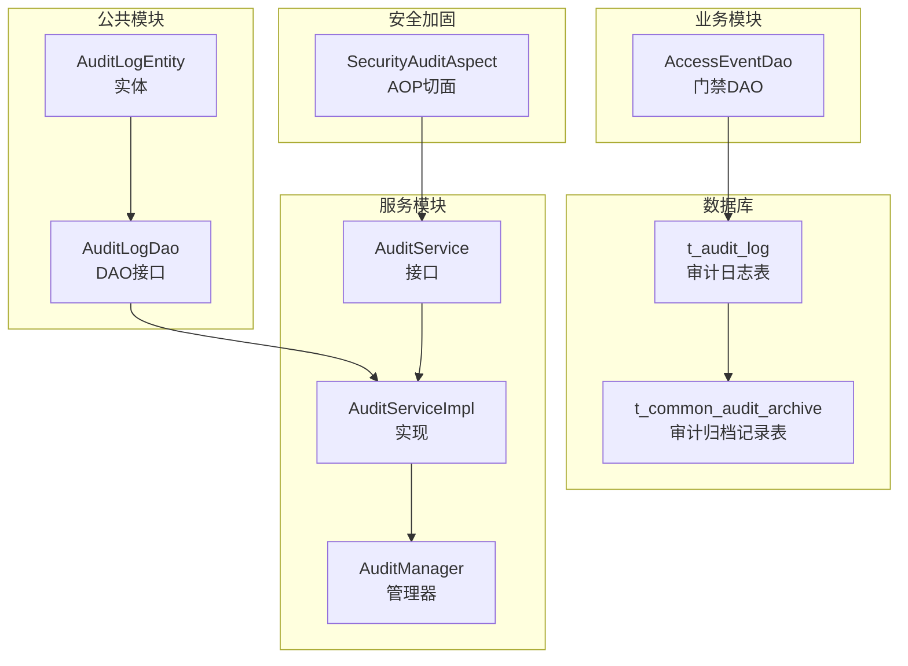
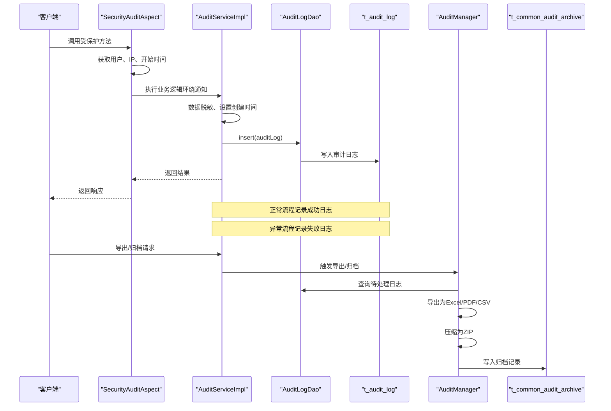
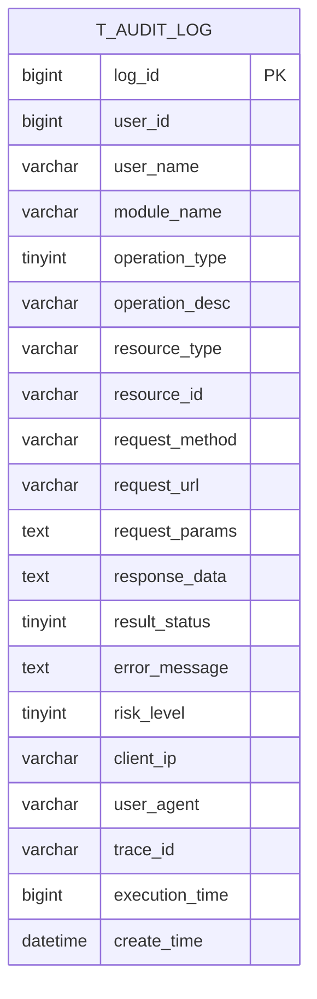
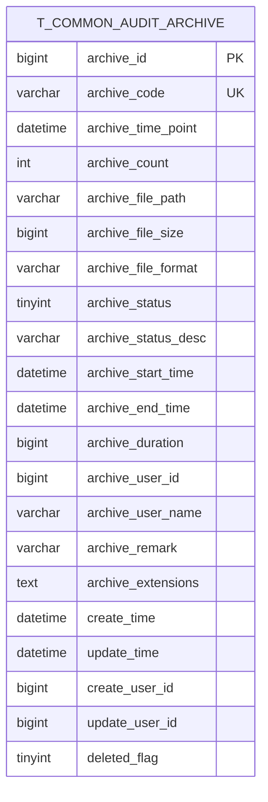
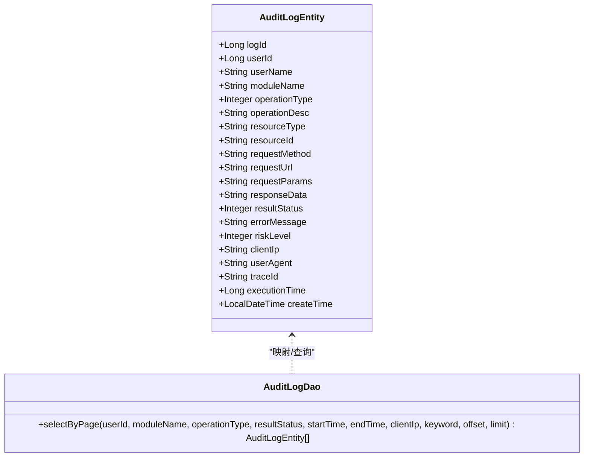
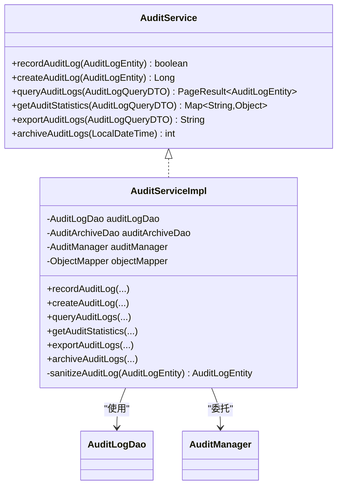
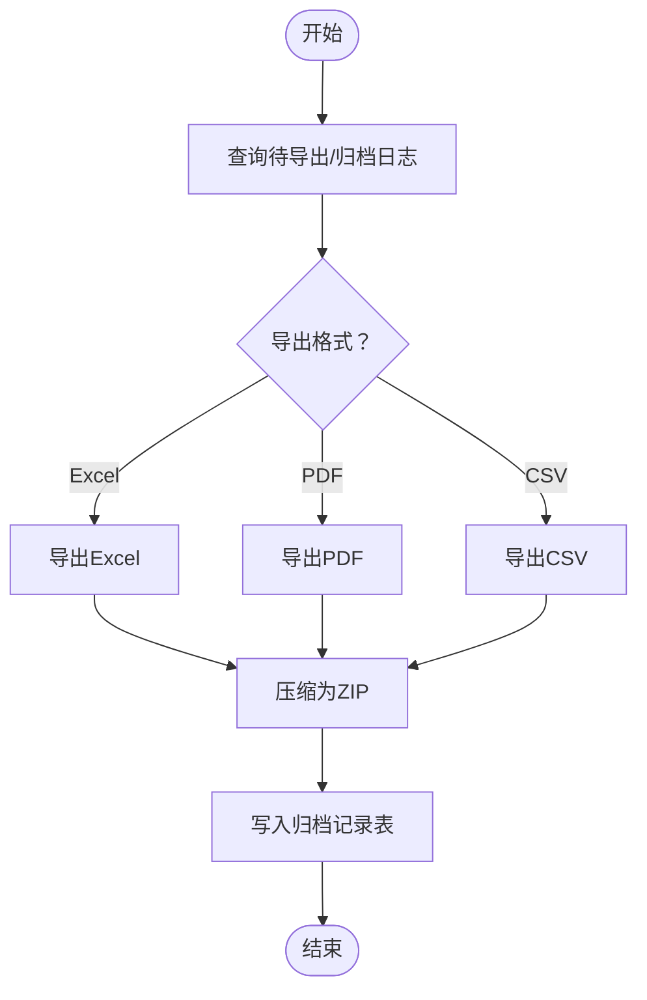
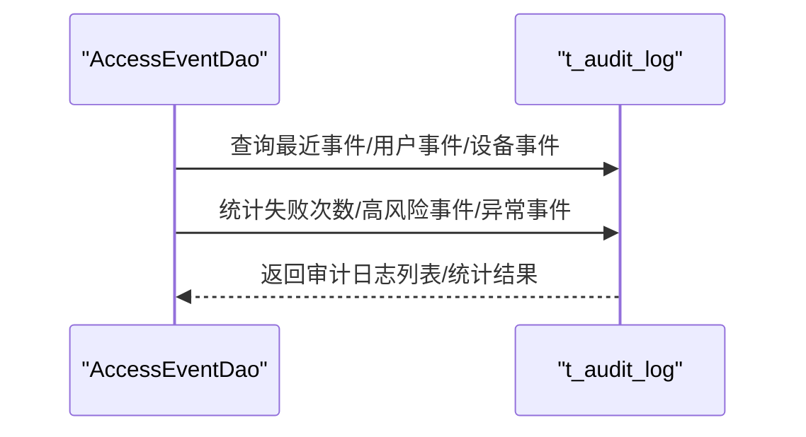
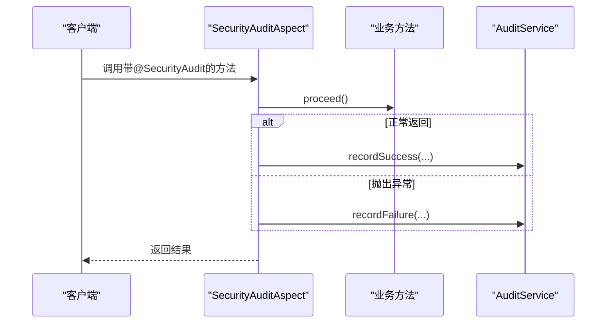
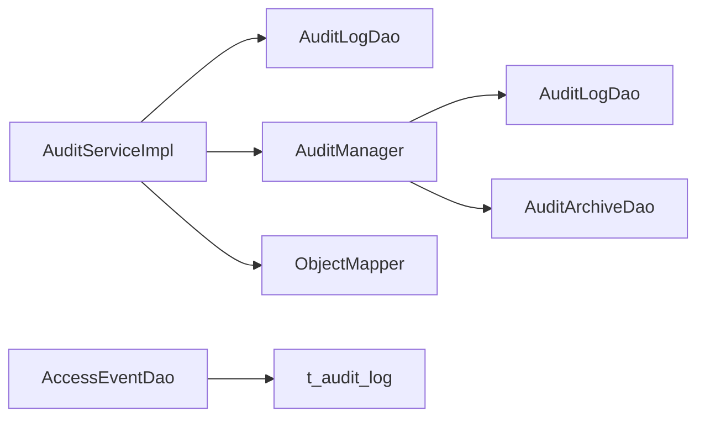

# 审计日志表设计

<cite>
**本文引用的文件**
- [t_audit_log.sql](file://database-scripts/common-service/10-t_audit_log.sql)
- [t_common_audit_archive.sql](file://database-scripts/common-service/11-t_common_audit_archive.sql)
- [AuditLogEntity.java](file://microservices/microservices-common/src/main/java/net/lab1024/sa/common/audit/entity/AuditLogEntity.java)
- [AuditLogDao.java](file://microservices/microservices-common/src/main/java/net/lab1024/sa/common/audit/dao/AuditLogDao.java)
- [AuditService.java](file://microservices/ioedream-common-service/src/main/java/net/lab1024/sa/common/audit/service/AuditService.java)
- [AuditServiceImpl.java](file://microservices/ioedream-common-service/src/main/java/net/lab1024/sa/common/audit/service/impl/AuditServiceImpl.java)
- [AuditManager.java](file://microservices/microservices-common/src/main/java/net/lab1024/sa/common/audit/manager/AuditManager.java)
- [AccessEventDao.java](file://microservices/ioedream-access-service/src/main/java/net/lab1024/sa/access/dao/AccessEventDao.java)
- [security_hardening_guide.md](file://security/security_hardening_guide.md)
- [performance_optimization.sql](file://database/performance_optimization.sql)
- [00-database-init.sql](file://database-scripts/common-service/00-database-init.sql)
</cite>

## 目录
1. [简介](#简介)
2. [项目结构](#项目结构)
3. [核心组件](#核心组件)
4. [架构总览](#架构总览)
5. [详细组件分析](#详细组件分析)
6. [依赖关系分析](#依赖关系分析)
7. [性能考量](#性能考量)
8. [故障排查指南](#故障排查指南)
9. [结论](#结论)
10. [附录](#附录)

## 简介
本文件围绕 t_audit_log 审计日志表展开，系统性阐述其字段定义、数据类型、主键与索引设计，并结合 common-service 中的 AuditService/AuditServiceImpl/AuditManager 与 microservices-common 的实体/DAO 层，说明该表在系统中的作用：操作审计、安全合规与故障追溯。同时，文档描述与 common-service 中 AuditLogService 的交互方式，以及如何通过 AOP 切面自动记录关键操作；给出用户登录、权限变更等典型场景的日志记录流程；最后提供数据归档策略与性能优化建议（含分区表思路与定期清理机制）。

## 项目结构
- 数据库层：t_audit_log 表与 t_common_audit_archive 归档记录表由 SQL 脚本初始化。
- 服务层：common-service 提供审计服务接口与实现，负责记录、查询、统计、导出与归档。
- 公共层：microservices-common 定义审计实体与 DAO 接口，遵循分层规范。
- 业务模块：以门禁模块为例，展示对 t_audit_log 的直接查询与统计使用。
- 安全加固：通过 AOP 切面自动记录关键操作，满足安全审计要求。
- 性能优化：提供索引优化与分页策略建议，支撑海量日志场景。

图表来源
- [t_audit_log.sql](file://database-scripts/common-service/10-t_audit_log.sql#L1-L39)
- [t_common_audit_archive.sql](file://database-scripts/common-service/11-t_common_audit_archive.sql#L1-L38)
- [AuditLogEntity.java](file://microservices/microservices-common/src/main/java/net/lab1024/sa/common/audit/entity/AuditLogEntity.java#L1-L142)
- [AuditLogDao.java](file://microservices/microservices-common/src/main/java/net/lab1024/sa/common/audit/dao/AuditLogDao.java#L1-L101)
- [AuditService.java](file://microservices/ioedream-common-service/src/main/java/net/lab1024/sa/common/audit/service/AuditService.java#L1-L76)
- [AuditServiceImpl.java](file://microservices/ioedream-common-service/src/main/java/net/lab1024/sa/common/audit/service/impl/AuditServiceImpl.java#L1-L458)
- [AuditManager.java](file://microservices/microservices-common/src/main/java/net/lab1024/sa/common/audit/manager/AuditManager.java#L1-L677)
- [AccessEventDao.java](file://microservices/ioedream-access-service/src/main/java/net/lab1024/sa/access/dao/AccessEventDao.java#L146-L271)
- [security_hardening_guide.md](file://security/security_hardening_guide.md#L208-L255)

章节来源
- [00-database-init.sql](file://database-scripts/common-service/00-database-init.sql#L1-L51)

## 核心组件
- t_audit_log 审计日志表：承载所有操作审计数据，包含用户、模块、操作类型、资源、请求/响应、结果状态、风险等级、客户端信息、追踪ID、执行时间与创建时间等字段。
- t_common_audit_archive 审计归档记录表：记录归档任务元数据（归档编号、时间点、数量、文件路径、状态、耗时等），用于合规追溯与归档治理。
- AuditLogEntity：与 t_audit_log 映射的实体，定义各字段及其含义。
- AuditLogDao：基于 MyBatis-Plus 的基础 Mapper，提供分页查询与关键词检索等能力。
- AuditService/AuditServiceImpl：对外暴露审计能力，包括记录、查询、统计、导出、归档与异步处理、数据脱敏等。
- AuditManager：复杂审计流程编排，负责导出（Excel/PDF/CSV）、归档（压缩、落库）、统计分析与风险识别。
- AccessEventDao：业务模块对 t_audit_log 的直接查询示例，体现审计日志在门禁场景中的使用。
- SecurityAuditAspect：AOP 切面，自动拦截带注解的方法，记录成功/失败审计日志，降低侵入式编码成本。

章节来源
- [t_audit_log.sql](file://database-scripts/common-service/10-t_audit_log.sql#L1-L39)
- [t_common_audit_archive.sql](file://database-scripts/common-service/11-t_common_audit_archive.sql#L1-L38)
- [AuditLogEntity.java](file://microservices/microservices-common/src/main/java/net/lab1024/sa/common/audit/entity/AuditLogEntity.java#L1-L142)
- [AuditLogDao.java](file://microservices/microservices-common/src/main/java/net/lab1024/sa/common/audit/dao/AuditLogDao.java#L1-L101)
- [AuditService.java](file://microservices/ioedream-common-service/src/main/java/net/lab1024/sa/common/audit/service/AuditService.java#L1-L76)
- [AuditServiceImpl.java](file://microservices/ioedream-common-service/src/main/java/net/lab1024/sa/common/audit/service/impl/AuditServiceImpl.java#L1-L458)
- [AuditManager.java](file://microservices/microservices-common/src/main/java/net/lab1024/sa/common/audit/manager/AuditManager.java#L1-L677)
- [AccessEventDao.java](file://microservices/ioedream-access-service/src/main/java/net/lab1024/sa/access/dao/AccessEventDao.java#L146-L271)
- [security_hardening_guide.md](file://security/security_hardening_guide.md#L208-L255)

## 架构总览
下图展示了审计日志从产生到落库、查询、导出与归档的整体流程，以及与业务模块的交互关系。

图表来源
- [AuditServiceImpl.java](file://microservices/ioedream-common-service/src/main/java/net/lab1024/sa/common/audit/service/impl/AuditServiceImpl.java#L75-L145)
- [AuditLogDao.java](file://microservices/microservices-common/src/main/java/net/lab1024/sa/common/audit/dao/AuditLogDao.java#L46-L99)
- [AuditManager.java](file://microservices/microservices-common/src/main/java/net/lab1024/sa/common/audit/manager/AuditManager.java#L122-L187)
- [t_audit_log.sql](file://database-scripts/common-service/10-t_audit_log.sql#L1-L39)
- [t_common_audit_archive.sql](file://database-scripts/common-service/11-t_common_audit_archive.sql#L1-L38)
- [security_hardening_guide.md](file://security/security_hardening_guide.md#L208-L255)

## 详细组件分析

### 数据模型：t_audit_log
- 主键与自增：log_id（BIGINT, AUTO_INCREMENT）
- 用户与身份：user_id（BIGINT）、user_name（VARCHAR）
- 模块与操作：module_name（VARCHAR）、operation_type（TINYINT，枚举：查询/新增/修改/删除/导出/导入/登录/登出）
- 资源与请求：resource_type（VARCHAR）、resource_id（VARCHAR）、request_method（VARCHAR）、request_url（VARCHAR）、request_params（TEXT）
- 响应与结果：response_data（TEXT）、result_status（TINYINT，枚举：成功/失败/异常）、error_message（TEXT）
- 风险与安全：risk_level（TINYINT，默认1，枚举：低/中/高）、client_ip（VARCHAR）、user_agent（VARCHAR）、trace_id（VARCHAR）
- 性能与时间：execution_time（BIGINT，毫秒）、create_time（DATETIME，默认CURRENT_TIMESTAMP）
- 索引：idx_user_id、idx_module_name、idx_operation_type、idx_result_status、idx_risk_level、idx_trace_id、idx_create_time

图表来源
- [t_audit_log.sql](file://database-scripts/common-service/10-t_audit_log.sql#L1-L39)

章节来源
- [t_audit_log.sql](file://database-scripts/common-service/10-t_audit_log.sql#L1-L39)

### 数据模型：t_common_audit_archive
- 主键与唯一：archive_id（BIGINT, AUTO_INCREMENT）、archive_code（UNIQUE）
- 时间点与数量：archive_time_point（DATETIME）、archive_count（INT）
- 文件与格式：archive_file_path（VARCHAR）、archive_file_size（BIGINT）、archive_file_format（VARCHAR）
- 状态与耗时：archive_status（TINYINT）、archive_status_desc（VARCHAR）、archive_start_time（DATETIME）、archive_end_time（DATETIME）、archive_duration（BIGINT）
- 操作人与扩展：archive_user_id、archive_user_name、archive_remark（VARCHAR）、archive_extensions（TEXT）
- 审计字段：create_time、update_time、create_user_id、update_user_id、deleted_flag

图表来源
- [t_common_audit_archive.sql](file://database-scripts/common-service/11-t_common_audit_archive.sql#L1-L38)

章节来源
- [t_common_audit_archive.sql](file://database-scripts/common-service/11-t_common_audit_archive.sql#L1-L38)

### 实体与DAO：AuditLogEntity 与 AuditLogDao
- AuditLogEntity：继承公共基类，映射 t_audit_log 字段，包含日志ID、用户、模块、操作类型、资源、请求/响应、结果、风险、客户端、追踪ID、执行时间等。
- AuditLogDao：基于 BaseMapper，提供 selectByPage 方法，支持按用户、模块、操作类型、结果状态、时间范围、客户端IP与关键词模糊检索，并按创建时间倒序分页。

图表来源
- [AuditLogEntity.java](file://microservices/microservices-common/src/main/java/net/lab1024/sa/common/audit/entity/AuditLogEntity.java#L1-L142)
- [AuditLogDao.java](file://microservices/microservices-common/src/main/java/net/lab1024/sa/common/audit/dao/AuditLogDao.java#L1-L101)

章节来源
- [AuditLogEntity.java](file://microservices/microservices-common/src/main/java/net/lab1024/sa/common/audit/entity/AuditLogEntity.java#L1-L142)
- [AuditLogDao.java](file://microservices/microservices-common/src/main/java/net/lab1024/sa/common/audit/dao/AuditLogDao.java#L1-L101)

### 服务层：AuditService 与 AuditServiceImpl
- AuditService：定义记录、创建、分页查询、统计、导出、归档等能力。
- AuditServiceImpl：
  - 记录/创建：设置创建时间、脱敏敏感信息、插入数据库并返回结果。
  - 查询：支持多条件组合查询与分页，构建 PageResult。
  - 统计：按操作类型、成功率、风险等级等维度统计。
  - 导出/归档：委托 AuditManager 执行。
  - 脱敏：对请求参数、响应数据、操作描述、客户端IP等进行脱敏处理，确保合规。

图表来源
- [AuditService.java](file://microservices/ioedream-common-service/src/main/java/net/lab1024/sa/common/audit/service/AuditService.java#L1-L76)
- [AuditServiceImpl.java](file://microservices/ioedream-common-service/src/main/java/net/lab1024/sa/common/audit/service/impl/AuditServiceImpl.java#L1-L458)

章节来源
- [AuditService.java](file://microservices/ioedream-common-service/src/main/java/net/lab1024/sa/common/audit/service/AuditService.java#L1-L76)
- [AuditServiceImpl.java](file://microservices/ioedream-common-service/src/main/java/net/lab1024/sa/common/audit/service/impl/AuditServiceImpl.java#L1-L458)

### 管理器：AuditManager
- 导出：支持 Excel、PDF、CSV 三种格式，自动创建导出目录，返回文件路径。
- 归档：查询历史日志，导出 CSV 并压缩为 ZIP，写入 t_common_audit_archive 记录归档元数据。
- 统计与分析：提供高风险与失败操作的分析入口。
- 依赖：AuditLogDao、AuditArchiveDao、ObjectMapper、导出/归档路径。

图表来源
- [AuditManager.java](file://microservices/microservices-common/src/main/java/net/lab1024/sa/common/audit/manager/AuditManager.java#L122-L187)
- [AuditManager.java](file://microservices/microservices-common/src/main/java/net/lab1024/sa/common/audit/manager/AuditManager.java#L483-L677)

章节来源
- [AuditManager.java](file://microservices/microservices-common/src/main/java/net/lab1024/sa/common/audit/manager/AuditManager.java#L1-L677)

### 业务模块使用示例：门禁模块
- AccessEventDao 直接查询 t_audit_log，用于统计验证方式、查询最近事件、用户/设备事件、失败次数、高风险事件与异常事件等。
- 体现了审计日志在业务侧的直接应用：统计分析、趋势观察与风险识别。

图表来源
- [AccessEventDao.java](file://microservices/ioedream-access-service/src/main/java/net/lab1024/sa/access/dao/AccessEventDao.java#L146-L271)

章节来源
- [AccessEventDao.java](file://microservices/ioedream-access-service/src/main/java/net/lab1024/sa/access/dao/AccessEventDao.java#L146-L271)

### AOP切面自动记录关键操作
- SecurityAuditAspect：基于 @Around 拦截带 @SecurityAudit 注解的方法，自动记录成功/失败审计日志，包含用户、IP、开始时间与错误信息，确保关键业务操作可审计、可追溯。

图表来源
- [security_hardening_guide.md](file://security/security_hardening_guide.md#L208-L255)
- [AuditServiceImpl.java](file://microservices/ioedream-common-service/src/main/java/net/lab1024/sa/common/audit/service/impl/AuditServiceImpl.java#L75-L145)

章节来源
- [security_hardening_guide.md](file://security/security_hardening_guide.md#L208-L255)
- [AuditServiceImpl.java](file://microservices/ioedream-common-service/src/main/java/net/lab1024/sa/common/audit/service/impl/AuditServiceImpl.java#L75-L145)

### 典型场景日志记录流程

#### 场景一：用户登录
- 触发点：登录接口被调用。
- AOP切面：拦截登录方法，记录登录操作（用户、IP、traceId、开始时间）。
- 业务处理：认证成功后，AuditServiceImpl 记录成功日志；失败则记录失败日志（含错误信息）。
- 结果：t_audit_log 中出现一条登录记录，便于后续审计与风控分析。

章节来源
- [security_hardening_guide.md](file://security/security_hardening_guide.md#L208-L255)
- [AuditServiceImpl.java](file://microservices/ioedream-common-service/src/main/java/net/lab1024/sa/common/audit/service/impl/AuditServiceImpl.java#L75-L145)

#### 场景二：权限变更
- 触发点：角色/权限分配/回收等操作。
- AOP切面：拦截权限变更方法，记录操作人、IP、traceId、开始时间。
- 业务处理：AuditServiceImpl 记录变更日志，包含资源类型/ID、操作描述、结果状态、风险等级。
- 结果：t_audit_log 中保留完整变更轨迹，满足合规审计与责任追溯。

章节来源
- [security_hardening_guide.md](file://security/security_hardening_guide.md#L208-L255)
- [AuditServiceImpl.java](file://microservices/ioedream-common-service/src/main/java/net/lab1024/sa/common/audit/service/impl/AuditServiceImpl.java#L75-L145)

## 依赖关系分析
- 组件耦合：
  - AuditServiceImpl 依赖 AuditLogDao、AuditArchiveDao、AuditManager、ObjectMapper。
  - AuditLogDao 依赖 MyBatis-Plus BaseMapper，提供分页查询能力。
  - AuditManager 依赖 AuditLogDao/AuditArchiveDao 与第三方导出库（EasyExcel、iText）。
  - AccessEventDao 直接依赖 t_audit_log，用于统计与查询。
- 外部依赖：
  - MySQL InnoDB 引擎、utf8mb4 字符集。
  - Spring/Spring Boot、MyBatis-Plus、Lombok、Jackson、AOP、日志框架。
- 潜在风险：
  - 大量写入可能造成热点写压力，需配合索引优化与异步处理。
  - 导出/归档涉及磁盘IO与压缩，需合理规划存储与并发策略。

图表来源
- [AuditServiceImpl.java](file://microservices/ioedream-common-service/src/main/java/net/lab1024/sa/common/audit/service/impl/AuditServiceImpl.java#L1-L458)
- [AuditManager.java](file://microservices/microservices-common/src/main/java/net/lab1024/sa/common/audit/manager/AuditManager.java#L1-L677)
- [AccessEventDao.java](file://microservices/ioedream-access-service/src/main/java/net/lab1024/sa/access/dao/AccessEventDao.java#L146-L271)

章节来源
- [AuditServiceImpl.java](file://microservices/ioedream-common-service/src/main/java/net/lab1024/sa/common/audit/service/impl/AuditServiceImpl.java#L1-L458)
- [AuditManager.java](file://microservices/microservices-common/src/main/java/net/lab1024/sa/common/audit/manager/AuditManager.java#L1-L677)
- [AccessEventDao.java](file://microservices/ioedream-access-service/src/main/java/net/lab1024/sa/access/dao/AccessEventDao.java#L146-L271)

## 性能考量
- 索引设计与使用：
  - t_audit_log 已具备多维索引（用户、模块、操作类型、结果状态、风险等级、trace_id、create_time），有利于常见查询场景。
  - 参考性能优化脚本中的分页与统计优化经验，建议：
    - 使用“游标分页”替代“LIMIT OFFSET”，减少深度分页的扫描开销。
    - 为高频查询条件建立复合索引，如 (module_name, create_time)、(user_id, create_time)。
    - 定期 ANALYZE TABLE 更新统计信息，辅助查询优化器选择最优执行计划。
- 分区表设计（建议）：
  - 按 create_time 进行分区（如按月/季度），将历史数据与热数据分离，提升查询与维护效率。
  - 分区裁剪可显著降低扫描范围，尤其在统计与导出场景。
- 导出与归档：
  - 导出采用分批拉取与流式写入，避免一次性加载过多内存。
  - 归档采用压缩存储，减少磁盘占用与IO压力。
- 异步与脱敏：
  - 审计记录采用异步写入，避免阻塞主业务。
  - 对敏感字段进行脱敏，降低数据泄露风险与合规成本。

章节来源
- [t_audit_log.sql](file://database-scripts/common-service/10-t_audit_log.sql#L24-L38)
- [performance_optimization.sql](file://database/performance_optimization.sql#L183-L215)
- [AuditServiceImpl.java](file://microservices/ioedream-common-service/src/main/java/net/lab1024/sa/common/audit/service/impl/AuditServiceImpl.java#L75-L145)
- [AuditManager.java](file://microservices/microservices-common/src/main/java/net/lab1024/sa/common/audit/manager/AuditManager.java#L122-L187)

## 故障排查指南
- 记录失败但不影响主流程：
  - AuditServiceImpl 在记录异常时会捕获并记录错误日志，返回 false，确保主业务不受影响。
- 导出/归档异常：
  - AuditManager 对导出与归档过程进行异常捕获与日志记录，必要时抛出运行时异常以便上层感知。
- 数据脱敏异常：
  - 脱敏失败不会中断日志记录，返回原始数据并记录警告日志。
- 业务侧查询异常：
  - AccessEventDao 直接使用原生 SQL 查询 t_audit_log，若出现异常，检查 SQL 语法与表结构一致性。

章节来源
- [AuditServiceImpl.java](file://microservices/ioedream-common-service/src/main/java/net/lab1024/sa/common/audit/service/impl/AuditServiceImpl.java#L75-L145)
- [AuditManager.java](file://microservices/microservices-common/src/main/java/net/lab1024/sa/common/audit/manager/AuditManager.java#L122-L187)
- [AccessEventDao.java](file://microservices/ioedream-access-service/src/main/java/net/lab1024/sa/access/dao/AccessEventDao.java#L146-L271)

## 结论
t_audit_log 审计日志表通过完善的字段设计与索引策略，为系统提供了全面的操作审计、安全合规与故障追溯能力。配合 common-service 的审计服务与管理器，实现了从记录、查询、统计、导出到归档的闭环；通过 AOP 切面自动记录关键操作，降低了侵入式编码成本。结合分区表、游标分页与异步处理等优化手段，可在海量日志场景下保持良好性能与可维护性。

## 附录
- 数据归档策略（建议）：
  - 定期（如每日/每周）触发归档任务，将指定时间点之前的日志导出为 CSV 并压缩为 ZIP，记录到 t_common_audit_archive。
  - 归档完成后，根据业务策略决定是否保留热数据或清理历史数据。
- 定期清理机制（建议）：
  - 按保留期限（如登录/登出180天、权限变更永久、数据修改90天、敏感数据访问180天）定期清理过期日志。
  - 清理前先导出并归档，确保合规可追溯。
- 初始化与执行顺序：
  - 数据库初始化脚本中包含 t_audit_log 的创建顺序，确保按序执行以避免依赖问题。

章节来源
- [t_common_audit_archive.sql](file://database-scripts/common-service/11-t_common_audit_archive.sql#L1-L38)
- [PRODUCTION_SECURITY_CHECKLIST.md](file://PRODUCTION_SECURITY_CHECKLIST.md#L324-L357)
- [00-database-init.sql](file://database-scripts/common-service/00-database-init.sql#L25-L43)