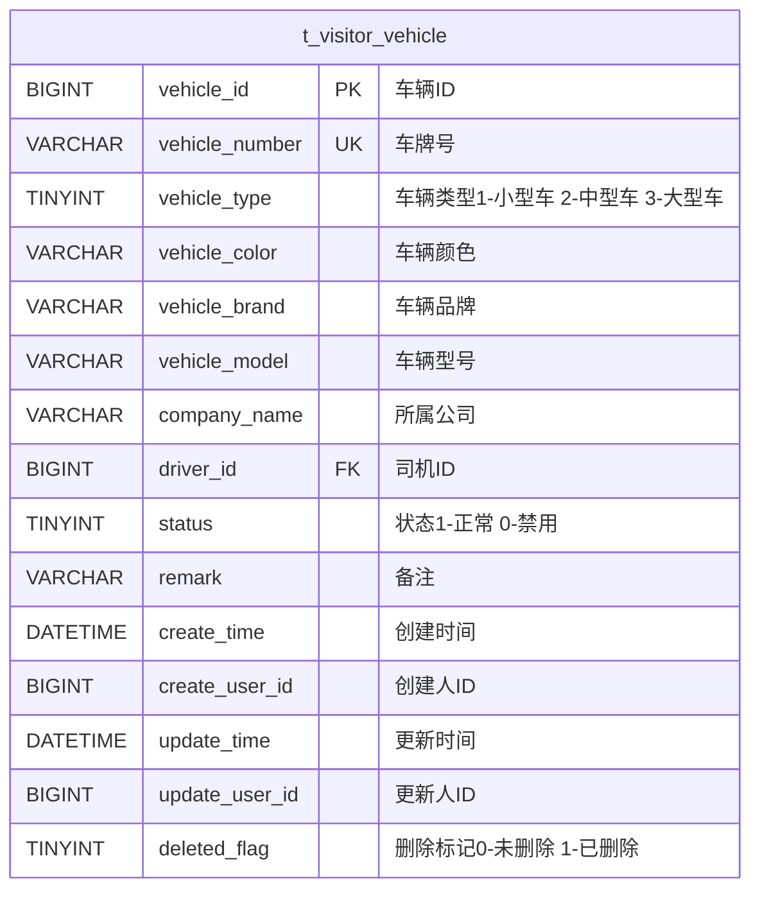
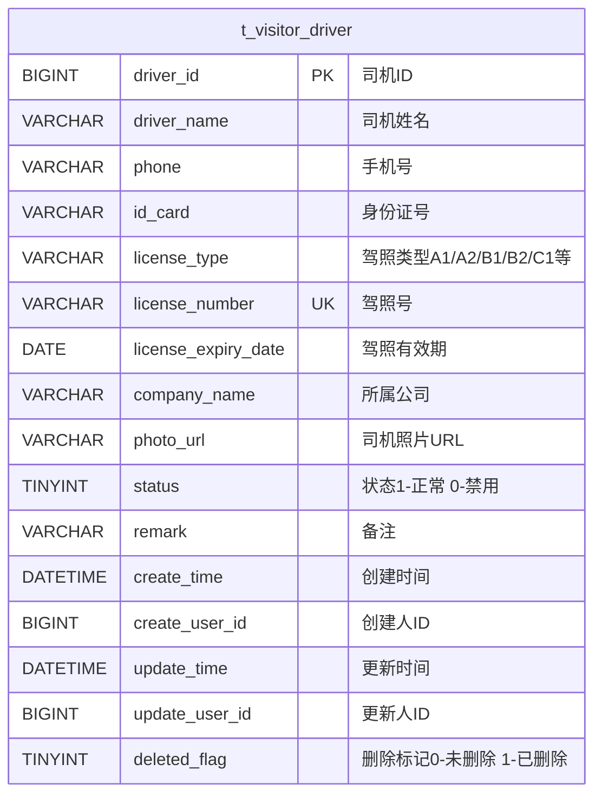
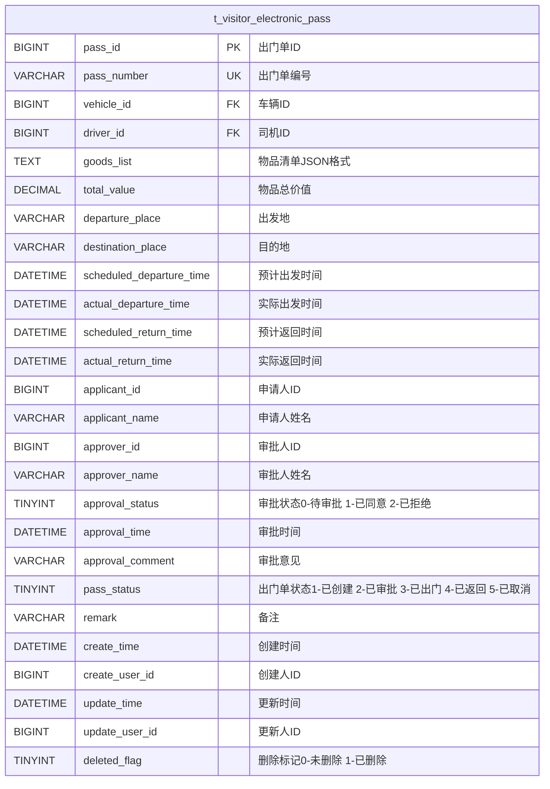
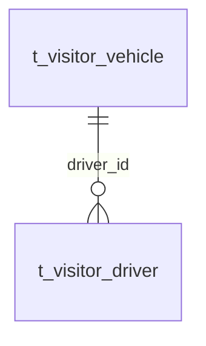
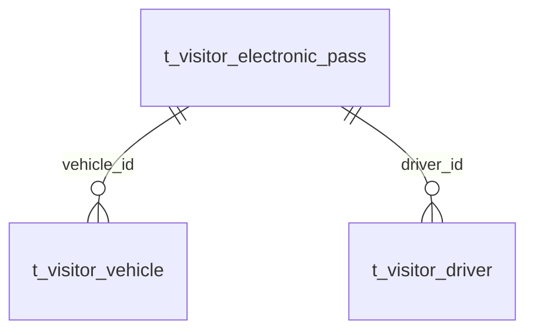
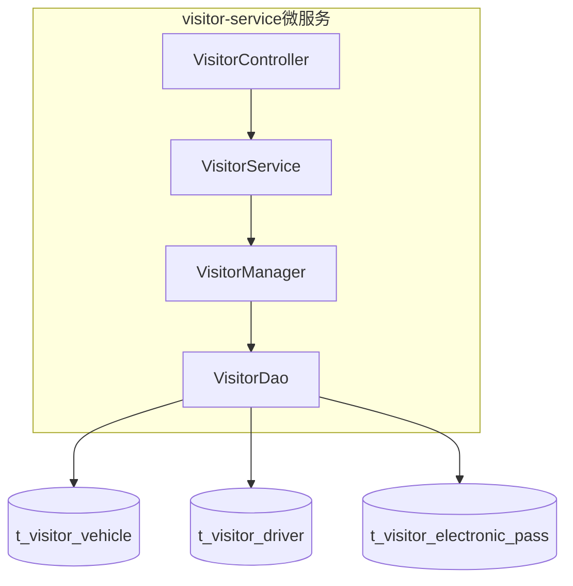
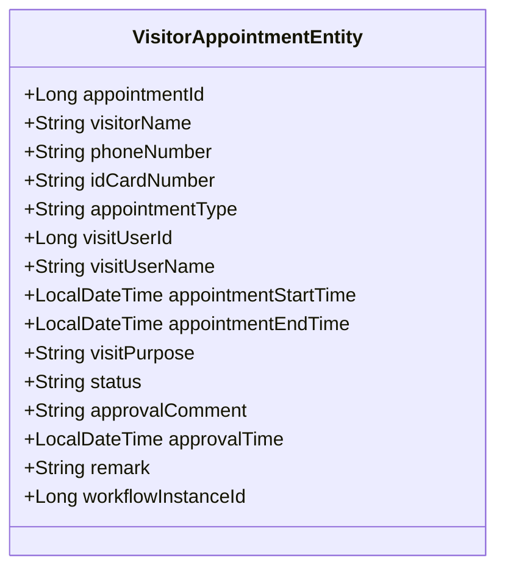
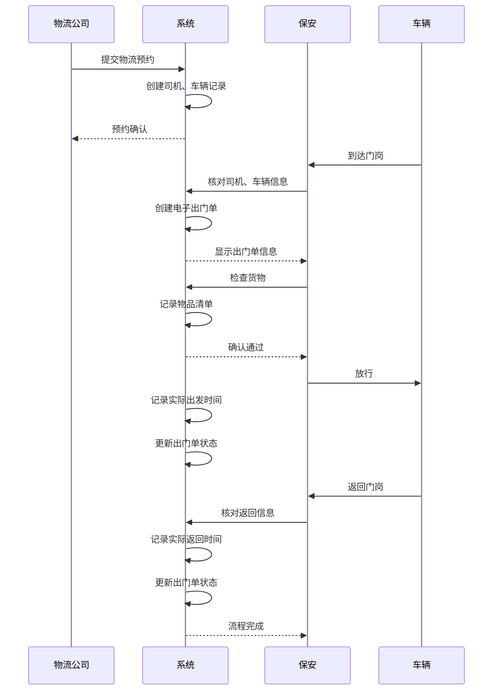

# 访客物流表设计

<cite>
**本文档引用文件**   
- [logistics-tables.sql](file://database-scripts/visitor/logistics-tables.sql)
- [database_dictionary.md](file://documentation/03-业务模块/访客/database_dictionary.md)
- [visitor-module-architecture.md](file://documentation/03-业务模块/访客/visitor-module-architecture.md)
- [module_diagrams.md](file://documentation/03-业务模块/访客/module_diagrams.md)
- [VisitorAppointmentEntity.java](file://microservices/ioedream-visitor-service/src/main/java/net/lab1024/sa/visitor/domain/entity/VisitorAppointmentEntity.java)
</cite>

## 目录
1. [引言](#引言)
2. [核心数据表结构](#核心数据表结构)
3. [表间关系分析](#表间关系分析)
4. [业务流程支撑机制](#业务流程支撑机制)
5. [微服务集成与数据一致性](#微服务集成与数据一致性)
6. [实际案例流程解析](#实际案例流程解析)
7. [结论](#结论)

## 引言

访客物流管理模块是智慧园区访客系统的重要组成部分，负责管理访客车辆、司机及电子出门单等物流相关信息。该模块通过结构化的数据库设计，支持从访客预约、身份验证、物品登记到通行权限发放的完整业务流程。本文档深入分析`logistics-tables.sql`中定义的表结构及其业务含义，详细描述各表之间的关系，解释这些表如何支撑访客从预约到通行的完整业务流程，并说明与`visitor-service`微服务的集成方式。

**Section sources**
- [logistics-tables.sql](file://database-scripts/visitor/logistics-tables.sql)
- [database_dictionary.md](file://documentation/03-业务模块/访客/database_dictionary.md)

## 核心数据表结构

访客物流管理模块包含三张核心数据表：访客车辆表、访客司机表和电子出门单表。这些表共同构成了物流管理的基础数据结构。

### 访客车辆表 (t_visitor_vehicle)

该表存储访客车辆的基本信息，包括车牌号、车辆类型、颜色、品牌和型号等。每辆车通过`vehicle_id`作为主键进行唯一标识，并与司机通过`driver_id`建立关联。

**Diagram sources**
- [logistics-tables.sql](file://database-scripts/visitor/logistics-tables.sql#L6-L28)

### 访客司机表 (t_visitor_driver)

该表存储访客司机的详细信息，包括姓名、手机号、身份证号、驾照类型和有效期等。司机通过`driver_id`作为主键进行唯一标识，并通过`license_number`建立唯一索引，确保驾照号的唯一性。

**Diagram sources**
- [logistics-tables.sql](file://database-scripts/visitor/logistics-tables.sql#L31-L54)

### 电子出门单表 (t_visitor_electronic_pass)

该表是物流管理的核心，记录了车辆出门的详细信息，包括物品清单、总价值、出发地、目的地、预计和实际的出发与返回时间等。通过`pass_id`作为主键，并与车辆和司机建立关联。

**Diagram sources**
- [logistics-tables.sql](file://database-scripts/visitor/logistics-tables.sql#L57-L93)

## 表间关系分析

三张核心表之间通过外键建立了紧密的关联关系，形成了完整的物流管理数据链。

### 访客车辆与司机的关联

访客车辆表通过`driver_id`字段与访客司机表建立外键关联，表示一辆车由一名司机驾驶。这种一对一的关系确保了车辆与司机之间的绑定关系，便于管理和追踪。

**Diagram sources**
- [logistics-tables.sql](file://database-scripts/visitor/logistics-tables.sql#L14)
- [logistics-tables.sql](file://database-scripts/visitor/logistics-tables.sql#L32)

### 电子出门单与车辆、司机的关联

电子出门单表通过`vehicle_id`和`driver_id`字段分别与访客车辆表和访客司机表建立外键关联。这种双重关联确保了出门单与具体的车辆和司机绑定，实现了物流信息的完整记录。

**Diagram sources**
- [logistics-tables.sql](file://database-scripts/visitor/logistics-tables.sql#L60-L61)

### 审批与状态流转机制

电子出门单表中的`approval_status`和`pass_status`字段构成了审批与状态流转的核心机制。`approval_status`表示审批状态（待审批、已同意、已拒绝），而`pass_status`表示出门单的生命周期状态（已创建、已审批、已出门、已返回、已取消）。这种双状态设计实现了审批流程与业务流程的分离与协同。

**Section sources**
- [logistics-tables.sql](file://database-scripts/visitor/logistics-tables.sql#L74-L77)

## 业务流程支撑机制

访客物流管理模块的表结构设计紧密支撑了从预约到通行的完整业务流程。

### 身份验证机制

系统通过访客司机表中的`id_card`和`license_number`字段进行身份验证。在司机登记时，系统会核对身份证号和驾照号，确保信息的真实性和唯一性。同时，`photo_url`字段存储的司机照片可用于人脸识别比对，增强身份验证的安全性。

### 物品登记机制

电子出门单表中的`goods_list`字段以JSON格式存储物品清单，支持灵活的物品信息记录。`total_value`字段记录物品总价值，便于进行价值评估和风险管理。`departure_place`和`destination_place`字段记录了物品的出发地和目的地，实现了物流路径的追踪。

### 通行权限发放机制

通行权限的发放通过电子出门单的状态流转实现。当出门单的`approval_status`变为"已同意"且`pass_status`变为"已审批"时，系统会自动发放通行权限。保安人员在门岗处核对出门单信息后，可允许车辆通行，并在`actual_departure_time`字段记录实际出发时间，完成权限的闭环管理。

**Section sources**
- [logistics-tables.sql](file://database-scripts/visitor/logistics-tables.sql#L62-L69)
- [logistics-tables.sql](file://database-scripts/visitor/logistics-tables.sql#L74-L77)

## 微服务集成与数据一致性

访客物流管理模块与`visitor-service`微服务紧密集成，确保了数据的一致性和事务的完整性。

### 微服务架构集成

`visitor-service`微服务作为访客管理的核心服务，通过四层架构（Controller-Service-Manager-DAO）与数据库进行交互。物流相关的业务逻辑在Service层实现，通过事务管理确保数据操作的原子性。DAO层直接操作数据库表，实现了数据访问的封装。

**Diagram sources**
- [visitor-module-architecture.md](file://documentation/03-业务模块/访客/visitor-module-architecture.md#L86-L219)
- [logistics-tables.sql](file://database-scripts/visitor/logistics-tables.sql)

### 数据一致性保障

系统通过多种机制保障数据一致性：
1. **事务管理**：在Service层使用`@Transactional`注解，确保跨表操作的原子性。
2. **外键约束**：数据库层面的外键约束防止了孤儿记录的产生。
3. **唯一索引**：`uk_vehicle_number`和`uk_license_number`等唯一索引确保了关键字段的唯一性。
4. **软删除机制**：`deleted_flag`字段实现了软删除，避免了数据的物理删除，便于数据恢复和审计。

### 实体类映射

`visitor-service`中的实体类与数据库表结构一一对应。例如，`VisitorAppointmentEntity`类映射到电子出门单表，通过`@TableName("visitor_appointment")`注解指定表名，并使用`@TableId`和`@TableField`注解进行字段映射。

**Diagram sources**
- [VisitorAppointmentEntity.java](file://microservices/ioedream-visitor-service/src/main/java/net/lab1024/sa/visitor/domain/entity/VisitorAppointmentEntity.java)
- [logistics-tables.sql](file://database-scripts/visitor/logistics-tables.sql)

## 实际案例流程解析

以下是一个访客携带物品进入园区的实际案例流程解析：

1. **预约阶段**：物流公司通过系统提交物流预约，填写司机、车辆和货物信息。系统在`t_visitor_driver`和`t_visitor_vehicle`表中创建记录，并生成预约单。

2. **登记阶段**：司机到达园区门岗，出示身份证和驾照。保安人员在系统中核对信息，系统自动填充司机和车辆信息，并在`t_visitor_electronic_pass`表中创建电子出门单，状态为"已创建"。

3. **验证阶段**：保安人员检查车辆和货物，核对物品清单。系统记录`goods_list`和`total_value`，并更新`pass_status`为"已审批"。

4. **通行阶段**：系统发放通行权限，车辆进入园区。系统记录`actual_departure_time`，并更新`pass_status`为"已出门"。

5. **返回阶段**：车辆完成作业后返回，保安人员再次核对信息。系统记录`actual_return_time`，并更新`pass_status`为"已返回"，完成整个流程。

**Diagram sources**
- [logistics-tables.sql](file://database-scripts/visitor/logistics-tables.sql)
- [visitor-module-architecture.md](file://documentation/03-业务模块/访客/visitor-module-architecture.md)

## 结论

访客物流管理模块的数据库设计通过三张核心表——访客车辆表、访客司机表和电子出门单表，构建了一个完整、高效的物流管理体系。表间通过外键建立紧密关联，支撑了从预约、登记、验证到通行的完整业务流程。与`visitor-service`微服务的集成确保了数据的一致性和事务的完整性。该设计不仅满足了当前业务需求，还具备良好的扩展性，为智慧园区的访客管理提供了坚实的数据基础。